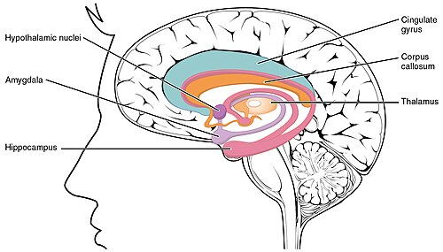

# TRANSTORNOS DE HUMOR

Para entender os transtornos de humor, você precisa primeiro desconstruir a ideia de que "estar triste" é depressão ou "estar feliz" é mania. Na prova de residência e na vida real, o humor é um **tônus vital**. Imagine o humor como o termostato de uma casa: ele não apenas registra a temperatura, ele a regula. Nos transtornos de humor, esse termostato quebrou.

*Figura 1 - Esquema de sinapse química/neural, útil para visualizar o local de ação de antidepressivos que modulam a neurotransmissão serotoninérgica e noradrenérgica. Fonte: Wikimedia Commons.*

## O Espectro do Humor: Do Unipolar ao Bipolar

A divisão clássica que as bancas adoram separa os transtornos em dois grandes grupos: os **Unipolares** (onde o paciente oscila apenas para "baixo" ou volta ao normal) e os **Bipolares** (onde há oscilação para "cima" — mania/hipomania — e para "baixo").

Por que essa distinção é a mais importante da sua prova? Porque se você tratar um bipolar com antidepressivo em monoterapia, você pode causar uma **virada maníaca**. Isso é erro grave e recorrente em questões de casos clínicos.

### Transtorno Depressivo Maior (TDM)

O TDM não é uma tristeza reativa. É uma síndrome biológica. A prevalência é altíssima (cerca de 15% ao longo da vida), sendo mais comum em mulheres (2:1).

**Critérios Diagnósticos (DSM-5-TR):**
Para diagnosticar um Episódio Depressivo Maior, o paciente deve apresentar pelo menos **5 de 9 sintomas** por um período mínimo de **2 semanas**. Um desses sintomas deve ser obrigatoriamente **Humor Deprimido** ou **Anedonia** (perda de interesse ou prazer).

Os sintomas (mnemônico clássico: SIGECAPS):

- **S**leep (Sono): Insônia ou hipersonia.

- **I**nterest (Interesse): Anedonia.

- **G**uilt (Culpa): Sentimentos de inutilidade ou culpa excessiva.

- **E**nergy (Energia): Fadiga ou perda de energia.

- **C**oncentration (Concentração): Dificuldade de pensar ou decidir.

- **A**ppetite (Apetite): Perda ou ganho de peso/apetite.

- **P**sychomotor (Psicomotricidade): Agitação ou retardo psicomotor.

- **S**uicide (Suicídio): Ideação suicida ou planos.

**Dica de Professor:** A banca vai tentar te confundir com o luto. No luto, o afeto predominante é o vazio e a perda, ocorrendo em "ondas" (as pontadas de dor ao lembrar do falecido). Na depressão, o humor é persistentemente baixo e há uma autocrítica corrosiva e sentimentos de inutilidade que não costumam estar presentes no luto normal.

### Subtipos e Especificadores de Depressão

Aqui moram as pegadinhas. Fique atento a estes três:

- **Depressão com Características Atípicas:** O paciente tem "reatividade do humor" (fica alegre se algo bom acontece), ganho de peso, hipersonia e uma sensação de "paralisia de chumbo" nos membros.

- **Depressão com Características Psicóticas:** O paciente apresenta delírios ou alucinações. Importante: os delírios costumam ser **congruentes com o humor** (culpa, ruína, morte, pecado, doença incurável). Se o paciente acha que é o mestre do universo enquanto está deprimido, o delírio é incongruente e você deve pensar em outra coisa.

- **Depressão Melancólica:** É a forma grave, com anedonia quase total, despertar precoce (pelo menos 2 horas antes do habitual) e piora dos sintomas pela manhã.

*Figura 2 - Lobo límbico/sistema límbico, região funcionalmente relacionada à regulação emocional e motivacional; a imagem serve como apoio anatômico para a fisiopatologia dos transtornos de humor. Fonte: Wikimedia Commons.*

## Transtorno Bipolar (TB)

O Transtorno Bipolar é definido pela presença de episódios de mania ou hipomania.

- **Tipo I:** Exige pelo menos um **episódio de Mania**. Não é obrigatório ter tido depressão para o diagnóstico (embora 99% tenham).

- **Tipo II:** Exige pelo menos um episódio de **Hipomania** E pelo menos um episódio de **Depressão Maior**. Se o paciente teve uma mania na vida, ele é Tipo I para sempre.

**Diferença Crucial: Mania vs. Hipomania**

| Característica | Mania | Hipomania |
| --- | --- | --- |
| **Duração Mínima** | 7 dias (ou qualquer duração se internado) | 4 dias |
| **Prejuízo Funcional** | Grave (trabalho, social, família) | Leve/Moderado (não desorganiza) |
| **Hospitalização** | Frequentemente necessária | Nunca necessária por definição |
| **Sintomas Psicóticos** | Pode apresentar | NUNCA apresenta |

**Por que isso cai?** Porque o aluno tende a achar que hipomania é só uma "alegria maior". Não. Na hipomania, o paciente está nitidamente diferente do seu habitual, mas ele ainda consegue operar no mundo. Se o paciente precisou ser internado ou começou a ouvir vozes, o diagnóstico "subiu" para Mania automaticamente.

### Transtorno Ciclotímico

É o "primo mais leve" do Bipolar. O paciente apresenta períodos de sintomas hipomaníacos e períodos de sintomas depressivos que **não fecham critérios** para episódio maior, por pelo menos **2 anos** (1 ano em crianças). É um humor flutuante crônico.

## Fisiopatologia: O "Porquê" dos Sintomas

Não decore apenas que falta serotonina. Entenda o sistema.
A hipótese monoaminérgica sugere um déficit de Serotonina (5-HT), Noradrenalina (NE) e Dopamina (DA) na fenda sináptica.

- **Serotonina:** Regula humor, sono, apetite e ansiedade.

- **Noradrenalina:** Regula energia, foco e alerta.

- **Dopamina:** Regula prazer, motivação e recompensa.

Por que o antidepressivo demora 2 a 4 semanas para funcionar se ele aumenta a serotonina na hora? Porque o efeito real não é o aumento do neurotransmissor, mas a **down-regulation** (dessensibilização) de receptores pós-sinápticos e o aumento da expressão de fatores neurotróficos como o **BDNF** (Brain-Derived Neurotrophic Factor), que promove neuroplasticidade. Como sempre reforçamos no MedEvo, a psiquiatria é neurobiologia pura.

## Diagnóstico Diferencial e Condições Médicas

Antes de carimbar "Depressão", você deve excluir causas orgânicas. Isso é o que separa o médico do leigo.

- **Hipotireoidismo:** TSH elevado pode mimetizar depressão perfeitamente.

- **Anemia:** Fadiga e adinamia.

- **Acidente Vascular Cerebral (AVC):** Lesões no giro pré-frontal esquerdo ou gânglios da base à esquerda têm uma associação altíssima com depressão pós-AVC.

- **Medicamentos:** Betabloqueadores (especialmente os lipofílicos como Propranolol) podem causar sintomas depressivos e insônia. Corticosteroides (Dexametasona/Prednisona) são vilões clássicos: podem induzir tanto depressão grave quanto mania e psicose.

**Atenção ao Idoso:** No idoso, a depressão pode se apresentar como déficit cognitivo (dificuldade de memória, atenção). Chamamos isso de **Pseudodemência**. A diferença? O deprimido se queixa muito da falta de memória ("Não sei", "Não lembro"), enquanto o demente tenta disfarçar ou minimizar os lapsos. Use a **Escala de Depressão Geriátrica (GDS-15)** para rastreio.

## Tratamento Farmacológico da Depressão

A regra de ouro: **Individualize**. Não existe "o melhor" antidepressivo, existe o melhor para *aquele* paciente.

### 1. Inibidores Seletivos da Recaptação de Serotonina (ISRS)

São a primeira linha para quase tudo.

- **Sertralina (50-200mg):** Muito segura em cardiopatas (pós-IAM).

- **Fluoxetina (20-60mg):** Meia-vida longa (boa para quem esquece de tomar), mas pode ser muito estimulante no início.

- **Escitalopram (10-20mg):** O mais seletivo, poucos efeitos colaterais e pouca interação medicamentosa.

- **Efeitos Colaterais Comuns:** Náuseas, cefaleia e, crucial para provas, **disfunção sexual** (redução de libido e atraso ejaculatório). Se o paciente estabilizou da depressão mas reclama da libido, a conduta é associar ou trocar por **Bupropiona**.

### 2. Inibidores da Recaptação de Serotonina e Noradrenalina (ISRSN - "Duais")

- **Venlafaxina (75-225mg) e Duloxetina (30-60mg):** Excelentes para depressão com sintomas físicos/dor crônica.

- **Cuidado:** Podem aumentar a pressão arterial (efeito noradrenérgico).

### 3. Antidepressivos Tricíclicos (ATC)

- **Amitriptilina, Nortriptilina, Clomipramina:** Muito eficazes, mas "sujos" (agem em muitos receptores).

- **Efeitos Anticolinérgicos:** Boca seca, constipação, retenção urinária, visão turva.

- **Efeitos Cardiovasculares:** Podem causar prolongamento do intervalo QT e hipotensão postural (bloqueio alfa-1). **NUNCA** use em idosos com risco de queda ou pacientes com bloqueio de ramo.

### 4. Atípicos

- **Mirtazapina (NaSSA):** Ótima para o idoso deprimido, pois causa **sedação e aumento do apetite** (ajuda a ganhar peso).

- **Bupropiona:** Inibidor de DA e NE. Não age na serotonina, por isso não causa disfunção sexual. É excelente para cessação tabágica, mas **contraindicada em pacientes com epilepsia** (baixa o limiar convulsivo) ou transtornos alimentares (risco de convulsão por distúrbio eletrolítico).

### 5. Depressão Refratária

Se o paciente não respondeu a dois esquemas adequados, consideramos depressão refratária.

- **Escetamina:** Antagonista do receptor NMDA, uso intranasal, ação rápida, indicada para risco iminente de suicídio ou refratariedade.

- **Eletroconvulsoterapia (ECT):** Ainda é o tratamento mais eficaz para depressão grave com risco de suicídio ou catatonia. Esqueça o estigma dos filmes; é feito sob anestesia e bloqueio neuromuscular.

## Manejo do Transtorno Bipolar

Aqui o jogo muda. O tratamento baseia-se em **Estabilizadores de Humor**.

### Lítio: O Padrão-Ouro

O lítio reduz o risco de suicídio e trata tanto mania quanto depressão bipolar.

- **Janela Terapêutica Estreita:** A litemia deve ser monitorada. Alvo: **0,6 a 1,2 mEq/L**.

- **Toxicidade (> 1,5 mEq/L):** Tremores grosseiros, ataxia, náuseas/vômitos, confusão mental.

- **Efeitos Adversos Crônicos:** Hipotireoidismo e diabetes insipidus nefrogênico.

- **Lactação:** Contraindicado (risco de hipotonia e toxicidade no lactente).

### Outros Estabilizadores

- **Valproato/Divalproato:** Excelente para episódios mistos e ciclagem rápida. **Teratogênico** (defeitos no tubo neural), evitar em mulheres em idade fértil.

- **Lamotrigina:** Ótima para a **fase depressiva** do transtorno bipolar e manutenção. Cuidado com a titulação lenta devido ao risco de **Síndrome de Stevens-Johnson**.

- **Antipsicóticos Atípicos (Quetiapina, Lurasidona):** São primeira linha para a **depressão bipolar**.

**Erro Clássico:** Paciente bipolar chega em depressão profunda. Você prescreve apenas Fluoxetina. Resultado: Em 3 dias ele está em cima do telhado achando que pode voar. **Nunca use antidepressivo sozinho no Bipolar Tipo I.** Se for usar, deve estar associado a um estabilizador (Lítio ou Valproato).

## Emergências Psiquiátricas: Risco de Suicídio

Toda consulta de transtorno de humor exige avaliação de risco de suicídio.
**Fatores de Risco:**

- Tentativa prévia (o fator preditor mais forte).

- Sexo masculino (cometem mais suicídio; mulheres tentam mais).

- Idade (idosos têm maior letalidade).

- Doenças crônicas/dor.

- Desesperança (o sintoma cardinal).

**Conduta:** Se o risco é alto (plano estruturado, acesso ao meio, ausência de suporte familiar), a internação (mesmo involuntária) é mandatória. Não se "promete" segredo ao paciente sobre ideação suicida.

## Saúde Mental e Trabalho

As bancas de Medicina de Família e Preventiva adoram este tópico.

- **Burnout (Síndrome do Esgotamento Profissional):** Tríade de exaustão emocional, despersonalização (cinismo) e baixa realização profissional.

- **Mobbing (Assédio Moral):** Humilhação repetitiva e prolongada no ambiente de trabalho.

- **Nexo Causal:** Antes de apenas medicar, o médico deve investigar se a doença é ocupacional. Se for, deve-se emitir a CAT (Comunicação de Acidente de Trabalho) e avaliar o afastamento pelo INSS.

## Tabelas Comparativas para Revisão Rápida

### Tabela 1: Resumo dos Antidepressivos

| Classe | Exemplos | Indicação Principal | "Pulo do Gato" (Efeito/Risco) |
| --- | --- | --- | --- |
| **ISRS** | Sertralina, Fluoxetina | 1ª linha Depressão/Ansiedade | Disfunção sexual é comum. |
| **ISRSN** | Venlafaxina, Duloxetina | Depressão + Dor Crônica | Pode aumentar a PA. |
| **ATC** | Amitriptilina, Nortriptilina | Depressão Grave/Insônia | Hipotensão postural e arritmias. |
| **NaSSA** | Mirtazapina | Idoso com insônia e perda de peso | Ganho de peso e sedação. |
| **IRND** | Bupropiona | Tabagismo / Depressão com fadiga | **Contraindicado em Epilepsia.** |

### Tabela 2: Estabilizadores de Humor

| Medicamento | Principal Indicação | Monitoramento Necessário |
| --- | --- | --- |
| **Lítio** | Mania, Depressão Bipolar, Suicídio | Litemia, Função Renal, Tireoide. |
| **Valproato** | Mania Aguda, Ciclagem Rápida | Função Hepática, Hemograma (Plaquetas). |
| **Lamotrigina** | Prevenção de Depressão Bipolar | Observar Rash Cutâneo (Stevens-Johnson). |
| **Quetiapina** | Mania e Depressão Bipolar | Perfil Lipídico e Glicemia (Ganho de peso). |

### Tabela 3: Diagnóstico Diferencial de Humor Elevado

| Critério | Mania | Hipomania | Ciclotimia |
| --- | --- | --- | --- |
| **Duração** | ≥ 7 dias | ≥ 4 dias | ≥ 2 anos |
| **Psicose** | Pode ter | Nunca | Nunca |
| **Internação** | Frequentemente | Não | Não |
| **Funcionalidade** | Prejuízo grave | Sem prejuízo grave | Oscilação leve |

## Situações Especiais e Comorbidades

### Gestação e Lactação

- **Lítio:** Risco de Anomalia de Ebstein (malformação da valva tricúspide), mas o risco absoluto é baixo (0,1%). Se a paciente é bipolar grave, muitas vezes mantemos o lítio com acompanhamento ecocardiográfico fetal.

- **Paroxetina:** Evitar no primeiro trimestre (risco de malformações cardíacas).

- **Sertralina:** Considerada uma das mais seguras para amamentação devido à baixa passagem pelo leite.

### Insônia

A **Terapia Cognitivo-Comportamental para Insônia (TCC-I)** é a primeira linha para insônia crônica. Farmacologicamente, para insônia inicial aguda (< 3 meses), priorizamos a higiene do sono. Se necessário usar fármacos, evite benzodiazepínicos em idosos pelo risco de quedas e delirium.

### Transtornos de Personalidade

Muitas vezes o "transtorno de humor" é, na verdade, uma instabilidade de um Transtorno de Personalidade Borderline.

- **Borderline:** Medo de abandono, relações intensas/instáveis, automutilação, sentimento de vazio. A flutuação do humor aqui é em horas, não em semanas. O tratamento principal é psicoterapia (Dialética comportamental), não apenas remédio.

## Pontos-Chave para Prova 🎯

- **Critério TDM:** ≥ 5 sintomas por ≥ 2 semanas (obrigatório humor deprimido ou anedonia).

- **Mania vs. Hipomania:** Mania = 7 dias + prejuízo grave/psicose. Hipomania = 4 dias + sem prejuízo grave.

- **Virada Maníaca:** Mania induzida por antidepressivo em paciente com depressão = Diagnóstico de Transtorno Bipolar Tipo I.

- **Lítio:** Único que comprovadamente reduz suicídio. Janela: 0,6-1,2. Contraindicado na lactação.

- **Sertralina:** Primeira escolha no pós-infarto e amamentação.

- **Bupropiona:** Não causa disfunção sexual, mas é contraindicada em epilépticos e bulímicos.

- **Mirtazapina:** Excelente para o idoso que não come e não dorme.

- **Amitriptilina:** Causa hipotensão postural (bloqueio alfa-1) e arritmias (prolonga QT).

- **Pseudodemência:** Idoso deprimido que parece demente, mas se queixa ativamente da memória.

- **Depressão Pós-AVC:** Comum em lesões de hemisfério esquerdo (frontal).

- **Betabloqueadores:** Podem causar depressão e insônia (especialmente Propranolol).

- **Corticoides:** Podem causar mania, depressão ou psicose.

- **Risco de Suicídio:** Tentativa prévia é o maior fator de risco. Sempre investigar ativamente.

- **Disfunção Sexual por ISRS:** Conduta é trocar ou associar Bupropiona.

- **Luto:** Diferencia-se da depressão pela preservação da autoestima e caráter episódico da dor.

- **Transtorno Ciclotímico:** Sintomas leves por ≥ 2 anos.

- **O que NÃO fazer:** Nunca usar Benzodiazepínico como tratamento isolado para depressão. Eles não tratam o humor, apenas a ansiedade/insônia.

- **O que NÃO fazer:** Nunca iniciar antidepressivo em monoterapia se houver suspeita de transtorno bipolar.

Lembre-se: na prova, o examinador quer saber se você sabe diagnosticar a gravidade (mania vs. hipomania), se você sabe escolher o remédio certo para o perfil do paciente (idoso, cardiopata, obeso) e se você sabe identificar quando o problema não é "da cabeça", mas do corpo (tireoide, AVC, remédios). Como dizemos no MedEvo, o bom psiquiatra é, antes de tudo, um excelente clínico.

 Cópia offline para consulta pessoal.
 Fonte original:
 [https://www.medevo.com.br/material-apoio/ler/4d249e4d-3289-4c43-90aa-164a564520ea](https://www.medevo.com.br/material-apoio/ler/4d249e4d-3289-4c43-90aa-164a564520ea)
