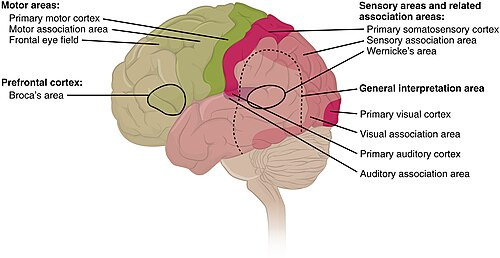
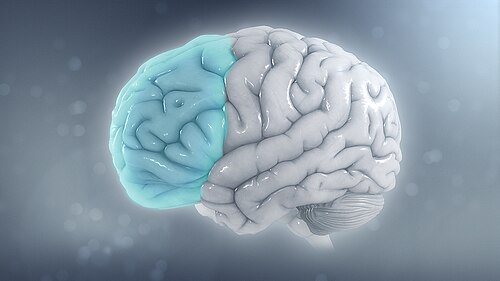

# TRANSTORNOS DO NEURODESENVOLVIMENTO

Os transtornos do neurodesenvolvimento representam um grupo de condições que se manifestam precocemente, geralmente antes de a criança ingressar na escola. Eles são caracterizados por déficits no desenvolvimento que acarretam prejuízos no funcionamento pessoal, social, acadêmico ou profissional.

Para a sua prova de residência, o segredo não é decorar uma lista de sintomas, mas entender a trajetória do desenvolvimento. Se você souber o que é normal, o patológico saltará aos seus olhos.

## Desenvolvimento da Linguagem e Seus Desvios

A linguagem é, frequentemente, a primeira "bandeira vermelha" que traz a família ao consultório. O pediatra deve ser o guardião dos marcos do desenvolvimento. De acordo com a atualização da Sociedade Brasileira de Pediatria (SBP) de 2024, baseada nos critérios do CDC, precisamos estar atentos a janelas específicas.

### Marcos de Ouro da Linguagem

Se um aluno me pergunta qual o dado mais cobrado em provas sobre linguagem, eu respondo sem hesitar: a idade de 2 anos. Por quê? Porque é o momento da "explosão do vocabulário" e da combinação de palavras.

- **2 meses:** Início do arrulho (sons vocálicos) e sorriso social.

- **6 meses:** Balbucio (sons consonantais como "ba-ba", "da-da").

- **12 meses:** Primeiras palavras com significado (geralmente "mamã" ou "papá" direcionados).

- **18 meses:** Vocabulário de 10 a 20 palavras; aponta para mostrar algo de interesse.

- **24 meses (2 anos):** Combina pelo menos duas palavras (ex: "quer água", "dá bola"). Metade da fala deve ser inteligível para estranhos.

- **3 anos:** Fala frases completas; 75% da fala é inteligível.

### Transtorno do Desenvolvimento da Linguagem (TDL)

Aqui reside uma pegadinha clássica. Antigamente, usávamos o termo Transtorno Específico da Linguagem (TEL). As diretrizes mais recentes e o consenso internacional (CATALISE) consolidaram o termo **Transtorno do Desenvolvimento da Linguagem (TDL)**.

O TDL é definido como uma dificuldade persistente na aquisição e uso da linguagem (fala, escrita ou sinais) que não pode ser explicada por:

- Perda auditiva.

- Disfunção neurológica motora.

- Deficiência intelectual (QI abaixo de 70).

- Transtorno do Espectro Autista (TEA).

Por que chamamos de "específico" ou "do desenvolvimento"? Porque a criança é perfeitamente capaz em outras áreas. Ela interage bem, brinca de forma funcional e tem inteligência normal, mas a ferramenta da linguagem está "quebrada". Na prova, se o enunciado descreve uma criança com atraso de fala, mas que aponta, faz contato visual e tem bom desenvolvimento motor, pense em TDL.

### Tabela 1: Diferenciação dos Atrasos de Linguagem

| Condição | Interação Social | Brincar | Causa Identificável |
| --- | --- | --- | --- |
| **TDL (antigo TEL)** | Preservada | Funcional e simbólico | Nenhuma (é primário) |
| **TEA** | Prejudicada | Restrito/Repetitivo | Neurobiológica |
| **Deficiência Intelectual** | Proporcional ao QI | Globalmente atrasado | Genética/Ambiental |
| **Privação Sensorial** | Depende do estímulo | Normal | Perda auditiva |

*Figura 1 - Áreas corticais do cérebro humano (motoras, sensoriais e de associação), substrato anatômico que sustenta a aquisição de marcos do neurodesenvolvimento. Fonte: OpenStax Anatomy & Physiology, CC BY 4.0 | Wikimedia Commons*

## Transtorno do Espectro Autista (TEA)

O TEA é, sem dúvida, o tema mais quente em neurologia pediátrica atualmente. Em outubro de 2025, a Sociedade Brasileira de Neurologia Infantil (SBNI) publicou novas diretrizes que reforçam o diagnóstico essencialmente clínico. Não existe exame de sangue ou de imagem que confirme autismo.

### Critérios Diagnósticos (DSM-5-TR)

Para fechar o diagnóstico, a criança deve apresentar déficits em dois domínios principais:

**Domínio A: Comunicação Social e Interação Social**
A criança precisa apresentar déficits em TODOS os três itens abaixo:

- **Reciprocidade socioemocional:** Dificuldade em iniciar ou responder a interações, ou em compartilhar interesses.

- **Comunicação não verbal:** Contato visual pobre, falta de gestos (não aponta), expressões faciais limitadas.

- **Desenvolvimento e manutenção de relacionamentos:** Dificuldade em fazer amigos ou em ajustar o comportamento a diferentes contextos sociais.

**Domínio B: Padrões Restritos e Repetitivos de Comportamento**
A criança precisa apresentar pelo menos DOIS dos quatro itens abaixo:

- **Movimentos motores, uso de objetos ou fala estereotipados:** Enfileirar brinquedos, ecolalia (repetir o que o outro diz), *flapping* de mãos.

- **Insistência na mesmice:** Sofrimento extremo com mudanças na rotina, rituais de saudação ou de alimentação.

- **Interesses fixos e altamente restritos:** Foco intenso em temas incomuns (ex: horários de trens, marcas de aspirador de pó).

- **Hiper ou hiporreatividade sensorial:** Indiferença aparente à dor, incômodo excessivo com ruídos (tapar os ouvidos) ou fascinação visual por luzes/movimentos.

### Níveis de Suporte

A diretriz da SBNI de 2025 enfatiza que o autismo não é "leve" ou "grave", mas sim definido pelo **nível de suporte** necessário.

- **Nível 1 (Exige suporte):** Dificuldades na comunicação social que causam prejuízos notáveis sem apoio. Inflexibilidade causa interferência em um ou mais contextos.

- **Nível 2 (Exige suporte substancial):** Déficits marcantes na comunicação verbal e não verbal. Inflexibilidade de comportamento é óbvia para o observador casual.

- **Nível 3 (Exige suporte muito substancial):** Déficits graves na comunicação. Grande sofrimento para mudar o foco ou a ação.

### Investigação Complementar: O que pedir?

Cuidado com o excesso de exames. A SBNI (2025) é clara: exames laboratoriais (erros inatos do metabolismo, cariótipo, CGH-Array) e de imagem (Ressonância de Crânio) **não devem ser feitos de rotina**.

Eles são indicados apenas se houver:

- Dismorfismos físicos.

- Micro ou macrocefalia.

- Crises epilépticas.

- Regressão de marcos do desenvolvimento (perder o que já tinha ganho).

- História familiar de deficiência intelectual sem causa.

O teste de triagem padrão-ouro no Brasil para crianças entre 16 e 30 meses é o **M-CHAT-R/F**. Se o resultado for de risco moderado ou alto, a intervenção deve começar IMEDIATAMENTE, mesmo antes do diagnóstico definitivo. No MedEvo, sempre batemos na tecla: "atraso no desenvolvimento não espera diagnóstico para ser tratado".

*Figura 2 - Imagem ilustrativa de redução de volume cerebral no hemisfério esquerdo associada ao TDAH, achado descrito em estudos de neuroimagem em portadores do transtorno (não é critério diagnóstico, que permanece clínico). Fonte: Wikimedia Commons, CC BY-SA 4.0*

## Transtorno de Déficit de Atenção e Hiperatividade (TDAH)

O TDAH é o transtorno do neurodesenvolvimento mais comum em idade escolar. O diagnóstico é clínico e exige que os sintomas estejam presentes em pelo menos **dois ambientes** (ex: casa e escola) e tenham iniciado antes dos **12 anos**.

### O Tripé Sintomático

- **Desatenção:** Erros por descuido, dificuldade em manter o foco, parece não ouvir quando chamado, perde objetos, esquece atividades diárias.

- **Hiperatividade:** Inquietude motora (não para sentado), corre ou escala em situações impróprias, fala em excesso.

- **Impulsividade:** Responde antes da pergunta terminar, dificuldade em esperar a vez, interrompe os outros.

Para crianças até 16 anos, são necessários pelo menos **6 sintomas** de desatenção e/ou **6 sintomas** de hiperatividade/impulsividade. Para adolescentes acima de 17 anos e adultos, o ponto de corte cai para **5 sintomas**.

### Tratamento Farmacológico

O tratamento de primeira escolha no Brasil são os estimulantes. Eles agem aumentando a disponibilidade de dopamina e noradrenalina na fenda sináptica do córtex pré-frontal.

### Tabela 2: Farmacoterapia do TDAH no Brasil

| Medicamento | Classe | Dose Inicial | Observações |
| --- | --- | --- | --- |
| **Metilfenidato (Ritalina)** | Estimulante (Curta duração) | 5 mg (1-2x/dia) | Duração de 3-4h. Útil para ajuste inicial. |
| **Metilfenidato (LA/Concerta)** | Estimulante (Longa duração) | 10-18 mg/dia | Cobertura de 8-12h. Melhora adesão escolar. |
| **Lisdexamfetamine (Venvanse)** | Estimulante (Pró-fármaco) | 30 mg/dia | Menor potencial de abuso; efeito muito estável. |
| **Atomoxetina** | Não-estimulante (Inibidor de recaptação de NA) | 0,5 mg/kg/dia | Segunda linha ou se houver tiques/ansiedade. |

**Contraindicações Absolutas aos Estimulantes:**

- Glaucoma de ângulo estreito.

- Uso de Inibidores da MAO nos últimos 14 dias.

- Psicose ativa ou transtorno bipolar não controlado.

- Doença cardiovascular grave (arritmias complexas, cardiomiopatia).

## Deficiência Intelectual (DI)

A Deficiência Intelectual substituiu o antigo termo "retardo mental". Para o diagnóstico, não basta um QI baixo. Precisamos de três critérios:

- Déficits em funções intelectuais (raciocínio, solução de problemas, planejamento).

- Déficits em funções adaptativas (autonomia, responsabilidade social, comunicação).

- Início durante o período do desenvolvimento.

Um erro comum em provas é achar que o diagnóstico de DI é feito apenas por testes de QI. Lembre-se: o funcionamento adaptativo é o que determina o nível de gravidade (leve, moderado, grave ou profundo), e não apenas o escore numérico do teste.

## Diagnóstico Diferencial e Comorbidades

Raramente um transtorno do neurodesenvolvimento vem sozinho. O Dr. Will sempre lembra nas discussões de caso: "se você achou um, procure o segundo".

- **TDAH + TEA:** Comorbidade frequente. A criança pode ter a rigidez do autismo e a desatenção do TDAH.

- **TDAH + Transtorno Opositor Desafiador (TOD):** Cerca de 40-50% das crianças com TDAH apresentam comportamentos desafiadores e de confronto com figuras de autoridade.

- **TEA + Deficiência Intelectual:** Aproximadamente 30% das pessoas com TEA possuem DI associada.

### Tabela 3: Diagnóstico Diferencial de Agitação Psicomotora

| Suspeita | Pista Clínica | Conduta Diferenciadora |
| --- | --- | --- |
| **TDAH** | Agitação em todo lugar, impulsivo | Responde bem a estimulantes |
| **Transtorno de Ansiedade** | Agitação ligada a preocupações | Piora com estimulantes |
| **TEA** | Agitação por desregulação sensorial | Foco na comunicação e rotina |
| **Hipotireoidismo** | Raramente causa agitação (mais lentidão) | Dosagem de TSH/T4L |
| **Privação de Sono** | Irritabilidade e desatenção diurna | Higiene do sono |

## Manejo Não Farmacológico

Nenhuma pílula substitui a terapia. Para o TEA, a diretriz da SBNI de 2025 reforça as intervenções baseadas em **Análise do Comportamento Aplicada (ABA)** como as de maior evidência.

Para o TDAH, o treinamento de pais e as adaptações escolares são fundamentais.

- **Escola:** Sentar na frente, provas em local silencioso, tempo adicional (geralmente +50% do tempo regular), fragmentação de tarefas longas.

- **Estilo de Vida:** Atividade física regular (mínimo 60 minutos/dia de atividade moderada a vigorosa) ajuda na regulação dopaminérgica. Higiene do sono rigorosa é mandatória, pois a privação de sono mimetiza sintomas de desatenção.

## Pontos-Chave para Prova

- **TDL (TEL):** Atraso de linguagem com inteligência e interação social normais. É um diagnóstico de exclusão.

- **TEA - Domínio A:** Exige déficits em reciprocidade, comunicação não verbal e relacionamentos (os 3 itens).

- **TEA - Domínio B:** Exige pelo menos 2 itens (estereotipias, rotinas, interesses restritos ou alterações sensoriais).

- **M-CHAT-R/F:** Deve ser aplicado entre 16 e 30 meses para triagem de autismo.

- **TDAH - Idade:** Sintomas devem estar presentes antes dos 12 anos e em dois ou mais ambientes.

- **TDAH - Tratamento:** Metilfenidato é a primeira escolha. Monitorar peso, altura (risco de redução de apetite) e pressão arterial.

- **Contraindicação Absoluta:** Nunca use estimulantes se o paciente usou IMAO nas últimas 2 semanas.

- **Regressão de Linguagem:** Sempre é um sinal de alerta grave. Pense em TEA ou Síndrome de Landau-Kleffner (epilepsia).

- **Exames de Imagem:** Não são rotina no TEA ou TDAH. Peça apenas se houver sinais neurológicos focais ou macrocefalia.

- **Marcos aos 2 anos:** 2 anos = 2 palavras juntas. Se não faz isso, é atraso.

- **Níveis de Suporte:** O TEA é classificado pela necessidade de apoio (1, 2 ou 3), não mais por "Asperger" ou "Autismo Clássico".

- **Comorbidade TOD:** Se a criança é agressiva e desafiadora, pense em Transtorno Opositor Desafiador associado ao TDAH.

- **Fator de Risco:** Prematuridade e baixo peso ao nascer são fatores de risco consistentes para quase todos os transtornos do neurodesenvolvimento.

- **O que NÃO fazer:** Não prescrever dietas restritivas (sem glúten/caseína) ou ozonioterapia para autismo; a SBNI 2025 condena essas práticas por falta de evidência.

- **Canabidiol:** Segundo a SBNI (2025), o uso no TEA ainda é considerado experimental e não deve ser indicado como tratamento de primeira linha para os sintomas centrais. 🚀

 Cópia offline para consulta pessoal.
 Fonte original:
 [https://www.medevo.com.br/material-apoio/ler/a1a5c985-2604-40d7-80ab-0c6f29a9b063](https://www.medevo.com.br/material-apoio/ler/a1a5c985-2604-40d7-80ab-0c6f29a9b063)
