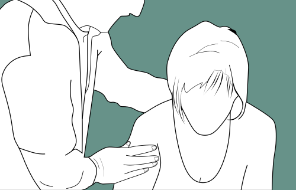
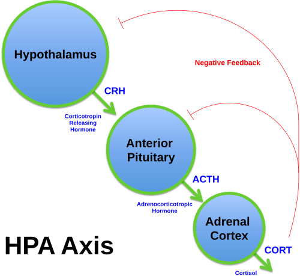

# TRANSTORNOS MENTAIS COMUNS NA APS

Os Transtornos Mentais Comuns (TMC) representam a maior parte da demanda de saúde mental na Atenção Primária à Saúde (APS). Se você espera encontrar apenas esquizofrenia ou transtorno bipolar grave na Unidade Básica de Saúde (UBS), você está focado no lugar errado. O que domina o dia a dia do Médico de Família e Comunidade são sintomas depressivos, ansiosos e somatizações que, embora não preencham todos os critérios rígidos de um transtorno psicótico, geram incapacidade funcional significativa.

Estima-se que cerca de 23% a 30% dos pacientes que procuram a APS apresentam critérios para TMC. O grande desafio, e o que as bancas de residência adoram cobrar, é que esses pacientes raramente chegam dizendo "estou deprimido". Eles chegam com "dor no corpo", "má digestão" ou "insônia". É aqui que entra a sua capacidade clínica de enxergar além do sintoma físico.

*Figura 1 - Profissional de saúde em atendimento, representando a abordagem biopsicossocial na atenção primária. Fonte: National Cancer Institute, Domínio Público | Wikimedia Commons*

## O Modelo Biopsicossocial e a Abordagem Centrada na Pessoa

Para entender os TMC, você precisa abandonar o modelo biomédico tradicional, que busca apenas uma lesão orgânica para explicar a dor. Na APS, trabalhamos com o modelo biopsicossocial. Isso significa entender que o sofrimento psíquico é moldado por fatores biológicos (genética, neurotransmissores), psicológicos (história de vida, resiliência) e sociais (desemprego, violência de gênero, isolamento).

Um conceito fundamental para sua prova é a distinção entre *Disease* (Doença) e *Illness* (Enfermidade/Adoecimento). Enquanto a *disease* é o processo patológico sob a ótica médica, a *illness* é a experiência subjetiva do paciente, como ele sente e como isso impacta sua vida. O Método Clínico Centrado na Pessoa (MCCP) é a ferramenta de ouro aqui. Ele foca em quatro componentes principais: explorar a saúde, a doença e a experiência da doença; entender a pessoa como um todo; elaborar um plano conjunto de manejo; e fortalecer a relação médico-pessoa.

### Sintomas Sem Explicação Médica (SSM) e Somatização

Cuidado com este dado: cerca de 1/3 dos sintomas físicos atendidos na APS não possuem uma causa orgânica clara após investigação inicial. Estes são os Sintomas Sem Explicação Médica (SSM). As bancas frequentemente colocam casos de pacientes com múltiplas queixas (cefaleia, dor abdominal, mialgia) e exames normais.

Erro clássico: achar que, se o exame deu normal, o paciente não tem nada ou está "fingindo". Na verdade, esses sintomas são formas de comunicação indireta de um sofrimento mental. Menos de 5% desses casos são causados diretamente por uma depressão ou ansiedade clássica de livro, mas a grande maioria indica um sofrimento psíquico subjacente que exige acolhimento e escuta ativa, não apenas mais exames.

## Depressão e Ansiedade na APS

A depressão na APS muitas vezes se apresenta de forma atípica. Em idosos, por exemplo, a "pseudodemência depressiva" é comum: o paciente parece ter déficit cognitivo, mas o quadro é, na verdade, um humor deprimido grave.

### Diagnóstico e Rastreio

O rastreio pode ser feito com perguntas simples (PHQ-2): "No último mês, você se sentiu triste, deprimido ou sem esperança?" e "No último mês, você sentiu pouco interesse ou prazer em fazer as coisas?". Se uma for positiva, avançamos para o PHQ-9.

### Manejo Terapêutico

O tratamento não é sinônimo de fluoxetina para todos. Em casos leves, a conduta inicial deve ser o suporte psicossocial, atividade física (mínimo 150 minutos por semana de intensidade moderada) e higiene do sono.

Quando partimos para a farmacologia, os Inibidores Seletivos da Recaptação de Serotonina (ISRS) são a primeira escolha.

- **Sertralina:** 25mg a 50mg inicial, excelente para idosos e cardiopatas.

- **Fluoxetina:** 20mg inicial, cuidado com a meia-vida longa em idosos.

**Dica de Prova:** A resposta terapêutica demora de 2 a 4 semanas. Nunca mude a medicação ou aumente a dose antes desse período, a menos que haja efeitos colaterais intoleráveis.

*Figura 2 - Estetoscópio, símbolo da prática médica e da saúde mental na atenção primária. Fonte: Domínio Público | Wikimedia Commons*

## Suicídio: Avaliação de Risco e Conduta

Este é, sem dúvida, o tema mais cobrado em Saúde Mental na Preventiva. Você precisa saber estratificar o risco e saber o que fazer com cada nível.

### Fatores de Risco e Proteção

- **Risco:** Tentativa prévia (principal fator preditor), transtorno mental diagnóstico, sexo masculino (cometem mais), solidão, acesso a meios letais, eventos estressores agudos.

- **Proteção:** Senso de responsabilidade com a família (filhos pequenos), religiosidade (quando não punitiva), rede de apoio sólida.

### Estratificação de Risco

- **Risco Baixo:** Ideação passageira, sem plano, sem tentativa prévia. Conduta: Acompanhamento na UBS, fortalecer rede de apoio, pactuar "contrato de segurança".

- **Risco Médio:** Ideação persistente, plano vago, mas sem tentativa imediata. Conduta: Encaminhamento prioritário para saúde mental, vigilância da família, considerar medicação.

- **Risco Alto:** Plano estruturado, tentativa recente, acesso ao meio, desesperança extrema. Conduta: Encaminhamento imediato para emergência psiquiátrica ou hospital geral. O paciente não deve sair sozinho da unidade.

**Atenção à Notificação:** A tentativa de suicídio e a autoagressão são de **notificação compulsória imediata** (em até 24h) no SINAN. A ideação suicida isolada, embora exija cuidado clínico, não é objeto de notificação compulsória. Como o Dr. Will sempre reforça em suas discussões no MedEvo, perguntar sobre suicídio NÃO induz o paciente ao ato; pelo contrário, oferece o alívio de ser ouvido.

## Luto: Quando deixa de ser normal?

O luto é uma reação fisiológica à perda. Não é doença. A diretriz brasileira e as pérolas clínicas de prova sugerem que o luto agudo pode durar até 6 meses (ou mais, dependendo da cultura), sem que isso exija medicalização.

| Característica | Luto Normal | Depressão Maior |
| --- | --- | --- |
| **Sentimento predominante** | Vazio e perda (ondas de dor) | Humor deprimido persistente, anedonia |
| **Autoestima** | Geralmente preservada | Sentimento de inutilidade e culpa excessiva |
| **Ideação suicida** | Focada em "reunir-se" com o falecido | Focada em acabar com a própria dor |
| **Evolução** | Melhora gradual com o tempo | Persistente e incapacitante |

**Conduta no Luto:** Acompanhamento longitudinal na APS, escuta ativa e validação do sofrimento. Evite prescrever benzodiazepínicos de rotina, pois eles podem patologizar um processo natural e dificultar a elaboração da perda.

## Uso Problemático de Substâncias e Redução de Danos

Na APS, o foco não é apenas a abstinência, mas a **Redução de Danos**. Este conceito é fundamental: visa diminuir as consequências negativas do uso de drogas sem necessariamente exigir a interrupção imediata do consumo, respeitando a autonomia do paciente.

### Álcool e o Modelo Transteórico (Prochaska e DiClemente)

As bancas amam cobrar em qual estágio o paciente está para definir a abordagem:

- **Pré-contemplação:** Não vê o uso como problema. Conduta: Sensibilizar, sem confrontar.

- **Contemplação:** Ambivalência ("Eu sei que faz mal, mas me relaxa"). Conduta: Pesar prós e contras.

- **Preparação:** Decidiu mudar e planeja como. Conduta: Definir data (dia D), estratégias.

- **Ação:** Mudou o comportamento há menos de 6 meses.

- **Manutenção:** Mudou há mais de 6 meses.

### Uso Problemático de Internet e Jogos

Com a pandemia, o "Hazardous Gaming" e o uso abusivo de mídias digitais por adolescentes cresceram. O impacto é biopsicossocial: privação de sono, sedentarismo, isolamento social e risco de autoagressão via desafios online. O manejo envolve higiene do sono e pactuação de limites com a família, evitando a medicalização precoce.

## Saúde Mental e Trabalho: Burnout

A Síndrome de Burnout (ou Síndrome do Esgotamento Profissional) agora é reconhecida na CID-11 como um fenômeno ocupacional. Ela se caracteriza por três dimensões:

- **Exaustão emocional:** Sensação de esgotamento de recursos físicos e mentais.

- **Despersonalização:** Atitude cínica ou distante em relação ao trabalho e às pessoas atendidas.

- **Baixa realização profissional:** Sentimento de ineficácia.

Diferente da depressão clássica, o Burnout é especificamente relacionado ao contexto laboral. O manejo envolve afastamento (se necessário), psicoterapia e, crucialmente, intervenções na organização do trabalho, não apenas no indivíduo.

## Ferramentas de Gestão do Cuidado na APS

Para organizar o cuidado de casos complexos de saúde mental, a APS utiliza ferramentas específicas que caem muito em provas de Medicina Preventiva.

### Matriciamento

Não é um simples encaminhamento. É um suporte técnico-pedagógico realizado por equipes especializadas (como o antigo NASF ou equipes de Saúde Mental) para a equipe de referência (Saúde da Família). O objetivo é aumentar a resolutividade da APS através de discussões de caso, interconsultas (atendimento conjunto) e construção de estratégias territoriais.

### Projeto Terapêutico Singular (PTS)

É um conjunto de propostas de condutas terapêuticas articuladas, para um sujeito ou coletividade, resultado da discussão coletiva de uma equipe interdisciplinar. O PTS é indicado para casos complexos, onde as intervenções padrão não são suficientes. Ele possui quatro momentos: diagnóstico, definição de metas, divisão de responsabilidades e reavaliação.

### Genograma e Ecomapa

- **Genograma:** Representação gráfica da estrutura familiar (pelo menos 3 gerações). Ajuda a identificar padrões de adoecimento e relações de conflito ou apoio.

- **Ecomapa:** Representa as relações da família com o meio externo (igreja, UBS, trabalho, vizinhos). Fundamental para avaliar a rede de apoio social.

## Ciclos de Vida e Situações Especiais

### Transtorno do Espectro Autista (TEA) na APS

O médico de família deve estar atento aos sinais precoces (atraso na fala, ausência de contato visual, movimentos estereotipados). No ambiente de pronto-socorro ou consulta, pacientes com TEA precisam de **previsibilidade e rotina**. A quebra de rotina é o principal gatilho para crises de agitação. O manejo deve ser acolhedor, evitando estímulos sensoriais excessivos (luzes fortes, barulho).

### Saúde Mental do Idoso

A solidão é um determinante social de saúde crítico no idoso. Diante de um declínio cognitivo, o primeiro passo é o rastreio com o Miniexame do Estado Mental (MMSE) ou o MoCA. No entanto, o MMSE sozinho não dá diagnóstico de demência. É obrigatório investigar causas reversíveis: hipotireoidismo, deficiência de vitamina B12, depressão e sífilis terciária.

### Violência Doméstica e de Gênero

A saúde mental feminina é profundamente impactada pela discriminação e violência. A Lei Maria da Penha define violência não apenas como física, mas também psicológica, sexual, patrimonial e moral. A violência psicológica (humilhação, isolamento, vigilância constante) é agravo de notificação compulsória. O papel da APS é o acolhimento, a escuta sem julgamentos e a articulação com a rede de proteção (CRAS, CREAS).

## Manejo da Agitação Psicomotora na Urgência

Embora o foco seja a APS, muitas vezes a crise chega na UBS. O manejo deve ser progressivo:

- **Contenção Verbal:** Sempre a primeira medida. Falar calmamente, manter distância segura, não confrontar.

- **Contenção Farmacológica:** Se a verbal falhar.

- **Haloperidol:** 2,5mg a 5mg (IM ou VO). Pode-se repetir a cada 30-60 minutos. Dose máxima diária recomendada em torno de 15mg a 20mg.

- Pode-se associar Prometazina (25mg) para reduzir o risco de sintomas extrapiramidais (distonia aguda).

- **Contenção Física:** Último recurso, realizada por equipe treinada, para proteger o paciente e a equipe. Deve ser documentada em prontuário e desfeita assim que a medicação fizer efeito.

## Prevenção Quaternária (P4) em Saúde Mental

Este é um conceito de ouro da Medicina de Família. A P4 consiste em identificar pacientes em risco de supermedicalização e protegê-los de intervenções médicas desnecessárias ou iatrogênicas.

Na saúde mental, isso significa:

- Não prescrever antidepressivos para tristezas normais da vida.

- Não usar benzodiazepínicos por tempo prolongado (risco de quedas em idosos e dependência).

- Evitar o "rótulo" de transtorno mental para problemas que são, na verdade, de ordem social ou econômica.

## Tabelas Comparativas para Revisão Rápida

### Tabela 1: Estágios de Mudança de Prochaska

| Estágio | Percepção do Paciente | Atitude do Médico |
| --- | --- | --- |
| **Pré-contemplação** | "Não tenho problema com o álcool." | Informar riscos de forma empática. |
| **Contemplação** | "Sei que bebo muito, mas me ajuda a dormir." | Trabalhar a ambivalência (balança decisória). |
| **Preparação** | "Vou parar de beber na próxima segunda." | Ajudar no planejamento e metas práticas. |
| **Ação** | "Estou sem beber há duas semanas." | Reforçar conquistas e prevenir recaídas. |
| **Manutenção** | "Não bebo há um ano." | Consolidar novo estilo de vida. |

### Tabela 2: Níveis de Prevenção em Saúde Mental

| Nível | Objetivo | Exemplo Prático |
| --- | --- | --- |
| **Primária** | Evitar que o transtorno surja. | Grupos de promoção de saúde, redução de estigma. |
| **Secundária** | Diagnóstico e tratamento precoce. | Rastreio de depressão (PHQ-2), avaliação de risco suicida. |
| **Terciária** | Reduzir incapacidades e reabilitar. | Grupos de apoio para pacientes com transtornos graves. |
| **Quaternária** | Evitar iatrogenia e medicalização. | Desprescrição de benzodiazepínicos em idosos. |

### Tabela 3: Diagnóstico Diferencial de Cefaleias Comuns na APS

| Tipo | Localização | Características | Sintomas Associados |
| --- | --- | --- | --- |
| **Tensional** | Holocraniana (em pressão/banda) | Intensidade leve a moderada | Ausência de náuseas ou foto/fonofobia. |
| **Enxaqueca** | Unilateral (pulsátil) | Intensidade moderada a grave | Náuseas, vômitos, foto e fonofobia. |
| **Arterite Temporal** | Região temporal (idosos) | Dor severa, claudicação de mandíbula | Risco de perda visual (urgência!). |

## Pontos-Chave para Prova

- **Sintomas Sem Explicação Médica (SSM):** 1/3 dos pacientes na APS apresentam; <5% são depressão/ansiedade pura; exigem abordagem biopsicossocial.

- **Suicídio:** Tentativa é notificação compulsória imediata. Ideação não se notifica. Perguntar sobre suicídio NÃO aumenta o risco.

- **Luto:** Processo normal até 6 meses; evitar medicalização precoce; diferenciar de depressão pela preservação da autoestima.

- **Matriciamento:** É suporte técnico-pedagógico e clínico; não é apenas encaminhar o paciente.

- **Burnout:** Fenômeno ocupacional (CID-11); tríade de exaustão, despersonalização e baixa realização.

- **Haloperidol:** Dose inicial de 2,5mg a 5mg para agitação; cuidado com distonias agudas (usar prometazina se necessário).

- **MMSE:** É teste de rastreio cognitivo, não fecha diagnóstico de demência isoladamente.

- **Prevenção Quaternária (P4):** Fundamental para evitar a patologização do sofrimento cotidiano e iatrogenias.

- **Grooming:** Manipulação psicológica de crianças/adolescentes para exploração sexual; conceito importante em violência infantil.

- **Benzodiazepínicos:** Evitar uso crônico, especialmente em idosos (risco de quedas, fraturas e declínio cognitivo).

- **Redução de Danos:** Estratégia ética e clínica que prioriza a autonomia e a redução de riscos, não apenas a abstinência.

- **Notificação SINAN:** Obrigatória para violência doméstica (física, psicológica, sexual) e tentativas de autoagressão.

- **TEA:** A previsibilidade e a manutenção da rotina são as melhores estratégias para evitar crises em ambientes de saúde.

- **Depressão no Idoso:** Frequentemente se apresenta como queixas somáticas ou déficit cognitivo (pseudodemência).

- **Protocolo SPIKES:** Utilizado para comunicação de más notícias (S-Setting, P-Perception, I-Invitation, K-Knowledge, E-Empathy, S-Strategy/Summary).

Lembre-se: na APS, o diagnóstico de demanda é essencial para planejar o processo de trabalho da equipe. Entender o perfil epidemiológico do seu território permite que você saia do modelo "queixa-conduta" e passe para um modelo de cuidado integral e resolutivo.

 Cópia offline para consulta pessoal.
 Fonte original:
 [https://www.medevo.com.br/material-apoio/ler/9e826b46-79ed-43ea-b2b5-0ce9c824689f](https://www.medevo.com.br/material-apoio/ler/9e826b46-79ed-43ea-b2b5-0ce9c824689f)
