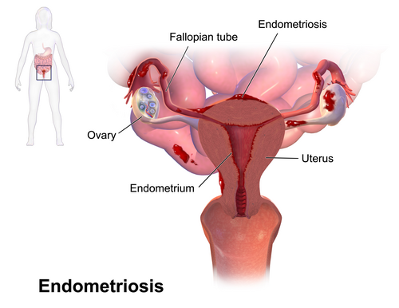

# TRATAMENTO CIRÚRGICO DA ENDOMETRIOSE

Para entender o tratamento cirúrgico da endometriose, você precisa primeiro tirar da cabeça a ideia de que "viu lesão, tem que operar". Na ginecologia moderna, e principalmente nas provas de residência baseadas nas diretrizes da FEBRASGO e da Sociedade Europeia de Reprodução Humana e Embriologia (ESHRE), o tratamento cirúrgico é uma ferramenta poderosa, mas que deve ser aplicada no momento certo.

A cirurgia não é a cura definitiva para todas as pacientes, pois a endometriose é uma doença crônica e estrogênio-dependente. O objetivo do cirurgião não é apenas "limpar a pelve", mas sim restaurar a anatomia, aliviar a dor e, quando desejado, melhorar o potencial fértil.

## Indicações Cirúrgicas: Quando parar o remédio e pegar o bisturi?

Muitos alunos erram questões por acharem que qualquer endometrioma ou qualquer foco de endometriose profunda exige cirurgia imediata. Isso é um erro clássico. Segundo as diretrizes atuais, as indicações precisas para intervenção cirúrgica são:

- Falha do tratamento clínico: Paciente que, mesmo em uso de bloqueio hormonal (como progestagênios contínuos ou análogos de GnRH), mantém dor pélvica crônica, dismenorreia progressiva ou dispareunia de profundidade que impacta a qualidade de vida.

- Contraindicação ao tratamento clínico: Pacientes com comorbidades que impedem o uso de hormônios.

- Obstrução de órgãos vitais: Aqui a cirurgia é mandatória. Se a endometriose está causando estenose ureteral com hidronefrose ou obstrução intestinal parcial/total, não há espaço para esperar o efeito do remédio.

- Endometriomas ovarianos volumosos ou suspeitos: Especialmente se houver dúvida diagnóstica com neoplasias ovarianas ou se o cisto for sintomático e maior que 3 a 4 cm em pacientes que desejam engravidar.

- Infertilidade: Em casos selecionados, onde a distorção anatômica por aderências é o fator impeditivo da gestação natural.

Lembre-se de uma pérola clínica importante: a presença de uma lesão em exame de imagem, por si só, sem sintomas associados e sem risco de perda de função orgânica, não é indicação de cirurgia. Como costumo dizer aos meus alunos no MedEvo, tratamos a paciente, não o laudo da ressonância.

## Avaliação Pré-operatória e o Papel do Exame Físico

Você não entra em uma cirurgia de endometriose sem um mapa. O padrão-ouro para o diagnóstico e planejamento cirúrgico envolve o mapeamento por ultrassonografia transvaginal com preparo intestinal ou a ressonância magnética de pelve com protocolo para endometriose.

No exame físico, a banca vai te cobrar a sensibilidade de identificar a nodularidade em fundo de saco vaginal ou o útero fixo e doloroso ao toque bimanual. Se a questão descreve "nódulo palpável em ligamento uterossacro", ela está te gritando que a paciente tem endometriose profunda e que o planejamento cirúrgico deve prever a abordagem desse compartimento posterior.

*Figura 1 - Estetoscópio, símbolo da prática médica e da abordagem cirúrgica da endometriose. Fonte: Domínio Público | Wikimedia Commons*

## A Técnica Cirúrgica: Laparoscopia como Padrão-Ouro

A videolaparoscopia é o padrão-ouro tanto para o diagnóstico definitivo (através da visualização direta e biópsia) quanto para o tratamento. A laparotomia (cirurgia aberta) deve ser evitada, pois a visualização dos focos de endometriose, que podem ser milimétricos, é muito superior com a óptica da laparoscopia.

### Excisão vs. Ablação

Este é um ponto de confusão frequente.

- Ablação: É a cauterização da superfície da lesão. É aceitável para focos superficiais (peritoneais), mas insuficiente para doença profunda.

- Excisão (Exérese): É a retirada completa da lesão com margens. Para endometriose profunda, a excisão é obrigatória.

Por que preferimos a excisão? Porque a ablação pode deixar tecido doente sob a cicatriz da cauterização, levando à persistência da dor e maior taxa de recorrência. Em provas, se a paciente tem endometriose profunda, a resposta correta envolverá quase sempre a exérese ou ressecção dos focos, não apenas a cauterização.

## Endometriose Ovariana: O Dilema do Endometrioma

O tratamento do endometrioma ovariano é um dos temas mais cobrados. O grande desafio aqui é a preservação da reserva ovariana.

A técnica de escolha é a cistectomia laparoscópica (retirada da cápsula do cisto). Por que não apenas drenar o líquido "achocolatado"? Porque a taxa de recorrência da simples aspiração ou drenagem beira os 100%. O epitélio que reveste o interior do cisto continua ativo e vai produzir conteúdo novamente em poucos meses.

No entanto, a cistectomia pode remover tecido ovariano sadio adjacente, reduzindo os níveis de Hormônio Anti-Mülleriano (AMH). Por isso, a indicação cirúrgica em mulheres jovens com desejo de fertilidade deve ser muito bem ponderada.

Dica de prova: Se a questão trouxer um endometrioma menor que 3 cm em paciente com dismenorreia leve, a primeira linha é o tratamento clínico (contraceptivo oral contínuo). A cirurgia entra se o cisto for maior que 3 a 4 cm, se houver dor refratária ou se a paciente for infértil e o cisto estiver atrapalhando o acesso aos folículos em uma eventual fertilização in vitro.

*Figura 2 - Profissional de saúde em atendimento, representando o acompanhamento pós-operatório da endometriose. Fonte: National Cancer Institute, Domínio Público | Wikimedia Commons*

## Endometriose Profunda e Infiltrativa

Consideramos endometriose profunda quando a lesão infiltra o peritônio em uma profundidade maior que 5 mm. Os locais mais comuns são os ligamentos uterossacros, o septo retovaginal, a vagina, o intestino e a bexiga.

### Abordagem dos Ligamentos Uterossacros

É o local mais frequente de endometriose profunda. A ressecção desses focos é fundamental para o alívio da dispareunia de profundidade. Em casos de dor pélvica crônica refratária, a neurectomia pré-sacral (interrupção das fibras nervosas simpáticas que conduzem a dor uterina) pode ser considerada como um procedimento adjunto, embora sua realização tenha diminuído com a melhoria das técnicas de excisão completa.

### Endometriose Intestinal

Aqui o examinador quer saber se você conhece as três técnicas principais:

- Shaving (Barbeamento): Retira-se apenas a lesão que está na serosa ou muscular externa, sem abrir a luz do intestino. É indicada para lesões pequenas (geralmente < 2 cm) e superficiais. Segundo o Dr. Will, essa é a técnica preferida em pacientes jovens com desejo de preservar ao máximo a função intestinal e a fertilidade, especialmente se a lesão for no sigmoide ou reto superior.

- Ressecção Discoide: Retira-se um "disco" da parede intestinal que contém a lesão e fecha-se o orifício. Indicada para lesões médias que infiltram a submucosa, mas não ocupam mais de 40 a 50% da circunferência da alça.

- Ressecção Segmentar (Enterectomia/Retossigmoidectomia): Retira-se um segmento inteiro do intestino, seguido de anastomose. Indicada para lesões grandes (> 3 cm), múltiplas ou que causam estenose importante da luz intestinal.

Cuidado: A lise de aderências (adesiólise) isolada NÃO garante a melhora da dor pélvica crônica. A dor na endometriose é multifatorial (inflamatória, neuropática e central), e apenas "soltar os órgãos" sem retirar os focos ativos de doença não resolve o problema a longo prazo.

## Endometriose do Trato Urinário

A endometriose pode acometer a bexiga ou os ureteres.

- Bexiga: O sintoma clássico é a dor suprapúbica e sintomas irritativos miccionais (disúria, polaciúria) que pioram no período menstrual. O tratamento é a cistectomia parcial (ressecção da área afetada da parede vesical).

- Ureter: É a forma mais perigosa, pois pode ser silenciosa. A lesão causa compressão extrínseca do ureter, levando à hidronefrose e, se não tratada, à perda da função renal.

Se você encontrar em uma questão uma paciente com endometriose profunda e hidronefrose, a conduta é videolaparoscopia para desobstrução ureteral e ressecção dos focos. Muitas vezes é necessário o uso de um cateter duplo J no pré ou per-operatório.

## Endometriose de Parede Abdominal

Este é um cenário clássico de prova: paciente com antecedente de cesariana que apresenta um nódulo doloroso na cicatriz cirúrgica, que aumenta de volume e dói mais durante a menstruação.
O diagnóstico é endometrioma de parede abdominal. O tratamento de escolha aqui não é clínico; é a ressecção cirúrgica completa da lesão com margens livres, para evitar a recorrência local.

## Tratamento Adjuvante e Pós-Operatório

A cirurgia não é o fim do tratamento, mas sim um novo começo. A taxa de recorrência da endometriose após a cirurgia é significativa se a paciente voltar a ciclar (menstruar).

Por isso, o tratamento adjuvante é fundamental. As opções de primeira escolha para controle da dor e prevenção de recorrência pós-cirúrgica são:

- Progestagênios contínuos (ex: Desogestrel 75 mcg/dia).

- DIU de Levonorgestrel (Mirena).

- Contraceptivos combinados em regime contínuo.

Se a paciente tem dor persistente após a cirurgia e ainda não definiu sua prole (desejo gestacional futuro), os análogos de GnRH podem ser utilizados. No entanto, se o uso for superior a 6 meses, é obrigatória a terapia de "add-back" (reposição de doses baixas de estrogênio e progesterona) para prevenir a perda de massa óssea e os sintomas vasomotores intensos.

## Tabelas Comparativas para Revisão Rápida

### Tabela 1: Indicações de Cirurgia no Endometrioma Ovariano

| Critério | Conduta Sugerida |
| --- | --- |
| Tamanho < 3 cm e Assintomático | Observação ou Tratamento Clínico |
| Tamanho > 3-4 cm e Desejo de Gravidez | Cistectomia Laparoscópica |
| Dor Pélvica Refratária | Cistectomia Laparoscópica |
| Suspeita de Malignidade (Dúvida no USG) | Exérese com Congelação |
| Infertilidade (Dificulta acesso aos folículos) | Cistectomia ou Aspiração (se FIV iminente) |

### Tabela 2: Técnicas na Endometriose Intestinal

| Técnica | Indicação Principal | Vantagem |
| --- | --- | --- |
| Shaving | Lesões superficiais, < 2 cm | Menor risco de fístula e complicações |
| Ressecção Discoide | Lesão infiltrativa única, < 3 cm | Preserva a maior parte da alça |
| Ressecção Segmentar | Lesões múltiplas ou estenosantes | Ressecção completa da doença extensa |

### Tabela 3: Tratamento Clínico vs. Cirúrgico

| Aspecto | Tratamento Clínico | Tratamento Cirúrgico |
| --- | --- | --- |
| Objetivo | Controle de sintomas e progressão | Restauração anatômica e exérese |
| Primeira Linha | Dismenorreia leve a moderada | Falha clínica ou obstrução orgânica |
| Efeito na Lesão | Atrofia (não desaparece) | Remoção física |
| Fertilidade | Contraceptivo (impede gestação atual) | Pode restaurar fertilidade natural |

## Situações Especiais e Erros Comuns

Um erro clássico que vejo em provas é o aluno marcar histerectomia com anexectomia bilateral (retirada de útero e ovários) como primeira opção para mulheres jovens. Essa é uma cirurgia radical, reservada para casos de dor extrema, refratária a todos os tratamentos, em mulheres que já têm prole constituída e que compreendem os riscos da menopausa cirúrgica precoce. Mesmo após a histerectomia, se focos de endometriose profunda forem deixados para trás, a dor pode persistir.

Outro ponto: a preservação da fertilidade. Em pacientes com baixa reserva ovariana prévia à cirurgia, deve-se considerar o congelamento de óvulos antes de intervir em endometriomas bilaterais, devido ao risco de falência ovariana precoce pós-operatória.

## Complicações Cirúrgicas

As complicações da cirurgia de endometriose profunda são sérias e devem ser conhecidas:

- Fístulas (retovaginal ou vesicovaginal).

- Disfunções miccionais (bexiga neurogênica por lesão do plexo hipogástrico inferior).

- Disfunções evacuatórias.

- Sangramentos e infecções.

A cirurgia de endometriose profunda é considerada uma das mais complexas da ginecologia, muitas vezes exigindo uma equipe multidisciplinar com urologistas e proctologistas.

## Pontos-Chave para Prova

- O padrão-ouro para diagnóstico e tratamento é a videolaparoscopia.

- A indicação cirúrgica absoluta inclui hidronefrose ou obstrução intestinal por focos de endometriose.

- Endometrioma ovariano: a técnica de escolha é a cistectomia laparoscópica, não a simples drenagem.

- Tamanho isolado do endometrioma (> 1 cm) não é indicação de cirurgia; considera-se geralmente acima de 3 a 4 cm se houver sintomas ou desejo de fertilidade.

- Shaving monopolar é a técnica preferida para lesões intestinais superficiais em pacientes que desejam engravidar.

- A lise de aderências isolada não garante a melhora da dor pélvica crônica.

- O tratamento adjuvante com progestagênios ou DIU de levonorgestrel é essencial para reduzir a recorrência pós-operatória.

- Neurectomia pré-sacral pode ser associada à cirurgia em casos de dor pélvica crônica refratária.

- Análogos de GnRH por mais de 6 meses exigem terapia de "add-back" para proteção óssea.

- Endometrioma de parede abdominal (pós-cesariana) deve ser tratado com ressecção cirúrgica completa.

- A recorrência da endometriose é comum, mesmo após cirurgia considerada completa.

- Contraindicação absoluta à cirurgia: falta de sintomas ou riscos orgânicos, e condições clínicas que impeçam a anestesia geral.

- Erro comum: achar que a cirurgia cura a infertilidade em todos os casos. Ela melhora a anatomia, mas a reserva ovariana pode ser prejudicada.

- Pegadinha de prova: a alternativa dirá que o CA-125 elevado é indicação de cirurgia. Falso. O CA-125 serve para acompanhamento, mas tem baixa especificidade. 💡

Lembre-se sempre: na endometriose, o planejamento é individualizado. Se a questão te der uma paciente com dor e sem desejo de gestação, tente o tratamento clínico primeiro. Se houver falha ou obstrução, o bisturi entra em cena.

 Cópia offline para consulta pessoal.
 Fonte original:
 [https://www.medevo.com.br/material-apoio/ler/ca3c4bda-eabd-451b-a3e2-6bf167afeed4](https://www.medevo.com.br/material-apoio/ler/ca3c4bda-eabd-451b-a3e2-6bf167afeed4)
