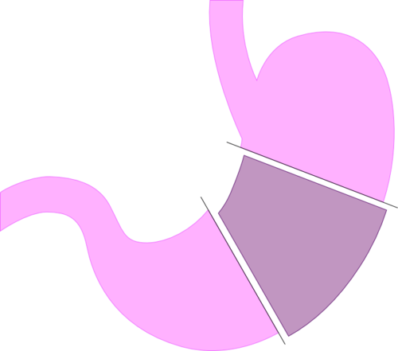

# TRATAMENTO CIRÚRGICO DA OBESIDADE

A obesidade não é apenas um excesso de tecido adiposo; é uma doença inflamatória crônica, progressiva e recidivante. Quando falamos em tratamento cirúrgico, muitos alunos pensam apenas em "fechar o estômago". Se você for para a prova com esse pensamento, vai errar questões. O tratamento cirúrgico moderno é, acima de tudo, uma intervenção neuroendócrina.

## Entendendo a Indicação: Onde as Bancas Mais Atacam

Para saber quem operar, você precisa dominar as resoluções do Conselho Federal de Medicina (CFM 2.131/15 e 2.172/2017). As bancas adoram trocar os números do IMC ou o tempo de tratamento clínico.

### Critérios de IMC e Comorbidades

A indicação clássica de cirurgia bariátrica baseia-se no Índice de Massa Corporal (IMC), mas não isoladamente. Guarde estes valores:

- **IMC ≥ 40 kg/m²:** Obesidade Grau III (mórbida). Aqui, a indicação é direta, independentemente de comorbidades.

- **IMC ≥ 35 kg/m²:** Obesidade Grau II. Necessita da presença de pelo menos uma comorbidade grave relacionada à obesidade.

- **IMC entre 30 e 34,9 kg/m²:** Obesidade Grau I. Aqui entramos no terreno da **Cirurgia Metabólica**, com critérios muito específicos que discutiremos adiante.

**O "Pulo do Gato" do Professor:** Muitas questões afirmam que basta ter o IMC para operar. Errado! O CFM exige a **falha do tratamento clínico** por pelo menos 2 anos. O paciente precisa ter tentado dieta, exercícios e farmacoterapia (como a Semaglutida ou Liraglutida) sob supervisão médica, sem sucesso ou com recidiva ponderal.

### Quais são as comorbidades aceitas?

Não é qualquer "dorzinha" que conta. O CFM lista doenças que são agravadas pela obesidade e que melhoram com a perda de peso:

- Diabetes Mellitus tipo 2 (DM2).

- Hipertensão Arterial Sistêmica (HAS).

- Apneia Obstrutiva do Sono (SAOS).

- Dislipidemias.

- Doença Cardiovascular (coronariopatia, infarto, AVC).

- Doença Hepática Gordurosa Não Alcoólica (DHGNA/NASH).

- Osteoartroses e problemas discais (a doença articular é uma das mais impactantes na qualidade de vida).

- Refluxo Gastroesofágico (DRGE) com indicação cirúrgica.

**Exemplo Clínico:** Imagine um paciente com IMC de 36 kg/m² e esofagite leve. Isso é indicação? Segundo as pérolas das provas, a esofagite isolada muitas vezes não é considerada comorbidade grave o suficiente para indicação primária se não houver outros fatores. Agora, se esse mesmo paciente tiver IMC 36 + DM2, a indicação está clara.

## Cirurgia Metabólica: O Novo Cenário

A Resolução CFM 2.172/2017 mudou o jogo para o paciente diabético. Por que operamos alguém com IMC de 30 kg/m²? Porque o foco não é o peso, é o controle glicêmico.

**Critérios para Cirurgia Metabólica (Memorize isto):**

- IMC entre 30 kg/m² e 34,9 kg/m².

- Idade entre 30 e 70 anos.

- DM2 diagnosticado há menos de 10 anos.

- Refratariedade ao tratamento clínico (HbA1c > 7% com acompanhamento especializado).

- Ausência de contraindicações cirúrgicas.

**Dica de Prova:** A técnica de escolha para cirurgia metabólica é o **Bypass Gástrico em Y de Roux (BGYR)**. A Gastrectomia Vertical (Sleeve) pode ser feita, mas é considerada uma alternativa de segunda linha quando o Bypass é contraindicado.

## Avaliação Pré-Operatória e Equipe Multidisciplinar

Ninguém opera obesidade sozinho. A cirurgia bariátrica exige um parecer de uma equipe composta por cirurgião, endocrinologista, psicólogo/psiquiatra e nutricionista.

### O Preparo do Paciente

Muitos alunos acham que o paciente deve chegar na mesa de cirurgia no seu peso máximo. Erro! A perda de peso pré-operatória (cerca de 5% a 10%) é altamente recomendada. Por quê?

- Reduz o volume do lobo esquerdo do fígado (facilita a exposição do estômago).

- Diminui a gordura visceral e o risco anestésico.

- Testa a adesão do paciente às mudanças de hábito.

**A Polissonografia:** Se o paciente tem obesidade, ele provavelmente tem SAOS. A polissonografia diagnóstica é fundamental. Se confirmada SAOS moderada a grave, o uso de CPAP por pelo menos 2 meses antes da cirurgia reduz drasticamente as complicações respiratórias e cardíacas no peroperatório.

### Contraindicações: Onde a Prova te Pega

Existem situações onde a cirurgia é proibida (**Absolutas**):

- Adicção a drogas ilícitas ou álcool não controlada.

- Doenças psicóticas ou demenciais graves e sem controle.

- **Síndrome de Prader-Willi:** Guarde este nome. É uma contraindicação absoluta clássica em provas devido à hiperfagia de origem central; o paciente não para de comer mesmo com o estômago reduzido, levando à ruptura da sutura.

- Cirrose hepática com hipertensão portal e varizes esofágicas (alto risco de sangramento e descompensação).

**Contraindicações Relativas:** Idade > 65 anos (deve-se avaliar risco-benefício individualmente) e adolescentes < 16 anos (exigem critérios rigorosos, como epífises de crescimento consolidadas e IMC muito elevado com comorbidades graves).

*Figura 1 - Diagrama do bypass gástrico em Y de Roux, a técnica mista mais realizada na cirurgia bariátrica. Fonte: NIDDK/NIH, Domínio Público | Wikimedia Commons*

## Técnicas Cirúrgicas: O Coração do Tema

Aqui é onde o Dr. Will e a equipe do MedEvo observam a maior confusão. Vamos dividir as cirurgias pelo seu mecanismo de ação.

### 1. Técnicas Restritivas

O objetivo é diminuir a capacidade do reservatório gástrico.

- **Gastrectomia Vertical (Sleeve):** É a cirurgia mais realizada no mundo hoje. Remove-se cerca de 80% do estômago (grande curvatura), transformando-o em um "tubo" ou "manga".

- **Mecanismo:** Além da restrição física, remove o fundo gástrico, onde é produzida a **Grelina** (o hormônio da fome). Logo, o paciente tem menos fome.

- **Vantagens:** Preserva o piloro (evita Síndrome de Dumping), não mexe no intestino (menor má absorção), permite acesso endoscópico fácil às vias biliares.

- **Desvantagem:** Pode piorar ou causar Doença do Refluxo Gastroesofágico (DRGE). Se o paciente já tem esofagite grave ou hérnia hiatal, o Sleeve é uma escolha ruim.

### 2. Técnicas Mistas (Restritivas + Disabsortivas)

O objetivo é restringir a entrada e diminuir a absorção, além de um forte componente hormonal.

- **Bypass Gástrico em Y de Roux (BGYR):** O padrão-ouro. Cria-se um pequeno "pouch" gástrico (30-50 ml) que é anastomosado ao jejuno (alça alimentar). O restante do estômago e o duodeno ficam excluídos do trânsito alimentar (alça biliopancreática).

- **Mecanismo:** Restrição + Desvio intestinal. O alimento chega mais rápido ao íleo distal, estimulando a liberação de **GLP-1** e **Peptídeo YY (PYY)**. Isso aumenta a saciedade e melhora a secreção de insulina.

- **Vantagens:** Excelente para DM2 e para pacientes com Refluxo (é o tratamento cirúrgico definitivo para DRGE no obeso).

- **Desvantagem:** Risco de Síndrome de Dumping, deficiências nutricionais (Ferro, B12, Cálcio) e hérnias internas (espaço de Petersen).

### 3. Técnicas Disabsortivas (Predominantemente)

- **Duodenal Switch:** É uma técnica complexa que combina Sleeve com um grande desvio intestinal.

- **Indicação:** Geralmente reservada para super-obesos (IMC > 50 ou 60 kg/m²).

- **Risco:** Grande risco de desnutrição proteico-calórica e deficiência de vitaminas lipossolúveis (A, D, E, K).

| Característica | Gastrectomia Vertical (Sleeve) | Bypass Gástrico (BGYR) |
| --- | --- | --- |
| **Mecanismo** | Restritivo Puro | Misto (Restritivo + Disabsortivo) |
| **Hormônios** | ↓ Grelina | ↑ GLP-1, ↑ PYY, ↓ Grelina |
| **Refluxo (DRGE)** | Pode piorar / Contraindicado | Padrão-ouro para tratamento |
| **Dumping** | Raro (preserva piloro) | Comum |
| **Complexidade** | Menor | Maior |
| **Perda de Peso** | 25-30% do peso total | 30-35% do peso total |

**Atenção:** O **Bypass Jejuno-ileal** é uma técnica **proscrita**. Se aparecer na sua prova como opção de tratamento atual, marque como erro. Ele causava complicações metabólicas e hepáticas gravíssimas.

## Fisiologia e Hormônios: O Porquê da Melhora do Diabetes

Por que o paciente diabético melhora do açúcar no sangue muitas vezes antes mesmo de receber alta do hospital, sem ter perdido quase nada de peso?

Isso acontece devido ao **Efeito Incretínico**. No Bypass Gástrico, o alimento "pula" o duodeno (Teoria do Intestino Proximal) e chega rapidamente ao íleo (Teoria do Intestino Distal). Isso dispara a liberação de incretinas (GLP-1). O GLP-1 avisa o pâncreas para produzir insulina e aumenta a sensibilidade periférica a ela.

Além disso, a redução da **Grelina** (especialmente no Sleeve e no Bypass) diminui o apetite central. O aumento do **PYY** promove saciedade precoce. Entender isso diferencia o aluno que decora do aluno que entende a patologia.

*Figura 2 - Estetoscópio, símbolo da prática médica e do acompanhamento pós-bariátrica. Fonte: Domínio Público | Wikimedia Commons*

## Complicações Pós-Operatórias: O Medo do Cirurgião

As complicações podem ser precoces ou tardias.

### Complicações Precoces

- **Fístulas:** A maior preocupação. No Sleeve, o local mais comum é o ângulo de His (transição esofagogástrica). No Bypass, é na anastomose gastrojejunal. Sinais de alerta: Taquicardia persistente (frequentemente o primeiro sinal!), febre e dor abdominal.

- **Tromboembolismo Venoso (TEV):** O obeso é um estado pró-trombótico. A profilaxia com Heparina de Baixo Peso Molecular (HBPM) e deambulação precoce é mandatória.

- **Obstrução Intestinal:** Pode ocorrer por bridas ou, mais especificamente no Bypass, por **Hérnia Interna** (espaço de Petersen).

### Complicações Tardias

- **Síndrome de Dumping:** Ocorre no Bypass porque o piloro foi "pulado". O alimento hiperosmolar (açúcares) chega rápido ao intestino, causando distensão e liberação de mediadores.

- *Dumping Precoce (15-30 min):* Sintomas vasomotores (taquicardia, sudorese, rubor) e gastrointestinais (cólica, diarreia).

- *Dumping Tardio (1-3 horas):* Hipoglicemia reacional devido ao pico exagerado de insulina.

- **Deficiências Nutricionais:** Ferro (absorvido no duodeno, que está excluído), Vitamina B12 (falta de fator intrínseco e ácido gástrico), Cálcio e Vitamina D.

- **Colelitíase:** A perda rápida de peso altera a composição da bile. Cerca de 30% dos pacientes desenvolvem cálculos biliares no primeiro ano.

## Situações Especiais

### Adolescentes

A cirurgia em adolescentes (≥ 16 anos) é permitida, mas o critério é mais rígido: IMC ≥ 40 ou IMC ≥ 35 com comorbidades que coloquem a vida em risco. É essencial a avaliação da maturidade óssea (epífises fechadas).

### Gestação

A recomendação é clara: **Aguardar de 12 a 24 meses** após a cirurgia para engravidar. Esse é o período de maior perda ponderal e instabilidade nutricional. Uma gestação precoce pode levar a desnutrição fetal e complicações maternas.

### Farmacocinética no Obeso

Lembre-se que o obeso tem um maior volume de distribuição para drogas lipossolúveis. Na anestesia, isso exige ajustes finos. Além disso, no pós-operatório de Bypass, a absorção de alguns medicamentos pode estar alterada devido à exclusão do duodeno e jejuno proximal.

## Protocolo ERAS (Enhanced Recovery After Surgery)

O protocolo ERAS (ou ACERTO no Brasil) é aplicado na bariátrica para acelerar a recuperação:

- Jejum pré-operatório abreviado (líquidos claros com carboidratos até 2h antes).

- Realimentação precoce (dieta líquida no mesmo dia ou no 1º PO).

- Deambulação precoce (reduz TEV e melhora função respiratória).

- Restrição de opioides (preferir analgesia multimodal).

| Complicação | Causa Principal | Conduta Inicial |
| --- | --- | --- |
| **Taquicardia no 2º PO** | Suspeita de Fístula / TEP | Estabilização + Imagem (TC) |
| **Dumping** | Ingestão de carboidratos simples | Reorientação dietética |
| **Anemia Microcítica** | Deficiência de Ferro (má absorção) | Reposição (preferencialmente IV) |
| **Dor abdominal súbita tardia** | Hérnia Interna (Bypass) | Avaliação cirúrgica urgente |

## Pontos-Chave para Prova 🎯

- **Indicação Clássica:** IMC ≥ 40 kg/m² OU IMC ≥ 35 kg/m² com comorbidades, após 2 anos de falha no tratamento clínico.

- **Cirurgia Metabólica:** IMC 30-34,9 kg/m², DM2 < 10 anos, refratário, idade 30-70 anos. Técnica preferencial: Bypass Gástrico.

- **Gastrectomia Vertical (Sleeve):** Técnica restritiva, retira o fundo gástrico (↓ Grelina). Contraindicada em DRGE grave.

- **Bypass Gástrico (Y de Roux):** Técnica mista, padrão-ouro para DM2 e DRGE. Aumenta GLP-1 e PYY.

- **Contraindicação Absoluta:** Síndrome de Prader-Willi, adicção ativa a drogas/álcool, cirrose com hipertensão portal.

- **Síndrome de Dumping:** Comum no Bypass; precoce (vasomotor) vs. tardio (hipoglicemia reacional).

- **Deficiências Nutricionais:** Ferro, B12, Cálcio e Vitamina D são as mais comuns no Bypass.

- **Gestação:** Orientar contracepção rigorosa e aguardar 12-24 meses após a cirurgia.

- **Sinal precoce de fístula:** Taquicardia sustentada (>120 bpm) no pós-operatório imediato.

- **Polissonografia:** Exame obrigatório no pré-operatório para rastreio de SAOS.

- **Bypass Jejuno-ileal:** Procedimento proscrito (não marcar como opção correta de tratamento).

- **Adolescentes:** Permitido ≥ 16 anos com critérios rigorosos e maturidade óssea.

- **Hérnia de Petersen:** Complicação potencial do Bypass Gástrico (hérnia interna pelo espaço criado no mesentério).

- **Perda de peso pré-op:** Recomendada (5-10%) para reduzir volume hepático e risco cirúrgico.

- **Mecanismo do Diabetes:** A melhora do DM2 no Bypass ocorre pelo desvio intestinal e aumento das incretinas (GLP-1), antes mesmo da perda de peso significativa.

- **Pérola de Prova:** A obesidade grau I (IMC 30-34,9) sem DM2 refratário **não** tem indicação cirúrgica por critérios atuais do CFM.

- **Profilaxia de TEV:** Essencial em todos os pacientes devido ao alto risco trombótico da obesidade.

- **Colelitíase:** Muito comum após perda rápida de peso; pode-se considerar uso de ácido ursodeoxicólico profilático.

 Cópia offline para consulta pessoal.
 Fonte original:
 [https://www.medevo.com.br/material-apoio/ler/0270fc05-ba58-452c-97a8-8d0544cfcf7e](https://www.medevo.com.br/material-apoio/ler/0270fc05-ba58-452c-97a8-8d0544cfcf7e)
