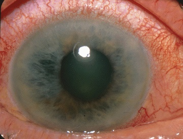
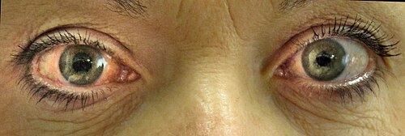

# TRATAMENTO CLÍNICO E CIRÚRGICO DO GLAUCOMA

Para entender o tratamento do glaucoma, você precisa primeiro internalizar uma verdade que as bancas de residência amam explorar: o glaucoma não é uma doença de pressão alta, mas sim uma neuropatia óptica progressiva. A pressão intraocular, ou PIO, é apenas o único fator de risco modificável. Quando tratamos um paciente, não estamos perseguindo um número mágico de 12 ou 15 mmHg no tonômetro, estamos tentando impedir que aquele nervo óptico continue morrendo.

Se você entender que o objetivo é a preservação da qualidade de vida e da função visual, as escolhas terapêuticas começam a fazer sentido. Por que operamos o Paciente A e mantemos o Paciente B no colírio? Porque o risco de o Paciente A ficar cego durante sua expectativa de vida é maior do que o risco das complicações de uma cirurgia. É esse balanço que o Dr. Will sempre enfatiza nas discussões de caso da MedEvo.

## A Meta Terapêutica: A Pressão Alvo

Antes de pingar a primeira gota de colírio, você deve definir a Pressão Alvo. Ela é uma estimativa da PIO média na qual acreditamos que o dano glaucomatoso não irá progredir ou irá progredir de forma tão lenta que não afetará a visão do paciente em vida.

Não existe uma fórmula de bolo, mas a Diretriz Brasileira de Glaucoma sugere que, para um glaucoma inicial, devemos buscar uma redução de pelo menos 20 a 25% da PIO basal. Se o dano é avançado, precisamos ser mais agressivos, buscando reduções de 30% ou mais, muitas vezes mantendo a PIO abaixo de 12 mmHg.

### Fatores para determinar a Pressão Alvo

Para definir quão baixo você quer chegar, olhe para quatro pilares:

- O estágio do dano (escavação do nervo e campo visual).

- A PIO em que o dano ocorreu (se o paciente tem dano com PIO de 18, a meta dele terá que ser muito baixa, talvez 10 ou 11).

- A expectativa de vida (um paciente de 90 anos tem uma meta menos rigorosa que um de 40).

- Fatores de risco adicionais, como a espessura da córnea (córneas finas subestimam a PIO real e são fator de risco independente para progressão).

**Tabela 1: Sugestão de Metas de PIO conforme o Estágio**

| Estágio do Glaucoma | Redução Esperada (%) | PIO Alvo Sugerida (mmHg) |
| --- | --- | --- |
| Glaucoma Inicial | 20 a 25% | < 18 mmHg |
| Glaucoma Moderado | 25 a 30% | < 15 mmHg |
| Glaucoma Avançado | > 30% | < 12 mmHg |

Cuidado: a banca pode colocar um paciente com PIO de 21 mmHg e escavação de 0.9. Se você baixar para 18, ele vai continuar progredindo. Para casos avançados, "18" é uma pressão alta.

## Tratamento Farmacológico: As Armas que Temos

O tratamento clínico é, quase sempre, a primeira escolha no Glaucoma Primário de Ângulo Aberto (GPAA). O segredo aqui é conhecer o mecanismo de ação, pois as questões adoram perguntar qual droga age diminuindo a produção e qual age aumentando o escoamento.

### Análogos de Prostaglandinas (Latanoprosta, Travoprosta, Bimatoprosta)

São a primeira linha absoluta. Por quê? Porque são as mais potentes (reduzem a PIO em 25 a 35%), têm posologia de apenas uma vez ao dia (melhora a adesão) e possuem poucos efeitos colaterais sistêmicos.

O mecanismo de ação é o aumento do escoamento uveoscleral. Imagine que o olho tem um ralo principal (via trabecular) e um ralo acessório (via uveoscleral). As prostaglandinas "abrem" esse ralo acessório.

Efeitos colaterais que caem em prova: hiperemia conjuntival (o olho fica vermelho, o que faz muitos pacientes pararem o uso), crescimento de cílios (hipertricose), escurecimento da íris (iridocromia) e lipodistrofia periorbitária (o olho fica "fundo" com o tempo).

### Betabloqueadores (Timolol 0,5%)

Já foram a primeira linha, hoje são a segunda ou usados em associação. Eles agem diminuindo a produção de humor aquoso pelo corpo ciliar.

Aqui mora o maior perigo das provas de residência. O Timolol é um betabloqueador não seletivo. Se você pingar no olho, ele cai na circulação sistêmica via ducto nasolacrimal e faz efeito sistêmico.

Contraindicações Absolutas: Asma brônquica, DPOC grave, bradicardia sinusal, bloqueio atrioventricular de segundo ou terceiro grau e insuficiência cardíaca manifesta. Se a questão descreve um paciente que "usa bombinha" ou "cansa aos esforços", não marque Timolol.

### Agonistas Alfa-adrenérgicos (Brimonidina)

Têm mecanismo duplo: diminuem a produção e aumentam o escoamento uveoscleral.

Uma característica importante da Brimonidina é o seu potencial efeito neuroprotetor, embora isso seja mais robusto em modelos animais do que em humanos.

Cuidado: A Brimonidina causa muita alergia ocular (folículos conjuntivais) em até 30% dos usuários crônicos. Além disso, é contraindicada em crianças pequenas (menores de 2 a 6 anos) pois atravessa a barreira hematoencefálica e causa depressão do sistema nervoso central, apneia e hipotensão.

### Inibidores da Anidrase Carbônica (Dorzolamida, Brinzolamida, Acetazolamida)

Agem diretamente no corpo ciliar, inibindo a enzima necessária para a produção do humor aquoso. A Dorzolamida e Brinzolamida são tópicas. A Acetazolamida (Diamox) é via oral.

O uso sistêmico (VO) é reservado para situações de emergência, como crise de fechamento angular, ou como "último recurso" antes da cirurgia, devido aos efeitos colaterais: parestesias (formigamento em mãos e pés), hipocalemia, acidose metabólica e risco de cálculos renais.

**Tabela 2: Resumo dos Hipotensores Oculares**

| Classe | Droga Exemplo | Mecanismo Principal | Frequência | Principal Efeito Colateral |
| --- | --- | --- | --- | --- |
| Análogos de Prostaglandina | Latanoprosta | Aumento do Escoamento Uveoscleral | 1x ao dia | Hiperemia, Crescimento de cílios |
| Betabloqueadores | Timolol | Diminuição da Produção | 2x ao dia | Bradicardia, Broncoespasmo |
| Alfa-agonistas | Brimonidina | Duplo (Produção e Escoamento) | 2x ou 3x | Alergia ocular, Sonolência |
| Inibidores da Anidrase Carbônica | Dorzolamida | Diminuição da Produção | 2x ou 3x | Gosto amargo, Ardência |

*Figura 1 - Fotografia mostrando glaucoma agudo de ângulo fechado com elevação súbita da pressão intraocular, hiperemia conjuntival e midríase média. Fonte: Jonathan Trobe, M.D., CC BY 3.0 | Wikimedia Commons*

## O Papel do Laser no Glaucoma

Muitas vezes esquecido pelos alunos, o laser ganhou um papel central nos últimos anos. Existem dois tipos principais que você deve diferenciar para a prova:

### Trabeculoplastia Seletiva a Laser (SLT)

No Glaucoma Primário de Ângulo Aberto, o SLT pode ser indicado até como tratamento inicial, antes mesmo dos colírios. Ele aplica energia no trabeculado (o ralo do olho) para estimular as células a "limparem" a via de escoamento.

Vantagem: evita os efeitos colaterais dos colírios e os problemas de adesão (o paciente esquece de pingar, mas o laser está lá fazendo efeito).

### Iridotomia Periférica a Laser (YAG Laser)

Este é o tratamento de escolha para o Glaucoma de Ângulo Estreito ou em olhos com risco de fechamento angular. O objetivo é criar um "furo" na íris periférica para comunicar a câmara posterior com a anterior, eliminando o bloqueio pupilar.

Erro comum de prova: achar que Iridotomia trata Glaucoma de Ângulo Aberto. Não trata. Ela serve para abrir o ângulo que está mecanicamente fechado ou em risco de fechar.

*Figura 2 - Estetoscópio, símbolo da prática médica e do acompanhamento oftalmológico no glaucoma. Fonte: Domínio Público | Wikimedia Commons*

## Tratamento Cirúrgico: Quando a Gota não Basta

A indicação cirúrgica surge quando o tratamento clínico máximo tolerado (geralmente 3 a 4 drogas) não é suficiente para atingir a Pressão Alvo ou quando há progressão documentada do dano (campo visual piorando).

### Trabeculectomia (TREB)

É o padrão-ouro das cirurgias filtrantes. O conceito é simples, mas a execução é complexa: criamos uma fístula (um caminho alternativo) para o humor aquoso sair de dentro do olho para o espaço subconjuntival, formando uma "bolha" de filtração (bleb).

Para evitar que o corpo cicatrize e feche esse caminho, usamos antimetabólitos durante a cirurgia, sendo a Mitomicina C (MMC) a mais comum.

Complicações da TREB que caem em prova:

- Hipotonia (pressão baixa demais, podendo causar descolamento de coroide).

- Sezadel (vazamento da bolha, detectado pelo teste da fluoresceína).

- Blebite ou Endoftalmite (infecção da bolha ou do olho todo).

### Dispositivos de Drenagem (Tubos)

São implantes (como o de Ahmed ou Baerveldt) que levam o líquido de dentro do olho para um prato fixado na esclera, lá atrás.

Quando preferir o Tubo em vez da TREB?

- Glaucomas secundários complexos (neovascular, uveítico).

- Olhos com cicatrizes conjuntivais extensas (onde a TREB falharia).

- Falha prévia de TREB.

### MIGS (Cirurgias de Glaucoma Minimamente Invasivas)

Apareceram recentemente e as bancas começaram a cobrar. São procedimentos com perfil de segurança muito alto, mas potência menor que a TREB. São indicados para glaucomas leves a moderados, muitas vezes realizados em conjunto com a cirurgia de catarata. Exemplos: iStent, Dual Blade, Hydrus.

## Situações Especiais e Manejo Clínico

Imagine o seguinte cenário clínico: Paciente de 32 anos, grávida no primeiro trimestre, com PIO de 28 mmHg. O que você faz?

O manejo em gestantes é um desafio. Quase todos os colírios atravessam a placenta.

- Prostaglandinas: podem ter efeito oxitócico (risco teórico de aborto ou parto prematuro).

- Brimonidina: contraindicada no final da gestação e amamentação (risco de depressão respiratória no recém-nascido).

- Betabloqueadores: podem causar bradicardia fetal.

A conduta geralmente envolve o uso de Brimonidina no segundo trimestre (com cautela) ou, preferencialmente, o uso de Laser (SLT) para evitar drogas sistêmicas. Se precisar de colírio, oriente a oclusão do ponto lacrimal por 2 a 3 minutos após a instalação para reduzir a absorção sistêmica.

### Glaucoma Agudo (Crise de Fechamento Angular)

Isso é uma emergência médica. O paciente chega com dor ocular intensa, náuseas, vômitos, visão de halos coloridos e olho muito vermelho. A PIO está frequentemente acima de 40 ou 50 mmHg.

Sequência de tratamento na crise aguda:

- Agentes Osmóticos: Manitol IV (para "secar" o vítreo e puxar água de dentro do olho).

- Inibidores da Anidrase Carbônica: Acetazolamida VO.

- Colírios Hipotensores: Timolol, Brimonidina.

- Pilocarpina: Este é um miótico. Ele "estica" a íris para tirá-la do ângulo. Mas atenção: ela só funciona quando a PIO baixar um pouco (abaixo de 40 mmHg), pois o esfíncter da íris fica isquêmico com pressões muito altas.

- Iridotomia a Laser: Deve ser feita em AMBOS os olhos assim que a córnea clarear, pois o olho contralateral tem alto risco de ter uma crise também.

## Diagnóstico Diferencial e Erros de Conduta

Um erro clássico é confundir Glaucoma com Hipertensão Ocular.

- Hipertensão Ocular: PIO > 21 mmHg, mas nervo óptico normal e campo visual normal. Nem todo hipertenso ocular precisa de tratamento. Tratamos se o risco de conversão for alto (PIO muito alta, córnea fina, escavação suspeita).

- Glaucoma de Pressão Normal: O nervo está morrendo, mas a PIO nunca passa de 21 mmHg. Aqui, a meta de pressão deve ser ainda mais baixa.

Outra pegadinha: Glaucoma Neovascular. Ocorre após isquemia retiniana grave (Retinopatia Diabética Proliferativa ou Oclusão de Veia Central da Retina). O tratamento não é só baixar a pressão, é tratar a retina com Panfotocoagulação ou Anti-VEGF. Se você não tratar a causa (isquemia), a pressão não vai baixar.

## Estratificação de Risco e Seguimento

Não basta tratar, tem que monitorar. O seguimento é feito com:

- Tonometria de aplanação (padrão-ouro).

- Paquimetria (medida da espessura da córnea).

- Gonioscopia (essencial para diferenciar ângulo aberto de fechado).

- Retinografia/Estereofoto de papila (para ver o nervo).

- Campo Visual Computadorizado (avaliação funcional).

- OCT de Nervo Óptico (avaliação estrutural da camada de fibras nervosas).

Se o campo visual está piorando, sua Pressão Alvo não foi atingida, mesmo que o número no tonômetro pareça bom. Isso é o que chamamos de "progressão clínica".

**Tabela 3: Quando indicar cada tratamento (Resumo de Conduta)**

| Condição Clínica | Conduta de Primeira Escolha | Justificativa |
| --- | --- | --- |
| GPAA Inicial | Análogo de Prostaglandina ou SLT | Potência e segurança |
| Suspeita de Ângulo Estreito | Iridotomia a Laser | Prevenção de crise aguda |
| Crise de Glaucoma Agudo | Manitol IV + Acetazolamida + Iridotomia | Emergência para baixar PIO rápido |
| Glaucoma Avançado (PIO 35) | Cirurgia (TREB) | Colírios dificilmente atingirão a meta |
| Glaucoma em Criança (Congênito) | Cirurgia (Goniotomia/Trabeculotomia) | O tratamento é essencialmente cirúrgico |

## Pontos-Chave para Prova

- O glaucoma é uma neuropatia óptica progressiva. A PIO é o principal fator de risco, mas não define a doença isoladamente.

- Pressão Alvo: Deve ser individualizada. Glaucomas avançados exigem PIOs mais baixas (frequentemente < 12 mmHg).

- Análogos de Prostaglandina: Aumentam o escoamento uveoscleral. São a primeira linha clínica.

- Betabloqueadores (Timolol): Contraindicação absoluta em asmáticos, DPOC graves e bloqueios cardíacos.

- Brimonidina: Contraindicada em crianças pequenas devido ao risco de depressão do SNC.

- Acetazolamida Sistêmica: Usada em crises agudas ou pré-operatório. Cuidado com hipocalemia e acidose.

- Iridotomia a Laser: Tratamento definitivo para bloqueio pupilar (ângulo estreito). Sempre tratar o olho contralateral profilaticamente.

- Trabeculectomia (TREB): Principal cirurgia. Cria uma fístula para o espaço subconjuntival. Mitomicina C é usada para evitar fibrose.

- Teste de Seidel: Usa fluoresceína para detectar vazamento de humor aquoso em feridas cirúrgicas ou perfurações.

- Glaucoma Congênito: Tríade clássica de epífora (lacrimejamento), fotofobia e blefaroespasmo. O tratamento é cirúrgico (Goniotomia ou Trabeculotomia).

- Paquimetria: Córneas finas (< 500 micra) aumentam o risco de progressão e subestimam a medida real da PIO.

- Escavação do Nervo Óptico: Aumentos assimétricos (> 0.2 de diferença entre os olhos) ou verticalizados são altamente suspeitos.

- Escotoma de Bjerrum: É o defeito de campo visual clássico do glaucoma (escotoma arqueado que respeita a linha média horizontal).

- Pilocarpina: Miótico usado na crise aguda de ângulo fechado, mas só funciona após a PIO reduzir para níveis que permitam a perfusão do esfíncter da íris.

- O tratamento do glaucoma não reverte o dano já existente. O objetivo é apenas estabilizar e evitar a progressão para a cegueira. 💡

 Cópia offline para consulta pessoal.
 Fonte original:
 [https://www.medevo.com.br/material-apoio/ler/b7ed02ee-15f2-4b43-9324-9d99622b8346](https://www.medevo.com.br/material-apoio/ler/b7ed02ee-15f2-4b43-9324-9d99622b8346)
