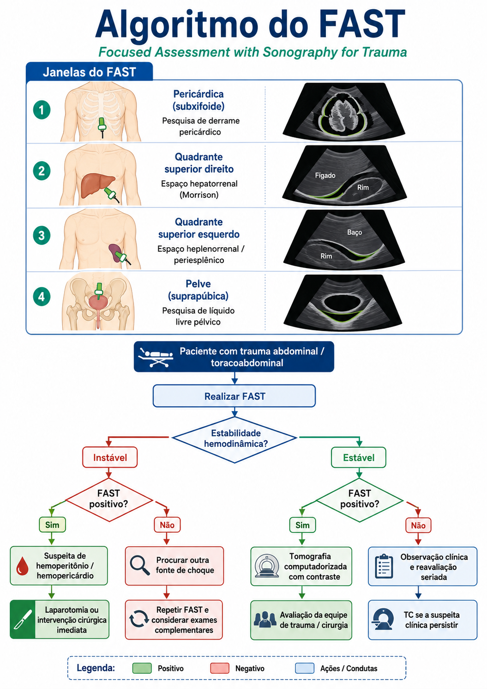
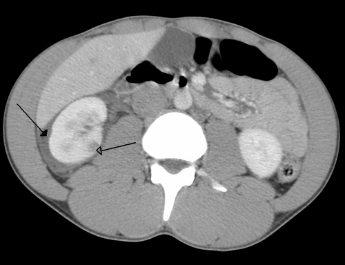

# TRAUMA ABDOMINAL

O trauma abdominal é, sem dúvida, um dos temas mais desafiadores na emergência e um dos favoritos das bancas de residência médica. Por que? Porque o abdome é uma "caixa preta". Diferente do tórax, onde um dreno de selo d'água ou uma ausculta podem resolver ou diagnosticar muita coisa rapidamente, no abdome, as lesões podem ser silenciosas até que o paciente choque.

Como professor, vejo muitos alunos perderem questões por tentarem decorar condutas sem entender a fisiopatologia. O segredo aqui é um só: estabilidade hemodinâmica. É ela quem dita o ritmo da sua investigação. Se o paciente está instável, não temos tempo para fotos bonitas na Tomografia (TC). Se está estável, a TC é nossa melhor amiga. Vamos dissecar isso.

## Avaliação Inicial e a Fisiopatologia do Choque no Trauma

No trauma abdominal, o foco principal no "C" (Circulação) do ABCDE é a identificação de hemorragia interna. O abdome pode albergar quase todo o volume sanguíneo do paciente sem aumentar significativamente de volume externamente.

Um erro clássico é confiar apenas no exame físico. Lembre-se: em até 30% dos casos de trauma abdominal contuso com hemoperitônio significativo, o exame físico inicial é normal. O paciente pode estar sob efeito de álcool, drogas ou ter um trauma cranioencefálico associado, o que mascara a dor.

### Reanimação Volêmica e a Estratégia Hipotensiva

Antigamente, a regra era "dar volume até a pressão subir". Hoje, segundo o ATLS 10ª edição e as diretrizes da SBAIT, seguimos a Reanimação Hipotensiva (ou hipotensão permissiva). Por que fazemos isso? Se você aumenta demais a pressão arterial com cristaloide em um paciente que tem um coágulo instável em uma lesão esplênica, por exemplo, você "estoura" esse coágulo (pop-the-clot) e dilui os fatores de coagulação, piorando o sangramento.

A meta é manter uma pressão sistólica em torno de 80 a 90 mmHg até que o sangramento seja controlado cirurgicamente. No MedEvo, sempre reforçamos: a prioridade no choque grau III ou IV é obter dois acessos venosos periféricos calibrosos (14 ou 16G) e iniciar a reposição, preferencialmente com hemoderivados se não houver resposta inicial ao cristaloide (limitado a 1 litro no adulto).

## Métodos Diagnósticos: FAST, LPD e TC

Esta é a parte que mais cai em prova. Você precisa saber quando pedir cada um.

*Figura 1 - Algoritmo do FAST (Focused Assessment with Sonography for Trauma), exame ultrassonográfico fundamental na avaliação do trauma abdominal. Fonte: MedEvo*

## FAST (Focused Assessment with Sonography for Trauma)

O FAST não serve para ver lesão de órgão. Ele serve para ver líquido livre (sangue). Ele avalia quatro janelas:

- Pericárdica (subxifoide).

- Hepatorrenal (Espaço de Morrison).

- Esplenorrenal.

- Pélvica (Suprapúbica).

O e-FAST (estendido) inclui as bases pulmonares para avaliar pneumotórax e hemotórax.

**Vantagem:** Rápido, beira-leito, não invasivo.
**Desvantagem:** Operador dependente, não vê retroperitônio, não vê lesão de víscera oca.
**Dica de prova:** FAST positivo em paciente instável = Laparotomia. FAST positivo em paciente estável = TC para ver de onde vem o sangue.

### LPD (Lavage Peritoneal Diagnóstico)

Quase em desuso na prática de grandes centros, mas ainda muito cobrado. É um exame invasivo.
**Critérios de Positividade (Bancas amam isso):**

- Aspiração inicial de > 10 ml de sangue ou conteúdo gastrointestinal.

- Se a aspiração for negativa, infunde-se 1 litro de soro e avalia-se o efluente:

- Hemácias > 100.000/mm³.

- Leucócitos > 500/mm³.

- Presença de fibras alimentares, bile ou bactérias.

- Amilase > 175 U/dL.

### Tomografia Computadorizada (TC) de Abdome e Pelve

É o padrão-ouro para o paciente ESTÁVEL. Ela identifica a fonte do sangramento, gradua a lesão do órgão sólido e avalia o retroperitônio (coisa que o FAST não faz).

**Tabela 1: Comparação de Métodos Diagnósticos no Trauma Abdominal**

| Método | Indicação Principal | Vantagem | Desvantagem |
| --- | --- | --- | --- |
| **FAST** | Instável com suspeita de hemoperitônio | Rápido, beira-leito | Não vê retroperitônio ou víscera oca |
| **LPD** | Instável (se FAST indisponível) | Alta sensibilidade para sangue | Invasivo, pode causar lesão iatrogênica |
| **TC** | Estável hemodinamicamente | Detalha lesão, avalia retroperitônio | Requer transporte e estabilidade |

## Trauma Abdominal Contuso

O trauma contuso é o mais comum em acidentes automobilísticos. O órgão sólido mais frequentemente lesado é o **Baço**, seguido pelo Fígado.

### Manejo Não Operatório (MNO)

Esta é a grande tendência moderna. Antigamente, "sangue no abdome" era sinônimo de "abrir o abdome". Hoje, se o paciente está estável, mesmo com lesões de alto grau (Grau III ou IV), podemos tentar o tratamento conservador.

**Critérios para MNO:**

- Estabilidade hemodinâmica (obrigatório).

- Ausência de sinais de irritação peritoneal (peritonite).

- Disponibilidade de TC, UTI e equipe cirúrgica imediata se o paciente descompensar.

Se o paciente com trauma esplênico Grau III está estável, a conduta é: jejum, hidratação, observação rigorosa em UTI e exames seriados. Se houver um "blush" arterial na TC (extravasamento de contraste), a angioembolização é uma excelente opção para evitar a cirurgia.

### Trauma Esplênico

O baço é uma "esponja" de sangue. Lesões Grau III (laceração > 3 cm ou hematoma > 50% da superfície) são comuns em provas. O maior risco do MNO no baço é a ruptura tardia, embora rara. Lembre-se: se precisar operar e fizer esplenectomia total, o paciente precisará de vacinação contra germes encapsulados (Pneumococo, Haemophilus, Meningococo).

### Trauma Hepático

O fígado é o segundo órgão mais lesado no trauma contuso, mas o mais lesado no trauma penetrante por arma branca. Uma pérola clínica importante: TGO > 200 U/L ou TGP > 125 U/L no trauma contuso aumentam muito a suspeita de lesão hepática.

No trauma hepático grave (Grau V), se o paciente está instável mas responde à reanimação inicial e a TC mostra extravasamento de contraste, a angioembolização pode ser tentada. Se for para a laparotomia e o sangramento for maciço, a Manobra de Pringle (clampeamento do ligamento hepatoduodenal) ajuda a diferenciar se o sangue vem da artéria hepática/veia porta ou das veias supra-hepáticas/cava.

### Graus de Lesão de Órgãos Sólidos e Alças Intestinais (resumo AAST para prova)

As escalas de lesão ajudam a padronizar a gravidade, mas **não substituem a estabilidade hemodinâmica** na decisão de operar. Para prova, guarde os cortes mais cobrados:

**Baço**

- **Grau I:** hematoma subcapsular pequeno (< 10% da superfície) ou laceração capsular superficial (< 1 cm).

- **Grau II:** hematoma subcapsular maior (10-50%) ou intraparenquimatoso pequeno; laceração de 1-3 cm sem atingir vasos trabeculares.

- **Grau III:** hematoma subcapsular > 50%/expansivo ou laceração > 3 cm/profundidade até vasos trabeculares.

- **Grau IV:** laceração envolvendo vasos segmentares ou hilares, com desvascularização importante (> 25% do baço).

- **Grau V:** baço completamente estilhaçado (*shattered spleen*) ou lesão hilar com desvascularização esplênica.

**Fígado**

- **Grau I:** hematoma subcapsular < 10% ou laceração capsular superficial (< 1 cm).

- **Grau II:** hematoma subcapsular 10-50% ou intraparenquimatoso pequeno; laceração de 1-3 cm.

- **Grau III:** hematoma subcapsular > 50%/expansivo ou laceração > 3 cm.

- **Grau IV:** ruptura parenquimatosa envolvendo 25-75% de um lobo hepático ou 1-3 segmentos de Couinaud em um mesmo lobo.

- **Grau V:** ruptura > 75% de um lobo, mais de 3 segmentos em um lobo ou lesão venosa justa-hepática (veias hepáticas/veia cava retro-hepática).

- **Grau VI:** avulsão hepática, evento raro e geralmente incompatível com sobrevida sem controle cirúrgico imediato.

**Alças intestinais (delgado/colo)**

- **Grau I:** contusão/hematoma sem desvascularização ou laceração parcial da parede, sem perfuração.

- **Grau II:** laceração/perfuração envolvendo menos de 50% da circunferência.

- **Grau III:** laceração envolvendo 50% ou mais da circunferência, sem transecção completa.

- **Grau IV:** transecção completa de um segmento intestinal.

- **Grau V:** transecção com perda de tecido ou segmento desvascularizado.

**Como isso muda a conduta?** Lesões esplênicas/hepáticas grau I-III em paciente estável costumam ir para MNO. Graus IV-V também podem ser observados em centros preparados se o paciente estiver estável, frequentemente com angioembolização quando há blush/extravasamento. Já lesão de alça com perfuração, peritonite ou isquemia/desvascularização geralmente exige laparotomia/laparoscopia terapêutica.

## Trauma Abdominal Penetrante

Aqui a regra muda um pouco. Temos dois grandes vilões: a Arma Branca (FAB) e a Arma de Fogo (PAF).

### Ferimento por Arma de Fogo (PAF)

A regra de ouro para provas: PAF que penetrou o peritônio = Laparotomia Exploradora. Por que? Porque o projétil tem alta energia cinética e uma trajetória imprevisível. Em 90% dos casos, haverá lesão de víscera oca (o Intestino Delgado é o mais atingido). Não perca tempo com TC se o projétil atravessou o abdome.

### Ferimento por Arma Branca (FAB)

Aqui somos mais seletivos. Nem todo FAB precisa de cirurgia.

- **Indicações imediatas de Laparotomia no FAB:** Instabilidade hemodinâmica, peritonite ou evisceração.

- **Paciente estável e sem peritonite:** Realizamos a Exploração Digital do Ferimento (sob anestesia local).

- Se a aponeurose estiver íntegra: Sutura e alta com orientações.

- Se a aponeurose foi violada: O paciente deve ser internado para observação clínica por 24 horas, com exames físicos seriados e hemograma. Alguns serviços utilizam TC ou laparoscopia diagnóstica.

## Lesões de Órgãos Específicos e Retroperitônio

### Pâncreas e Duodeno

São lesões difíceis porque esses órgãos estão no retroperitônio. O P.A.T.I. score (Penetrating Abdominal Trauma Index) mostra que lesões de pâncreas e duodeno são as de maior gravidade no trauma penetrante.

No trauma pancreático, a complicação mais comum é a fístula. Se houver lesão transfixante do corpo do pâncreas por PAF, a conduta geralmente é a pancreatectomia distal com esplenectomia. O Dr. Will costuma lembrar que, se o ducto pancreático principal for lesado, o tratamento cirúrgico é mandatório.

No duodeno, a maioria das lesões (Grau I e II) pode ser tratada com rafia primária. Lesões complexas podem exigir a exclusão pilórica.

### Cólon e Reto

Antigamente, toda lesão de cólon terminava em colostomia. Hoje, a tendência é a Rafia Primária (sutura direta), desde que o paciente esteja estável, sem contaminação fecal maciça e com menos de 4-6 horas de trauma.
Se o paciente for idoso, estiver chocado ou tiver múltiplas lesões (o famoso "abdome catastrófico"), optamos pela Operação de Hartmann (ressecção com colostomia proximal e fechamento do coto distal).

### Retroperitônio: As Zonas de Perigo

Muitos alunos erram ao não saber quando explorar um hematoma retroperitoneal encontrado durante uma laparotomia.

**Tabela 2: Zonas do Retroperitônio e Conduta Cirúrgica**

| Zona | Localização | Órgãos | Conduta (Trauma Contuso) | Conduta (Trauma Penetrante) |
| --- | --- | --- | --- | --- |
| **Zona I** | Central / Medial | Aorta, Cava, Pâncreas, Duodeno | **Sempre explorar** | **Sempre explorar** |
| **Zona II** | Flancos | Rins, Ureteres, Cólon ascendente/descendente | Explorar apenas se hematoma expansivo ou pulsátil | Explorar sempre |
| **Zona III** | Pélvica | Vasos ilíacos, Reto | **Não explorar** (risco de sangramento incontrolável) | Explorar sempre |

**Cuidado:** No trauma contuso de bacia com hematoma em Zona III, a exploração cirúrgica é perigosa. O tamponamento natural do hematoma é perdido e o paciente pode morrer na mesa. Prefira a fixação da pelve e angioembolização.

## Hipertensão Intra-Abdominal (HIA) e Síndrome Compartimental Abdominal (SCA)

A SCA ocorre quando a Pressão Intra-Abdominal (PIA) elevada causa disfunção de órgãos (insuficiência renal, dificuldade respiratória, queda do débito cardíaco).

- **PIA Normal:** 5 a 7 mmHg.

- **HIA:** PIA ≥ 12 mmHg.

- **SCA:** PIA > 20 mmHg + Disfunção de novos órgãos.

A medida da PIA é feita de forma indireta através da **Pressão Vesical** (instila-se 25 ml de soro na sonda vesical de demora). Se o paciente tem SCA, o tratamento é a descompressão cirúrgica imediata (laparostomia / abdome aberto).

*Figura 2 - Tomografia computadorizada de trauma abdominal: note a contusão renal direita (seta aberta) e o sangue perirrenal (seta fechada). Fonte: Domínio Público | Wikimedia Commons*

## Cirurgia de Controle de Danos (Damage Control)

Este conceito salvou milhares de vidas. Imagine um paciente com a "Tríade da Morte": Acidose metabólica, Hipotermia e Coagulopatia. Se você tentar fazer uma cirurgia definitiva de 5 horas nesse paciente, ele morrerá de choque não hemorrágico.

**As 3 Fases do Controle de Danos:**

- **Part I (Sala de Cirurgia):** Laparotomia rápida, controle de hemorragia (shunts, empacotamento com compressas) e controle de contaminação (grampeamento de alças). Fechamento temporário da pele ou peritoniostomia.

- **Part II (UTI):** Aquecimento, correção da coagulopatia, estabilização hemodinâmica e ventilatória. Geralmente dura 24 a 48 horas.

- **Part III (Sala de Cirurgia):** Retirada das compressas, exploração definitiva e reconstrução das lesões.

A impossibilidade de fechamento primário da parede abdominal exige manejo adequado para evitar complicações e permitir a reabertura posterior em condições mais favoráveis. Dentre as opções, o **curativo a vácuo (VAC) é a técnica de escolha**, pois promove a aproximação das bordas, reduz o edema, melhora a perfusão, estimula a granulação e facilita a drenagem.
A Bolsa de Bogotá é uma alternativa histórica, mas **inferior** ao VAC.
Telas e fechamento apenas da pele são **contraindicados** nesta fase.

## Situações Especiais e Pegadinhas

### Trauma na Gestante

O útero gravídico protege as vísceras abdominais, mas ele próprio pode sangrar muito. A prioridade é sempre a mãe. O deslocamento do útero para a esquerda é fundamental para evitar a compressão da veia cava e melhorar o retorno venoso.

### Síndrome Compartimental de Extremidades

Pérola clínica: Paciente com trauma, edema importante, dor desproporcional ao exame físico e CPK elevada. Suspeite de Síndrome Compartimental. O tratamento é a fasciotomia urgente para evitar insuficiência renal por mioglobinúria (rabdomiólise).

### O "Blush" na TC

Se você ler "extravasamento de contraste" ou "blush" em uma questão de trauma hepático ou esplênico em paciente estável, a resposta quase sempre envolverá angioembolização.

## Pontos-Chave para Prova

- **Órgão mais lesado no trauma contuso:** Baço.

- **Órgão mais lesado no trauma penetrante (PAF):** Intestino Delgado.

- **Órgão mais lesado no trauma penetrante (Arma Branca):** Fígado.

- **Indicação de Laparotomia no trauma contuso:** Instabilidade + FAST positivo ou Peritonite.

- **Indicação de Laparotomia no trauma penetrante:** Instabilidade, Peritonite ou Evisceração. (PAF penetrante também é indicação clássica).

- **Critério de positividade LPD:** > 100.000 hemácias/mm³ ou saída de bile/conteúdo alimentar.

- **Zona I do Retroperitônio:** Sempre deve ser explorada, independente do mecanismo de trauma.

- **Zona III do Retroperitônio no trauma contuso:** NÃO explorar (risco de exsanguinação). Tratar com fixação pélvica/embolização.

- **Tríade da Morte:** Hipotermia, Acidose e Coagulopatia. Indica Cirurgia de Controle de Danos.

- **Manejo Não Operatório (MNO):** Exige estabilidade hemodinâmica e ausência de peritonite.

- **Hematúria pós-trauma:** Sugere lesão renal. Se o paciente estiver estável, o exame de escolha é a TC com contraste (fase excretora).

- **Pneumoperitônio no trauma:** Indica lesão de víscera oca e é indicação absoluta de laparotomia.

- **Contraindicação ABSOLUTA para TC:** Instabilidade hemodinâmica. O paciente não pode "morrer no tubo da TC".

- **Primeira conduta no choque grave pós-intubação:** Obter acessos venosos e iniciar reposição volêmica agressiva (C do ABCDE).

- **Fasciotomia:** Indicada na Síndrome Compartimental (dor, palidez, ausência de pulso - tardio, CPK alta).

- **Vacinação pós-esplenectomia:** Deve ser feita após 14 dias da cirurgia (se eletiva, 14 dias antes) para melhor resposta imunológica. 🩺

Lembre-se: no trauma abdominal, a clínica é soberana, mas a estabilidade hemodinâmica é quem manda no fluxograma. Se você entender por que está pedindo cada exame, as questões de conduta se tornarão lógicas e fáceis de resolver.

 Cópia offline para consulta pessoal.
 Fonte original:
 [https://www.medevo.com.br/material-apoio/ler/d3009eab-46de-42d7-8a22-51832386fdfd](https://www.medevo.com.br/material-apoio/ler/d3009eab-46de-42d7-8a22-51832386fdfd)
