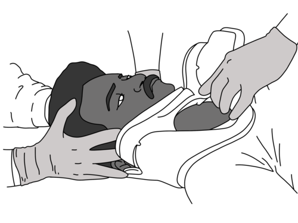
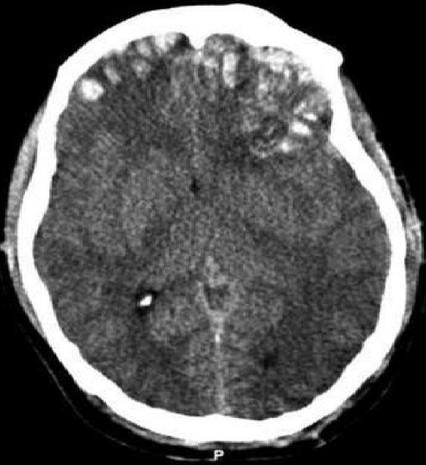

# TRAUMA

O trauma não é um evento aleatório; é uma doença com fisiopatologia previsível e uma cronologia bem definida. Para a sua prova de residência, você deve entender que o atendimento ao traumatizado segue uma lógica de prioridades: tratamos primeiro o que mata mais rápido.

Historicamente, falamos na "distribuição trimodal da morte no trauma". O primeiro pico ocorre em segundos a minutos (lesões de grandes vasos, coração ou SNC alto); o segundo pico, em minutos a poucas horas (a "Hora de Ouro", onde o seu atendimento no ABCDE faz a diferença); e o terceiro pico, dias ou semanas depois (sepse e disfunção de múltiplos órgãos). É aqui que as bancas testam se você sabe evitar a morte evitável.

## Resposta Endócrino-Metabólica ao Trauma (REMT)

Antes de falarmos de conduta, você precisa entender o que acontece dentro do corpo do paciente. O trauma é um estado de estresse extremo que ativa o eixo hipotálamo-hipófise-adrenal e o sistema nervoso simpático.

### O Porquê da Hiperglicemia de Estresse

No trauma, o corpo entra em um estado catabólico intenso. As catecolaminas (adrenalina e noradrenalina) e o cortisol aumentam a glicemia através da glicogenólise e gliconeogênese. Ao mesmo tempo, há uma resistência periférica à insulina.
**Por que o corpo faz isso?** Para garantir que o cérebro e o coração tenham glicose disponível, mesmo que o resto do corpo sofra. Em provas, cuidado: a alternativa dirá que a insulina aumenta para compensar. Mentira. A insulina costuma estar baixa ou com ação inibida inicialmente.

### O Ciclo de Cori e o Lactato

Quando o paciente está chocado, o metabolismo passa de aeróbico para anaeróbico. A glicose é convertida em lactato na periferia. Esse lactato vai para o fígado para ser transformado novamente em glicose (Ciclo de Cori). Se o fígado está hipoperfundido, o lactato acumula, gerando acidose lática. Por isso, o lactato e o déficit de base (base excess) são marcadores tão fiéis de gravidade e de resposta à ressuscitação.

### Alterações Hormonais Específicas

- **ADH e Aldosterona:** O corpo quer segurar volume. O ADH (vasopressina) retém água pura nos túbulos coletores. A aldosterona retém sódio e água, mas excreta potássio e hidrogênio. **Erro clássico:** Achar que a aldosterona retém bicarbonato. Ela não faz isso diretamente.

- **Eutireoidiano Doente:** No trauma grave, é comum encontrar T3 e T4 baixos com TSH normal ou baixo. Isso não é hipotireoidismo primário, é apenas o corpo "poupando energia". Não se repõe hormônio tireoidiano aqui.

*Figura 1 - Ilustração de dois socorristas aplicando colar cervical em paciente, procedimento essencial do "C" (Cervical spine) na avaliação primária do ATLS. Fonte: Baedr-9439, CC0 | Wikimedia Commons*

## Avaliação Primária: O ABCDE da Sobrevivência

O protocolo do ATLS (Advanced Trauma Life Support) é a bíblia aqui. Você não pula etapas. Se o paciente tem um problema no A, você não olha o C.

### A - Vias Aéreas com Proteção da Coluna Cervical

A prioridade zero é garantir que o ar entre e que a medula não seja lesada.

**Indicações de Via Aérea Definitiva (Intubação Orotraqueal):**

- Glasgow ≤ 8 (regra de ouro: "8, intube o afoito").

- Proteção contra aspiração (sangue ou vômito em grande quantidade).

- Apneia ou esforço respiratório ineficaz.

- Trauma maxilofacial grave ou risco de obstrução por edema (queimaduras de face).

**Dica do Dr. Will:** No trauma, toda via aérea é considerada "via aérea difícil" e "estômago cheio". Sempre tenha um plano B (como a cricotireoidostomia cirúrgica). Nunca faça cricotireoidostomia por punção em crianças menores de 12 anos de forma definitiva; prefira a ventilação a jato temporária ou traqueostomia se necessário.

### B - Respiração e Ventilação

Aqui você procura as "lesões fatais do tórax".

- **Pneumotórax Hipertensivo:** Diagnóstico é CLÍNICO. Hipotensão, turgência jugular, ausência de murmúrio vesicular e desvio da traqueia (achado tardio).

- **Conduta:** Descompressão por agulha imediata (5º espaço intercostal, linha axilar média em adultos; o 2º EIC linha hemiclavicular ainda é aceito em provas, mas a tendência atual é o 5º). *Depois* você drena em selo d'água.

- **Pneumotórax Aberto:** Ferida aspirante.

- **Conduta:** Curativo de três pontas (faz o efeito de válvula: o ar sai, mas não entra). O tratamento definitivo é a drenagem em local distante da ferida.

- **Tórax Instável:** Duas ou mais fraturas em dois ou mais costelas consecutivas. Causa respiração paradoxal.

- **O segredo:** O problema não é a fratura, é a contusão pulmonar subjacente. O tratamento foca em analgesia potente e oxigenação.

### C - Circulação com Controle de Hemorragia

No trauma, choque é hipovolêmico hemorrágico até que se prove o contrário.

**Classificação do Choque (ATLS 10ª/11ª Ed.):**

| Parâmetro | Classe I | Classe II | Classe III | Classe IV |
| --- | --- | --- | --- | --- |
| Perda volêmica (%) | < 15% | 15-30% | 30-40% | > 40% |
| Frequência Cardíaca | Normal | > 100 | > 120 | > 140 |
| Pressão Arterial | Normal | Normal | Diminuída | Muito diminuída |
| Débito Urinário | > 30 ml/h | 20-30 ml/h | 5-15 ml/h | Desprezível |
| Estado Mental | Ansioso | Ansioso | Confuso | Letárgico |

**Pérola de Prova:** O choque Classe II é o "choque da taquicardia". A pressão ainda está normal devido aos mecanismos compensatórios (catecolaminas). Se a pressão caiu, o paciente já é, no mínimo, Classe III.

**Reposição Volêmica:** Iniciamos com 1 litro de cristaloide (Ringer Lactato preferencialmente) aquecido. Se não responder, partimos para o protocolo de transfusão maciça (concentrado de hemácias, plasma e plaquetas na proporção 1:1:1). Evite o excesso de cristaloide para não causar a "tríade da morte": Acidose, Coagulopatia e Hipotermia.

### D - Incapacidade (Exame Neurológico)

Focamos na Escala de Coma de Glasgow (GCS) e na reatividade pupilar.

**Escala de Coma de Glasgow Atualizada (com Resposta Pupilar):**

- **Abertura Ocular (1-4):** Espontânea (4), Ao som (3), À pressão/dor (2), Ausente (1).

- **Resposta Verbal (1-5):** Orientado (5), Confuso (4), Palavras inapropriadas (3), Sons incompreensíveis (2), Ausente (1).

- **Resposta Motora (1-6):** Obedece comandos (6), Localiza dor (5), Flexão normal/Retirada (4), Flexão anormal/Decorticação (3), Extensão/Descerebração (2), Ausente (1).

- **Pupilas:** Se ambas reagem (-0), se uma não reage (-1), se nenhuma reage (-2). O score final é GCS - P.

**Exemplo Clínico:** Paciente abre olhos à dor (2), emite sons incompreensíveis (2) e tem retirada à dor (4). GCS = 8. Se uma pupila estiver midriática e fixa, o GCS-P final é 7.

### E - Exposição e Controle do Ambiente

Despir o paciente completamente para procurar lesões ocultas (dorso, períneo), mas cobri-lo imediatamente. A hipotermia no trauma é letal pois inibe a cascata de coagulação.

## Trauma Abdominal: Onde está o sangue?

O abdome é a "caixa preta" do trauma. No trauma fechado, os órgãos mais lesados são o **baço** e o **fígado**. No trauma penetrante por arma branca, é o fígado; por arma de fogo, é o intestino delgado. Lembre da frase pra não mais esquecer, "Barruada pega baço, tiro pega tripa e faca pega fígado".

### Diagnóstico no Trauma Abdominal

- **FAST (Focused Assessment with Sonography for Trauma):** Procura líquido livre (sangue) em 4 janelas: Pericárdica, Peri-hepática (Espaço de Morrison), Periesplênica e Pélvica.

- **Dica MedEvo:** No FAST pélvico, a bexiga cheia ajuda na janela acústica. Se o paciente já foi sondado, o exame perde sensibilidade.

- **LPD (Lavage Peritoneal Diagnóstico):** Quase em desuso, mas cai em prova. Positivo se: > 100.000 hemácias/mm³, > 500 leucócitos/mm³, presença de bile, fibras vegetais ou bactérias.

- **Tomografia (TC) de Abdome:** É o padrão-ouro, mas **SÓ PODE SER FEITA EM PACIENTE ESTÁVEL**. Nunca leve um paciente hipotenso para a TC. É a "viagem da morte".

### Indicação de Laparotomia de Urgência

- Trauma penetrante com instabilidade hemodinâmica.

- Evisceração.

- Peritonite (abdome em tábua).

- Ar livre no diafragma (pneumoperitônio) no RX.

- FAST positivo em paciente instável.

*Figura 2 - TC de crânio mostrando contusões cerebrais frontais, temporais e parietais com hemorragia inter-hemisférica e hematoma subdural esquerdo em politraumatizado (GCS 14). Fonte: Rehman T et al., CC BY 2.0 | Wikimedia Commons*

## Traumatismo Cranioencefálico (TCE)

O objetivo principal no TCE é evitar a **lesão secundária**. A lesão primária ocorreu no impacto e não temos como reverter. A secundária é causada por hipóxia e hipotensão.

### Hipertensão Intracraniana (HIC)

A Tríade de Cushing é o sinal clássico de HIC iminente:

- Bradicardia.

- Hipertensão Arterial (com aumento da pressão de pulso).

- Alteração do padrão respiratório (bradipneia ou Cheyne-Stokes).

**Manejo da HIC:** Cabeceira elevada (30-45º), sedação, e se necessário, terapia osmótica (Manitol ou Salina Hipertônica). A hiperventilação só deve ser usada de forma breve e como ponte para uma intervenção definitiva, pois causa vasoconstrição cerebral e pode piorar a isquemia.

### Hematomas Intracranianos

- **Hematoma Epidural (Extradural):** Geralmente ruptura da artéria meníngea média. Clássico "intervalo lúcido" (paciente desmaia, acorda bem e depois rebaixa rápido). Imagem na TC: Lente biconvexa (limão).

- **Hematoma Subdural:** Ruptura de veias em ponte. Mais comum em idosos e alcoólatras (atrofia cerebral). Imagem na TC: Formato de crescente (banana).

## Queimaduras: A Regra dos Nove e a Ressuscitação

O grande queimado morre de choque hipovolêmico (perda de plasma para o terceiro espaço) e de lesão inalatória.

### Cálculo da Área Queimada (Regra dos Nove - Adulto)

- Cabeça: 9%

- Cada Membro Superior: 9%

- Tronco Anterior: 18%

- Tronco Posterior: 18%

- Cada Membro Inferior: 18%

- Genitália: 1%

**Em crianças (até 2 anos):** A cabeça é maior (18%) e os membros inferiores são menores (14% cada).

### Fórmula de Parkland (ou de Consenso)

Para reposição volêmica nas primeiras 24h (usando Ringer Lactato):

- **2 ml x Peso (kg) x % de Área Queimada (SCQ).**

- Metade do volume nas primeiras 8 horas (contadas a partir do momento da queimadura, não da chegada ao hospital).

- A outra metade nas 16 horas seguintes.

- **Meta:** Débito urinário de 0,5 ml/kg/h em adultos e 1 ml/kg/h em crianças.

### Queimadura Elétrica e Inalatória

- **Elétrica:** O que você vê na pele é a ponta do iceberg. O dano real é interno (rabdomiólise). Risco de insuficiência renal por mioglobina. Meta de diurese aqui é maior: 1-1,5 ml/kg/h.

- **Inalatória:** Suspeite se houver queimadura em ambiente fechado, vibrissas nasais chamuscadas ou escarro carbonáceo. Se houver estridor ou rouquidão, a intubação deve ser imediata, antes que o edema feche a glote.

## Afogamento: Classificação e Conduta

O afogamento não é mais classificado como "seco" ou "úmido". Usamos a classificação de Szpilman:

- **Grau 1:** Apenas tosse, sem espuma. Conduta: Repouso e aquecimento.

- **Grau 2:** Pouca espuma na boca/nariz. Conduta: Oxigênio, observação.

- **Grau 3:** Muita espuma, sem hipotensão. Conduta: O2, avaliar necessidade de UTI.

- **Grau 4:** Muita espuma + Hipotensão. Conduta: O2, expansão volêmica, UTI.

- **Grau 5:** Parada Respiratória. Conduta: Ventilação de resgate.

- **Grau 6:** Parada Cardiorrespiratória. Conduta: RCP.

**Lembre-se:** No afogamento, a causa da PCR é a hipóxia. Portanto, a sequência é A-B-C (ventilação é prioritária), diferente da PCR clínica (C-A-B).

## Situações Especiais e Pegadinhas de Prova

### O Idoso no Trauma

O idoso tem menor reserva fisiológica. Um Glasgow de 14 em um idoso que usa AAS ou Varfarina é uma emergência absoluta; a TC de crânio é obrigatória pelo alto risco de hematoma subdural crônico agudizado. Além disso, a taquicardia pode não aparecer no choque se o paciente usar betabloqueadores.

### Trauma na Gestante

A prioridade é a mãe. Se a mãe morrer, o feto morre.
**Dica anatômica:** A partir da 20ª semana, o útero comprime a veia cava inferior. Ao atender a gestante, deve-se lateralizar o útero para a esquerda para melhorar o retorno venoso e o débito cardíaco.

### Síndrome da Embolia Gordurosa

Ocorre tipicamente 24-72h após fraturas de ossos longos (fêmur).
**Tríade Clássica:**

- Alteração respiratória (hipoxemia).

- Alteração neurológica (confusão mental).

- Petéquias (especialmente em conjuntivas e axilas).

### Tamponamento Cardíaco vs. Pneumotórax Hipertensivo

Ambos causam choque obstrutivo e turgência jugular.

- **Pneumotórax:** Murmúrio vesicular ausente + Hipertimpanismo.

- **Tamponamento:** Murmúrio vesicular presente + Bulhas abafadas + Pulmão limpo no RX/POCUS. (Tríade de Beck: Hipotensão + Bulhas abafadas + Turgência jugular).

## Pontos-Chave para Prova

- **Glasgow < 8:** Indicação mandatória de via aérea definitiva (intubação).

- **Pneumotórax Hipertensivo:** O tratamento é IMEDIATO e CLÍNICO (descompressão por agulha), não espere o RX.

- **Choque no Trauma:** É hemorrágico até que se prove o contrário. Cristaloides (1L) -> Sangue.

- **Tríade da Morte:** Acidose, Coagulopatia e Hipotermia. O objetivo da ressuscitação é evitá-la.

- **FAST Positivo + Instabilidade:** Laparotomia imediata.

- **FAST Positivo + Estabilidade:** Tomografia de abdome para graduar a lesão.

- **Hematoma Epidural:** Artéria meníngea média, intervalo lúcido, imagem biconvexa.

- **Hematoma Subdural:** Veias em ponte, idosos/alcoólatras, imagem em crescente.

- **Regra dos Nove (Adulto):** Cabeça 9, cada MS 9, Tronco Ant 18, Tronco Post 18, cada MI 18, Genitália 1.

- **Fórmula de Parkland:** 2ml x Peso x SCQ. Metade nas primeiras 8h.

- **Queimadura Elétrica:** Risco de rabdomiólise e hipercalemia. Meta de diurese maior (1-1,5 ml/kg/h).

- **Tríade de Cushing (HIC):** Hipertensão, Bradicardia e Bradipneia.

- **Contraindicação Absoluta à Sondagem Vesical:** Sangue no meato uretral, hematoma perineal ou próstata cefalizada (sinais de lesão de uretra). Faça uretrocistografia retrógrada antes.

- **Pneumotórax < 2cm em estável:** Pode ser apenas observado com RX de controle.

- **Sinal de Battle e Olhos de Guaxinim:** Sugerem fratura de base de crânio. Evite sondagem nasogástrica (risco de passar a sonda para o cérebro); use orogástrica.

- **Lactato e Base Excess:** Melhores parâmetros para avaliar a gravidade do choque e a eficácia da reposição do que a própria pressão arterial.

- **Morte Tardia no Trauma:** Frequentemente causada por Embolia Pulmonar (TEP) devido à imobilização prolongada.

Este material resume os pontos de maior incidência e as nuances que as bancas utilizam para diferenciar o aluno que decorou do aluno que entende a dinâmica do trauma. Revise as tabelas de choque e a escala de Glasgow antes da prova; elas são pontos garantidos.

 Cópia offline para consulta pessoal.
 Fonte original:
 [https://www.medevo.com.br/material-apoio/ler/be256c06-637b-4072-8c5b-e30b20e58896](https://www.medevo.com.br/material-apoio/ler/be256c06-637b-4072-8c5b-e30b20e58896)
