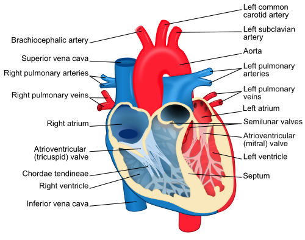

# TRAUMA CARDÍACO

O trauma cardíaco é um dos temas mais críticos da cirurgia do trauma e da emergência. Para a sua prova de residência, você precisa entender que o coração não é apenas uma bomba; no contexto do trauma, ele é uma estrutura confinada em um saco rígido (o pericárdio) e situada em uma zona de alto risco.

A mortalidade é alta, e o tempo entre o diagnóstico e a intervenção define quem vive e quem morre. Nas provas, o examinador quer saber se você consegue identificar rapidamente o tamponamento cardíaco e se você sabe quando abrir o peito do paciente.

## Mecanismos de Lesão: O "Como" determina o "O Quê"

Para entender o trauma cardíaco, dividimos didaticamente em dois grandes grupos. O comportamento clínico e a mortalidade mudam completamente entre eles.

### Trauma Penetrante (Ferimentos por Arma Branca ou Fogo)

Aqui, o objeto atravessa o pericárdio e atinge o miocárdio. O que acontece a seguir depende da integridade do pericárdio:

- **Se o orifício pericárdico for pequeno ou ocluir:** O sangue se acumula no espaço pericárdico, gerando **tamponamento cardíaco**. Isso é "bom" no curto prazo porque o próprio tamponamento limita o sangramento, mas é fatal se não aliviado.

- **Se o orifício pericárdico for grande:** O sangue drena livremente para a cavidade pleural. O resultado é o **choque hipovolêmico/exsanguinação**, sem tamponamento.

**Dica de Prova:** O tamponamento cardíaco é muito mais comum no trauma penetrante (especialmente por arma branca) do que no trauma contuso. Guarde isso: faca no peito = suspeita imediata de tamponamento.

### Trauma Contuso (Fechado)

Ocorre principalmente em acidentes automobilísticos de alta energia (desaceleração brusca) ou impactos diretos no esterno (volante contra o peito). As lesões variam desde uma simples contusão miocárdica (o "hematoma" do coração) até a ruptura de câmaras ou valvas.

Um conceito que a MedEvo sempre destaca é a **Commotio Cordis**. Não é uma lesão estrutural, mas elétrica. Um impacto súbito no tórax, exatamente sobre o coração, durante a fase vulnerável da repolarização ventricular (subida da onda T), pode induzir fibrilação ventricular (FV) imediata. É o caso clássico do atleta jovem que leva uma bolada no peito e cai em parada cardiorrespiratória. O tratamento aqui é o DEA (Desfibrilador Externo Automático) imediato.

## Anatomia Aplicada: A Zona de Ziedler

Você não pode ir para a prova sem saber o que é a **Zona de Ziedler** (também chamada de zona de perigo ou precórdio cirúrgico). Qualquer ferimento penetrante nesta área deve ser considerado uma lesão cardíaca até que se prove o contrário.

- **Limites da Zona de Ziedler:**

- Superior: Fúrcula esternal.

- Inferior: Apêndice xifoide/rebordo costal.

- Laterais: Linhas hemiclaviculares (direita e esquerda).

Se a questão descreve um paciente com uma facada no 4º espaço intercostal esquerdo, entre a linha paraesternal e a hemiclavicular, ele está na Zona de Ziedler. O próximo passo é procurar sinais de tamponamento.

*Figura 1 - Estetoscópio, símbolo da prática médica e da ausculta cardíaca essencial no diagnóstico do tamponamento. Fonte: Domínio Público | Wikimedia Commons*

## Tamponamento Cardíaco: O Vilão das Provas

O tamponamento ocorre quando o líquido (sangue) no espaço pericárdico aumenta a pressão intrapericárdica a ponto de impedir o enchimento diastólico das câmaras cardíacas. É um exemplo clássico de **choque obstrutivo**.

### A Fisiopatologia do "Porquê"

Por que o paciente choca? Se o ventrículo não expande na diástole, o volume sistólico cai. Para compensar, a frequência cardíaca sobe. Chega um ponto em que a pressão intrapericárdica iguala a pressão diastólica do ventrículo direito, e o débito cardíaco despenca.

### O Quadro Clínico e a Tríade de Beck

A famosa **Tríade de Beck** é o "padrão-ouro" das questões, mas cuidado com a vida real: ela só aparece completa em cerca de 10-30% dos casos.

- **Hipotensão:** Pelo baixo débito cardíaco.

- **Abafamento de bulhas cardíacas:** O sangue ao redor do coração atua como um isolante acústico.

- **Turgência Jugular:** O sangue não consegue entrar no átrio direito, "represando" nas veias do pescoço.

**Erro Comum de Aluno:** Achar que todo tamponado terá turgência jugular. Se o paciente também tiver uma hemorragia grave associada (hipovolemia), as jugulares podem estar colapsadas! A turgência só aparece se houver volume dentro do sistema.

### Sinais Adicionais Importantes

- **Pulso Paradoxal:** Queda da pressão arterial sistólica > 10 mmHg durante a inspiração. Por que ocorre? Na inspiração, o retorno venoso para o lado direito aumenta. Como o pericárdio está tenso, o septo interventricular é empurrado para a esquerda, reduzindo ainda mais o espaço do ventrículo esquerdo e, consequentemente, a pressão sistólica.

- **Sinal de Kussmaul:** Aumento da turgência jugular na inspiração (raro no agudo, mais comum na pericardite constritiva, mas pode cair).

- **Tríade de Beck + MV bilateral:** Se o paciente tem hipotensão e turgência jugular, mas o murmúrio vesicular (MV) está normal e simétrico, o diagnóstico é Tamponamento. Se o MV estivesse abolido de um lado, o diagnóstico seria Pneumotórax Hipertensivo. Essa é a diferenciação mais cobrada em provas de trauma.

## Diagnóstico: Do Exame Físico à Imagem

No trauma, seguimos o protocolo ATLS. O diagnóstico de tamponamento é clínico, mas pode ser auxiliado por exames de beira de leito.

### FAST e E-FAST

O **FAST (Focused Assessment with Sonography for Trauma)** revolucionou o atendimento. A janela pericárdica (subxifoide) permite visualizar a lâmina de líquido entre o pericárdio e o miocárdio.

- **Vantagem:** Rápido, não invasivo, pode ser feito durante a reanimação.

- **Limitação:** Operador-dependente e pode dar falso-negativo se o sangue coagular ou se o volume for muito pequeno (lembre-se: no trauma agudo, 50-100ml de sangue já podem causar tamponamento).

### Ecocardiograma de Emergência

É o exame de escolha para pacientes hemodinamicamente estáveis onde há dúvida diagnóstica. Ele avalia não só o líquido, mas o colapso das câmaras direitas e a função valvar.

### Radiografia de Tórax

No tamponamento agudo, o RX costuma ser **normal**. O coração "em moringa" ou "em balão" é sinal de derrame pericárdico crônico (lento), onde o pericárdio teve tempo de lacear. No trauma, o pericárdio é rígido.

- **Atenção:** Se o RX mostrar **mediastino alargado** (> 8cm ou perda do contorno do botão aórtico), mude sua suspeita para **Lesão Traumática de Aorta**.

| Achado Clínico | Tamponamento Cardíaco | Pneumotórax Hipertensivo |
| --- | --- | --- |
| Murmúrio Vesicular | Presente e Simétrico | Abolido unilateralmente |
| Percussão | Timpanismo (Normal) | Hipertimpanismo |
| Traqueia | Centralizada | Desviada para o lado oposto |
| Turgência Jugular | Presente | Presente |
| Choque | Obstrutivo | Obstrutivo |

*Figura 2 - Profissional de saúde em atendimento, representando o manejo de emergência do trauma cardíaco. Fonte: National Cancer Institute, Domínio Público | Wikimedia Commons*

## Manejo Terapêutico: O que fazer e quando?

O tratamento depende da estabilidade do paciente. Como diz o Dr. Will, "paciente instável no trauma é sinônimo de decisão rápida".

### 1. Medidas Iniciais

Oxigênio, dois acessos venosos calibrosos e infusão cautelosa de cristaloides. Aumentar a pré-carga pode ajudar temporariamente a "vencer" a pressão do tamponamento e melhorar o débito cardíaco até o tratamento definitivo.

### 2. Pericardiocentese (Punção de Marfan)

- **Indicação:** Medida de exceção/ponte. Realizada quando o paciente está morrendo e você não tem um cirurgião ou uma sala de cirurgia imediata.

- **Técnica:** Agulha inserida 1-2 cm abaixo do apêndice xifoide, em ângulo de 45°, direcionada para a escápula esquerda.

- **O "Pulo do Gato":** Mesmo que a pericardiocentese venha positiva e o paciente melhore, a **exploração cirúrgica é mandatória** no trauma penetrante. Você tirou o sangue, mas não fechou o buraco no coração.

### 3. Toracotomia de Emergência (Na Sala de Emergência)

Não confunda com a toracotomia feita no centro cirúrgico. Esta é uma manobra de "salvamento" desesperada.

- **Indicações (ATLS):**

- Trauma penetrante de tórax com perda de sinais vitais presenciada (na frente da equipe ou transporte curto).

- Tamponamento cardíaco que não responde às manobras iniciais.

- **Via de acesso:** Toracotomia ântero-lateral esquerda (5º espaço intercostal). Permite acesso ao coração, ao hilo pulmonar e o clampeamento da aorta descendente.

### 4. Tratamento Definitivo

Realizado no Centro Cirúrgico. A via preferencial para trauma cardíaco conhecido é a **Esternotomia Mediana**, pois oferece excelente visualização de todas as câmaras e grandes vasos.

- **Sutura cardíaca:** Geralmente feita com fios inabsorvíveis (Prolene 2-0 ou 3-0) com "almofadas" (pledgets) para evitar que o fio rasgue o miocárdio friável.

## Trauma Cardíaco Contuso (Contusão Miocárdica)

Diferente do penetrante, aqui o problema é a "batida". O ventrículo direito é a câmara mais atingida por estar logo atrás do esterno.

### Diagnóstico da Contusão

Não existe um exame único "matador". O diagnóstico é um quebra-cabeça:

- **Eletrocardiograma (ECG):** É o primeiro passo. Se o ECG for normal, a chance de complicação cardíaca grave é quase zero. Se houver arritmias, bloqueios (BRD é comum) ou alterações de ST-T, o paciente precisa de monitorização.

- **Troponina:** Tem alto valor preditivo negativo. Se vier negativa após 6h do trauma, ajuda a excluir lesão grave. Se positiva, isoladamente não confirma contusão (pode subir por outras causas no trauma), mas exige atenção.

- **Ecocardiograma:** Indicado se o paciente tiver instabilidade hemodinâmica ou alterações importantes no ECG. Procura por discinesias de parede ou lesões valvares.

### Complicações Mecânicas (O "Extra" das Provas)

Às vezes, as bancas misturam trauma com complicações de Infarto Agudo do Miocárdio (IAM).

- **CIV Pós-Traumática ou Pós-IAM:** Se o paciente apresenta um **sopro sistólico intenso** em borda esternal esquerda após um trauma contuso ou um IAM anterior, suspeite de Comunicação Interventricular por ruptura de septo.

## Lesão Traumática de Aorta

Embora seja um vaso e não o coração propriamente dito, está no centro do tema "Trauma Cardíaco e de Grandes Vasos".

- **Mecanismo:** Desaceleração brusca (queda de altura ou colisão frontal). A aorta "rasga" no **istmo aórtico** (logo após a emergência da artéria subclávia esquerda), que é o ponto de fixação pelo ligamento arterioso.

- **Sinal Radiológico Clássico:** Mediastino alargado (> 8 cm). Outros sinais: desvio da traqueia para a direita, apagamento do botão aórtico, depressão do brônquio fonte esquerdo.

- **Diagnóstico de Escolha:** Angiotomografia de Tórax (para pacientes estáveis). A Aortografia era o padrão-ouro antigo, hoje reservada para intervenções endovasculares.

- **Tratamento:** Controle rigoroso da frequência cardíaca (FC < 60) e pressão arterial (PAS entre 100-120 mmHg) com betabloqueadores (Esmolol) para evitar a progressão da lesão até o reparo definitivo (geralmente endovascular com stent).

## Resumo de Condutas por Cenário Clínico

| Cenário | Suspeita Principal | Conduta Imediata |
| --- | --- | --- |
| Faca no precórdio + Beck | Tamponamento Cardíaco | Sala de Cirurgia (Esternotomia) |
| Faca no precórdio + Parada | Tamponamento Cardíaco | Toracotomia de Emergência (Sala de Trauma) |
| Batida de carro + ECG alterado | Contusão Miocárdica | Monitorização por 24h + Enzimas |
| Queda de altura + Mediastino largo | Lesão de Aorta | Angio-TC + Controle de PA/FC |
| Bolada no peito + Parada em FV | Commotio Cordis | Desfibrilação (DEA) |

## Pontos-Chave para Prova

- **Tríade de Beck:** Hipotensão, bulhas abafadas e turgência jugular. É o "crachá" do tamponamento cardíaco nas questões.

- **Zona de Ziedler:** O retângulo do perigo (fúrcula, xifoide, hemiclaviculares). Ferimento aqui = coração em risco.

- **Diferencial Crítico:** Tamponamento (MV presente) vs. Pneumotórax Hipertensivo (MV abolido). Ambos dão turgência jugular e hipotensão.

- **Toracotomia de Emergência:** Via ântero-lateral esquerda no 5º espaço. Não é para paciente estável! É para quem parou ou está parando na sua frente.

- **Pericardiocentese:** É medida temporária. No trauma penetrante, a cirurgia é sempre necessária depois, mesmo se o paciente melhorar.

- **Commotio Cordis:** Morte súbita por impacto torácico sem lesão estrutural. Ocorre na fase de repolarização (onda T). Tratamento é desfibrilação.

- **Lesão de Aorta:** Ocorre no istmo. O sinal inicial é o mediastino alargado no RX. O tratamento inicial é clínico (betabloqueador) para evitar ruptura total.

- **Pulso Paradoxal:** Queda da PAS > 10 mmHg na inspiração. Típico de tamponamento.

- **Sinal de Kussmaul:** Aumento da pressão venosa na inspiração. Pode aparecer no tamponamento, mas é clássico da pericardite constritiva.

- **Atrito Pericárdico:** Sinal de pericardite (pode ser pós-traumática). Melhor ouvido com o diafragma do estetoscópio, paciente inclinado para frente e em expiração.

- **Estabilidade Hemodinâmica:** Se o paciente com trauma torácico está estável, o melhor exame para avaliar o coração de forma detalhada é o Ecocardiograma.

- **Volume de Tamponamento:** No trauma agudo, volumes pequenos (50-100ml) já causam choque porque o pericárdio não é complacente.

- **Via de Acesso Cirúrgico:** Esternotomia mediana é a melhor para o centro cirúrgico (estável). Toracotomia ântero-lateral esquerda é para a sala de emergência (moribundo).

- **Contraindicação Absoluta:** Não perca tempo com pericardiocentese se você tem um cirurgião e uma sala de cirurgia prontos para uma esternotomia/toracotomia.

- **Erro de Prova:** A alternativa dirá que a conduta no trauma de aorta com mediastino alargado é cirurgia imediata. Errado! Primeiro estabiliza a PA e FC (controle de "shear stress") e faz a Angio-TC. 🫀

 Cópia offline para consulta pessoal.
 Fonte original:
 [https://www.medevo.com.br/material-apoio/ler/2ecc6213-5a65-4859-be58-ab34ac46bed6](https://www.medevo.com.br/material-apoio/ler/2ecc6213-5a65-4859-be58-ab34ac46bed6)
