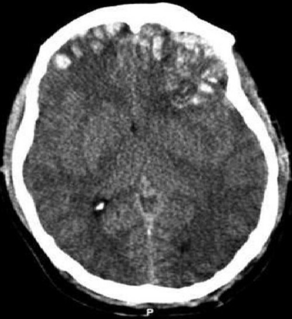
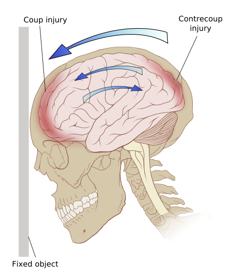

# TRAUMA CRANIOENCEFÁLICO

O Trauma Cranioencefálico (TCE) é, sem dúvida, um dos temas mais prevalentes e decisivos em provas de residência médica e na prática da emergência. Para entender o TCE, você não deve focar apenas na anatomia, mas sim na fisiologia da pressão intracraniana. O grande objetivo do nosso atendimento não é "curar" a lesão que já aconteceu (lesão primária), mas sim evitar que o cérebro sofra novos danos por falta de oxigênio ou pressão baixa (lesão secundária).

## Fisiopatologia e a Doutrina de Monro-Kellie

Para entender por que um hematoma pequeno pode matar um paciente, você precisa dominar a Doutrina de Monro-Kellie. Imagine o crânio como uma caixa fechada e rígida. Dentro dela, temos três componentes: o parênquima cerebral (80%), o sangue (10%) e o líquido cefalorraquidiano (LCR) (10%).

Como a caixa é rígida, o volume total deve ser constante. Se algo novo aparece, como um hematoma, o corpo tenta compensar expulsando primeiro o LCR e depois o sangue venoso. O problema é que essa capacidade de compensação tem um limite. Quando o hematoma continua crescendo e os mecanismos de compensação se esgotam, a Pressão Intracraniana (PIC) sobe abruptamente.

Aqui entra um conceito que o MedEvo sempre reforça: a Pressão de Perfusão Cerebral (PPC). A fórmula é simples, mas vital: **PPC = PAM - PIC**.
Se a PIC sobe ou a Pressão Arterial Média (PAM) cai, a perfusão do cérebro despenca. É por isso que, no trauma, um paciente hipotenso é um desastre para o prognóstico neurológico.

*Figura 1 - Estetoscópio, símbolo da prática médica e da avaliação neurológica no TCE. Fonte: Domínio Público | Wikimedia Commons*

## Avaliação Inicial e a Escala de Coma de Glasgow

A Escala de Coma de Glasgow (ECG) é o seu termômetro no TCE. Ela não serve apenas para dar uma nota ao paciente, mas para ditar condutas imediatas. Um erro comum de alunos é tentar decorar a tabela sem entender a aplicação.

Atualmente, utilizamos a atualização que inclui a Reatividade Pupilar (GCS-P), mas para fins de classificação de gravidade, ainda usamos a pontuação clássica de 3 a 15.

### Escala de Coma de Glasgow (Atualizada)

| Componente | Resposta | Pontuação |
| --- | --- | --- |
| **Abertura Ocular** | Espontânea | 4 |
| | Ao estímulo sonoro | 3 |
| | Ao estímulo de pressão (dor) | 2 |
| | Ausente | 1 |
| **Resposta Verbal** | Orientado | 5 |
| | Confuso | 4 |
| | Palavras inapropriadas | 3 |
| | Sons incompreensíveis | 2 |
| | Ausente | 1 |
| **Resposta Motora** | Obedece a comandos | 6 |
| | Localiza a dor | 5 |
| | Flexão normal (retirada) | 4 |
| | Flexão anormal (decorticação) | 3 |
| | Extensão (descerebração) | 2 |
| | Ausente | 1 |

**Dica de Ouro do Professor:** Cuidado com a resposta motora. A "flexão normal" é quando o paciente retira o braço do estímulo, mas não cruza a linha média do corpo para tentar tirar a mão do examinador. Se ele cruza a linha média e tenta remover sua mão, ele está "localizando a dor" (nota 5). Se ele faz uma flexão lenta, com rotação interna do punho, é decorticação (nota 3), indicando lesão acima do nível do tronco cerebral.

### Classificação do TCE

- **Leve:** Glasgow 13 a 15.

- **Moderado:** Glasgow 9 a 12.

- **Grave:** Glasgow 3 a 8.

Lembre-se: **Glasgow menor ou igual a 8 é indicação de Intubação Orotraqueal (IOT)**. Por que? Porque o paciente perde a capacidade de proteger a via aérea e o reflexo de tosse, aumentando o risco de aspiração e hipóxia, o que agrava a lesão cerebral.

## Manejo no X-ABCDE do Trauma (ATLS 10ª Edição)

A partir do ATLS 10ª edição (2018), o tradicional ABCDE ganhou o prefixo **X**, que representa o **controle de hemorragia externa exsanguinante** (eXsanguinating hemorrhage control). Esta atualização reconhece que, em cenários como ferimentos penetrantes ou amputações traumáticas, o controle de sangramentos maciços deve ser a primeira prioridade — antes mesmo da via aérea.

### X: Hemorragia Externa Exsanguinante

O **X** deve ser avaliado e tratado imediatamente à chegada do paciente, antes de avançar para A.

- **Identificar:** Sangramentos arteriais ou venosos de grande volume (jatos de sangue, poças de sangue).

- **Tratar:** Compressão direta firme, aplicação de **torniquete** (em extremidades) ou **curativos hemostáticos** impregnados (ex: QuikClot, Celox) em junções como axilas e virilha.

- **Dica de Prova:** O torniquete, antes visto como "último recurso", hoje é a primeira escolha em hemorragias de extremidades que ameaçam a vida. Deve ser apertado até cessar o sangramento e ter o horário de aplicação anotado.

### A e B: Via Aérea e Ventilação

O cérebro traumatizado é extremamente sensível à hipóxia e a variações de CO2.

- **Hipóxia:** Deve ser evitada a todo custo. Manter saturação > 94%.

- **CO2:** O dióxido de carbono é um potente vasodilatador cerebral. Se o CO2 sobe (hipercapnia), os vasos cerebrais dilatam, aumenta o volume de sangue no crânio e a PIC sobe. Se o CO2 cai muito (hipocapnia), os vasos contraem, o que diminui a PIC, mas pode causar isquemia por falta de fluxo.

- **Meta de PaCO2:** Manter entre 35 e 45 mmHg. A hiperventilação (para baixar o CO2) só deve ser usada como medida de exceção em sinais de herniação iminente e por curto período.

### C: Circulação e Controle de Hemorragia

Aqui está a maior pegadinha de prova: **TCE isolado não causa hipotensão**, exceto em fases terminais de herniação ou em lactentes (pelo volume do hematoma em relação ao corpo). Se o paciente está hipotenso e tem TCE, procure sangue em outro lugar (abdome, tórax, pelve ou ossos longos).

A meta de Pressão Arterial Sistólica (PAS) no TCE é:

- ≥ 100 mmHg para pacientes de 50 a 69 anos.

- ≥ 110 mmHg para pacientes de 15 a 49 anos ou acima de 70 anos.

### D: Déficit Neurológico

Além do Glasgow, avalie as pupilas.

- **Anisocoria:** Sugere herniação uncal. O nervo oculomotor (III par) é comprimido, causando midríase ipsilateral à lesão.

- **Sinais de Alerta:** Assimetria motora (hemiparesia) sugere lesão focal expansiva.

*Figura 2 - Profissional de saúde em atendimento, representando o manejo neurocirúrgico do TCE. Fonte: National Cancer Institute, Domínio Público | Wikimedia Commons*

## Lesões Intracranianas Específicas

As bancas amam comparar os hematomas. Vamos dissecar as diferenças para você nunca mais errar.

### Hematoma Epidural (ou Extradural)

Ocorre tipicamente após um trauma lateral no crânio (osso temporal), causando a ruptura da **artéria meníngea média**.

- **Imagem na TC:** Lente biconvexa (hiperdenso, formato de limão), não cruza as suturas cranianas.

- **Clínica Clássica:** O famoso "Intervalo Lúcido". O paciente sofre o trauma, desmaia, acorda e parece bem, mas minutos ou horas depois rebaixa bruscamente conforme o hematoma arterial cresce.

- **Tratamento:** Frequentemente cirúrgico (craniotomia de urgência) se houver desvio de linha média ou volume significativo.

### Hematoma Subdural

Geralmente decorrente da ruptura de **veias em ponte** entre o córtex e os seios venosos. É mais comum em idosos e etilistas (que possuem atrofia cerebral, deixando as veias mais esticadas e frágeis).

- **Imagem na TC:** Imagem em crescente ou côncavo-convexo (formato de banana), pode cruzar as suturas, mas não cruza a linha média.

- **Clínica:** Pode ser agudo, subagudo ou crônico. O prognóstico costuma ser pior que o do epidural, pois geralmente há lesão parenquimatosa associada.

### Lesão Axonal Difusa (LAD)

Ocorre por mecanismos de desaceleração súbita ou rotação (ex: acidentes automobilísticos de alta energia). Os axônios são literalmente "esticados" e rompidos.

- **Clínica:** Paciente com Glasgow muito baixo (coma) desde o momento do acidente, mas com uma **TC de crânio inicialmente normal** ou com pequenos pontos hemorrágicos na transição entre substância branca e cinzenta.

- **Diagnóstico:** Clínico-radiológico (dissociação entre o estado do paciente e a imagem da TC). A Ressonância Magnética é mais sensível, mas raramente feita na fase aguda.

| Característica | Hematoma Epidural | Hematoma Subdural |
| --- | --- | --- |
| **Vaso Acometido** | Artéria (Meníngea Média) | Veias (Veias em Ponte) |
| **Mecanismo** | Trauma temporal / Fratura | Desaceleração / Atrofia |
| **Formato na TC** | Biconvexo (Limão) | Crescente (Banana) |
| **Intervalo Lúcido** | Muito comum | Raro |
| **Gravidade** | Emergência cirúrgica focal | Frequentemente associado a dano cerebral difuso |

## Fraturas de Base de Crânio

Este é um diagnóstico clínico. Você não precisa de TC para suspeitar, e a presença desses sinais contraindica a passagem de sonda nasogástrica ou nasotraqueal (risco de a sonda entrar na cavidade craniana).

- **Sinal de Battle:** Equimose na região da mastoide (atrás da orelha).

- **Olhos de Guaxinim:** Equimose periorbitária bilateral.

- **Otorreia ou Rinoliquorreia:** Saída de líquor pelo ouvido ou nariz.

- **Hemotímpano:** Sangue atrás da membrana timpânica.

Se o paciente apresenta paralisia facial imediata após o trauma, suspeite de fratura de osso temporal atingindo o canal do nervo facial.

## Indicações de Tomografia de Crânio (Critérios de New Orleans e Canadian)

Nem todo paciente com TCE leve (Glasgow 13-15) precisa de TC. No entanto, para a prova, você deve conhecer as indicações clássicas de TC no TCE leve:

- Glasgow < 15 após 2 horas do trauma.

- Suspeita de fratura de crânio (aberta ou afundamento).

- Sinais de fratura de base de crânio.

- Vômitos (mais de 2 episódios).

- Idade > 65 anos.

- Uso de anticoagulantes (fator de risco altíssimo para sangramento tardio).

- Mecanismo de trauma perigoso (ejeção de veículo, queda de altura > 1 metro ou 5 degraus).

- Perda de Consciência

- Amnésia lacunar ou anterógrada

## Hipertensão Intracraniana (HIC) e Herniação

Quando a PIC sobe demais, o cérebro tenta "escapar" por onde pode. A herniação mais comum é a **Uncal**. O uncus do lobo temporal é empurrado para baixo, comprimindo o III par craniano e o pedúnculo cerebral.

- **Resultado:** Midríase ipsilateral (compressão do III par) e hemiparesia contralateral (compressão da via piramidal).

Outro sinal clássico de HIC grave é a **Tríade de Cushing**, que indica uma resposta reflexa do tronco cerebral ao aumento extremo da PIC:

- Hipertensão Arterial (tentativa de manter a PPC).

- Bradicardia (resposta vagal à hipertensão).

- Irregularidade Respiratória (compressão do tronco).

### Manejo da HIC na Emergência

Se o paciente apresenta sinais de herniação (anisocoria, postura de decorticação/descerebração), você deve agir rápido:

- **Elevação da cabeceira (30-45 graus):** Melhora o retorno venoso (desde que o paciente não esteja chocado).

- **Manitol:** Diurético osmótico. Dose: 0,25 a 1 g/kg. Cuidado: causa hipovolemia e hipotensão. Não use se o paciente estiver chocado.

- **Salina Hipertônica (3%):** Excelente alternativa ao manitol, especialmente se o paciente estiver hipotenso, pois ajuda na expansão volêmica enquanto reduz o edema cerebral.

- **Hiperventilação leve:** PaCO2 entre 30-35 mmHg (apenas como ponte para tratamento definitivo).

## Morte Encefálica: Critérios Brasileiros

Este tema despenca em provas de cirurgia e ética médica. Segundo a Resolução do CFM nº 2.173/2017, os critérios são rigorosos:

- **Pré-requisitos:** Lesão encefálica conhecida e irreversível; ausência de distúrbios hidroeletrolíticos graves, acidose extrema ou hipotermia (temperatura corporal deve estar > 35°C); ausência de efeito de drogas sedativas.

- **Exame Clínico:** Dois exames clínicos realizados por médicos diferentes (um deles deve ser neurologista, neurocirurgião, intensivista ou emergencista), com intervalo mínimo de 1 hora entre eles.

- **Teste de Apneia:** Deve demonstrar ausência de movimentos respiratórios e PaCO2 final > 60 mmHg.

- **Exame Complementar:** Deve demonstrar ausência de atividade elétrica (EEG), ausência de fluxo sanguíneo (Doppler transcraniano ou Arteriografia) ou ausência de metabolismo cerebral.

## Situações Especiais e Erros Comuns

### O Idoso com TCE

O Dr. Will sempre alerta: o idoso tem atrofia cerebral. Isso significa que ele tem mais espaço dentro do crânio. Um hematoma subdural pode crescer lentamente por semanas antes de dar sintomas. Sempre valorize uma queixa de "confusão mental" ou "queda de nível de consciência" em um idoso que caiu há 15 ou 20 dias.

### Profilaxia de Convulsões

A Fenitoína ou o Levetiracetam são indicados para prevenir convulsões **precoces** (na primeira semana) apenas no TCE grave ou com lesões corticais. Não há evidência de que previnam a epilepsia tardia (após 7 dias).

### Sedação no TCE

Evite o uso de benzodiazepínicos de longa duração, pois eles atrapalham o exame neurológico seriado. O Propofol é uma excelente escolha por ter meia-vida curta, mas cuidado com a hipotensão. A Quetamina, que antigamente era proibida no TCE por medo de aumentar a PIC, hoje é aceita e até recomendada em pacientes hipotensos, pois ajuda a manter a PAM sem elevar significativamente a PIC se o paciente estiver ventilado.

## Resumo de Condutas por Gravidade

### TCE Leve (GCS 13-15)

- Avaliar critérios de TC.

- Se TC normal e paciente sem fatores de risco: Observação por 6-12 horas.

- Alta com orientações por escrito (vigiar sonolência excessiva, vômitos, cefaleia intensa).

### TCE Moderado (GCS 9-12)

- TC de crânio para todos.

- Internação em ambiente monitorizado.

- Exame neurológico seriado (se cair o Glasgow, vira TCE grave).

### TCE Grave (GCS 3-8)

- ABCDE com foco em IOT imediata.

- TC de crânio após estabilização hemodinâmica.

- Monitorização de PIC (indicada se TC alterada ou se TC normal mas com > 40 anos, postura anormal ou PAS < 90 mmHg).

- Manter cabeceira elevada e controle rigoroso de temperatura e glicemia.

## Pontos-Chave para Prova 🧠

- **X-ABCDE (ATLS 10ª Ed.):** O "X" representa controle de hemorragia externa exsanguinante — antes mesmo da via aérea!

- **Torniquete:** Primeira escolha em hemorragia de extremidade que ameaça a vida. Anotar hora de aplicação.

- **Tríade de Cushing:** Hipertensão, bradicardia e bradipneia (sinal de HIC grave).

- **Hematoma Epidural:** Artéria meníngea média, biconvexo, intervalo lúcido.

- **Hematoma Subdural:** Veias em ponte, crescente, comum em idosos/etilistas.

- **Indicação de IOT:** Glasgow ≤ 8.

- **Meta de PaCO2:** 35 a 45 mmHg (evitar hiperventilação de rotina).

- **Hipotensão no TCE:** Nunca culpe o TCE isolado pela hipotensão; procure sangramento oculto.

- **Sinais de Base de Crânio:** Battle, Guaxinim, Hemotímpano, Liquorreia (contraindicam sondagem nasal).

- **Lesão Axonal Difusa:** Coma imediato com TC "inocente" (dissociação clínico-radiológica).

- **Pupila:** Midríase unilateral indica herniação uncal ipsilateral.

- **PPC:** Deve ser mantida entre 60-70 mmHg.

- **Convulsão:** Profilaxia apenas na primeira semana (precoce) em casos graves.

- **Morte Encefálica:** Exige 2 exames clínicos, 1 teste de apneia e 1 exame complementar.

- **Manitol:** Contraindicado se o paciente estiver hipotenso (use Salina Hipertônica 3%).

- **Fratura de Crânio Afundada:** Geralmente requer cirurgia se o afundamento for maior que a espessura do osso adjacente.

- **Intervalo Lúcido:** É a marca registrada do hematoma epidural, mas não é patognomônico (pode ocorrer em outras lesões).

- **Anisocoria no Trauma:** Sempre considerar emergência neurocirúrgica até prova em contrário.

- **Cricotireoidostomia:** Indicada se houver trauma facial grave que impeça a IOT (via aérea cirúrgica).

Este guia cobre a espinha dorsal do que é cobrado nas provas de residência. Lembre-se que no trauma, a agilidade no diagnóstico das lesões expansivas (hematomas) e a prevenção da hipóxia e hipotensão são o que realmente mudam o desfecho do paciente.

 Cópia offline para consulta pessoal.
 Fonte original:
 [https://www.medevo.com.br/material-apoio/ler/808b0a80-0a6c-486b-9ed9-2b626badbf33](https://www.medevo.com.br/material-apoio/ler/808b0a80-0a6c-486b-9ed9-2b626badbf33)
