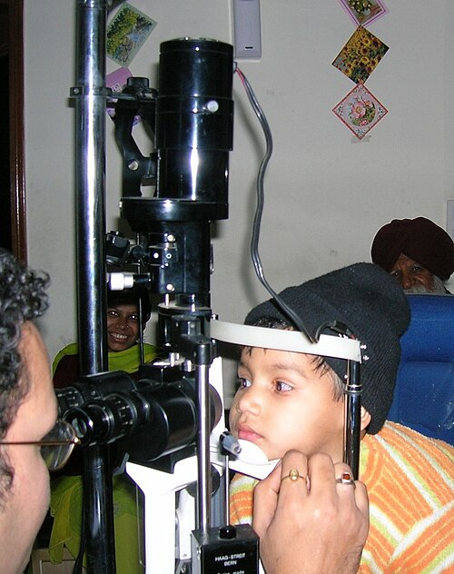

# TRAUMA DE SEGMENTO ANTERIOR

O trauma ocular é uma das principais causas de cegueira unilateral evitável no mundo. Quando falamos de segmento anterior, estamos focando nas estruturas que vão desde a córnea até a face posterior do cristalino. Para a sua prova de residência, o examinador não quer apenas que você saiba diagnosticar, ele quer que você saiba o que fazer primeiro e, principalmente, o que NÃO fazer para não piorar o prognóstico do paciente.

Muitos alunos negligenciam a anatomia básica, mas no trauma, ela é o seu mapa. Se você entende que o ângulo iridocorneano é a via de escoamento do humor aquário, você entende por que um trauma contuso pode causar glaucoma meses depois. Vamos construir esse raciocínio juntos.

## Classificação e Terminologia (BETTS)

Antes de qualquer coisa, você precisa falar a língua da oftalmologia moderna. Esqueça termos vagos. A terminologia padronizada é a Birmingham Eye Trauma Terminology (BETTS). As bancas adoram cobrar isso porque é um sistema lógico.

A primeira grande divisão é entre globo fechado e globo aberto. No globo fechado, a parede ocular (esclera e córnea) está íntegra. No globo aberto, há uma ferida de espessura total na parede ocular.

### Trauma de Globo Fechado

Aqui temos duas categorias principais:

- Contusão: O dano ocorre pelo impacto, sem que haja ruptura da parede. O dano pode ser no local do impacto ou à distância (mecanismo de contragolpe).

- Laceração Lamelar: É um ferimento de espessura parcial. Imagine um corte que não atravessa toda a córnea.

### Trauma de Globo Aberto

Este é o cenário de maior gravidade. Dividimos em:

- Ruptura: Causada por um objeto rombo. O olho explode de dentro para fora no ponto mais fraco (geralmente nas inserções dos músculos retos ou no limbo) devido ao aumento súbito da pressão intraocular.

- Laceração: Causada por um objeto cortante.

- Penetrante: Tem apenas uma ferida de entrada.

- Perfurante: Tem uma ferida de entrada e uma de saída (o objeto atravessou o globo).

- Corpo Estranho Intraocular (CEIO): Tecnicamente é uma laceração penetrante, mas ganha categoria própria pelo risco de toxicidade e infecção.

**Dica de Prova:** Cuidado com a confusão entre penetrante e perfurante. Lembre-se: o perfurante "fura" de um lado ao outro. A banca vai tentar trocar esses conceitos na sua prova.

## Avaliação Inicial e Exame Físico

No trauma ocular, a regra de ouro é: nunca manipule excessivamente um olho com suspeita de globo aberto. Se você suspeita que o olho furou, pare o exame físico ali mesmo, coloque um protetor rígido (sem apertar) e peça a avaliação do especialista.

### Acuidade Visual

Este é o sinal vital do olho. Sempre que possível, meça a acuidade visual de cada olho separadamente antes de qualquer intervenção. A única exceção absoluta a essa regra, que cai em toda prova, é a queimadura química. Na queimadura, você lava primeiro e pergunta depois.

### Exame Externo e Biomicroscopia

Procure por sinais de perfuração. O sinal de Seidel é o mais clássico. Ele ocorre quando aplicamos fluoresceína na superfície ocular e observamos, sob luz azul de cobalto, o humor aquário "lavando" o corante, indicando uma fístula ativa.

Se você vir uma pupila em formato de gota (corectopia), desconfie imediatamente. A ponta da "gota" geralmente aponta para o local da perfuração, onde a íris tentou tamponar a ferida (hérnia de íris).

**Tabela 1: Sinais de Alerta para Globo Aberto**

| Sinal Clínico | Significado Fisiopatológico |
| --- | --- |
| Hipotonia ocular severa | Perda de volume intraocular |
| Câmara anterior muito rasa ou muito profunda | Descompressão ou deslocamento de estruturas |
| Sinal de Seidel positivo | Extravasamento de humor aquário |
| Hifema total (Eight-ball) | Trauma de alta energia com risco de rotura |
| Herniação de tecido uveal | Ruptura da parede ocular com extrusão de conteúdo |

*Figura 1 - Estetoscópio, símbolo da prática médica e da avaliação oftalmológica no trauma ocular. Fonte: Domínio Público | Wikimedia Commons*

## Traumas Contusos: O Hifema

O hifema é a presença de sangue na câmara anterior. Ele ocorre geralmente pela ruptura de vasos do corpo ciliar ou da íris após um trauma contuso. Por que isso é perigoso? Não é apenas pelo sangue em si, mas pelas complicações: aumento da pressão intraocular (PIO) e impregnação hemática da córnea.

### Classificação do Hifema

Nós graduamos o hifema pela quantidade de sangue que preenche a câmara anterior:

- Grau I: Menos de 1/3 da câmara.

- Grau II: Entre 1/3 e 1/2 da câmara.

- Grau III: Mais de 1/2 da câmara, mas não total.

- Grau IV: Hifema total (chamado de "eight-ball" ou hifema em bola de sinuca, pois o sangue coagulado fica negro/vináceo).

### Manejo do Hifema

Aqui o Dr. Will sempre lembra: o objetivo principal é evitar o ressangramento. O ressangramento costuma ocorrer entre o segundo e o quinto dia após o trauma, e geralmente é muito mais grave que o sangramento inicial.

A conduta inicial baseia-se em:

- Repouso com cabeceira elevada a 45 graus: Isso faz o sangue sedimentar por gravidade, liberando o eixo visual e o ângulo da câmara anterior para drenagem.

- Cicloplégicos (Atropina 1% ou Ciclopentolato 1%): Por que usamos? Para dar conforto (diminuir o espasmo do corpo ciliar) e para evitar sinéquias (aderências da íris).

- Corticoides tópicos (Prednisolona 1%): Para reduzir a inflamação e estabilizar a barreira hemato-ocular, diminuindo o risco de ressangramento.

- Protetor ocular rígido: Para evitar que o paciente coce ou bata no olho dormindo.

**Atenção:** Nunca use Aspirina ou AINEs em pacientes com hifema, pois aumentam drasticamente o risco de ressangramento. Se houver dor, use Dipirona ou Paracetamol.

### Quando operar um hifema?

A maioria é de tratamento clínico. Mas você deve considerar a cirurgia (lavagem da câmara anterior) se:

- A PIO estiver acima de 50 mmHg por 5 dias.

- A PIO estiver acima de 35 mmHg por 7 dias.

- Houver sinais iniciais de impregnação hemática da córnea (a córnea começa a ficar amarelada/opaca).

- Em pacientes com anemia falciforme, o limiar é muito menor (PIO > 24 mmHg por mais de 24h), pois as hemácias em foice entopem o trabeculado muito mais rápido.

## Lesões de Íris e Cristalino

O trauma contuso pode causar danos permanentes à arquitetura interna do olho.

### Iridodiálise e Recesso Angular

A iridodiálise é o desprendimento da raiz da íris do corpo ciliar. Clinicamente, você verá uma "segunda pupila" na periferia. Já o recesso angular é o rasgo entre as fibras longitudinais e circulares do músculo ciliar.

Por que o recesso angular cai em prova? Porque ele é um preditor de glaucoma tardio. Se o paciente teve um trauma contuso e apresenta recesso angular em mais de 180 graus da circunferência, ele tem um risco altíssimo de desenvolver glaucoma de ângulo aberto anos depois. Por isso, todo trauma ocular precisa de acompanhamento vitalício.

### Cristalino: Catarata e Luxação

O cristalino pode sofrer de duas formas principais no trauma de segmento anterior:

- Catarata Traumática: Pode ser aguda (por ruptura da cápsula) ou tardia (formato em roseta ou pétala de flor). A opacificação ocorre pela entrada de humor aquário nas fibras do cristalino.

- Subluxação ou Luxação: Ocorre pela ruptura das zônulas de Zinn. Se o cristalino balança quando o paciente mexe o olho, chamamos de facodonesis. Se ele sai totalmente do lugar, pode ir para a cavidade vítrea ou para a câmara anterior.

**Exemplo Clínico:** Paciente de 40 anos, após soco no olho, queixa-se de visão trêmula e dor súbita. Ao exame, você vê o cristalino na câmara anterior, encostando na córnea. Isso é uma emergência! O cristalino na câmara anterior causa glaucoma agudo por bloqueio pupilar e lesão endotelial da córnea. O tratamento é cirúrgico imediato.

*Figura 2 - Profissional de saúde em atendimento, representando o manejo de emergência do trauma ocular. Fonte: National Cancer Institute, Domínio Público | Wikimedia Commons*

## Queimaduras Químicas

Esta é a verdadeira emergência oftalmológica. Se cair na sua prova, a resposta correta para "qual a primeira conduta" será sempre: irrigação copiosa imediata.

### Álcalis vs. Ácidos

As substâncias alcalinas (cal, cimento, produtos de limpeza com amônia, soda cáustica) são muito mais perigosas que as ácidas.

- Álcalis: Causam necrose por liquefação. Eles saponificam os lipídios das membranas celulares e penetram profundamente nos tecidos em minutos.

- Ácidos: Causam necrose por coagulação. As proteínas coaguladas formam uma barreira que limita a penetração do ácido. Exceção: ácido fluorídrico, que se comporta como álcali.

### Classificação de Roper-Hall

Essa classificação avalia o prognóstico baseado na transparência da córnea e na isquemia límbica (palidez da conjuntiva ao redor da córnea). O limbo é onde estão as células-tronco da córnea. Se o limbo "morreu" (está branco/isquêmico), a córnea não vai se regenerar.

**Tabela 2: Classificação de Roper-Hall para Queimaduras Químicas**

| Grau | Prognóstico | Achados Clínicos |
| --- | --- | --- |
| I | Excelente | Córnea transparente, sem isquemia límbica |
| II | Bom | Córnea levemente opaca, isquemia límbica < 1/3 |
| III | Reservado | Perda total do epitélio, opacidade estromal, isquemia 1/3 a 1/2 |
| IV | Muito Ruim | Córnea opaca (não vê a íris), isquemia límbica > 1/2 |

### Tratamento das Queimaduras

- Irrigação: Use pelo menos 2 a 3 litros de soro fisiológico ou Ringer Lactato. O objetivo é neutralizar o pH (medir com fita de pH após 5-10 min de pausa na lavagem). O pH alvo é entre 7.0 e 7.2.

- Desbridamento: Se houver partículas sólidas (como restos de cal), elas devem ser removidas mecanicamente, inclusive nos fórnices conjuntivais.

- Antibióticos tópicos: Para prevenir infecção secundária.

- Corticoides tópicos: Usados na primeira semana para controlar a inflamação, mas devem ser retirados ou usados com cautela após 10 dias, pois podem inibir a síntese de colágeno e facilitar a perfuração da córnea (melting).

- Ascorbato (Vitamina C): Ajuda na síntese de colágeno.

## Corpos Estranhos de Superfície

O cenário clássico é o trabalhador que estava usando esmeril sem óculos de proteção. Ele sente uma "areia" no olho que não melhora.

### Diagnóstico e Conduta

Ao examinar, você deve sempre eversão da pálpebra superior. Muitos corpos estranhos ficam escondidos no tarso superior, causando abrasões lineares verticais na córnea a cada piscada.

Se o corpo estranho for metálico, ele formará um anel de ferrugem (siderose localizada) em poucas horas. Esse anel é tóxico para o estroma corneano e deve ser removido com uma broca oftálmica ou agulha de insulina sob visualização na lâmpada de fenda.

**Dica MedEvo:** Se o corpo estranho for central (no eixo visual), o cuidado deve ser redobrado para minimizar a cicatriz (leucoma), que pode comprometer a visão permanentemente.

## Lacerações de Córnea e Esclera

Aqui entramos no campo do globo aberto por objeto cortante. O manejo inicial é o que cai na prova de clínica geral e cirurgia.

### Conduta no Pronto-Socorro

Se você diagnosticou ou suspeitou fortemente de uma perfuração ocular:

- Não instile colírios diagnósticos (como fluoresceína) se a ferida for óbvia.

- Não meça a pressão ocular (o aperto do tonômetro pode expulsar o conteúdo interno).

- Coloque um protetor rígido (o "escudo" de metal ou plástico) que se apoie nos ossos da órbita, nunca sobre o globo.

- Inicie antibioticoterapia sistêmica (geralmente uma cefalosporina de primeira geração ou quinolona, dependendo do protocolo local).

- Jejum absoluto para cirurgia de urgência.

- Vacinação antitetânica.

**Tabela 3: Diagnóstico Diferencial de Olho Vermelho Pós-Trauma**

| Condição | Característica Principal | Conduta Imediata |
| --- | --- | --- |
| Hemorragia Subconjuntival | Sangue vivo sob a conjuntiva, visão normal | Observação e orientação |
| Abrasão Corneana | Dor intensa, capta fluoresceína, trauma superficial | Pomada antibiótica e lubrificante |
| Hifema | Sangue na câmara anterior, nível líquido | Repouso, cabeceira elevada, colírios |
| Endoftalmite Traumática | Dor, hipópio, perda visual rápida pós-perfuração | Antibiótico intravítreo urgente |

## Complicações Tardias: O que o aluno esquece

O trauma não acaba quando a ferida fecha. Existem duas complicações que as bancas amam cobrar para diferenciar o aluno bom do excelente.

### Glaucoma Traumático

Pode ocorrer de forma aguda (por sangue ou inflamação entupindo o trabeculado) ou tardia (por recessão angular). O tratamento inicial é com supressores da produção de humor aquário (betabloqueadores como Timolol, inibidores da anidrase carbônica como Dorzolamida).

**Cuidado:** Evite análogos de prostaglandina (como Latanoprosta) na fase aguda do trauma, pois eles são pró-inflamatórios e podem piorar a situação.

### Oftalmia Simpática

Esta é a "queridinha" das questões de oftalmologia em provas de residência. É uma uveíte granulomatosa bilateral rara que ocorre após um trauma penetrante em um dos olhos (o olho traumatizado é chamado de "olho excitador").

O mecanismo é autoimune: antígenos oculares que nunca estiveram em contato com o sistema imune são expostos no trauma. O corpo cria anticorpos que atacam não só o olho ferido, mas também o olho saudável (chamado de "olho simpatizado").

- Prevenção: Se um olho traumatizado não tem mais percepção de luz e a reconstrução é impossível, a enucleação (retirada do globo) em até 14 dias após o trauma previne a oftalmia simpática.

## Situações Especiais e Particularidades

### Idosos

No idoso, o trauma de segmento anterior muitas vezes ocorre por quedas da própria altura. Um ponto importante é que muitos já são pseudofácicos (têm lente intraocular). O trauma pode deslocar essa lente para a cavidade vítrea ou causar a ruptura da cicatriz de uma cirurgia de catarata antiga.

### Crianças

O exame físico é o maior desafio. Frequentemente, é necessária a sedação ou anestesia geral apenas para avaliar a extensão do dano. Lembre-se do risco de ambliopia: qualquer opacidade de meios (como hifema ou catarata) em uma criança pequena deve ser resolvida rapidamente para não causar perda permanente da visão por desuso.

### Anemia Falciforme

Como mencionado no hifema, esses pacientes são um grupo de altíssimo risco. A hipóxia e a acidose na câmara anterior favorecem a falcização das hemácias, que não conseguem passar pelos poros do trabeculado. Isso causa aumentos brutais da PIO que podem levar à oclusão da artéria central da retina em poucas horas. Nesses pacientes, evite o uso de inibidores da anidrase carbônica sistêmicos (Acetazolamida), pois eles aumentam a acidose e favorecem a falcização.

## Resumo do Manejo Farmacológico

Para sua prova, decore as classes e as justificativas:

- Cicloplégicos (Atropina 1%): Usados no hifema e em inflamações intensas. Promovem o repouso do corpo ciliar e evitam sinéquias posteriores.

- Corticoides Tópicos (Prednisolona 1%): Controlam a inflamação. No trauma aberto, só iniciamos após o fechamento cirúrgico da ferida.

- Hipotensores Oculares: Timolol 0,5% (betabloqueador) e Dorzolamida 2% (inibidor da anidrase carbônica) são a primeira linha. Evite Brimonidina em crianças pequenas (risco de depressão do SNC).

- Antibióticos:

- Tópicos (Moxifloxacino ou Tobramicina): Usados em abrasões e após suturas.

- Sistêmicos: Indicados em todo trauma de globo aberto.

**Tabela 4: Metas e Limites no Trauma**

| Parâmetro | Valor de Referência / Meta | Por que importa? |
| --- | --- | --- |
| PIO no Hifema (Normal) | < 21 mmHg | Evitar dano ao nervo óptico |
| pH da Superfície Ocular | 7.0 a 7.2 | Indica neutralização do agente químico |
| Tempo para Enucleação | Até 14 dias | Prevenir Oftalmia Simpática |
| Cabeceira no Hifema | 45 graus | Favorecer sedimentação do sangue |

## Pontos-Chave para Prova

- A primeira conduta na queimadura química é a irrigação copiosa, antes mesmo de medir a acuidade visual.

- O sinal de Seidel indica perfuração ocular com extravasamento de humor aquário.

- No hifema, o período de maior risco para ressangramento é entre o 2º e o 5º dia pós-trauma.

- Aspirina e AINEs são contraindicações absolutas no paciente com hifema.

- A classificação BETTS divide o trauma em globo aberto e globo fechado; a ruptura é um trauma de globo aberto por objeto rombo.

- O recesso angular (visto na gonioscopia) é um fator de risco para glaucoma tardio.

- A pupila em gota (corectopia) sugere perfuração ocular com herniação de íris.

- Na suspeita de globo aberto, nunca realize tonometria de aplanação ou compressão do globo.

- O anel de ferrugem deve ser removido, pois o ferro é tóxico para o estroma da córnea.

- Pacientes com anemia falciforme e hifema precisam de controle rigoroso da PIO (limiar de intervenção > 24 mmHg).

- A catarata traumática clássica tem formato de roseta.

- Oftalmia simpática é uma uveíte autoimune bilateral após trauma penetrante unilateral.

- Álcalis são mais graves que ácidos porque causam necrose por liquefação e penetram mais fundo.

- O uso de corticoides em queimaduras químicas após o 10º dia deve ser cauteloso pelo risco de melting corneano.

- Em caso de corpo estranho corneano, sempre realize a eversão da pálpebra superior para procurar outros fragmentos.

- O tratamento inicial do glaucoma traumático foca na redução da produção do aquoso, evitando análogos de prostaglandina na fase inflamatória aguda. 🛡️

 Cópia offline para consulta pessoal.
 Fonte original:
 [https://www.medevo.com.br/material-apoio/ler/e060e7c6-da91-4cf5-a1b5-3e82cb58560b](https://www.medevo.com.br/material-apoio/ler/e060e7c6-da91-4cf5-a1b5-3e82cb58560b)
