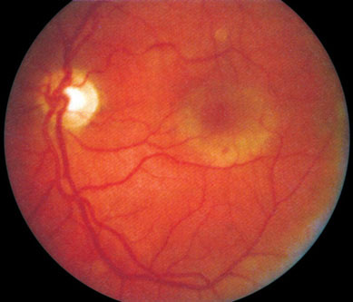
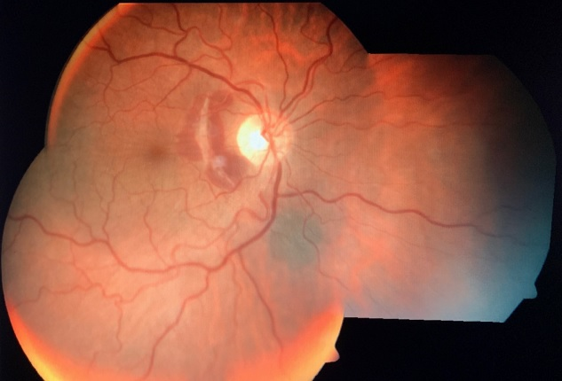
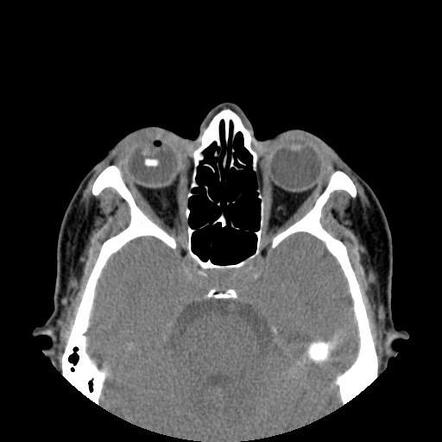
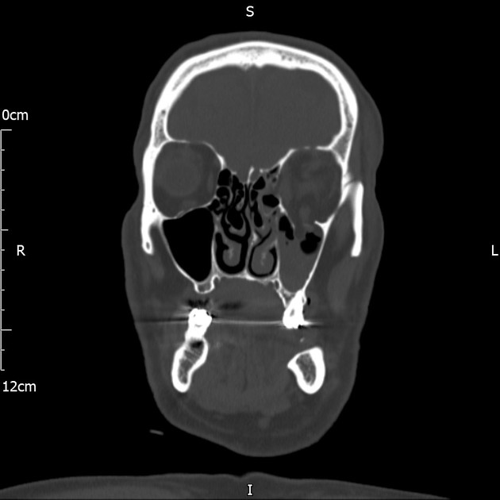
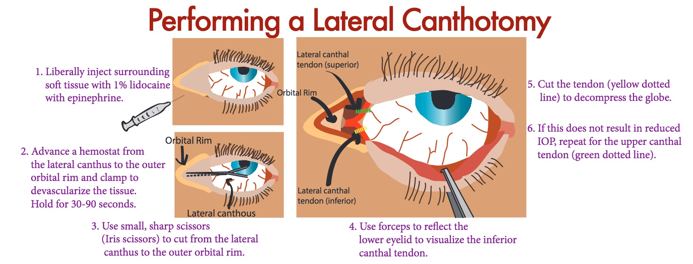
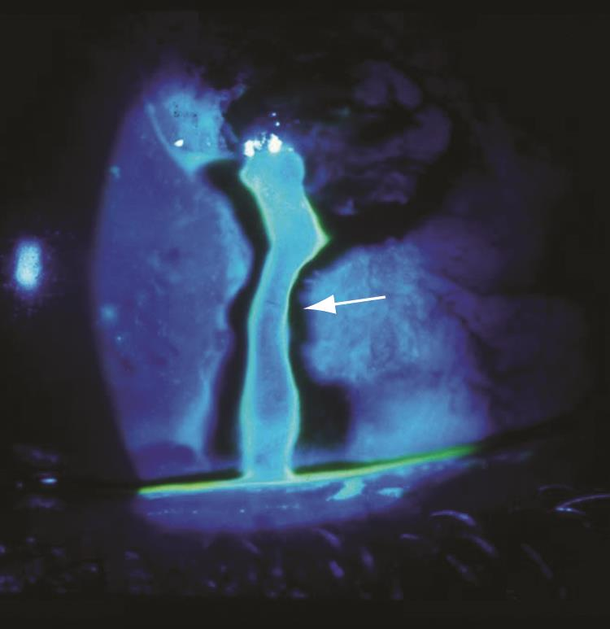

# TRAUMA DE SEGMENTO POSTERIOR E ÓRBITA

Para entender o trauma ocular de segmento posterior e de órbita, você precisa primeiro organizar sua mente. O trauma não é uma patologia única, mas um evento que desencadeia uma série de respostas fisiopatológicas. Na prova de residência, o examinador não quer apenas que você saiba o nome da lesão, ele quer que você saiba o que fazer no primeiro atendimento e como evitar a cegueira definitiva do paciente.

## Classificação BETT: O Alfabeto do Trauma

Antes de falarmos de retina ou órbita, precisamos falar a mesma língua. A classificação BETT (Birmingham Eye Trauma Terminology) é o padrão ouro e cai em praticamente todas as provas de trauma ocular. Se você errar a nomenclatura, você erra a conduta.

O trauma ocular é dividido inicialmente em dois grandes grupos: Globo Aberto e Globo Fechado.

No Trauma de Globo Fechado, a parede ocular (esclera e córnea) está íntegra. Ele se divide em:

- Contusão: O dano ocorre pelo impacto, sem ferida de espessura total.

- Laceração Lamelar: Uma ferida de espessura parcial. Imagine um corte que não atravessou toda a esclera.

No Trauma de Globo Aberto, temos uma ferida de espessura total. Aqui a confusão começa, então preste atenção:

- Ruptura: Causada por um objeto rombo. O olho "explode" de dentro para fora no ponto mais fraco (geralmente atrás das inserções dos músculos retos ou no limbo) devido ao aumento súbito da pressão intraocular.

- Laceração: Causada por um objeto cortante. O olho é cortado de fora para dentro.

- Penetrante: Tem apenas um orifício de entrada.

- Perfurante: Tem um orifício de entrada e um de saída (o objeto atravessou o globo).

- CEIO (Corpo Estranho Intraocular): O objeto entrou e ficou lá dentro.

Dr. Will sempre alerta: em provas, a banca adora trocar "ruptura" por "perfuração". Lembre-se que a ruptura é por objeto rombo (impacto de alta energia) e a perfuração exige entrada e saída.

### Classificação por Zonas

A zona do trauma dita o prognóstico. No segmento posterior, estamos falando quase sempre de Zona III.

- Zona I: Córnea e limbo.

- Zona II: Limbo até 5mm posterior na esclera (envolve corpo ciliar).

- Zona III: Posterior aos 5mm do limbo (envolve retina e coroide).

Quanto mais posterior (Zona III), pior o prognóstico visual. Isso é lógico: é onde está a maquinaria sensorial do olho.

## Trauma de Segmento Posterior: Oculto e Perigoso

Diferente do trauma de segmento anterior, onde você vê o hifema ou a catarata traumática na lâmpada de fenda, o trauma posterior muitas vezes exige exames complementares, pois o meio pode estar opaco (hemorragia vítrea).

### Commotio Retinae (Edema de Berlin)

*Figura 1: Commotio Retinae. Note a área esbranquiçada na retina macular, resultado da fragmentação dos segmentos externos dos fotorreceptores após trauma contuso. O prognóstico geralmente é bom.*

Este é um clássico. O paciente sofre um trauma contuso e, horas depois, apresenta uma mancha esbranquiçada na retina periférica ou na mácula.

Por que fica branco? Muitos alunos respondem "edema", mas cuidado. A terminologia "edema de Berlin" é consagrada, porém fisiopatologicamente imprecisa. Não há acúmulo de fluido extracelular significativo. O que ocorre é uma fragmentação dos segmentos externos dos fotorreceptores e dano ao epitélio pigmentado da retina (EPR).

O quadro clínico apresenta diminuição da acuidade visual se atingir a mácula. O prognóstico geralmente é bom, com resolução em semanas, mas pode deixar atrofia residual e perda visual permanente. Não há tratamento específico, apenas observação.

### Ruptura de Coroide

*Figura 2: Ruptura de Coroide. As linhas brancas em crescente são a esclera visível onde a membrana de Bruch rompeu. Risco tardio: neovascularização sub-retiniana.*

Imagine o olho sofrendo uma compressão anteroposterior. A esclera é elástica, a retina é elástica, mas a membrana de Bruch (na coroide) não é. Ela estica e rompe.

A ruptura de coroide aparece como uma linha esbranquiçada (pela esclera subjacente que fica visível), geralmente concêntrica ao disco óptico.

O perigo aqui não é apenas o trauma imediato. O erro clássico de prova é esquecer a complicação tardia: a Membrana Neovascular Sub-retiniana (MNVSR). Como a membrana de Bruch está rompida, vasos da coroide podem crescer para o espaço sub-retiniano meses ou anos depois, causando perda visual súbita. Pacientes com ruptura de coroide precisam de acompanhamento a longo prazo com tela de Amsler.

### Hemorragia Vítrea Traumática

A hemorragia vítrea ocorre pela ruptura de vasos da retina ou da coroide. O grande desafio aqui é: o que tem atrás do sangue?

Se você não consegue ver o fundo de olho, o exame obrigatório é a Ultrassonografia Ocular (Ecografia modo B). Você precisa descartar um descolamento de retina (DR) ou uma ruptura de globo oculta.

A conduta inicial na hemorragia vítrea isolada é o repouso com cabeceira elevada (para o sangue "assentar" por gravidade) e observação. Se não houver melhora ou se houver DR associado, a Vitrectomia Posterior via Pars Plana (VVPP) está indicada.

### Descolamento de Retina Traumático

O trauma é uma das principais causas de DR em jovens. Ele pode ocorrer por dois mecanismos principais:

- Diálise Retiniana: É a desinserção da retina na ora serrata. É a lesão mais patognomônica do trauma contuso. Frequentemente ocorre no quadrante temporal superior ou nasal superior.

- Buraco Macular Traumático: Ocorre pela força de tração vítrea súbita no polo posterior durante o impacto.

Dica de prova: O DR traumático pode demorar meses para se manifestar clinicamente. O paciente sofre o trauma hoje, mas o descolamento só chega à mácula daqui a 6 meses. Por isso, todo trauma contuso grave exige mapeamento de retina com depressão escleral.

## Corpos Estranhos Intraoculares (CEIO)

Aqui o tempo é músculo, ou melhor, retina. A gravidade de um CEIO depende do material, do tamanho e da trajetória.

*Figura 5: CEIO metálico na TC. O ponto branco (hiperdenso) dentro do globo é um corpo estranho metálico. Material reativo como ferro causa siderose; cobre causa calcose.*

### Toxicidade dos Materiais

Esta tabela é fundamental para sua prova:

| Material | Reatividade | Efeito no Olho |
| --- | --- | --- |
| Ferro | Alta | Siderose (tóxico para retina) |
| Cobre | Alta | Calcose (inflamação aguda, anel de K-F) |
| Ouro/Prata | Inerte | Bem tolerado |
| Vidro/Plástico | Inerte | Bem tolerado |
| Madeira/Vegetal | Altíssima | Risco altíssimo de Endoftalmite Fúngica |

A Siderose Ocular ocorre porque o ferro se deposita nas células epiteliais (cristalino, íris, retina). O sinal precoce é a alteração no Eletrorretinograma (ERG), com aumento da onda A e diminuição da onda B. Clinicamente, você pode ver heterocromia de íris (o olho afetado fica mais escuro/ferruginoso) e catarata.

A Calcose por cobre puro causa uma reação inflamatória maciça. Se for liga de cobre (latão ou bronze), pode causar o "anel de Kayser-Fleischer" traumático e a "catarata em girassol".

A conduta no CEIO é quase sempre a remoção cirúrgica via vitrectomia, especialmente se o material for reativo. Se for um material inerte, pequeno e em local de difícil acesso, pode-se considerar a observação, mas isso é exceção.

## Endoftalmite Pós-Traumática

É o pesadelo do oftalmologista. Ocorre em cerca de 7% a 10% dos traumas de globo aberto. Se houver CEIO, o risco sobe para 15%.

O agente etiológico mais comum em traumas rurais é o *Bacillus cereus*, que é extremamente agressivo e pode destruir o olho em 24 horas. Em ambientes urbanos, predominam *Staphylococcus* e *Streptococcus*.

A profilaxia é obrigatória em todo trauma de globo aberto:

- Antibiótico sistêmico (geralmente Ciprofloxacino ou Cefalosporina de 3ª geração).

- Antibiótico intravítreo (Vancomicina + Ceftazidima) se houver alta suspeita ou contaminação evidente.

- Sutura imediata da ferida.

No MedEvo, sempre reforçamos: se a questão mencionar trauma com matéria vegetal ou em ambiente rural, pense em *Bacillus cereus* e prognóstico sombrio.

## Trauma de Órbita: A Estrutura em Risco

A órbita é uma cavidade óssea rígida, mas com paredes muito finas em alguns pontos. O trauma de órbita pode ser isolado ou associado ao trauma do globo.

### Fratura Blow-out (Explosão)

Ocorre quando um objeto de diâmetro maior que a abertura orbitária (como uma bola de tênis ou um soco) atinge o olho. A pressão é transmitida para as paredes da órbita, que rompem para "aliviar" a pressão.

As paredes mais acometidas são:

- Parede Inferior (Assoalho): É a mais comum. O conteúdo orbitário (gordura e o músculo reto inferior) hernia para o seio maxilar.

- Parede Medial (Lâmina Papirácea): O conteúdo hernia para as células etmoidais. Pode causar enfisema orbitário (ar na órbita).

Sinais Clínicos da Fratura de Assoalho:

- Enoftalmo (o olho "afunda" porque a cavidade ficou maior).

- Diplopia na supra-oculodução (o paciente olha para cima e vê duplo). Por que? Porque o músculo reto inferior ficou aprisionado na fratura.

- Hipoestesia do nervo infraorbitário: O paciente sente o lábio superior e a bochecha dormentes. Isso cai muito em prova!

Diagnóstico: Tomografia de Computadorizada (TC) de crânio e órbitas com cortes finos (coronal é o melhor para ver o assoalho). Você verá o sinal da "gota" no seio maxilar.

*Figura 3: TC coronal — Fratura Blow-out do assoalho. O conteúdo orbitário (gordura e o músculo reto inferior) hernia para o seio maxilar, formando o "sinal da gota".*

Tratamento: Nem toda fratura é cirúrgica.

- Indicações de Cirurgia (geralmente após 7 a 14 dias para esperar o edema diminuir):

- Diplopia persistente em posição primária do olhar.

- Enoftalmo maior que 2mm.

- Fratura grande (mais de 50% do assoalho).

- Exceção (Cirurgia de Urgência): Fratura em "alçapão" (trapdoor) em crianças. O músculo fica preso e sofre isquemia (reflexo oculocardíaco com bradicardia e vômitos). É uma emergência pediátrica.

### Síndrome Compartimental Orbitária (Hemorragia Retrobulbar)

Esta é a emergência mais crítica da oftalmologia. Se você não agir em minutos, o paciente fica cego para sempre.

Ocorre quando um sangramento atrás do olho (retrobulbar) aumenta a pressão dentro da órbita. Como a órbita é um compartimento fechado, a pressão sobe e comprime o nervo óptico e a artéria central da retina.

Sinais de Alerta:

- Proptose súbita e "olho em pedra" (tenso à palpação).

- Diminuição da acuidade visual e Defeito Pupilar Aferente Relativo (DPAR).

- Equimose conjuntival e palpebral importante.

- Pressão Intraocular (PIO) muito elevada (ex: 50-60 mmHg).

Conduta: Cantotomia Lateral e Cantólise Lateral IMEDIATA.

*Figura 4: Cantotomia lateral. O procedimento de emergência que "abre" o compartimento orbitário, permitindo o olho se deslocar e aliviando a pressão sobre o nervo óptico. Deve ser feito ANTES de qualquer exame de imagem!*
Por que fazemos isso? Para "abrir" o compartimento e permitir que o olho se desloque para frente, aliviando a pressão sobre o nervo óptico.
Erro fatal: Mandar o paciente para a TC antes de fazer a cantotomia. O diagnóstico é CLÍNICO. Se houver sinais de compressão do nervo, você corta primeiro e pede o exame depois.

### Neuropatia Óptica Traumática (NOT)

Pode ser direta (objeto perfurante corta o nervo) ou indireta (a energia do impacto no rebordo orbitário é transmitida ao canal óptico, causando edema e isquemia do nervo).

O quadro é de perda visual súbita após trauma, com DPAR presente e fundo de olho inicialmente normal (o nervo demora semanas para ficar pálido).

Tratamento: É controverso.

- Observação é uma conduta aceitável.

- Corticosteroides em altas doses (Protocolo NASCIS) já foram muito usados, mas o estudo CRASH mostrou aumento da mortalidade em pacientes com trauma cranioencefálico associado. Portanto, use com extrema cautela e apenas se não houver contraindicação sistêmica.

- Descompressão cirúrgica do canal óptico em casos selecionados.

## Exame Físico e Diagnóstico no Trauma

Ao atender um trauma, siga a sequência lógica. Não se deixe distrair por um corte sangrento na pálpebra se o globo estiver aberto por baixo.

- Acuidade Visual: É o fator prognóstico mais importante. Sempre registre, mesmo que seja apenas "percepção luminosa".

- Reflexos Pupilares: A presença de Defeito Pupilar Aferente Relativo (Pupila de Marcus-Gunn) indica lesão grave de retina ou nervo óptico.

- Motilidade Ocular: Avalie aprisionamentos musculares.

- Biomicroscopia: Procure por sinal de Seidel (vazamento de humor aquoso em feridas penetrantes).

*Figura 6: Sinal de Seidel positivo. O fluxo claro diluindo a fluoresceína indica vazamento de humor aquoso por uma ferida de espessura total. Se positivo → globo aberto.*
5. Tonometria: Se houver suspeita de globo aberto, NÃO meça a pressão ocular. Você pode expulsar o conteúdo intraocular.
6. Fundo de Olho: Mapeamento de retina sob midríase (se o globo estiver fechado).

### Exames de Imagem

- TC de Órbitas: Padrão ouro para osso e corpo estranho metálico. Peça cortes axiais e coronais de 1mm.

- Ultrassonografia (Ecografia B): Essencial para ver o segmento posterior quando há opacidade de meios. Contraindicada se houver suspeita de globo aberto (a pressão da sonda pode piorar a lesão).

- RM (Ressonância): Contraindicação absoluta se houver suspeita de corpo estranho metálico (o imã da RM vai puxar o metal dentro do olho, destruindo tudo). É boa para corpos estranhos de madeira ou plástico após a fase aguda.

## Resumo de Condutas Farmacológicas

No trauma, a medicação serve para preparar o terreno para a cirurgia ou prevenir complicações.

- Tétano: Sempre verifique o status vacinal. O trauma ocular é considerado ferida contaminada.

- Antibióticos Sistêmicos:

- Ciprofloxacino 500mg VO 12/12h (tem boa penetração ocular).

- Alternativa: Ceftriaxona 1g IV 12/12h.

- Analgesia e Antieméticos: Evite que o paciente sinta dor ou vomite (o esforço do vômito aumenta a pressão venosa e pode causar extrusão de conteúdo ocular em globos abertos). Use Ondansetrona 4mg ou 8mg IV.

- Corticosteroides:

- Tópicos: Usados no trauma contuso para controlar a inflamação (irite traumática).

- Sistêmicos: Usados com cautela na NOT ou em inflamações orbitárias graves.

## Situações Especiais e Pegadinhas

### O Idoso e o Trauma

Idosos frequentemente usam anticoagulantes ou antiagregantes plaquetários. Isso transforma uma contusão simples em uma hemorragia retrobulbar ou um hifema maciço com muito mais facilidade. Além disso, a esclera do idoso é mais rígida e fina (placas senis), o que pode predispor a rupturas esclerais em traumas de menor energia.

### A Criança e a Fratura Trapdoor

Como mencionei, a criança tem ossos mais elásticos. Na fratura de assoalho, o osso pode "abrir e fechar" rapidamente, aprisionando o músculo reto inferior como se fosse uma armadilha. O olho pode parecer "branco" (sem equimose ou edema), mas a criança tem náuseas, vômitos e bradicardia devido ao reflexo oculocardíaco. Isso é frequentemente confundido com trauma cranioencefálico, mas a causa é o aprisionamento muscular. É cirurgia de urgência!

### O "Corpo Estranho Oculto"

Sempre desconfie de um CEIO se o paciente estava usando martelo e talhadeira ou se houve explosão. Às vezes a porta de entrada é tão pequena que fecha sozinha e o olho parece calmo no primeiro dia. Se a história clínica sugere alta velocidade, a TC é obrigatória.

## Tabelas Comparativas para Fixação

### Tabela 1: Diagnóstico Diferencial de Proptose Pós-Traumática

| Sinal | Hemorragia Retrobulbar | Enfisema Orbitário | Fístula Carótido-Cavernosa |
| --- | --- | --- | --- |
| Início | Imediato | Após assoar o nariz | Dias ou semanas após |
| Palpação | Rígida (olho em pedra) | Crepitação (estalidos) | Pulsátil |
| Ausculta | Silenciosa | Silenciosa | Sopro orbitário |
| Conduta | Cantotomia | Observação/Descompressão | Arteriografia/Embolização |

### Tabela 2: Indicações de Vitrectomia no Trauma Posterior

| Indicação | Por que operar? |
| --- | --- |
| Descolamento de Retina | Evitar perda visual definitiva e tise bulbar |
| Endoftalmite | Reduzir carga bacteriana e coletar material |
| CEIO Reativo | Evitar toxicidade (siderose/calcose) |
| Hemorragia Vítrea não resolvida | Permitir visualização e tratar lesões ocultas |
| Ruptura de Globo Posterior | Fechamento da parede e limpeza de debris |

### Tabela 3: Metas e Valores de Referência

| Parâmetro | Valor/Meta | Observação |
| --- | --- | --- |
| Pressão Intraocular (PIO) | < 21 mmHg | No trauma, PIO > 40 exige intervenção imediata |
| Tempo para Cantotomia | < 90-120 min | Após isso, o dano ao nervo óptico costuma ser irreversível |
| Janela para Cirurgia de Blow-out | 7 a 14 dias | Tempo para o edema reduzir e avaliar a diplopia real |
| Distância Limbo-Zona II | 5 mm | Marco anatômico para classificação BETT |

## Complicações e Prognóstico

O prognóstico visual no trauma de segmento posterior é determinado por:

- Acuidade visual inicial (o preditor mais forte).

- Tipo de trauma (ruptura tem pior prognóstico que penetração).

- Presença de DPAR.

- Extensão da lesão (Zona III é pior).

Uma complicação temida a longo prazo é a Oftalmia Simpática. É uma uveíte granulomatosa bilateral que ocorre após um trauma de globo aberto em um dos olhos. O sistema imune é exposto a antígenos oculares que estavam "escondidos" e passa a atacar o olho traumatizado E o olho sadio (olho simpatizante). Por isso, olhos sem percepção luminosa e com desorganização grave devem ser eviscerados ou enucleados em até 14 dias após o trauma para prevenir essa complicação.

## Pontos-Chave para Prova 💡

- Classificação BETT: Ruptura é objeto rombo (dentro para fora), Laceração é objeto cortante (fora para dentro).

- Zona III: Envolve o segmento posterior (atrás de 5mm do limbo). Pior prognóstico.

- Commotio Retinae: O esbranquiçamento é dano aos fotorreceptores, não edema de fluido intersticial.

- Ruptura de Coroide: Risco tardio de Membrana Neovascular Sub-retiniana (MNVSR). Acompanhar com tela de Amsler.

- Hemorragia Vítrea: Se não vir o fundo, faça Ecografia B (exceto se suspeita de globo aberto).

- Siderose Ocular: Ferro é tóxico. Altera o ERG (onda A aumenta, onda B diminui).

- Calcose: Cobre puro causa inflamação intensa. Ligas de cobre causam anel de K-F e catarata em girassol.

- Hemorragia Retrobulbar: Emergência clínica. Cantotomia e cantólise lateral antes de qualquer exame de imagem.

- Fratura de Assoalho (Blow-out): Hipoestesia do nervo infraorbitário e diplopia na supra-oculodução são as dicas de prova.

- Fratura em Alçapão (Trapdoor): Emergência em crianças. Olho branco + vômitos + bradicardia.

- RM no Trauma: Contraindicada se houver suspeita de corpo estranho metálico.

- Endoftalmite por *Bacillus cereus*: Comum em traumas rurais/vegetais. Evolução fulminante.

- Oftalmia Simpática: Uveíte autoimune no olho sadio após trauma no outro olho. Prevenção: remover o olho sem visão em até 14 dias.

- Sinal de Seidel: Positivo indica vazamento de humor aquoso (globo aberto).

- Antibiótico no Trauma: Ciprofloxacino é a escolha pela boa penetração ocular.

- O que NÃO fazer: Não pingar colírios anestésicos para o paciente levar para casa e não medir PIO se suspeitar de globo aberto.

 Cópia offline para consulta pessoal.
 Fonte original:
 [https://www.medevo.com.br/material-apoio/ler/36e03126-9598-40c8-86df-9496ff1beee9](https://www.medevo.com.br/material-apoio/ler/36e03126-9598-40c8-86df-9496ff1beee9)
