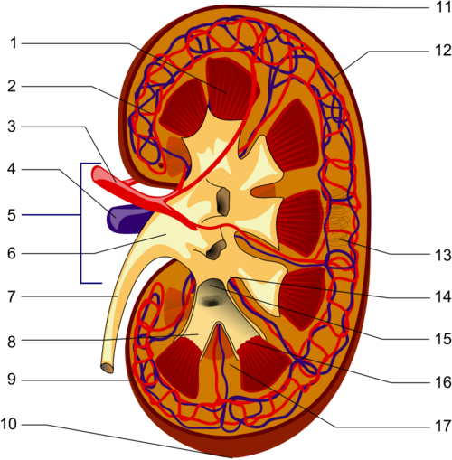

# TRAUMA GENITURINÁRIO

Quando falamos de trauma geniturinário em provas de residência, você precisa ter uma mentalidade muito clara: o examinador quer saber se você sabe **quando NÃO tocar no paciente** e se você sabe diferenciar uma conduta conservadora de uma emergência cirúrgica.

O sistema urinário é "escondido" no retroperitônio (rins e ureteres) ou protegido pela bacia (bexiga e uretra posterior). Por isso, lesões nesses órgãos costumam vir acompanhadas de grandes traumas multissistêmicos. No MedEvo, sempre batemos na tecla: antes de olhar para o rim, olhe para o ABCDE do ATLS. Estabilidade hemodinâmica é a palavra de ordem aqui.

*Figura 1 - Estetoscópio, símbolo da prática médica e da avaliação urológica no trauma. Fonte: Domínio Público | Wikimedia Commons*

## Trauma Renal

O rim é o órgão geniturinário mais comumente lesionado. Em cerca de 80% a 90% dos casos, o mecanismo é o trauma contuso (acidentes automobilísticos, quedas). Os outros 10-20% são traumas penetrantes (PAF ou arma branca).

### O Porquê da Avaliação Inicial

Por que nem todo paciente com dor lombar pós-trauma precisa de tomografia? Porque a maioria das lesões renais é leve e o manejo é conservador. No entanto, você não pode deixar passar uma lesão de pedículo vascular ou uma laceração grave.

**Quem precisa de imagem (TC de abdome com contraste)?**
A Sociedade Brasileira de Urologia (SBU) e as diretrizes internacionais são claras:

- Adultos com trauma contuso E hematúria macroscópica.

- Adultos com trauma contuso, hematúria microscópica (>5 hemácias/campo) E hipotensão (PAS < 90 mmHg) em algum momento do atendimento.

- Trauma por desaceleração brusca (mesmo sem hematúria, pois pode haver lesão de pedículo).

- Trauma penetrante com qualquer suspeita de trajetória renal.

- Crianças: Qualquer hematúria (micro ou macro) ou suspeita clínica. O rim da criança é proporcionalmente maior e menos protegido por gordura e costelas.

**Cuidado com a pegadinha:** O grau da hematúria NÃO se correlaciona com a gravidade da lesão renal. Você pode ter uma avulsão completa da artéria renal (lesão Grau V) e o paciente apresentar zero hematúria, simplesmente porque o sangue não chega ao sistema coletor.

### Classificação AAST (American Association for the Surgery of Trauma)

Você precisa decorar isso? Para a prova, sim. Mas entenda a lógica para facilitar:

| Grau | Descrição da Lesão | Achado na TC |
| --- | --- | --- |
| **I** | Contusão ou hematoma subcapsular | Não expansivo, sem laceração cortical. |
| **II** | Hematoma perirrenal ou laceração < 1cm | Limitado ao retroperitônio; laceração não atinge medular. |
| **III** | Laceração > 1cm | Atinge o córtex, mas SEM extravasamento urinário. |
| **IV** | Laceração profunda ou lesão vascular | Atinge sistema coletor (extravasamento) OU lesão de artéria/veia segmentar. |
| **V** | Rim "estilhaçado" ou avulsão do hilo | Desvascularização completa ou lacerações múltiplas graves. |

### Manejo: Conservador vs. Cirúrgico

Hoje, a tendência é o **manejo conservador** (non-operative management). Mesmo lesões Grau IV, se o paciente estiver estável, podem ser tratadas com repouso, hidratação e observação.

**Quando operar (Laparotomia/Exploração Renal)?**

- Instabilidade hemodinâmica persistente (o paciente não responde à reposição e o sangramento é claramente renal).

- Hematoma perirrenal em expansão ou pulsátil (visto durante uma laparotomia por outro motivo).

- Lesão Grau V (avulsão de pedículo).

**E o "Blush" arterial?**
Se na TC você vê extravasamento de contraste ativo (o "blush"), mas o paciente está **estável**, a conduta de escolha é a **Angioembolização** por radiologia intervencionista. Guarde isso: estabilidade + sangramento ativo no rim = angioembolização.

## Trauma de Ureter

O ureter é o "protegido" da urologia. É difícil lesioná-lo em traumas contusos porque ele é elástico e bem protegido.

**Etiologia:**
A causa número 1 de lesão ureteral é **iatrogênica** (cirurgias ginecológicas, colorretais ou a própria ureteroscopia). No trauma externo, a causa mais comum é o trauma penetrante (PAF).

**O Diagnóstico é o problema:**
Muitas vezes a lesão é silenciosa no início. O paciente evolui dias depois com febre, dor lombar ou saída de urina pelo dreno (urinoma). Se houver suspeita no trauma agudo, a TC com **fase tardia (excretora)** é fundamental. Sem a fase de 10-15 minutos, você não vê o contraste saindo do ureter.

**Tratamento:**

- Lesões parciais ou contusões: Stent ureteral (Duplo J). O Dr. Will sempre lembra: o stent serve para "moldar" a cicatrização e evitar estenose.

- Lesões distais (perto da bexiga): Ureteroneocistostomia (reimplante direto na bexiga).

- Lesões extensas: Cirurgias complexas como o Boari Flap ou Psoas Hitch (trazer a bexiga até o ureter).

## Trauma de Bexiga

Aqui a banca vai testar se você sabe anatomia. A bexiga pode romper de duas formas, e o tratamento é completamente diferente.

### Ruptura Extraperitoneal (80%)

Geralmente associada a **fraturas de bacia**. Uma espícula óssea "fura" a bexiga. O contraste na cistografia fica localizado ao redor da base da bexiga (aspecto em "chamas de vela").

- **Conduta:** Conservadora. Basta passar uma sonda de Foley de grosso calibre e deixar por 10-14 dias. A bexiga cicatriza sozinha se estiver vazia.

### Ruptura Intraperitoneal (20%)

Ocorre tipicamente com a **bexiga cheia** (o " trauma do cinto de segurança" ou o "chute no baixo ventre" após o bar). O aumento súbito da pressão rompe a cúpula vesical (o ponto mais fraco). A urina cai na cavidade peritoneal, causando peritonite química e aumento de ureia/creatinina por absorção peritoneal.

- **Conduta:** Cirúrgica. Laparotomia + Sutura da bexiga em dois planos com **fio absorvível** (ex: Poliglactina/Vicryl).

- **Por que fio absorvível?** Se você usar fio inabsorvível (seda ou nylon) e ele ficar em contato com a urina, ele servirá de nicho para formação de cálculos.

**Diagnóstico de escolha:** Cistografia retrógrada (ou Cisto-TC). Tem que encher a bexiga com pelo menos 300ml de contraste para "testar" a parede.

*Figura 2 - Profissional de saúde em atendimento, representando o manejo do trauma geniturinário. Fonte: National Cancer Institute, Domínio Público | Wikimedia Commons*

## Trauma de Uretra

Este é o tópico preferido das bancas. É aqui que o médico desavisado comete o erro que vai custar a carreira: passar uma sonda de Foley em quem não devia.

### Classificação Anatômica

- **Uretra Posterior (Membranosa e Prostática):** Acima do diafragma urogenital. Associada a **fraturas de bacia** (cisalhamento).

- **Uretra Anterior (Bulbar e Peniana):** Abaixo do diafragma. A uretra bulbar é a mais lesionada na famosa **"queda a cavaleiro"** (bater o períneo em uma barra, muro ou selim).

### O Quadro Clínico Clássico (A Tríade Proibida)

Se o paciente apresenta:

- **Uretrorragia** (sangue no meato uretral).

- **Retenção urinária** (bexigoma).

- **Fratura de pelve** ou hematoma perineal.

- (Bônus) **Próstata "alta" ou não palpável** no toque retal.

**A conduta é: NÃO PASSAR SONDA VESICAL.**
Se você tentar passar a sonda às cegas, pode transformar uma lesão parcial em lesão completa.

**O que fazer então?**
O exame padrão-ouro é a **Uretrocistografia Retrógrada**. Você injeta contraste pelo meato e vê se ele progride para a bexiga ou se extravasa.

- Se houver lesão e o paciente precisar esvaziar a bexiga: **Cistostomia Suprapúbica**.

### Diferenças Cruciais entre Uretra Anterior e Posterior

| Característica | Uretra Posterior | Uretra Anterior (Bulbar) |
| --- | --- | --- |
| **Mecanismo** | Fratura de Bacia | Queda a cavaleiro / Trauma direto |
| **Sinal Típico** | Próstata elevada / Hematoma pélvico | Hematoma em "asa de borboleta" no períneo |
| **Conduta Aguda** | Cistostomia e reparo tardio | Cistostomia ou reparo primário (se penetrante) |
| **Complicação** | Impotência e Incontinência | Estenose de uretra |

## Trauma de Genitália Externa

### Fratura de Pênis

Não é uma fratura óssea (obviamente), mas sim a **ruptura da túnica albugínea** que reveste os corpos cavernosos. Ocorre durante a ereção (geralmente no intercurso sexual, quando o pênis "escapa" e bate na sínfise púbica da parceira/o).

- **Clínica:** Estalido audível ("crack"), dor súbita, detumescência imediata e hematoma em "berinjela".

- **Associação:** Em 15-20% dos casos, há lesão de uretra associada. Se houver sangue no meato, peça uretrografia antes.

- **Tratamento:** Cirurgia de urgência. Limpeza do hematoma e sutura da túnica albugínea. O tratamento conservador leva a deformidades e disfunção erétil.

### Trauma Escrotal

O grande objetivo aqui é saber se houve **ruptura da túnica albugínea testicular**.

- Se o testículo estiver íntegro no USG Doppler: Gelo, suspensório escrotal e analgésicos.

- Se houver perda da continuidade da túnica ou perda de fluxo: Exploração cirúrgica e sutura (orquidopexia).

## Comparativo de Condutas no Trauma Geniturinário

| Suspeita Clínica | Exame Inicial | Conduta de Escolha |
| --- | --- | --- |
| Trauma Renal (Estável) | TC Abdome com Contraste | Conservador (maioria) |
| Trauma Renal (Instável) | FAST / Laparotomia | Exploração cirúrgica / Nefrectomia |
| Ruptura Bexiga Intraperitoneal | Cistografia Retrógrada | Cirurgia (Sutura) |
| Ruptura Bexiga Extraperitoneal | Cistografia Retrógrada | Sonda de Foley (Conservador) |
| Lesão Uretral (Uretrorragia) | Uretrografia Retrógrada | Cistostomia Suprapúbica |
| Fratura de Pênis | Clínico | Cirurgia de Urgência |

## Pontos-Chave para Prova

- **Hematúria macroscópica** no trauma renal não define gravidade, mas indica necessidade de TC em adultos.

- **Trauma Renal Grau II:** Laceração < 1cm, sem extravasamento de urina. Manejo é sempre conservador.

- **Angioembolização:** É a resposta correta para o paciente com trauma renal estável que apresenta extravasamento ativo de contraste (blush) na TC.

- **Ruptura de Bexiga Intraperitoneal:** Ocorre na cúpula. Causa peritonite. Tratamento é cirúrgico obrigatório.

- **Ruptura de Bexiga Extraperitoneal:** Associada a fratura de bacia. Tratamento é apenas sondagem vesical (Foley).

- **Contraindicação ABSOLUTA de Sondagem Vesical:** Suspeita de lesão uretral (uretrorragia, próstata alta, hematoma perineal).

- **Uretrografia Retrógrada:** Deve ser feita ANTES de qualquer tentativa de sondagem se houver suspeita de lesão de uretra.

- **Queda a cavaleiro:** Mecanismo clássico de lesão de uretra bulbar (anterior).

- **Fratura de bacia:** Mecanismo clássico de lesão de uretra membranosa (posterior).

- **Tratamento da Lesão Uretral Completa:** Cistostomia suprapúbica imediata e reconstrução tardia (após 3-6 meses).

- **Fratura de Pênis:** Ruptura da túnica albugínea. O diagnóstico é clínico e o tratamento é cirúrgico imediato.

- **Ureter:** Lesões iatrogênicas são as mais comuns. Se for distal, o tratamento é o reimplante (ureteroneocistostomia).

- **Fio de sutura na bexiga:** Sempre absorvível (Vicryl/Poliglactina). Nunca use seda ou nylon dentro da via urinária.

- **Crianças no trauma renal:** São muito mais sensíveis. Qualquer hematúria (mesmo microscópica) em criança vítima de trauma exige investigação com imagem. 🛡️

 Cópia offline para consulta pessoal.
 Fonte original:
 [https://www.medevo.com.br/material-apoio/ler/5fb133b9-62a0-457f-a43a-cdabaf01e0d5](https://www.medevo.com.br/material-apoio/ler/5fb133b9-62a0-457f-a43a-cdabaf01e0d5)
