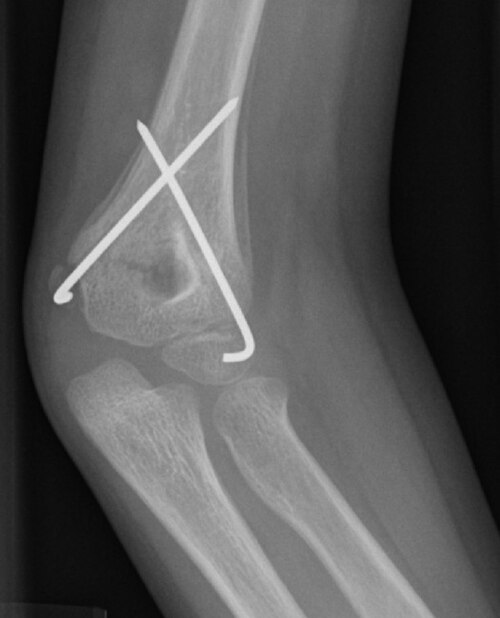

# TRAUMA PEDIÁTRICO

O trauma é uma das principais causas de morte em crianças acima de um ano. No atendimento inicial, a criança não deve ser tratada como um adulto pequeno: proporções corporais, reserva fisiológica, via aérea, resposta ao choque, risco de hipotermia e padrões de lesão são diferentes.

O objetivo do manejo é reconhecer rapidamente ameaças à vida, corrigir hipóxia e choque, prevenir hipotermia e identificar lesões ocultas. A fisiopatologia explica a conduta: a criança compensa por muito tempo e descompensa de forma abrupta.

## Particularidades Anatômicas e Fisiológicas

Por que a criança se lesiona de forma diferente? Primeiro, o corpo da criança tem uma superfície corporal maior em relação ao peso, o que facilita a perda de calor. Além disso, os órgãos internos estão mais próximos uns dos outros e são protegidos por uma parede abdominal e torácica mais fina e com menos gordura.

### Via Aérea e Respiração

A cabeça da criança é proporcionalmente maior, o que causa uma flexão passiva do pescoço quando ela está em decúbito dorsal, podendo obstruir a via aérea. A língua é grande em relação à orofaringe e a laringe é mais alta (nível de C3-C4) e em formato de funil, sendo a região da cartilagem cricoide a mais estreita.

No tórax, a complacência é altíssima. As costelas são mais cartilaginosas e elásticas. Isso explica um ponto crítico: a criança pode ter contusão pulmonar grave sem fratura de costela. Quando há fratura de costela em lactente, deve-se suspeitar de trauma de alta energia ou maus-tratos.

### Circulação e Choque

A criança tem uma reserva fisiológica fantástica. Ela consegue manter a pressão arterial normal mesmo perdendo até 25 a 30% do volume sanguíneo total. Como ela faz isso? Aumentando a frequência cardíaca e a resistência vascular periférica (vasoconstrição severa).

Cuidado: quando a pressão arterial cai na criança, ela já está em choque descompensado (perda de 25-40% do volume). A hipotensão é um sinal tardio e pré-mortal. O diagnóstico de choque inicial é clínico: taquicardia, tempo de enchimento capilar lentificado (> 2 segundos) e alteração do nível de consciência.

*Figura 1 - Profissional de saúde em atendimento, representando a avaliação inicial do trauma pediátrico. Fonte: National Cancer Institute, Domínio Público | Wikimedia Commons*

## Avaliação Inicial: O ABCDE do Trauma Pediátrico

A sequência de atendimento segue o padrão do ATLS, com adaptações pediátricas. A prioridade é tratar ameaças imediatas antes de completar a investigação diagnóstica.

ABCDE no trauma pediátrico

A — Airway + coluna cervical
 → abrir via aérea com proteção cervical, aspirar secreções, avaliar necessidade de via aérea definitiva

B — Breathing
 → procurar pneumotórax hipertensivo, pneumotórax aberto, hemotórax maciço e contusão pulmonar

C — Circulation
 → controlar hemorragia, obter acesso IV/IO, reconhecer choque compensado e aquecer fluidos

D — Disability
 → Glasgow pediátrico, pupilas, glicemia, convulsões e sinais de hipertensão intracraniana

E — Exposure/Environment
 → expor completamente, procurar lesões ocultas e prevenir hipotermia agressivamente

### A: Via Aérea com Controle da Coluna Cervical

A prioridade zero é garantir que o oxigênio chegue ao pulmão. Se a criança fala ou chora, a via aérea está pérvia. Se houver obstrução, a primeira manobra é o *jaw thrust* (tração da mandíbula), evitando a hiperextensão do pescoço.

Se precisar de uma cânula de Guedel, lembre-se da pérola clínica: a medida vai do lóbulo da orelha até a comissura labial. Diferente do adulto, na criança pequena a cânula deve ser inserida diretamente na posição correta, sem a rotação de 180 graus, para não lesionar o palato mole e causar sangramento.

A indicação de via aérea definitiva (Intubação Orotraqueal - IOT) ocorre em:

- Glasgow ≤ 8 (ou 9 em algumas diretrizes, mas 8 é o corte clássico para proteção de via aérea).

- Insuficiência respiratória ou apneia.

- Choque refratário.

- Necessidade de proteção contra aspiração (sangue ou vômitos massivos).

Sobre a pré-medicação: a atropina pode ser considerada em lactentes, em crianças com bradicardia ou em situações de maior risco de resposta vagal durante a intubação, conforme protocolo local. A bradicardia no trauma pediátrico deve sempre levantar suspeita de hipóxia, choque avançado ou deterioração iminente.

### B: Respiração e Ventilação

Aqui buscamos o que mata rápido: pneumotórax hipertensivo, pneumotórax aberto e hemotórax maciço.
Taquipneia, hipotensão, desvio de traqueia, murmúrio vesicular abolido e hipertimpanismo sugerem pneumotórax hipertensivo. A conduta é descompressão imediata, preferencialmente no 4º/5º espaço intercostal na linha axilar anterior ou média conforme protocolo e disponibilidade, seguida de drenagem torácica.

### C: Circulação com Controle de Hemorragia

O acesso venoso preferencial são duas veias periféricas calibrosas. Se o acesso periférico não for obtido rapidamente após tentativas iniciais, deve-se partir para acesso intraósseo. Não se deve perder tempo com acesso central em criança chocada quando a via intraóssea está indicada.

A reposição volêmica inicial é feita com cristaloides isotônicos aquecidos, com reavaliação após cada bolus. Persistência de instabilidade após volume inicial, suspeita de hemorragia significativa ou necessidade de múltiplos bolus deve antecipar hemoderivados e controle definitivo da fonte de sangramento.

### D: Disfunção Neurológica

Utilizamos a Escala de Coma de Glasgow Pediátrica, que adapta a resposta verbal para crianças que ainda não falam.

| Resposta | Pontuação Pediátrica |
| --- | --- |
| **Ocular** | 4- Espontânea; 3- Voz; 2- Dor; 1- Sem resposta |
| **Verbal** | 5- Sorri, balbucia; 4- Choro consolável; 3- Choro persistente; 2- Inquieto/Agitado; 1- Sem resposta |
| **Motora** | 6- Movimentos espontâneos; 5- Retirada ao toque; 4- Retirada à dor; 3- Flexão anormal; 2- Extensão anormal; 1- Sem resposta |

### E: Exposição e Controle do Ambiente

Despir a criança completamente para procurar lesões ocultas, mas cobri-la imediatamente. A hipotermia piora a coagulopatia e aumenta a mortalidade (a tríade da morte: acidose, coagulopatia e hipotermia).

E — Exposição com controle térmico

1. Retirar roupas e fraldas → procurar lesões ocultas, sangramentos, queimaduras e equimoses
2. Avaliar dor, dorso e períneo → log-roll com proteção cervical quando indicado
3. Cobrir imediatamente → manta térmica, sala aquecida e fluidos aquecidos
4. Reavaliar ABCD após exposição → hipotermia pode piorar choque e coagulopatia

*Esquema autoral: exposição rápida, busca ativa de lesões e prevenção agressiva de hipotermia.*

## Traumatismo Cranioencefálico (TCE)

O TCE é a lesão isolada mais comum no trauma pediátrico. O grande desafio é decidir quem precisa de Tomografia Computadorizada (TC), já que a radiação em crianças aumenta o risco de câncer futuro.

### Critérios de PECARN

Esta é a ferramenta mais cobrada em provas para decidir sobre a TC em TCE leve (Glasgow 14-15).

**Para menores de 2 anos:**

- TC indicada se: Glasgow < 15, alteração do estado mental ou fratura de crânio palpável.

- Observar ou TC se: Hematoma subgaleal (exceto frontal), perda de consciência > 5s, mecanismo de trauma grave ou comportamento anormal segundo os pais.

**Para maiores de 2 anos:**

- TC indicada se: Glasgow < 15, alteração do estado mental ou sinais de fratura de base de crânio (Sinal do Guaxinim, Sinal de Battle, hemotimpano).

- Observar ou TC se: História de perda de consciência, vômitos, mecanismo de trauma grave ou cefaleia intensa.

Lembre-se: um vômito único ou um hematoma frontal isolado em uma criança com Glasgow 15 e exame normal NÃO obriga a realização de TC imediata. A observação clínica por 4-6 horas é uma estratégia segura e recomendada.

### Manejo do TCE Grave (Glasgow ≤ 8)

O objetivo é evitar a lesão secundária (hipóxia e hipotensão).

- Manter cabeceira elevada (30°).

- IOT e ventilação para manter PaCO2 entre 35-40 mmHg.

- Solução salina hipertônica ou Manitol se houver sinais de hipertensão intracraniana (HIC).

- A tríade de Cushing (hipertensão, bradicardia e alteração respiratória) indica herniação iminente.

## Trauma Abdominal

O abdome da criança é um "buraco negro". Muitas lesões são silenciosas inicialmente. O órgão sólido mais lesionado é o baço, seguido pelo fígado.

### Conduta Conservadora

Diferente do adulto, a maioria das lesões de órgãos sólidos (baço, fígado e rim) em crianças é tratada de forma conservadora (não cirúrgica), mesmo em graus elevados de lesão, desde que a criança esteja hemodinamicamente estável.

### Quando suspeitar de lesão de víscera oca?

Se houver o "Sinal do Cinto de Segurança" (equimose linear no abdome inferior), a suspeita de lesão intestinal ou de mesentério é altíssima. Essas lesões frequentemente não aparecem na TC inicial e evoluem com peritonite tardia.

### Trauma Pancreático

Suspeite se houver trauma abdominal fechado (ex: queda sobre o guidão da bicicleta) com dor abdominal persistente, vômitos e, às vezes, derrame pleural à esquerda. Peça amilase e lipase.

### Apendicite Aguda: O Grande Diagnóstico Diferencial

Muitas questões misturam trauma com abdome agudo inflamatório. A apendicite é a causa mais comum de cirurgia abdominal de emergência na pediatria.

- Fisiopatologia: Obstrução da luz apendicular (fecalito, hiperplasia linfoide).

- Clínica: Dor periumbilical que migra para a Fossa Ilíaca Direita (FID), náuseas, vômitos e febre baixa.

- Sinal de Lopes-Cross: Semiereção peniana por irritação peritoneal (específico para meninos).

- Se a febre for muito alta (> 39°C) logo no início, desconfie de perfuração ou outro diagnóstico.

## Queimaduras na Infância

Líquidos quentes (escaldadura) são a causa número um de queimaduras em crianças no ambiente doméstico.

### Classificação e Extensão

- 1º grau: Apenas epiderme (eritema, dor, sem bolhas). Ex: queimadura solar.

- 2º grau: Epiderme e derme (bolhas/flictenas, muita dor).

- 3º grau: Espessura total (brancacenta ou carbonizada, indolor no centro).

Para calcular a Superfície Corporal Queimada (SCQ), usamos a Tabela de Lund-Browder para maior precisão em crianças, pois a cabeça é proporcionalmente maior e as pernas menores. A "Regra dos 9" do adulto superestima as pernas e subestima a cabeça da criança.

### Reposição Volêmica (Fórmula de Parkland/SBP)

A SBP recomenda para crianças:

- 3 a 4 ml x Peso (kg) x % SCQ (2º e 3º graus).

- Metade nas primeiras 8 horas e a outra metade nas 16 horas seguintes.

- **Importante:** Em crianças, o volume de manutenção deve ser somado à reposição da queimadura, pois há maior risco de hipoglicemia e menor reserva energética. A solução de manutenção frequentemente inclui glicose conforme idade, peso e protocolo institucional.

### Critérios de Internação em Centro de Queimados

- Queimaduras de 2º grau > 10% SCQ.

- Queimaduras de 3º grau em qualquer extensão.

- Queimaduras em áreas nobres (face, mãos, pés, períneo, grandes articulações).

- Queimaduras elétricas ou químicas.

- Suspeita de lesão por inalação.

## Maus-Tratos e Abuso Físico

Casos suspeitos de maus-tratos devem ser notificados. Não é necessário comprovar a violência para notificar; a suspeita fundamentada já exige proteção e acionamento da rede adequada.

### Sinais de Alerta

- História incompatível com a lesão (ex: "ele caiu da cama e quebrou o fêmur", sendo que o bebê nem rola ainda).

- Atraso na procura por atendimento.

- Lesões em diferentes estágios de cicatrização.

- Fraturas de ossos longos em crianças que não deambulam.

- Fraturas de costelas posteriores.

- Lesões em "alça" (cinto) ou queimaduras de cigarro.

### Síndrome do Bebê Sacudido

Caracteriza-se pela tríade:

- Hemorragia Retiniana (geralmente bilateral e multicamadas).

- Hemorragia Subdural ou Subaracnóidea.

- Edema Cerebral (encefalopatia).
Muitas vezes não há sinais externos de trauma na cabeça.

## Acidentes por Animais e Mordeduras

### Mordedura de Cão

A boca do cão é polimicrobiana (*Pasteurella multocida*, *Staphylococcus*, *Streptococcus*).

- Conduta: Limpeza exaustiva com soro fisiológico.

- Antibiótico: Amoxicilina + Clavulanato é a primeira escolha.

- Profilaxia da Raiva: Se o cão for conhecido e saudável, observar por 10 dias. Se o animal sumir ou for silvestre, iniciar esquema vacinal/soro conforme o protocolo do Ministério da Saúde.

- Profilaxia do Tétano: Verificar esquema vacinal. Se incompleto ou > 5-10 anos da última dose, fazer reforço.

### Acidentes Peçonhentos

- **Botrópico (Jararaca):** Mais comum. Causa dor, edema, equimose e alteração da coagulação.

- **Tityus serrulatus (Escorpião Amarelo):** Em crianças, o risco é a toxicidade sistêmica (vômitos profusos, arritmias, edema agudo de pulmão e choque). O tratamento é o soro antiescorpiônico em casos moderados/graves.

## Trauma Raquimedular (TRM)

A criança tem uma frouxidão ligamentar maior que o adulto. Isso leva a uma entidade chamada **SCIWORA** (*Spinal Cord Injury Without Radiographic Abnormality*). É a lesão medular sem alteração radiográfica no Raio-X ou na TC. Se a criança tem clínica neurológica e exames de imagem óssea normais, ela precisa de uma Ressonância Magnética (RM) e imobilização cervical rigorosa.

### Disreflexia Autonômica

Ocorre em lesões acima de T6. É uma resposta simpática descontrolada a estímulos abaixo da lesão (como bexiga cheia). Causa hipertensão severa, bradicardia reflexa e sudorese acima do nível da lesão. É uma emergência médica.

## Tabelas Comparativas para Fixação

### Tabela 1: Diferenças na Via Aérea Pediátrica

| Característica | Implicação Clínica |
| --- | --- |
| Occipital proeminente | Causa flexão do pescoço; pode exigir coxim sob os ombros para alinhar via aérea |
| Língua grande | Causa mais comum de obstrução; dificulta visualização na IOT |
| Laringe cefálica (C3-C4) | Visualização da glote é mais difícil; exige lâmina reta em lactentes |
| Cartilagem cricoide estreita | Local de maior resistência; cânulas sem balonete eram preferidas (hoje usa-se com balonete com pressão controlada) |

### Tabela 2: Classificação do Choque Pediátrico

| Parâmetro | Choque Compensado | Choque Descompensado |
| --- | --- | --- |
| Frequência Cardíaca | Taquicardia | Taquicardia ou Bradicardia (pré-morte) |
| Pressão Arterial | Normal | Hipotensão |
| Perfusão Periférica | Pulso fino, TEC > 2s, pele fria | Pulsos ausentes, TEC muito lentificado |
| Nível de Consciência | Irritabilidade, ansiedade | Letargia, coma |

### Tabela 3: Diagnóstico Diferencial de Dor Abdominal Aguda

| Patologia | Pista clínica | Conduta |
| --- | --- | --- |
| Apendicite Aguda | Dor migratória para FID, sinal de Blumberg | Apendicectomia |
| Intussuscepção | Lactente, dor em cólica, fezes em "geleia de morango" | Enema (ar ou salina) |
| Divertículo de Meckel | Sangramento retal indolor, volumoso | Cintilografia / Cirurgia |
| Torção Testicular | Dor súbita, reflexo cremastérico ausente | Cirurgia de urgência (destorção) |

## Síntese Clínica

- **Hipotensão é sinal tardio:** A criança mantém a PA até perder quase 30% do volume. Taquicardia é o sinal mais precoce de choque.

- **Glasgow ≤ 8:** Indicação absoluta de via aérea definitiva (IOT).

- **Atropina na IOT:** considerar em lactentes, bradicardia ou maior risco de resposta vagal, conforme protocolo local.

- **Reposição Volêmica:** 20 ml/kg de cristaloide. Se não resolver após 40-60 ml/kg, sangue (10 ml/kg).

- **Acesso Intraósseo:** Deve ser feito se o acesso periférico falhar em 90 segundos no paciente instável.

- **TCE Leve e PECARN:** Vômito isolado ou hematoma frontal não indicam TC imediata em crianças com Glasgow 15.

- **Sinal do Cinto de Segurança:** Alta suspeita de lesão de víscera oca (intestino).

- **Tratamento Conservador:** É a regra para lesões de baço e fígado em crianças estáveis, independente do grau da lesão na TC.

- **Queimaduras:** Líquidos quentes são a principal causa. Parkland deve ser somado ao volume de manutenção (Holliday).

- **Síndrome do Bebê Sacudido:** Hemorragia retiniana + Hemorragia intracraniana + Edema cerebral.

- **SCIWORA:** Lesão medular com RX e TC normais. Exige RM.

- **Apendicite:** Causa mais comum de abdome agudo cirúrgico. Sinal de Lopes-Cross (semiereção) é dica de prova.

- **Fratura de costela em lactente:** Altíssima suspeita de maus-tratos.

- **Pneumotórax Hipertensivo:** Diagnóstico é CLÍNICO. Não espere Raio-X para descompressão.

- **Cânula de Guedel:** Medir do lóbulo da orelha à comissura labial; inserir sem girar 180°.

- **Hemorragia Retiniana Bilateral:** Quase patognomônico de abuso (bebê sacudido) no contexto de trauma não explicado. 🧠

 Cópia offline para consulta pessoal.
 Fonte original:
 [https://www.medevo.com.br/material-apoio/ler/0a441051-1c40-4f17-9c12-1b3d2ac4e0e1](https://www.medevo.com.br/material-apoio/ler/0a441051-1c40-4f17-9c12-1b3d2ac4e0e1)
