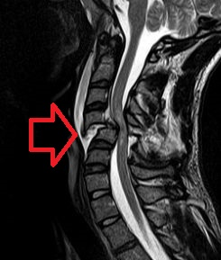

# TRAUMA RAQUIMEDULAR AGUDO (INICIAL)

O Trauma Raquimedular (TRM) é uma das emergências mais dramáticas que você enfrentará no plantão de trauma. Aqui, o tempo e a técnica não servem apenas para salvar a vida, mas para preservar a dignidade e a funcionalidade do paciente. Como professor, vejo muitos alunos decorarem os dermátomos, mas falharem no básico: reconhecer que um paciente com hipotensão e bradicardia pode não estar apenas "chocado", mas sim com uma falha de comunicação entre o cérebro e o resto do corpo.

## Fisiopatologia: O que acontece com a medula?

Para entender o TRM, você precisa dividir a lesão em dois momentos. A **lesão primária** é o evento mecânico imediato, como a fratura, a luxação ou a penetração de um projétil. É o dano estrutural que ocorre no milissegundo do impacto. Contra essa, pouco podemos fazer no hospital.

O nosso foco é a **lesão secundária**. Horas após o trauma inicial, inicia-se uma cascata de eventos: edema, isquemia, liberação de radicais livres e inflamação. É aqui que o manejo adequado no pronto-socorro faz a diferença. Se você não imobiliza corretamente ou permite que o paciente fique hipotenso, você está contribuindo para a lesão secundária.

### Anatomia Funcional para Provas

Você não precisa ser um neurocirurgião, mas precisa conhecer os três grandes tratos. As bancas amam cobrar isso para testar se você sabe localizar a lesão:

- **Trato Corticoespinal (Motor):** Localizado na região posterolateral da medula. Controla o movimento ipsilateral. Se houver lesão aqui, o paciente perde força do mesmo lado da lesão.

- **Trato Espinotalâmico (Dor e Temperatura):** Localizado na região anterolateral. Cruza logo após entrar na medula. Portanto, uma lesão na medula à direita causa perda de sensibilidade térmica e dolorosa no lado **esquerdo** do corpo.

- **Colunas Posteriores (Propriocepção e Vibração):** Levam a sensibilidade fina e a posição do corpo. Também são ipsilaterais.

*Figura 1 - Estetoscópio, símbolo da prática médica e da avaliação neurológica no trauma raquimedular. Fonte: Domínio Público | Wikimedia Commons*

## Avaliação Inicial e Manejo de Via Aérea

De acordo com o ATLS (10ª e 11ª edições), todo paciente com trauma multissistêmico, especialmente acima da clavícula ou com alteração de consciência, deve ser considerado portador de lesão de coluna cervical até que se prove o contrário.

A imobilização deve ser feita com colar cervical rígido, coxins laterais e fita adesiva em prancha rígida. Mas cuidado: a prancha rígida é uma ferramenta de transporte, não de permanência. O uso prolongado causa lesões por pressão em poucas horas. Assim que o paciente estiver estabilizado e a avaliação do dorso for feita (rolamento em bloco), a prancha deve ser removida.

### O Dilema da Via Aérea

Se o paciente com suspeita de TRM cervical precisa de uma via aérea definitiva (rebaixamento de consciência ou insuficiência respiratória), como proceder?

Muitos alunos erram ao achar que a suspeita de lesão cervical contraindica a intubação orotraqueal. Errado. A prioridade é o "A" (Airway). A técnica de escolha é a **Intubação Orotraqueal com estabilização manual em linha**. Um assistente segura o pescoço por baixo, mantendo o alinhamento neutro, enquanto você intuba.

**Dica de Prova:** Nunca use a manobra de inclinação da cabeça (head tilt) se houver suspeita de lesão cervical. Use apenas a tração da mandíbula (jaw thrust). Se não houver suspeita de lesão medular, aí sim a inclinação da cabeça é permitida para abrir a via aérea.

## Choque Neurogênico vs. Choque Medular

Este é o tópico que mais gera confusão. Vamos separar o joio do trigo.

### Choque Neurogênico

É um fenômeno **hemodinâmico**. Ocorre geralmente em lesões acima de T6. O que acontece é a perda do tônus simpático (que sai da medula torácica). Sem o simpático, os vasos relaxam (vasodilatação periférica) e o parassimpático (nervo vago) age sozinho no coração, causando bradicardia.

- **Clínica:** Hipotensão + Bradicardia + Extremidades quentes e rosadas (pela vasodilatação).

- **Tratamento:** Reposição volêmica cautelosa (para não causar edema pulmonar) seguida de vasopressores. A **Noradrenalina** é frequentemente utilizada, mas em casos de bradicardia severa, a Dopamina ou Dobutamina podem ser discutidas pela ação beta.

### Choque Medular

É um fenômeno **elétrico/neurológico**. Não tem a ver com pressão arterial inicialmente. É o "atordoamento" da medula após o trauma.

- **Clínica:** Paralisia flácida, arreflexia (perda de reflexos) e perda de sensibilidade abaixo do nível da lesão.

- **O marcador de fim do choque medular:** O retorno do **reflexo bulbocavernoso**. Enquanto esse reflexo estiver ausente, você não pode dar um prognóstico definitivo, pois a medula está "desligada".

| Característica | Choque Neurogênico | Choque Medular |
| --- | --- | --- |
| **Natureza** | Hemodinâmica (Circulatória) | Elétrica (Neurológica) |
| **Sinal Vital** | Hipotensão e Bradicardia | Variável |
| **Reflexos** | Podem estar presentes | Ausentes (Arreflexia) |
| **Duração** | Dias a semanas | Horas a dias |
| **Mecanismo** | Perda do tônus simpático | Depolarização maciça pós-trauma |

## Exame Neurológico e Níveis de Lesão

No MedEvo, sempre enfatizamos que o exame neurológico no trauma deve ser objetivo. Você precisa definir o **Nível Neurológico**: o segmento mais caudal da medula que apresenta função motora e sensitiva normal (grau 3 ou mais na escala motora).

### Dermátomos Chave para Memorizar

- **C5:** Deltoide (ombro).

- **C6:** Extensão do punho (polegar/indicador).

- **C7:** Extensão do cotovelo (tríceps).

- **T4:** Nível dos mamilos.

- **T8:** Nível do xifoide.

- **T10:** Cicatriz umbilical.

- **L2:** Flexão do quadril.

- **S4-S5:** Região perianal (sempre testar a contração anal voluntária!).

**Exemplo Clínico:** Paciente chega após mergulho em águas rasas. Apresenta flexão de cotovelo (C5) preservada, mas não consegue estender o punho (C6) nem o cotovelo (C7). A sensibilidade está presente até os ombros, mas ausente abaixo. Diagnóstico: Lesão C5-C6. Se ele estiver hipotenso e bradicárdico, você já sabe: choque neurogênico associado.

### Escala de Força (Grau 0 a 5)

- 0: Paralisia total.

- 1: Contração visível ou palpável, sem movimento.

- 2: Movimento ativo, mas **não vence a gravidade**.

- 3: Vence a gravidade, mas não vence resistência.

- 4: Vence alguma resistência.

- 5: Força normal.

*Figura 2 - Profissional de saúde em atendimento, representando o manejo do trauma raquimedular. Fonte: National Cancer Institute, Domínio Público | Wikimedia Commons*

## Síndromes Medulares Incompletas

As bancas adoram as lesões parciais porque exigem raciocínio anatômico.

- **Síndrome de Brown-Séquard (Hemissecção):** Comum em traumas penetrantes (faca). O paciente perde a função motora e propriocepção do lado da lesão (ipsilateral) e perde a sensibilidade de dor e temperatura do lado oposto (contralateral).

- **Síndrome Medular Central:** Ocorre tipicamente em idosos com canal estreito que sofrem lesão por hiperextensão. A perda motora é maior nos **membros superiores** do que nos inferiores ("o paciente caminha até você, mas não consegue apertar sua mão").

- **Síndrome Medular Anterior:** Geralmente por infarto da artéria espinal anterior ou compressão por fragmento ósseo. Perde-se a função motora e a sensibilidade termoalgésica, mas a propriocepção (colunas posteriores) é preservada.

## Diagnóstico por Imagem: Quem precisa de TC?

Antigamente, fazíamos radiografia de coluna cervical para todos. Hoje, o padrão-ouro é a **Tomografia Computadorizada (TC)**. Mas será que todo mundo precisa de imagem?

Para responder isso, usamos dois critérios validados: **NEXUS** e **Canadian C-Spine Rule**.

### Critérios NEXUS (Se houver QUALQUER um destes, precisa de imagem):

- Ausência de alerta (Glasgow < 15).

- Evidência de intoxicação (álcool/drogas).

- Déficit neurológico focal.

- Dor na linha média da coluna.

- Lesão dolorosa "distrativa" (ex: uma fratura de fêmur tão dolorosa que o paciente nem sente o pescoço).

Se o paciente estiver alerta, sem dor, sem déficit, sem intoxicação e sem outras lesões graves, você pode retirar o colar cervical clinicamente, sem exames. Dr. Will sempre lembra: "Não trate o exame, trate o paciente".

## Trauma Cervical Penetrante

Aqui entramos em uma área de transição entre a cirurgia geral e a neurocirurgia. O pescoço é dividido em três zonas anatômicas, e isso define a conduta:

- **Zona I (Base do pescoço):** Entre as clavículas e a cartilagem cricoide. Difícil acesso cirúrgico, risco de lesões de grandes vasos torácicos e pulmão.

- **Zona II (Meio):** Entre a cricoide e o ângulo da mandíbula. É a zona mais comum. Contém carótidas, jugulares, esôfago e traqueia. É a mais fácil de explorar cirurgicamente.

- **Zona III (Alta):** Acima do ângulo da mandíbula até a base do crânio. Difícil acesso, muitas vezes requer arteriografia para diagnóstico de lesões vasculares.

**Conduta no Trauma Penetrante:**
Se o paciente apresentar **Sinais "Hard"** (Instabilidade hemodinâmica, hematoma em expansão, sangramento ativo maciço, estridor, enfisema subcutâneo extenso, disfonia grave), a conduta é **Cervicotomia Exploradora Imediata**, independente da zona.

Se o paciente estiver estável, a tendência moderna é o manejo seletivo guiado por Angio-TC, especialmente nas zonas I e III.

## Tratamento Farmacológico e Metas

### O Uso de Corticoides (Metilprednisolona)

Este é o ponto mais polêmico. Os estudos NASCIS sugeriram benefício no passado, mas as diretrizes atuais (incluindo a recomendação da maioria das sociedades de neurocirurgia e o próprio ATLS) **não recomendam o uso rotineiro**. O risco de complicações (pneumonia, sepse, hiperglicemia, hemorragia digestiva) geralmente supera o ganho neurológico marginal. Se a banca perguntar, a tendência atual é considerar como uma opção terapêutica com evidência fraca, não como padrão de cuidado.

### Metas Hemodinâmicas

Para evitar a lesão secundária, a medula precisa de perfusão. A recomendação atual é manter uma **Pressão Arterial Média (PAM) entre 85-90 mmHg** por 5 a 7 dias após o trauma. Isso muitas vezes exige o uso de vasopressores mesmo após a volemia estar normalizada.

### Tabela de Manejo de Choque no Trauma

| Tipo de Choque | Frequência Cardíaca | Pressão Arterial | Pele | Tratamento Inicial |
| --- | --- | --- | --- | --- |
| **Hipovolêmico** | Taquicardia | Baixa | Fria/Pálida | Cristaloides + Sangue |
| **Neurogênico** | Bradicardia | Baixa | Quente/Rosada | Fluidos (cautela) + Vasopressor |

## Situações Especiais

### Trauma Pediátrico

Crianças têm uma anatomia diferente: a cabeça é proporcionalmente maior e os ligamentos são mais frouxos. Isso leva a uma entidade chamada **SCIWORA** (Spinal Cord Injury Without Radiographic Abnormality). É a lesão medular sem fratura óssea visível no raio-x ou TC. Se a criança tem clínica neurológica, mas os exames estão normais, ela precisa de uma Ressonância Magnética (RM).

### Idosos

Fraturas de C2 (processo odontoide) são comuns em quedas da própria altura em idosos. Sempre suspeite de lesão cervical em idosos com trauma facial ou frontal.

## Indicações Cirúrgicas

Nem todo TRM é cirúrgico. As indicações clássicas de cirurgia de urgência incluem:

- Déficit neurológico progressivo (o paciente está piorando na sua frente).

- Desalinhamento da coluna que não pode ser reduzido de forma fechada.

- Lesões penetrantes com instabilidade ou fragmentos no canal medular.

- Compressão medular extrínseca (hematoma, fragmento ósseo) em paciente com déficit incompleto.

## Pontos-Chave para Prova 🧠

- **Choque Neurogênico:** Hipotensão + Bradicardia + Pele Quente. Causa: Perda do tônus simpático (lesões acima de T6).

- **Choque Medular:** Não é circulatório. É a perda temporária de reflexos e tônus abaixo da lesão. O retorno do reflexo bulbocavernoso marca seu fim.

- **Nível T10:** Sensibilidade na cicatriz umbilical.

- **Nível T4:** Sensibilidade nos mamilos.

- **Déficit Focal:** No trauma, isso significa ALTA probabilidade de lesão raquimedular. Nunca ignore.

- **Zona II do Pescoço:** Entre cricoide e mandíbula. É a mais acessível para cervicotomia.

- **Sinais de Alarme Cervical:** Hematoma expansivo, estridor, disfonia e enfisema são indicações de cirurgia imediata no trauma penetrante.

- **Manobra de Via Aérea:** No trauma cervical, use **Jaw Thrust**, nunca Head Tilt.

- **Imobilização:** Retirar a prancha rígida o mais rápido possível (após exame do dorso) para evitar lesões por pressão. O colar permanece até exclusão da lesão.

- **Critérios NEXUS:** Servem para dispensar exames de imagem em pacientes de baixo risco (alerta, sem dor, sem déficit, sem intoxicação, sem lesão distrativa).

- **Síndrome Medular Central:** Fraqueza maior em membros superiores do que inferiores, comum em idosos após hiperextensão.

- **Brown-Séquard:** Perda motora ipsilateral e perda termoalgésica contralateral.

- **PAM Alvo:** Manter entre 85-90 mmHg para garantir perfusão medular.

- **Metilprednisolona:** Não é mais recomendada de forma rotineira devido aos efeitos colaterais.

- **Priapismo:** Pode estar presente no choque neurogênico por perda do controle autonômico.

- **Retenção Urinária:** É comum no TRM agudo; o paciente precisa de cateterismo vesical de demora para monitorar débito urinário e evitar distensão da bexiga.

- **Bradicardia no Trauma:** Se o paciente está hipotenso e bradicárdico, pense em choque neurogênico ou fase terminal de choque hipovolêmico (pré-morte). No contexto de TRM, o neurogênico é a resposta correta.

 Cópia offline para consulta pessoal.
 Fonte original:
 [https://www.medevo.com.br/material-apoio/ler/3d58b6ab-2b5d-4ad7-a80f-e49b6ca58277](https://www.medevo.com.br/material-apoio/ler/3d58b6ab-2b5d-4ad7-a80f-e49b6ca58277)
