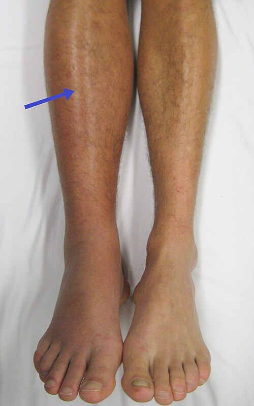
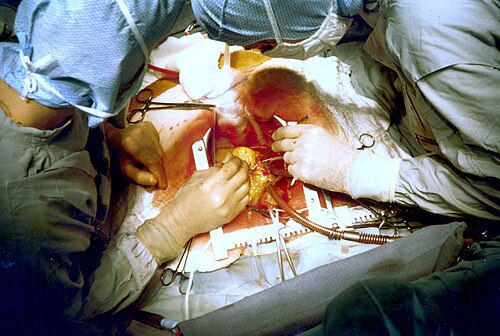

# TRAUMA VASCULAR

No trauma vascular, a primeira coisa que você precisa colocar na cabeça é: o tempo é o seu maior inimigo, mas a pressa desorganizada é o seu segundo maior. Quando um paciente chega com um ferimento por arma de fogo (PAF) na coxa e um sangramento em jato, o examinador quer saber se você tem a frieza de seguir o protocolo e a técnica correta.

O trauma vascular é responsável por uma parcela significativa da mortalidade evitável no trauma. Se você não estancar o sangue ou não reconhecer uma isquemia, o paciente morre ou perde o membro. Vamos dissecar esse tema para que você nunca mais confunda um sinal "duro" com um "mole" e saiba exatamente quando abrir o paciente ou pedir uma angiotomografia.

## Fisiopatologia e Mecanismos de Lesão

Para entender a conduta, você precisa entender o que aconteceu com o vaso. Existem basicamente dois tipos de trauma: o penetrante e o contuso.

No **trauma penetrante** (como PAF ou arma branca), a lesão é direta. O projétil ou a lâmina corta a parede do vaso. Aqui, um conceito que cai muito em prova é a **transecção arterial total**. Quando o vaso é completamente cortado, as extremidades tendem a sofrer retração da camada íntima e espasmo. Isso pode levar a uma trombose arterial "protetora" momentânea, o que explica por que alguns pacientes com transecção total não chegam chocados imediatamente, mas sim com um membro isquêmico.

Já no **trauma contuso** (acidentes automobilísticos, quedas), o mecanismo é de desaceleração ou esmagamento. A íntima, que é a camada mais frágil, pode sofrer um "flap" (descolamento). Esse flap funciona como uma válvula: o sangue passa, mas vai descolando a parede até obstruir o fluxo ou formar um pseudoaneurisma.

### O "Porquê" das Lesões Iatrogênicas

Não podemos esquecer do trauma iatrogênico. A punção arterial femoral para procedimentos endovasculares é a causa mais comum de **pseudoaneurismas** hoje em dia. Por que isso acontece? Porque a agulha fura a artéria e, se a compressão pós-procedimento for inadequada, o sangue extravasa para o tecido adjacente, mas fica contido pela fáscia, mantendo uma comunicação com a luz do vaso.

## Avaliação Inicial e Controle de Hemorragia

Esqueça a pinça hemostática no pronto-socorro. Se você tentar "pinçar" um vaso no escuro, no meio de um banho de sangue, você vai pinçar o nervo que está ao lado.

A conduta inicial para qualquer hemorragia externa em via pública ou na sala de emergência é a **compressão digital direta** no local do sangramento. É o dedo ou a compressa forte sobre o buraco. Se isso falhar em membros, o **torniquete** é seu aliado. Antigamente havia medo do torniquete; hoje, no trauma moderno, ele é indicado para controle temporário em lesões de extremidades até que o paciente chegue ao centro cirúrgico.

### O Erro Clássico no Realinhamento

Imagine um paciente com fratura de fêmur e ausência de pulsos distais. O que fazer primeiro? Muitos alunos marcam "arteriografia". Errado. A primeira conduta é o **realinhamento e imobilização do membro**. Muitas vezes, a artéria está apenas dobrada ou comprimida pelo osso fraturado. Se o pulso voltar após o realinhamento, era apenas compressão. Se não voltar, a suspeita de lesão arterial grave sobe no seu ranking de diagnósticos.

*Figura 1 - Trombose venosa profunda (TVP) do membro inferior direito, complicação possível do trauma vascular. Note o edema e a vermelhidão. Fonte: James Heilman, MD, CC BY-SA 3.0 | Wikimedia Commons*

## Sinais de Lesão Vascular: O Coração da Prova

As bancas amam a divisão entre Sinais Duros (Hard Signs) e Sinais Moles (Soft Signs). Isso define quem vai direto para a cirurgia e quem vai para a sala de exames.

### Sinais Duros (Indicação de Cirurgia Imediata)

Se o paciente apresenta qualquer um destes, você não perde tempo com tomografia. Você chama o vascular e prepara a sala.

- **Sangramento pulsátil ou em jato:** O vaso está aberto e comunicando com o exterior.

- **Hematoma pulsátil ou expansivo:** O sangue está entrando no tecido e aumentando a pressão local.

- **Isquemia distal (os 6 Ps):** Palidez, dor (pain), ausência de pulso (pulselessness), parestesia, paralisia e poiquilotermia (frio).

- **Sopro ou frêmito (thrill):** Indica uma comunicação anormal (fístula arteriovenosa traumática) ou uma turbulência severa.

### Sinais Moles (Indicação de Investigação)

Aqui o vaso "pode" estar lesionado. Você precisa de mais dados.

- História de sangramento moderado no local.

- Diminuição de pulso (ele está lá, mas está fraco).

- Lesão próxima a trajeto vascular.

- Déficit neurológico periférico isolado.

| Sinal | Significado Clínico | Conduta |
| --- | --- | --- |
| **Duro** | Lesão vascular confirmada | Exploração cirúrgica imediata |
| **Mole** | Suspeita de lesão vascular | Investigação (ITB, Angio-TC ou Doppler) |

## Diagnóstico por Imagem e Índices

Se o paciente está estável e tem sinais moles, o que fazemos? No MedEvo, sempre batemos na tecla do **Índice Tornozelo-Braço (ITB)**.

Você mede a pressão sistólica no tornozelo e divide pela maior pressão sistólica braquial.

- **ITB > 0,9:** Baixa probabilidade de lesão vascular. Observação.

- **ITB < 0,9:** Alta probabilidade. Precisa de imagem (Angio-TC é o padrão-ouro atual pela rapidez e disponibilidade).

A **Arteriografia** convencional ainda é o padrão-ouro "teórico" e excelente para planejar intervenções endovasculares, mas na prática do trauma, a Angio-TC ganhou o jogo pela velocidade.

## Trauma Vascular por Regiões Específicas

### 1. Trauma Cervical

Aqui a anatomia é densa. Lembre-se que o nervo vago (X) acompanha a artéria carótida e a veia jugular interna dentro da bainha carotídea.

As zonas cervicais mudaram um pouco na abordagem prática, mas para a prova:

- **Zona I (Base do pescoço):** Difícil acesso cirúrgico. Se estável, Angio-TC ou Arteriografia. Se instável, cirurgia (pode precisar de esternotomia).

- **Zona II (Mandíbula à cartilagem cricoide):** A mais comum. Antigamente era exploração obrigatória. Hoje, se o paciente estiver estável, a tendência é **manejo seletivo** guiado por imagem.

- **Zona III (Ângulo da mandíbula à base do crânio):** Acesso cirúrgico terrível. O tratamento endovascular (stents) é muitas vezes a melhor opção aqui.

**Hematoma cervical expansivo** é uma emergência absoluta. Ele não só indica lesão vascular, mas vai comprimir a traqueia e matar o paciente por asfixia antes de ele sangrar até morrer. A prioridade é garantir a via aérea (muitas vezes intubação difícil ou cricotiroidostomia).

### 2. Trauma Torácico (Aorta)

A lesão de aorta descendente é clássica em acidentes de alta desaceleração. O local mais comum é o **istmo aórtico** (logo após a emergência da artéria subclávia esquerda), porque é o ponto de fixação da aorta pelo ligamento arterioso.

- **Diagnóstico:** Alargamento de mediastino no Raio-X (sinal indireto), confirmado por Angio-TC.

- **Tratamento:** Atualmente, o **TEVAR** (Reparo Endovascular de Aorta Torácica) é a primeira escolha se a anatomia permitir, por ser muito menos mórbido que uma toracotomia.

### 3. Trauma Abdominal e Retroperitoneal

Aqui as bancas cobram as **Zonas de Altemeier (Retroperitônio)**. Isso cai todo ano.

- **Zona 1 (Central - Aorta e Cava):** No trauma contuso ou penetrante, **SEMPRE explorar**. Se tem um hematoma ali, algo muito grande rompeu.

- **Zona 2 (Flancos - Rins e vasos renais):** No trauma contuso, se o hematoma estiver estável e não expandir, você pode não explorar. No penetrante, geralmente explora.

- **Zona 3 (Pélvica):** No trauma contuso (fratura de bacia), **NÃO explorar**. Se você abrir, você tira o efeito de tamponamento do retroperitônio e o paciente morre de hemorragia incontrolável. Aqui o tratamento é Angioembolização ou Fixação Externa da bacia.

Para expor esses vasos, usamos manobras de rotação visceral:

- **Manobra de Mattox:** Rotação visceral medial esquerda. Você joga tudo para a direita para ver a aorta abdominal em toda sua extensão.

- **Manobra de Cattell-Braasch:** Rotação visceral medial direita para expor a veia cava inferior.

### 4. Trauma de Membros

O grande dilema: o osso está quebrado e a artéria está rota. O que fixar primeiro?
Se o membro está com isquemia crítica, o tempo de "warm ischemia" (isquemia quente) conta. A sequência ideal é:

- **Shunt vascular temporário** (para dar sangue ao membro imediatamente).

- **Fixação ortopédica** (para estabilizar o esqueleto e não quebrar o seu reparo vascular depois).

- **Reparo vascular definitivo** (enxerto ou anastomose).

- **Fasciotomia** (quase sempre necessária se a isquemia durou mais de 4-6 horas).

*Figura 2 - Cirurgia de revascularização: exemplo de reparo vascular com instrumentação especializada. Fonte: National Cancer Institute, Domínio Público | Wikimedia Commons*

## Técnicas de Reparo Vascular

Como professor, vejo muitos alunos esquecerem os detalhes técnicos que as bancas adoram.

### Escolha do Enxerto

Se você não consegue costurar ponta com ponta (anastomose primária) sem tensão, você precisa de um enxerto.

- **Primeira escolha:** Veia autóloga. A **veia safena magna** invertida do membro contralateral é o padrão-ouro. Por que contralateral? Para não prejudicar o retorno venoso do membro já traumatizado.

- **Por que veia e não prótese (PTFE)?** Em feridas contaminadas (comuns no trauma), a prótese infecta e o paciente perde o membro. A veia resiste muito melhor à infecção.

### Suturas e Fios

- **Adultos:** Usamos fios inabsorvíveis monofilamentares (Prolene/Polipropileno) com agulhas atraumáticas.

- **Crianças:** Aqui está uma pegadinha. Em vasos pediátricos, podemos usar o **PDS (Polidioxanona)**. Por que? Porque ele é absorvível a longo prazo, permitindo que a anastomose "cresça" conforme a criança cresce, evitando estenoses futuras.

### Controle de Danos (Damage Control)

Se o paciente está na "tríade da morte" (acidose, hipotermia e coagulopatia), você não vai fazer uma revascularização definitiva de 4 horas. Você coloca um **Shunt Intravascular Temporário** (um tubinho de polietileno) para manter o fluxo e manda o paciente para a UTI para estabilizar. Você volta 24-48 horas depois para o reparo definitivo.

## Complicações: A Temida Síndrome Compartimental

A síndrome compartimental ocorre quando a pressão dentro dos compartimentos musculares aumenta a ponto de comprometer a perfusão capilar. No trauma vascular, ela ocorre por dois motivos:

- O trauma direto (edema e sangramento).

- **Lesão de Reperfusão:** Quando você abre o fluxo para um membro que ficou horas sem sangue, as células liberam radicais livres e o músculo incha violentamente.

**Clínica:** A dor desproporcional ao achado físico e a dor ao estiramento passivo do músculo são os sinais mais precoces. O pulso ausente é um sinal **muito tardio**. Se o pulso sumiu por síndrome compartimental, o membro provavelmente já está perdido.
**Tratamento:** Fasciotomia ampla de todos os compartimentos envolvidos.

## Tabelas Comparativas para Fixação

### Tabela 1: Sinais Duros vs. Sinais Moles

| Sinais Duros (Cirurgia Já!) | Sinais Moles (Investigar) |
| --- | --- |
| Sangramento pulsátil ativo | História de hemorragia no local |
| Hematoma expansivo ou pulsátil | Pulso palpável, porém diminuído |
| Frêmito ou sopro | Lesão próxima a trajeto vascular |
| Isquemia distal (6 Ps) | Déficit neurológico periférico |
| Ausência de pulsos distais | ITB entre 0,7 e 0,9 |

### Tabela 2: Manejo de Hematomas Retroperitoneais

| Localização | Estruturas | Conduta (Trauma Contuso) | Conduta (Trauma Penetrante) |
| --- | --- | --- | --- |
| **Zona 1 (Central)** | Aorta, Cava, Tronco Celíaco | **Explorar Sempre** | **Explorar Sempre** |
| **Zona 2 (Flancos)** | Rins e Vasos Renais | Observar se estável | Explorar na maioria |
| **Zona 3 (Pélvica)** | Vasos Ilíacos | **NÃO explorar** (Angio/Fixação) | Explorar se sangramento ativo |

### Tabela 3: Escolha de Conduta no Trauma de Extremidade

| Cenário Clínico | Conduta Imediata |
| --- | --- |
| Sangramento em jato na coxa | Compressão manual direta |
| Fratura de joelho + Ausência de pulso | Realinhamento e imobilização |
| Ferimento por PAF + Isquemia + Instabilidade | Shunt temporário (Controle de Danos) |
| Ferimento sujo + Necessidade de enxerto | Veia Safena Magna Contralateral |
| Isquemia de membro > 6 horas | Revascularização + Fasciotomia |

## Situações Especiais e "Pérolas" de Prova

- **Fístula Arteriovenosa (FAV) Traumática:** Suspeite quando, após um trauma penetrante antigo, o paciente apresenta edema, varizes localizadas e, ao exame, você sente um **frêmito** e ouve um **sopro contínuo** em maquinaria.

- **Hemorragia Pélvica Grave:** Se o paciente tem uma fratura de bacia em "livro aberto" e está chocado, a primeira medida é o **fechamento da bacia** (com lençol ou cinta pélvica) ao nível dos trocanteres maiores. Se não resolver, o próximo passo é a Arteriografia com Embolização ou o REBOA (balão oclusivo de aorta).

- **Lesão de Veia Cava Retro-hepática:** É uma das lesões mais letais. O controle pode ser tentado com o **Shunt de Schrock** (um shunt átrio-caval) para desviar o sangue enquanto se tenta o reparo.

- **Hemorragia Obstétrica/Vulvoperineal:** Em sangramentos arteriais vulvares incontroláveis, a ligadura da **artéria hipogástrica (ilíaca interna)** ipsilateral pode ser a salvação.

- **Síndrome da Veia Cava Superior (SVCS):** Embora muitas vezes neoplásica, em provas de trauma/vascular, lembre-se que a etiologia benigna mais comum citada é a mediastinite fibrosante ou iatrogenia por cateteres centrais de longa permanência.

## Pontos-Chave para Prova 💡

- **Conduta inicial em hemorragia externa:** Compressão digital direta. Esqueça pinças e clampeamento às cegas.

- **Hard Signs (Sinais Duros):** Sangramento pulsátil, hematoma expansivo, isquemia distal, sopro/frêmito. Se houver um desses -> Bloco Cirúrgico.

- **Soft Signs (Sinais Moles):** Se presentes e paciente estável -> ITB. Se ITB < 0,9 -> Angio-TC.

- **Zona 1 Retroperitoneal:** Sempre explorar, independente do mecanismo de trauma.

- **Zona 3 Retroperitoneal (Contuso):** Nunca explorar inicialmente; risco de exanguinação.

- **Realinhamento de fraturas:** Deve preceder a decisão cirúrgica vascular se o único sinal for ausência de pulso em membro deformado.

- **Enxerto de escolha:** Veia safena interna invertida, preferencialmente do membro contralateral.

- **Próteses (PTFE/Dacron):** Evitar ao máximo em campos contaminados (feridas sujas).

- **Fasciotomia:** Indicada se tempo de isquemia > 4-6h, lesão arterial e venosa combinada, ou sinais clínicos de síndrome compartimental.

- **Manobra de Mattox:** Rotação visceral medial esquerda para ver a aorta.

- **Manobra de Cattell-Braasch:** Rotação visceral medial direita para ver a cava.

- **PDS (Polidioxanona):** Fio de escolha para anastomoses vasculares em crianças (permite crescimento do vaso).

- **Pseudoaneurisma iatrogênico:** Complicação mais comum de punções femorais para cateterismo.

- **Tríade da Morte:** Acidose, Hipotermia e Coagulopatia. Se presente, use Shunt Temporário (Damage Control).

- **Torniquete:** Seguro e indicado no trauma de extremidade para controle temporário de hemorragia exanguinante.

- **Nervo Vago:** Cuidado ao abordar carótida; ele está logo atrás, no ângulo entre a artéria e a veia jugular interna.

Lembre-se: no trauma vascular, a prova quer saber se você é um médico seguro. Ser seguro é seguir o ABCDE, reconhecer os sinais de alerta e saber que, às vezes, o melhor reparo é um shunt rápido para salvar a vida do paciente, deixando a estética da sutura para um segundo momento. Como dizemos no MedEvo, "o ótimo é inimigo do bom" no controle de danos.

 Cópia offline para consulta pessoal.
 Fonte original:
 [https://www.medevo.com.br/material-apoio/ler/1955430b-06e9-4501-8fee-12f52df09304](https://www.medevo.com.br/material-apoio/ler/1955430b-06e9-4501-8fee-12f52df09304)
