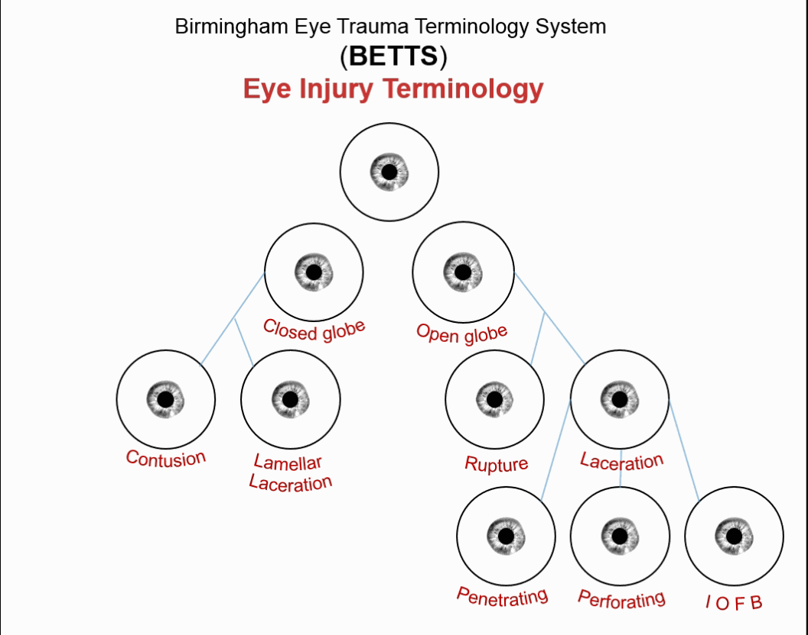
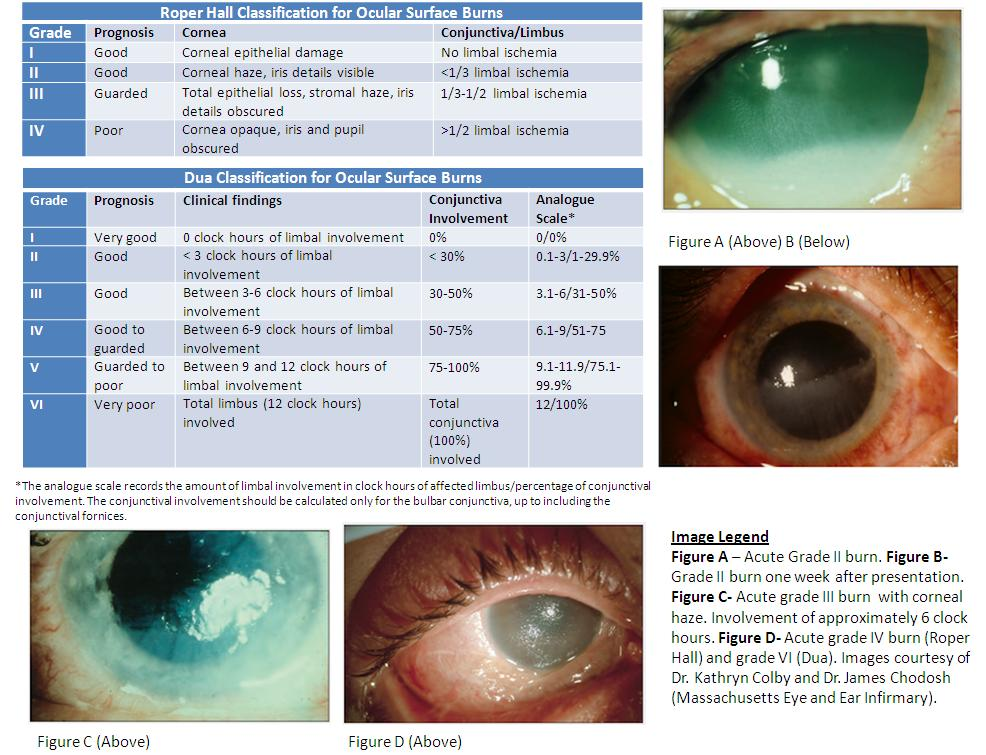
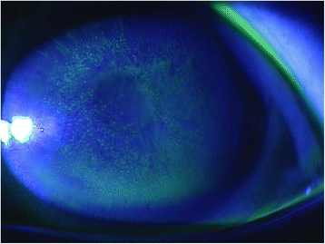
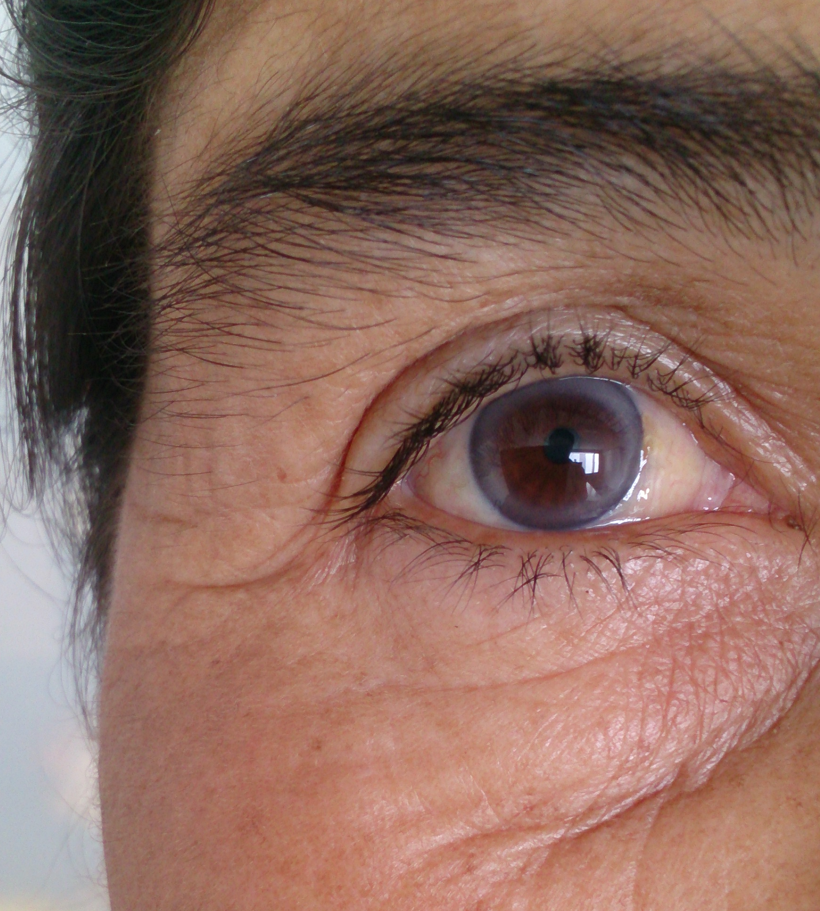
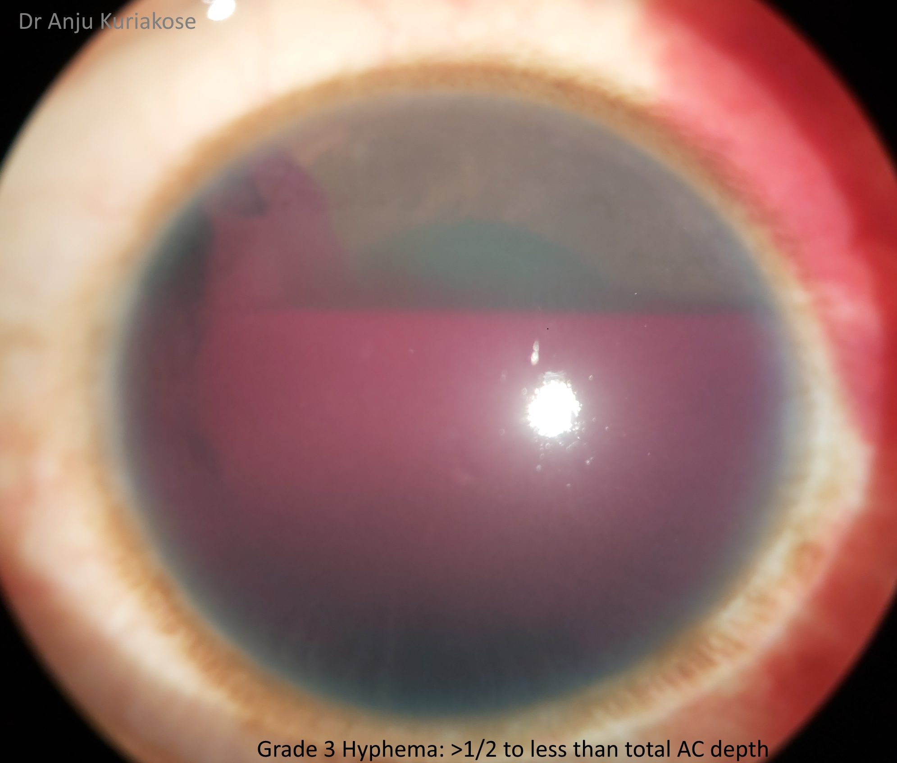
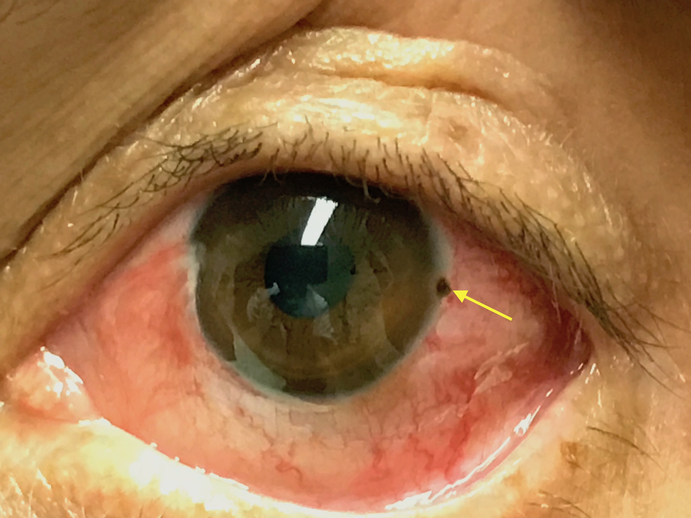

# TRAUMAS OCULARES

Para começar nossa conversa sobre trauma ocular, preciso que você tire da cabeça a ideia de que a Oftalmologia é uma "caixa preta" impenetrável. Na prova de residência e no plantão de pronto atendimento, o que se espera de um médico generalista não é que ele opere uma catarata, mas que ele saiba identificar o que é uma emergência real, o que pode esperar e, principalmente, o que **não fazer** para não piorar o prognóstico do paciente.

O trauma ocular é uma das principais causas de cegueira monocular evitável no mundo. Quando falamos de provas, as bancas adoram focar em dois pilares: queimaduras químicas e condutas imediatas em traumas perfurantes. Vamos dissecar cada um desses pontos.

## Classificação dos Traumas Oculares

Antes de mergulharmos nas patologias, você precisa entender a linguagem universal do trauma ocular, a classificação de Birmingham (BETTS). Por que isso é importante? Porque se você descreve um trauma de forma errada, a conduta muda completamente.

*Figura 6: Classificação BETT. Globo Fechado (contusão, laceração lamelar) vs Globo Aberto (ruptura por objeto rombo, laceração por objeto cortante → penetrante, perfurante ou CEIO).*

O trauma é dividido inicialmente em dois grandes grupos:

- **Trauma de Globo Fechado:** A parede ocular (esclera e córnea) está íntegra. Aqui incluímos as contusões e as lacerações lamelares (ferimentos parciais).

- **Trauma de Globo Aberto:** Houve ruptura da parede ocular em toda sua espessura. Este é o cenário de pesadelo que exige abordagem cirúrgica urgente.

Dentro do globo aberto, temos a **Ruptura** (causada por objeto rombo, de dentro para fora por pressão) e a **Laceração** (objeto cortante, de fora para dentro). A laceração ainda se divide em:

- **Penetrante:** Tem orifício de entrada, mas não de saída.

- **Perfurante:** Tem orifício de entrada e de saída (atravessou o olho).

- **Corpo Estranho Intraocular (CEIO):** O objeto entrou e ficou lá dentro.

**Dica de Prova:** As bancas costumam confundir os termos "penetrante" e "perfurante". Lembre-se: a bala que atravessa o braço é perfurante. A faca que entra e fica é penetrante. No olho, a lógica é a mesma.

## Queimaduras Químicas: A Emergência das Emergências

Se você tiver que aprender apenas uma coisa hoje, que seja esta: **em queimaduras químicas, a lavagem ocular precede qualquer exame, inclusive a medida da acuidade visual.**

Na maioria dos traumas, a primeira coisa que fazemos é medir a visão (o "sinal vital" do olho). Mas na queimadura química, cada segundo conta. O produto químico continua reagindo com o tecido enquanto você procura a tabela de Snellen.

*Figura 1: Queimaduras químicas por grau — quanto mais isquemia límbica (limbo "branco"), pior o prognóstico. As stem cells da córnea são destruídas, impedindo a regeneração.*

### Álcalis vs. Ácidos

Esta é a comparação favorita das provas. Você precisa entender a fisiopatologia para não esquecer a gravidade.

**1. Lesões por Álcalis (Cal, amônia, soda cáustica, produtos de limpeza):**
São as mais graves. Por quê? Porque os álcalis promovem a **saponificação dos lipídios** das membranas celulares. Isso destrói a barreira celular e permite que a substância penetre profundamente no olho, atingindo a câmara anterior, o cristalino e o corpo ciliar em minutos. É um dano progressivo e devastador.

**2. Lesões por Ácidos (Ácido sulfúrico de baterias, ácido clorídrico):**
Geralmente menos graves que os álcalis (exceto o ácido fluorídrico). Os ácidos promovem a **coagulação das proteínas** da superfície ocular. Essa coagulação cria uma barreira física (um "escudo" de tecido morto) que impede a penetração profunda do ácido. O dano tende a ser mais superficial e localizado.

### Manejo Imediato e Irrigação Ocular

O tratamento padrão-ouro, citado em 10 de cada 10 questões sobre o tema, é a **irrigação copiosa e imediata**.

- **Com o quê?** Preferencialmente com Solução Salina Fisiológica (SF 0,9%) ou Ringer Lactato. Na falta destes, qualquer água limpa serve. O objetivo é diluir e remover o agente.

- **Por quanto tempo?** No mínimo 30 minutos ou até que o pH do fundo de saco conjuntival se neutralize (entre 7.0 e 7.2).

- **Como?** Instila-se colírio anestésico (se disponível) para facilitar a abertura palpebral, que estará em blefaroespasmo por dor. Deve-se everter as pálpebras para procurar partículas sólidas (como restos de cal) que podem estar escondidas nos fórnices.

**Exemplo Clínico:** Paciente pedreiro, estava misturando cal quando o saco estourou e atingiu seus olhos. Chega ao pronto-atendimento com dor intensa e fotofobia. Qual a conduta?
Resposta: Lavagem imediata com SF 0,9% por pelo menos 30 minutos, eversão de pálpebras para limpeza de resíduos e, só após isso, encaminhamento urgente ao oftalmologista.

### Tabela 1: Comparativo de Queimaduras Químicas

| Característica | Álcalis (Ex: Cal, Amônia) | Ácidos (Ex: Bateria de Carro) |
| --- | --- | --- |
| **Mecanismo** | Saponificação de lipídios | Coagulação de proteínas |
| **Penetração** | Profunda e rápida | Superficial (barreira proteica) |
| **Gravidade** | Muito alta (Emergência absoluta) | Geralmente menor (mas ainda grave) |
| **Conduta Inicial** | Irrigação copiosa (30 min+) | Irrigação copiosa (30 min+) |
| **Prognóstico** | Reservado (risco de isquemia límbica) | Geralmente melhor |

## Traumas Físicos e Radiação: A Fotoceratite

Aqui entra o cenário clássico da "solda elétrica" ou da exposição excessiva ao sol em ambientes reflexivos (neve ou mar).

*Figura 3: Fotoceratite. Múltiplas erosões puntatas (pontos verdes fluorescentes) na superfície corneana, visíveis com fluoresceína sob luz azul. Típico de exposição a UV (solda elétrica, neve, mar).*

A **Fotoceratite** (ou oftalmia elétrica) é uma lesão do epitélio da córnea causada pela radiação ultravioleta (UV). O que confunde o aluno é o tempo de latência. O paciente não sente dor na hora da solda; ele acorda de madrugada, 6 a 12 horas após a exposição, com uma dor excruciante, sensação de areia nos olhos, lacrimejamento e fotofobia intensa.

**Por que dói tanto?** A córnea é um dos tecidos mais inervados do corpo. A radiação UV "queima" as células epiteliais, deixando as terminações nervosas expostas.

**Conduta na Fotoceratite:**

- **Irrigação com SF 0,9%:** Ajuda a aliviar a temperatura local e remover possíveis detritos irritantes.

- **Lubrificantes e Pomadas Antibióticas:** Para proteger a superfície e evitar infecção secundária enquanto o epitélio cicatriza (o que ocorre rápido, em 24-48h).

- **Cicloplégicos (Atropina ou Ciclopentolato):** Para reduzir o espasmo do corpo ciliar, que é o que causa a dor profunda.

- **Oclusão ocular:** Pode ser feita para dar conforto, embora seja cada vez menos unânime.

**ERRO CLÁSSICO:** Nunca, em hipótese alguma, prescreva colírio anestésico para o paciente levar para casa. O anestésico é tóxico para o epitélio corneano e impede a cicatrização, podendo levar a úlceras graves. O anestésico é apenas para uso em consultório, para permitir o exame.

## Achados Fisiológicos que Parecem Patológicos: O Arco Senil

Como o Dr. Will sempre reforça nas aulas da MedEvo, as bancas adoram colocar "distratores" fisiológicos em questões de trauma ou doenças sistêmicas. O maior deles na oftalmologia geriátrica é o **Arco Senil** (ou Gerontoxon).

*Figura 4: Arco senil. Note o anel esbranquiçado periférico na córnea. Em idosos (>60 anos) é achado fisiológico normal. Em jovens (<40 anos): investigar dislipidemias.*

O arco senil é um depósito de lipídios (colesterol, triglicerídeos) na periferia da córnea. Ele aparece como um anel esbranquiçado ou acinzentado ao redor da íris.

- **Em idosos (> 60 anos):** É um achado fisiológico do envelhecimento. Não afeta a visão (pois é periférico) e **não requer investigação adicional** nem tratamento.

- **Em jovens (< 40 anos):** Aqui ele muda de nome para *Arcus Juvenilis* e pode estar associado a dislipidemias familiares. Nesse caso, investigamos o perfil lipídico.

**Pegadinha de Prova:** A questão descreve um idoso que sofreu um trauma leve e, ao exame, o médico nota um "anel esbranquiçado bilateral na periferia da córnea". A alternativa correta dirá que é um achado normal da idade e não tem relação com o trauma.

## Trauma Contuso e suas Complicações

Quando um objeto rombo (bola de tênis, soco, rolha de champanhe) atinge o olho, a energia é transferida para as estruturas internas. O globo se deforma, encurtando no eixo anteroposterior e expandindo no equador.

### Hifema

*Figura 2: Hifema traumático. Note o nível horizontal de sangue na câmara anterior. Conduta: repouso com cabeceira a 30-45° para o sangue sedimentar por gravidade.*
É a presença de sangue na câmara anterior (entre a córnea e a íris).

- **Por que acontece?** Ruptura de vasos da íris ou do corpo ciliar.

- **Risco:** O sangue pode obstruir a malha trabecular, levando a um aumento súbito da pressão intraocular (Glaucoma Secundário).

- **Conduta:** Repouso com cabeceira elevada a 30-45 graus (para o sangue "sedimentar" por gravidade e não obstruir o eixo visual), colírios corticoides e cicloplégicos. Evitar AAS e anti-inflamatórios que alterem a coagulação.

### Fratura de Órbita (Blow-out)

Ocorre quando a pressão súbita no globo "explode" a parede mais frágil da órbita, que é o assoalho (osso maxilar).

- **Sinal Clássico:** Diplopia (visão dupla) ao olhar para cima.

- **Por que?** O músculo reto inferior fica aprisionado na fenda da fratura.

- **Outro achado:** Enoftalmia (olho "fundo") e parestesia na bochecha (lesão do nervo infraorbitário).

### Tabela 2: Diagnóstico Diferencial no Trauma Contuso

| Achado Clínico | Suspeita Principal | Mecanismo |
| --- | --- | --- |
| Nível de sangue na câmara anterior | Hifema | Ruptura de vasos da íris |
| Diplopia vertical + Enoftalmia | Fratura de Assoalho (Blow-out) | Aprisionamento do reto inferior |
| Pupila irregular (em gota) | Ruptura de Globo | Herniação da íris pela ferida |
| Perda súbita de visão + "Cortina" | Descolamento de Retina | Tração vítreo-retiniana |

## Trauma Perfurante e o Teste de Seidel

Se você suspeita que o olho "furou", a primeira regra é: **não aperte o olho**. Não tente medir a pressão intraocular com tonômetro de contato e não faça fundoscopia sob pressão. Qualquer pressão externa pode causar a extrusão do conteúdo intraocular (vítreo, íris).

### O Teste de Seidel

Este é o teste que define se há uma fístula ativa (vazamento de humor aquoso).

- **Como fazer:** Instila-se fluoresceína na superfície ocular. Sob a luz azul de cobalto, observa-se se o corante está sendo "lavado" por um fluxo de líquido transparente vindo de dentro do olho.

- **Seidel Positivo:** Você verá o líquido límpido "diluindo" a fluoresceína amarela, parecendo uma "cachoeira" ou "rio". Isso confirma a perfuração do globo.

**Conduta no Trauma Perfurante:**

- **Protetor Ocular Rígido:** Um "escudo" que se apoia nos ossos da face, sem encostar no olho.

- **Jejum:** O paciente vai para o centro cirúrgico.

- **Antibioticoterapia Sistêmica:** Para prevenir endoftalmite (infecção interna do olho).

- **Vacinação Antitetânica:** Sempre checar em traumas penetrantes.

## Corpos Estranhos

### Corpo Estranho de Superfície (Córnea/Conjuntiva)

Muito comum em trabalhadores que usam esmeril sem óculos de proteção.

- **Quadro:** Dor, lacrimejamento e sensação de corpo estranho que piora ao piscar.

- **Anel de Ferrugem:** Se o corpo estranho for metálico, em poucas horas ele oxida e deixa um anel de ferrugem na córnea.

*Figura 5: Anel de ferrugem. O corpo estranho metálico oxidou na córnea, criando um halo marrom-alaranjado. Deve ser removido para não retardar a cicatrização.* Esse anel deve ser removido pelo oftalmologista, pois é tóxico e retarda a cicatrização.

### Corpo Estranho Intraocular (CEIO)

Aqui o objeto entrou no olho e não saiu. O grande perigo, além da infecção, é a toxicidade química.

- **Siderose:** Se o objeto tiver ferro, ele oxida dentro do olho, causando danos irreversíveis à retina.

- **Calcose:** Causada por cobre.

**Dica de Prova:** Se a história clínica fala de um trabalhador que estava batendo "martelo contra prego" (metal contra metal) e sentiu uma "picada" no olho, mas o olho parece calmo ao exame inicial, **peça um exame de imagem**. O fragmento de metal é pequeno, viaja em alta velocidade e pode entrar no olho sem causar um grande rasgo visível, ficando alojado lá dentro.

**Qual exame de imagem?**

- **TC de Órbita (Cortes finos):** É o padrão-ouro para localizar corpos estranhos metálicos.

- **RM de Órbita:** **CONTRAINDICADA** se houver suspeita de corpo estranho metálico. O campo magnético da ressonância vai deslocar o metal dentro do olho, funcionando como um projétil interno e destruindo o que restou da visão. Isso cai muito em prova!

## Tabela 3: Condutas Imediatas no Pronto Atendimento

| Cenário | Conduta de Escolha | O que NÃO fazer |
| --- | --- | --- |
| Queimadura Química | Lavagem copiosa imediata (SF 0,9%) | Medir acuidade visual antes da lavagem |
| Suspeita de Perfuração | Escudo rígido + Jejum + Encaminhamento | Pingar colírios ou apertar o globo |
| Fotoceratite (Solda) | Pomada antibiótica + Cicloplégico | Prescrever anestésico tópico para casa |
| Corpo Estranho Metálico | TC de Órbita | Ressonância Magnética (RM) |
| Hifema Traumático | Repouso + Cabeceira elevada | Prescrever AAS ou anti-inflamatórios |

## Farmacologia no Trauma Ocular

Vamos revisar as classes de medicamentos que você realmente usará ou verá o especialista usar.

### 1. Cicloplégicos (Atropina 1%, Ciclopentolato 1%, Tropicamida 1%)

Eles paralisam o músculo ciliar (acomodação) e dilatam a pupila (midríase).

- **Por que usar?** No trauma, o corpo ciliar entra em espasmo, o que causa muita dor. Além disso, a dilatação previne a formação de sinéquias (cicatrizes onde a íris "gruda" no cristalino).

### 2. Antibióticos Tópicos

Usados em abrasões de córnea e após remoção de corpos estranhos.

- **Escolha:** Quinolonas de 4ª geração (Moxifloxacino, Gatifloxacino) são preferidas pela excelente penetração e espectro, mas Tobramicina ou Gentamicina são opções comuns em provas.

### 3. Corticoides Tópicos (Prednisolona 1%, Dexametasona 0,1%)

Usados para controlar a inflamação (uveíte traumática).

- **Cuidado:** O uso prolongado pode causar catarata e aumentar a pressão intraocular (glaucoma cortisônico). Nunca use sem supervisão oftalmológica se houver suspeita de infecção fúngica ou herpética.

### 4. Hipotensores Oculares

Se a pressão subir (como no hifema), usamos colírios como o Maleato de Timolol (betabloqueador) ou Brimonidina (alfa-agonista).

- **Contraindicação do Timolol:** Pacientes asmáticos ou com insuficiência cardíaca grave (absorção sistêmica pelo ducto lacrimonasal).

## Situações Especiais e Complicações

### Oftalmia Simpática

Esta é uma complicação rara, mas "queridinha" de provas de alto nível. É uma inflamação granulomatosa bilateral que ocorre após um trauma penetrante em um dos olhos (o olho traumatizado é chamado de "excitador").

- **O que acontece?** O sistema imune é exposto a antígenos oculares que antes estavam "escondidos" (privilégio imune). Ele passa a atacar não só o olho ferido, mas também o olho saudável (olho "simpatizante").

- **Prevenção:** Em olhos com trauma devastador e sem potencial de visão, a enucleação (retirada do globo) em até 10-14 dias pode prevenir a cegueira do outro olho.

### Isquemia Límbica nas Queimaduras

O limbo é a região entre a córnea e a esclera onde moram as *stem cells* (células-tronco) da córnea. Se a queimadura química for tão grave a ponto de "branquear" o limbo (isquemia), a córnea perde sua capacidade de regeneração, resultando em opacificação permanente e vascularização (perda da transparência).

## Resumo da Abordagem Sistemática

Ao receber um trauma ocular, siga este fluxograma mental:

- **É químico?** Sim -> Lavar primeiro, perguntar depois. Não -> Próximo passo.

- **O globo está aberto?** (Seidel +, pupila em gota, conteúdo saindo) Sim -> Protetor rígido, jejum, ATB sistêmico, cirurgia. Não -> Próximo passo.

- **Há perda visual súbita?** Sim -> Pensar em descolamento de retina, hemorragia vítrea ou lesão de nervo óptico.

- **É apenas superficial?** (Corpo estranho, abrasão) Sim -> Retirar, prescrever pomada ATB, lubrificante e reavaliar em 24h.

Lembre-se: o trauma ocular é tempo-dependente. No caso das queimaduras, o prognóstico é decidido nos primeiros 15 minutos de lavagem, muitas vezes antes mesmo de o paciente chegar ao médico. Sua orientação por telefone para alguém que acabou de sofrer um acidente com produto químico pode salvar uma visão.

## Pontos-Chave para Prova

- **Queimadura por Álcali:** Causa necrose por saponificação, penetra profundamente. É a mais grave.

- **Queimadura por Ácido:** Causa necrose por coagulação proteica, que limita a penetração.

- **Conduta na Queimadura Química:** Lavagem imediata e abundante com SF 0,9% ou Ringer por no mínimo 30 minutos. Não esperar avaliação do especialista para iniciar.

- **Fotoceratite:** Lesão por UV (solda), dor intensa após latência de 6-12h. Tratamento com lubrificantes e cicloplégicos.

- **Anestésico Tópico:** Uso exclusivo para exame médico. **NUNCA** prescrever para uso domiciliar (risco de ceratite tóxica e perfuração).

- **Arco Senil (Gerontoxon):** Depósito lipídico periférico em idosos. Achado fisiológico, não requer conduta.

- **Teste de Seidel:** Usa fluoresceína para detectar vazamento de humor aquoso (perfuração ocular).

- **Trauma Perfurante:** Conduta inclui protetor ocular rígido (sem pressão), jejum e ATB sistêmico.

- **Hifema:** Sangue na câmara anterior. Risco de glaucoma secundário. Conduta: repouso com cabeceira elevada.

- **Fratura de Blow-out:** Fratura do assoalho da órbita com aprisionamento do músculo reto inferior (diplopia ao olhar para cima).

- **Corpo Estranho Metálico Intraocular:** TC de órbita é o exame de escolha. RM é **absolutamente contraindicada**.

- **Oftalmia Simpática:** Resposta autoimune no olho sadio após trauma penetrante no outro olho.

- **Isquemia Límbica:** Sinal de mau prognóstico em queimaduras químicas (olho "branco" por falta de perfusão).

- **Primeira Escolha na Lavagem:** Solução cristaloide (SF 0,9% ou Ringer Lactato).

- **Pegadinha Clássica:** A banca dirá que a primeira conduta no trauma químico é medir a acuidade visual. **Falso**. É lavar. 👁️

 Cópia offline para consulta pessoal.
 Fonte original:
 [https://www.medevo.com.br/material-apoio/ler/2dd428eb-f6c4-4eee-95ca-8e92746d3c26](https://www.medevo.com.br/material-apoio/ler/2dd428eb-f6c4-4eee-95ca-8e92746d3c26)
