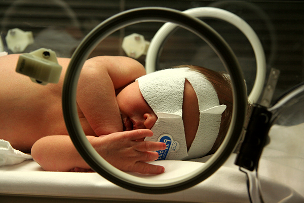

# TRIAGEM NEONATAL

A triagem neonatal é um dos pilares da medicina preventiva na pediatria. Quando falamos nisso, muitos alunos pensam imediatamente e apenas no Teste do Pezinho, mas para a prova de residência, você precisa entender que a triagem é um conjunto de procedimentos: Pezinho, Olhinho, Orelhinha, Coraçãozinho e Linguinha.

O objetivo aqui não é diagnosticar a doença de forma definitiva, mas sim identificar aquele recém-nascido (RN) que tem uma probabilidade muito alta de ter uma patologia que, se não tratada precocemente, deixará sequelas irreversíveis ou levará ao óbito. É a busca ativa em pacientes assintomáticos.

*Figura 1 - Coleta de sangue do calcanhar de recém-nascido para triagem neonatal (teste do pezinho), procedimento essencial nos primeiros dias de vida. Fonte: U.S. Air Force, Domínio Público | Wikimedia Commons*

## Teste do Pezinho (Programa Nacional de Triagem Neonatal - PNTN)

O Teste do Pezinho é, talvez, o tema mais cobrado em provas de neonatologia. Por que ele é feito no pé? Simplesmente por ser uma área muito vascularizada e de fácil acesso para coleta de sangue capilar em papel filtro.

### O Momento Ideal da Coleta

Este é o primeiro ponto onde os alunos erram. A recomendação oficial do Ministério da Saúde é que a coleta seja feita entre o **3º e o 5º dia de vida**.

Por que não fazer nas primeiras 24 horas?
Primeiro, para a Fenilcetonúria, o bebê precisa ter ingerido proteína (leite) para que os níveis de fenilalanina subam e sejam detectáveis. Segundo, para o Hipotireoidismo Congênito, existe um pico fisiológico de TSH logo após o nascimento (o "surge" de TSH), que pode gerar muitos falsos-positivos se coletado precocemente.

Se o bebê tiver alta precocemente (com 24 ou 48h), a orientação é coletar na alta, mas com a consciência de que pode ser necessário repetir. Em prematuros ou bebês transfundidos, existem protocolos específicos de repetição, pois a transfusão pode mascarar resultados de hemoglobinopatias.

### Doenças Triadas no SUS (PNTN Básico)

Atualmente, o PNTN básico no Brasil, conforme a estruturação histórica e a Portaria nº 822/2001, foca em seis doenças principais. Recentemente, a Lei nº 14.154/2021 estabeleceu a ampliação do teste para até 53 doenças, mas as bancas ainda focam massivamente no "feijão com arroz" que já está implementado na rede.

-

**Hipotireoidismo Congênito (HC):** É a causa mais comum de deficiência mental evitável. O marcador é o **TSH neonatal**. Se o TSH vier elevado (geralmente > 10 mU/L, dependendo do laboratório), o próximo passo é a confirmação com TSH e T4 Livre séricos. Lembre-se: o HC é uma emergência pediátrica. O tratamento com Levotiroxina Sódica deve começar o quanto antes para garantir o desenvolvimento cerebral.

-

**Fenilcetonúria (PKU):** Deficiência da enzima fenilalanina hidroxilase. O acúmulo de fenilalanina é tóxico para o cérebro. O marcador é a própria **Fenilalanina**. Se alterado, faz-se o teste confirmatório. O tratamento é puramente dietético (dieta pobre em fenilalanina).

-

**Doença Falciforme e outras Hemoglobinopatias:** O exame é a eletroforese de hemoglobina. No RN, o normal é encontrar HbF (fetal) e HbA. Se aparecer HbS, temos o alerta.

- **FAS:** Traço falciforme (comum em provas).

- **FS:** Provável Anemia Falciforme (HbSS).

- **FSC:** Doença HbSC.
Cuidado: O teste do pezinho normal NÃO descarta Beta talassemia minor, pois a produção de HbA2 e HbA ainda é incipiente.

-

**Fibrose Cística (FC):** O marcador é o **IRT (Tripsinogênio Imunorreativo)**. O IRT elevado indica sofrimento pancreático.

- **Protocolo:** Se o 1º IRT for alterado, deve-se repetir o IRT em até 30 dias de vida. Se o 2º IRT continuar alterado, o diagnóstico NÃO está feito ainda; você deve solicitar o **Teste do Suor** (padrão-ouro).

-

**Hiperplasia Adrenal Congênita (HAC):** Deficiência da enzima 21-hidroxilase na maioria dos casos. O marcador é a **17-OH Progesterona**. É vital detectar cedo, especialmente na forma perdedora de sal, que pode levar ao choque e óbito na 2ª semana de vida.

-

**Deficiência de Biotinidase:** A falta dessa enzima impede a reciclagem da biotina. O quadro clínico inclui convulsões, dermatite e alopecia. O tratamento é a reposição de biotina para o resto da vida.

| Doença | Marcador no Pezinho | Conduta se Alterado |
| --- | --- | --- |
| Hipotireoidismo Congênito | TSH | TSH e T4 Livre séricos |
| Fenilcetonúria | Fenilalanina | Dosagem sérica de Fenilalanina |
| Fibrose Cística | IRT | Repetir IRT em 30 dias -> Teste do Suor |
| Hemoglobinopatias | Eletroforese Hb | Repetir eletroforese após 6 meses |
| Hiperplasia Adrenal | 17-OH Progesterona | Eletrólitos e 17-OH sérica |

## Teste do Coraçãozinho (Oximetria de Pulso)

Este teste é uma triagem para **Cardiopatias Congênitas Críticas**, aquelas que dependem do canal arterial aberto para manter o fluxo sistêmico ou pulmonar. Se o canal fecha e a cardiopatia não foi detectada, o bebê choca em casa.

### Como e Quando Fazer?

- **Público:** RN termo ou prematuro tardio (> 34 semanas).

- **Momento:** Entre **24 e 48 horas de vida** (antes da alta). Por que não antes? Porque a resistência vascular pulmonar ainda está caindo e o canal arterial pode estar fechando, o que geraria falsos-positivos.

- **Local:** Membro Superior Direito (MSD - pré-ductal) e um dos Membros Inferiores (MI - pós-ductal).

### Interpretação dos Resultados

- **Normal:** Saturação ≥ 95% em ambos os locais E diferença entre eles < 3%.

- **Alterado:** Saturação < 95% OU diferença ≥ 3% entre MSD e MI.

Se o teste vier alterado, você não desespera. Você repete em 1 hora. Se continuar alterado após essa segunda medida, aí sim: o próximo passo obrigatório é o **Ecocardiograma** em até 24 horas.

**Dica do Dr. Will:** O teste do coraçãozinho tem uma limitação clássica que cai em prova: ele não detecta bem a **Coarctação de Aorta** se não houver uma obstrução grave o suficiente para gerar hipoxemia ou diferença de saturação no momento do exame. Além disso, se o bebê estiver com 70-75% de saturação nos primeiros 5 minutos de vida, mas estiver estável (APGAR 9), isso é fisiológico! Não saia pedindo eco para todo mundo na sala de parto.

*Figura 2 - Estetoscópio, símbolo da prática médica e do cuidado neonatal. Fonte: Domínio Público | Wikimedia Commons*

## Teste do Olhinho (Reflexo Vermelho)

O Teste do Reflexo Vermelho (TRV) deve ser feito pelo pediatra ainda na maternidade. Ele serve para avaliar a transparência dos meios oculares.

### O que buscamos?

Ao incidir a luz do oftalmoscópio a cerca de 50 cm do bebê, esperamos ver um reflexo simétrico, avermelhado ou alaranjado (como aquele efeito de "olho vermelho" em fotos antigas).

Se o reflexo estiver ausente, branco (**leucocoria**) ou assimétrico, o bebê deve ser encaminhado imediatamente ao oftalmologista. As principais patologias rastreadas são:

- Catarata Congênita (causa comum de cegueira tratável).

- Retinoblastoma (tumor ocular mais comum na infância).

- Glaucoma Congênito.

- Retinopatia da Prematuridade (ROP).

**Frequência:** Segundo a SBP, o TRV deve ser repetido pelo menos 3 vezes ao ano nos primeiros 3 anos de vida durante as consultas de puericultura. Não é um exame de "uma vez só".

## Teste da Orelhinha (Triagem Auditiva Neonatal)

O objetivo é a detecção precoce da deficiência auditiva. O desenvolvimento da linguagem depende da audição nos primeiros meses de vida.

### Métodos

Existem dois métodos principais, e a escolha depende do histórico do bebê:

-

**Emissões Otoacústicas Evocadas (EOAE):** É o teste básico. Avalia a integridade das células ciliadas externas da cóclea (pré-neural). É rápido, não invasivo e não precisa de sedação.

- **Problema:** Pode dar falso-positivo se houver vérnix ou líquido no conduto auditivo externo.

-

**Potencial Evocado Auditivo do Tronco Encefálico (PEATE ou BERA):** Avalia desde a cóclea até o tronco encefálico (via neural).

- **Indicação:** É o exame de escolha inicial para bebês com **Indicadores de Risco para Deficiência Auditiva (IRDA)**, como permanência em UTI por mais de 5 dias, uso de drogas ototóxicas (Amikacin, Gentamicina), ventilação mecânica, ou infecções congênitas (CMV, Toxoplasmose).

**Dica MedEvo:** Se um bebê usou amicacina na UTI, não adianta fazer apenas EOAE. Ele precisa do PEATE, pois a lesão pode ser retrococlear.

## Teste da Linguinha

Introduzido obrigatoriamente pela Lei nº 13.002/2014, visa detectar a **anquiloglossia** (língua presa). O foco é avaliar o frênulo lingual e sua interferência na amamentação. Se o bebê não consegue acoplar bem devido à língua presa, ele terá dificuldade de ganho de peso e a mãe terá dor ao amamentar. O tratamento, quando indicado, é a frenotomia.

## Vacinação ao Nascer

Embora tecnicamente seja "imunização", as bancas costumam cobrar as vacinas de maternidade junto com os cuidados neonatais e triagem.

-

**BCG:** Protege contra formas graves de tuberculose (miliar e meníngea). É intradérmica, no braço direito.

- **Mudança importante:** A ausência de cicatriz vacinal após a BCG NÃO é mais indicação de revacinação. Se o bebê foi vacinado e não formou a marquinha, o Ministério da Saúde considera-o imunizado da mesma forma.

- **Contraindicação:** RN < 2.000g (esperar atingir o peso) ou imunossupressão grave.

-

**Hepatite B:** Deve ser feita nas primeiras 12 a 24 horas de vida. Serve para prevenir a transmissão vertical, caso a mãe seja portadora do vírus (HBsAg positivo).

**Cenário Clínico:** Se um bebê nasce de mãe HBsAg positiva, você faz a vacina E a Imunoglobulina específica (HBIG) nas primeiras 12 horas, em membros diferentes.

## Fenômenos Fisiológicos e Cuidados Gerais

Muitas questões de triagem trazem "pegadinhas" com fenômenos normais do RN para ver se você vai intervir sem necessidade.

- **Crise Genital:** Sangramento vaginal discreto ou tumefação mamária (com ou sem saída de leite/ "leite de bruxa") em RNs de ambos os sexos. Isso é decorrente da queda dos hormônios maternos. Conduta: Apenas observação e orientação. Nunca esprema as mamas.

- **Fralda com "sangue":** Muitas vezes são apenas cristais de urato (cor alaranjada/tijolo), comuns nos primeiros dias por desidratação leve até a descida do leite.

- **Criptorquidia Unilateral:** Em RN a termo, pode ser fisiológica e o testículo pode descer nos primeiros meses. Acompanhamos até os 6 meses antes de intervir.

## Tabelas Comparativas para Fixação

### Tabela 1: Resumo das Triagens Neonatais

| Teste | O que avalia | Momento Ideal | Conduta se Alterado |
| --- | --- | --- | --- |
| **Pezinho** | Doenças metabólicas/genéticas | 3º ao 5º dia | Exames confirmatórios específicos |
| **Coraçãozinho** | Cardiopatias críticas | 24h - 48h | Repetir em 1h; se mantiver, Ecocardiograma |
| **Olhinho** | Transparência ocular | Antes da alta | Avaliação especializada (Oftalmo) |
| **Orelhinha** | Função auditiva | Antes da alta | Re-teste ou PEATE |
| **Linguinha** | Frênulo lingual | Antes da alta | Avaliação da mamada / Frenotomia |

### Tabela 2: Teste do Coraçãozinho - Fluxograma

| Resultado | Saturação (MSD e MI) | Diferença entre Membros | Conduta |
| --- | --- | --- | --- |
| **Passou (Negativo)** | ≥ 95% | < 3% | Alta e puericultura |
| **Duvidoso** | < 95% OU | ≥ 3% | Repetir em 1 hora |
| **Falhou (Positivo)** | < 95% OU | ≥ 3% (após 2ª medida) | Ecocardiograma em 24h |

## Diagnóstico Diferencial e Erros Comuns

Um erro clássico é confundir a conduta na Fibrose Cística. A banca vai dizer que o IRT veio alto e perguntar a conduta. A alternativa "A" será "Teste do Suor". **Não marque essa!** A conduta após o primeiro IRT alterado é **repetir o IRT** em até 30 dias. O teste do suor só vem depois do segundo IRT alterado.

Outro ponto: **Hipotireoidismo Congênito**. Se o TSH da triagem vier muito alto (ex: > 40), alguns protocolos sugerem convocar imediatamente para tratamento enquanto colhe a confirmação, devido ao risco neurológico. Mas, para a maioria das provas, a sequência é: Triagem (TSH) -> Confirmação sérica (TSH + T4L) -> Tratamento.

Sobre a **Fenilcetonúria**, lembre-se da "Hiperfenilalaninemia materna". Se a mãe tem a doença e não faz a dieta na gestação, o bebê pode nascer com microcefalia e malformações, mesmo que ele não tenha a genética da doença. Isso é um diagnóstico diferencial importante em questões de genética.

## Pontos-Chave para Prova 🎯

- **Pezinho:** Coleta ideal entre o 3º e 5º dia de vida. Nunca antes de 48h se possível.

- **Hipotireoidismo Congênito:** TSH é o marcador; T4 livre confirma. É a causa mais comum de retardo mental evitável.

- **Fibrose Cística:** IRT -> Repete IRT -> Teste do Suor (Cloro > 60 mEq/L confirma).

- **Coraçãozinho:** Feito entre 24-48h, em RN > 34 semanas. MSD e MI.

- **Coraçãozinho Alterado:** Sat < 95% ou diferença ≥ 3%. Repete em 1h. Se persistir, ECO.

- **Olhinho:** Busca leucocoria (reflexo branco). Se presente, suspeitar de Catarata ou Retinoblastoma.

- **Orelhinha:** EOAE para bebês sem risco; PEATE (BERA) para bebês com risco (UTI > 5 dias, ototóxicos).

- **BCG:** Não se revacina mais se não houver cicatriz.

- **Hepatite B:** Primeira dose nas primeiras 12-24h de vida.

- **Anemia Falciforme:** Padrão FS no teste do pezinho. FAS é apenas traço (portador).

- **Biotinidase:** Deficiência causa convulsões e dermatite; tratamento é biotina oral.

- **HAC:** Forma perdedora de sal é a mais grave; marcador é a 17-OH Progesterona.

- **Contraindicação Vacinas Vivas:** Imunossupressão grave ou uso de corticoides em dose imunossupressora (ex: Prednisona 2mg/kg/dia por > 14 dias).

- **Falso Positivo Orelhinha:** Muito comum por presença de vérnix no conduto auditivo.

- **Linguinha:** Avalia o risco de desmame precoce e dificuldades na amamentação.

- **Saturação ao Nascer:** É normal o RN demorar até 10-15 minutos para atingir saturação > 90%. Não confunda com necessidade de reanimação se o bebê estiver bem.

 Cópia offline para consulta pessoal.
 Fonte original:
 [https://www.medevo.com.br/material-apoio/ler/9901d33c-23c6-4eae-8a3d-3f849363280d](https://www.medevo.com.br/material-apoio/ler/9901d33c-23c6-4eae-8a3d-3f849363280d)
