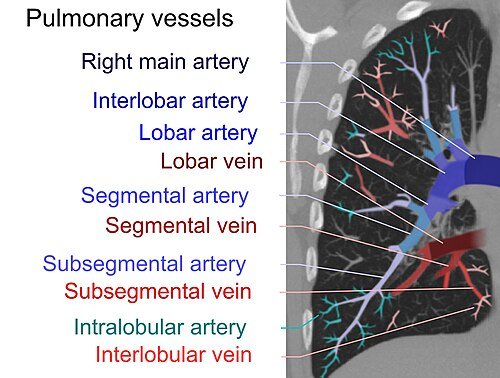

# TROMBOEMBOLISMO NA GESTAÇÃO

Para entender o tromboembolismo venoso (TEV) na gestação, que engloba a Trombose Venosa Profunda (TVP) e o Tromboembolismo Pulmonar (TEP), você precisa primeiro visualizar a gestante como um cenário perfeito para a Tríade de Virchow. Se você entender a fisiopatologia, as condutas de prova deixam de ser decoreba e passam a ser lógicas.

A gestação não é apenas um estado fisiológico diferente, é um desafio hemodinâmico e bioquímico. O risco de TEV aumenta de 4 a 5 vezes durante a gravidez e explode para cerca de 20 vezes no puerpério, especialmente nas primeiras três semanas. É a principal causa de morte materna em países desenvolvidos e uma das maiores aqui no Brasil.

## Fisiopatologia: A Tríade de Virchow no Ciclo Gravídico-Puerperal

Por que a gestante trombosa tanto? A resposta está na evolução. O corpo da mulher se prepara para o desafio do parto, onde o risco de hemorragia é real. Para sobreviver ao descolamento da placenta, o organismo "hipercoagula".

### 1. Hipercoagulabilidade

Há um aumento progressivo de quase todos os fatores de coagulação (I, II, VII, VIII, IX e X). Ao mesmo tempo, ocorre uma diminuição dos anticoagulantes naturais, como a Proteína S, e uma inibição da fibrinólise pelo aumento do PAI-1 e PAI-2 (inibidores do ativador do plasminogênio) produzidos pela placenta.

### 2. Estase Venosa

O útero gravídico é um órgão pesado que, a partir do segundo trimestre, comprime a veia cava inferior e as veias ilíacas. Isso dificulta o retorno venoso dos membros inferiores. Além disso, a progesterona tem um efeito relaxante na musculatura lisa das veias, aumentando a capacitância venosa e reduzindo a velocidade do fluxo.

### 3. Lesão Vascular

No momento do parto, seja vaginal ou cesárea, ocorre trauma nas veias pélvicas. A própria separação da placenta expõe uma superfície vascular imensa que precisa ser trombosada rapidamente para evitar a morte por exsangueinação.

**Dica de Prova:** As bancas adoram perguntar qual o período de maior risco. Grave isso: é o **puerpério**. Embora a gestação seja longa, a densidade de eventos trombóticos por dia é muito maior nas primeiras semanas após o parto.

## Fatores de Risco e Estratificação

Nem toda gestante precisa de profilaxia medicamentosa, mas toda gestante precisa ser estratificada. O erro clássico em questões de prova é não identificar o fator de risco que "obriga" o uso da enoxaparina.

### Fatores Pré-existentes

- **História prévia de TEV:** É o fator de risco isolado mais importante. Se a paciente já teve uma trombose, o risco de recorrência na gestação é altíssimo.

- **Trombofilias:** Hereditárias (Fator V de Leiden, Mutação do Gene da Protrombina, Deficiência de Antitrombina, Proteína C ou S) ou adquiridas (Síndrome do Anticorpo Antifosfolipídeo - SAF).

- **Comorbidades:** Obesidade (IMC > 30), idade > 35 anos, multiparidade (≥ 3), tabagismo e doenças inflamatórias.

### Fatores Gestacionais e Obstétricos

- **Imobilização:** Repouso prolongado no leito (comum em ameaças de parto prematuro).

- **Desidratação/Hiperêmese Gravídica:** Hemoconcentração aumenta o risco.

- **Pré-eclâmpsia:** Causa disfunção endotelial.

- **Técnicas de Reprodução Assistida:** Devido à hiperestimulação ovariana e altos níveis de estrogênio.

- **Cesárea:** Especialmente se for de urgência ou acompanhada de outros riscos.

**Tabela 1: Estratificação de Risco para Profilaxia (Baseado em FEBRASGO e RCOG)**

| Categoria de Risco | Perfil da Paciente | Conduta Recomendada |
| --- | --- | --- |
| **Alto Risco** | TEV prévio recorrente; TEV prévio + Trombofilia grave; SAF com TEV prévio. | HBPM em dose terapêutica ou profilática alta durante toda a gestação + 6 semanas de puerpério. |
| **Risco Intermediário** | TEV prévio único (não relacionado a estrogênio/gestação); Trombofilia assintomática grave. | HBPM profilática a partir do 1º trimestre + 6 semanas de puerpério. |
| **Baixo Risco** | TEV prévio provocado (ex: trauma ortopédico antigo); Trombofilias de baixo risco assintomáticas. | Vigilância clínica na gestação; considerar HBPM por 6 semanas no puerpério. |
| **Risco Mínimo** | Sem histórico pessoal; obesidade isolada; idade > 35 anos isolada. | Mobilização precoce e hidratação. |

*Figura 1 - Profissional de saúde em atendimento, representando o acompanhamento do tromboembolismo na gestação. Fonte: National Cancer Institute, Domínio Público | Wikimedia Commons*

## Trombose Venosa Profunda (TVP)

A TVP na gestação tem uma particularidade anatômica que cai muito em prova: ela ocorre preferencialmente no **membro inferior esquerdo** (cerca de 85% dos casos).

### Por que à esquerda?

Isso acontece devido à Síndrome de May-Thurner ou de Cockett. A artéria ilíaca comum direita cruza sobre a veia ilíaca comum esquerda para se tornar a artéria ilíaca interna. Na gestação, o útero comprime a artéria contra a veia, gerando um "estrangulamento" mecânico da veia ilíaca esquerda.

### Quadro Clínico e Exame Físico

O sinal clássico é o edema unilateral, dor na panturrilha e empastamento muscular.

- **Manobra de Homans:** Dor na panturrilha à dorsiflexão passiva do pé. Embora clássica em livros, tem baixa sensibilidade e especificidade, mas as bancas ainda citam.

- **Cuidado:** Edema bilateral é fisiológico na gestação. O que deve acender o alerta é a **assimetria** (diferença de diâmetro > 2-3 cm entre as panturrilhas).

### Diagnóstico de TVP

Aqui o Dr. Will sempre reforça: na gestante, o algoritmo muda um pouco.

- **Dímero-D:** Esqueça o Dímero-D para confirmar diagnóstico na gestante. Ele aumenta fisiologicamente ao longo dos três trimestres. Um Dímero-D alto não significa nada. No entanto, ele mantém um **alto valor preditivo negativo**. Se vier baixo (o que é raro na gestante), você pode excluir TVP. Se vier alto, você não conclui nada.

- **Ultrassonografia Doppler de MMII:** É o exame de primeira escolha. É não invasivo, sem radiação e altamente acurado para trombos proximais (poplítea, femoral e ilíaca).

- **Se o Doppler for negativo, mas a suspeita for alta:** Repita o exame em 3 a 7 dias. O trombo pode estar em formação ou ser muito proximal (pélvico), onde o Doppler tem dificuldade de enxergar.

## Tromboembolismo Pulmonar (TEP)

O TEP é a complicação catastrófica da TVP. O quadro clínico costuma ser súbito: dispneia, dor torácica pleurítica, taquicardia e, em casos graves, hemoptise ou síncope.

### O Desafio Diagnóstico do TEP

Muitos sintomas de TEP se confundem com o desconforto respiratório normal da gravidez (pelo aumento da progesterona e elevação do diafragma).

**O que fazer primeiro?**
Se a paciente tem sinais de TVP e sintomas respiratórios, peça o **Doppler de MMII primeiro**. Se o Doppler confirmar TVP, você já tem o diagnóstico de TEV e vai tratar com anticoagulação plena. Você "pula" a radiação no tórax porque a conduta será a mesma.

Se o Doppler de MMII for negativo e a suspeita de TEP persistir, precisamos de imagem pulmonar. Aqui entra o medo infundado da radiação.

**Tabela 2: Comparativo de Exames de Imagem para TEP na Gestante**

| Exame | Vantagens | Desvantagens / Riscos |
| --- | --- | --- |
| **Cintilografia V/Q** | Menor radiação para a mama materna. | Pode ser inconclusiva; menos disponível em plantões. |
| **Angio-TC de Tórax** | Diagnóstico rápido; detecta diagnósticos diferenciais (pneumonia, etc). | Maior carga de radiação para a mama materna (risco teórico de CA de mama futuro). |
| **Raio-X de Tórax** | Exclui outras causas; necessário antes da cintilografia. | Radiação fetal desprezível (< 0,01 mGy). |

**Nota importante:** A radiação fetal em ambos os exames (Cintilografia e Angio-TC) está muito abaixo do limite de 50 mGy considerado teratogênico. Portanto, se a mãe corre risco de vida, o exame **deve** ser feito. A saúde materna é a prioridade absoluta.

*Figura 2 - Estetoscópio, símbolo da prática médica e da anticoagulação na gestação. Fonte: Domínio Público | Wikimedia Commons*

## Tratamento Farmacológico

A regra de ouro: **Heparina sempre, Varfarina nunca (quase nunca).**

### Por que Heparina?

As heparinas (tanto a Não Fracionada - HNF, quanto a de Baixo Peso Molecular - HBPM) não atravessam a placenta. Elas são moléculas grandes e polares. Portanto, são seguras para o feto.

### Por que evitar Varfarina?

A Varfarina atravessa a placenta e é teratogênica, causando a "embriopatia varfarínica" (hipoplasia nasal, pontilhado epifisário) se usada entre a 6ª e 12ª semana. Além disso, causa risco de hemorragia fetal intracraniana.

- **Exceção de Prova:** Gestantes com válvulas cardíacas metálicas. Nelas, o risco de trombose da válvula com heparina é tão alto que algumas diretrizes permitem manter a varfarina após o primeiro trimestre, trocando para heparina próximo ao parto. Mas para questões de TEV comum, varfarina é contraindicada.

### HBPM (Enoxaparina) vs. HNF

A HBPM (Enoxaparina) é a primeira escolha.

- **Vantagens da HBPM:** Meia-vida mais longa, resposta mais previsível, menor risco de Trombocitopenia Induzida por Heparina (HIT) e menor risco de osteoporose.

- **Quando usar HNF:** Em casos de insuficiência renal grave (ClCr < 30) ou quando o parto é iminente (pois a HNF tem meia-vida curta e o antídoto, Protamina, funciona melhor nela).

**Tabela 3: Doses de Enoxaparina (HBPM)**

| Indicação | Dose Padrão | Observação |
| --- | --- | --- |
| **Profilaxia** | 40 mg SC 1x ao dia | Ajustar para 60 mg se peso > 90kg ou IMC muito elevado. |
| **Dose Intermediária** | 40 mg SC 12/12h | Usada em pacientes de alto risco ou peso muito elevado. |
| **Terapêutica (Plena)** | 1 mg/kg SC 12/12h | Usada para tratar TVP ou TEP confirmados. |

**Duração do Tratamento:** Se a paciente teve um TEV na gestação, ela deve ser anticoagulada por toda a gravidez e por, no mínimo, 6 semanas de puerpério, completando um tempo total de tratamento de pelo menos 3 a 6 meses.

## Manejo no Parto e Puerpério

Este é o momento onde o obstetra mais "sua a camisa". Precisamos equilibrar o risco de trombose com o risco de hemorragia no parto e a possibilidade de anestesia regional.

### O Planejamento do Parto

- **Suspensão da HBPM:** Para realizar anestesia de neuroeixo (raqui ou peridural), a HBPM em dose profilática deve ser suspensa **12 horas antes**. Se a dose for terapêutica (plena), a suspensão deve ser **24 horas antes**.

- **Troca para HNF:** Muitas vezes, ao chegar perto de 37 semanas, trocamos a HBPM pela HNF, pois a HNF pode ser suspensa apenas 4 a 6 horas antes do procedimento e seu efeito é monitorado pelo TTPA.

- **Pós-parto:** O reinício da profilaxia deve ocorrer assim que houver estabilidade hemodinâmica e ausência de sangramento ativo, geralmente **4 a 6 horas após parto vaginal** e **6 a 12 horas após cesárea**.

### Anticoagulação e Amamentação

Aqui há uma confusão comum. A HBPM e a HNF são seguras na amamentação. A **Varfarina também é segura na amamentação** (ela não passa para o leite em quantidades significativas).

- **Cuidado:** Os novos anticoagulantes orais (DOACs), como Rivaroxabana e Apixabana, **não** devem ser usados na gestação nem na amamentação, pois faltam dados de segurança.

## Situações Especiais e Pegadinhas

### 1. Trombofilias e Perda Gestacional

Muitos alunos confundem a indicação de AAS. O AAS (Aspirina) é usado para prevenção de Pré-eclâmpsia e na Síndrome do Anticorpo Antifosfolipídeo (associado à heparina). Nas trombofilias hereditárias isoladas, o AAS não tem papel estabelecido na prevenção de TEV.

### 2. Filtro de Veia Cava Inferior

Indicado apenas se a paciente tem um TEV agudo (nas últimas 2 semanas) e tem uma contraindicação absoluta para anticoagulação (ex: sangramento ativo grave) ou se ela faz um novo TEP mesmo estando adequadamente anticoagulada.

### 3. Choque Obstrutivo

Se uma gestante com TEP evolui com instabilidade hemodinâmica (choque), a conduta é a **trombólise**. O risco de sangramento materno é alto, mas é uma medida de salvamento. O TEP maciço é uma das causas de choque obstrutivo em obstetrícia, diferenciando-se do choque hipovolêmico (DPP, rotura uterina) e do choque distributivo (sepse por aborto infectado).

### 4. Síndrome do Túnel do Carpo

Apareceu na lista de conceitos cobrados e parece "fora do lugar", mas não está. O edema gestacional pode comprimir o nervo mediano. Se a questão descreve parestesia nas mãos no 3º trimestre, pense nisso antes de pensar em algo neurológico grave. É manejo conservador.

### 5. O Papel do Doppler de Artérias Uterinas

Não serve para diagnosticar trombose. Ele serve para avaliar a invasão trofoblástica. Se houver alta resistência ou persistência da incisura protodiastólica no 2º trimestre, o risco é de **Pré-eclâmpsia e Restrição de Crescimento Fetal**, não de TEV.

## Diagnóstico Diferencial de Edema e Dor em MMII

Como professor, eu vejo muitos alunos errando por não considerar outras hipóteses. No MedEvo, sempre batemos na tecla do diagnóstico diferencial.

- **Celulite/Erisipela:** Tem febre e sinais inflamatórios (calor, rubor) bem delimitados.

- **Insuficiência Venosa Crônica:** Edema geralmente bilateral, presença de varizes, hiperpigmentação ocre.

- **Rotura de Cisto de Baker:** Dor súbita na região posterior do joelho, com equimose em torno do tornozelo (sinal do crescente).

- **Mialgia/Trauma:** História de esforço físico.

No entanto, para a prova: **Edema unilateral na gestante é TVP até que se prove o contrário.**

## Pontos-Chave para Prova

- **Tríade de Virchow:** Hipercoagulabilidade (↑ fatores, ↓ proteína S), Estase (compressão da cava) e Lesão Vascular (parto).

- **Localização Clássica:** TVP é mais comum no membro inferior **esquerdo** (compressão da veia ilíaca esquerda pela artéria ilíaca direita).

- **Dímero-D:** Alto valor preditivo negativo, mas baixa especificidade. Se positivo, não confirma nada. Se negativo (raro), ajuda a excluir.

- **Exame de Escolha TVP:** Ultrassonografia Doppler de membros inferiores.

- **Exame de Escolha TEP:** Cintilografia V/Q (menos radiação para mama) ou Angio-TC (mais disponível e acurada). Raio-X de tórax deve preceder ambos.

- **Drogas de Escolha:** Heparina de Baixo Peso Molecular (Enoxaparina) é a primeira linha.

- **Contraindicações:** Varfarina (teratogênica no 1º tri) e DOACs (Rivaroxabana/Apixabana - sem dados de segurança).

- **Dose de Profilaxia:** Enoxaparina 40mg SC 1x/dia (ajustar pelo peso se > 90kg para 60mg).

- **Dose Terapêutica:** Enoxaparina 1mg/kg SC 12/12h.

- **Puerpério:** É o período de maior risco para eventos trombóticos. A profilaxia em pacientes de risco deve durar 6 semanas.

- **Anestesia Regional:** Suspender HBPM profilática por 12h e terapêutica por 24h.

- **Amamentação:** Heparinas e Varfarina são permitidas. DOACs são proibidos.

- **Válvula Metálica:** Única situação onde a Varfarina pode ser considerada devido ao alto risco de trombose da prótese com heparina.

- **Conduta no Choque:** TEP com instabilidade hemodinâmica exige trombólise, mesmo na gestação.

- **Radiação:** O risco fetal em exames diagnósticos de TEP é desprezível (< 50 mGy). Nunca negue um exame necessário para salvar a mãe por medo da radiação. 🚀

 Cópia offline para consulta pessoal.
 Fonte original:
 [https://www.medevo.com.br/material-apoio/ler/f9710031-9642-4ef1-a54a-cedbe3e7ff65](https://www.medevo.com.br/material-apoio/ler/f9710031-9642-4ef1-a54a-cedbe3e7ff65)
