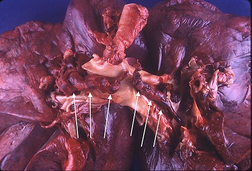

# TROMBOEMBOLISMO VENOSO (TEV)

O Tromboembolismo Venoso (TEV) não é uma doença única, mas um espectro que engloba a Trombose Venosa Profunda (TVP) e sua complicação mais temida, o Tromboembolismo Pulmonar (TEP). Para a prova de residência, você deve encarar o TEV como uma "entidade dinâmica": o trombo que hoje está na panturrilha pode ser o êmbolo que amanhã causa um choque obstrutivo no pulmão.

Como professor, vejo muitos alunos decorando escores sem entender a lógica por trás deles. Vamos quebrar essa barreira. O TEV é a terceira causa de morte cardiovascular no mundo, perdendo apenas para o infarto e o AVC. No ambiente cirúrgico, é a principal causa de morte evitável. Se você entender o "porquê" de cada conduta, as questões de prova se tornam intuitivas.

## Fisiopatologia: A Tríade de Virchow e Além

Tudo começa com a famosa Tríade de Virchow. Se você souber isso, já mata 20% das questões sobre fatores de risco. A tríade é composta por:

- **Estase Venosa:** O sangue parado favorece a ativação de fatores de coagulação. Pense no paciente acamado, na viagem de avião de 12 horas ou na gestante cujo útero comprime a veia cava.

- **Lesão Endotelial:** O endotélio íntegro é antitrombótico. Quando há trauma, cirurgia ou inflamação vascular (vasculite), o colágeno subendotelial é exposto, ativando as plaquetas e a cascata de coagulação.

- **Hipercoagulabilidade:** Aqui entram as trombofilias (hereditárias ou adquiridas) e o câncer. O câncer é um "estado pró-trombótico ambulante" porque libera citocinas e substâncias pró-coagulantes.

**Cuidado com a pegadinha:** As bancas adoram colocar "Idade > 60 anos" como parte da Tríade de Virchow. **Errado.** A idade avançada é um fator de risco importante, mas não faz parte da tríade original. A tríade foca no mecanismo biológico, não no perfil demográfico.

### Por que o trombo se solta?

O trombo venoso é rico em fibrina e hemácias (trombo vermelho). Ele se forma geralmente em áreas de baixo fluxo, como as válvulas venosas. Quando esse trombo se fragmenta ou se solta inteiramente, ele viaja pela circulação sistêmica, passa pelo átrio direito, ventrículo direito e se aloja na circulação arterial pulmonar.

Aqui entra um conceito de fisiologia que cai muito: o TEP causa um aumento do **espaço morto alveolar**. O que é isso? É uma área do pulmão que é ventilada (o ar entra), mas não é perfundida (o sangue não chega por causa do trombo). Isso gera hipoxemia e, se a obstrução for grande (> 50% do leito vascular), leva à falência do ventrículo direito (cor pulmonale agudo).

*Figura 1 - Estetoscópio, símbolo da prática médica e da avaliação clínica do tromboembolismo venoso. Fonte: Domínio Público | Wikimedia Commons*

## Trombose Venosa Profunda (TVP)

A TVP ocorre majoritariamente nos membros inferiores (80-95% dos casos). O diagnóstico clínico é traiçoeiro: metade dos pacientes com TVP confirmada são assintomáticos ou têm sintomas inespecíficos.

### Quadro Clínico e Exame Físico

O cenário clássico é: dor, edema unilateral, empastamento da panturrilha e aumento da temperatura local. No exame físico, você deve procurar os sinais clássicos que as bancas ainda amam cobrar:

- **Sinal de Homans:** Dor na panturrilha à dorsiflexão passiva do pé. (Baixa sensibilidade, mas cai em prova).

- **Sinal de Bancroft (ou de Moses):** Dor à compressão da panturrilha contra o plano ósseo.

- **Sinal da Bandeira:** Menor mobilidade da panturrilha quando comparada ao lado contralateral.

- **Phlegmasia Alba Dolens:** "Perna branca". Ocorre por espasmo arterial secundário a uma TVP maciça.

- **Phlegmasia Cerulea Dolens:** "Perna azul". Emergência cirúrgica! Obstrução venosa total que impede o fluxo arterial, levando à isquemia e risco de gangrena.

### Estratificação de Risco: Escore de Wells para TVP

Não tente adivinhar se é TVP. Use o Escore de Wells. Ele dita o próximo passo diagnóstico.

| Critério | Pontuação |
| --- | --- |
| Câncer ativo (em tratamento ou paliativo) | +1 |
| Paralisia, paresia ou imobilização recente de MMII | +1 |
| Acamado por > 3 dias ou cirurgia de grande porte (< 12 semanas) | +1 |
| Dor/sensibilidade ao longo do sistema venoso profundo | +1 |
| Edema de toda a perna | +1 |
| Edema de panturrilha (> 3 cm em relação ao outro lado) | +1 |
| Edema cacifo (maior no membro afetado) | +1 |
| Veias superficiais colaterais (não varicosas) | +1 |
| História prévia de TVP documentada | +1 |
| Diagnóstico alternativo tão provável quanto TVP | -2 |

**Interpretação:**

- **0 pontos:** Baixa probabilidade.

- **1-2 pontos:** Probabilidade intermediária.

- **≥ 3 pontos:** Alta probabilidade.

**Dica do Dr. Will:** Se o Wells for baixo, peça o **D-dímero**. O D-dímero tem um altíssimo Valor Preditivo Negativo (VPN). Se ele vier negativo (< 500 ng/mL ou valor ajustado pela idade), você descarta TVP sem precisar de imagem. Se o Wells for alto, não perca tempo com D-dímero; vá direto para o Doppler.

### Diagnóstico por Imagem

- **Ultrassonografia Doppler (Duplex Scan):** É o exame de escolha na prática clínica. O critério mais confiável é a **ausência de compressibilidade** da veia. Se a veia não "murcha" quando você aperta com o transdutor, tem um trombo ali.

- **Venografia:** É o **padrão-ouro**, mas raramente realizada por ser invasiva e usar contraste iodado. Guarde isso para a prova teórica.

- **Angio-TC ou Angio-RM:** Úteis para tromboses de veias ilíacas ou cava, onde o Doppler tem dificuldade técnica.

*Figura 2 - Peça cirúrgica de tromboembolia pulmonar em sela, demonstrando trombo na bifurcação da artéria pulmonar. Fonte: Bakerstmd, CC BY-SA 4.0 | Wikimedia Commons*

## Tromboembolismo Pulmonar (TEP)

O TEP é o "grande simulador". Ele pode se apresentar como uma síncope, uma dor torácica pleurítica ou apenas uma taquicardia inexplicada em um paciente pós-operatório.

### Quadro Clínico

A tríade clássica (dispneia + dor pleurítica + hemoptise) ocorre em menos de 20% dos casos. O sinal mais comum é a **taquipneia**, e o sintoma mais comum é a **dispneia súbita**.

**Exemplo Clínico:** Paciente de 65 anos, no 5º dia pós-op de prótese de quadril, apresenta taquicardia (FC 115 bpm) e dispneia súbita. O pulmão está limpo à ausculta. **Diagnóstico: TEP até que se prove o contrário.**

### Exames Complementares Iniciais

- **ECG:** O achado mais comum é a taquicardia sinusal. O padrão **S1Q3T3** (onda S em D1, Q em D3 e T invertida em D3) é clássico, mas raro e indica sobrecarga aguda de ventrículo direito.

- **Radiografia de Tórax:** Geralmente normal (o que ajuda a excluir pneumonia). Pode mostrar o **Sinal de Westermark** (rarefação vascular focal) ou a **Cunha de Hampton** (opacidade triangular periférica indicando infarto pulmonar).

- **Gasometria:** Frequentemente mostra hipoxemia com hipocapnia (pela taquipneia).

### Diagnóstico Definitivo: O Algoritmo de Wells para TEP

Assim como na TVP, usamos o Wells para decidir o exame de imagem.

| Critério | Pontuação |
| --- | --- |
| Sinais clínicos de TVP | 3.0 |
| Diagnóstico alternativo menos provável que TEP | 3.0 |
| Frequência Cardíaca > 100 bpm | 1.5 |
| Imobilização ou cirurgia nas últimas 4 semanas | 1.5 |
| Episódio prévio de TVP ou TEP | 1.5 |
| Hemoptise | 1.0 |
| Câncer (em tratamento ou nos últimos 6 meses) | 1.0 |

**Conduta MedEvo:**

- **Wells ≤ 4 (TEP Improvável):** Peça D-dímero. Se negativo, para a investigação. Se positivo, Angio-TC.

- **Wells > 4 (TEP Provável):** Vá direto para a **Angiotomografia de Artérias Pulmonares (ATAP)**.

**Padrão-ouro:** Arteriografia Pulmonar (invasiva, reservada para quando outros exames são inconclusivos ou para intervenção).

## Estratificação de Gravidade e Prognóstico (PESI)

Não basta diagnosticar o TEP; você precisa saber se o paciente vai morrer nas próximas horas. O TEP é classificado em:

- **Alto Risco (Massivo):** Paciente com **instabilidade hemodinâmica** (PAS < 90 mmHg ou queda ≥ 40 mmHg por > 15 min). Aqui a conduta é trombólise.

- **Risco Intermediário (Submassivo):** Estável hemodinamicamente, mas com sinais de disfunção de VD (Ecocardiograma ou BNP/Troponina elevados).

- **Baixo Risco:** Estável e sem disfunção de VD. Pode ser tratado em casa se o escore sPESI for 0.

O escore **sPESI (Simplified Pulmonary Embolism Severity Index)** ajuda a decidir quem pode ter alta precoce:

- Idade > 80 anos (1 ponto)

- Câncer (1 ponto)

- Doença cardiopulmonar crônica (1 ponto)

- FC ≥ 110 bpm (1 ponto)

- PAS < 100 mmHg (1 ponto)

- SatO2 < 90% (1 ponto)

Se **sPESI = 0**, o risco de morte em 30 dias é < 1%. Pode tratar ambulatorialmente.

## Tratamento Farmacológico: A Arte da Anticoagulação

O objetivo da anticoagulação não é "dissolver" o trombo (quem faz isso é o sistema fibrinolítico do próprio corpo ou o trombolítico que você injeta). O objetivo é **evitar a progressão do trombo e a recorrência do evento**.

### 1. Fase Inicial (Primeiros 5-21 dias)

- **Heparina de Baixo Peso Molecular (HBPM - Enoxaparina):** 1 mg/kg de 12/12h (dose plena). É a preferida na gestação e no câncer (embora os DOACs estejam ganhando espaço aqui).

- **Heparina Não Fracionada (HNF):** Reservada para pacientes com **Insuficiência Renal Grave (ClCr < 30 ml/min)** ou instabilidade hemodinâmica (pela meia-vida curta e facilidade de reversão com protamina). Exige controle do TTPa (alvo 1,5 a 2,5 vezes o controle).

- **Fondaparinux:** Inibidor seletivo do fator Xa. Útil se história de Plaquetopenia Induzida por Heparina (HIT).

### 2. Fase de Manutenção (3 a 6 meses ou indefinida)

- **Anticoagulantes Orais Diretos (DOACs):** São a primeira linha hoje (Rivaroxabana, Apixabana, Edoxabana, Dabigatrana).

- *Vantagem:* Não precisa de controle de RNI.

- *Rivaroxabana:* 15 mg 12/12h por 21 dias, depois 20 mg/dia.

- *Apixabana:* 10 mg 12/12h por 7 dias, depois 5 mg 12/12h. É o preferido em idosos e pacientes com disfunção renal leve/moderada.

- **Varfarina (Antagonista da Vitamina K):** Barata, mas difícil de manejar. Exige "ponte" com heparina por pelo menos 5 dias até o RNI estar entre 2.0 e 3.0 em duas medidas consecutivas.

| Situação Clínica | Anticoagulante de Escolha |
| --- | --- |
| Gestante | HBPM (Enoxaparina) - Varfarina é teratogênica! |
| Câncer | HBPM ou DOAC (exceto em tumores TGI/GU pelo risco de sangramento) |
| Insuficiência Renal Grave (ClCr < 15) | Heparina Não Fracionada + Varfarina |
| Síndrome do Anticorpo Antifosfolipídio (SAF) | Varfarina (DOACs falharam nos estudos) |
| Instabilidade Hemodinâmica | HNF (pela facilidade de suspender para trombólise/cirurgia) |

### 3. Trombólise Sistêmica

Indicada **apenas no TEP de Alto Risco (Instável)**. O agente mais usado é o alteplase (rtPA) 100 mg EV em 2 horas.

- **Contraindicações Absolutas:** AVC hemorrágico prévio, AVC isquêmico nos últimos 6 meses, trauma de SNC ou neoplasia intracraniana, sangramento ativo.

## Filtro de Veia Cava Inferior (FVCI)

Muitos alunos acham que qualquer TVP grande precisa de filtro. **Erro grave.** O filtro de veia cava tem indicações muito precisas. Ele não trata a trombose; ele apenas tenta "peneirar" o sangue para que o trombo não chegue ao pulmão.

**Indicações Absolutas de FVCI:**

- **Contraindicação absoluta à anticoagulação** em paciente com TEV agudo (ex: paciente com TVP que acabou de ter um AVC hemorrágico).

- **Falha da anticoagulação plena** (paciente faz um novo TEP mesmo com RNI na meta ou usando DOAC corretamente).

- **Complicação grave da anticoagulação** que obrigue a suspensão do tratamento em fase aguda.

**Cuidado:** "Trombo flutuante" ou "TVP extensa" isoladamente **NÃO** são indicações formais de filtro segundo as diretrizes mais recentes, a menos que haja um dos critérios acima.

## Profilaxia: Onde a Prova de Cirurgia Foca

A profilaxia deve ser feita em quase todo paciente internado.

- **Risco Baixo (Cirurgias menores, paciente jovem, deambulação precoce):** Apenas deambulação.

- **Risco Moderado/Alto (Cirurgia oncológica, ortopédica, trauma):** HBPM (Enoxaparina 40mg/dia) ou HNF (5000 UI 8/8h ou 12/12h).

- **Contraindicação à profilaxia farmacológica:** Use profilaxia mecânica (Meias de compressão graduada ou Compressão Pneumática Intermitente).

**Dica de Ouro:** Em cirurgias de grande porte para câncer (abdominal ou pélvica) e cirurgias ortopédicas de quadril/joelho, a profilaxia deve ser **estendida por 28 a 35 dias** após a alta.

## Situações Especiais e Pegadinhas

- **Plaquetopenia e Anticoagulação:** Se as plaquetas caírem > 50% após iniciar heparina, suspeite de **HIT (Trombocitopenia Induzida por Heparina)**. Ironicamente, a HIT causa TROMBOSE, não sangramento. Conduta: suspender heparina e iniciar outro anticoagulante (ex: Fondaparinux ou Argatrobana).

- **TEV e Anticoncepcionais:** O estrogênio aumenta os fatores de coagulação e reduz a Proteína S. Se uma paciente jovem tem TVP usando ACO, a primeira conduta é tratar a TVP e a segunda é trocar o método para um sem estrogênio (DIU de cobre ou Mirena).

- **Embolia Gordurosa:** Ocorre após fratura de ossos longos (fêmur). A tríade é: Insuficiência respiratória + Alterações neurológicas + **Petéquias** (em tórax e conjuntiva). O tratamento é apenas suporte.

- **Duração do Tratamento:**

- Primeiro episódio provocado por fator de risco reversível (cirurgia): 3 meses.

- Primeiro episódio idiopático (sem causa): Pelo menos 6 meses, considerar tempo indefinido.

- Câncer ativo ou TEV recorrente: Tempo indefinido (enquanto o câncer estiver ativo).

## Pontos-Chave para Prova

- **Tríade de Virchow:** Estase, Lesão Endotelial, Hipercoagulabilidade. Idade não entra na tríade.

- **Sinal de Homans:** Dor na panturrilha à dorsiflexão. Clássico, mas pouco específico.

- **Escore de Wells:** Fundamental para decidir entre D-dímero (baixo risco) e Imagem (alto risco).

- **D-dímero:** Valor preditivo negativo altíssimo. Serve para EXCLUIR, não para confirmar.

- **Padrão-ouro TVP:** Venografia. **Exame de escolha:** Doppler.

- **Padrão-ouro TEP:** Arteriografia Pulmonar. **Exame de escolha:** Angio-TC.

- **TEP com Instabilidade:** Conduta é Trombólise Sistêmica (rtPA).

- **Filtro de Veia Cava:** Apenas se contraindicação ou falha da anticoagulação.

- **Anticoagulação na Gestante:** Apenas Heparinas (HBPM ou HNF). Varfarina e DOACs são proibidos.

- **Insuficiência Renal Grave (ClCr < 15-30):** Use Heparina Não Fracionada. Evite Enoxaparina e a maioria dos DOACs (exceto Apixabana em doses ajustadas, mas a HNF é mais segura em prova).

- **Sinal de Westermark e Cunha de Hampton:** Achados radiológicos raros, mas muito cobrados no TEP.

- **Diferença de 3 cm na panturrilha:** É um critério de peso no escore de Wells para TVP.

- **Profilaxia Estendida:** Indicada por 4 semanas em pós-op de cirurgia oncológica abdominal/pélvica e ortopedia de grande porte.

- **Phlegmasia Cerulea Dolens:** Obstrução venosa maciça com isquemia arterial. Emergência! 🚨

 Cópia offline para consulta pessoal.
 Fonte original:
 [https://www.medevo.com.br/material-apoio/ler/7ffee3bf-c1f8-4044-8480-ac8156c40a78](https://www.medevo.com.br/material-apoio/ler/7ffee3bf-c1f8-4044-8480-ac8156c40a78)
