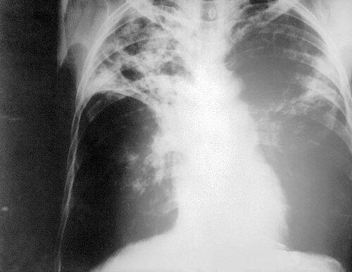

# TUBERCULOSE EXTRAPULMONAR, RESISTÊNCIA E ESQUEMAS ESPECIAIS

Para entender a tuberculose (TB) extrapulmonar, você precisa primeiro visualizar o caminho do *Mycobacterium tuberculosis*. Tudo começa no pulmão. Após a inalação, ocorre a formação do complexo primário (Foco de Ghon + linfonodopatia satélite). Na maioria das pessoas, o sistema imune contém o bacilo ali. Mas, em alguns casos — seja por uma carga bacilar imensa ou por falha na imunidade celular (HIV, uso de anti-TNF, corticoides) — o bacilo ganha a via linfática ou hematogênica.

É aqui que mora o perigo: a disseminação linfo-hematogênica. O bacilo pode se alojar em qualquer lugar, mas ele tem "preferências" por órgãos muito vascularizados ou com alta pressão de oxigênio. Por isso, vemos tanta TB em pleura, linfonodos, rins e ossos.

## Tuberculose Pleural: A Favorita das Bancas

A TB pleural é a forma extrapulmonar mais comum em pacientes imunocompetentes no Brasil. O que você precisa entender aqui é a fisiopatologia: a pleura não se infecta por "milhares de bacilos" chegando lá. Na verdade, ocorre a ruptura de um foco subpleural para o espaço pleural, gerando uma **reação de hipersensibilidade tardia**.

Por que isso importa? Porque, se a doença é uma reação inflamatória/imunológica e não uma "infecção maciça", haverá **pouquíssimos bacilos** no líquido pleural.

### Diagnóstico da TB Pleural

Esqueça a baciloscopia (BAAR) no líquido pleural; a sensibilidade é pífia (< 5%). O TRM-TB (Teste Rápido Molecular) também tem baixo rendimento aqui. O diagnóstico é feito pelo tripé:

- **Bioquímica e Citologia:** O líquido é um **exsudato**, com predomínio de **linfócitos** e, crucialmente, **ausência ou raridade de células mesoteliais**. Se houver muitas células mesoteliais, desconfie do diagnóstico de TB.

- **ADA (Adenosina Deaminase):** Valores acima de **40 U/L** em contexto clínico sugestivo têm alto valor preditivo positivo.

- **Biópsia Pleural (Padrão-Ouro):** Como o rendimento do líquido é baixo, precisamos do fragmento da pleura. A análise histopatológica buscando o **granuloma com necrose caseosa** tem sensibilidade superior a 80%.

**Dica de Prova:** Se a questão trouxer um paciente jovem, com dor pleurítica, febre, líquido pleural exsudativo linfocitário e ADA elevado, a conduta é iniciar o tratamento, mesmo sem ver o bacilo.

## Tuberculose Ganglionar: O Alvo do HIV e das Crianças

Enquanto a pleural lidera nos imunocompetentes, a TB ganglionar é a forma extrapulmonar mais frequente em pessoas vivendo com HIV (PVHIV) e em crianças.

O quadro típico é a linfadenopatia cervical, subclavicular ou mediastinal, geralmente **assimétrica**, de crescimento lento e indolor. Com o tempo, esses linfonodos podem sofrer liquefação e drenar espontaneamente (fistulização), o que chamamos de **escrófula**.

Diferente da pleural, aqui a punção por agulha fina (PAAF) ou a biópsia ganglionar têm bom rendimento para BAAR e cultura, pois a carga bacilar nos linfonodos costuma ser maior.

## Tuberculose do Sistema Nervoso Central (Meningoencefalite)

Esta é a forma mais grave. A base do cérebro é preenchida por um exsudato inflamatório que pode causar hidrocefalia e vasculites, levando a infartos cerebrais.

O líquor (LCR) da TB meníngea é clássico:

- Aspecto límpido ou levemente turvo (xantocrômico).

- Pleocitose linfocitária (10 a 500 células/mm³).

- **Glicose muito baixa (hipoglicorraquia).**

- **Proteína muito alta (hiperproteinorraquia).**

**Cuidado com o tratamento:** Na TB meníngea, o esquema RIPE é mantido por 2 meses, mas a fase de manutenção (RI) é estendida. Segundo o Ministério da Saúde, o tratamento total dura **12 meses**. Além disso, o uso de **corticoides** (Dexametasona ou Prednisona) nas primeiras 4 a 8 semanas é obrigatório para reduzir a inflamação e as sequelas neurológicas.

## Tuberculose Osteoarticular (Mal de Pott)

O local mais comum é a coluna vertebral (geralmente torácica baixa ou lombar). O bacilo destrói o disco intervertebral e os corpos vertebrais adjacentes.

- **Clínica:** Dor nas costas de início insidioso, que pode evoluir com deformidade (gibosidade) e compressão medular.

- **Imagem:** A ressonância magnética (RNM) é o melhor exame. Ver a destruição do disco e do corpo vertebral (osteólise) sugere doença ativa.

- **Tratamento:** Assim como na meníngea, o tempo total é de **12 meses**.

## Tuberculose Disseminada (Miliar)

Ocorre quando há uma descarga maciça de bacilos no sangue. O RX de tórax mostra o padrão clássico de "tempestade de areia" (micronódulos de 1-3 mm distribuídos difusamente).

Um achado patognomônico que as bancas amam: **Tubérculos corióideos** no exame de fundo de olho. Se a questão mencionar isso, não perca tempo: é TB miliar. Esses pacientes podem evoluir com insuficiência adrenal (por destruição das glândulas adrenais pelo bacilo), apresentando hipotensão, hiponatremia e hiperpigmentação.

## Resistência aos Fármacos: O Pesadelo Terapêutico

A resistência é um fenômeno biológico potencializado pela má adesão ao tratamento. Precisamos diferenciar os conceitos:

- **Monorresistência:** Resistência a apenas um fármaco (ex: só à Isoniazida).

- **Polirresistência:** Resistência a dois ou mais fármacos, *exceto* a combinação Rifampicina + Isoniazida.

- **Multirresistência (MDR):** Resistência a, pelo menos, **Rifampicina e Isoniazida**.

- **Resistência Extensa (XDR):** MDR + resistência a qualquer fluoroquinolona + resistência a pelo menos um fármaco do Grupo A (Bedaquilina ou Linezolida).

### O Papel do TRM-TB (GeneXpert)

O Teste Rápido Molecular revolucionou o diagnóstico. Em 2 horas, ele detecta o DNA do complexo *M. tuberculosis* e a **resistência à Rifampicina**.

**Pegadinha de Prova:** Se o TRM-TB indicar "Resistência à Rifampicina detectada", o que fazer?

- Solicitar Cultura e Teste de Sensibilidade (TS) imediatamente.

- Encaminhar o paciente para uma unidade de referência.

- Iniciar o esquema para TB resistente (geralmente envolvendo quinolonas e outros fármacos de segunda linha, como a Terizidona).

Lembre-se: a Rifampicina é o fármaco mais potente. Perder a Rifampicina significa que o tratamento passará de 6 meses para 18-24 meses. Como dizemos na MedEvo, a Rifampicina é a "âncora" do tratamento.

## Esquemas Especiais e Manejo de Efeitos Adversos

O esquema básico no Brasil é o **RIPE (Rifampicina, Isoniazida, Pirazinamida e Etambutol)**.

- **Fase Intensiva (2 meses):** RIPE.

- **Fase de Manutenção (4 meses):** RI.

- *Exceção:* Meníngea e Osteoarticular (2 meses RIPE + 10 meses RI).

### 1. Hepatotoxicidade: A Reação mais Temida

Todos os fármacos do esquema RIPE, exceto o Etambutol, são hepatotóxicos. A **Pirazinamida** é a campeã de toxicidade.

**Quando suspender o RIPE?**

- Icterícia (critério clínico).

- Elevação de TGO/TGP ≥ 3x o limite superior do normal (LSN) **com sintomas** (náuseas, vômitos, dor abdominal).

- Elevação de TGO/TGP ≥ 5x o LSN **mesmo se assintomático**.

**Como reintroduzir?**
Após a normalização das enzimas (ou queda para < 2x LSN), reintroduzimos um a um, com intervalos de 3 a 7 dias, na ordem do menos para o mais tóxico:

- Rifampicina + Etambutol (espera e vê se as enzimas sobem).

- Isoniazida.

- Pirazinamida (por último, e muitas vezes nem é reintroduzida se a lesão foi grave).

### 2. Coinfecção TB-HIV

Aqui o desafio é a interação medicamentosa. A Rifampicina é um potente indutor do citocromo P450, o que reduz drasticamente os níveis de vários antirretrovirais.

- **Dolutegravir (DTG):** É o esquema padrão no Brasil. Se o paciente usa Rifampicina, a dose do DTG deve ser aumentada para **50mg de 12/12h** (em vez de uma vez ao dia).

- **Inibidores de Protease (ex: Atazanavir):** São contraindicados com Rifampicina. Nesses casos, substitui-se a Rifampicina por **Rifabutina**.

- **Quando iniciar a TARV?** Se o paciente não está em tratamento para HIV, iniciamos o RIPE primeiro. A TARV deve ser iniciada **2 a 8 semanas** depois. Por que não no mesmo dia? Para evitar a **Síndrome Inflamatória de Reconstituição Imune (IRIS)**, onde o sistema imune "acorda" e ataca violentamente os bacilos, piorando os sintomas. Se o CD4 for < 50, a TARV pode ser antecipada para as primeiras 2 semanas.

### 3. Gestantes

O esquema RIPE pode ser usado com segurança. A única recomendação crucial é a administração de **Vitamina B6 (Piridoxina)** para a gestante, a fim de evitar toxicidade neurológica no feto e neuropatia periférica na mãe (causada pela Isoniazida).

### 4. Nefropatas

A Rifampicina e a Isoniazida são de excreção predominantemente biliar, então não precisam de ajuste. Já a **Pirazinamida e o Etambutol** precisam de ajuste de dose (geralmente espaçamento para 3x por semana) se o ClCr for < 30 ml/min.

## Infecção Latente por Tuberculose (ILTB)

Tratar a ILTB é tratar o "reservatório". O objetivo é impedir que o bacilo dormente acorde.

### Quem rastrear?

Não rastreamos todo mundo. Focamos em grupos de alto risco:

- Contatos domiciliares de TB bacilífera.

- Imunossuprimidos (HIV, pré-transplante, usuários de anti-TNF ou corticoides > 15mg/dia por > 1 mês).

- Alterações radiológicas fibróticas (cicatriz de TB nunca tratada).

- Profissionais da saúde devem ser pesquisados em busca de infecção latente com PPD anual e devem ser tratados se aumento de PPD > 10mm em 1 ano.

### Como diagnosticar?

Usamos a **Prova Tuberculínica (PPD/PT)** ou o **IGRA** (ensaio de liberação de interferon-gama).

- **PPD ≥ 5 mm:** Positivo para imunossuprimidos, crianças contatos ou pessoas com alterações no RX.

- **PPD ≥ 10 mm:** Positivo para os demais grupos de risco (profissionais de saúde, sistema prisional).

**Atenção:** Se o PPD for positivo, o próximo passo **obrigatório** é fazer um RX de tórax e perguntar por sintomas. Se o RX for normal e o paciente estiver assintomático, tratamos ILTB. Se o RX for alterado ou houver sintomas, investigamos TB ativa. **Nunca trate ILTB sem excluir TB ativa**, ou você criará resistência!

### Esquemas de Tratamento da ILTB (Atualizado MS)

- **Isoniazida (H):** 270 doses (9 meses). Clássico, mas longo.

- **Rifampicina (R):** 120 doses (4 meses). Excelente para idosos (> 50 anos) ou pessoas com hepatopatia leve, pois é menos hepatotóxica que a Isoniazida.

- **Rifapentina + Isoniazida (3HP):** Uma vez por semana por 3 meses (12 doses). É a tendência atual pela alta adesão.

## Tabela Comparativa: Formas Extrapulmonares

| Forma | Principal Achado Diagnóstico | Particularidade Terapêutica |
| --- | --- | --- |
| **Pleural** | ADA > 40 + Exsudato Linfocitário | Biópsia pleural é o padrão-ouro |
| **Ganglionar** | PAAF ou Biópsia (BAAR/Cultura) | Comum em HIV e crianças; pode fistulizar |
| **Meníngea** | LCR: Glicose baixa, Proteína alta | 12 meses de tratamento + Corticoide |
| **Osteoarticular** | RNM: Destruição de disco e vértebra | 12 meses de tratamento (Mal de Pott) |
| **Geniturinária** | Piúria estéril (leucocitúria sem germe comum) | Diagnóstico por cultura de urina (3-6 amostras) |

## Pontos-Chave para Prova 💡

- **TB Pleural:** O líquido é um exsudato linfocitário com ADA elevado e **raridade de células mesoteliais**.

- **Mal de Pott:** Acomete a coluna vertebral; o tratamento dura **12 meses**.

- **TB Meníngea:** O uso de **corticoide** é mandatório na fase inicial para reduzir sequelas.

- **Hepatotoxicidade:** Suspender RIPE se TGO/TGP ≥ 5x (assintomático) ou ≥ 3x (com sintomas/icterícia).

- **Reintrodução do RIPE:** Ordem: RE -> H -> P. A Pirazinamida é a mais hepatotóxica.

- **HIV e Rifampicina:** Se usar Dolutegravir, dobrar a dose do DTG (50mg 12/12h).

- **TARV no HIV:** Iniciar 2-8 semanas após o início do RIPE para evitar a síndrome de reconstituição imune (IRIS).

- **Vitamina B6 (Piridoxina):** Deve ser usada com Isoniazida em gestantes, etilistas e desnutridos para prevenir neuropatia periférica.

- **Etambutol:** O principal efeito colateral é a **neurite óptica** (alteração de acuidade e cores). Não usar em crianças pequenas que não conseguem colaborar com o exame de visão.

- **TRM-TB:** Detecta TB e resistência à Rifampicina. Se resistente, pedir cultura/TS e mudar para esquema de TB-DR.

- **ILTB em Imunossuprimidos:** O corte do PPD é **≥ 5 mm**.

- **Tubérculos Corióideos:** Achado patognomônico de TB Miliar no fundo de olho.

- **Insuficiência Adrenal:** Pode ser causada por TB disseminada (destruição da glândula).

- **O que NÃO fazer:** Nunca iniciar tratamento de ILTB sem antes realizar um RX de tórax para excluir doença ativa.

- **Paucibacilar:** Crianças e pacientes com TB extrapulmonar costumam ter poucos bacilos nos exames diretos; o diagnóstico muitas vezes é clínico-epidemiológico.

Como o Dr. Will sempre reforça nas discussões da MedEvo, a tuberculose é a "grande simuladora". Na dúvida, se o quadro é arrastado, tem febre vespertina e o paciente tem algum grau de imunossupressão, TB deve estar no topo do seu diferencial.

 Cópia offline para consulta pessoal.
 Fonte original:
 [https://www.medevo.com.br/material-apoio/ler/f1038c06-3fd3-473c-b810-1565616423ee](https://www.medevo.com.br/material-apoio/ler/f1038c06-3fd3-473c-b810-1565616423ee)
