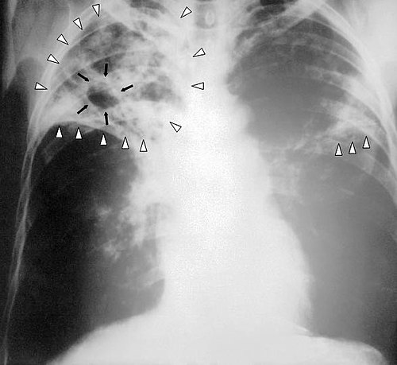

# TUBERCULOSE PEDIÁTRICA

A tuberculose (TB) na infância não é apenas uma versão “menor” da TB do adulto. Se você tentar aplicar a mesma lógica diagnóstica — baciloscopia positiva, escarro espontâneo fácil e caverna apical clássica — vai errar muitas questões e também muitos diagnósticos reais.

Na criança, a doença é geralmente **paucibacilar**: há poucos bacilos, menor chance de baciloscopia positiva, dificuldade de obtenção de escarro e apresentação radiológica frequentemente dominada por **complexo primário**, linfonodomegalia hilar/mediastinal, atelectasia ou infiltrados persistentes. Por isso, no Brasil, o diagnóstico de TB pulmonar pediátrica pode ser feito por um **sistema de pontuação clínico-radiológico-epidemiológico**, sem exigir confirmação bacteriológica.

> **Ideia central de prova:** criança com TB costuma ser um **evento sentinela**. Ela geralmente indica transmissão recente por um adulto ou adolescente bacilífero do convívio.

## 1) Por que a TB pediátrica é difícil?

A criança pequena costuma adoecer após infecção recente. O bacilo inalado chega aos alvéolos, é fagocitado por macrófagos e drena para linfonodos hilares/mediastinais. O que aparece no raio-X muitas vezes não é uma cavidade cheia de bacilos, mas uma combinação de:

- adenomegalia hilar ou mediastinal;

- infiltrado persistente;

- atelectasia por compressão brônquica;

- padrão miliar nas formas disseminadas;

- radiografia normal em alguns cenários, especialmente no início.

A confirmação microbiológica é desejável, mas frequentemente difícil. O Ministério da Saúde reconhece que, em crianças e adolescentes com baciloscopia negativa ou TRM-TB não detectado, o **sistema de pontuação** é uma ferramenta oficial para apoiar o diagnóstico da TB pulmonar.

### Grupos com maior risco de adoecimento e formas graves

- menores de 2 anos;

- recém-nascidos e lactentes expostos a contato bacilífero;

- crianças vivendo com HIV/aids;

- desnutrição;

- imunossupressão ou uso de imunobiológicos;

- contato domiciliar intenso com caso pulmonar/laríngeo bacilífero;

- ausência de BCG ou contraindicação à BCG;

- atraso diagnóstico.

## 2) Quadro clínico: a apresentação costuma ser insidiosa

Esqueça a imagem cinematográfica de tosse produtiva, hemoptise e cavitação. Na criança, os achados mais cobrados são:

- **Febre persistente**, muitas vezes vespertina, por 2 semanas ou mais.

- **Tosse crônica**, seca ou produtiva, especialmente se persistente.

- **Perda de peso, baixo ganho ponderal ou interrupção da curva de crescimento.**

- **Adinamia/hipoatividade:** a criança para de brincar, fica “murcha”.

- **Sudorese**, irritabilidade ou anorexia.

- **Contato com adulto/adolescente com TB pulmonar ou laríngea.**

### Pista clássica

Uma “pneumonia” que não melhora como esperado após antibiótico para germes comuns, ou cuja imagem permanece inalterada por 2 semanas ou mais, deve levantar suspeita de TB.

## 3) Sistema brasileiro de pontuação: o coração do report e da prova

O material anterior trazia o corte de tratamento de forma incorreta. O ponto de corte oficial do escore brasileiro **não é “≥30 pontos = tratar automaticamente”**.

Segundo o Manual de Recomendações para o Controle da Tuberculose no Brasil, o escore deve ser usado especialmente em crianças/adolescentes com suspeita de TB pulmonar, baciloscopia negativa ou TRM-TB não detectado, valorizando quadro clínico, radiografia, contato, prova tuberculínica e estado nutricional.

### Tabela oficial simplificada do escore

| Critério | Achado | Pontos |
| --- | --- | --- |
| **Clínico** | Febre ou sintomas como tosse, adinamia, expectoração, emagrecimento ou sudorese por **2 semanas ou mais** | **+15** |
| **Clínico** | Assintomático ou sintomas há menos de 2 semanas | **0** |
| **Clínico** | Infecção respiratória com melhora após antibiótico para germes comuns ou melhora espontânea | **−10** |
| **Radiografia de tórax** | Adenomegalia hilar ou padrão miliar; e/ou condensação/infiltrado, com ou sem escavação, inalterado por 2 semanas ou mais; e/ou condensação/infiltrado por 2 semanas ou mais com piora ou sem melhora com antibiótico | **+15** |
| **Radiografia de tórax** | Condensação ou infiltrado de qualquer tipo por menos de 2 semanas | **+5** |
| **Radiografia de tórax** | Radiografia normal | **−5** |
| **Contato com adulto com TB** | Contato próximo nos últimos 2 anos | **+10** |
| **Contato com adulto com TB** | Contato ocasional ou negativo | **0** |
| **Prova tuberculínica / PPD** | PT entre 5 e 9 mm | **+5** |
| **Prova tuberculínica / PPD** | PT ≥ 10 mm | **+10** |
| **Prova tuberculínica / PPD** | PT < 5 mm | **0** |
| **Estado nutricional** | Desnutrição grave / peso < percentil 10 | **+5** |
| **Estado nutricional** | Peso ≥ percentil 10 | **0** |

### Interpretação correta

| Pontuação total | Interpretação | Conduta sugerida |
| --- | --- | --- |
| **≥ 40 pontos** | Diagnóstico **muito provável** | Recomenda-se iniciar tratamento de TB. |
| **30 a 35 pontos** | Diagnóstico **possível** | Indicativo de TB; iniciar tratamento a critério médico, considerando contexto e risco. |
| **≤ 25 pontos** | Diagnóstico **pouco provável** | Prosseguir investigação, fazer diagnóstico diferencial e considerar exames complementares. |

> **Correção importante:** o escore de **30 a 35 pontos não é a faixa de “diagnóstico muito provável”**. Ela é “diagnóstico possível”. A faixa que recomenda tratamento como diagnóstico muito provável é **≥ 40 pontos**.

### Exemplo rápido

Criança com tosse/febre há 3 semanas (+15), adenomegalia hilar (+15), contato domiciliar com adulto bacilífero (+10), PT 8 mm (+5) e peso normal (0) soma **45 pontos**: TB muito provável → tratar.

Criança com sintomas persistentes (+15), contato próximo (+10), radiografia normal (−5), PT não reagente (0) e peso normal (0) soma **20 pontos**: TB pouco provável → investigar diferenciais e complementares.

## 4) Prova tuberculínica, IGRA e TRM-TB: não misture os papéis

### Prova tuberculínica / PPD

A PT/PPD não diferencia infecção latente de doença ativa. Ela mostra resposta imune ao bacilo. No escore pediátrico brasileiro, a pontuação formal usa:

- **5–9 mm:** +5 pontos;

- **≥10 mm:** +10 pontos;

- **<5 mm:** 0 ponto.

A BCG pode interferir na PT, principalmente quando recente, mas seu efeito tende a reduzir com o tempo, sobretudo quando aplicada no primeiro ano de vida, como ocorre na rotina brasileira.

### IGRA

O IGRA mede liberação de interferon-gama após estímulo por antígenos do *M. tuberculosis*. Tem boa especificidade e pode ser usado para investigação de infecção latente conforme protocolos do Ministério da Saúde, mas existem limitações:

- não diferencia ILTB de TB ativa;

- não é recomendado para crianças menores de 2 anos;

- resultados indeterminados podem ocorrer, especialmente em menores de 5 anos e imunossuprimidos;

- resultado **indeterminado deve ser repetido**, não automaticamente tratado como positivo para pontuação do escore.

> **Correção de segurança:** não use “IGRA indeterminado = positivo” como regra geral do escore. A fonte oficial do Manual descreve resultado indeterminado como indicação de repetir o teste.

### TRM-TB

Sempre que houver amostra viável — escarro induzido, lavado gástrico, aspirado/lavado broncoalveolar ou outro material conforme forma clínica — o TRM-TB deve ser considerado. Ele ajuda a detectar *M. tuberculosis* e resistência à rifampicina, mas a sensibilidade na criança é menor do que no adulto.

Em crianças, resultado com carga muito baixa/“traços” deve ser interpretado com cuidado e em conjunto com o quadro clínico, pois pode ter grande valor em população paucibacilar.

## 5) Exames complementares e imagem

*Figura 1 - Radiografia AP de tórax com tuberculose pulmonar bilateral avançada, infiltrados bilaterais e formação cavitária em ápice direito. É uma imagem didática de TB avançada, mais típica de adulto/adolescente do que da criança pequena paucibacilar. Fonte: CDC/PHIL, domínio público | Wikimedia Commons.*

### Radiografia de tórax

Na criança, valorize:

- adenomegalia hilar/mediastinal;

- compressão brônquica com atelectasia;

- infiltrado ou condensação persistente;

- padrão miliar;

- ausência de melhora radiológica após antibiótico para germes comuns.

Radiografia normal **não exclui** TB, mas no escore reduz 5 pontos. Se a suspeita clínica e epidemiológica for forte, prossiga investigação e reavaliação.

### Métodos microbiológicos

A confirmação bacteriológica deve ser buscada quando possível, sem deixar que a dificuldade de coleta paralise a conduta em criança com escore alto ou risco de forma grave.

Amostras possíveis:

- escarro espontâneo, se a criança conseguir;

- escarro induzido;

- lavado gástrico;

- aspirado/lavado broncoalveolar em contexto selecionado;

- material de linfonodo, líquor, líquido pleural ou biópsia conforme forma extrapulmonar.

## 6) Investigação de contatos e ILTB/TPT

ILTB é infecção pelo *M. tuberculosis* sem sinais de doença ativa. Em criança, especialmente menor de 5 anos, tratar ILTB é prevenção de formas graves.

### Fluxo mental para contato infantil

- Houve contato com TB pulmonar ou laríngea?

- A criança tem sintomas?

- Se sim: investigar TB doença, aplicar escore quando adequado e buscar confirmação quando possível.

- Está assintomática?

- Fazer avaliação clínica e radiografia de tórax.

- Radiografia alterada?

- Investigar TB doença.

- Radiografia normal?

- Avaliar PT/IGRA conforme idade, disponibilidade e protocolo.

- Se ILTB indicada: escolher TPT conforme idade, peso, apresentação disponível, HIV/ARV e contraindicações.

## 7) Tratamento preventivo / ILTB: esquemas atualizados

As Notas Informativas de 2024 atualizaram a prática, especialmente com comprimidos dispersíveis RH 75/50 mg para crianças menores de 10 anos.

### Tabela prática de TPT em criança

| Esquema | Quem pode usar / indicação prática | Duração / dose-chave |
| --- | --- | --- |
| **3RH** | Crianças **<10 anos**, 4 a <25 kg, especialmente quando não conseguem deglutir comprimidos; usa RH dispersível 75/50 mg. | **90 doses diárias**, em 3 a 5 meses. 4–7 kg: 1 cp/dia; 8–11 kg: 2 cp/dia; 12–15 kg: 3 cp/dia; 16–24 kg: 4 cp/dia. |
| **3HP** | Crianças a partir de 2 anos, quando elegíveis e capazes de usar rifapentina + isoniazida semanal, sem contraindicações/interações importantes. | **12 doses semanais** por 3 meses. Dose por faixa de peso conforme Nota/Protocolo. |
| **4R** | Rifampicina diária. Útil em menores de 10 anos, contato de monorresistência à isoniazida, intolerância à H e cenário de RN exposto conforme Nota 6/2024. | **120 doses** por 4 meses. Crianças <10 anos: rifampicina 15 mg/kg/dia, faixa 10–20 mg/kg/dia, máximo 600 mg/dia. |
| **6H ou 9H** | Alternativa quando não for possível usar rifampicina/rifapentina ou quando interações/contraindicações direcionarem para isoniazida. | Isoniazida diária, geralmente 5–10 mg/kg/dia, máximo 300 mg/dia; 180 doses em 6H ou 270 doses em 9H. |

### Interações que não podem ser esquecidas

Rifampicina e rifapentina interagem com antirretrovirais e vários outros fármacos. Nas notas oficiais:

- 3HP é contraindicado com inibidores de protease, nevirapina e TAF;

- 4R também tem restrições importantes com inibidores de protease, nevirapina e TAF;

- esquemas com rifamicinas podem exigir ajuste de dolutegravir ou raltegravir;

- em criança vivendo com HIV/aids, a escolha do TPT deve considerar o PCDT vigente e interações com ARV.

## 8) Recém-nascido exposto a mãe ou contato bacilífero

Esse é um ponto de prova com mudança prática recente.

### Cenário clássico

RN coabitante ou contato domiciliar de caso de TB pulmonar ou laríngea bacilífera/confirmada.

### Conduta atual mais cobrada

- **Não fazer BCG ao nascer** enquanto houver indicação de quimioprofilaxia primária.

- **Iniciar quimioprofilaxia primária**, preferencialmente **rifampicina por 4 meses (4R)** conforme Nota Informativa Nº 6/2024.

- Ao final dos 4 meses de rifampicina, **vacinar com BCG**.

- Com esse fluxo de 4R, **não há necessidade de PPD ao final**.

### Se o RN foi vacinado inadvertidamente

Se a BCG foi aplicada antes de iniciar a profilaxia, manter rifampicina por 4 meses. Ao final, avaliar individualmente necessidade de revacinar se não houver pega vacinal/cicatriz, pois a rifampicina pode interferir na resposta imune aos bacilos da BCG.

### Alternativas no algoritmo

A Nota Informativa Nº 15/2024 descreve possibilidades como isoniazida por 3 meses, rifampicina por 4 meses ou RH por 3 meses na quimioprofilaxia primária; e, se tratado como ILTB no RN, isoniazida por 6 meses, rifampicina por 4 meses ou RH por 3 meses. Para prova, a resposta mais alinhada à atualização da Nota 6/2024 é: **adiar BCG + 4R preferencial + BCG ao fim, sem PPD posterior**.

## 9) Tratamento da TB doença em crianças e adolescentes

O Brasil atualizou o tratamento da TB pulmonar sensível **não grave** em crianças e adolescentes com esquema encurtado de 4 meses, conforme Nota Informativa Nº 5/2024.

### Esquemas por idade e gravidade

| Grupo | TB pulmonar não grave | TB pulmonar grave |
| --- | --- | --- |
| **≤3 meses ou <4 kg** | Não usar esquema encurtado; usar RHZ em doses individualizadas e seguir referência. | Não usar esquema encurtado; tratar como grave/individualizado. |
| **>3 meses a <10 anos** | **2RHZ/2RH** = 4 meses. | **2RHZ/4RH** = 6 meses. |
| **≥10 anos a <16 anos** | **2RHZE/2RH** = 4 meses. | **2RHZE/4RH** = 6 meses. |

### O que é TB pulmonar não grave?

A Nota Informativa Nº 5/2024 define como não grave, de forma prática:

- TB pulmonar com linfonodos periféricos;

- TB intratorácica sem obstrução de vias aéreas;

- doença paucibacilar não cavitária confinada a um lobo e sem padrão miliar;

- TB pleural não complicada;

- sintomas leves, sem necessidade de internação;

- ausência de suspeita de TB drogarresistente;

- bacteriologia compatível com baixa carga: TRM-TB não detectado ou MTB detectado com traços/very low/low, ou baciloscopia negativa, conforme cenário.

### Quando NÃO usar o encurtado de 4 meses

Não use o encurtado se houver:

- idade ≤3 meses ou peso <4 kg;

- TB pulmonar grave;

- padrão miliar;

- cavitação extensa;

- obstrução de vias aéreas;

- necessidade de internação;

- suspeita ou confirmação de resistência;

- doença extrapulmonar grave;

- TB meníngea;

- TB osteoarticular;

- evolução clínica desfavorável.

Se o esquema encurtado não evoluir satisfatoriamente, pode-se estender a fase de manutenção e usar o esquema de 6 meses.

## 10) Doses do tratamento de TB doença em menores de 10 anos

Para crianças menores de 10 anos, o esquema básico sem etambutol usa RHZ. Doses usuais:

| Fármaco | Dose diária recomendada | Faixa de variação |
| --- | --- | --- |
| **Rifampicina (R)** | 15 mg/kg/dia | 10–20 mg/kg/dia |
| **Isoniazida (H)** | 10 mg/kg/dia | 7–15 mg/kg/dia |
| **Pirazinamida (Z)** | 35 mg/kg/dia | 30–40 mg/kg/dia |

O etambutol entra de rotina nas apresentações de dose fixa combinada a partir dos **10 anos**. Em menores de 10 anos, situações especiais, suspeita de resistência ou coinfecções complexas devem ser individualizadas em serviço de referência.

## 11) Formas graves e extrapulmonares

### TB miliar

Sugira TB miliar em criança com:

- febre persistente;

- perda ponderal;

- hepatoesplenomegalia;

- sintomas respiratórios variáveis;

- padrão micronodular difuso no raio-X;

- idade pequena ou imunossupressão.

É forma grave e não deve receber esquema encurtado.

### TB meníngea

Sinais de alerta:

- cefaleia, vômitos, irritabilidade;

- sonolência, convulsões ou alteração de consciência;

- rigidez de nuca pode faltar em lactentes;

- história de contato e sintomas sistêmicos.

Tratamento é prolongado, em geral **12 meses**, e a corticoterapia é indicada para reduzir inflamação e sequelas. A conduta deve ser feita com referência/infectologia/neurologia pediátrica quando possível.

### TB osteoarticular

Pense em TB se houver dor óssea/articular crônica, limitação funcional, edema, deformidade, sintomas sistêmicos ou contato epidemiológico. Também costuma exigir tratamento prolongado e investigação dirigida.

## 12) Diagnóstico diferencial

| Cenário parecido | Como diferenciar |
| --- | --- |
| **Pneumonia bacteriana comum** | Curso mais agudo, febre alta, melhora clínica em 48–72 h com antibiótico adequado. |
| **Asma/atelectasia recorrente** | Sibilância, resposta a broncodilatador/corticoide, história atópica; investigar compressão por linfonodo se persistente. |
| **Linfoma** | Febre, perda de peso e adenomegalias podem confundir; imagem, exame físico, hemograma e biópsia quando indicado. |
| **Histoplasmose/paracoccidioidomicose** | Dependem de epidemiologia e achados sistêmicos; considerar em áreas endêmicas. |
| **Malformações pulmonares/cisto broncogênico** | Lesões fixas, sintomas menos sistêmicos; TC ajuda. |
| **Micobactérias não tuberculosas** | Adenite cervical crônica ou doença pulmonar em contexto específico; cultura/identificação são importantes. |

## 13) Checklist de prova e ambulatório

Diante de criança com suspeita de TB:

- Procurar contato bacilífero no domicílio ou escola.

- Avaliar sintomas por 2 semanas ou mais.

- Ver curva ponderal e estado nutricional.

- Solicitar raio-X de tórax.

- Aplicar escore se baciloscopia negativa/TRM-TB não detectado ou se confirmação for difícil.

- Buscar amostra para TRM/cultura quando possível.

- Diferenciar TB doença de ILTB.

- Se ILTB: escolher TPT por idade, peso, HIV/ARV e disponibilidade.

- Se RN exposto: adiar BCG, fazer profilaxia primária, vacinar depois.

- Se TB doença: escolher esquema por idade e gravidade; considerar encurtado apenas em TB pulmonar sensível não grave.

## 14) Pontos-chave para prova

- Criança com TB é **evento sentinela**: procure adulto/adolescente bacilífero.

- TB pediátrica é geralmente **paucibacilar**; baciloscopia negativa não exclui doença.

- O escore brasileiro foi corrigido: **≥40 pontos = muito provável/tratar**; **30–35 = possível/a critério médico**; **≤25 = pouco provável/investigar**.

- A tabela oficial pontua clínica, radiografia, contato, PT/PPD e estado nutricional.

- PT 5–9 mm vale +5; PT ≥10 mm vale +10.

- IGRA pode auxiliar na investigação de ILTB, mas resultado indeterminado deve ser repetido; não pontue automaticamente como positivo.

- Radiografia normal tira pontos, mas não exclui TB se o contexto for muito forte.

- RN contato de caso bacilífero: **adiar BCG + rifampicina 4 meses preferencial + BCG ao final; sem PPD posterior no fluxo da Nota 6/2024**.

- TPT infantil atualizado: 3RH dispersível para <10 anos 4–24 kg, 4R, 3HP quando elegível e 6H/9H em cenários específicos.

- Tratamento encurtado 2024: TB pulmonar sensível não grave pode receber **4 meses**: >3 meses a <10 anos = 2RHZ/2RH; ≥10 a <16 anos = 2RHZE/2RH.

- Não usar esquema encurtado em TB grave, miliar, meníngea, osteoarticular, cavitária extensa, obstrução de via aérea, internação, resistência ou evolução desfavorável.

## Fontes verificadas

- **Ministério da Saúde. Manual de Recomendações para o Controle da Tuberculose no Brasil, 2ª edição atualizada, 2019**: sistema de pontuação para diagnóstico de TB pulmonar em crianças/adolescentes; interpretação do escore; PT/IGRA; tratamento de ILTB no manual-base.

- **Nota Informativa Nº 6/2024-CGTM/DATHI/SVSA/MS**: disponibilização de comprimidos dispersíveis RH 75/50 mg; esquema 3RH em crianças menores de 10 anos; atualização do manejo do RN exposto com 4R preferencial, adiamento da BCG e vacinação após profilaxia.

- **Nota Informativa Nº 15/2024-CGTM/DATHI/SVSA/MS**: recomendações técnicas para ILTB/TPT, algoritmos de contatos infantis, esquemas 3HP, 4R, 3RH, 6H/9H e interações principais.

- **Nota Informativa Nº 5/2024-CGTM/DATHI/SVSA/MS**: implementação do tratamento encurtado da TB sensível não grave em crianças e adolescentes, com esquemas 2RHZ/2RH e 2RHZE/2RH conforme faixa etária.

- **Wikimedia Commons / CDC PHIL**: validação das imagens de radiografia de TB pulmonar avançada usadas no material.

 Cópia offline para consulta pessoal.
 Fonte original:
 [https://www.medevo.com.br/material-apoio/ler/f9ff72a3-65c0-4732-abd9-06e5d15c32c1](https://www.medevo.com.br/material-apoio/ler/f9ff72a3-65c0-4732-abd9-06e5d15c32c1)
