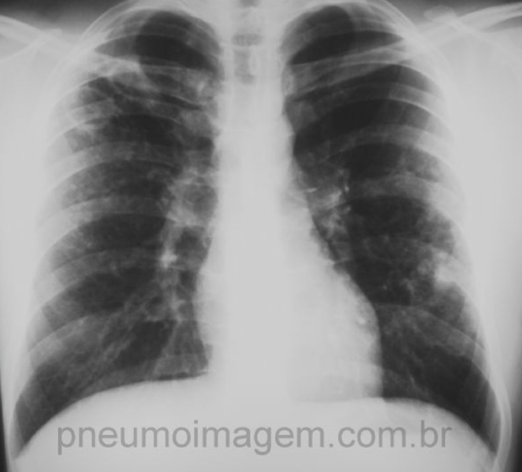
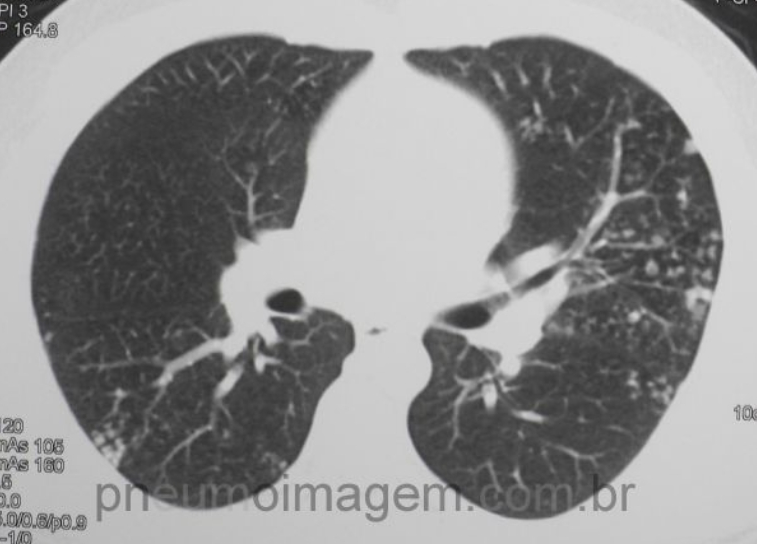
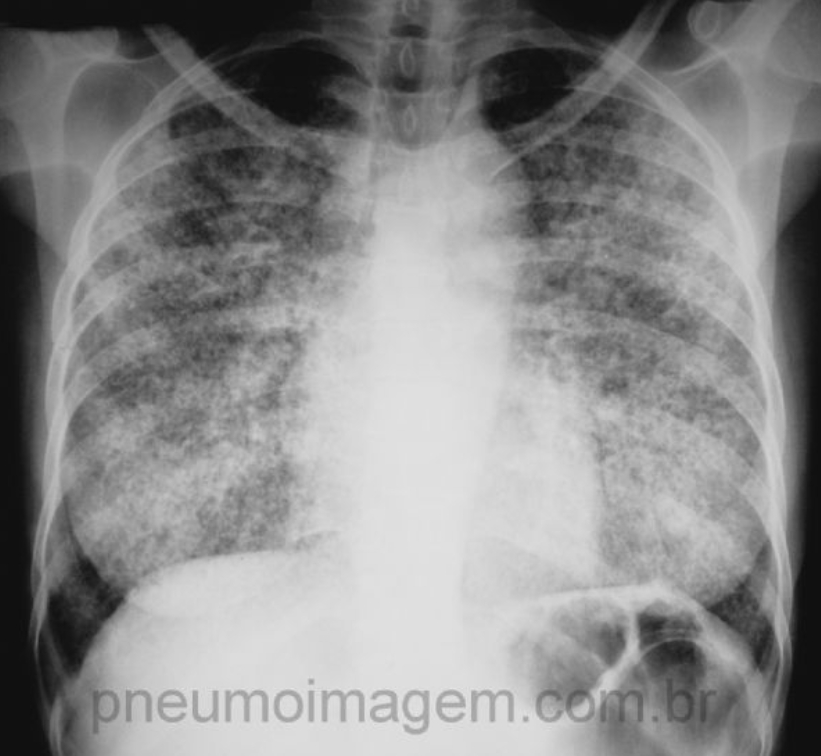

# TUBERCULOSE PULMONAR: DIAGNÓSTICO E TRATAMENTO INICIAL

Para entender a tuberculose (TB), você precisa parar de enxergá-la apenas como uma doença do pulmão e passar a vê-la como uma batalha de resistência entre o *Mycobacterium tuberculosis* (Bacilo de Koch - BK) e o sistema imune celular do hospedeiro. Nas provas de residência, o examinador não quer apenas que você saiba o nome dos remédios; ele quer saber se você sabe manejar o paciente que "foge" do padrão ou que apresenta efeitos colaterais.

## O Cenário Epidemiológico e o "Sintomático Respiratório"

No Brasil, a TB continua sendo uma emergência de saúde pública. Mas como identificar quem testar? Aqui entra o conceito fundamental de **Sintomático Respiratório (SR)**.

Na população geral, definimos como SR aquele indivíduo com **tosse por 3 semanas ou mais**. Guarde esse número. No entanto, o Ministério da Saúde (MS) orienta que, em populações vulneráveis ou em busca ativa hospitalar, esse prazo pode ser menor.

**Populações de maior risco (Busca Ativa):**

- **Pessoas vivendo com HIV (PVHIV), moradores de rua e indígenas:** Qualquer tempo de tosse ou presença de febre, sudorese noturna ou perda de peso.

- **Populações confinadas (presídios):** Tosse de qualquer duração.

- **Contatos de casos de TB:** Tosse de qualquer duração.

**Dica de Prova:** Se a questão trouxer um morador de rua ou um paciente com HIV, não espere as 3 semanas de tosse para pedir exames. Qualquer sintoma respiratório já autoriza a investigação.

## Fisiopatologia: Por que o pulmão e por que o ápice?

O BK é um aeróbio estrito. Ele ama oxigênio. Por isso, ele tem predileção pelos lobos superiores e pelos segmentos apicais dos lobos inferiores, onde a ventilação é maior em relação à perfusão (maior relação V/Q).

Quando o bacilo entra no organismo, ele é fagocitado por macrófagos alveolares. Se o macrófago não consegue destruí-lo, forma-se o **granuloma caseoso**. O granuloma é uma tentativa do corpo de "enclausurar" o inimigo.

- **Imunidade Celular:** É a protagonista aqui. Por isso, pacientes com deficiência de linfócitos T CD4 (como no HIV ou em uso de anti-TNF como o Infliximabe) não conseguem manter o granuloma fechado, levando à disseminação da doença.

- **Complexo de Ghon:** É a combinação do foco pulmonar primário com a linfadenopatia hilar. Se isso calcifica, chamamos de Complexo de Ranke.

## Quadro Clínico: O Clássico e o Atípico

O quadro clássico você já conhece: tosse crônica (seca ou produtiva), febre vespertina (aquela que sobe no fim do dia, mas não é muito alta), sudorese noturna e emagrecimento.

**Cenário Clínico 1:** Imagine um paciente de 45 anos, tabagista, com tosse há 1 mês e hemoptise. No RX, há uma cavidade no lobo superior direito.

- **O que pensar?** TB é a primeira hipótese, mas em um tabagista dessa idade, o câncer de pulmão é um diagnóstico diferencial obrigatório. A "hemoptise de repetição" pode ocorrer tanto na TB ativa quanto em sequelas (bronquiectasias ou o famoso "sinal do sino" da aspergilose em cavidade antiga).

**Manifestações Atípicas e Extrapulmonares:**

- **Eritema Nodoso:** Aquelas lesões nodulares, dolorosas e avermelhadas nas canelas. É uma reação de hipersensibilidade. Pode aparecer na TB, mas também na Sarcoidose.

- **Derrame Pleural:** Comum na TB primária do jovem. O líquido é um **exsudato** (Critérios de Light: relação proteína pleural/sérica > 0,5 ou LDH pleural/sérico > 0,6). O diferencial aqui é o **predomínio linfocitário**, a **ausência de células mesoteliais** e o **ADA (Adenosina Deaminase) elevado** (geralmente > 40 U/L).

## O Caminho do Diagnóstico Etiológico

Aqui é onde a maioria dos alunos erra por não seguir a hierarquia atualizada do Ministério da Saúde.

### 1. Teste Rápido Molecular (TRM-TB / GeneXpert)

É o padrão-ouro inicial.

- **Vantagens:** Resultado em 2 horas, detecta o DNA do bacilo e, o mais importante, já diz se há **resistência à Rifampicina**.

- **Indicação:** Deve ser o primeiro exame para todo caso novo.

### 2. Baciloscopia (BAAR)

A pesquisa de Bacilos Álcool-Ácido Resistentes (BAAR) pelo método de Ziehl-Neelsen ainda é muito usada onde não há TRM-TB.

- **Cuidado:** Uma baciloscopia negativa **não exclui** TB. Pacientes com HIV, por terem menos cavitações (onde os bacilos se proliferam), costumam ter baciloscopia negativa com mais frequência.

- **Baciloscopia de Controle:** É usada para acompanhar o tratamento (mensalmente), não o TRM-TB (que pode continuar positivo por restos de DNA morto).

### 3. Cultura para Micobactéria

É o exame mais sensível.

- **Quando pedir?** Sempre que houver suspeita de resistência, em pacientes com tratamento prévio, em populações vulneráveis ou se o TRM-TB/Baciloscopia forem negativos mas a suspeita clínica for alta.

- **Meios:** Sólidos (Löwenstein-Jensen - mais barato, demora 30-45 dias) ou Líquidos (MGIT - mais rápido, 10-15 dias).

### 4. PPD (Prova Tuberculínica)

O PPD avalia **infecção**, não doença ativa.

- **Leitura:** 48 a 72 horas após a aplicação.

- **Interpretação:** No Brasil, consideramos reator um PPD ≥ 5mm (em qualquer paciente).

- **Erro comum:** Achar que PPD positivo significa que tem que tratar TB. Não! Significa que o paciente teve contato (Infecção Latente). Só tratamos TB ativa se houver sintomas ou alterações radiológicas.

## Diagnóstico por Imagem: A Anatomia da Doença

O Raio-X de tórax é o exame de triagem. Como dizemos no MedEvo, "o RX não dá o nome do bicho, mas dá o endereço da inflamação".

- **TB Pós-Primária (Reativação):** É mais comum em adolescentes e adultos. O padrão clássico é a **cavitação** em lobos superiores. Pode haver disseminação broncogênica, gerando o aspecto de "árvore em brotamento" na Tomografia de Alta Resolução (TCAR). Sua principal complicação é a aspergilose, cujo padrão radiológico em pacientes com TB é o denominado sinal da "lua cheia".

- **TB Primária:** Mais comum em crianças. Pode apresentar-se como uma pneumonia que não melhora e/ou não responsiva à antibiocoterapia, linfonodomegalia hilar ou derrame pleural. A radiografia de tórax apresenta, classicamente, uma adenopatia hilar unilateral. Sua complicação mais comum é a tuberculose miliar.

- **TB Miliar:** Disseminação hematogênica. O RX mostra um padrão de "tempestade de areia" (micronódulos difusos). É uma forma grave, comum em imunossuprimidos e crianças não vacinadas com BCG.

**Tabela 1: Diagnóstico Diferencial Radiológico e Clínico**

| Patologia | Achado Radiológico Típico | Diferencial Clínico |
| --- | --- | --- |
| **Tuberculose** | Cavitação em ápices, árvore em brotamento | Febre vespertina, sudorese noturna |
| **Câncer de Pulmão** | Massa espiculada, cavidade de parede grossa | Tabagismo, perda de peso acentuada, > 50 anos |
| **Paracoccidioidomicose** | Infiltrado em "asa de borboleta" | Trabalhador rural, lesões em mucosa oral |
| **Sarcoidose** | Adenopatia hilar bilateral e simétrica | Eritema nodoso, granuloma não caseoso na biópsia |
| **Aspergiloma** | Conteúdo móvel dentro de cavidade antiga | Hemoptise volumosa, BAAR negativo |

## Tratamento Farmacológico: O Esquema RIPE

O tratamento da TB no Brasil é padronizado e deve ser feito, preferencialmente, via **TDO (Tratamento Diretamente Observado)** na Unidade Básica de Saúde.

O esquema básico para adultos (casos novos ou reintrodução após abandono) é o **2RHZE / 4RH**.

### Fase Intensiva (2 meses): R + H + Z + E

Objetivo: Matar os bacilos de replicação rápida e negativar o escarro.

- **Rifampicina (R):** Inibidor da RNA-polimerase. É a droga mais potente.

- **Isoniazida (H):** Inibe a síntese de ácidos micólicos da parede celular.

- **Pirazinamida (Z):** Atua em ambiente ácido (dentro dos macrófagos).

- **Etambutol (E):** Bacteriostático que impede a resistência às outras drogas.

### Fase de Manutenção (4 meses): R + H

Objetivo: Eliminar os bacilos latentes ("persistentes") e evitar a recidiva.

**Doses (Comprimido de Dose Fixa Combinada - 4 em 1):**
Para adultos entre 36-50kg: 3 comprimidos/dia.
Para adultos entre 51-70kg: 4 comprimidos/dia.
Para adultos > 70kg: 5 comprimidos/dia.

**Tabela 2: Resumo do Esquema Terapêutico (MS Brasil)**

| Situação | Esquema | Duração Total |
| --- | --- | --- |
| **Caso Novo (Adulto/Adolescente)** | 2 RHZE + 4 RH | 6 meses |
| **Meningoencefalite / Osteoarticular** | 2 RHZE + 10 RH | 12 meses |
| **Crianças (< 10 anos)** | 2 RHZ + 4 RH | 6 meses (Etambutol é evitado pelo risco de neurite óptica) |

**Por que usamos 4 drogas?** Para evitar a seleção de mutantes resistentes. Se você usa apenas uma droga, o BK aprende a driblá-la rapidamente.

## Manejo de Efeitos Adversos: Onde a Prova te Pega

Este é o tópico favorito das bancas. Você precisa saber qual droga causa o quê e quando parar o tratamento.

- **Hepatotoxicidade (R, H, Z):** As três são hepatotóxicas. A Pirazinamida é a mais tóxica, seguida pela Isoniazida.

- *Conduta:* Se as transaminases (AST/ALT) subirem > 3x o valor normal com sintomas (náuseas, icterícia) ou > 5x sem sintomas, **suspenda tudo**. Após a normalização, reintroduza uma por uma (R + E, depois H, depois Z).

- **Rifampicina:** Causa suor e urina alaranjados (avise o paciente!). Pode causar síndrome gripal e nefrite intersticial.

- **Isoniazida:** Causa **Neuropatia Periférica**.

- *Por que?* Ela interfere no metabolismo da Vitamina B6 (Piridoxina).

- *Prevenção:* Prescrever Piridoxina para gestantes, etilistas ou diabéticos em uso de H.

- **Pirazinamida:** Hiperuricemia (pode deflagrar crise de Gota).

- **Etambutol:** **Neurite Óptica**. O paciente para de enxergar o verde/vermelho. É por isso que não usamos em crianças pequenas que não conseguem relatar alteração visual.

**Manejo Gastrointestinal:** Se o paciente tem apenas náuseas leves, não suspenda. Oriente tomar a medicação com uma refeição leve ou mude o horário. O Dr. Will sempre lembra: "Não se suspende tratamento de TB por queixas menores; a resistência é um problema muito maior".

## Situações Especiais

### Coinfecção TB-HIV

Todo paciente com TB deve testar para HIV e vice-versa.

- **Prioridade:** Tratar a TB primeiro.

- **Início da TARV (Terapia Antirretroviral):** Geralmente após 2 a 8 semanas do início do RIPE, para evitar a **SÍRIS** (Síndrome Inflamatória de Reconstituição Imune), onde o sistema imune acorda e "ataca" a TB de forma exagerada.

### Gestantes

O esquema RIPE é seguro na gestação. Deve-se apenas adicionar Piridoxina (B6) para evitar toxicidade neurológica no feto e na mãe devido à Isoniazida.

### Tuberculose Pleural

Diferente da pulmonar, a pleural muitas vezes tem BAAR negativo no escarro e no líquido pleural (baixa carga bacilar). O diagnóstico costuma ser por biópsia pleural (presença de granuloma caseoso) ou pelo ADA elevado. **Importante:** TB pleural isolada não transmite a doença (não precisa de isolamento).

## Investigação de Contatos e Infecção Latente (ILTB)

Se você diagnostica um caso de TB, você deve investigar quem mora com ele.

- **Sintomáticos:** Investigar TB ativa (RX + TRM-TB).

- **Assintomáticos:**

- Fazer PPD ou IGRA (exame de sangue).

- Se PPD ≥ 5mm (ou IGRA positivo) + RX de tórax normal = **Infecção Latente**.

- **Tratamento da ILTB:** O padrão atual é a **Isoniazida (270 doses)** por 6 a 9 meses ou **Rifampicina (120 doses)** por 4 meses (muito usada em > 50 anos ou hepatopatas). Recentemente, o esquema de **Isoniazida + Rifapentina (3HP)** uma vez por semana por 3 meses tem ganhado força.

**Cenário Clínico 2:** Criança de 4 anos, contato de pai com TB bacilífera. Criança está assintomática e tem PPD de 2mm. O que fazer?

- **Resposta:** Repetir o PPD em 8 semanas. Se houver conversão (aumento de 10mm ou mais), tratamos a ILTB. Se continuar negativo, paramos a investigação.

## Critérios de Falha Terapêutica

Consideramos que o tratamento falhou se:

- Baciloscopia continuar positiva ao final do tratamento.

- Baciloscopia fortemente positiva (+++) até o 4º mês.

- Baciloscopia que negativou e voltou a positivar por 2 meses consecutivos.

Nesses casos, suspeite de **TB Resistente** e solicite cultura com teste de sensibilidade e encaminhe para o especialista (unidade de referência secundária).

## Pontos-Chave para Prova

- **Sintomático Respiratório:** Tosse ≥ 3 semanas na população geral; qualquer tempo em grupos de risco (HIV, moradores de rua, presidiários).

- **Diagnóstico Inicial:** Teste Rápido Molecular (TRM-TB) é a primeira escolha. Ele detecta resistência à Rifampicina.

- **Esquema RIPE:** 2 meses de RHZE + 4 meses de RH.

- **Etambutol em Crianças:** Geralmente não se usa abaixo de 10 anos pelo risco de neurite óptica (dificuldade de monitorar campo visual).

- **Hepatotoxicidade:** Se TGO/TGP > 3x com sintomas ou > 5x sem sintomas, suspenda o RIPE imediatamente.

- **Neuropatia por Isoniazida:** Prevenida com Piridoxina (Vitamina B6).

- **Derrame Pleural na TB:** Exsudato, predomínio de linfócitos, ADA > 40, ausência de células mesoteliais.

- **PPD Reator:** No Brasil, ≥ 5mm é considerado positivo para investigação de Infecção Latente.

- **Isolamento:** Pacientes com TB pulmonar bacilífera devem ficar em isolamento respiratório (máscara N95 para o profissional, máscara cirúrgica para o paciente) até pelo menos 15 dias de tratamento efetivo.

- **BCG:** Protege contra formas graves (Miliar e Meníngea), mas não impede a infecção ou a forma pulmonar no adulto.

- **Sarcoidose vs. TB:** Sarcoidose tem granuloma **não caseoso** e adenopatia hilar bilateral simétrica. TB tem granuloma **caseoso**.

- **HIV e TB:** Sempre testar HIV em quem tem TB. Se CD4 baixo, tratar TB primeiro e TARV 2-8 semanas depois.

- **Baciloscopia de Controle:** Deve ser feita mensalmente durante o tratamento para avaliar a resposta.

- **O que NÃO fazer:** Nunca inicie tratamento de TB apenas com PPD positivo se o RX for normal e o paciente estiver assintomático. Isso é Infecção Latente, não doença ativa.

- **Pegadinha de Prova:** A alternativa dirá que o TRM-TB serve para controle de cura. **Falso.** O TRM-TB detecta DNA, que pode estar morto. Controle de cura é com Baciloscopia. 💡

 Cópia offline para consulta pessoal.
 Fonte original:
 [https://www.medevo.com.br/material-apoio/ler/0653b34d-858e-4624-9b6b-c7c69c33c1af](https://www.medevo.com.br/material-apoio/ler/0653b34d-858e-4624-9b6b-c7c69c33c1af)
