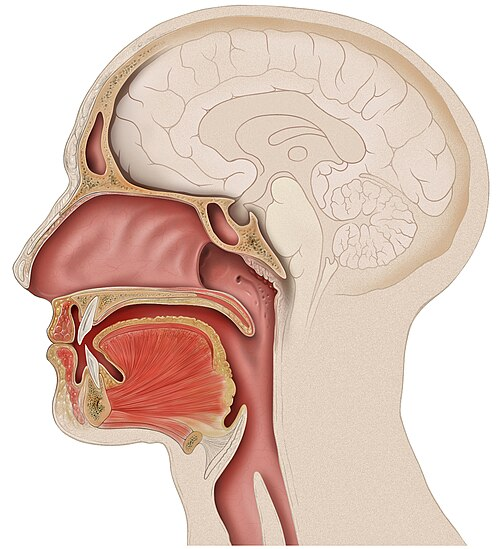
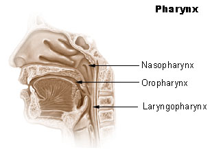

# TUMORES DE CABEÇA E PESCOÇO

Para entender os tumores de cabeça e pescoço, você precisa primeiro organizar a anatomia na sua mente. Não adianta decorar nomes de músculos se você não entender que essa região é um "condomínio" apertado: qualquer crescimento tumoral aqui vai comprimir estruturas vitais, afetar a fala, a deglutição ou a respiração. Nas provas de residência, o examinador quer saber se você reconhece o sinal de alerta precoce e se conhece as complicações das intervenções cirúrgicas.

## Epidemiologia e Fatores de Risco: O Perfil do Paciente

Quando falamos de neoplasias malignas de cabeça e pescoço, o "rei" absoluto é o **Carcinoma Espinocelular (CEC)**, também chamado de epidermoide ou escamocelular. Ele representa mais de 90% dos casos.

O perfil clássico que você vai encontrar na prova é o homem, acima dos 50 anos, tabagista e etilista crônico. O álcool e o tabaco não apenas somam riscos, eles são sinérgicos. Mas cuidado: as bancas estão cobrando cada vez mais as "exceções" que viraram regra.

### O Novo Perfil: HPV e EBV

Hoje, temos dois vírus que mudaram a epidemiologia:

- **HPV (especialmente subtipos 16 e 18):** Relacionado ao câncer de **orofaringe** (base da língua e amígdalas). O paciente típico é mais jovem, muitas vezes não fumante, e o prognóstico costuma ser melhor do que o do fumante. Na imunoistoquímica, o marcador **p16** é o substituto para o HPV; se p16 é positivo, o tumor é relacionado ao vírus.

- **Vírus Epstein-Barr (EBV):** Este é o fator etiológico clássico do **Carcinoma Nasofaríngeo**. Lembre-se: se a questão citar um paciente de ascendência asiática com massa cervical e obstrução nasal, pense em EBV e nasofaringe.

**Dica de Prova:** O H. pylori, tão comum na patologia gástrica, NÃO é fator de risco para câncer de cabeça e pescoço. Não caia nessa pegadinha.

## Cavidade Oral: Onde o Exame Físico é Soberano

A cavidade oral vai dos lábios até o istmo das fauces (o "v" palatoglosso). O local mais comum de CEC oral é a **borda lateral da língua**, seguido pelo assoalho da boca.

### Carcinoma de Lábio

Aqui temos uma distinção anatômica importante para a prova:

- **Lábio Inferior:** É o local mais frequente de CEC labial, muito associado à exposição solar crônica (queilite actínica é a lesão precursora).

- **Lábio Superior:** Menos comum, mas aqui o **Carcinoma Basocelular (CBC)** ganha relevância.

**Exemplo Clínico:** Paciente idoso, trabalhador rural, apresenta lesão ulcerada em lábio inferior que não cicatriza há 2 meses. O diagnóstico é CEC até que se prove o contrário. Se a lesão fosse uma pápula perolada com telangiectasias na face, pensaríamos em CBC.

### O Conceito de DOI (Depth of Invasion)

Nas diretrizes mais recentes (AJCC 8ª edição), a **Profundidade de Invasão (DOI)** tornou-se um fator prognóstico crucial no CEC oral. Não confunda com a espessura do tumor. O DOI mede o quanto o tumor "mergulhou" a partir do nível das membranas basais adjacentes. Isso define se o paciente precisa de esvaziamento cervical mesmo sendo N0 (pescoço clinicamente negativo).

## Laringe: A Anatomia que Define o Sintoma

Este é o tópico preferido das bancas. Para acertar, você deve dividir a laringe em três andares. O sintoma do paciente depende de onde o tumor nasceu.

- **Supraglote (acima das pregas vocais):** É uma região rica em linfáticos. O tumor aqui demora a dar sintomas obstrutivos, mas faz muita metástase linfonodal precoce. O paciente queixa-se de "sensação de corpo estranho", odinofagia ou otalgia reflexa (via nervo vago).

- **Glote (pregas vocais):** É a região mais comum. Como as pregas vocais vibram para produzir som, qualquer irregularidade gera **disfonia (rouquidão)** precoce. A boa notícia? A glote quase não tem linfáticos, então o diagnóstico costuma ser precoce e com pouca metástase.

- **Subglote:** Rara como sítio primário. O sintoma é tardio: dispneia e estridor laríngeo quando o tumor já obstrui a passagem de ar.

**Pérola do Dr. Will:** Rouquidão por mais de 15 a 21 dias em paciente com fatores de risco (idoso, fumante) EXIGE laringoscopia. Tratar como "laringite" sem olhar a corda vocal é o erro que reprova na prova e na vida.

### Inervação Laríngea: O Pesadelo da Anatomia

Você precisa decorar isso para as questões de tireoidectomia e tumores cervicais:

- **Nervo Laríngeo Recorrente:** Inerva TODOS os músculos intrínsecos da laringe, EXCETO o cricotireóideo. Ele é o responsável pela abertura e fechamento das cordas vocais.

- Lesão unilateral: Rouquidão (corda vocal parada em posição paramediana).

- Lesão bilateral: Emergência! As cordas fecham na linha média, o paciente faz estridor e precisa de **traqueostomia imediata**.

- **Nervo Laríngeo Superior (Ramo Interno):** Responsável pela sensibilidade da supraglote. Se lesado, o paciente perde o reflexo de tosse e aspira.

- **Nervo Laríngeo Superior (Ramo Externo):** Inerva o músculo **cricotireóideo** (tensor da corda vocal). Se lesado, o paciente perde os agudos e a voz fica "cansada".

## Glândulas Salivares: A Regra dos 80

Para as glândulas salivares, use a regra prática:

- 80% dos tumores são na **Parótida**.

- 80% dos tumores de parótida são **benignos**.

- 80% dos benignos são **Adenoma Pleomórfico**.

No entanto, quanto menor a glândula, maior a chance de ser maligna. Um tumor em glândula salivar menor (no palato, por exemplo) tem 50% de chance de ser câncer. O tumor maligno mais comum das glândulas salivares é o **Carcinoma Mucoepidermoide**.

**Dica de Prova:** Se a questão fala em tumor de parótida com paralisia facial (nervo VII), isso é sinal de **malignidade** e invasão nervosa. Tumores benignos não costumam cursar com paralisia facial.

## Esvaziamento Cervical: Organizando os Níveis

O tratamento do câncer de cabeça e pescoço quase sempre passa pelo pescoço. As metástases seguem uma lógica de drenagem.

### Níveis Linfonodais (Tabela 1)

| Nível | Localização Anatômica | Principal Drenagem |
| --- | --- | --- |
| **I** | Submentoniano (Ia) e Submandibular (Ib) | Lábio, assoalho de boca, parte anterior da língua |
| **II** | Jugular Superior (Cadeia jugulocarotídea alta) | Orofaringe, cavidade oral, laringe |
| **III** | Jugular Médio | Laringe, hipofaringe, tireoide |
| **IV** | Jugular Inferior | Laringe, hipofaringe, esôfago cervical |
| **V** | Triângulo Posterior (Atrás do ECM) | Nasofaringe, couro cabeludo posterior |
| **VI** | Compartimento Anterior (Pré-traqueais) | Tireoide, laringe (subglote) |

### Tipos de Esvaziamento

- **Radical Clássico:** Remove os níveis I a V + Veia Jugular Interna + Músculo Esternocleidomastoideo (ECM) + Nervo Espinhal Acessório (XI). Quase não se faz mais devido à morbidade.

- **Radical Modificado:** Remove os níveis I a V, mas **preserva** uma ou mais das estruturas não linfonodais (XI, VJI ou ECM). O mais comum é preservar o nervo XI para evitar a queda do ombro.

- **Seletivo:** Remove apenas os níveis com maior risco de metástase (ex: Supraomohióideo - níveis I, II e III - comum no CEC de boca N0).

**Cuidado:** A lesão do **Duto Torácico** (mais comum à esquerda, no nível IV) causa a fístula quilosa. O sinal é a saída de líquido leitoso pelo dreno no pós-operatório.

## Via Aérea Cirúrgica: Traqueostomia e Emergências

A traqueostomia é um procedimento eletivo ou de urgência "controlada". A cricotiroidostomia é a via aérea de emergência extrema (o "não consigo intubar, não consigo ventilar").

### Técnica da Traqueostomia

- Posicionamento: Coxim sob os ombros (hiperextensão cervical).

- Incisão: Transversa ou longitudinal, 2 cm acima da fúrcula esternal.

- Local da abertura traqueal: Entre o **2º e 3º** ou **3º e 4º** anéis traqueais.

- **Erro clássico:** Nunca fazer no 1º anel, pois o contato da cânula com a cartilagem cricoide causa estenose subglótica.

### Complicações da Traqueostomia

- **Precoces:** Hemorragia, pneumotórax, enfisema subcutâneo, decanulação acidental.

- **Tardias:** Estenose traqueal, fístula traqueoesofágica.

- **A Emergência Fatal:** Fístula Tráqueo-Inominada (ou tráqueo-arterial). Ocorre por erosão da artéria inominada pela ponta da cânula ou pelo balonete (cuff) hiperinsuflado. Se houver sangramento vultoso em "sentinela", a conduta é hiperinsuflar o cuff e compressão digital contra o esterno enquanto corre para o centro cirúrgico.

## Diagnósticos Diferenciais e Pérolas Clínicas

### Massas Cervicais: A Regra dos 80 de Skandalakis

Em adultos, 80% das massas cervicais não tireoidianas são neoplásicas; dessas, 80% são malignas; e dessas, 80% são metástases de um sítio primário acima da clavícula (geralmente CEC).
Se o linfonodo for supraclavicular (Sinal de Virchow), pense em metástase de pulmão, mama ou TGI.

### Divertículo de Zenker

Não é um tumor, mas cai no mesmo bloco. É um divertículo de pulsão que ocorre no **Triângulo de Killian** (área de fraqueza entre os músculos tireofaríngeo e cricofaríngeo).

- Sintomas: Disfagia, regurgitação de alimentos não digeridos, halitose fétida.

- Diagnóstico: Esofagograma contrastado. **Cuidado:** A endoscopia tem risco de perfuração do divertículo.

### Paralisia de Bell vs. Paralisia Central

- **Periférica (Bell):** Acomete toda a hemiface (incluindo a testa). O paciente não consegue franzir a testa. Tratamento: Corticoide (Prednisona).

- **Central (AVC):** Preserva a musculatura da testa (devido à inervação cortical bilateral para o andar superior da face).

## Tratamento e Estadiamento: O que você precisa saber

O tratamento do câncer de cabeça e pescoço é multimodal: Cirurgia, Radioterapia (RT) e Quimioterapia (QT).

- **Estádios Iniciais (I e II):** Geralmente uma modalidade (Cirurgia OU RT). Ambas têm taxas de cura semelhantes para câncer de laringe inicial, mas a RT preserva melhor a qualidade vocal.

- **Estádios Avançados (III e IV):** Tratamento combinado. A cirurgia costuma ser agressiva (ex: Laringectomia Total, onde o paciente perde a voz e fica com traqueostoma definitivo).

- **Imunoterapia:** O uso de inibidores de checkpoint (anti-PD1) como Pembrolizumabe é a nova fronteira para doença recorrente ou metastática.

No MedEvo, sempre reforçamos que o estadiamento TNM é dinâmico. No CEC de boca, o T agora considera o DOI:

- T1: ≤ 2 cm e DOI ≤ 5 mm.

- T2: ≤ 2 cm e DOI > 5 mm OU tumor 2-4 cm e DOI ≤ 10 mm.

## Pontos-Chave para Prova 💡

- **CEC de Laringe:** O sintoma depende da localização. Glote = Rouquidão precoce. Supraglote = Metástase linfonodal precoce.

- **Nervo Laríngeo Recorrente:** Inerva todos os intrínsecos da laringe, exceto o cricotireóideo (inervado pelo laríngeo superior).

- **Traqueostomia:** Realizada entre o 2º e 4º anéis traqueais. Nunca no 1º anel (risco de estenose).

- **Fístula Tráqueo-Inominada:** Sangramento maciço pós-traqueostomia. Conduta: Hiperinsuflar o cuff e cirurgia imediata.

- **Paralisia Bilateral de Cordas Vocais:** Indicação absoluta de via aérea cirúrgica (traqueostomia).

- **HPV e Orofaringe:** Marcador p16 positivo. Paciente jovem, melhor prognóstico.

- **EBV e Nasofaringe:** Associado ao carcinoma nasofaríngeo, comum em asiáticos.

- **Esvaziamento Radical Modificado:** Preserva pelo menos uma estrutura (Nervo XI, VJI ou ECM). O Radical Clássico tira tudo.

- **Divertículo de Zenker:** Ocorre no Triângulo de Killian. Cuidado com a endoscopia!

- **CEC de Língua:** Local mais comum é a borda lateral. O DOI (Profundidade de Invasão) é o principal fator prognóstico.

- **Glândulas Salivares:** Adenoma Pleomórfico é o tumor mais comum (benigno). Paralisia facial em tumor de parótida = Malignidade.

- **Linfonodo de Virchow:** Supraclavicular esquerdo. Indica tumor infra-diafragmático (estômago é o clássico).

- **Úlcera de Marjolin:** CEC que surge sobre cicatriz de queimadura antiga.

- **Triângulo de Killian:** Entre as fibras do músculo constritor inferior da faringe (tireofaríngeo e cricofaríngeo).

- **Nervo Hipoglosso (XII):** Se lesado, a língua desvia para o **mesmo lado** da lesão ao ser protruída.

- **Nervo Espinhal Acessório (XI):** Sua lesão causa queda do ombro e dificuldade de abdução do braço acima de 90 graus.

- **Epistaxe Posterior:** Sangramento profuso, geralmente da artéria esfenopalatina. Requer tamponamento posterior ou embolização/ligadura cirúrgica.

- **Pápula perolada + Telangiectasias:** Diagnóstico clínico de Carcinoma Basocelular (CBC).

Este material cobre a base sólida necessária para enfrentar as questões de Cirurgia de Cabeça e Pescoço. Lembre-se: em prova de residência, o "óbvio" (tabagista com rouquidão) cai tanto quanto a "exceção" (p16 positivo na orofaringe). Domine a anatomia dos nervos laríngeos e os níveis cervicais, e você estará à frente da maioria.

 Cópia offline para consulta pessoal.
 Fonte original:
 [https://www.medevo.com.br/material-apoio/ler/8d45b2a3-cbe6-4a19-bae2-427cc9b08490](https://www.medevo.com.br/material-apoio/ler/8d45b2a3-cbe6-4a19-bae2-427cc9b08490)
