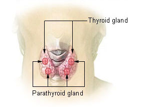
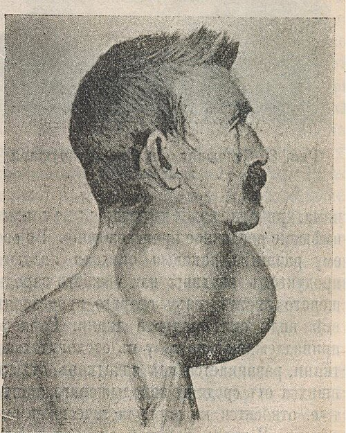

# TUMORES DE TIREOIDE

Para entender tumores de tireoide, você precisa parar de tentar decorar nomes e começar a entender a lógica da glândula. Na prova de residência, o examinador não quer apenas que você saiba que o Carcinoma Papilífero é o mais comum; ele quer que você saiba o que fazer quando o laudo da PAAF (Punção Aspirativa por Agulha Fina) vier "indeterminado".

Vamos dividir nosso raciocínio em dois grandes pilares: o diagnóstico do nódulo tireoidiano (a porta de entrada) e o manejo dos carcinomas (a conduta especializada).

## O Nódulo Tireoidiano: O Ponto de Partida

A maioria dos cânceres de tireoide se manifesta como um nódulo assintomático. Mas cuidado: nódulo na tireoide é extremamente comum (até 60% da população tem se fizermos USG), enquanto o câncer é raro (cerca de 5-10% dos nódulos). Nosso trabalho é separar o joio do trigo sem operar todo mundo desnecessariamente.

### A Investigação Inicial: O TSH é o Maestro

Muitos alunos erram aqui por quererem pedir PAAF para todo nódulo. Errado. O primeiro exame a ser solicitado diante de um nódulo tireoidiano palpável ou achado incidentalmente é o **TSH**.

Por que o TSH? Porque se o TSH estiver suprimido (baixo), o nódulo pode ser hiperfuncionante ("quente"). Nódulos que produzem hormônio em excesso raramente são malignos. Se o TSH for baixo, o próximo passo é a **Cintilografia**. Se o nódulo for "quente", tratamos o hipertireoidismo e praticamente esquecemos a hipótese de câncer. Se o TSH for normal ou elevado, seguimos para a Ultrassonografia (USG).

### Ultrassonografia e o Sistema TI-RADS

A USG não dá o diagnóstico de câncer, ela estima o risco. No MedEvo, sempre reforçamos que você deve procurar características de malignidade. As bancas adoram cobrar os sinais ultrassonográficos de suspeita:

- **Sólido e Hipoecoico:** O tumor é "denso" e mais escuro que o restante da glândula.

- **Margens Irregulares ou Infiltrativas:** O tumor não respeita fronteiras.

- **Microcalcificações (pontos ecogênicos brilhantes):** Representam, muitas vezes, os corpos psamomatosos do carcinoma papilífero.

- **Mais alto do que largo (Taller-than-wide):** O crescimento vertical rompe os planos fasciais da glândula.

- **Extensão Extratireoidiana:** O sinal mais fidedigno de invasão.

O sistema ACR TI-RADS categoriza esses achados. Um TI-RADS 5 é altamente suspeito, enquanto um TI-RADS 1 é benigno.

### PAAF: O Padrão-Ouro Diagnóstico

A PAAF é o melhor exame para avaliar a citologia do nódulo. Mas atenção à regra de ouro: **não puncionamos tudo**. Geralmente, indicamos PAAF para nódulos > 1 cm com características suspeitas ou > 1,5-2 cm se forem puramente sólidos e iso/hiperecoicos.

**Dica de Prova:** Se o nódulo tiver menos de 1 cm (micro-nódulo), só puncionamos se houver linfonodo cervical suspeito, história de irradiação na infância ou história familiar de primeiro grau para câncer de tireoide.

## Classificação de Bethesda: A Bíblia da Citologia

Você não pode ir para a prova sem dominar a Classificação de Bethesda. Ela dita a conduta baseada no risco de malignidade.

| Bethesda | Categoria | Risco de Malignidade | Conduta Inicial |
| --- | --- | --- | --- |
| I | Não diagnóstico / Insatisfatório | 1-4% | Repetir PAAF em 2-3 meses |
| II | Benigno | 0-3% | Seguimento clínico/USG |
| III | Atipia de significado indeterminado (AUS/FLUS) | 5-15% | Repetir PAAF ou Teste Molecular |
| IV | Neoplasia Folicular / Suspeito para N. Folicular | 15-30% | Cirurgia (Lobectomia) ou Teste Molecular |
| V | Suspeito para Malignidade | 60-75% | Cirurgia (Tireoidectomia Total ou Lobectomia) |
| VI | Maligno | 97-99% | Cirurgia (Tireoidectomia Total ou Lobectomia) |

**O Grande "Pulo do Gato" (Bethesda IV):** Por que o Bethesda IV é cirúrgico se o risco é de apenas 15-30%? Porque a PAAF avalia apenas as células (citologia). Para diferenciar um Adenoma Folicular (benigno) de um Carcinoma Folicular (maligno), precisamos ver a **arquitetura** da cápsula. Se houver invasão da cápsula ou invasão vascular, é carcinoma. A PAAF não consegue ver isso. Portanto, o diagnóstico de Carcinoma Folicular é obrigatoriamente **histopatológico** (pós-operatório), nunca citológico.

## Carcinoma Papilífero de Tireoide (CPT)

O CPT é o "queridinho" das provas e da prática clínica. Representa mais de 80% dos casos.

### Características e Patologia

Ele tem um excelente prognóstico e uma característica marcante: a **disseminação linfática**. É muito comum o paciente abrir o quadro com um linfonodo cervical palpável (metástase) e um nódulo tireoidiano pequeno.

Na histologia, procure por:

- **Núcleos em "vidro fosco" ou "Olhos da Órfã Annie":** Núcleos claros e grandes.

- **Fendas nucleares (Grooves) e Pseudoinclusões.**

- **Corpos Psamomatosos:** Calcificações concêntricas (presentes em 50% dos casos).

### Tratamento do CPT

A tendência moderna, seguida pelas diretrizes da *American Thyroid Association* (ATA) e da Sociedade Brasileira de Endocrinologia e Metabologia (SBEM), é a descalonização do tratamento.

- **Microcarcinoma (< 1 cm) solitário, sem invasão e sem linfonodos:** A conduta pode ser apenas **Lobectomia + Istmectomia**. Em casos selecionados e protocolos de pesquisa, até a vigilância ativa é aceitável.

- **Tumores entre 1 cm e 4 cm:** Pode-se optar por Lobectomia ou Tireoidectomia Total (TT). A decisão depende de fatores de risco e preferência do paciente.

- **Tumores > 4 cm ou com Extensão Extratireoidiana/Metástases:** **Tireoidectomia Total**.

**Esvaziamento Cervical:** Não fazemos esvaziamento cervical profilático de rotina para o compartimento lateral. O esvaziamento do compartimento central (Nível VI) pode ser considerado em tumores avançados (T3/T4). Se houver linfonodo clinicamente positivo (N1), o esvaziamento é obrigatório.

## Carcinoma Folicular de Tireoide (CFT)

O segundo mais comum (cerca de 10-15%). Diferente do papilífero, ele gosta de sangue. Sua disseminação é **hematogênica**, preferindo ossos e pulmões.

### O Dilema Diagnóstico

Como já mencionei, a PAAF dirá "Neoplasia Folicular" (Bethesda IV). O Dr. Will sempre lembra seus alunos: se a prova te der um Bethesda IV em um nódulo de 4 cm, você não pode afirmar que é câncer antes da cirurgia. A conduta inicial é a lobectomia para diagnóstico. Se o histopatológico confirmar invasão vascular ou capsular, aí sim diagnosticamos o Carcinoma Folicular e, dependendo do tamanho e invasão, completamos a tireoidectomia.

### Carcinoma de Células de Hürthle

Antigamente considerado uma variante do folicular, hoje é classificado como uma entidade distinta. É mais agressivo, tem maior propensão a metástases linfonodais (diferente do folicular clássico) e capta menos iodo radioativo. O tratamento segue a lógica do folicular, mas com um olhar mais atento aos linfonodos.

## Carcinoma Medular de Tireoide (CMT)

Aqui o jogo muda. O CMT não nasce das células foliculares (que produzem T3/T4), mas das **Células C (parafoliculares)**, produtoras de **Calcitonina**.

### Por que o CMT é perigoso?

- Não capta iodo (Iodo radioativo não funciona aqui!).

- Tem forte componente genético.

- É muito mais agressivo que os diferenciados (papilar/folicular).

### Esporádico vs. Hereditário

- **80% são Esporádicos:** Geralmente nódulo único em pacientes mais velhos.

- **20% são Hereditários:** Associados à mutação do **proto-oncogene RET**. Estão inseridos nas Neoplasias Endócrinas Múltiplas (NEM).

| Síndrome | Componentes |
| --- | --- |
| **NEM 2A** | CMT + Feocromocitoma + Hiperparatireoidismo |
| **NEM 2B** | CMT + Feocromocitoma + Neuromas de mucosa/Hábito Marfanoide |

**Dica de Ouro:** Se diagnosticar CMT, você é OBRIGADO a:

- Pedir a pesquisa da mutação do gene RET.

- Dosar Metanefrinas urinárias/plasmáticas para excluir Feocromocitoma antes de operar a tireoide. Por que? Porque se o paciente tiver um feocromocitoma não diagnosticado, ele pode ter uma crise hipertensiva fatal durante a indução anestésica da tireoidectomia.

### Tratamento do CMT

O tratamento é agressivo: **Tireoidectomia Total + Esvaziamento Cervical Central (Nível VI) profilático**. A calcitonina serve como marcador de seguimento; se ela subir no pós-operatório, há doença residual ou recorrência.

## Carcinoma Anaplásico (Indiferenciado)

É o pesadelo da oncologia cervical. Ocorre geralmente em idosos e tem um crescimento extremamente rápido (semanas).

### Quadro Clínico e Conduta

O paciente chega com uma massa cervical pétrea, fixa, com rouquidão (invasão do nervo laríngeo recorrente), disfagia e, principalmente, **estridor/insuficiência respiratória** (invasão traqueal).

O diagnóstico é feito por PAAF ou biópsia core-biopsy, revelando células pleomórficas e indiferenciadas.

**Tratamento:** Infelizmente, a maioria é irressecável ao diagnóstico. O foco é paliativo. Se houver obstrução de via aérea, a cirurgia é feita para "descompressão" ou traqueostomia de exceção. A sobrevida média é de poucos meses. Não se faz tireoidectomia radical em doença claramente invasiva e metastática aqui; o objetivo é qualidade de vida e evitar a asfixia.

## Manejo Pós-Operatório e Seguimento

Nos carcinomas diferenciados (Papilar e Folicular), o tratamento não termina na cirurgia.

### Radioiodoterapia (Iodo-131)

O objetivo é destruir remanescentes de tecido tireoidiano normal ou focos microscópicos de câncer.

- **Indicação:** Pacientes de alto risco (tumores grandes, invasão vascular importante, metástases linfonodais volumosas).

- **Preparo:** O paciente precisa estar com TSH alto (> 30) para que as células "queiram" captar o iodo. Isso é feito suspendendo a levotiroxina por 4 semanas ou usando TSH recombinante.

### Supressão de TSH

O TSH é um fator de crescimento para as células tireoidianas. Se o paciente teve câncer, queremos manter o TSH baixo (suprimido) para não estimular possíveis células remanescentes.

- **Baixo Risco:** TSH entre 0,1 e 0,5 mUI/L.

- **Alto Risco:** TSH < 0,1 mUI/L.

### Marcadores de Seguimento

O principal marcador é a **Tireoglobulina (Tg)**. Como a Tg só é produzida por tecido tireoidiano, se fizemos tireoidectomia total + iodo, a Tg deve ser indetectável. Se ela começar a subir, suspeitamos de recidiva.
**Cuidado:** Sempre dosar o **Anticorpo Anti-tireoglobulina (Anti-Tg)** junto. Se o anticorpo for positivo, ele invalida o valor da Tg (pode dar um falso negativo).

## Complicações da Cirurgia de Tireoide

Isso cai muito em prova de cirurgia geral.

- **Lesão do Nervo Laríngeo Recorrente:**

- Unilateral: Rouquidão.

- Bilateral: Insuficiência respiratória aguda (as pregas vocais fecham na linha média) -> Necessidade de traqueostomia de urgência.

- **Lesão do Nervo Laríngeo Superior (Ramo Externo):** O paciente perde a capacidade de atingir tons agudos (voz cansada ao final do dia). Importante para cantores e palestrantes.

- **Hipoparatireoidismo Iatrogênico:** Retirada ou isquemia acidental das paratireoides. Causa hipocalcemia.

- Sinais: Chvostek (percussão do facial) e Trousseau (espasmo carpal com manguito).

- Tratamento: Cálcio e Vitamina D.

- **Hematoma Cervical Compressivo:** É a complicação mais temida nas primeiras horas pós-op. O pescoço incha rapidamente e comprime a traqueia.

- **Conduta:** Abertura imediata da ferida operatória no leito (não espere o centro cirúrgico!) para descompressão.

## Pontos-Chave para Prova

- **TSH é o primeiro exame:** Se baixo, peça cintilografia. Se normal/alto, peça USG.

- **Carcinoma Papilífero:** Mais comum, disseminação linfática, corpos psamomatosos, excelente prognóstico.

- **Carcinoma Folicular:** Disseminação hematogênica, diagnóstico só por histopatologia (PAAF não diferencia de adenoma).

- **Bethesda IV:** Neoplasia folicular. Conduta: Cirurgia (inicialmente lobectomia) ou teste molecular.

- **Carcinoma Medular (CMT):** Células C, Calcitonina, Gene RET. Excluir feocromocitoma antes da cirurgia (NEM 2).

- **Carcinoma Anaplásico:** Idoso, crescimento rápido, invasão local, prognóstico sombrio. Cirurgia é paliativa.

- **Microcarcinoma (< 1 cm):** Lobectomia é tratamento suficiente na maioria dos casos.

- **Linfonodo Nível VI:** É o compartimento central, o primeiro local de metástase linfática do papilífero e medular.

- **Tireoglobulina:** Marcador de seguimento para diferenciados (Papilar/Folicular). Não serve para diagnóstico!

- **Calcitonina:** Marcador de diagnóstico e seguimento para o Medular.

- **Complicação Bilateral do Laríngeo Recorrente:** Estridor e insuficiência respiratória imediata pós-extubação.

- **Hematoma pós-op:** Emergência cirúrgica. Abrir a ferida no leito se houver desconforto respiratório.

- **Contraindicação Absoluta à Radioiodoterapia:** Gestação e amamentação.

- **Pegadinha de Prova:** Dizer que NEM 2 piora o prognóstico do Carcinoma Papilar. Errado! NEM 2 está associado ao Medular.

- **Linfadenectomia Cervical:** Indicada sempre que houver linfonodo comprovadamente metastático (N1) na PAAF ou exame físico/imagem.

- **Hürthle:** Variante mais agressiva do folicular, com maior chance de metástase linfonodal.

- **Acurácia da PAAF:** É excelente para o Papilífero (Bethesda VI), mas limitada para o Folicular (Bethesda IV).

 Cópia offline para consulta pessoal.
 Fonte original:
 [https://www.medevo.com.br/material-apoio/ler/c0d0d768-7b14-4b82-8872-0174050a5904](https://www.medevo.com.br/material-apoio/ler/c0d0d768-7b14-4b82-8872-0174050a5904)
