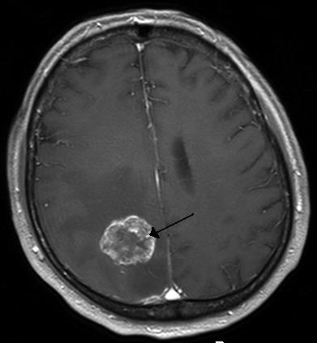

# TUMORES DO SNC

Para entender tumores do Sistema Nervoso Central (SNC), você precisa primeiro organizar sua mente em duas grandes gavetas: os tumores **primários** (que nascem no cérebro) e os **secundários** (metástases). Embora o cérebro pareça um lugar isolado, ele é o destino final de muitas neoplasias sistêmicas. Nas provas de residência, o examinador quer saber se você reconhece o padrão de imagem, se entende as complicações pós-operatórias e se sabe manejar a hipertensão intracraniana (HIC).

## Epidemiologia e Classificação

Diferente do que muitos pensam, os tumores cerebrais primários não são raridades exóticas. Eles possuem alta mortalidade e o tratamento precoce modifica drasticamente o prognóstico. Em adultos, a maioria dos tumores é **supratentorial** (acima do tentório do cerebelo). Em crianças, a regra se inverte: a maioria é **infratentorial** (fossa posterior).

Se a prova perguntar qual o tumor intracraniano mais comum no geral, a resposta é **Metástase**. Se perguntar qual o tumor primário mais comum, a resposta é **Meningioma** (geralmente benigno). Se perguntar qual o tumor primário **maligno** mais comum, aí falamos do **Glioblastoma (GBM)**.

### A Gradação Histopatológica (WHO)

A Organização Mundial da Saúde (OMS/WHO) classifica os tumores de I a IV. Entender isso é fundamental para o prognóstico:

- **Grau I:** Lesões com baixo potencial proliferativo, geralmente curáveis apenas com cirurgia.

- **Grau II:** Infiltrativos, mas de crescimento lento. Tendem a recorrer.

- **Grau III:** Evidência histológica de malignidade (mitoses, anaplasia).

- **Grau IV:** Malignidade citológica severa, necrose e proliferação microvascular. Aqui mora o Glioblastoma.

## Fisiopatologia: O Porquê dos Sintomas

O crânio é uma caixa rígida e fechada. Qualquer massa extra (tumor, sangue ou pus) aumenta a pressão interna. É a Doutrina de Monro-Kellie. O tumor causa sintomas por três mecanismos:

- **Invasão Direta:** Destrói o tecido funcional (ex: tumor no lobo frontal causando alteração de personalidade).

- **Efeito de Massa:** Empurra estruturas vizinhas, podendo causar herniações.

- **Edema Vasogênico:** O tumor quebra a barreira hematoencefálica. O líquido vaza para o interstício. É por isso que usamos **Dexamethasone** – ela "sela" essa barreira e reduz o inchaço.

Cuidado: não confunda edema vasogênico (comum em tumores) com edema citotóxico (comum no AVC). No tumor, o edema poupa o córtex e se espalha pela substância branca.

## Gliomas: Os Vilões do Parênquima

Os gliomas derivam das células da glia (astrócitos, oligodendrócitos). Na prática do MedEvo, focamos nos astrocitomas, que são os mais incidentes entre as neoplasias gliais.

### Glioblastoma (Astrocitoma Grau IV)

É o tumor cerebral primário mais agressivo. Imagine um paciente de 60 anos, tabagista, que chega com uma crise epiléptica inédita e cefaleia progressiva. Na RM, você vê uma lesão infiltrativa, com realce anelar pelo contraste e necrose central.

- **Localização:** Frequentemente atravessa o corpo caloso (aspecto em "asa de borboleta").

- **Prognóstico:** Reservado, mesmo com cirurgia, radioterapia e quimioterapia (Temozolomida).

### Astrocitomas de Baixo Grau

Comuns em adultos jovens. O desafio aqui é que eles são infiltrativos; você não consegue ver onde o tumor termina e o cérebro saudável começa. Muitas vezes, o único sintoma é uma crise convulsiva isolada.

## Meningiomas: Os "Benignos" que Ocupam Espaço

Eles surgem das células da aracnoide, não do parênquima cerebral. Por isso, são tumores **extraparenquimatosos**.

- **Epidemiologia:** Mais comuns em mulheres (relação com receptores de progesterona) e idosos.

- **Localização Clássica:** A localização mais comum é a **parassagital**.

- **Imagem:** Lesão bem delimitada, que realça intensamente pelo contraste e apresenta o "sinal da cauda dural" (espessamento da dura-máter adjacente).

## Metástases Cerebrais: O Invasor Externo

Se você vir múltiplas lesões na transição entre a substância branca e cinzenta, pense em metástase. Os cinco principais sítios primários que "mandam" para o cérebro são:

- **Pulmão** (o mais comum de todos).

- **Mama** (segundo lugar, muito cobrado em provas).

- **Melanoma** (tem alta tendência a sangrar).

- **Rim**.

- **Colorretal**.

**Pérola de Prova:** Paciente com câncer conhecido que apresenta déficit neurológico progressivo em membros inferiores? Suspeite de **Síndrome de Compressão Medular**. A conduta imediata é Dexamethasone venosa e repouso absoluto para evitar o agravamento da lesão medular.

## Região Selar e Suprasselar: O Nó Cego da Neuroendocrinologia

Aqui o bicho pega. Temos dois protagonistas: o Adenoma de Hipófise e o Craniofaringioma.

### Craniofaringioma

Tumor derivado da bolsa de Rathke. É comum em crianças e adolescentes.

- **Clínica:** Hemianopsia bitemporal (compressão do quiasma óptico) e distúrbios de crescimento.

- **Pós-operatório:** É aqui que a banca te pega. Devido à manipulação próxima ao hipotálamo e à haste hipofisária, o paciente tem altíssima chance de desenvolver **Diabetes Insipidus (DI)** e **Pan-hipopituitarismo**.

- **Manejo do DI:** Poliúria súbita com urina diluída (densidade < 1.005). O tratamento é a reposição de volume e, se necessário, Desmopressina (DDAVP).

### Tabela 1: Diagnóstico Diferencial na Região Selar

| Característica | Adenoma de Hipófise | Craniofaringioma |
| --- | --- | --- |
| **Idade** | Adultos (20-50 anos) | Crianças e Jovens |
| **Origem** | Adeno-hipófise | Remanescentes da Bolsa de Rathke |
| **Imagem** | Sólido, realce homogêneo | Cístico, com calcificações (frequente) |
| **Clínica** | Hiperprolactinemia / Acromegalia | Defeitos visuais / Atraso puberal |
| **Complicação Pós-Op** | Hipopituitarismo parcial | DI e Pan-hipopituitarismo (frequente) |

## Diagnóstico Diferencial: As Lesões Anulares

Muitas coisas no cérebro aparecem como um "anel" que brilha no contraste. O Dr. Will sempre lembra o mnemônico **MAGIC DR** (Metástase, Abscesso, Glioma, Infarto, Contusão, Desmielinizante, Radiação). Mas para a prova, foque no trio: **Toxoplasmose, Linfoma e Abscesso**.

- **Neurotoxoplasmose:** Paciente imunocomprometido (HIV+, candidíase oral, linfopenia). Lesões múltiplas, geralmente nos gânglios da base, com o "sinal do alvo".

- **Abscesso Cerebral:** Frequentemente associado a focos infecciosos (sinusite, otite, endocardite). O patógeno mais comum pós-neurocirurgia é o *Staphylococcus aureus*. O tratamento envolve antibióticos e, às vezes, drenagem.

- **Linfoma Primário do SNC:** Também em imunocomprometidos, mas geralmente é uma lesão única e periventricular.

### Tabela 2: Lesões Expansivas em Imunocomprometidos (HIV)

| Achado | Toxoplasmose Cerebral | Linfoma Primário do SNC |
| --- | --- | --- |
| **Número de Lesões** | Múltiplas | Geralmente Única |
| **Localização** | Gânglios da base / Transição branca-cinzenta | Periventricular |
| **Efeito de Massa** | Presente | Presente |
| **Prova Terapêutica** | Melhora em 10-14 dias com Sulfadiazina + Pirimetamina | Sem resposta a antiparasitários |

## Manifestações Clínicas Específicas e Nervos Cranianos

O examinador adora misturar anatomia com tumores.

### Vias Ópticas e Quiasma

- **Lesão do Nervo Óptico:** Causa perda de visão no olho correspondente e o famoso **Defeito Pupilar Aferente Relativo (Sinal de Marcus Gunn)**. Ao iluminar o olho doente, as duas pupilas dilatam (porque o cérebro não "percebe" a luz chegando).

- **Lesão Central do Quiasma Óptico:** Clássica dos tumores de hipófise e craniofaringiomas. Causa **Hemianopsia Bitemporal** (perda da visão lateral de ambos os campos).

### Nervo Oculomotor (III Par)

A paralisia do III par é uma emergência se houver midríase.

- **Compressão (Tumor/Aneurisma/Herniação do Úncus):** A pupila dilata (midríase) porque as fibras parassimpáticas são superficiais e comprimidas primeiro.

- **Isquemia (Diabetes):** A pupila costuma ser poupada, pois a isquemia atinge o centro do nervo.

### Nervo Trigêmeo (V Par)

A neuralgia do trigêmeo pode ser causada por compressão tumoral. É uma dor lancinante, em "choque", desencadeada por gatilhos leves (barbear, vento). O tratamento de primeira escolha é a **Carbamazepina**.

## Complicações Pós-Operatórias: Onde o Aluno Erra

O pós-operatório de neurocirurgia é um campo minado. As complicações mais comuns são crises convulsivas, sangramentos e distúrbios hidroeletrolíticos.

**Pneumoencéfalo:** É a presença de ar dentro do crânio após a cirurgia. Se o ar entrar sob pressão (Pneumoencéfalo hipertensivo), pode causar efeito de massa.

- **Tratamento:** Oferecer oxigênio em altas concentrações (normobárico ou hiperbárico). Isso acelera a reabsorção do nitrogênio do ar acumulado.

**Crises Convulsivas:** São comuns. Em abscessos cerebrais, mantemos o anticonvulsivante por pelo menos 3 meses após a resolução da imagem, guiando a suspensão pelo EEG.

**Hipotensão Intracraniana:** Cuidado! É uma complicação **rara**. Se a prova colocar como "comum", está errado. O comum é a hipertensão ou a normopressão.

## Trauma e Tumores: A Intersecção

Às vezes, um tumor é descoberto após um TCE leve. Mas você precisa saber diferenciar as coleções traumáticas:

- **Hematoma Extradural:** Trauma na têmpora (artéria meníngea média). Intervalo lúcido seguido de deterioração rápida. Imagem em lente biconvexa (limão).

- **Hematoma Subdural Agudo:** Sangramento venoso (veias pontes). Imagem em crescente (banana).

- **Hematoma Subdural Crônico:** Comum em idosos com atrofia cerebral. História de queda há semanas. Sintomas insidiosos que simulam demência ou tumor. Imagem hipodensa (escura) em crescente.

### Tabela 3: Escala de Coma de Glasgow (Atualizada)

| Abertura Ocular | Resposta Verbal | Resposta Motora |
| --- | --- | --- |
| 4 - Espontânea | 5 - Orientada | 6 - Obedece comandos |
| 3 - Ao som | 4 - Confusa | 5 - Localiza dor |
| 2 - À pressão | 3 - Palavras inapropriadas | 4 - Flexão normal (retirada) |
| 1 - Ausente | 2 - Sons incompreensíveis | 3 - Flexão anormal (decorticação) |
| | 1 - Ausente | 2 - Extensão (descerebração) |
| | | 1 - Ausente |

*Nota: Se Glasgow < 8, a via aérea deve ser protegida (intubação).*

## Tratamento e Condutas Práticas

### Manejo do Edema e HIC

A **Dexamethasone** é a droga de escolha para o edema peritumoral. A dose inicial costuma ser de 4mg a 10mg a cada 6 horas. Ela reduz a cefaleia e melhora os déficits focais rapidamente.

### Cirurgia

O objetivo é o diagnóstico histopatológico e a descompressão. Em tumores como o Glioblastoma, a ressecção deve ser a maior possível (ressecção total macroscópica), desde que não cause déficits incapacitantes.

### Comunicação e Ética

A autonomia do paciente é soberana. Ele tem o direito à informação completa sobre diagnóstico, prognóstico e riscos. No caso de tumores malignos, a comunicação de más notícias deve ser empática, mas honesta.

### Tabela 4: Resumo de Condutas em Tumores do SNC

| Cenário | Conduta Imediata | Objetivo |
| --- | --- | --- |
| Crise convulsiva + Massa | Anticonvulsivante + Corticoide | Estabilização clínica |
| HIC + Anisocoria | Cabeceira 30º + Manitol/Salina | Evitar herniação |
| Metástase Epidural (Coluna) | Dexamethasone + RM Neuroeixo | Preservar função motora |
| Suspeita de Meduloblastoma | RM Crânio/Coluna + Líquor | Estadiamento completo |

## Situações Especiais: O Meduloblastoma

É o tumor maligno mais comum da infância, localizado na fossa posterior (cerebelo).

- **Estadiamento:** O meduloblastoma adora "disseminar pelo líquor" (drop metastasis). Por isso, o estadiamento **obrigatório** inclui RM de todo o neuroeixo (crânio e coluna) e análise citológica do líquor.

- **Pegadinha:** Cintilografia óssea NÃO faz parte da rotina de estadiamento inicial, a menos que haja sintomas específicos.

## Diagnóstico Diferencial: Miastenia Gravis

A banca pode colocar um quadro de fraqueza facial ou queda de pálpebra (ptose) para te confundir com tumor de tronco ou nervo craniano.

- **Diferencial:** Na Miastenia Gravis, a fraqueza é **flutuante** (piora ao longo do dia ou com esforço). Embora a fraqueza bulbar e facial seja comum, nem todos os pacientes terão disfagia ou emagrecimento logo no início.

## Resumo da Ópera: O Caminho do Diagnóstico

- **Clínica:** Cefaleia que piora ao deitar, crises convulsivas novas em adultos, déficits focais progressivos.

- **Imagem:** RM com contraste é o padrão-ouro. A TC serve para urgências (ver sangue ou grandes desvios de linha média).

- **Laboratório:** Útil para marcadores (ex: HCG e AFP em tumores germinativos) ou para avaliar o pan-hipopituitarismo em lesões selares.

- **Histologia:** É o que define o sobrenome do tumor e o tratamento adjuvante.

Lembre-se: em neurocirurgia, o "efeito de massa" é o que mata rápido. O desvio de linha média na TC é um sinal de alerta vermelho. Se houver herniação do úncus (anisocoria + hemiparesia contralateral + rebaixamento), a intervenção precisa ser imediata.

## Pontos-Chave para Prova 🧠

- **Glioblastoma Multiforme:** Astrocitoma grau IV, tumor primário maligno mais comum em adultos, prognóstico reservado.

- **Meningioma:** Tumor primário mais comum no geral, geralmente benigno, localização parassagital é clássica.

- **Metástases:** Pulmão é o sítio primário mais frequente; mama é o segundo. Localizam-se preferencialmente na transição branca-cinzenta.

- **Craniofaringioma:** Pós-operatório cursa com alta incidência de Diabetes Insipidus e Pan-hipopituitarismo.

- **Hemianopsia Bitemporal:** Indica lesão no quiasma óptico (comum em tumores selares).

- **Sinal de Marcus Gunn:** Indica lesão do nervo óptico (via aferente).

- **Pneumoencéfalo Pós-Op:** Tratamento é oxigenoterapia em altas concentrações para acelerar a absorção do ar.

- **Meningite Pós-Neurocirurgia:** O agente etiológico mais comum é o *Staphylococcus aureus*.

- **Dexamethasone:** Droga de escolha para reduzir edema vasogênico peritumoral.

- **Neuralgia do Trigêmeo:** Dor paroxística em território do V par; tratamento inicial com Carbamazepina.

- **Abscesso Cerebral:** Manter anticonvulsivante por ≥ 3 meses após cura radiológica.

- **Compressão Medular Tumoral:** Dor é o sintoma mais precoce; a coluna torácica é o local mais afetado.

- **Paralisia do III Par:** Se houver midríase, pense em compressão (aneurisma ou herniação); se a pupila estiver poupada, pense em Diabetes.

- **Estadiamento do Meduloblastoma:** Exige RM de todo o neuroeixo e coleta de líquor; cintilografia óssea não é rotina.

- **Hematoma Subdural Crônico:** Idoso, trauma leve prévio, coleção em crescente hipodensa na TC.

- **Contraindicação Absoluta:** Nunca realize punção lombar em paciente com suspeita de massa intracraniana e sinais de HIC (risco de herniação cerebral).

- **Tríade de Cushing:** Hipertensão, bradicardia e alteração respiratória. Indica HIC grave e iminência de herniação.

 Cópia offline para consulta pessoal.
 Fonte original:
 [https://www.medevo.com.br/material-apoio/ler/03c4a507-6778-421a-9ee0-69bc0979669c](https://www.medevo.com.br/material-apoio/ler/03c4a507-6778-421a-9ee0-69bc0979669c)
