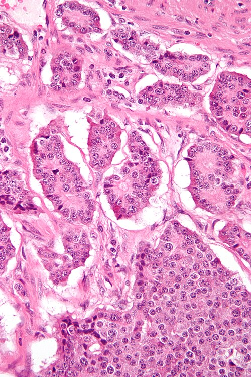
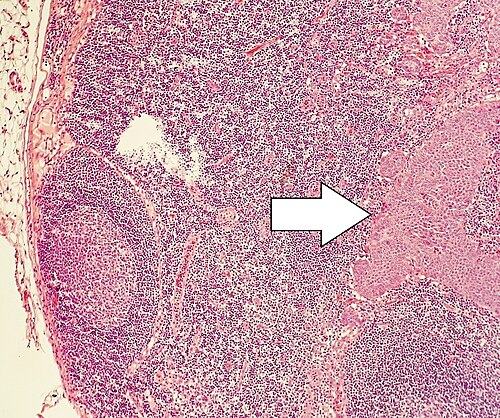

# TUMORES NEUROENDÓCRINOS

Para entender os Tumores Neuroendócrinos (TNE), você precisa primeiro esquecer a lógica dos adenocarcinomas comuns. Aqui, lidamos com células do sistema endócrino difuso (antigamente chamadas de células APUD). Elas têm uma característica única: podem produzir hormônios. Isso significa que o seu paciente pode chegar com uma massa tumoral, mas também pode chegar com sintomas sistêmicos bizarros, como rubor facial e diarreia explosiva.

Nas provas de residência, o foco é quase sempre em três pilares: **Localização, Estadiamento (Grau Histológico) e Conduta Cirúrgica**. Se você dominar esses três, você acerta 90% das questões.

## Classificação e Graduação Histológica: O Coração do Prognóstico

Antes de falarmos de cirurgia, precisamos falar de patologia. O que define a agressividade de um TNE não é apenas o tamanho, mas a velocidade com que as células se dividem.

A Organização Mundial da Saúde (OMS) e a ENETS (European Neuroendocrine Tumor Society) utilizam dois parâmetros fundamentais: o **Índice de Proliferação Ki-67** e o **Índice Mitótico**.

### Tabela 1: Classificação de Grau Tumoral (OMS)

| Grau (Grade) | Ki-67 (%) | Índice Mitótico (por 10 CGA*) | Diferenciação |
| --- | --- | --- | --- |
| **G1 (Baixo)** | < 3% | < 2 | Bem diferenciado |
| **G2 (Intermediário)** | 3% - 20% | 2 - 20 | Bem diferenciado |
| **G3 (Alto)** | > 20% | > 20 | Bem diferenciado |
| **NEC (Carcinoma)** | > 20% | > 20 | Pouco diferenciado |

**CGA: Campos de Grande Aumento.*

**Dica do Professor:** Cuidado com a pegadinha! Existe uma diferença crucial entre um TNE G3 (bem diferenciado, mas que cresce rápido) e um Carcinoma Neuroendócrino (NEC - pouco diferenciado). O prognóstico e a resposta à quimioterapia são completamente diferentes. Em provas, o TNE de bom prognóstico é aquele com Ki-67 baixo (<3%) e baixo grau histológico.

## Tumor Neuroendócrino de Apêndice: O Favorito das Bancas

Se você tiver pouco tempo para estudar, estude apêndice. É a localização mais comum dos TNEs no trato gastrointestinal em muitas séries (embora o intestino delgado dispute esse posto em dados epidemiológicos mais recentes). Geralmente, o diagnóstico é um achado incidental após uma apendicectomia por apendicite aguda.

Aqui, o Dr. Will sempre reforça: a conduta depende do **tamanho** e de **fatores de risco**.

### A Regra de Ouro do Apêndice

- **Tumor < 1 cm:** A apendicectomia simples é curativa. Não precisa de mais nada.

- **Tumor > 2 cm:** Aqui o risco de metástase linfonodal é alto. A conduta é a **Hemicolectomia Direita**, mesmo que a base do apêndice esteja livre.

- **Tumor entre 1 e 2 cm:** Esta é a "zona cinzenta" onde as bancas adoram testar seu conhecimento sobre fatores de risco.

### Quando fazer Hemicolectomia Direita em tumores de 1-2 cm?

Você deve ampliar a cirurgia se houver:

- Invasão do mesoapêndice (especialmente se > 3 mm).

- Margens comprometidas ou base do apêndice envolvida.

- Invasão linfovascular.

- Histologia de alto grau (G2 ou G3).

**Exemplo Clínico:** Paciente de 22 anos, submetida a apendicectomia por apendicite. O laudo mostra TNE de 1,5 cm na ponta do apêndice, mas com invasão do mesoapêndice. Qual a conduta? **Hemicolectomia direita**. Se não tivesse a invasão do mesoapêndice, seria apenas observação.

### Tabela 2: Resumo de Conduta no TNE de Apêndice

| Tamanho | Características Adicionais | Conduta |
| --- | --- | --- |
| < 1 cm | Qualquer localização, sem invasão | Apendicectomia (Curativa) |
| 1 - 2 cm | Sem invasão de meso/linfovascular | Apendicectomia + Seguimento |
| 1 - 2 cm | **Com** invasão de meso, base ou G2 | Hemicolectomia Direita |
| > 2 cm | Qualquer característica | Hemicolectomia Direita |

## Tumores do Intestino Delgado e Síndrome Carcinoide

Os TNEs de intestino delgado (especialmente no **íleo terminal**) são traiçoeiros. Eles costumam ser pequenos, mas altamente metastáticos. Frequentemente, o paciente apresenta uma reação desmoplásica intensa no mesentério, que pode causar obstrução intestinal ou isquemia mesentérica.

### Síndrome Carcinoide: O "Flush" Clássico

A síndrome carcinoide ocorre quando o tumor secreta substâncias como **serotonina** e substância P diretamente na circulação sistêmica.

**Por que isso geralmente só acontece quando há metástase hepática?**
Porque, se o tumor está no intestino, a serotonina cai na veia portal e é metabolizada pelo fígado (efeito de primeira passagem). Se houver metástases hepáticas, a serotonina vai direto para a veia cava e atinge o coração e pulmões.

- **Tríade Clássica:** Rubor facial (flushing), diarreia e lesões valvares cardíacas (especialmente no lado direito: estenose pulmonar e insuficiência tricúspide).

- **Diagnóstico Bioquímico:** Dosagem de **5-HIAA na urina de 24 horas** (metabólito da serotonina) e Cromogranina A sérica (marcador inespecífico de massa tumoral).

## Tumores Neuroendócrinos Pancreáticos (PNETs)

Diferente do adenocarcinoma de pâncreas, os PNETs têm um prognóstico muito melhor. Eles se dividem em funcionantes (secretam hormônios) e não-funcionantes.

### 1. Insulinoma

É o PNET funcionante mais comum. A regra aqui é a **Tríade de Whipple**:

- Sintomas de hipoglicemia em jejum.

- Glicemia plasmática baixa no momento dos sintomas.

- Alívio dos sintomas após administração de glicose.

**Conduta Cirúrgica:** A maioria é benigna e pequena (< 2 cm). Se estiver longe do ducto pancreático principal (> 2-3 mm), a **enucleação** é a escolha. Se for grande ou colado no ducto na cabeça do pâncreas, pode exigir uma Duodenopancreatectomia (Whipple).

### 2. Gastrinoma (Síndrome de Zollinger-Ellison)

Causa úlceras pépticas refratárias e múltiplas. Localiza-se no "Triângulo do Gastrinoma" (confluência dos ductos cístico e comum, segunda e terceira porções do duodeno e colo do pâncreas).

### 3. PNETs Não-Funcionantes

Muitas vezes são achados de exame (incidentalomas). Se forem > 2 cm, a cirurgia está indicada (ex: pancreatectomia caudal para lesões em corpo e cauda).

## TNE Gástrico: A Importância da Gastrina

Não trate todo tumor no estômago igual. No caso dos TNEs gástricos, precisamos saber o nível de gastrina e se há gastrite atrófica.

- **Tipo I (Mais comum):** Associado a gastrite atrófica crônica e hipergastrinemia. São múltiplos e pequenos. Conduta: Se < 1 cm, ressecção endoscópica e seguimento. Se recorrentes ou maiores, pode-se considerar antrectomia para retirar o estímulo da gastrina.

- **Tipo II:** Associado à NEM-1 (Neoplasia Endócrina Múltipla tipo 1) e Gastrinoma.

- **Tipo III:** Esporádico, gastrina normal. É o mais agressivo. Conduta: Gastrectomia com linfadenectomia (igual ao adenocarcinoma).

## Feocromocitoma: O Terror do Anestesista

O feocromocitoma é um TNE da medula adrenal que secreta catecolaminas. O diagnóstico é feito pela dosagem de **metanefrinas urinárias ou plasmáticas** (mais sensíveis que as catecolaminas isoladas).

### O Manejo Perioperatório (Obrigatório para Provas)

Você NUNCA opera um feocromocitoma sem preparo. E o preparo tem uma ordem sagrada:

- **Bloqueio Alfa-adrenérgico primeiro:** (ex: Fenoxibenzamina ou Doxazosina) por 10 a 14 dias. Isso evita a crise hipertensiva por vasoconstrição maciça.

- **Bloqueio Beta-adrenérgico depois:** Apenas se houver taquicardia após o bloqueio alfa. Se você der beta-bloqueador primeiro, haverá uma estimulação alfa sem oposição, levando a uma crise hipertensiva fatal.

- **Hidratação venosa:** Esses pacientes são cronicamente desidratados pela vasoconstrição.

**Erro clássico de prova:** Indicar biópsia de massa adrenal suspeita de feocromocitoma. **Biópsia é contraindicada** pelo risco de crise hipertensiva grave e sangramento.

## Neuroblastoma: A Visão Pediátrica

Embora seja um tema da pediatria, ele aparece em provas de cirurgia oncológica. É o tumor sólido extracraniano mais comum da infância.

- **Prognóstico ruim:** Idade > 18 meses, LDH elevado, ferritina alta e, o mais cobrado, **amplificação do oncogene MYCN**.

- Origina-se de tecidos do sistema nervoso simpático, mais comumente na adrenal.

## Diagnóstico Diferencial: GIST e Doença Celíaca

As bancas gostam de misturar TNE com outras patologias intestinais:

- **GIST (Tumor Estromal Gastrointestinal):** Origina-se das células de Cajal. O marcador é o **C-Kit (CD117)**. O tratamento de escolha é a ressecção cirúrgica com margens livres (não precisa de linfadenectomia radical, pois raramente dá metástase linfonodal).

- **Doença Celíaca:** Pacientes com doença celíaca refratária têm um risco aumentado de **Linfoma de Células T associado à enteropatia (EATL)**, não necessariamente de TNE, mas isso cai como diagnóstico diferencial de massas no delgado.

## Estratégias de Imagem: Onde está o tumor?

Para localizar TNEs e suas metástases, o padrão-ouro mudou.

- **PET-CT com Gálio-68 (Ga-68 DOTATATE):** É o exame mais sensível atualmente para TNEs bem diferenciados, pois se liga aos receptores de somatostatina.

- **Octreoscan (Cintilografia):** Era o padrão antigo, ainda citado em provas, mas menos sensível que o PET-Gálio.

- **TC e RM:** Úteis para planejamento cirúrgico e avaliação de metástases hepáticas.

## Pontos-Chave para Prova 💡

- **TNE Apêndice < 1 cm:** Apendicectomia simples é suficiente e curativa.

- **TNE Apêndice > 2 cm:** Hemicolectomia direita obrigatória.

- **TNE Apêndice 1-2 cm + Invasão de Mesoapêndice (>3mm):** Hemicolectomia direita.

- **Localização mais comum de TNE no TGI:** Historicamente apêndice, mas o íleo terminal é o local de maior risco para síndrome carcinoide.

- **Síndrome Carcinoide:** Só ocorre (geralmente) com metástase hepática. O diagnóstico é pelo 5-HIAA urinário.

- **Insulinoma:** Tríade de Whipple. Tratamento preferencial é enucleação se < 2 cm e longe do ducto.

- **Feocromocitoma:** Bloqueio ALFA vem sempre ANTES do bloqueio BETA. Biópsia é proibida.

- **Marcador de GIST:** Proteína C-Kit (CD117).

- **Ki-67:** Define o grau (G1 < 3%, G2 3-20%, G3 > 20%).

- **Metástase Hepática:** TNE é uma das poucas situações em oncologia onde a ressecção de metástases hepáticas (mesmo que paliativa para controle de sintomas) é fortemente considerada.

- **Anemia Perniciosa/Gastrite Atrófica:** Associada ao TNE Gástrico Tipo I (hipergastrinemia).

- **Somatostatina:** Análogos (Octreotide) são usados para controle de sintomas da síndrome carcinoide e para inibir o crescimento tumoral.

- **Cuidado com a pegadinha:** A hemicolectomia direita no TNE de apêndice é indicada pelo tamanho (>2cm) ou invasão, NÃO apenas por estar na base do apêndice (embora margem positiva na base também leve à reoperação).

- **Neuroblastoma:** Amplificação de MYCN é o principal fator de mau prognóstico.

- **Linfonodos:** Diferente do GIST, os TNEs (especialmente de delgado e apêndice > 2cm) exigem linfadenectomia regional.

Este material, focado no que o MedEvo identifica como os temas mais recorrentes, cobre a totalidade das questões de cirurgia sobre TNE. Lembre-se: no apêndice, o tamanho de 2 cm é o divisor de águas; no feocromocitoma, o bloqueio alfa é a sua prioridade.

 Cópia offline para consulta pessoal.
 Fonte original:
 [https://www.medevo.com.br/material-apoio/ler/4fdb8b41-b019-47b5-bd52-0faca505e340](https://www.medevo.com.br/material-apoio/ler/4fdb8b41-b019-47b5-bd52-0faca505e340)
