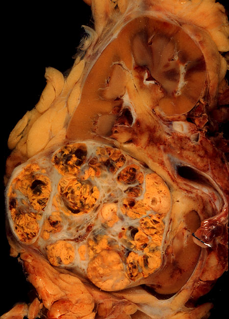
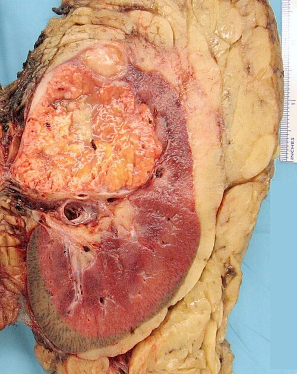

# TUMORES RENAIS: CARCINOMA DE CÉLULAS RENAIS

O Carcinoma de Células Renais (CCR) representa cerca de 3% de todas as neoplasias malignas do adulto e impressionantes 90% de todos os tumores sólidos renais. Se você encontrar uma massa sólida no rim de um adulto em uma prova de residência, seu primeiro pensamento deve ser CCR.

Antigamente, o diagnóstico era feito pela clínica. Hoje, vivemos a era do "incidentaloma". Com o uso disseminado da ultrassonografia e da tomografia para investigar dores abdominais inespecíficas, descobrimos tumores cada vez menores e assintomáticos. Isso mudou drasticamente o prognóstico e a forma como operamos esses pacientes.

## Anatomia Aplicada e Hilo Renal

Antes de falarmos do tumor, precisamos revisar a anatomia que as bancas amam cobrar, especialmente em questões de técnica cirúrgica. O rim está localizado no espaço retroperitoneal, envolto pela gordura perirrenal e contido pela **Fáscia de Gerota**.

O ponto mais cobrado em anatomia urológica é a organização do **Hilo Renal**. Memorize esta sequência de **Posterior para Anterior**:

- **P**elve Renal (mais posterior)

- **A**rtéria Renal

- **V**eia Renal (mais anterior)

O mnemônico **PAV** (Pelve, Artéria, Veia) salva vidas em provas de anatomia topográfica. Lembre-se também que a veia renal esquerda é mais longa que a direita (pois precisa cruzar a aorta) e recebe a veia gonadal esquerda e a veia adrenal esquerda. Isso explica por que um tumor renal à esquerda com trombo venoso pode causar varicocele súbita à esquerda — uma "pérola" clássica de exame físico.

## Epidemiologia e Fatores de Risco

O CCR é uma doença predominantemente de homens (proporção 2:1) e ocorre tipicamente entre a 6ª e 7ª décadas de vida.

Por que o paciente desenvolve esse tumor? O principal fator de risco evitável é o **tabagismo**, que dobra o risco de CCR. Outros fatores cruciais incluem:

- **Obesidade:** Existe uma relação direta entre o IMC elevado e o risco de CCR, possivelmente por alterações hormonais e resistência insulínica.

- **Hipertensão Arterial (HAS):** Independentemente do uso de medicamentos, a HAS é um fator de risco isolado.

- **Doença Renal Cística Adquirida:** Pacientes em diálise crônica desenvolvem cistos nos rins atróficos; esses cistos têm um risco muito maior de malignização.

### Genética e Síndrome de Von Hippel-Lindau (VHL)

Embora a maioria dos casos seja esporádica, as formas hereditárias caem muito em prova. A principal é a **Síndrome de Von Hippel-Lindau (VHL)**.

- **A genética:** Mutação no gene supressor de tumor VHL no braço curto do **cromossomo 3 (3p25)**.

- **O que o aluno MedEvo precisa saber:** O paciente com VHL desenvolve CCR do tipo células claras (geralmente múltiplos e bilaterais), hemangioblastomas no sistema nervoso central e retina, e feocromocitomas.

Se a questão mencionar um paciente jovem com tumor renal bilateral e cistos pancreáticos, não pense duas vezes: Von Hippel-Lindau.

## Histopatologia: O que o patologista vê

O CCR não é uma doença única, mas um grupo de tumores com comportamentos diferentes. A classificação histológica é fundamental para o prognóstico.

| Tipo Histológico | Frequência | Origem Celular | Características de Prova |
| --- | --- | --- | --- |
| **Células Claras** | 75-80% | Túbulo Contorcido Proximal | Mais comum; citoplasma claro (rico em glicogênio/lipídios); associado à perda do 3p. |
| **Papilífero** | 10-15% | Túbulo Contorcido Proximal | Frequentemente multifocal e bilateral; melhor prognóstico que o de células claras. |
| **Cromófobo** | 5% | Células Intercaladas do Ducto Coletor | Melhor prognóstico de todos; células grandes com membranas proeminentes. |
| **Ductos Coletores (Bellini)** | < 1% | Ducto Coletor | Extremamente agressivo; acomete pacientes mais jovens; péssimo prognóstico. |

**Cuidado:** Muitos alunos confundem o CCR com o **Oncocitoma**. O oncocitoma é um tumor **benigno**, caracterizado por células eosinofílicas granulares e, muitas vezes, uma cicatriz central na TC. O problema? A imagem não consegue diferenciar com 100% de certeza um oncocitoma de um CCR cromófobo. Por isso, na dúvida cirúrgica, tratamos como se fosse maligno.

## Quadro Clínico e Síndromes Paraneoplásicas

A famosa **Tríade Clássica de Guyon** (Hematúria + Dor no flanco + Massa palpável) é encontrada em menos de 10% dos pacientes hoje em dia. Quando presente, geralmente indica doença avançada.

O CCR é conhecido como "o tumor do internista" devido à frequência de **síndromes paraneoplásicas** (presentes em até 30% dos casos):

- **Eritrocitose:** Pela produção ectópica de eritropoietina (EPO).

- **Hipercalcemia:** Pela produção de proteína relacionada ao paratormônio (PTHrP). Esta é a síndrome paraneoplásica mais comum.

- **Síndrome de Stauffer:** Disfunção hepática não metastática (elevação de enzimas hepáticas e alargamento do TAP sem metástase hepática visível), que reverte após a nefrectomia.

- **Hipertensão:** Pela produção de renina.

**Exemplo Clínico:** Paciente de 62 anos, tabagista, apresenta-se com perda ponderal e hematúria intermitente. Ao exame, apresenta varicocele à esquerda que não reduz ao decúbito.

- **O que isso significa?** A varicocele que não reduz sugere obstrução da veia gonadal esquerda por um trombo tumoral na veia renal esquerda. Isso é um sinal indireto de CCR avançado.

## Diagnóstico por Imagem

O padrão-ouro para o diagnóstico e estadiamento é a **Tomografia Computadorizada (TC) de Abdome e Pelve com contraste**.

O critério radiológico de malignidade em uma massa sólida é o **realce pelo contraste**. Medimos a densidade em Unidades Hounsfield (HU). Se após a injeção do contraste a lesão aumentar sua densidade em mais de **15 a 20 HU**, ela é considerada suspeita de CCR.

### A Ressonância Magnética (RM)

Quando usamos a RM?

- Pacientes com alergia ao contraste iodado ou insuficiência renal.

- **Suspeita de trombo em veia cava:** A RM é superior à TC para definir a extensão cranial do trombo tumoral, o que é crucial para o planejamento cirúrgico (se o cirurgião precisará abrir o tórax ou apenas o abdome).

### Classificação de Bosniak (Cistos Renais)

Nem toda massa renal é sólida. Muitas são císticas. Para decidir se operamos um cisto, usamos a Classificação de Bosniak:

| Categoria | Descrição | Risco de Malignidade | Conduta |
| --- | --- | --- | --- |
| **I** | Cisto simples, parede fina, sem septos ou realce. | 0% | Nada a fazer (Alta). |
| **II** | Cistos com poucos septos finos, calcificações finas. | < 5% | Nada a fazer (Alta). |
| **IIF** | Mais septos, parede levemente espessa, sem realce nodular. | ~5-25% | Seguimento (Follow-up) com imagem. |
| **III** | Paredes ou septos espessos e irregulares com realce. | ~50% | Cirurgia (Nefrectomia Parcial). |
| **IV** | Componentes sólidos que realçam ao lado do cisto. | > 90% | Cirurgia (Nefrectomia). |

**Dica de Prova:** Bosniak III e IV são cirúrgicos. Bosniak I e II são benignos. O "F" do IIF vem de *Follow-up*.

## Biópsia Renal Percutânea: Quando fazer?

Diferente de outros cânceres (como mama ou próstata), **não fazemos biópsia de rotina** para massas renais suspeitas. Por quê? Porque se a imagem é clássica de CCR e o tratamento é cirúrgico, a biópsia não mudaria a conduta e ainda teria risco de falso-negativo.

Segundo as diretrizes da SBU e Dr. Will, a biópsia está indicada em:

- Massas pequenas em pacientes candidatos à **Vigilância Ativa**.

- Antes de terapias ablativas (Crioterapia ou Radiofrequência).

- Suspeita de metástase renal de outro tumor primário (ex: pulmão, linfoma).

- Massa renal em paciente com infecção ativa (suspeita de abscesso).

## Estadiamento TNM (Simplificado para Prova)

O estadiamento dita o tratamento. O ponto de corte mágico é **7 cm**.

- **T1:** Limitado ao rim, ≤ 7 cm.

- **T1a:** ≤ 4 cm (O "queridinho" das provas para nefrectomia parcial).

- **T1b:** > 4 cm e ≤ 7 cm.

- **T2:** Limitado ao rim, > 7 cm.

- **T3:** Extensão para veias renais ou gordura perirrenal (sem ultrapassar a Fáscia de Gerota).

- **T3a:** Gordura perirrenal ou seio renal.

- **T3b:** Trombo na veia cava abaixo do diafragma.

- **T4:** Ultrapassa a Fáscia de Gerota ou invade a glândula adrenal ipsilateral (por contiguidade).

## Tratamento do Carcinoma de Células Renais

O tratamento do CCR localizado é essencialmente **cirúrgico**. Este tumor é notoriamente resistente à radioterapia e quimioterapia convencional.

### 1. Nefrectomia Parcial (Cirurgia de Preservação de Néfrons)

É o padrão-ouro para tumores **T1a (≤ 4 cm)**.

- **Por que fazemos parcial?** Para preservar a função renal a longo prazo e reduzir o risco cardiovascular. Estudos mostram que pacientes com dois rins vivem mais do que aqueles que ficam com apenas um, mesmo que o rim remanescente seja saudável.

- **Pode ser feita em T1b?** Sim, se a localização do tumor permitir (exofítico) e o cirurgião for experiente.

### 2. Nefrectomia Radical

Consiste na retirada do rim, gordura perirrenal e fáscia de Gerota.

- **Indicação:** Tumores T2 ou tumores T1 que são centralizados (hilares), onde a nefrectomia parcial é tecnicamente impossível ou arriscada.

- **Adrenalectomia:** Só é feita se houver suspeita de invasão da adrenal por imagem ou durante a cirurgia. Não é mais obrigatória em toda nefrectomia radical.

### 3. Vigilância Ativa

Reservada para idosos com múltiplas comorbidades e massas renais pequenas (< 3 cm). Como o CCR de pequenas dimensões cresce lentamente (cerca de 0,3 cm/ano), o paciente muitas vezes morre *com* o tumor e não *pelo* tumor.

### 4. Tratamento da Doença Metastática

O CCR metastático é tratado com **Imunoterapia** (Inibidores de Checkpoint como Pembrolizumabe, Nivolumabe) associada ou não a **Terapia Alvo** (Inibidores de Tirosina Quinase como Axitinibe, Cabozantinibe).

**Nefrectomia Citorredutora:** Em pacientes com metástases, ainda podemos indicar a retirada do rim primário se o paciente tiver bom status performance. Isso ajuda a reduzir a carga tumoral e melhora a resposta à imunoterapia.

## Diagnóstico Diferencial de Massas Renais

Nem tudo que brilha é ouro, e nem toda massa renal é CCR.

-

**Angiomiolipoma (AML):** Tumor benigno composto por vasos, músculo liso e **gordura**.

- **Dica de Prova:** A presença de gordura (densidade negativa, < -20 HU) na TC é patognomônica de AML.

- **Risco:** Ruptura e hemorragia retroperitoneal (Síndrome de Wünderlich).

- **Quando tratar?** Se > 4 cm, sintomas, ou mulheres em idade fértil (pelo risco de crescimento na gestação).

-

**Oncocitoma:** Já mencionamos. Benigno, mas indistinguível do CCR por imagem.

-

**Carcinoma de Células Transicionais (Urotelial):** Origina-se na pelve renal, não no parênquima. Associado a tabagismo e exposição a corantes. Causa hematúria precoce e falha de enchimento na uro-TC.

-

**Abscesso Renal:** Paciente com febre, calafrios e dor lombar. A imagem mostra uma coleção com realce periférico.

## Situações Especiais e Complicações

### Trombo Tumoral em Veia Cava

O CCR tem uma característica peculiar: ele gosta de invadir vasos. O tumor pode crescer "dedo de luva" para dentro da veia renal e subir pela veia cava, chegando às vezes até o átrio direito.

- **Tratamento:** Cirúrgico! Mesmo com trombo na cava, se não houver metástases à distância, a cirurgia (Nefrectomia Radical + Trombectomia) oferece chance de cura.

### Trauma Renal e Massas

Às vezes, um trauma abdominal revela um tumor renal (achado incidental). No trauma, a classificação da AAST foca na lesão. Se houver comprometimento vascular segmentar ou trombose, é Grau IV. Se o rim estiver estilhaçado ou o hilo avulsionado, é Grau V. Paciente estável no trauma renal = manejo conservador. Instável = Laparotomia.

## Resumo de Condutas por Tamanho da Lesão

| Tamanho/Tipo | Conduta Preferencial | Justificativa |
| --- | --- | --- |
| **< 4 cm (T1a)** | Nefrectomia Parcial | Preservação de função renal. |
| **4 - 7 cm (T1b)** | Nefrectomia Parcial ou Radical | Depende da localização (exofítico vs central). |
| **> 7 cm (T2)** | Nefrectomia Radical | Segurança oncológica. |
| **Cisto Bosniak III/IV** | Nefrectomia Parcial/Radical | Alto risco de malignidade oculta. |
| **Angiomiolipoma > 4 cm** | Embolização ou Nefrectomia Parcial | Risco de sangramento espontâneo. |

## Pontos-Chave para Prova 🎯

- **Hilo Renal (PAV):** Pelve (posterior), Artéria (média), Veia (anterior). Não erre a ordem!

- **Tipo Histológico:** Células Claras é o mais comum (80%). Origem: Túbulo contorcido proximal.

- **Tríade de Guyon:** Hematúria + Dor + Massa. É rara e sinal de doença avançada.

- **Padrão-ouro Diagnóstico:** TC de abdome e pelve com contraste (Realce > 15-20 HU).

- **Nefrectomia Parcial:** É a conduta de escolha para tumores T1a (< 4 cm).

- **Bosniak III e IV:** São considerados malignos até que se prove o contrário; conduta é cirúrgica.

- **Angiomiolipoma:** Procure por "gordura" ou "densidade negativa" na TC. Tratar se > 4 cm.

- **Síndrome de Von Hippel-Lindau:** Deleção do cromossomo 3p. CCR bilateral e multicêntrico.

- **Metástase:** O local mais comum de metástase do CCR é o **Pulmão**.

- **Síndrome de Stauffer:** Elevação de enzimas hepáticas sem metástase hepática. É paraneoplásica.

- **Biópsia Renal:** NÃO é necessária se a imagem for típica e o paciente for para cirurgia.

- **Varicocele Súbita à Esquerda:** Suspeite de tumor renal com trombo em veia renal esquerda.

- **O que NÃO fazer:** Não peça citologia oncótica urinária para investigar massa renal sólida (ela serve para tumores de urotélio, não de parênquima).

- **Contraindicação Absoluta à Nefrectomia Parcial:** Tumor que envolve todo o hilo renal, impedindo a preservação de vasos segmentares.

- **Tratamento de escolha para CCR com trombo de cava:** Nefrectomia radical com trombectomia cirúrgica (não é quimioterapia!).

 Cópia offline para consulta pessoal.
 Fonte original:
 [https://www.medevo.com.br/material-apoio/ler/59089882-2692-4f9e-8b31-663a2a56aba3](https://www.medevo.com.br/material-apoio/ler/59089882-2692-4f9e-8b31-663a2a56aba3)
