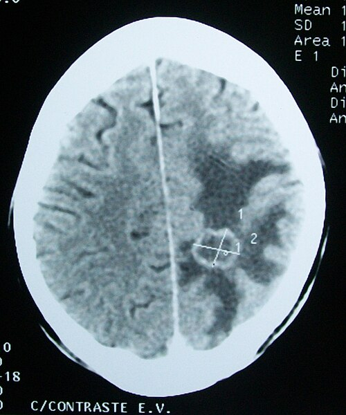

# TUMORES SÓLIDOS FREQUENTES

Para entender a oncologia clínica voltada para as provas de residência, você precisa parar de tentar decorar nomes de quimioterápicos e focar no que realmente define a conduta: **estadiamento e biologia tumoral**. As bancas não querem que você seja um oncologista, mas que saiba quando suspeitar, como diagnosticar e qual o próximo passo lógico na linha de cuidado.

## Epidemiologia e Princípios de Diagnóstico

O câncer não é uma doença única, mas um conjunto de desregulações genéticas. No Brasil, segundo o INCA, excetuando-se o câncer de pele não melanoma, o câncer de próstata lidera em homens e o de mama em mulheres. No entanto, para sua prova, os tumores do aparelho digestivo (cólon, estômago, pâncreas) e o de pulmão são os "queridinhos" devido à complexidade do estadiamento.

Um conceito fundamental que o **MedEvo** sempre reforça: a neoplasia maligna mais comum em adultos, estatisticamente falando, é o **tumor metastático**, e não o primário de um órgão específico. Se você encontrar múltiplas lesões em um exame de imagem, a disseminação hematogênica é a explicação fisiopatológica mais provável.

## Marcadores Tumorais: Onde o aluno escorrega

Muitos alunos acham que marcador tumoral serve para diagnóstico. **Erro clássico.** Salvo raras exceções (como o PSA na próstata ou a Alfafetoproteína no Hepatocarcinoma em contextos específicos), marcadores servem para **prognóstico e acompanhamento**.

- **CEA:** Marcador do câncer colorretal. Se estiver muito alto no pré-operatório, o prognóstico é pior. Se cair após a cirurgia e subir depois, indica recidiva.

- **CA 19-9:** Associado ao pâncreas e vias biliares. Cuidado: ele sobe em qualquer colestase benigna! Não feche diagnóstico de câncer de pâncreas só com CA 19-9 elevado.

- **Alfafetoproteína (AFP):** Sugere Hepatocarcinoma (CHC) ou tumores germinativos.

- **CA-125:** Clássico do câncer de ovário, mas cuidado com as causas benignas de elevação: endometriose, DIP, gravidez e até insuficiência cardíaca (por irritação peritoneal/pleural).

## Câncer de Esôfago: O Duelo de Histologias

Aqui a banca vai testar se você sabe diferenciar o perfil do paciente. Temos dois tipos principais que brigam pelo protagonismo.

### Carcinoma Espinocelular (CEC) vs. Adenocarcinoma

O CEC é o tumor do "passado" que ainda é muito presente no Brasil. Ele ocorre no **esôfago médio** e está ligado ao tabagismo, etilismo e ingestão de líquidos muito quentes. Já o Adenocarcinoma é o tumor do "estilo de vida ocidental", localizado no **esôfago distal**, intimamente ligado ao refluxo gastroesofágico (DRGE) e ao **Esôfago de Barrett**.

| Característica | Carcinoma Espinocelular (CEC) | Adenocarcinoma |
| --- | --- | --- |
| Localização | Terço médio | Terço distal / Transição (JEG) |
| Fatores de Risco | Tabaco, Álcool, Acalasia, Tilose | DRGE, Barrett, Obesidade |
| Lesão Precursora | Displasia escamosa | Metaplasia intestinal (Barrett) |
| Incidência | Estável/Reduzindo | Em ascensão |

**Dica de prova:** Se a questão citar um paciente com história de ingestão de soda cáustica há 20 anos, pense em CEC. Se citar um paciente obeso com pirose crônica, pense em Adenocarcinoma.

### Estadiamento e Conduta

O esôfago não tem serosa (exceto na porção abdominal). Isso facilita a disseminação local. O exame padrão-ouro para o T (tumor) e o N (linfonodo) local é a **Ecoendoscopia (Ultrassom Endoscópico)**. Se o tumor for T1a (limitado à mucosa), podemos pensar em ressecção endoscópica. Se invadir a muscular (T2 em diante), o tratamento padrão envolve neoadjuvância (quimio e radio) seguida de esofagectomia.

## Câncer Gástrico: A Lógica de Lauren

O adenocarcinoma gástrico é um dos temas mais cobrados. Para entender a conduta, você precisa dominar a **Classificação de Lauren**, que divide os tumores em Intestinal e Difuso.

### Tipo Intestinal vs. Tipo Difuso

O tipo **Intestinal** é o mais comum em idosos, homens, e está ligado a fatores ambientais (H. pylori, dieta rica em defumados e nitratos, gastrite atrófica). Ele forma glândulas e tem disseminação hematogênica.

O tipo **Difuso** é o "vilão". Ocorre em pacientes mais jovens, tem relação com a genética (mutação da **E-caderina/CDH1**) e apresenta as famosas **células em anel de sinete**. Ele não forma glândulas, infiltra a parede do estômago deixando-a rígida — a famosa **Linitis Plastica** (estômago em "garrafa de couro"). Sua disseminação é preferencialmente linfática e peritoneal.

**Exemplo Clínico:** Paciente de 45 anos, com perda ponderal e saciedade precoce. EDA mostra estômago com pouca distensibilidade e mucosa infiltrada. Biópsia: células em anel de sinete. Diagnóstico: Câncer gástrico difuso. Conduta: Pesquisar mutação CDH1 na família e, se confirmado caráter hereditário, a gastrectomia total profilática é indicada.

### Pérolas de Estadiamento Gástrico

- **Linfonodo de Virchow:** Supraclavicular esquerdo. Indica doença metastática (M1).

- **Prateleira de Blumer:** Metástase no fundo de saco de Douglas (toque retal).

- **Linfonodo de Sister Mary Joseph:** Metástase umbilical.

- **Tumor de Krukenberg:** Metástase ovariana (comum no tipo difuso).

O tratamento curativo exige **Gastrectomia com Linfadenectomia D2**. O que é D2? É a retirada dos linfonodos das cadeias perigástricas e dos vasos do tronco celíaco (incluindo o **linfonodo gástrico 7**, que fica na artéria gástrica esquerda). Segundo as diretrizes brasileiras, a neoadjuvância é cada vez mais utilizada para tumores a partir de T2 ou N+.

## Câncer de Pâncreas: O Diagnóstico do "Amarelo Pouco Sintomático"

O adenocarcinoma de pâncreas (90% dos casos) é silencioso. Quando o paciente fica ictérico, o tumor geralmente está na **cabeça do pâncreas**.

### Quadro Clínico e Sinal de Courvoisier

A tríade clássica é: Icterícia obstrutiva progressiva + Perda de peso + Dor abdominal (que melhora com a **atitude em prece maometana**). O sinal de **Courvoisier-Terrier** (vesícula biliar palpável e indolor) é patognomônico de obstrução maligna da ampola de Vater ou cabeça de pâncreas.

**Cuidado com a pegadinha:** Nem toda lesão no pâncreas é adenocarcinoma.

- **Neoplasia Cística Serosa:** Aspecto em "favo de mel" com cicatriz central. É benigna!

- **IPMN:** Comunica-se com o ducto pancreático principal. Potencial de malignidade.

### Tratamento: O Desafio da Ressecabilidade

A cirurgia de escolha para tumores de cabeça é a **Duodenopancreatectomia (Cirurgia de Whipple)**. Mas atenção: apenas 20% são ressecáveis ao diagnóstico. Se houver invasão da artéria mesentérica superior ou do tronco celíaco > 180 graus, o tumor é considerado irressecável. Nesses casos, fazemos cirurgia paliativa (derivação biliodigestiva e gastroenteroanastomose) para aliviar a icterícia e a obstrução duodenal.

## Tumores Hepáticos e de Vias Biliares

No fígado, o **Hepatocarcinoma (CHC)** reina. Ele quase sempre surge em um fígado cirrótico (Child-Pugh é fundamental aqui).

### Critérios de Milão e CLIP

Para decidir se o paciente com CHC vai para transplante, usamos os **Critérios de Milão**:

- Lesão única < 5cm OU

- Até 3 lesões, todas < 3cm.

Já o **Escore CLIP** é usado para prognóstico, levando em conta a função hepática (Child), a extensão do tumor (se > 50% do fígado, pontua mais), a alfafetoproteína e a presença de trombose portal. Para tumores avançados, o **Sorafenibe** (um inibidor de tirosina quinase) é a terapia sistêmica padrão.

### Colangiocarcinoma e Tumor de Klatskin

O colangiocarcinoma é o tumor das vias biliares. O **Tumor de Klatskin** é o tumor hilar (na junção dos ductos hepáticos direito e esquerdo). Ele se manifesta com icterícia obstrutiva e vesícula murcha (já que a obstrução está acima do ducto cístico). O tratamento envolve ressecção radical e, muitas vezes, hepatectomia.

## Câncer Colorretal (CCR): Do Pólipo ao Tumor

O CCR segue a sequência adenoma-carcinoma. O gene **DCC** (Deleted in Colorectal Cancer) e o **APC** são peças-chave nessa evolução.

### Síndromes Hereditárias

- **Polipose Adenomatosa Familiar (PAF):** Milhares de pólipos. Risco de câncer é de 100%. Conduta: Colectomia profilática.

- **Síndrome de Lynch:** Câncer colorretal não poliposo. Associado a tumores de endométrio, ovário e estômago. Se um paciente com Lynch desenvolve câncer de cólon, a diretriz sugere **colectomia total com íleo-retoanastomose**, devido ao alto risco de tumores sincrônicos e metacrônicos.

### Localização e Sintomas

- **Cólon Direito:** O lúmen é largo e as fezes são líquidas. O tumor cresce e sangra. Sintoma: Anemia ferropriva e massa palpável.

- **Cólon Esquerdo:** O lúmen é estreito e as fezes são sólidas. Sintoma: Alteração do hábito intestinal e obstrução.

- **Reto:** Sintoma: Hematoquezia e tenesmo.

**Tratamento do Câncer de Reto:** Aqui o **Dr. Will** faz um alerta: o reto é diferente do cólon. Para tumores de reto médio e baixo que invadem a gordura perirretal (T3) ou têm linfonodos positivos (N+), a **Neoadjuvância (Quimio + Radio)** é OBRIGATÓRIA antes da cirurgia para reduzir a recidiva local e tentar preservar o esfíncter.

## GIST: O Tumor Estromal Gastrointestinal

O GIST não é um adenocarcinoma. Ele nasce das **Células Intersticiais de Cajal** (o marcapasso do intestino).

- **Marcador:** CD117 (c-kit) positivo em 95% dos casos.

- **Comportamento:** Disseminação hematogênica (fígado é o alvo principal). Metástases linfonodais são raríssimas.

- **Conduta:** Ressecção cirúrgica com margens, mas **NÃO precisa de linfadenectomia**.

- **Tratamento Sistêmico:** Imatinibe (Glivec) para casos de alto risco ou metastáticos.

## Carcinoma Diferenciado de Tireoide (CDT)

O CDT inclui o Papilar e o Follicular.

- **Papilar:** Mais comum (80%), excelente prognóstico, disseminação linfática. Diagnóstico por PAAF (corpos psamomatosos).

- **Folicular:** Disseminação hematogênica. O diagnóstico **não pode ser feito por PAAF**, pois a PAAF não diferencia adenoma folicular de carcinoma (precisa ver invasão de cápsula ou vasos na peça cirúrgica).

O tratamento baseia-se em tireoidectomia (total ou parcial dependendo do risco) seguida, se necessário, de **Radioiodoterapia**. Por que iodo? Porque as células foliculares da tireoide são as únicas que captam iodo avidamente.

## Emergências Oncológicas e Síndromes Paraneoplásicas

As bancas adoram cobrar a **Síndrome da Veia Cava Superior (SVCS)**. Geralmente causada por câncer de pulmão ou linfoma.

- **Quadro:** Edema de face e pescoço ("edema em escravina"), turgência jugular e circulação colateral no tórax superior.

- **Cuidado:** A SVCS envolve a veia cava superior. Se a questão falar em edema de membros inferiores e veia cava inferior, está errado.

### Compressão Medular Metastática

É uma emergência médica. O paciente com câncer conhecido abre quadro de dor dorsal intensa e déficit motor/sensorial.

- **Conduta imediata:** Corticoide em altas doses (Dexametasona) para reduzir o edema e RM de coluna total.

### Síndrome Carcinoide

Ocorre em tumores neuroendócrinos (especialmente de íleo) que metastatizam para o fígado.

- **Sintomas:** Flushing facial, diarreia e lesões valvares cardíacas (lado direito).

- **Por que só com metástase hepática?** Porque se o tumor estiver apenas no intestino, o fígado metaboliza a serotonina antes dela chegar na circulação sistêmica. Quando há metástase hepática, a serotonina cai direto na veia hepática e ganha o corpo.

## Tabelas Comparativas para Revisão Rápida

### Tabela 1: Diagnóstico Diferencial de Lesões Císticas Pancreáticas

| Tipo de Cisto | Características de Imagem | Conduta Sugerida |
| --- | --- | --- |
| **Cistoadenoma Seroso** | Microcístico, favo de mel, cicatriz central | Observação (benigno) |
| **Cistoadenoma Mucinoso** | Macrocístico, corpo/cauda, não comunica ducto | Ressecção (pré-maligno) |
| **IPMN** | Comunica com ducto principal ou ramos | Avaliar critérios de risco |
| **Pseudocisto** | História de pancreatite prévia | Drenagem se sintomático |

### Tabela 2: Estadiamento TNM Simplificado (Princípios Gerais)

| Estágio | Definição Geral | Conduta Típica |
| --- | --- | --- |
| **T1-T2 N0** | Doença localizada, invasão superficial | Cirurgia primária |
| **T3-T4 ou N+** | Doença localmente avançada | Neoadjuvância + Cirurgia |
| **M1** | Doença metastática | Paliativo (Quimio/Sintomáticos) |

### Tabela 3: Marcadores Tumorais e suas Armadilhas

| Marcador | Uso Principal | Falso Positivo Comum |
| --- | --- | --- |
| **PSA** | Próstata | Prostatite, HPB, Ciclismo, Toque retal |
| **CA-125** | Ovário | Endometriose, DIP, Ascite, Pericardite |
| **AFP** | CHC / Germinativo | Cirrose, Hepatite aguda |
| **CA 19-9** | Pâncreas / Vias Biliares | Colelitíase, Icterícia obstrutiva benigna |

## Pontos-Chave para Prova

- **Linitis Plastica:** É o câncer gástrico difuso. O estômago fica rígido. Pense em células em anel de sinete e mutação da E-caderina.

- **GIST:** Origem nas células de Cajal. CD117+. Não faz linfadenectomia. Imatinibe é o tratamento de escolha para doença avançada.

- **Câncer de Esôfago:** CEC (terço médio, álcool/tabaco) vs. Adenocarcinoma (terço distal, Barrett/refluxo).

- **Sinal de Courvoisier:** Vesícula palpável e indolor + icterícia = Câncer de cabeça de pâncreas até que se prove o contrário.

- **Síndrome Carcinoide:** Só ocorre com metástase hepática (ou tumores extra-portais como pulmão). O sintoma clássico é o flushing e diarreia.

- **Hepatocarcinoma:** O diagnóstico pode ser feito apenas por imagem (TC ou RM com contraste) se houver o padrão de **washout** (realce na fase arterial e clareamento na fase portal) em fígado cirrótico.

- **Câncer de Reto:** T3 ou N+ exige Neoadjuvância. Não opere reto avançado de cara!

- **Linfonodo de Virchow:** Supraclavicular esquerdo. Indica que o câncer abdominal (geralmente gástrico) já "ganhou o mundo" (M1).

- **Metástase Pulmonar:** Se houver mais de 4 lesões de origem colorretal, o prognóstico de sobrevida em 5 anos cai drasticamente.

- **Câncer de Vesícula:** Frequentemente achado incidental em colecistectomias. Se T2 ou mais, exige reoperação para ampliar margem (hepatectomia em cunha e linfadenectomia).

- **Contraindicação Absoluta para Cirurgia Curativa:** Presença de metástases à distância (M1), ascite carcinomatosa ou invasão de estruturas vasculares vitais irressecáveis.

- **Linfoma MALT Gástrico:** Associado ao H. pylori. O tratamento inicial pode ser apenas a erradicação da bactéria!

- **Insulinoma:** Tríade de Whipple (hipoglicemia, sintomas adrenérgicos e melhora com glicose).

- **VIPoma:** Síndrome de Verner-Morrison (diarreia aquosa, hipocalemia e acloridria).

Lembre-se: na prova, se o paciente tem um tumor sólido e a questão pergunta "qual o próximo passo", a resposta quase sempre passa por completar o estadiamento (TC de Tórax, Abdome e Pelve) antes de qualquer incisão cirúrgica. O **MedEvo** ensina que operar um paciente M1 achando que é localizado é o erro que a banca mais gosta de punir.

 Cópia offline para consulta pessoal.
 Fonte original:
 [https://www.medevo.com.br/material-apoio/ler/4334d260-7231-4539-b621-f3b53380dc5f](https://www.medevo.com.br/material-apoio/ler/4334d260-7231-4539-b621-f3b53380dc5f)
