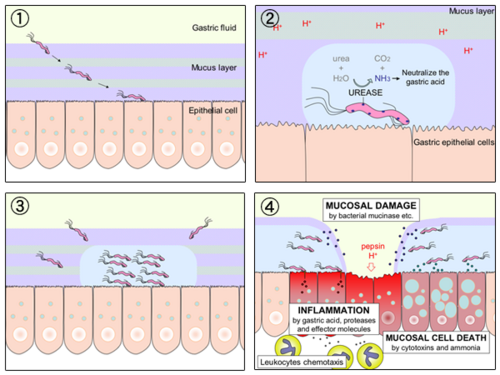
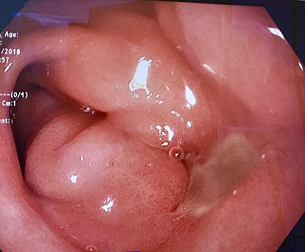

# ÚLCERA PÉPTICA COMPLICADA

Para entender a úlcera péptica complicada, você precisa primeiro esquecer a ideia de que "toda úlcera é igual". Na prova de residência e na vida real, o que define se você vai apenas dar um bloqueador de bomba de prótons (IBP) ou se vai levar o paciente para o centro cirúrgico é a **localização** e o **comportamento ácido** daquela úlcera.

Antigamente, operávamos muito mais. Com o advento dos IBPs e a descoberta do *H. pylori*, a cirurgia eletiva de úlcera quase desapareceu. No entanto, as **complicações** continuam chegando no pronto-socorro, e é aqui que as bancas de residência concentram 90% das questões.

## A Base de Tudo: Classificação de Johnson

Se você não souber a Classificação de Johnson, você vai errar a conduta cirúrgica. As bancas amam isso porque ela separa as úlceras pelo mecanismo fisiopatológico (hipersecreção ácida vs. falha de barreira).

| Tipo de Úlcera | Localização | Fisiopatologia |
| --- | --- | --- |
| **Tipo I** | Pequena curvatura (baixa) | Hipocloridria (falha na defesa da mucosa) |
| **Tipo II** | Corpo gástrico + Úlcera Duodenal | Hipercloridria (excesso de ácido) |
| **Tipo III** | Pré-pilórica (até 3cm do piloro) | Hipercloridria (excesso de ácido) |
| **Tipo IV** | Pequena curvatura (alta, perto da cárdia) | Hipocloridria (falha na defesa) |
| **Tipo V** | Qualquer lugar | Relacionada ao uso de AINEs |

**Dica de Ouro do Dr. Will:** Guarde que os tipos **II e III** são os "hipersecretores". Por que isso importa? Porque se há muito ácido, o tratamento cirúrgico **precisa** incluir uma vagotomia para cortar o estímulo ácido. Nas úlceras tipo I e IV, o problema não é o excesso de ácido, mas a mucosa que está fraca; logo, a vagotomia é geralmente desnecessária.

## Perfuração: O Abdome Agudo Perfurativo

A perfuração é a complicação que mais mata na doença ulcerosa. O cenário clássico de prova é: paciente masculino, tabagista, usuário crônico de AINEs para dor articular, que apresenta dor epigástrica súbita, "em facada", que rapidamente se torna generalizada.

### O Quadro Clínico e o Exame Físico

Ao examinar esse paciente, você encontrará o **abdome em tábua**. A descompressão dolorosa será positiva (sinal de peritonite).

**Pegadinha de Prova:** O sinal de Jobert. É o desaparecimento da macicez hepática à percussão, sendo substituída por timpanismo devido ao pneumoperitoneo. Se a questão citar "Sinal de Jobert presente", ela está gritando "perfuração de víscera oca".

### Diagnóstico por Imagem

O primeiro exame é a rotina de abdome agudo (Rx de tórax em pé, Rx de abdome em pé e deitado). O que buscamos? O **pneumoperitôneo** (ar subdiafragmático).

**Cuidado:** Se o Rx vier normal, isso exclui perfuração? **Não!** Cerca de 15-20% das perfurações não mostram ar no Rx inicial. Se a suspeita clínica for alta e o Rx for negativo, o próximo passo é a Tomografia Computadorizada (TC) de abdome com contraste oral (que mostrará o extravasamento) ou apenas a TC sem contraste, que é muito mais sensível para pequenas quantidades de ar livre.

### Conduta na Perfuração

Aqui o MedEvo te ensina a pensar como o cirurgião:

- **Estabilização:** Jejum, hidratação venosa, IBP venoso e antibioticoterapia de amplo espectro (cobrindo gram-negativos e anaeróbios).

- **Cirurgia de Emergência:** A regra é operar.

- **Úlcera Duodenal Perfurada:** A conduta padrão é a **Ulcerorrafia com Patch de Graham** (tamponamento com omento) + Lavagem exaustiva da cavidade.

- **Por que não fazemos vagotomia para todo mundo na emergência?** Porque o paciente está infectado, inflamado e instável. O objetivo é salvar a vida (fechar o furo), não tratar a doença ácida de forma definitiva naquele momento.

- **Exceção:** Se o paciente estiver estável, sem peritonite generalizada, e a úlcera for crônica/refratária, pode-se considerar o tratamento definitivo (Vagotomia + Piloroplastia). Mas, para a prova, foque no Patch de Graham.

**Pérola Clínica:** Se a úlcera for gástrica tipo I (pequena curvatura) e perfurar, a conduta é a ulcerorrafia simples + biópsia. **Sempre biópsia a úlcera gástrica!** Por quê? Porque úlcera gástrica pode ser câncer (adenocarcinoma), enquanto úlcera duodenal quase nunca é maligna.

## Hemorragia Digestiva Alta (HDA) Refratária

A maioria das HDAs por úlcera para de sangrar com tratamento endoscópico e IBP. Mas você precisa saber quando a endoscopia falhou e o cirurgião precisa entrar em cena.

### Classificação de Forrest (O Guia do Risco)

As bancas adoram cobrar a conduta baseada no Forrest.

| Forrest | Aspecto da Úlcera | Risco de Ressangramento | Conduta Endoscópica |
| --- | --- | --- | --- |
| **Ia** | Sangramento em jato (arterial) | Altíssimo (90%) | Intervenção Obrigatória |
| **Ib** | Sangramento em "baba" (venoso) | Alto (10-30%) | Intervenção Obrigatória |
| **IIa** | Vaso visível não sangrante | Alto (40-50%) | Intervenção Obrigatória |
| **IIb** | Coágulo aderido | Intermediário (20-30%) | Considerar remoção/tratar |
| **IIc** | Hematina na base (ponto escuro) | Baixo (<10%) | Apenas IBP |
| **III** | Base clara (limpa) | Muito baixo (<5%) | Apenas IBP / Alta |

### Quando indicar Cirurgia na Hemorragia?

Você indicará cirurgia se:

- Falha endoscópica (duas tentativas sem sucesso em parar o sangramento).

- Instabilidade hemodinâmica persistente apesar da ressuscitação vigorosa (> 6 bolsas de sangue).

- Ressangramento após controle inicial.

- Sangramento arterial volumoso (Forrest Ia) que o endoscopista nem consegue visualizar a origem.

**Técnica Cirúrgica na HDA:**

- **Úlcera Duodenal:** Duodenotomia e sutura do vaso sangrante (geralmente a artéria gastroduodenal, que passa atrás do bulbo duodenal). Pode-se associar vagotomia e piloroplastia se o paciente permitir.

- **Úlcera Gástrica:** A melhor conduta é a **gastrectomia distal** incluindo a úlcera. Se você apenas suturar a úlcera gástrica, o risco de ela voltar a sangrar é muito alto.

## Obstrução de Saída Gástrica (Estenose Pilórica)

Esta é a complicação da úlcera crônica. Cicatrizes repetidas no piloro levam à estenose.

### O Quadro Clínico

O paciente chega com vômitos pós-prandiais tardios (ele vomita o jantar na manhã seguinte), contendo restos alimentares não digeridos. Ele apresenta perda de peso e desidratação.

### O Distúrbio Metabólico (Clássico de Prova!)

Devido aos vômitos repetidos de suco gástrico (rico em HCl), o paciente desenvolve:
**Alcalose Metabólica Hipoclorêmica e Hipocalêmica.**

**A Pegadinha da Acidúria Paradoxal:** O corpo tenta poupar sódio e água devido à desidratação. No túbulo renal, para reabsorver sódio, ele precisa excretar potássio ou hidrogênio. Como o potássio já está baixo, o rim começa a excretar H+ (ácido) para tentar segurar o sódio. Resultado: o paciente está em alcalose (sangue básico), mas a urina sai ácida. Isso cai muito em prova!

### Tratamento da Obstrução

- **Descompressão:** Sonda Nasogástrica (SNG) e lavagem gástrica.

- **Correção Metabólica:** Soro fisiológico 0,9% + Cloreto de Potássio (KCl).

- **Cirurgia:** Após estabilizar o paciente. A conduta é a **Antrectomia com Vagotomia Troncular**. Precisamos remover a área estenosada (antro/piloro) e tratar a causa ácida.

## Intratabilidade Clínica

O que é isso? É o paciente que, apesar de usar IBP em dose correta, erradicar o *H. pylori* e parar de usar AINEs, continua com a úlcera ativa ou com dor incapacitante por mais de **3 meses** (cuidado: algumas bancas antigas falavam em 6 meses, mas a tendência atual é 3 meses de falha terapêutica documentada por endoscopia).

Nesses casos, a cirurgia eletiva é indicada para tratar a hipersecreção ácida.

## As Técnicas Cirúrgicas: Entendendo o "Porquê"

Aqui é onde o aluno se desespera com os nomes. Vamos simplificar.

### 1. Vagotomias (Cortando o estímulo do nervo Vago)

- **Vagotomia Troncular (VT):** Corta os troncos do vago no esôfago distal. **Problema:** O vago também controla o esvaziamento do piloro. Se você corta o tronco, o piloro não abre mais. **Solução:** Toda VT *obrigatoriamente* precisa de um procedimento de drenagem (Piloroplastia ou Antrectomia).

- **Vagotomia Seletiva:** Corta os ramos para o estômago, preservando os ramos hepáticos e celíacos. Também precisa de drenagem. (Pouco usada hoje).

- **Vagotomia Gástrica Proximal (VGP) ou Superseletiva:** Corta apenas os ramos que inervam as células parietais (corpo e fundo). Preserva a inervação do antro e do piloro. **Vantagem:** Não precisa de procedimento de drenagem. É a mais fisiológica. **Desvantagem:** Maior taxa de recidiva da úlcera em mãos não experientes.

### 2. Reconstruções (Após retirar o antro - Antrectomia)

- **Billroth I (B-I):** Anastomose do estômago direto no duodeno (gastroduodenostomia). É a mais fisiológica, mas nem sempre é possível se houver muita tensão.

- **Billroth II (B-II):** O duodeno é fechado (vira um "fundo cego") e o estômago é anastomosado em uma alça de jejuno (gastrojejunostomia). Deixa uma "alça aferente". **Problema:** Maior incidência de dumping e gastrite alcalina.

- **Y de Roux:** O jejuno é cortado e anastomosado de forma que o suco biliar e pancreático encontre o alimento longe da boca do estômago. É a melhor técnica para evitar o refluxo biliar (gastrite alcalina).

## Complicações Pós-Operatórias (Síndromes Pós-Gastrectomia)

Você operou o paciente, ele sobreviveu, mas agora volta ao consultório com novos sintomas. Isso cai muito!

### 1. Síndrome de Dumping

Ocorre porque o estômago perdeu sua função de "reservatório" e o piloro (que controlava a saída) foi retirado ou inutilizado. O alimento cai de uma vez no intestino.

- **Dumping Precoce (15-30 min após comer):** O alimento hiperosmolar no jejuno "puxa" água do sangue para dentro da alça.

- **Sintomas:** Distensão abdominal, dor, diarreia, além de sintomas vasomotores (taquicardia, sudorese, palidez).

- **Tratamento:** Dieta fracionada, evitar líquidos durante as refeições, deitar após comer.

- **Dumping Tardio (1-3 horas após comer):** A chegada rápida de carboidratos no intestino causa um pico de glicemia, que gera um pico exagerado de insulina. A insulina limpa o açúcar do sangue rápido demais.

- **Sintomas:** Hipoglicemia reativa (sudorese, tremor, tontura).

- **Tratamento:** Diminuir carboidratos simples na dieta.

### 2. Gastrite Alcalina (Refluxo Biliar)

Ocorre principalmente no Billroth II. O conteúdo do duodeno (bile e suco pancreático) volta para o estômago e causa inflamação.

- **Sintoma Típico:** Dor epigástrica contínua que **NÃO melhora com vômitos** (diferente da obstrução da alça aferente) e não melhora com antiácidos.

- **Tratamento:** Converter a reconstrução para **Y de Roux**.

### 3. Síndromes da Alça (Exclusivas de Billroth II)

- **Síndrome da Alça Aferente:** A alça que traz a bile fica obstruída. A pressão aumenta. Quando o paciente vomita, ele vomita **bile pura** e a dor melhora subitamente.

- **Síndrome da Alça Eferente:** Obstrução da alça que leva o alimento. O paciente vomita alimento e bile.

### 4. Síndrome do Antro Retido

Se na cirurgia de Billroth II o cirurgião deixar um pedaço de mucosa do antro no coto duodenal que foi fechado, esse tecido continuará produzindo gastrina (estimulado pelo pH alcalino do duodeno). Isso causa úlceras recorrentes e graves.

## Resumo de Condutas por Tipo de Úlcera (Para a Prova)

| Localização | Cirurgia de Escolha | Justificativa |
| --- | --- | --- |
| **Duodenal** | VT + Piloroplastia (ou VGP) | Tratar hipersecreção |
| **Gástrica Tipo I** | Antrectomia + B-I | Remover a úlcera (risco de câncer) |
| **Gástrica Tipo II e III** | VT + Antrectomia + B-I/II | Tratar hipersecreção + remover úlcera |
| **Gástrica Tipo IV** | Gastrectomia Subtotal ou Gastrectomia de Csendes | Localização difícil, perto da cárdia |

## Tabela Comparativa: Vagotomias

| Técnica | Recidiva da Úlcera | Complicações (Dumping/Diarreia) | Necessita Drenagem? |
| --- | --- | --- | --- |
| **Troncular + Antrectomia** | Mínima (1%) | Alta | Sim |
| **Troncular + Piloroplastia** | Média (10%) | Média | Sim |
| **Gástrica Proximal (VGP)** | Alta (15%) | Mínima | Não |

## Pontos-Chave para Prova 🎯

- **Úlcera Duodenal:** A complicação mais comum é a hemorragia; a que mais perfura é a da parede anterior; a que mais sangra é a da parede posterior (artéria gastroduodenal).

- **Vagotomia Troncular + Antrectomia:** É a técnica com a **menor taxa de recidiva** para úlcera duodenal (cerca de 1%).

- **Úlcera Gástrica Tipo I:** A causa não é ácido, é falha de barreira. Por isso, a cirurgia é apenas a antrectomia, sem necessidade de vagotomia.

- **Perfuração < 3cm:** Patch de Graham (epiploplastia) é o padrão.

- **Perfuração > 3cm ou Úlcera Gigante:** Pode exigir uma conduta mais agressiva, como uma gastrectomia parcial, pois o fechamento simples tende a falhar.

- **Dumping Precoce vs Tardio:** Precoce é vasomotor/osmótico (30 min); Tardio é hipoglicemia (2-3h).

- **Gastrite Alcalina:** A dor **não alivia** com o vômito. No Billroth II, se a questão diz que a dor melhora após vomitar bile, pense em Síndrome da Alça Aferente.

- **H. pylori:** Sempre deve ser pesquisado e tratado, mesmo após a cirurgia, para evitar recidivas.

- **AINEs:** São a principal causa de úlceras perfuradas em pacientes que não tinham sintomas prévios (úlcera "muda").

- **Zollinger-Ellison:** Suspeite se houver múltiplas úlceras, em locais atípicos (jejunais) ou úlceras recorrentes após cirurgia bem feita. Peça Gastrina Sérica.

- **Fístula Duodenal:** É uma complicação temida do pós-operatório. Se for de baixo débito (< 500ml/dia) e o paciente estiver nutrido (Transferrina > 200 mg/dL), o tratamento pode ser conservador.

- **O que NÃO fazer:** Nunca deixe de biopsiar uma úlcera gástrica. Nunca faça vagotomia troncular sem um procedimento de drenagem (piloroplastia ou antrectomia).

Este material cobre os pontos fundamentais que as bancas de residência médica no Brasil, como a USP, UNICAMP, SURCE e Enare, costumam cobrar. Lembre-se: na dúvida, pense na fisiopatologia (Johnson) e na estabilidade do paciente.

 Cópia offline para consulta pessoal.
 Fonte original:
 [https://www.medevo.com.br/material-apoio/ler/d9f0fe19-b253-4888-901b-9ed8f699368e](https://www.medevo.com.br/material-apoio/ler/d9f0fe19-b253-4888-901b-9ed8f699368e)
