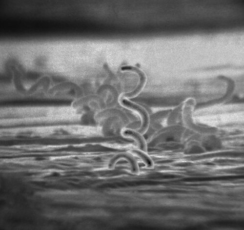
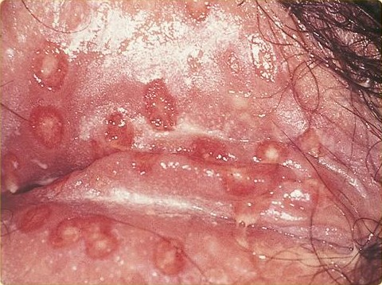

# ÚLCERAS GENITAIS

Úlcera genital é uma solução de continuidade da pele ou mucosa genital, geralmente associada a infecções sexualmente transmissíveis (IST), mas não exclusivamente. Também podem causar úlceras: trauma, neoplasias, dermatoses inflamatórias, doença de Behçet e erupção fixa medicamentosa.

Para prova e prática clínica, o raciocínio começa pela morfologia da lesão, presença de dor, vesículas e linfonodomegalia. Porém, a aparência isolada tem baixo poder preditivo. Por isso, quando não há laboratório disponível ou há dúvida diagnóstica, a abordagem sindrômica prioriza tratamento imediato.

## Raciocínio inicial

A pergunta “dói ou não dói?” ajuda, mas não fecha diagnóstico.

- **Úlceras dolorosas:** pensar principalmente em herpes genital e cancroide.

- **Úlceras indolores:** pensar em sífilis primária, linfogranuloma venéreo (LGV) e donovanose.

- **Vesículas agrupadas antes das úlceras:** favorecem herpes.

- **Lesão crônica, vegetante ou que não cicatriza:** pensar em donovanose, LGV, imunossupressão ou neoplasia.

O ponto importante é evitar uma falsa contradição: as doenças têm apresentações clássicas diferentes, úteis para prova, mas na vida real elas podem se sobrepor, coexistir ou estar modificadas por infecção secundária e imunossupressão. Por isso, úlcera sem vesículas e sem diagnóstico etiológico disponível deve ser tratada de forma sindrômica, cobrindo principalmente sífilis e cancroide.

## Principais causas infecciosas

### Sífilis primária

Causada pelo *Treponema pallidum*. A lesão típica é o **cancro duro**, que aparece geralmente de 10 a 90 dias após o contágio.

Características clássicas:

- úlcera geralmente única;

- indolor;

- base endurecida;

- fundo limpo;

- bordas regulares;

- linfadenopatia inguinal bilateral, indolor e não supurativa.

A lesão pode desaparecer espontaneamente em 2 a 6 semanas, mesmo sem tratamento. Isso não significa cura: a infecção persiste e pode evoluir para sífilis secundária ou latente.

O diagnóstico pode ser feito por testes treponêmicos e não treponêmicos. No início da lesão, a sorologia pode ainda ser negativa; se a suspeita for alta, deve-se tratar e repetir investigação conforme o contexto. A microscopia de campo escuro pode identificar treponemas em lesão ativa, quando disponível.

### Herpes genital

Causado por HSV-1 ou HSV-2, com predomínio clássico do HSV-2 em lesões genitais. É a causa mais lembrada quando há vesículas e dor intensa.

Quadro típico:

- pródromos: ardor, queimação, prurido ou formigamento;

- vesículas agrupadas sobre base eritematosa;

- ruptura das vesículas, formando úlceras rasas e muito dolorosas;

- linfadenopatia inguinal dolorosa, geralmente sem supuração;

- na primoinfecção: febre, mal-estar, mialgia, disúria e dor importante.

O vírus permanece latente em gânglios sensitivos, por isso recorrências são comuns. O tratamento reduz duração e intensidade dos sintomas, mas não erradica o vírus.

Quando disponível, PCR ou cultura viral podem confirmar o diagnóstico. O teste de Tzanck pode aparecer em questões antigas, mostrando células gigantes multinucleadas, mas é pouco usado na prática e não diferencia HSV de outros herpesvírus.

### Cancroide ou cancro mole

Causado pelo *Haemophilus ducreyi*. É a principal úlcera bacteriana dolorosa a ser diferenciada da sífilis.

Características clássicas:

- úlceras geralmente múltiplas;

- dolorosas;

- bordas irregulares e solapadas;

- fundo purulento, sujo, amarelado ou necrótico;

- sangramento fácil ao toque;

- autoinoculação frequente.

A adenopatia inguinal costuma ser unilateral, dolorosa e pode supurar. O bubão do cancroide tende a fistulizar por **um único orifício**.

### Linfogranuloma venéreo (LGV)

Causado pelos sorotipos L1, L2 e L3 da *Chlamydia trachomatis*. A úlcera inicial costuma ser pequena, indolor e transitória, muitas vezes não percebida.

O quadro que chama atenção é a fase linfonodal:

- linfadenopatia inguinal ou femoral dolorosa;

- geralmente unilateral;

- pode evoluir com supuração e fistulização por múltiplos orifícios;

- drenagem em “bico de regador”;

- sinal do sulco: separação da massa ganglionar pelo ligamento inguinal.

Em pessoas com prática de sexo anal receptivo, pode haver proctite ou proctocolite.

### Donovanose

Causada pela *Klebsiella granulomatis*. É uma IST crônica, progressiva e pouco frequente, mas muito cobrada em provas.

Características clássicas:

- úlcera indolor;

- evolução lenta;

- fundo granuloso, vermelho vivo, “rutilante”;

- sangramento fácil;

- bordas planas ou hipertróficas;

- pode ser vegetante ou ulcerovegetante.

Não costuma haver adenite verdadeira. Podem ocorrer **pseudobubões**, que são granulações subcutâneas que simulam linfonodos. O diagnóstico é sugerido pela visualização dos corpúsculos de Donovan em esfregaço ou biópsia.

## Comparação rápida

| Doença | Agente | Úlcera típica | Dor | Adenopatia |
| --- | --- | --- | --- | --- |
| Sífilis primária | *T. pallidum* | Única, fundo limpo, base endurecida | Ausente | Bilateral, indolor, não supura |
| Herpes genital | HSV-1/HSV-2 | Vesículas que evoluem para úlceras rasas | Intensa | Dolorosa, não supurativa |
| Cancroide | *H. ducreyi* | Múltiplas, fundo purulento, bordas irregulares | Intensa | Dolorosa, supura por 1 orifício |
| LGV | *C. trachomatis* L1-L3 | Pequena, fugaz, indolor | Geralmente ausente na lesão inicial | Dolorosa, pode supurar por vários orifícios |
| Donovanose | *K. granulomatis* | Crônica, rutilante, sangrante | Ausente | Rara; pseudobubões |

## Abordagem sindrômica

A conduta depende da avaliação clínica, disponibilidade de testes e tempo de evolução.

-

**Há vesículas ativas ou história típica de vesículas?**
Tratar como herpes genital.

-

**Não há vesículas e a lesão tem menos de 4 semanas?**
Tratar sífilis e cancroide.

-

**Não há vesículas e a lesão tem mais de 4 semanas?**
Tratar sífilis e cancroide, investigar LGV e donovanose, e considerar biópsia.

-

**Persistência de sinais ou sintomas após tratamento inicial, lesão atípica, imunossupressão ou suspeita de neoplasia:**
Referenciar e investigar com exames complementares, incluindo biópsia quando indicada.

Em toda úlcera genital, deve-se oferecer testagem para HIV, sífilis e hepatites B e C, além de avaliar vacinação para hepatite B e HPV conforme indicação.

## Tratamento

### Sífilis recente, incluindo sífilis primária

- **Benzilpenicilina benzatina 2,4 milhões UI, IM, dose única**
Aplicar 1,2 milhão UI em cada glúteo.

Alternativa para pessoa não gestante com contraindicação à penicilina:

- **Doxiciclina 100 mg, VO, 12/12 h, por 15 dias.**

Na gestação, a benzilpenicilina benzatina é o único tratamento considerado adequado para prevenção de transmissão vertical. Doxiciclina é contraindicada.

### Herpes genital

Primeiro episódio:

- **Aciclovir 400 mg, VO, 8/8 h, por 7 a 10 dias.**

Recidiva:

- **Aciclovir 400 mg, VO, 8/8 h, por 5 dias.**

Terapia supressiva, em geral para 6 ou mais episódios ao ano:

- **Aciclovir 400 mg, VO, 12/12 h, por até 6 meses**, com reavaliação.

Em imunossuprimidos com lesões extensas, pode ser necessário aciclovir endovenoso.

Na gestação, tratar o primeiro episódio em qualquer trimestre. Se primoinfecção ocorreu na gestação ou se houver recorrências frequentes, pode-se fazer terapia supressiva a partir da 36ª semana com aciclovir 400 mg, VO, 8/8 h.

### Cancroide

Primeira opção:

- **Azitromicina 1 g, VO, dose única.**

Alternativa:

- **Ceftriaxona 250 mg, IM, dose única.**

Associar higiene local e tratar parcerias sexuais, mesmo assintomáticas.

### Linfogranuloma venéreo

Primeira opção:

- **Doxiciclina 100 mg, VO, 12/12 h, por 21 dias.**

Gestantes ou lactantes:

- **Azitromicina 1 g, VO, 1 vez por semana, por 3 semanas.**

As parcerias sexuais devem ser avaliadas e tratadas. Bubões flutuantes podem ser aspirados com agulha calibrosa, mas não devem ser incisados cirurgicamente.

### Donovanose

Primeira opção:

- **Azitromicina 1 g, VO, 1 vez por semana, por pelo menos 3 semanas ou até cicatrização completa.**

O critério de cura é o desaparecimento da lesão. Devido à baixa infectividade, em geral não é necessário tratar parcerias sexuais.

## Situações especiais

### Gestação

- Sífilis em gestante deve ser tratada com benzilpenicilina benzatina. Qualquer outro esquema é considerado inadequado para prevenção da sífilis congênita.

- Doxiciclina é contraindicada na gestação e lactação.

- Herpes genital com lesão ativa ou pródromos no momento do parto indica cesariana para reduzir risco de transmissão neonatal.

- Sem lesões ativas ou pródromos, o parto vaginal pode ser realizado.

### HIV e imunossupressão

Úlceras podem ser mais extensas, persistentes, dolorosas ou atípicas. Herpes pode ser crônico e vegetante; sífilis pode ter apresentações incomuns. Nesses casos, a investigação deve ser ampliada e o limiar para referência especializada e biópsia deve ser menor.

### Diagnósticos diferenciais não infecciosos

- Úlceras orais recorrentes associadas a úlceras genitais: pensar em **doença de Behçet**.

- Lesão que recorre sempre no mesmo local após uso de medicamento: pensar em **erupção fixa medicamentosa**.

- Úlcera persistente, endurecida, sangrante, vegetante ou sem resposta ao tratamento: excluir neoplasia, especialmente carcinoma espinocelular de vulva.

## Conduta com parcerias

- **Sífilis:** parcerias devem ser testadas e tratadas conforme risco, sintomas e resultado. Parcerias dos últimos 90 dias podem receber tratamento presuntivo mesmo com sorologia negativa.

- **Cancroide:** tratar parcerias sexuais, mesmo assintomáticas.

- **LGV:** tratar parcerias sexuais. Se sintomáticas, usar o mesmo esquema do caso índice.

- **Herpes genital:** avaliar e orientar parcerias; tratar se houver sintomas.

- **Donovanose:** em geral, não é necessário tratar parcerias devido à baixa infectividade.

## Pontos-chave para prova

- Úlcera com vesículas e dor intensa: herpes genital.

- Cancro duro: sífilis primária, úlcera única, indolor, base endurecida e fundo limpo.

- Cancro mole: *Haemophilus ducreyi*, úlceras múltiplas, dolorosas, purulentas e friáveis.

- Bubão que drena por um orifício: cancroide.

- Drenagem em múltiplos orifícios, “bico de regador”: LGV.

- Sinal do sulco: LGV.

- Úlcera crônica vermelho-vivo, rutilante, sangrante e indolor: donovanose.

- Corpúsculos de Donovan: donovanose.

- Neisseria gonorrhoeae não é causa típica de úlcera genital; causa principalmente cervicite e uretrite.

- Sífilis recente: benzilpenicilina benzatina 2,4 milhões UI, IM, dose única.

- Gestante com sífilis: penicilina é obrigatória.

- Herpes recorrente com 6 ou mais episódios ao ano: considerar terapia supressiva.

- Úlcera sem vesículas e sem diagnóstico etiológico disponível: tratar sífilis e cancroide pela abordagem sindrômica.

- Lesão com mais de 4 semanas, atípica ou persistente após tratamento: investigar LGV, donovanose e neoplasia; considerar biópsia.

- Sífilis é doença de notificação compulsória.

 Cópia offline para consulta pessoal.
 Fonte original:
 [https://www.medevo.com.br/material-apoio/ler/15b1072f-4644-4f63-94b6-c4f0c094c12b](https://www.medevo.com.br/material-apoio/ler/15b1072f-4644-4f63-94b6-c4f0c094c12b)
