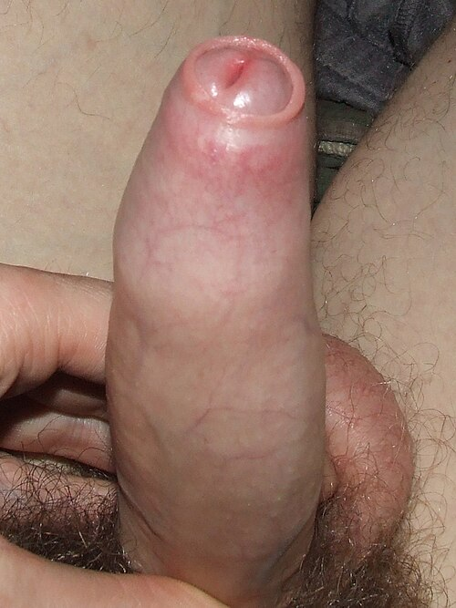

# UROLOGIA PEDIÁTRICA

## Fimose e o Manejo do Prepúcio

Para começar nossa conversa sobre urologia pediátrica, precisamos desmistificar o que é, de fato, uma patologia e o que é apenas o desenvolvimento natural da criança. Muitos alunos erram questões de prova porque não conseguem diferenciar a fimose fisiológica da fimose patológica.

A fimose é definida como a incapacidade de retrair o prepúcio para expor a glande. No nascimento, quase 96% dos meninos apresentam essa condição. Isso acontece porque existem aderências naturais entre a face interna do prepúcio e o epitélio da glande. Conforme a criança cresce, ocorrem ereções espontâneas e o acúmulo de esmegma, uma secreção esbranquiçada composta por células epiteliais descamadas, que atua como um lubrificante natural, ajudando a separar essas camadas.

Por que é um erro comum indicar cirurgia para um bebê de 6 meses com o prepúcio fechado? Porque, aos 3 anos de idade, cerca de 90% dos meninos já conseguem retrair o prepúcio completamente. Segundo a Sociedade Brasileira de Pediatria (SBP), a conduta inicial na fimose fisiológica é a observação e a orientação de higiene adequada, sem manobras bruscas.

### Fimose Fisiológica vs. Patológica

A diferença fundamental que as bancas de residência cobram está no aspecto do anel prepucial. Na fimose fisiológica, o tecido é saudável, elástico e sem cicatrizes. Já na fimose patológica, geralmente secundária a episódios de balanopostite de repetição ou trauma por retrações forçadas, observamos um anel fibrótico, esbranquiçado e endurecido.

Um sinal clássico de fimose patológica é o balonamento do prepúcio durante a micção. A urina fica retida no espaço prepucial antes de sair, o que aumenta o risco de infecções. Se você encontrar uma questão descrevendo um "anel esbranquiçado e rígido" ou "balonamento miccional", a conduta deixa de ser apenas observação.

### Tratamento Clínico e Cirúrgico

Atualmente, a primeira escolha para o tratamento da fimose persistente ou com sinais de fibrose leve é o uso de corticoides tópicos, como a betametasona 0,05% ou 0,1%, aplicada duas vezes ao dia por 4 a 8 semanas. O corticoide age afinando a pele e reduzindo a inflamação, facilitando a retração gradual.

A cirurgia, chamada de postectomia ou circuncisão, é indicada de forma absoluta em casos de:

- Balanopostites de repetição (infecção da glande e prepúcio).

- Infecções urinárias de repetição em crianças com anomalias do trato urinário.

- Fimose patológica (presença de anel fibrótico) que não respondeu ao tratamento clínico.

- Parafimose (uma emergência urológica).

Cuidado com a parafimose: ela ocorre quando o prepúcio é retraído e não consegue retornar à posição original, causando um anel de constrição que impede o retorno venoso e linfático da glande. O resultado é um edema massivo e risco de necrose. O tratamento inicial é a redução manual, mas se falhar, a postectomia torna-se mandatória.

| Condição | Características | Conduta Inicial |
| --- | --- | --- |
| Fimose Fisiológica | Tecido elástico, sem cicatrizes, comum até 3 anos | Observação e higiene |
| Fimose Patológica | Anel fibrótico esbranquiçado, balonamento | Corticoide tópico ou Cirurgia |
| Parafimose | Prepúcio "preso" atrás da glande, edema grave | Redução manual (Emergência) |
| Aderência Balanoprepucial | Pele "grudada" na glande, sem anel estenótico | Higiene e tempo |

## Criptorquidia e o Testículo Não Palpável

Este é, sem dúvida, um dos temas preferidos das bancas. Para entender a criptorquidia, você precisa lembrar da embriologia. O testículo se desenvolve no abdome e desce para a bolsa escrotal sob influência hormonal e mecânica (pelo gubernáculo) entre a 25ª e a 35ª semana de gestação.

Por que isso importa? Porque prematuros têm uma incidência muito maior de criptorquidia (até 30%) do que bebês a termo (cerca de 3%). A boa notícia é que a maioria desses testículos completa a descida nos primeiros meses de vida.

### O Marco dos 6 Meses

Aqui está a regra de ouro que o MedEvo sempre enfatiza: se o testículo não desceu até os 6 meses de idade (corrigida para a idade gestacional), a chance de descida espontânea é praticamente nula. É a partir deste momento que o relógio começa a correr contra a fertilidade e a favor do risco de câncer.

O exame físico deve ser feito com a criança relaxada, em ambiente aquecido, e com as mãos do examinador também aquecidas para evitar o reflexo cremastérico. Se você palpar o testículo na região inguinal e conseguir trazê-lo para a bolsa escrotal, onde ele permanece sem tensão, estamos diante de um testículo retrátil. O testículo retrátil não é criptorquidia; é uma variante do normal causada por um reflexo cremastérico hiperativo.

### Diagnóstico e Exames de Imagem

Erro clássico de prova: solicitar ultrassonografia (USG) para localizar um testículo não palpável. Grave isso: a USG não muda a conduta. Se o testículo não é palpável, o próximo passo padrão-ouro é a laparoscopia diagnóstica, não a imagem. A USG tem baixa sensibilidade para localizar testículos intra-abdominais e, mesmo que encontre, o cirurgião terá que entrar para operar de qualquer forma.

Se o paciente apresenta criptorquidia bilateral e testículos não palpáveis, precisamos descartar distúrbios do desenvolvimento sexual (DDS). Nesses casos, a dosagem de eletrólitos (para descartar hiperplasia adrenal congênita) e o cariótipo são fundamentais.

### Por que operar? (O "Porquê" que cai na prova)

A orquidopexia (fixação do testículo na bolsa) deve ser realizada idealmente entre os 6 e 12 meses, não ultrapassando os 18 meses. Os motivos são claros:

- Fertilidade: A temperatura dentro do abdome é cerca de 1,5 a 2 graus Celsius superior à da bolsa escrotal. Esse calor "cozinha" as células germinativas, levando à atrofia e infertilidade futura.

- Risco de Câncer: O testículo criptorquídico tem um risco 5 a 10 vezes maior de desenvolver tumores malignos (principalmente seminomas). Importante: a cirurgia não elimina o risco de câncer, mas coloca o testículo em uma posição onde ele pode ser palpado e monitorado.

- Risco de Torção: O testículo não fixado adequadamente tem maior mobilidade, aumentando o risco de torção testicular.

## Escroto Agudo: O Diagnóstico Diferencial que Salva Órgãos

Imagine que você está no plantão e chega um menino de 10 anos com dor testicular súbita e intensa, iniciada há 2 horas, acompanhada de náuseas. O que você faz?

O diagnóstico diferencial do escroto agudo é uma das competências mais críticas na urologia pediátrica. Temos três grandes suspeitos: a torção de testículo, a torção de apêndice testicular e a orquiepididimite.

### Torção de Testículo

É uma emergência cirúrgica. Ocorre devido a uma fixação anômala do testículo (deformidade em "badalo de sino"), permitindo que ele gire sobre o cordão espermático, obstruindo o fluxo sanguíneo.

Sinais clínicos que a banca vai te dar:

- Dor súbita e intensa.

- Testículo elevado e horizontalizado (Sinal de Angel).

- Reflexo cremastérico ausente (Este é o sinal clínico mais sensível!).

- Sinal de Prehn negativo: a elevação do testículo não alivia a dor (ao contrário da epididimite).

O tempo é tecido. Se operado em até 6 horas, a taxa de salvamento do testículo é de quase 100%. Após 24 horas, a perda é praticamente certa. Se a suspeita clínica for alta, não perca tempo com Doppler; chame o urologista para exploração cirúrgica imediata.

### Torção de Apêndice Testicular (Hidátide de Morgagni)

É a causa mais comum de escroto agudo em crianças de 7 a 12 anos. O apêndice testicular é um remanescente embrionário sem função que pode torcer.
A dor costuma ser mais gradual que a da torção testicular. O sinal patognomônico é o "Blue Dot Sign" (sinal do ponto azul), onde se observa uma pequena mancha azulada através da pele do escroto, correspondendo ao apêndice necrosado. O reflexo cremastérico está presente. O tratamento é apenas analgésico e repouso.

### Orquiepididimite

Rara em crianças pré-púberes sem anomalias urinárias. Se ocorrer em um menino pequeno, você deve investigar malformações do trato urinário. Em adolescentes, geralmente está ligada a infecções sexualmente transmissíveis (ISTs). O sinal de Prehn costuma ser positivo (a dor melhora ao elevar o escroto).

| Característica | Torção Testicular | Torção de Apêndice | Orquiepididimite |
| --- | --- | --- | --- |
| Início da Dor | Súbito, muito intensa | Gradual, localizada | Gradual, difusa |
| Reflexo Cremastérico | Ausente | Presente | Presente |
| Sinal de Prehn | Negativo | Indiferente | Positivo |
| Outros Sinais | Náuseas/Vômitos | Ponto azul (Blue Dot) | Febre, sintomas urinários |
| Conduta | Cirurgia imediata | Analgesia e repouso | Antibióticos |

## Massas Escrotais e Tumores de Testículo

Aqui entramos em uma área onde o Dr. Will sempre alerta para o perigo da confusão diagnóstica. Nem toda massa escrotal é tumor, mas todo tumor de testículo em criança deve ser tratado com extrema seriedade.

### Hidrocele e Hérnia Inguinal

A hidrocele é o acúmulo de líquido na túnica vaginal. Ela é muito comum no recém-nascido devido à patência do processo vaginal (o conduto que liga o abdome ao escroto).

Como diferenciar na prova?

- Transiluminação: Coloque uma lanterna encostada no escroto. Se a luz passar e o escroto brilhar como uma lanterna chinesa, é líquido (transiluminação positiva). Se a luz não passar, é uma massa sólida ou conteúdo intestinal (transiluminação negativa).

- Redutibilidade: A hidrocele comunicante varia de tamanho ao longo do dia (maior à noite, menor pela manhã). A hérnia inguinal pode ser reduzida manualmente e costuma apresentar ruídos hidroaéreos.

A maioria das hidroceles neonatais resolve-se espontaneamente até 1 ano de idade. Se persistir após esse período, indica-se a cirurgia (ligadura do processo vaginal), pois a persistência do conduto predispõe à hérnia inguinal.

### Tumores de Testículo na Infância

Embora raros (representam cerca de 1% a 2% dos tumores pediátricos), eles têm picos de incidência: um antes dos 3 anos de idade e outro após a puberdade.

A apresentação clássica em provas é: criança com massa escrotal firme, indolor, que não transilumina e onde o examinador não consegue individualizar o testículo da massa. Diferente da hidrocele, onde você sente o testículo "boiando" no líquido, no tumor o testículo faz parte da massa.

Os tipos mais comuns são:

- Tumor do Saco Vitelino (Yolk Sac Tumor): É o tumor maligno mais comum na infância. O marcador laboratorial clássico é a Alfafetoproteína (AFP) elevada.

- Teratoma: Geralmente benigno em crianças pré-púberes (diferente dos adultos, onde são considerados malignos). Não costuma elevar marcadores.

- Tumores de Células de Leydig: Podem causar puberdade precoce devido à produção de testosterona.

A abordagem inicial de qualquer massa sólida suspeita no testículo é a orquiectomia radical por via inguinal. Nunca faça biópsia transescrotal! Por que? Porque o escroto tem drenagem linfática para os linfonodos inguinais, enquanto o testículo drena para os linfonodos retroperitoneais. Uma biópsia pelo escroto pode mudar o estadiamento do tumor e espalhar células neoplásicas para uma cadeia linfática diferente.

## Infecção do Trato Urinário (ITU) na Infância

A ITU é a porta de entrada para o diagnóstico de muitas anomalias urológicas. Na pediatria, não tratamos a ITU apenas como uma infecção isolada, mas como um sinal de alerta.

### Quando suspeitar e como diagnosticar?

Em lactentes, os sintomas são inespecíficos: febre sem foco, irritabilidade, baixo ganho ponderal ou vômitos. Em crianças maiores, surgem os sintomas clássicos: disúria, polaciúria e dor suprapúbica.

O padrão-ouro para coleta de urina em crianças que não controlam o esfíncter é a cateterização vesical ou a punção suprapúbica. O saco coletor tem um valor preditivo negativo alto, mas um valor preditivo positivo baixíssimo (taxa de contaminação de até 70%). Se o saco coletor vier negativo, você descarta ITU. Se vier positivo, você DEVE confirmar com cateterismo antes de iniciar o tratamento.

Valores de referência para urocultura (UFC/mL):

- Punção Suprapúbica: Qualquer crescimento de gram-negativos ou > 10.000 de gram-positivos.

- Cateterismo Vesical: > 50.000 UFC/mL.

- Jato Médio (crianças maiores): > 100.000 UFC/mL.

### Investigação por Imagem após a primeira ITU

A diretriz da Academia Americana de Pediatria (AAP), amplamente seguida no Brasil, recomenda que toda criança entre 2 meses e 2 anos de idade, após o primeiro episódio de ITU febril confirmada, realize uma Ultrassonografia de rins e vias urinárias.

O objetivo da USG é rastrear anomalias anatômicas grosseiras, como hidronefrose ou duplicidade ureteral. Se a USG vier alterada ou se a criança apresentar ITU de repetição, o próximo passo é a Uretrocistografia Miccional (UCM) para pesquisar Refluxo Vesicoureteral (RVU).

## Refluxo Vesicoureteral (RVU)

O RVU é a passagem retrógrada da urina da bexiga para o ureter e rim, geralmente devido a uma falha no mecanismo de válvula da junção ureterovesical.

A classificação internacional divide o RVU em 5 graus:

- Grau I: Refluxo apenas para o ureter.

- Grau II: Refluxo para o ureter, pelve e cálices, sem dilatação.

- Grau III: Dilatação leve a moderada do ureter e pelve renal.

- Grau IV: Dilatação moderada, com tortuosidade do ureter e perda da nitidez dos cálices.

- Grau V: Grande dilatação, ureter muito tortuoso e perda da impressão papilar nos cálices.

Por que nos preocupamos com o RVU? Porque ele facilita o transporte de bactérias da bexiga para o parênquima renal, causando pielonefrite e, consequentemente, cicatrizes renais. Essas cicatrizes podem levar à hipertensão arterial e insuficiência renal crônica no futuro.

O tratamento dos graus leves (I a III) é geralmente conservador, com observação ou profilaxia antibiótica (com doses baixas de nitrofurantoína ou sulfametoxazol-trimetoprim à noite), pois há uma alta taxa de resolução espontânea com o crescimento da criança. Os graus IV e V ou casos de ITUs de repetição apesar da profilaxia podem exigir reimplante ureteral cirúrgico.

## Hipospádia

A hipospádia é uma malformação congênita caracterizada por uma tríade:

- Meato uretral ectópico (localizado na face ventral do pênis, em qualquer ponto desde o períneo até a glande).

- Curvatura ventral do pênis (chordee).

- Capuz prepucial dorsal (excesso de pele no dorso e falta na face ventral).

Dica de ouro para a vida e para a prova: NUNCA circuncide um recém-nascido com hipospádia. O prepúcio será necessário para a cirurgia reconstrutora futura (uretroplastia), servindo como retalho de pele. A cirurgia é idealmente realizada entre os 6 e 18 meses de idade.

## Válvula de Uretra Posterior (VUP)

Esta é a causa mais comum de obstrução infravesical em meninos recém-nascidos e uma verdadeira emergência urológica neonatal. Trata-se de membranas anômalas na uretra prostática que impedem a saída da urina.

O quadro clínico clássico é um recém-nascido do sexo masculino com:

- Bexigoma (bexiga palpável e distendida).

- Jato urinário fraco ou gotejamento.

- Hidronefrose bilateral na USG pré-natal.

- Oligodramnia (pouco líquido amniótico), o que pode levar à hipoplasia pulmonar (Sequência de Potter).

O diagnóstico definitivo é feito pela Uretrocistografia Miccional, que mostra a uretra posterior dilatada e a bexiga de paredes espessadas (bexiga de esforço). O tratamento inicial é a drenagem vesical (sonda) e o tratamento definitivo é a ablação da válvula por via endoscópica.

## Pontos-Chave para Prova

- Fimose fisiológica é a regra ao nascimento; a conduta é observação e higiene sem manobras bruscas.

- O uso de corticoide tópico (betametasona) é a primeira linha para fimose persistente antes de indicar cirurgia.

- Criptorquidia: se o testículo não desceu até os 6 meses, deve ser operado (orquidopexia) entre 6 e 12 meses.

- A USG não é indicada para localizar testículo não palpável; o padrão-ouro é a laparoscopia.

- A orquidopexia reduz o risco de infertilidade e facilita o diagnóstico precoce de câncer, mas não elimina o risco de malignidade.

- Torção de testículo: dor súbita, reflexo cremastérico ausente, sinal de Prehn negativo. Emergência cirúrgica (janela de 6 horas).

- Torção de apêndice testicular: "Blue dot sign" e tratamento conservador com analgesia.

- Massa escrotal sólida, indolor e com transiluminação negativa em criança é suspeita de Tumor de Saco Vitelino (marcador: Alfafetoproteína).

- Nunca faça biópsia transescrotal em suspeita de tumor de testículo; a via é sempre inguinal.

- Hidrocele comunicante: transiluminação positiva e variação de tamanho ao longo do dia. Cirurgia se persistir após 1 ano.

- ITU em lactentes: coletar urina por cateterismo vesical ou punção suprapúbica. Saco coletor só serve se vier negativo.

- Válvula de Uretra Posterior: causa de hidronefrose bilateral e bexigoma em meninos recém-nascidos.

- Hipospádia: contraindicação absoluta para circuncisão neonatal (o prepúcio será usado na reconstrução).

- Refluxo Vesicoureteral: graus I a III costumam ter conduta conservadora; graus IV e V ou falha do tratamento clínico indicam cirurgia.

- Oligodramnia por causas obstrutivas urinárias (como VUP) pode levar à hipoplasia pulmonar fatal. 🩺

 Cópia offline para consulta pessoal.
 Fonte original:
 [https://www.medevo.com.br/material-apoio/ler/251c6b08-85b3-44a3-a908-3c6514d5626f](https://www.medevo.com.br/material-apoio/ler/251c6b08-85b3-44a3-a908-3c6514d5626f)
