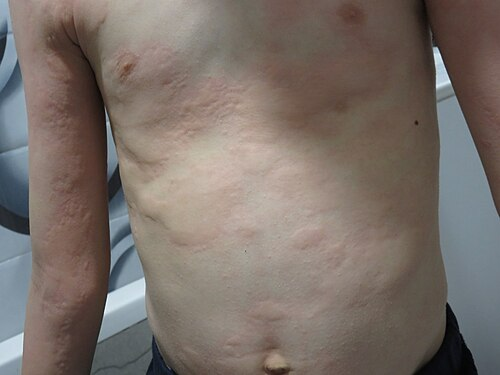

# URTICÁRIA E ANGIOEDEMA

Olá, futuro residente. Se você já passou algum tempo em um pronto-socorro pediátrico, sabe que a urticária é o "pão de cada dia". Mas não se engane pela frequência: as bancas de residência adoram este tema justamente porque ele transita entre o quadro banal, que resolve com um anti-histamínico, e a emergência catastrófica da anafilaxia.

Neste material, vamos dissecar a urticária e o angioedema sob a ótica das diretrizes mais recentes da Associação Brasileira de Alergia e Imunologia (ASBAI) e da Sociedade Brasileira de Pediatria (SBP). O meu objetivo é que, ao final desta leitura, você não apenas saiba as doses, mas entenda a lógica por trás de cada conduta.

## Definição e Fisiopatologia: O Papel do Mastócito

Para começar, precisamos definir o que estamos tratando. A urticária é caracterizada pelo aparecimento de urticas, que são lesões elementares com três características fundamentais:

- Edema central de tamanho variado, cercado por um eritema reflexo.

- Prurido intenso (ou, às vezes, sensação de queimação).

- Natureza efêmera, com a pele voltando ao normal geralmente em 1 a 24 horas.

O angioedema, por outro lado, é um edema que ocorre nas camadas mais profundas da derme e no tecido subcutâneo ou submucoso. Ele é mais doloroso do que pruriginoso e pode demorar até 72 horas para regredir.

### Por que isso acontece?

A célula central aqui é o mastócito. Imagine o mastócito como uma granada cheia de mediadores inflamatórios, sendo a histamina o principal deles. Quando essa célula degranula, a histamina causa vasodilatação (gerando o eritema), aumento da permeabilidade capilar (gerando o edema/urtica) e estimulação de terminações nervosas (gerando o prurido).

Na urticária, essa degranulação ocorre na derme superficial. No angioedema, ocorre na derme profunda e no subcutâneo. É por isso que, no angioedema, não vemos aquele relevo nítido e avermelhado da urtica, mas sim um inchaço mais difuso e pálido.

## Classificação: O Divisor de Águas das 6 Semanas

Esta é a primeira grande "pegadinha" de prova. A classificação da urticária não é baseada na gravidade, mas sim no tempo.

- **Urticária Aguda:** Episódios que duram até 6 semanas.

- **Urticária Crônica:** Episódios que ocorrem por mais de 6 semanas (mesmo que as lesões individuais sumam em 24h, o quadro clínico persiste).

A Urticária Crônica ainda se divide em:

- **Espontânea (UCE):** Surge sem um gatilho externo evidente.

- **Induzida (UCInd):** Necessita de um estímulo físico (frio, calor, pressão, vibração, luz solar) ou químico (água, suor/colinérgica).

**Dica do Dr. Will:** Em pediatria, a imensa maioria dos casos é de urticária aguda. Se a questão trouxer uma criança com placas há 3 dias, não perca tempo procurando causas autoimunes complexas. Pense no simples.

## Etiologia na Infância: O Mito dos Alimentos

Se você perguntar para qualquer mãe no pronto-socorro o que causou a urticária do filho, ela dirá: "foi o corante do pirulito" ou "foi o amendoim".

No entanto, as estatísticas e as provas mostram outra realidade. Em pediatria, a causa mais comum de urticária aguda são as **infecções**, especialmente as virais (IVAS, quadros gastrointestinais).

Muitas vezes, a urticária surge no final do quadro infeccioso ou até alguns dias depois. Outras causas importantes incluem medicamentos (AINEs e antibióticos) e, em menor escala, alimentos.

**Cuidado com a pegadinha:** As bancas adoram colocar "aditivos alimentares e corantes" como a causa principal. Isso é raro! Se tiver que chutar na causa mais comum em uma criança, marque "infecção viral".

## Quadro Clínico e Exame Físico

Ao examinar o paciente, você deve procurar as urticas clássicas. Elas são papulares ou em placas, eritemato-edematosas e, o mais importante, **desaparecem à digitopressão**.

### Sinais de Alerta (Red Flags)

Se a lesão durar mais de 24 horas no mesmo local, for dolorosa em vez de pruriginosa ou deixar uma mancha arroxeada (hiperpigmentação residual) ao sumir, pare tudo. Isso não é urticária comum. Isso sugere **Urticária Vasculite**. Nesses casos, a biópsia de pele é mandatória e a investigação deve focar em doenças sistêmicas, como o Lúpus Eritematoso Sistêmico.

### O Angioedema Isolado

Se o paciente chega com angioedema, mas **sem urticária**, você deve ligar o sinal de alerta para duas situações:

- **Uso de Inibidores da ECA (Captopril, Enalapril):** Ocorre pelo acúmulo de bradicinina. Pode acontecer mesmo após anos de uso da medicação.

- **Angioedema Hereditário:** Uma deficiência quantitativa ou qualitativa do C1-esterase inibidor. É um quadro grave, que não responde a adrenalina, corticoide ou anti-histamínico.

## Diagnóstico: Menos é Mais

Na urticária aguda, a diretriz da ASBAI é clara: **não se solicita exames laboratoriais de rotina**. O diagnóstico é clínico. Pedir um hemograma ou um IgE específico para todo mundo só gera custos e ansiedade.

Só investigamos se a história clínica sugerir algo específico (ex: febre persistente, perda de peso, dores articulares). Na urticária crônica espontânea, a investigação inicial mínima costuma incluir Hemograma e VHS/PCR para descartar doenças inflamatórias ocultas.

## Manejo da Urticária: O Escalonamento Terapêutico

Aqui é onde o MedEvo te ajuda a não errar a conduta. O tratamento da urticária (aguda ou crônica) segue uma lógica de passos.

### 1ª Linha: Anti-histamínicos H1 de 2ª Geração

Por que de 2ª geração? Porque eles são menos lipofílicos, atravessam pouco a barreira hematoencefálica e, portanto, causam menos sedação e menos efeitos anticolinérgicos (boca seca, retenção urinária).

Exemplos: Cetirizina, Loratadina, Desloratadina, Fexofenadina, Bilastina, Rupatadina.

**Erro clássico:** Usar Hidroxizina ou Dexclorfeniramina (1ª geração) como primeira escolha. Eles prejudicam o sono REM e o aprendizado da criança. A diretriz recomenda evitá-los.

### 2ª Linha: Aumentar a Dose

Se a dose padrão do anti-histamínico de 2ª geração não controlar os sintomas após 2 a 4 semanas (na urticária crônica), a conduta é **aumentar a dose em até 4 vezes**.

Sim, você leu certo. Não trocamos de droga nem associamos outro anti-histamínico. Nós quadruplicamos a dose da mesma medicação. Isso é nível de evidência forte em diretrizes internacionais e na ASBAI.

### 3ª Linha e Além

Se nem a dose quadruplicada funcionar, entramos no terreno dos especialistas:

- **Omalizumabe:** Um anticorpo monoclonal anti-IgE. É extremamente eficaz para UCE.

- **Ciclosporina:** Reservada para casos refratários ao Omalizumabe.

### E o Corticoide?

O corticoide (ex: Prednisolona 0,5 a 1 mg/kg/dia) deve ser usado apenas por períodos curtos (3 a 7 dias) para "apagar o incêndio" em crises agudas muito intensas ou exacerbações da crônica. **Nunca** use corticoide como tratamento de manutenção na urticária.

## Anafilaxia: A Emergência que Você Precisa Dominar

A anafilaxia é a manifestação mais grave de uma reação de hipersensibilidade. É sistêmica e potencialmente fatal. Se você vacilar aqui na prova (ou na vida), o desfecho é ruim.

### Critérios Diagnósticos (WAO 2020 / ASBAI)

A anafilaxia é altamente provável quando um dos dois critérios abaixo é preenchido:

-

**Início agudo** (minutos a horas) com envolvimento da **pele/mucosa** (urticária, angioedema, prurido) **E** pelo menos um dos seguintes:

- Comprometimento respiratório (dispneia, sibilância, estridor).

- Comprometimento circulatório (hipotensão, síncope, hipotonia).

- Sintomas gastrointestinais graves (dor abdominal intensa, vômitos repetidos), especialmente após alérgenos não alimentares.

-

**Início agudo** de hipotensão **OU** broncoespasmo **OU** envolvimento laríngeo após exposição a um alérgeno conhecido ou altamente provável para aquele paciente, **mesmo na ausência de lesões de pele**.

**Atenção:** 20% das anafilaxias não apresentam urticária! Se uma criança alérgica a amendoim ingere o alimento e começa a sibilar e ficar hipotensa, é anafilaxia, mesmo com a pele limpa.

### Tratamento de Emergência: A Regra de Ouro

A primeira e mais importante medida na anafilaxia é a **Adrenalina (Epinefrina) Intramuscular**.

Não é corticoide. Não é nebulização. Não é anti-histamínico. É Adrenalina.
Por que? Porque a adrenalina é o único fármaco que atua em todos os receptores necessários:

- **Alfa-1:** Causa vasoconstrição, tratando a hipotensão e reduzindo o edema de glote.

- **Beta-1:** Aumenta a força e a frequência cardíaca.

- **Beta-2:** Causa broncodilatação e estabiliza o mastócito (para de liberar histamina).

### Dose e Via de Administração

- **Via:** Intramuscular (IM) no vasto lateral da coxa (face anterolateral). A absorção aqui é muito mais rápida e confiável do que no deltoide ou via subcutânea.

- **Concentração:** 1:1.000 (ampola padrão de 1mg/ml).

- **Dose Pediátrica:** 0,01 mg/kg.

- **Dose Máxima:** 0,5 mg em adultos; 0,3 mg em crianças (algumas diretrizes aceitam até 0,5 mg em adolescentes grandes).

Se o paciente não melhorar, você pode repetir a dose a cada 5 a 15 minutos.

### Manejo Complementar (ABCDE)

Após a adrenalina, seguimos o protocolo:

- **Vias Aéreas:** Oxigênio suplementar. Se houver estridor laríngeo grave, prepare para intubação (que será difícil pelo edema).

- **Circulação:** Se houver hipotensão, coloque o paciente em decúbito dorsal com pernas elevadas (posição de Trendelenburg) e faça expansão volêmica vigorosa com Cristaloide (20 ml/kg).

- **Drogas de Segunda Linha:** Agora sim, você pode dar o anti-histamínico e o corticoide. Eles ajudam a reduzir os sintomas cutâneos e podem prevenir a fase tardia, mas não salvam a vida no momento agudo.

### Observação e Reação Bifásica

Todo paciente com anafilaxia deve ficar em observação por, no mínimo, 4 a 12 horas. Por que? Por causa da **Reação Bifásica**. Em até 20% dos casos, os sintomas reaparecem horas após a resolução inicial, sem uma nova exposição ao alérgeno.

## Diagnóstico Diferencial: O Caso do Escroto Agudo

Você deve ter notado na lista de conceitos cobrados uma menção a "Epididimite" e "Doppler testicular". O que isso tem a ver com urticária?

Em provas de residência, os temas de urgência pediátrica costumam se misturar. Um diagnóstico diferencial importante de "edema e dor" em áreas específicas é o escroto agudo.

- Se a questão descreve um adolescente com dor escrotal, febre, secreção uretral e piúria (pus na urina), mas o Doppler mostra fluxo normal ou aumentado: pense em **Epididimite**.

- Se a dor for súbita, o testículo estiver elevado e o Doppler mostrar ausência de fluxo: é **Torção Testicular** (emergência cirúrgica).

Embora pareça fora de contexto, as bancas usam o angioedema genital como "distrator" para esses quadros. Lembre-se: o angioedema não causa piúria nem altera o Doppler testicular.

## Tabela Comparativa: Urticária vs. Anafilaxia

| Característica | Urticária Simples | Anafilaxia |
| --- | --- | --- |
| **Sistemas Acometidos** | Apenas Pele/Mucosa | ≥ 2 sistemas (Pele + Resp/CV/GI) |
| **Estabilidade Hemodinâmica** | Estável | Pode haver hipotensão/choque |
| **Via Respiratória** | Livre | Pode haver estridor ou sibilância |
| **Tratamento 1ª Linha** | Anti-histamínico H1 2ª gen | Adrenalina IM (1:1000) |
| **Necessidade de Observação** | Geralmente alta após medicação | 4 a 12 horas (risco bifásico) |

## Tabela de Doses na Emergência Pediátrica

| Medicação | Dose | Observação |
| --- | --- | --- |
| **Adrenalina (1:1000)** | 0,01 mg/kg (máx 0,3-0,5 mg) | Via IM, face anterolateral da coxa |
| **Salina 0,9% (Expansão)** | 20 ml/kg | Se houver sinais de choque |
| **Prednisolona (VO)** | 1 a 2 mg/kg/dia | Dose máxima 60 mg |
| **Hidrocortisona (EV)** | 5 a 10 mg/kg | Ação lenta (não é para o agudo) |
| **Diphenidramina (IM/EV)** | 1 mg/kg | Anti-histamínico de 1ª gen (opcional) |

## Resumo do Fluxograma de Tratamento da Urticária Crônica (ASBAI)

- **Passo 1:** Anti-histamínico H1 de 2ª geração em dose padrão.

- **Passo 2:** Se persistirem sintomas após 2-4 semanas, aumentar a dose do mesmo anti-histamínico em até 4x.

- **Passo 3:** Se persistirem sintomas após 2-4 semanas na dose máxima, adicionar Omalizumabe.

- **Passo 4:** Se falha do Omalizumabe em 6 meses, substituir por Ciclosporina.

## Situações Especiais e Pegadinhas de Prova

### Gestantes

A urticária na gestação deve ser tratada preferencialmente com anti-histamínicos de 2ª geração com melhor perfil de segurança (Loratadina ou Cetirizina). Evite a Hidroxizina pelo potencial efeito teratogênico em altas doses em modelos animais.

### Idosos

Cuidado redobrado com anti-histamínicos de 1ª geração. Eles aumentam o risco de quedas, confusão mental e retenção urinária (especialmente em homens com hiperplasia prostática).

### O Erro da Dieta de Exclusão

Muitos médicos (e alunos em prova) orientam "dieta branca" ou exclusão de vários alimentos para pacientes com urticária crônica. **Isso está errado**. A Urticária Crônica Espontânea é, na maioria das vezes, autoimune. Restrições alimentares sem evidência de alergia mediada por IgE apenas pioram a qualidade de vida do paciente.

## Pontos-Chave para Prova

- **Causa #1 de Urticária Aguda em Crianças:** Infecções virais. Não são alimentos nem corantes.

- **Definição de Cronicidade:** Sintomas por mais de 6 semanas.

- **Tratamento de Escolha (Urticária):** Anti-histamínicos H1 de 2ª geração (não sedantes).

- **Conduta na Refratariedade:** Aumentar a dose do H1 de 2ª geração em até 4 vezes antes de trocar de droga.

- **Tratamento de Escolha (Anafilaxia):** Adrenalina IM 1:1000 na coxa. É a ÚNICA droga que reduz a mortalidade.

- **Dose de Adrenalina:** 0,01 mg/kg (máximo de 0,3 mg em crianças e 0,5 mg em adultos).

- **Via de Adrenalina:** IM é superior à SC e à IV (no manejo inicial por não-especialistas).

- **Critério de Anafilaxia sem Pele:** Hipotensão ou broncoespasmo após exposição a alérgeno conhecido.

- **Tempo de Observação:** 4 a 12 horas após anafilaxia para monitorar reação bifásica.

- **Urticária Vasculite:** Suspeitar se a lesão durar > 24h, for dolorosa ou deixar mancha. Exige biópsia.

- **Angioedema por IECA:** Ocorre por acúmulo de bradicinina, não de histamina. Não responde bem a adrenalina/corticoide.

- **O que NÃO fazer:** Não usar corticoides de forma prolongada para urticária crônica e não atrasar a adrenalina na anafilaxia esperando o corticoide fazer efeito.

- **Pegadinha do Doppler:** Se a questão fala de dor escrotal e Doppler normal em adolescente com piúria, marque Epididimite, não torção nem angioedema.

Dominar esses conceitos é o que separa o aluno que decora do médico que entende a urgência. Lembre-se sempre: na dúvida se é anafilaxia ou apenas uma reação alérgica forte, **faça a adrenalina**. O risco de não fazer é muito maior do que o risco de fazer desnecessariamente. 🩺

 Cópia offline para consulta pessoal.
 Fonte original:
 [https://www.medevo.com.br/material-apoio/ler/357ba99a-e18c-4481-81e2-ade8263433a2](https://www.medevo.com.br/material-apoio/ler/357ba99a-e18c-4481-81e2-ade8263433a2)
