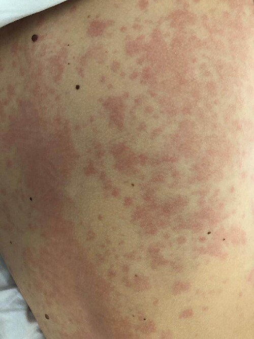
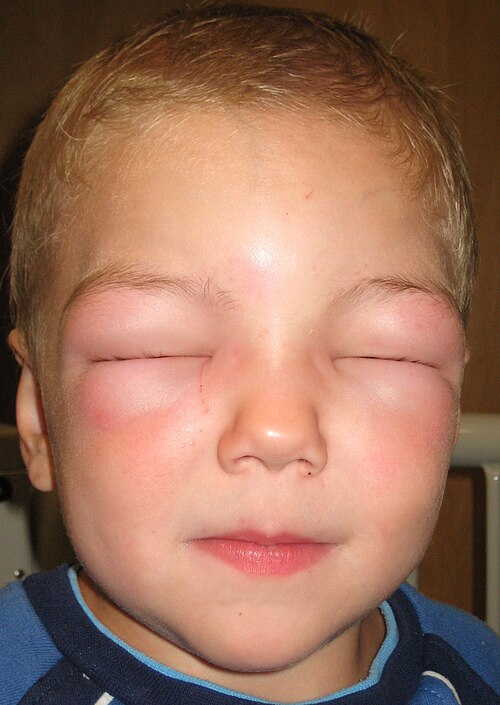

# URTICÁRIA E ANGIOEDEMA

Para entender urticária e angioedema, você precisa primeiro visualizar o protagonista dessa história: o **mastócito**. Imagine o mastócito como uma granada cheia de mediadores químicos (principalmente histamina) espalhada por toda a sua pele e mucosas. Quando essa granada explode (degranulação), temos a manifestação clínica.

A diferença entre urticária e angioedema é basicamente a "profundidade da explosão". Se a liberação de mediadores ocorre na derme superficial, temos a **urticária** (pápulas e placas eritematosas). Se ocorre na derme profunda e no tecido subcutâneo, temos o **angioedema**.

## Fisiopatologia: O Porquê da Lesão

Por que a urticária coça e o angioedema dói? A histamina liberada pelos mastócitos liga-se aos receptores H1 nos vasos sanguíneos, causando vasodilatação (eritema) e aumento da permeabilidade capilar (edema/urtica). Além disso, ela estimula fibras nervosas sensoriais, gerando o prurido clássico.

No angioedema, como o processo é mais profundo e há menos terminações nervosas de prurido, o paciente sente mais "queimação" ou dor do que coceira. Além disso, a distensão do tecido subcutâneo é mais volumosa, o que explica o aspecto deformante.

Um conceito fundamental para a sua prova: nem toda degranulação de mastócito é mediada por IgE (Hipersensibilidade Tipo I). Existem gatilhos não imunológicos, como o contraste iodado, opioides e alguns alimentos, que causam a liberação direta de histamina. Isso explica por que, muitas vezes, o teste cutâneo (Prick Test) vem negativo, mas o paciente jura que o alimento "fez mal".

## Classificação e Definições

A primeira pergunta que você deve fazer ao paciente (e que a banca vai te induzir a errar) é: "Há quanto tempo o senhor tem essas lesões?".

### Urticária Aguda vs. Crônica

A linha de corte são **6 semanas**.

- **Aguda (< 6 semanas):** É a mais comum na prática clínica e nas provas. Geralmente autolimitada.

- **Crônica (≥ 6 semanas):** Aqui o buraco é mais embaixo. Ela pode ser espontânea (sem gatilho aparente) ou induzida (frio, calor, pressão, vibração).

**Dica de Prova:** Na urticária aguda infantil, a causa número 1 são as **infecções virais**, não a alergia alimentar. Guarde isso, pois as bancas adoram colocar "leite de vaca" como a resposta correta para uma criança com febre baixa, coriza e urticária.

### Tabela 1: Diferenças Clínicas Cruciais

| Característica | Urticária | Angioedema |
| --- | --- | --- |
| **Localização** | Derme superficial | Derme profunda / Subcutâneo |
| **Sintoma Principal** | Prurido intenso | Dor, queimação, aperto |
| **Duração da Lesão** | < 24 horas (fuga das lesões) | Até 72 horas |
| **Bordas** | Bem delimitadas, eritematosas | Mal delimitadas, cor da pele ou rósea |
| **Resolução** | Sem deixar cicatriz ou marca | Sem deixar marcas |

## Quadro Clínico e Diagnóstico

A lesão típica da urticária é a **urtica**: uma pápula ou placa elevada, eritematosa, com centro pálido e bordas serpiginosas. Uma característica patognomônica é a **transitoriedade**. A lesão aparece em um lugar, some em menos de 24 horas e aparece em outro.

Se o paciente diz que a lesão "está no mesmo lugar há 3 dias" ou se ela deixa uma mancha roxa/acastanhada ao sumir, pare tudo. Isso não é urticária simples; você deve suspeitar de **Urticária Vasculite** e solicitar uma biópsia.

### O Exame Físico e o Dermografismo

Durante o exame, você deve testar o **dermografismo**. Passe a polpa da digital ou um objeto rombo no antebraço do paciente. Se surgir uma urtica linear em poucos minutos, você confirmou uma forma de urticária física (induzida por pressão).

### Diagnóstico: Preciso de exames?

Para a urticária aguda, a resposta é **NÃO**. O diagnóstico é clínico. Pedir um hemograma ou um IgE total para um paciente que teve urticária após um resfriado é desperdício de recurso e erro em prova de residência.

Já na Urticária Crônica Espontânea (UCE), a diretriz brasileira (ASBAI) sugere uma investigação mínima:

- Hemograma completo.

- VHS e Proteína C Reativa (para descartar doenças sistêmicas inflamatórias).

Exames mais complexos só se a história clínica sugerir algo específico (ex: TSH se houver sintomas de tireoidopatia). Lembre-se: em 80% das UCE, não acharemos uma causa externa; a etiologia é frequentemente autoimune (autoanticorpos contra o receptor de IgE no mastócito).

## Angioedema: O Perigo Oculto

Aqui é onde o Dr. Will sempre alerta: o angioedema pode matar. Precisamos separar o angioedema em dois grupos fisiopatológicos, pois o tratamento muda completamente.

### 1. Angioedema Histaminérgico

Vem acompanhado de urticária e prurido. Responde bem a anti-histamínicos e corticoides. É o que vemos na anafilaxia.

### 2. Angioedema por Bradicinina (Não-Histaminérgico)

**Cuidado:** Este paciente NÃO tem urticária e NÃO tem coceira. Ele tem apenas o inchaço. E o pior: anti-histamínicos e corticoides NÃO funcionam aqui.

Existem duas causas clássicas para isso cair na sua prova:

- **Uso de IECA (Enalapril, Captopril):** O IECA bloqueia a enzima que degrada a bradicinina. Resultado? Acúmulo de bradicinina, vasodilatação extrema e angioedema de face/língua. Pode ocorrer meses após o início do uso da medicação. Conduta: Suspender o IECA para sempre.

- **Angioedema Hereditário (AEH):** Uma doença genética rara onde há deficiência (Tipo I) ou disfunção (Tipo II) do **C1-Inibidor**. Sem o C1-INH, a via das cininas fica descontrolada, gerando excesso de bradicinina.

### Tabela 2: Diagnóstico Diferencial de Angioedema

| Suspeita | Pista Clínica | Marcador Laboratorial |
| --- | --- | --- |
| **Histaminérgico** | Tem urticária e prurido | Clínico |
| **Por IECA** | Uso de Enalapril/Captopril | Clínico (melhora após suspensão) |
| **Hereditário (AEH)** | Dor abdominal recorrente, histórico familiar | **C4 baixo** (triagem), C1-INH baixo |

**Pegadinha de Prova:** O paciente com AEH frequentemente chega ao pronto-socorro com dor abdominal intensa e é operado por suspeita de "abdome agudo" (apendicite, colecistite), mas na verdade era apenas edema de alça intestinal. Se a questão trouxer "dor abdominal recorrente + edema sem urticária", marque AEH.

## Tratamento da Urticária

O tratamento da urticária segue um fluxograma muito bem definido. O objetivo é o controle total dos sintomas.

### Primeira Linha: Anti-histamínicos H1 de 2ª Geração

Por que de 2ª geração (Loratadina, Desloratadina, Fexofenadina, Cetirizina)? Porque eles não atravessam a barreira hematoencefálica, não causam sedação e não interferem no sono REM.

- **Erro clássico:** Usar Dexclorfeniramina (Polaramine) ou Hidroxizina como primeira linha. Eles são de 1ª geração e prejudicam o desempenho cognitivo do paciente.

### Segunda Linha: Escalonamento de Dose

Se o paciente não melhorou com a dose padrão após 2-4 semanas, a recomendação da MedEvo e das diretrizes é: **aumentar a dose do anti-histamínico de 2ª geração em até 4 vezes**.

- Exemplo: Fexofenadina 180mg até 4x ao dia.

### Terceira Linha: Omalizumab

Se mesmo com dose quadruplicada o paciente continua com urticas, o próximo passo é o **Omalizumab** (um anticorpo monoclonal anti-IgE). É extremamente eficaz para UCE.

### O Papel dos Corticoides

Corticoides sistêmicos (Prednisona) devem ser usados apenas por **curto período** (3 a 7 dias) nas exacerbações graves. O uso crônico é formalmente desaconselhado na urticária.

- **Corticoides tópicos:** NÃO funcionam para urticária. A patologia está na derme, e o corticoide tópico não atinge a concentração necessária, além de ser um desperdício.

### Tabela 3: Escalonamento Terapêutico na Urticária Crônica

| Passo | Conduta |
| --- | --- |
| **Passo 1** | Anti-histamínico H1 de 2ª geração (dose padrão) |
| **Passo 2** | Aumentar dose do H1 de 2ª geração (até 4x) |
| **Passo 3** | Adicionar Omalizumab |
| **Passo 4** | Adicionar Ciclosporina (se Omalizumab falhar) |

## Situações Especiais e Emergências

### Anafilaxia

Se o paciente tem urticária/angioedema + qualquer sintoma sistêmico (estridor, sibilância, hipotensão, vômitos), você não está mais tratando apenas uma urticária. Você está diante de uma anafilaxia.

- **Conduta salvadora:** Adrenalina (Epinefrina) 1mg/ml na dose de 0,3 a 0,5 mg **IM (Intramuscular)** no vasto lateral da coxa. Nunca perca tempo com corticoide ou anti-histamínico antes da adrenalina.

### Urticária ao Frio

Comum em provas. O paciente apresenta lesões ao contato com objetos gelados ou vento frio.

- **Diagnóstico:** Teste do cubo de gelo (coloca-se um gelo no antebraço por 5 minutos; se formar uma urtica ao retirar, o teste é positivo).

- **Risco:** Nadar em águas frias pode causar degranulação maciça e choque anafilactoide.

### Mastocitose Cutânea

Suspeite quando houver lesões acastanhadas que, ao serem friccionadas, tornam-se urticadas (Sinal de Darier). É um acúmulo local de mastócitos. O diagnóstico definitivo é por biópsia de pele.

### Prurigo Estrófulo

Muito comum em pediatria. São pápulas eritematosas, centradas por uma vesícula (seropápula), decorrentes de hipersensibilidade a picadas de insetos (pulgas, mosquitos). Diferente da urticária, as lesões duram dias e são fixas. Aqui, o corticoide tópico de moderada a alta potência (como o Valerato de Betametasona) é útil para o alívio.

## Diagnóstico Diferencial: Não confunda!

- **Lúpus Eritematoso Sistêmico:** Pode apresentar lesões urticariformes, mas geralmente duram mais de 24h e vêm acompanhadas de fotossensibilidade e artralgia.

- **Porfiria Aguda:** Causa dor abdominal intensa, mas NÃO causa angioedema ou urticária. É um diagnóstico diferencial de dor abdominal, mas não de urticária.

- **Edema Idiopático:** Mulheres jovens com edema de extremidades que piora ao longo do dia (ortostático), sem relação com mastócitos.

## Manejo do Angioedema Hereditário (AEH)

Como o AEH não responde a adrenalina, corticoide ou anti-histamínico, o que fazemos na crise?

- **Concentrado de C1-Inibidor** (Reposição do que falta).

- **Icatibanto** (Antagonista do receptor B2 da bradicinina).

- **Plasma Fresco Congelado** (Contém C1-INH, mas deve ser usado com cautela pois também contém substratos que podem piorar o edema em alguns casos).

Para profilaxia a longo prazo, usamos o **Lanadelumabe** (anti-calicreína) ou andrógenos atenuados (Danazol), embora estes últimos tenham muitos efeitos colaterais.

## Pontos-Chave para Prova

- **Urticária Aguda:** < 6 semanas. Causa principal em crianças: Vírus. Em adultos: Medicamentos (AINEs, Antibióticos) e Infecções.

- **Urticária Crônica:** ≥ 6 semanas. 1ª linha: Anti-H1 de 2ª geração. Se refratário: dose até 4x.

- **Transitoriedade:** Lesão de urticária dura < 24 horas. Se durar mais, pense em Vasculite.

- **Angioedema por IECA:** Mediado por bradicinina. Ocorre sem prurido e sem urticária. Conduta: suspender a droga.

- **Angioedema Hereditário:** C4 sempre baixo na crise. C1-INH baixo ou inoperante. Causa dor abdominal recorrente.

- **Tratamento AEH:** Não adianta dar corticoide ou anti-histamínico. Use Icatibanto ou Concentrado de C1-INH.

- **Anafilaxia:** Urticária + Sintoma Respiratório/GI/Circulatório. Conduta: Adrenalina IM imediata.

- **Corticoides Tópicos:** Ineficazes na urticária. Úteis no Prurigo Estrófulo.

- **Dermografismo:** Forma mais comum de urticária física (induzida por pressão/fricção).

- **AINEs:** São gatilhos frequentes por desviarem a via do ácido araquidônico para os leucotrienos. Se o paciente é alérgico a AINEs não seletivos, uma opção segura costuma ser o inibidor da COX-2 (Celecoxibe).

- **Sinal de Darier:** Patognomônico de Mastocitose (urtica após fricção de mancha acastanhada).

- **Urticária ao Frio:** Diagnóstico pelo teste do cubo de gelo.

- **🚫 Erro Fatal:** Tentar tratar angioedema de glote por AEH com nebulização de adrenalina e esperar que funcione como na laringite viral. No AEH, a via é a bradicinina, não a histamina/inflamação adrenérgica-responsiva.

- **Primeira escolha na UCE:** Anti-histamínicos H1 de segunda geração (Fexofenadina, Loratadina, Cetirizina). 💡

Lembre-se: a banca vai tentar te confundir entre o angioedema alérgico (com urticária) e o por bradicinina (sem urticária). Se você souber separar esses dois grupos, você já acertou metade das questões sobre o tema.

 Cópia offline para consulta pessoal.
 Fonte original:
 [https://www.medevo.com.br/material-apoio/ler/89aa6ede-d251-4a27-9324-3ac5274fbe8b](https://www.medevo.com.br/material-apoio/ler/89aa6ede-d251-4a27-9324-3ac5274fbe8b)
