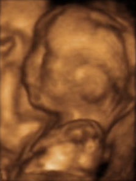

# USG OBSTÉTRICA: MORFOLÓGICO DO 1º E 2º TRIMESTRES E AVALIAÇÃO DE CRESCIMENTO

A ultrassonografia (USG) deixou de ser um exame complementar para se tornar uma extensão do exame físico na obstetrícia moderna. Para a prova de residência, você não deve encarar o USG como um "laudo pronto", mas como uma ferramenta de decisão clínica. O examinador quer saber se você sabe o que pedir, quando pedir e, principalmente, o que fazer com o resultado alterado.

## O Primeiro Trimestre: Muito Além da Confirmação

Muitos alunos pensam que o USG de primeiro trimestre serve apenas para ver se "está tudo bem" e datar a gestação. Na verdade, este é o momento mais crítico para definições que mudarão todo o pré-natal.

### Datação Gestacional: O Padrão-Ouro

Se você tiver uma paciente com DUM (Data da Última Menstruação) incerta ou ciclos irregulares, o USG de primeiro trimestre é o seu único norte confiável. O parâmetro mais preciso para datar uma gestação é o Comprimento Cabeça-Nádega (CCN).

Por que o CCN? Porque nesta fase inicial, o crescimento embrionário é muito uniforme, sofrendo pouca influência de fatores externos ou genéticos. A margem de erro entre 7 e 12 semanas é de apenas 3 a 5 dias. Se houver discrepância maior que 5 dias entre a DUM e o CCN, a idade gestacional deve ser corrigida pelo USG. Guarde isso: a partir do segundo trimestre, a margem de erro sobe para 7 a 10 dias, e no terceiro trimestre, pode chegar a 3 semanas. Portanto, o primeiro USG é o que manda para o resto da vida dessa gestante.

### Marcadores de Aneuploidias (11 a 13 semanas e 6 dias)

Este é o famoso "Morfológico de Primeiro Trimestre". Ele deve ser realizado obrigatoriamente quando o CCN está entre 45 mm e 84 mm. Se o CCN for 85 mm, você perdeu a janela da Translucência Nucal (TN).

A TN é o acúmulo de fluido na região nucal do feto. O valor de normalidade é geralmente abaixo do percentil 95 para aquele CCN (na prática de prova, valores acima de 2,5 mm ou 3,0 mm acendem o alerta). Mas cuidado: a TN sozinha não diagnostica nada. Ela é um rastreamento. Se estiver aumentada, o risco para Trissomia do 21 (Down), 18 (Edwards) e 13 (Patau) aumenta drasticamente, assim como o risco de cardiopatias congênitas.

Além da TN, avaliamos:

- **Osso Nasal:** A ausência do osso nasal no primeiro trimestre é um marcador fortíssimo para Síndrome de Down.

- **Ducto Venoso:** Avaliamos a onda "a" (contração atrial). Se a onda "a" estiver reversa ou ausente, há alto risco de aneuploidia ou insuficiência cardíaca fetal.

- **Regurgitação Tricúspide:** Também associada a cardiopatias e cromossomopatias.

### Gemelaridade: O Sinal do Lambda e do T

Aqui o Dr. Will sempre reforça: o diagnóstico de corionicidade (quantas placentas) deve ser feito no primeiro trimestre. É muito mais fácil ver agora do que depois que as placentas crescem e se encostam.

- **Sinal do Lambda (ou sinal do Y):** Indica gestação dicoriônica (duas placentas). Há uma projeção de tecido placentário entre as membranas.

- **Sinal do T:** Indica gestação monocoriônica (uma placenta). A membrana se insere abruptamente na placenta, formando um T.

Por que isso importa? Porque gestações monocoriônicas têm riscos altíssimos de Síndrome de Transfusão Feto-Fetal e exigem vigilância quinzenal.

### Rastreamento de Pré-eclâmpsia

No morfológico de primeiro trimestre, o Doppler das artérias uterinas já pode ser realizado. Se o Índice de Pulsatilidade (IP) médio estiver elevado, isso indica uma falha na primeira onda de invasão trofoblástica. Nestes casos, a FEBRASGO recomenda o uso de Aspirina (100-150 mg) antes das 16 semanas para reduzir o risco de pré-eclâmpsia grave e restrição de crescimento.

## O Segundo Trimestre: A Anatomia em Detalhes

O USG Morfológico de Segundo Trimestre deve ser realizado entre 20 e 24 semanas. É a "revisão completa do carro".

### Avaliação Morfológica

Neste exame, o radiologista ou obstetra ultrassonografista avalia cada órgão. O foco é detectar malformações estruturais.

- **SNC:** Ventriculomegalia, espinha bífida (sinal do limão e da banana no crânio).

- **Face:** Fendas labiopalatinas.

- **Coração:** O corte das 4 câmaras e as saídas dos grandes vasos. Lembre-se que o "teste do coraçãozinho" no pós-natal é uma triagem, mas o morfológico é onde detectamos a maioria das cardiopatias críticas.

- **TGI:** Atresia de esôfago (estômago não visível + polidramnia) ou onfalocele/gastrosquise.

### Cervicometria: A Prevenção do Parto Prematuro

Este é, talvez, o ponto que mais cai em provas de residência. Durante o morfológico de segundo trimestre, devemos medir o comprimento do colo uterino por via transvaginal.

O valor de corte mágico é **25 mm**.

- **Paciente sem antecedente de parto prematuro + Colo < 25 mm:** Prescrever Progesterona Vaginal (200 mg) à noite até 36 semanas.

- **Paciente COM antecedente de parto prematuro + Colo < 25 mm:** Aqui a conduta é mais agressiva. Indica-se a Cerclagem Cervical (técnica de McDonald) e também o uso de progesterona.

Muitos alunos confundem Incompetência Istmocervical (IIC) com colo curto. A IIC é um diagnóstico clínico: perdas fetais tardias, indolores, com dilatação cervical rápida. A cerclagem para IIC é feita precocemente (12-14 semanas). A cerclagem por "colo curto" no USG é uma medida de resgate baseada no rastreamento.

| Situação Clínica | Achado USG (Colo) | Conduta Recomendada |
| --- | --- | --- |
| Primigesta (Baixo Risco) | > 25 mm | Rotina de pré-natal |
| Primigesta (Baixo Risco) | < 25 mm | Progesterona Vaginal |
| Antecedente de Parto Pré-termo | < 25 mm | Cerclagem + Progesterona |
| Suspeita Clínica de IIC | N/A | Cerclagem eletiva (12-14 sem) |

## Avaliação de Crescimento e Vitalidade

No terceiro trimestre, o foco muda. Não estamos mais tão preocupados com a formação (que já terminou), mas com o ganho de peso e o funcionamento da placenta.

### Biometria Fetal

Usamos quatro medidas principais para estimar o peso fetal:

- Diâmetro Biparietal (DBP)

- Circunferência Cefálica (CC)

- Circunferência Abdominal (CA)

- Comprimento do Fêmur (CF)

A **Circunferência Abdominal (CA)** é o parâmetro isolado mais importante para o peso. Por quê? Porque o abdome fetal reflete o tamanho do fígado e o depósito de glicogênio. Em fetos com restrição de crescimento (CIUR), o fígado é o primeiro a sofrer, e a CA "achata" na curva. Em fetos de mães diabéticas, a CA explode devido ao hiperinsulinismo fetal e acúmulo de gordura/glicogênio.

### Restrição de Crescimento Intrauterino (CIUR)

O diagnóstico de CIUR é feito quando o peso fetal estimado está abaixo do percentil 10 para a idade gestacional. Mas atenção: nem todo feto P10 é doente. Existem os "Pequenos para a Idade Gestacional (PIG) Constitucionais", que são apenas bebês geneticamente pequenos, mas com Doppler normal.

O CIUR "verdadeiro" geralmente se divide em:

- **Tipo I (Simétrico):** Ocorre precocemente. Todas as medidas (cabeça, abdome, fêmur) estão reduzidas proporcionalmente. Causas: Aneuploidias, infecções congênitas (TORCH) ou insultos muito precoces.

- **Tipo II (Assimétrico):** É o mais comum. Ocorre no final do segundo ou no terceiro trimestre. O feto prioriza o cérebro (centralização), então a cabeça está normal, mas o abdome é pequeno. Causa principal: Insuficiência Placentária (Pré-eclâmpsia, tabagismo).

### Líquido Amniótico

O volume de líquido amniótico é um marcador indireto de perfusão renal fetal. Se o feto está bem oxigenado, ele urina. Se há hipóxia, ele faz redistribuição de fluxo (poupa cérebro e coração, sacrifica rins), urina menos e o líquido cai (oligodramnia).

- **ILA (Índice de Líquido Amniótico):** Normal entre 8 e 24 cm. < 5 cm é oligodramnia. > 24 cm é polidramnia.

- **Maior Bolsão Vertical (MBV):** Normal entre 2 e 8 cm. É o parâmetro preferido em gestações gemelares.

## Dopplerfluxometria: A Fisiopatologia na Tela

O Doppler não mede "fluxo" de sangue, ele mede resistência. No MedEvo, sempre ensinamos que o Doppler é a nossa janela para a saúde da placenta e a resposta do feto ao estresse.

### 1. Artéria Umbilical (A Placenta)

A artéria umbilical leva sangue do feto para a placenta. Em uma gestação normal, a placenta é um órgão de baixa resistência (muito sangue passa fácil). Se a placenta está doente (infartos, fibrose), a resistência aumenta.

- **Diástole Zero:** A resistência é tão alta que o sangue para de fluir durante a diástole.

- **Diástole Reversa:** O sangue volta para o feto na diástole. É um sinal de gravidade extrema e morte iminente.

### 2. Artéria Cerebral Média (O Feto se Defendendo)

Normalmente, o cérebro é um órgão de alta resistência no feto. Se o feto percebe que a placenta está ruim (hipóxia), ele dilata as artérias cerebrais para garantir oxigênio nobre. Isso é a **Centralização Fetal**.

- Diagnóstico: IP da Cerebral Média baixo ou Relação Cérebro-Placentária (RCP) < 1.

### 3. Ducto Venoso (O Coração Falhando)

O ducto venoso reflete a pressão no átrio direito. Se o feto está centralizado há muito tempo, o coração começa a falhar por acidose e sobrecarga. A onda "a" do ducto venoso fica negativa.

- **Onda "a" reversa no 3º trimestre:** É indicação de parto imediato, independente da idade gestacional (acima da viabilidade), pois o risco de óbito fetal em 24-48h é altíssimo.

| Vaso Avaliado | O que representa? | Alteração Crítica |
| --- | --- | --- |
| Artéria Umbilical | Saúde da Placenta | Diástole Zero ou Reversa |
| Cerebral Média | Resposta Fetal (Hipóxia) | Vasodilatação (IP baixo) |
| Ducto Venoso | Função Cardíaca (Acidose) | Onda "a" reversa |
| Artérias Uterinas | Risco Materno (Pré-eclâmpsia) | Persistência de entalhe ou IP alto |

## Situações Especiais e Pegadinhas de Prova

### Placenta Prévia

O diagnóstico definitivo de placenta prévia só deve ser feito após a **28ª semana**. Antes disso, o segmento inferior do útero ainda está se formando e a placenta pode "subir" (migração placentária). Se o examinador te der um USG de 18 semanas com placenta cobrindo o colo, a conduta é repetir o exame no terceiro trimestre, e não indicar cesárea imediata.

### Hérnia Fisiológica

Até a **12ª semana**, é normal ver alças intestinais dentro da base do cordão umbilical. Isso é a herniação fisiológica. Se você vir isso num USG de 9 semanas, não marque "onfalocele". É normal. O intestino deve retornar para a cavidade abdominal até a 13ª semana.

### Streptococcus agalactiae (GBS)

Cuidado com a cronologia! O rastreamento de GBS com swab vaginal e anal é feito entre **35 e 37 semanas**. Não se faz no primeiro nem no segundo trimestre. A única exceção é se a paciente tiver uma urocultura positiva para GBS em qualquer fase da gestação; nesse caso, ela já tem indicação de profilaxia no parto, independente do swab.

### Diabetes Gestacional e USG

No diabetes, o USG é fundamental para monitorar a macrossomia. Se a CA estiver acima do percentil 90, mesmo que a glicemia de jejum pareça controlada, isso sugere que o controle metabólico não está ideal. Além disso, o polidramnia (ILA > 24) é muito comum devido à diurese osmótica fetal (o feto fica hiperglicêmico e urina mais).

## Pontos-Chave para Prova

- **Datação mais precisa:** CCN entre 7 e 12 semanas (margem de erro de 3-5 dias).

- **Janela da Translucência Nucal:** CCN entre 45 e 84 mm (11 semanas a 13 semanas e 6 dias).

- **Marcadores de Aneuploidia:** TN aumentada, Osso Nasal ausente, Ducto Venoso com onda "a" alterada, Regurgitação Tricúspide.

- **Corionicidade:** Deve ser definida no 1º trimestre. Sinal do Lambda = Dicoriônica; Sinal do T = Monocoriônica.

- **Prevenção de Pré-eclâmpsia:** Doppler de artérias uterinas alterado no 1º trimestre -> Aspirina e Cálcio.

- **Colo Curto:** < 25 mm entre 20-24 semanas. Se sem antecedente: Progesterona. Se com antecedente: Cerclagem + Progesterona.

- **CIUR Tipo I (Simétrico):** Precoce, feto todo pequeno. Pensar em genética ou infecção (TORCH).

- **CIUR Tipo II (Assimétrico):** Tardio, abdome pequeno (CA baixa). Pensar em insuficiência placentária.

- **Centralização Fetal:** Priorização de fluxo para o cérebro (vasodilatação da Artéria Cerebral Média).

- **Ducto Venoso com onda "a" reversa:** Marcador de acidemia fetal e falência cardíaca; iminência de óbito.

- **Placenta Prévia:** Diagnóstico apenas após 28 semanas devido à migração placentária.

- **Polidramnia:** ILA > 24 cm ou Maior Bolsão Vertical > 8 cm. Investigar Diabetes e malformações digestivas.

- **Oligodramnia:** ILA < 5 cm ou Maior Bolsão Vertical < 2 cm. Investigar Ruptura de Membranas (RPMO) e Insuficiência Placentária.

- **O que NÃO fazer:** Não datar gestação pelo USG de 3º trimestre se houver um de 1º trimestre disponível. Não diagnosticar onfalocele antes de 12 semanas. 🚀

 Cópia offline para consulta pessoal.
 Fonte original:
 [https://www.medevo.com.br/material-apoio/ler/2b56321d-b475-4730-8710-5d9bf78eb9bb](https://www.medevo.com.br/material-apoio/ler/2b56321d-b475-4730-8710-5d9bf78eb9bb)
