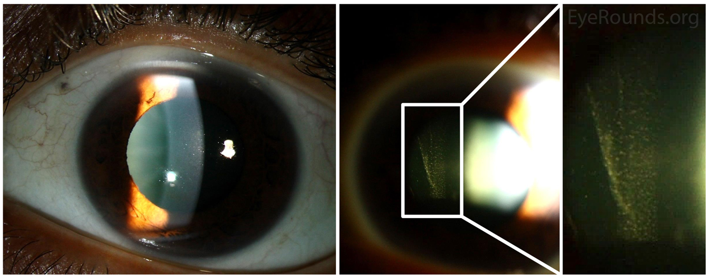
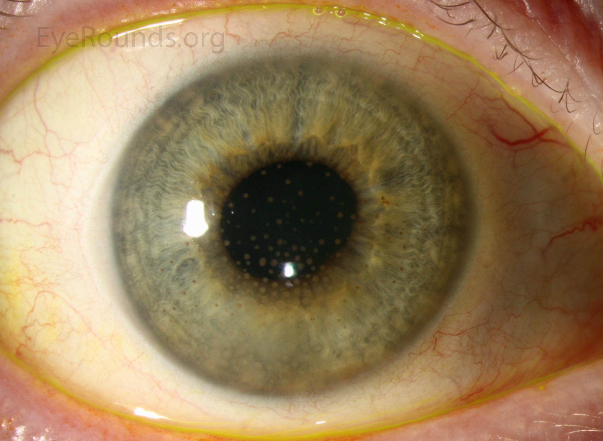
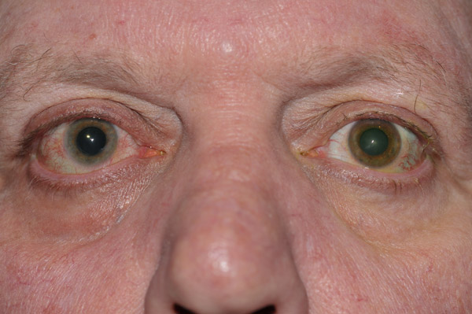
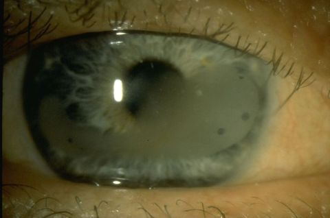
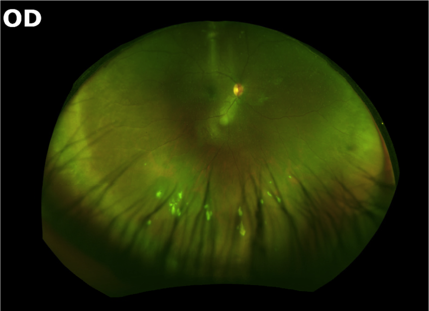
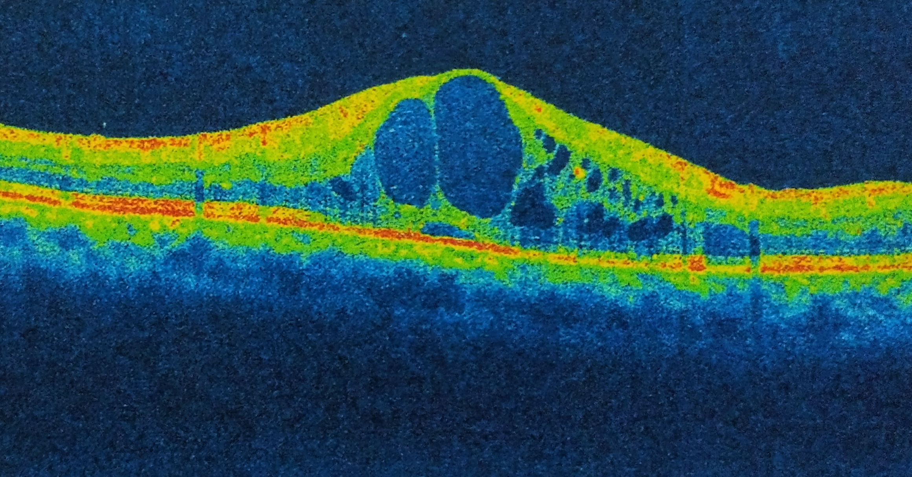

# UVEÍTES ANTERIORES E INTERMEDIÁRIAS

Para entender as uveítes, a primeira coisa que você precisa esquecer é a ideia de que o olho é um órgão isolado. Como sempre digo nas aulas do MedEvo, o olho é uma janela para o sistema imune. Quando falamos de uveíte anterior e intermediária, estamos falando de processos inflamatórios que, muitas vezes, são a primeira manifestação de doenças reumatológicas, infecciosas ou neurológicas graves.

A classificação que utilizamos hoje, e que as bancas de residência exigem, é a do grupo **SUN (Standardization of Uveitis Nomenclature)**. Ela não se baseia apenas na "causa", mas principalmente na anatomia. Se a inflamação está primariamente na câmara anterior (íris e corpo ciliar anterior), é anterior. Se o foco principal é o vítreo e a pars plana, é intermediária.

## Classificação e Nomenclatura SUN

O grupo SUN padronizou como devemos descrever uma uveíte. Isso é fundamental porque, em uma prova, o enunciado vai descrever o "tempo" e o "curso" da doença, e você precisa saber o que cada termo significa para marcar a alternativa correta.

### Início e Duração

O início pode ser **súbito** ou **insidioso**. Uveítes agudas costumam ter início súbito. Já as crônicas, como a associada à Artrite Idiopática Juvenil (AIJ), costumam ser insidiosas, o que é um perigo, pois o paciente demora a perceber.

Quanto à duração, definimos como **limitada** quando o episódio dura menos de 3 meses, e **persistente** quando ultrapassa esse período.

### Curso da Doença

Aqui é onde muitos alunos se confundem. Preste atenção:

- **Aguda:** Início súbito e duração limitada.

- **Recorrente:** Episódios agudos que se repetem, mas com períodos de remissão (sem inflamação) de pelo menos 3 meses sem tratamento entre eles.

- **Crônica:** Inflamação persistente que recai em menos de 3 meses após a interrupção do tratamento.

**Dica de Prova:** Se o enunciado diz que o paciente parou o colírio e a inflamação voltou em 2 semanas, a doença é **crônica**, não recorrente. A banca vai tentar te enganar com isso.

| Termo | Definição SUN |
| --- | --- |
| Início Súbito | Sintomas aparecem rapidamente (horas/dias) |
| Início Insidioso | Sintomas graduais, muitas vezes assintomáticos |
| Aguda | Episódio de início súbito e duração limitada |
| Recorrente | Episódios repetidos separados por > 3 meses de inatividade |
| Crônica | Inflamação que recidiva antes de 3 meses após parar o tratamento |

## Uveíte Anterior: A "Irite" e a "Iridociclite"

A uveíte anterior é a forma mais comum de inflamação intraocular. O paciente clássico chega ao pronto-socorro com dor ocular, fotofobia e olho vermelho. Mas cuidado: nem todo olho vermelho é conjuntivite.

### Fisiopatologia: Por que dói e por que fica vermelho?

A dor da uveíte anterior é uma dor profunda, que piora com a luz. Por que? Porque a luz causa a contração da íris inflamada (miose reflexa) e o espasmo do corpo ciliar. É por isso que o tratamento SEMPRE envolve um colírio dilatador (cicloplégico), para "engessar" o músculo ciliar e aliviar a dor.

O olho fica vermelho devido à **injeção ciliar** (ou periquerática). Diferente da conjuntivite, onde os vasos periféricos estão mais dilatados, na uveíte o vermelhão é mais intenso ao redor do limbo (a borda da córnea).

### O Exame na Lâmpada de Fenda

Como professor, eu sempre digo: o diagnóstico da uveíte é feito na lâmpada de fenda. Você precisa procurar dois sinais cardinais: **Células** e **Flare**.

- **Células (Efeito Tyndall):** São leucócitos flutuando no humor aquoso. Imagine um cinema escuro onde você vê a poeira flutuando no feixe de luz do projetor. Aquilo é o Tyndall.

- **Flare:** É a turvação do humor aquoso devido ao extravasamento de proteínas por quebra da barreira hemato-aquosa. É como se o líquido estivesse "sujo" ou "nebuloso".

*Figura 1: Efeito Tyndall. O feixe de luz ilumina as células inflamatórias flutuando na câmara anterior, sinal patognomônico de uveíte anterior ativa.*

A graduação das células é o que guia nosso tratamento. Segundo o SUN:

- 0: < 1 célula por campo

- 0,5+: 1 a 5 células

- 1+: 6 a 15 células

- 2+: 16 a 25 células

- 3+: 26 a 50 células

- 4+: > 50 células (intenso)

**Cuidado:** Se você encontrar um nível de células brancas acumuladas na parte inferior da câmara anterior, chamamos isso de **Hipópio**. Isso indica uma inflamação grave e deve acender um alerta para causas específicas, como a Doença de Behçet ou a Síndrome de HLA-B27.

### Precipitados Ceráticos (PKs)

São depósitos de células inflamatórias na face posterior da córnea. Eles nos dão a dica diagnóstica principal:

- **PKs Finos (Não-granulomatosos):** Pequenos, brancos, típicos de uveítes agudas como as associadas ao HLA-B27.

- **PKs "Gordura de Carneiro" (Granulomatosos):** Grandes, amarelados, com aspecto gorduroso. Indicam doenças granulomatosas como Sarcoidose, Tuberculose ou Sífilis.

*Figura 2: PKs Granulomatosos ("Gordura de Carneiro"). Esses agregados de macrófagos e células epitelioides no endotélio corneano obrigam a investigação para Sarcoidose, Sífilis e TB.*

## Principais Etiologias da Uveíte Anterior

Aqui é onde a prova de residência ganha corpo. Você precisa associar o achado ocular com a doença sistêmica.

### 1. Uveítes Associadas ao HLA-B27

Este é o grupo mais importante para provas. Inclui a Espondilite Anquilosante, a Artrite Reativa, a Artrite Psoriática e a Doença Inflamatória Intestinal (DII).

O quadro é clássico:

- Uveíte anterior aguda, unilateral (mas que pode alternar de olho em episódios diferentes).

- Muita fibrina na câmara anterior (o aquoso fica "gelatinoso").

- Tendência a formar **sinéquias posteriores** (a íris gruda no cristalino).

- Forte associação com dor lombar crônica que melhora com o exercício (espondiloartropatias).

**Exemplo Clínico:** Homem, 30 anos, com dor e vermelhidão súbita no olho direito. Refere que há dois anos teve quadro semelhante no olho esquerdo. Queixa-se de rigidez matinal na coluna. Diagnóstico provável? Uveíte anterior associada ao HLA-B27/Espondilite Anquilosante.

### 2. Uveíte Heterocrômica de Fuchs

Esta é a "queridinha" das bancas porque ela quebra as regras.

- É crônica e geralmente assintomática (o paciente não tem dor nem olho vermelho).

- **Heterocromia:** O olho afetado costuma ser mais claro (perda de pigmento da íris).

*Figura 3: Heterocromia de Fuchs. A inflamação crônica e insidiosa leva à atrofia do estroma iriano, fazendo com que o olho afetado (geralmente unilateral) torne-se mais claro.*

- **PKs difusos:** Os precipitados ceráticos estão espalhados por toda a córnea, não apenas na parte inferior (triângulo de Arlt).

- **NÃO forma sinéquias:** Isso é uma pegadinha clássica. Se houver sinéquia, não é Fuchs.

- **Tratamento:** Não responde bem a corticoides e, geralmente, nem precisa deles. O foco é tratar as complicações (catarata e glaucoma).

### 3. Uveíte Herpética (HSV ou VZV)

Suspeite sempre que houver:

- Atrofia de íris (setorial ou difusa).

- Pressão intraocular (PIO) elevada (diferente da maioria das uveítes, onde a PIO baixa por hipoprodução de humor aquoso).

- Diminuição da sensibilidade corneana.

### 4. Artrite Idiopática Juvenil (AIJ)

A maior causa de uveíte na infância. O perigo aqui é o silêncio. A criança não reclama de dor. A uveíte é crônica, bilateral e não-granulomatosa. Se não diagnosticada precocemente, leva à **ceratopatia em faixa** (depósito de cálcio na córnea) e catarata.

*Figura 4: Ceratopatia em faixa. Ocorre na área interpalpebral devido à inflamação crônica não tratada, como nas crianças assintomáticas com Artrite Idiopática Juvenil (AIJ).*

| Etiologia | Características Marcantes | Granulomatosa? |
| --- | --- | --- |
| HLA-B27 | Unilateral alternante, muita fibrina, dor lombar | Não |
| Fuchs | Heterocromia, PKs difusos, sem sinéquias | Não |
| Herpética | Atrofia de íris, PIO alta, hipoestesia | Pode ser |
| Sarcoidose | PKs em gordura de carneiro, nódulos de íris | Sim |
| AIJ | Meninas, FAN+, assintomática, ceratopatia em faixa | Não |

## Uveíte Intermediária

A uveíte intermediária é aquela onde o sítio primário da inflamação é o vítreo. O termo **Pars Planitis** é reservado para os casos idiopáticos onde há formação de "snowbanks" (bancos de neve).

### Quadro Clínico: As "Moscas Volantes"

Diferente da anterior, aqui o paciente raramente tem dor ou olho vermelho. A queixa principal é:

- **Moscas volantes (floaters):** Devido às células e debris no vítreo.

- **Basta visual:** Geralmente causada pelo **Edema Macular Cistoide (EMC)**, que é a principal causa de perda de visão nestes pacientes.

### Sinais Clínicos Específicos

Ao examinar o fundo de olho (ou a periferia com depressão escleral), procuramos:

- **Vitrite:** Células no vítreo. Graduamos de 0 a 4+ conforme a visibilidade do nervo óptico e vasos.

- **Snowballs:** Agregados de células inflamatórias esbranquiçadas flutuando no vítreo periférico.

- **Snowbanks:** Exsudatos esbranquiçados que recobrem a pars plana, geralmente inferiores.

*Figura 5: Snowballs no vítreo inferior. Achado característico da uveíte intermediária/pars planitis. O paciente queixa-se intensamente de moscas volantes.*

### Associações Sistêmicas da Uveíte Intermediária

Embora a maioria seja idiopática (Pars Planitis), você deve investigar:

- **Esclerose Múltipla:** Existe uma forte associação. Um paciente jovem com uveíte intermediária pode desenvolver sintomas neurológicos anos depois.

- **Sarcoidose:** Pode causar qualquer tipo de uveíte, inclusive a intermediária.

- **Sífilis e Tuberculose:** Sempre devem ser descartadas em qualquer uveíte.

Como o Dr. Will sempre enfatiza, na uveíte intermediária, o diagnóstico diferencial é a chave para não deixar passar uma doença desmielinizante.

## Diagnóstico e Investigação Laboratorial

Não pedimos exames para todo mundo. Se for o primeiro episódio de uma uveíte anterior aguda, unilateral e não-granulomatosa, podemos apenas tratar.

**Quando investigar?**

- Uveítes granulomatosas.

- Uveítes bilaterais.

- Uveítes recorrentes ou crônicas.

- Uveítes intermediárias, posteriores ou panuveítes.

### Exames de "Triagem" (O "Screening" Mínimo)

- **Hemograma e VHS/PCR:** Indicadores inespecíficos de inflamação.

- **Sífilis:** VDRL e FTA-ABS (obrigatório, a sífilis imita qualquer quadro).

- **Tuberculose:** PPD ou IGRA e Raio-X de Tórax.

- **Sarcoidose:** Raio-X de Tórax (procurar linfonodos hilares) e Enzima Conversora de Angiotensina (ECA).

- **HLA-B27:** Se houver suspeita de espondiloartropatias.

**Erro Comum:** Pedir "sorologias para toxoplasmose" em uveíte anterior isolada. A toxoplasmose causa retinocoroidite (uveíte posterior). Se a câmara anterior está inflamada na toxo, é uma reação secundária ("uveíte anterior satélite"). Não gaste dinheiro do paciente sem necessidade.

## Tratamento Farmacológico

O objetivo é simples: controlar a inflamação, aliviar a dor e prevenir complicações (sinéquias).

### 1. Corticoides Tópicos

É a base do tratamento da uveíte anterior.

- **Acetato de Prednisolona 1%:** É o padrão ouro pela excelente penetração intraocular.

- **Dose:** Depende da gravidade. Em casos 4+, podemos usar de 1/1 hora ou até de 15/15 minutos nas primeiras horas (ataque).

- **Desmame:** NUNCA pare o corticoide abruptamente. Isso causa o efeito rebote. Se o paciente está usando 6x ao dia, reduza para 5x, 4x... ao longo de semanas.

### 2. Cicloplégicos (Midriáticos)

Servem para duas coisas:

- **Alívio da dor:** Paralisam o músculo ciliar.

- **Prevenir Sinéquias:** Uma íris que se move menos e está dilatada tem menos chance de grudar no cristalino.

- **Tropicamida 1%:** Ação curta, boa para casos leves.

- **Ciclopentolato 1%:** Ação intermediária.

- **Atropina 1%:** Ação prolongada (até 2 semanas), reservada para inflamações muito intensas com muita fibrina.

### 3. Tratamento da Uveíte Intermediária

Aqui o colírio não chega bem no vítreo. Por isso, mudamos a estratégia:

- **Injeções Perioculares (Subtenoniana):** Triancinolona. Ótima para casos unilaterais.

- **Corticoides Sistêmicos:** Prednisona oral (1mg/kg/dia). Usada se houver bilateralidade ou falha do tratamento local.

- **Imunomoduladores:** Metotrexato, Azatioprina ou Ciclosporina. Usados quando precisamos de tratamento a longo prazo e queremos evitar os efeitos colaterais do corticoide (poupadores de corticoide).

- **Biológicos:** Anti-TNF (Adalimumabe) tem ganhado muito espaço em casos refratários.

### 4. Tratamento Não-Farmacológico e MEV

Embora a uveíte seja imunomediada, orientamos:

- **Repouso visual:** Durante a fase aguda, a fotofobia é intensa.

- **Óculos escuros:** Conforto sintomático.

- **Cessação do tabagismo:** O cigarro é um fator de risco comprovado para recorrência de uveítes e piora do edema macular.

## Complicações: O que realmente cega o paciente?

A inflamação por si só é ruim, mas as sequelas são piores.

- **Catarata:** A "catarata complicada" (subcapsular posterior) surge tanto pela inflamação crônica quanto pelo uso prolongado de corticoides.

- **Glaucoma Secundário:** Pode ser por fechamento angular (sinéquias) ou por "bloqueio pupilar". Além disso, o corticoide pode aumentar a PIO em pacientes "respondedores".

- **Edema Macular Cistoide (EMC):** É a principal causa de baixa visão na uveíte intermediária. Ocorre pelo acúmulo de líquido na mácula devido à inflamação crônica.

*Figura 6: Edema Macular Cistoide (EMC) no OCT. Os cistos intrarretinianos causam espessamento foveal e baixa visual drástica. O alvo principal do tratamento é evitar essa complicação.*
4. **Ceratopatia em Faixa:** Depósito de cálcio na superfície da córnea, muito comum na AIJ.

## Situações Especiais

### Gestantes

O uso de corticoides tópicos é geralmente seguro, mas o uso sistêmico deve ser pesado contra os riscos de fenda palatina (no primeiro trimestre) e restrição de crescimento fetal. Imunomoduladores como o Metotrexato são **absolutamente contraindicados** (teratogênicos).

### Idosos

Sempre desconfie de "Síndromes Mascaradas". Um linfoma intraocular pode se apresentar exatamente como uma uveíte intermediária crônica que não melhora com corticoide. Se o paciente é idoso e a uveíte é atípica, pense em malignidade.

## Metas Terapêuticas e Prognóstico

Nossa meta não é "melhorar um pouco". É **Inflamação Zero** (Células 0 no SUN). Qualquer persistência de 0,5+ de células pode levar a danos estruturais a longo prazo.

O prognóstico depende da etiologia. Uveítes por HLA-B27 costumam ter bom prognóstico visual se tratadas agressivamente nas crises. Já a uveíte por AIJ ou Sarcoidose pode ser devastadora se o diagnóstico for tardio.

## Pontos-Chave para Prova 🎯

- **Classificação SUN:** Baseada na anatomia. Anterior (câmara anterior), Intermediária (vítreo), Posterior (retina/coroide), Panuveíte (tudo).

- **Uveíte Anterior Aguda:** Tríade de dor, fotofobia e olho vermelho com injeção ciliar.

- **HLA-B27:** Causa uveíte anterior aguda, unilateral alternante, com muita fibrina e hipópio. Associada à Espondilite Anquilosante.

- **Uveíte de Fuchs:** Crônica, assintomática, heterocromia, PKs difusos, **NÃO** faz sinéquia. Não tratar com corticoide de rotina.

- **Artrite Idiopática Juvenil (AIJ):** Uveíte crônica, bilateral, assintomática em meninas FAN+. Causa ceratopatia em faixa.

- **Uveíte Intermediária:** Principal sintoma é moscas volantes e embaçamento (EMC). Sinais: Snowballs e Snowbanks.

- **Esclerose Múltipla:** Principal associação sistêmica neurológica da uveíte intermediária.

- **Precipitados Ceráticos (PKs):** "Gordura de carneiro" = Granulomatosa (Sarcoidose, TB, Sífilis). Finos = Não-granulomatosa.

- **Tratamento Anterior:** Corticoide tópico (Prednisolona 1%) + Cicloplégico (para dor e evitar sinéquia).

- **Tratamento Intermediária:** Corticoide periocular ou sistêmico. Colírio não funciona bem para o vítreo.

- **Sinéquia Posterior:** Adesão da íris ao cristalino. Prevenida com midriáticos.

- **Edema Macular Cistoide:** Principal causa de perda visual permanente em uveítes intermediárias e crônicas.

- **Atrofia de Íris + PIO Alta:** Pense em Herpes (HSV ou VZV).

- **Sífilis:** A grande imitadora. Deve ser pesquisada em qualquer uveíte que fuja do padrão ou seja granulomatosa.

- **O que NÃO fazer:** Nunca interromper corticoide tópico abruptamente (risco de rebote). Nunca usar Metotrexato em gestantes.

- **Valores SUN:** Células 0 (<1), 1+ (6-15), 2+ (16-25), 3+ (26-50), 4+ (>50). Meta é sempre zero.

 Cópia offline para consulta pessoal.
 Fonte original:
 [https://www.medevo.com.br/material-apoio/ler/1103a66a-cb96-4938-acff-f37ea83d2667](https://www.medevo.com.br/material-apoio/ler/1103a66a-cb96-4938-acff-f37ea83d2667)
