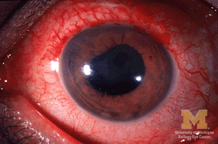

# UVEÍTES NÃO-INFECCIOSAS E MASCARADAS

Para entender as uveítes não-infecciosas, você precisa primeiro mudar a chave mental do "agressor externo" para o "erro interno". Nas uveítes infecciosas, o tratamento foca em matar o bicho. Aqui, o foco é domar o sistema imune que decidiu atacar o próprio olho.

Muitos alunos erram em prova porque tentam decorar uma lista infinita de doenças. O segredo é entender o padrão. Se o olho está inflamado e não há evidência de vírus, bactéria, fungo ou protozoário, estamos no terreno da autoimunidade ou da autoinflamação.

Mas cuidado: antes de dar corticoide para todo mundo, precisamos descartar as "mascaradas". Elas são os lobos em pele de cordeiro da oftalmologia. É aquele linfoma que finge ser uma uveíte posterior e que, se você tratar com corticoide, melhora um pouco, te engana, e depois mata o paciente.

## Classificação e a Linguagem Universal (SUN)

Antes de falarmos de doenças específicas, precisamos falar a mesma língua. A classificação do grupo *Standardization of Uveitis Nomenclature* (SUN) é o que as bancas usam para descrever os casos clínicos. Se você ler "células 3+" e não souber o que isso significa, você não fecha o diagnóstico.

A uveíte é classificada anatomicamente pelo local primário da inflamação. Isso é fundamental porque guia o seu raciocínio diferencial.

- **Anterior:** O foco é a câmara anterior (irite, iridociclite).

- **Intermediária:** O foco é o vítreo e a *pars plana*.

- **Posterior:** O foco é a retina ou a coroide.

- **Panuveíte:** Inflamação em todos os segmentos, sem um local predominante.

Por que essa divisão importa? Porque uma uveíte anterior aguda unilateral recorrente grita "HLA-B27" no seu ouvido, enquanto uma panuveíte bilateral com descolamento de retina seroso te empurra para o diagnóstico de Vogt-Koyanagi-Harada.

### Quantificando a Inflamação

Na prova, o examinador vai descrever o exame na lâmpada de fenda. Você precisa saber os valores exatos da classificação SUN para células na câmara anterior (campo de 1mm x 1mm):

| Grau | Células por campo |
| --- | --- |
| 0 | < 1 |
| 0,5+ | 1 a 5 |
| 1+ | 6 a 15 |
| 2+ | 16 a 25 |
| 3+ | 26 a 50 |
| 4+ | > 50 |

O "Flare" (turvação aquosa) reflete a quebra da barreira hemato-aquosa e a presença de proteínas. Ele é graduado de 0 a 4+, onde 3+ é quando os detalhes da íris estão embaçados e 4+ é quando o humor aquoso parece um "plástico" fixo (fibrina intensa).

## Uveítes Anteriores Não-Infecciosas

As uveítes anteriores são as mais comuns na prática clínica e nas provas. O grande grupo aqui são as associadas ao antígeno leucocitário humano B27 (HLA-B27).

### Uveítes HLA-B27 Positivas

Imagine um homem jovem, 25 anos, que chega com dor ocular súbita, fotofobia e olho muito vermelho. Ele conta que já teve isso no outro olho há seis meses. Se a questão mencionar dor lombar que melhora com o exercício (espondilite anquilosante), o diagnóstico está dado.

Por que o HLA-B27 causa isso? Existe uma teoria de mimetismo molecular onde o sistema imune, ao tentar combater certas bactérias intestinais, acaba atacando tecidos que expressam o HLA-B27.

As características clássicas que caem em prova são:

- Início súbito e unilateral (mas pode alternar os olhos em episódios diferentes).

- Crises recorrentes.

- Presença de fibrina e, às vezes, hipópio (acúmulo de pus na câmara anterior).

- Forte associação com espondiloartropatias (Espondilite Anquilosante, Síndrome de Reiter/Artrite Reativa, Psoríase e Doença Inflamatória Intestinal).

**Dica de Prova:** A tríade da Artrite Reativa (antiga Síndrome de Reiter) é clássica: "Não consegue enxergar (uveíte/conjuntivite), não consegue urinar (uretrite) e não consegue subir no altar (artrite)".

### Artrite Idiopática Juvenil (AIJ)

Aqui mora o perigo e o erro clássico de muitos residentes. Diferente do adulto com HLA-B27, a criança com AIJ e uveíte costuma ser **assintomática**. O olho não fica vermelho. A criança não reclama. Quando os pais percebem, ela já tem catarata ou ceratopatia em faixa.

O perfil típico é: menina, oligoarticular (menos de 4 articulações), com FAN (fator antinuclear) positivo.

- Por que o FAN importa? Porque ele é o maior preditor de risco para o desenvolvimento de uveíte na criança com AIJ.

- Conduta obrigatória: Rastreio periódico com lâmpada de fenda, mesmo que a criança não sinta nada.

## Uveítes Intermediárias e Pars Planite

A uveíte intermediária é aquela onde o "grosso" da inflamação está no vítreo. O paciente reclama de "moscas volantes" (floaters) e visão turva.

O termo **Pars Planite** é reservado para os casos idiopáticos (sem causa sistêmica) que apresentam formação de "snowbanks" (bancos de neve) ou "snowballs" (bolas de neve) na periferia da retina, especificamente sobre a pars plana.

Por que o paciente perde visão aqui? Geralmente não é pela inflamação vítrea em si, mas pelo Edema Macular Cistoide (EMC). O Dr. Will sempre reforça nas discussões do MedEvo: em qualquer uveíte, se a visão caiu muito, procure o edema macular. É a complicação que mais cega nesses pacientes.

## Uveítes Posteriores e Panuveítes

Aqui entramos nas doenças que podem causar danos irreversíveis à retina e coroide. O raciocínio clínico deve ser dividido entre granulomatosas e não-granulomatosas.

### Sarcoidose Ocular

A sarcoidose é a grande mimetizadora. Ela pode causar qualquer tipo de uveíte, mas o padrão clássico é a panuveíte granulomatosa bilateral.

Sinais que a banca vai te dar:

- Precipitados ceráticos (KPs) em "gordura de carneiro" (mutton-fat). São grandes, amarelados e gordurosos.

- Nódulos de íris (Koeppe na borda pupilar, Busacca no estroma).

- Opacidades vítreas em "colar de pérolas".

- Perivasculite retiniana (em "pingo de cera de vela").

O diagnóstico baseia-se na biópsia (padrão-ouro: granuloma não caseificante) ou em exames sugestivos como a Enzima Conversora de Angiotensina (ECA) elevada e o RX de tórax com linfadenopatia hilar bilateral.

### Doença de Behçet

Esta é a favorita das bancas brasileiras. É uma vasculite multissistêmica de causa desconhecida. O quadro ocular clássico é uma panuveíte não-granulomatosa com crises explosivas.

O sinal patognomônico ocular é o **hipópio móvel**. Por que ele é móvel? Porque na Doença de Behçet há pouca fibrina no humor aquoso. Se o paciente deita de lado, o hipópio "escorre" para o lado. Isso é diferente da uveíte por HLA-B27, onde a fibrina "cola" o hipópio no fundo da câmara anterior.

Critérios diagnósticos (International Study Group):

- Úlceras orais recorrentes (obrigatório).

- Mais dois dos seguintes: úlceras genitais, lesões cutâneas (eritema nodoso), lesões oculares ou teste de patergia positivo.

**Cuidado:** O tratamento da Behçet ocular é agressivo desde o início. Não se brinca com Behçet; o uso de imunossupressores (como ciclosporina ou biológicos) é frequentemente indicado logo no diagnóstico para evitar a cegueira por vasculite retiniana oclusiva.

### Síndrome de Vogt-Koyanagi-Harada (VKH)

O VKH é uma doença autoimune contra os melanócitos. Por isso, afeta órgãos que têm pigmento: olhos (coroide), ouvidos (cóclea), meninges e pele.

A evolução ocorre em fases, e você precisa saber identificá-las:

- **Prodrômica:** Parece uma gripe ou meningite (febre, cefaleia, meningismo).

- **Uveítica aguda:** Panuveíte bilateral com descolamento de retina seroso (exsudativo) multifocal. É o "clássico" da prova.

- **Convalescença:** O pigmento da coroide é destruído, gerando o fundo de olho em "pôr do sol" (sunset glow fundus). Surgem as manchas de Sugiura (despigmentação no limbo).

- **Recorrência:** Uveíte anterior crônica.

O tratamento exige corticoterapia sistêmica em doses altas (ataque) com desmame muito lento (meses) para evitar a cronificação.

| Doença | Característica Marcante | Tipo de Inflamação |
| --- | --- | --- |
| **HLA-B27** | Unilateral, súbita, fibrina | Não-granulomatosa |
| **Sarcoidose** | Pingo de cera de vela, KPs mutton-fat | Granulomatosa |
| **Behçet** | Hipópio móvel, úlceras orais | Não-granulomatosa |
| **VKH** | Descolamento seroso, pôr do sol | Granulomatosa |

## Síndromes Mascaradas

Aqui está o maior medo do oftalmologista. Síndromes mascaradas são condições não-inflamatórias que se apresentam com células no vítreo ou na câmara anterior, simulando uma uveíte.

Se você tratar um Linfoma Intraocular com corticoide, as células somem temporariamente (o linfoma "derrete"), você acha que ganhou a batalha, mas o câncer continua progredindo. Isso é o que chamamos de "resposta terapêutica enganosa".

### Mascaradas Neoplásicas

- **Linfoma Primário do Vitreoretiniano (LPCNV):** É o principal. Geralmente um linfoma de grandes células B. Ocorre em idosos (60+ anos). Suspeite sempre que tiver uma "uveíte posterior" que não responde bem ao tratamento ou em idosos com vitrite intensa de início recente. O diagnóstico exige citologia do vítreo ou biópsia de retina.

- **Retinoblastoma:** Em crianças. Pode simular uma uveíte anterior com pseudohipópio (que na verdade são células tumorais).

- **Melanoma de Coroide:** Pode causar inflamação secundária por necrose tumoral.

### Mascaradas Não-Neoplásicas

- **Corpo Estranho Intraocular:** Um fragmento de metal esquecido pode causar uma reação inflamatória crônica (siderose).

- **Descolamento de Retina Crônico:** Pode liberar pigmentos e células na câmara anterior (Síndrome de Schwartz-Matsuo).

- **Isquemia Ocular:** A hipóxia grave pode gerar uma reação inflamatória no segmento anterior.

**Dica de Ouro do Dr. Will:** Quando suspeitar de mascarada?

- Idade avançada no primeiro episódio.

- Ausência de resposta ao corticoide.

- Aspecto atípico das células (células muito grandes ou "pesadas").

- Presença de massa visível ao ultrassom.

## Princípios do Tratamento Farmacológico

O tratamento das uveítes não-infecciosas segue uma escada terapêutica. O objetivo é o "quiescence" (olho calmo, sem células) com a menor dose possível de medicação.

### 1. Corticosteroides (A base de tudo)

- **Tópicos:** Acetato de Prednisolona 1%. Usado apenas para uveítes anteriores. Não adianta dar colírio para uveíte posterior, ele não chega lá atrás em concentração terapêutica.

- **Perioculares (Subtenoniana ou Transseptal):** Triancinolona 40mg. Ótimo para uveítes unilaterais intermediárias ou edema macular. Contraindicado se houver suspeita de infecção (toxoplasmose) ou se o paciente for "responsivo ao corticoide" (aumento grave da pressão intraocular).

- **Sistêmicos:** Prednisona oral. Dose de ataque: 1 mg/kg/dia (máximo 60-80mg). O desmame deve ser lento. Se você não consegue baixar de 10mg/dia sem a inflamação voltar, você precisa de um poupador de corticoide.

### 2. Imunomoduladores (Poupadores de Corticoide)

Indicados quando a doença é bilateral, grave, ou quando o corticoide causa muitos efeitos colaterais.

- **Antimetabólitos:** Metotrexato (7,5 a 25mg por semana - sempre com ácido fólico no dia seguinte) ou Azatioprina (2-3 mg/kg/dia).

- **Inibidores de Calcineurina:** Ciclosporina (muito usada na Doença de Behçet). Cuidado com a função renal e pressão arterial.

### 3. Agentes Biológicos

A revolução no tratamento. O **Adalimumabe** (anti-TNF alfa) é o único biológico aprovado pela ANVISA especificamente para uveítes não-infecciosas não-anteriores.

- Dose: 80mg (ataque) seguido de 40mg a cada duas semanas (subcutâneo).

- Obrigatório: Descartar Tuberculose (PPD/IGRA) e Hepatites antes de iniciar, pois o anti-TNF pode reativar essas doenças.

## Complicações: O que realmente cega?

Não é a inflamação em si que costuma tirar a visão permanentemente, mas as sequelas do processo inflamatório crônico ou do tratamento mal conduzido.

- **Catarata:** Causada tanto pela inflamação crônica quanto pelo uso prolongado de corticoide. É a complicação mais comum.

- **Glaucoma:** Pode ser por fechamento angular (sinéquias) ou por resposta ao corticoide.

- **Edema Macular Cistoide (EMC):** A principal causa de baixa visual central. Ocorre por quebra da barreira hemato-retiniana.

- **Sinéquias Posteriores:** Adesão da íris ao cristalino. Se for 360 graus (seclusão pupilar), causa glaucoma agudo por bloqueio pupilar (íris em *bombé*).

## Diagnóstico Diferencial: O Raciocínio Clínico

Ao receber um caso de uveíte, sua primeira pergunta deve ser: **É infeccioso?**
Se houver necrose de retina, infiltrados focais ou se o paciente for imunossuprimido, pense em infecção (Toxoplasmose, Sífilis, Tuberculose, Herpes).

Se você descartou infecção, olhe o padrão:

- **Granulomatosa:** Sarcoidose, VKH, Oftalmia Simpática, Tuberculose (sim, TB é infecciosa mas é o protótipo da granulomatosa).

- **Não-granulomatosa:** HLA-B27, Behçet, AIJ, Fuchs.

**Exemplo Clínico Rápido:**
Paciente, 40 anos, sexo feminino, com visão turva bilateral. Ao exame: KPs em gordura de carneiro e nódulos de Busacca. RX de tórax mostra adenopatia hilar.
*Diagnóstico:* Sarcoidose.
*Por que não é VKH?* Porque o VKH costuma ter descolamento seroso na fase aguda e não tem a alteração pulmonar típica.

## Situações Especiais

### Gestantes

O uso de metotrexato é **absolutamente contraindicado** (teratogênico). O corticoide sistêmico pode ser usado com cautela, mas preferimos tratamentos locais se possível. A ciclosporina pode ser considerada em casos graves onde o benefício supera o risco.

### Idosos

Sempre, eu repito, **sempre** desconfie de Síndrome Mascarada (Linfoma) em um idoso com o primeiro quadro de uveíte posterior ou vitrite. Não aceite o diagnóstico de "uveíte idiopática" no idoso sem investigar neoplasia.

### Oftalmia Simpática

É uma panuveíte granulomatosa bilateral que ocorre após um trauma penetrante ou cirurgia em **um** dos olhos (o olho traumatizado é o "excitador", o outro é o "simpatizante"). O sistema imune é exposto a antígenos oculares que estavam escondidos e passa a atacar ambos os olhos.

- Prevenção: Enucleação do olho traumatizado sem potencial de visão em até 10-14 dias após o trauma.

## Metas Terapêuticas e Seguimento

Não basta o paciente dizer que "está melhor". A meta é:

- Células na câmara anterior: 0 ou 0,5+.

- Células no vítreo: Grau 0.

- Ausência de novas lesões de coroidite ou vasculite.

- Dose de Prednisona < 10mg/dia para manutenção crônica.

Se você não atinge essas metas, o tratamento falhou e você deve progredir na escada terapêutica (adicionar imunossupressor ou biológico).

## Pontos-Chave para Prova

- **Classificação SUN:** Células 2+ significa 16 a 25 células por campo de 1mm². Memorize isso.

- **HLA-B27:** Uveíte anterior aguda, unilateral, recorrente, com muita fibrina. Associada a espondilite anquilosante.

- **AIJ:** Uveíte crônica, assintomática, olho branco, em meninas com FAN+. Requer rastreio rigoroso.

- **Behçet:** Panuveíte, vasculite, hipópio móvel e úlceras orais. Tratamento agressivo é a regra.

- **VKH:** Panuveíte bilateral, descolamento de retina seroso, sinais neurológicos e cutâneos (vitiligo, polioze).

- **Sarcoidose:** KPs em gordura de carneiro, nódulos de íris, pingo de cera de vela na retina e ECA elevada.

- **Linfoma Intraocular:** A principal síndrome mascarada no idoso. Simula vitrite crônica.

- **Edema Macular Cistoide:** A complicação que mais causa perda de visão central nas uveítes.

- **Adalimumabe:** Primeira escolha entre os biológicos para uveítes não-infecciosas não-anteriores (conforme diretrizes atuais).

- **Contraindicação Absoluta:** Nunca use Metotrexato em gestantes.

- **Contraindicação Absoluta:** Nunca inicie anti-TNF (Adalimumabe) sem descartar Tuberculose latente (risco de disseminação).

- **Oftalmia Simpática:** Ocorre após trauma penetrante. O olho "simpatizante" inflama por reação autoimune aos antígenos uveais expostos.

- **Hipópio de Behçet vs HLA-B27:** O de Behçet é móvel (pouca fibrina); o de HLA-B27 é fixo/fibrinoso.

- **Tratamento de Ataque:** Prednisona 1mg/kg/dia é a dose padrão inicial para casos sistêmicos graves.

- **Erro que reprova:** Tratar uma possível uveíte infecciosa (como Toxoplasmose) apenas com corticoide, sem o antiparasitário. Isso causa necrose fulminante da retina.

- **Dica MedEvo:** Se a questão fala em "ceratopatia em faixa" em uma criança, ela está te contando que a uveíte da AIJ já é crônica e antiga. 💡

 Cópia offline para consulta pessoal.
 Fonte original:
 [https://www.medevo.com.br/material-apoio/ler/e3f5ec01-574a-4de3-b3b8-a71d83dc146d](https://www.medevo.com.br/material-apoio/ler/e3f5ec01-574a-4de3-b3b8-a71d83dc146d)
