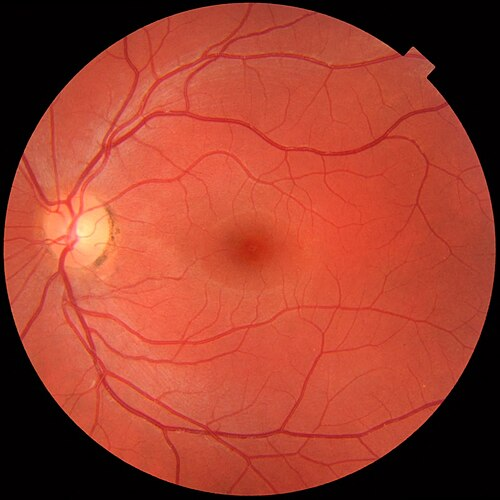

# UVEÍTES POSTERIORES E PANUVEÍTES INFECCIOSAS

Para entender as uveítes posteriores, o primeiro passo é esquecer a ideia de que o olho é um órgão isolado. Nas uveítes posteriores e panuveítes, o olho funciona como uma janela para doenças sistêmicas graves. Quando falamos em "posterior", estamos nos referindo a qualquer inflamação que ocorra atrás da base do vítreo, envolvendo a retina, a coroide ou ambos. Se a inflamação acomete todos os segmentos (anterior, intermediário e posterior), chamamos de panuveíte.

O grande desafio aqui, e o que as bancas de residência adoram explorar, é que o diagnóstico é eminentemente clínico. O exame de fundo de olho, feito através da fundoscopia indireta, é a sua principal ferramenta. No MedEvo, sempre reforçamos: você não trata um exame de imagem, você trata um paciente com um achado clínico específico.

## Classificação e Nomenclatura

A classificação oficial que utilizamos segue os critérios do grupo SUN (Standardization of Uveitis Nomenclature). É fundamental que você saiba onde está o foco primário da inflamação para classificar corretamente.

- Uveíte Posterior: O foco primário é a retina ou a coroide. Exemplos clássicos são a toxoplasmose (retinocoroidite) e a coroidite multifocal.

- Panuveíte: A inflamação está distribuída por todo o trato uveal, sem um foco predominante em uma única câmara. Há células na câmara anterior, no vítreo e lesões no fundo de olho.

Por que essa distinção importa? Porque uma uveíte anterior pura raramente é causada por toxoplasmose, enquanto uma panuveíte em um paciente com HIV levanta imediatamente a suspeita de sífilis ou citomegalovírus.

## Toxoplasmose Ocular: A Soberana das Provas

Se você tiver que escolher apenas uma doença para dominar neste capítulo, escolha a toxoplasmose. Ela é a causa mais comum de uveíte posterior infecciosa no Brasil e no mundo.

### Fisiopatologia e Transmissão

O agente é o *Toxoplasma gondii*. Antigamente, acreditava-se que quase todos os casos eram congênitos e que a uveíte na vida adulta era apenas uma reativação. Hoje, sabemos que a infecção adquirida (por ingestão de oocistos em água ou alimentos contaminados, ou carne mal cozida com bradizoítos) é responsável por uma parcela enorme dos casos, especialmente no Brasil, onde temos cepas muito virulentas.

O parasita tem tropismo pela retina. Quando ele se instala, causa uma necrose retiniana focal. O que vemos na fundoscopia é o resultado dessa batalha: uma área de retinite esbranquiçada, com bordas mal definidas.

### Quadro Clínico e o Sinal do Farol na Neblina

O paciente típico queixa-se de moscas volantes (causadas pela vitrite) e baixa acuidade visual (se a lesão for na mácula ou se a vitrite for intensa).

O sinal clássico de prova é a lesão satélite: uma área de retinite ativa (branca e "fofa") adjacente a uma cicatriz coriorretiniana antiga (pigmentada e com bordas nítidas). Como há uma inflamação vítrea intensa sobre a lesão ativa, o aspecto na fundoscopia é de uma luz brilhante vista através de um nevoeiro, o famoso sinal do farol na neblina.

### Quando tratar?

Cuidado aqui. Nem toda lesão de toxoplasmose precisa de tratamento sistêmico, pois a doença é frequentemente autolimitada em imunocompetentes. No entanto, as bancas cobram as indicações precisas de tratamento:

- Lesão que ameaça a visão: Lesões na mácula, na zona de feixe papilomacular ou adjacentes ao nervo óptico.

- Lesão grande: Maior que dois diâmetros de disco papilar.

- Vitrite intensa: Que impeça a visualização do fundo de olho ou cause baixa visual importante.

- Pacientes imunossuprimidos: Sempre tratar, independentemente da localização.

- Gestantes e idosos: Considerar tratamento precoce.

### Esquema Terapêutico (O "Clássico")

O tratamento padrão ouro, frequentemente chamado de esquema tríplice (ou quádruplo, se incluirmos o corticoide), dura de 4 a 6 semanas:

- Pirimetamina: Dose de ataque de 50 a 100 mg no primeiro dia, seguida de 25 a 50 mg/dia.

- Sulfadiazina: 1g, via oral, de 6 em 6 horas.

- Ácido Folínico: 15 mg, três vezes por semana. Por que usamos? A pirimetamina inibe a diidrofolato redutase do parasita, mas também a nossa. O ácido folínico previne a depressão medular (leucopenia e trombocitopenia) sem anular o efeito da droga no Toxoplasma, que não consegue usar o ácido folínico exógeno.

- Prednisona: 0,5 a 1,0 mg/kg/dia. Atenção: Nunca comece o corticoide sozinho ou antes do antibiótico. O corticoide entra 24 a 48 horas após o início da terapia antiparasitária para reduzir a inflamação e o dano tecidual. Se você der corticoide puro, o parasita vai se replicar sem controle, destruindo a retina.

Tabela 1: Resumo do Tratamento da Toxoplasmose Ocular

| Medicação | Dose Adulto | Função |
| --- | --- | --- |
| Pirimetamina | 50-100mg (ataque), 25-50mg/dia | Inibição da síntese de folato do parasita |
| Sulfadiazina | 1g de 6/6h | Sinergia com pirimetamina |
| Ácido Folínico | 15mg 3x/semana | Proteção da medula óssea do hospedeiro |
| Prednisona | 0,5-1mg/kg/dia | Controle da resposta inflamatória |

## Sífilis Ocular: A Grande Imitadora

A sífilis voltou com força total e, na oftalmologia, ela é conhecida como a grande imitadora porque pode causar qualquer tipo de inflamação ocular: ceratite, uveíte anterior, posterior, vasculite ou neurite óptica.

### Diagnóstico e Conduta

O Dr. Will sempre lembra nas aulas: se você atende um paciente com uveíte posterior ou panuveíte, você é obrigado a pedir testes para sífilis (VDRL e FTA-ABS). Não importa o perfil social do paciente.

Um erro comum em provas é achar que o VDRL negativo exclui sífilis. Na sífilis terciária ou latente tardia, o VDRL pode ser negativo ou apresentar títulos baixos (efeito prozona). O FTA-ABS (ou teste treponêmico equivalente) permanece positivo para o resto da vida e é mais sensível.

### O "Pulo do Gato" no Tratamento

Aqui está a pegadinha que mais reprova: a sífilis ocular é considerada, para fins de tratamento, equivalente à neurossífilis. Isso significa que você não vai tratar com Benzetacil (Penicilina G Benzatina) no bumbum.

O tratamento deve ser feito com Penicilina G Cristalina, 18 a 24 milhões de unidades por dia, administrada por via intravenosa (3 a 4 milhões de unidades a cada 4 horas), por 10 a 14 dias. Isso exige internação hospitalar. Se o paciente for alérgico à penicilina, a dessensibilização é a conduta preferencial, especialmente em gestantes.

## Tuberculose Ocular

A tuberculose (TB) ocular é um diagnóstico de exclusão e presunção. Raramente conseguimos isolar o *Mycobacterium tuberculosis* do olho. O diagnóstico baseia-se na clínica sugestiva, evidência de infecção sistêmica (PPD ou IGRA positivo, ou RX de tórax alterado) e exclusão de outras causas.

### Manifestações Clínicas

A forma mais comum é a coroidite granulomatosa. Você verá nódulos amarelados na coroide (tuberclomas). Outra forma clássica é a vasculite retiniana, especificamente a periflebite (inflamação ao redor das veias).

### Diagnóstico e o Dilema do PPD

No Brasil, um PPD (Teste Cutâneo de Mantoux) é considerado positivo para investigação de TB ocular se for maior ou igual a 10 mm em pacientes imunocompetentes. Se o paciente tiver HIV, valores acima de 5 mm já são suspeitos.

O tratamento segue o esquema nacional (RIPE: Rifampicina, Isoniazida, Pirazinamida e Etambutol) por 6 a 9 meses. Assim como na toxoplasmose, o corticoide sistêmico é usado para controlar a inflamação, mas apenas após o início do esquema tuberculostático.

## Uveítes Virais: Emergências Oftalmológicas

As uveítes virais posteriores são causadas principalmente pela família Herpesviridae (Herpes Simplex, Varicela-Zoster e Citomegalovírus). Elas são divididas em dois grandes grupos baseados no status imunológico do paciente.

### Necrose Retiniana Aguda (ARN)

Ocorre tipicamente em pacientes imunocompetentes. É uma emergência médica. O vírus causa uma necrose fulminante da retina periférica que progride rapidamente para o centro (centrípeta).

- Quadro: Olho vermelho, dor e baixa visual.

- Fundoscopia: Áreas de necrose branca na periferia, vasculite oclusiva (as artérias "somem") e vitrite intensa.

- Complicação: Descolamento de retina (DR) ocorre em até 75% dos casos devido às múltiplas rupturas na retina necrótica.

- Tratamento: Aciclovir intravenoso (10 mg/kg de 8/8h) por 10 a 14 dias, seguido de terapia oral por semanas. O uso de antivirais intravítreos (Ganciclovir ou Foscarnet) é cada vez mais comum como terapia adjuvante.

### Necrose Retiniana Externa Progressiva (PORN)

Ocorre quase exclusivamente em pacientes com AIDS avançada (CD4 muito baixo). Diferente da ARN, a PORN tem pouquíssima inflamação vítrea (o paciente não tem células de defesa para fazer vitrite). A progressão é extremamente rápida e o prognóstico visual é reservado.

### Retinite por Citomegalovírus (CMV)

É a infecção ocular oportunista mais comum em pacientes com AIDS (geralmente com CD4 < 50 células/microlitro).

O aspecto clássico na fundoscopia é a retinite em "pizza de queijo e tomate": áreas de necrose esbranquiçada (queijo) misturadas com hemorragias retinianas extensas (tomate). Diferente da ARN, a retinite por CMV segue o trajeto dos vasos sanguíneos e progride de forma mais lenta (centrífuga).

O tratamento de escolha é o Ganciclovir (intravenoso ou implante intravítreo) ou Valganciclovir oral. O controle da carga viral do HIV com a terapia antirretroviral é fundamental para a resolução do quadro.

Tabela 2: Diferencial das Necroses Retinianas Virais

| Característica | ARN (Necrose Aguda) | PORN (Necrose Progressiva) | Retinite por CMV |
| --- | --- | --- | --- |
| Perfil do Paciente | Imunocompetente | Imunodeprimido (AIDS) | Imunodeprimido (CD4 < 50) |
| Vitrite | Intensa | Mínima ou Ausente | Mínima |
| Hemorragia | Moderada | Mínima | Intensa ("Pizza") |
| Progressão | Rápida | Muito Rápida | Lenta |
| Vasculite | Arterite Oclusiva | Mínima | Perivasculite |

## Toxocaríase Ocular

Causada pelas larvas do *Toxocara canis* ou *Toxocara cati*. É uma causa importante de uveíte posterior unilateral em crianças.

Existem três formas clássicas:

- Endoftalmite crônica: Simula uma uveíte difusa.

- Granuloma de polo posterior: Uma massa esbranquiçada e elevada na mácula que pode ser confundida com retinoblastoma (tumor maligno). Essa é a principal pegadinha de prova: "Criança com leucocoria (reflexo branco), qual o diferencial?". Sempre inclua Toxocaríase.

- Granuloma periférico: Pode causar tração na retina e descolamento.

O diagnóstico é clínico e auxiliado pelo teste ELISA para Toxocara. O tratamento envolve corticoides (locais ou sistêmicos) para reduzir a inflamação ao redor da larva. O uso de anti-helmínticos (Albendazol) é controverso, pois a morte da larva pode gerar uma reação inflamatória ainda mais grave.

## Candidíase Ocular

Geralmente ocorre como uma manifestação de candidemia sistêmica. O perfil do paciente é clássico: usuário de drogas injetáveis, pacientes em UTI com cateter venoso central de longa permanência ou em nutrição parenteral total.

Na fundoscopia, vemos lesões brancas, pequenas e arredondadas, que parecem "bolas de algodão" ou "pérolas" flutuando no vítreo (string of pearls). O tratamento exige antifúngicos sistêmicos (Fluconazol ou Anfotericina B) e, em casos graves, vitrectomia cirúrgica para remover o depósito de fungos.

## Diagnóstico Diferencial e Exames Complementares

Quando você se depara com uma uveíte posterior, a primeira pergunta é: é infecciosa ou não-infecciosa?

As causas não-infecciosas (autoimunes) como Sarcoidose, Doença de Behçet e Síndrome de Vogt-Koyanagi-Harada costumam ser bilaterais e apresentam sinais sistêmicos específicos (aftas orais, alterações dermatológicas, sintomas respiratórios).

### Exames de Imagem

- Angiofluoresceínografia (AFG): Útil para avaliar a integridade da barreira hematorretiniana e detectar vasculites ou edema macular. Na toxoplasmose ativa, a lesão apresenta hipofluorescência inicial (por bloqueio) e hiperfluorescência tardia (por impregnação).

- Tomografia de Coerência Óptica (OCT): Essencial para diagnosticar o edema macular cistoide, que é a principal causa de baixa visual persistente após o controle da inflamação.

- Ultrassonografia Ocular (USG): Fundamental quando a vitrite é tão intensa que não permite ver o fundo de olho. Ajuda a excluir descolamento de retina ou trações vítreas.

## Complicações das Uveítes Posteriores

A inflamação crônica ou recorrente não passa impune. Mesmo que você trate a infecção, o paciente pode desenvolver:

- Edema Macular Cistoide: O acúmulo de líquido na mácula devido à quebra da barreira hematorretiniana. É tratado com corticoides ou anti-VEGF.

- Membrana Neovascular Sub-retiniana: Ocorre cicatriz coriorretiniana (especialmente na toxo) que estimula o crescimento de vasos anômalos. Isso causa perda súbita de visão central.

- Descolamento de Retina: Comum nas necroses virais e na toxocaríase.

- Glaucoma Secundário: Seja pela inflamação em si, pelo fechamento do ângulo ou pelo uso prolongado de corticoides (o famoso "cortisônico").

## Estratificação de Risco e Metas

A meta principal é a preservação da acuidade visual e a prevenção de recorrências.

- Risco Alto: Lesões em Zona 1 (mácula e nervo óptico). Exigem tratamento agressivo e imediato.

- Risco Moderado: Lesões em Zona 2 (até o equador do olho).

- Risco Baixo: Lesões em Zona 3 (periferia extrema).

Em pacientes com toxoplasmose recorrente e lesões que ameaçam a visão, pode-se considerar a profilaxia secundária com Sulfametoxazol/Trimetoprima (800/160 mg) um comprimido a cada dois dias por tempo prolongado.

Tabela 3: Diagnóstico Diferencial por Morfologia da Lesão

| Aspecto da Lesão | Principais Suspeitas |
| --- | --- |
| Retinite focal com vitrite intensa | Toxoplasmose |
| Necrose periférica rápida com vasculite | Necrose Retiniana Aguda (ARN) |
| "Pizza de queijo e tomate" | Retinite por CMV |
| Coroidite granulomatosa (nódulos) | Tuberculose ou Sarcoidose |
| Vasculite (periflebite) | Tuberculose ou Doença de Behçet |
| Lesões multifocais em "bolas de algodão" | Candidíase |

## Situações Especiais

### Gestantes

A toxoplasmose na gestação é um pesadelo. Se a paciente adquire a infecção durante a gravidez, o risco de transmissão fetal é alto. O tratamento ocular deve ser feito, mas a pirimetamina é teratogênica (especialmente no primeiro trimestre). Nesses casos, a Espiramicina é usada para reduzir a transmissão placentária, mas ela não trata a lesão ocular da mãe. Se houver lesão ocular grave na gestante, o uso de Sulfadiazina e Clindamicina pode ser considerado após o primeiro trimestre, sempre em conjunto com o obstetra.

### Idosos

No idoso, a vitrite da toxoplasmose pode ser menos intensa, mas a destruição retiniana é maior. Além disso, o linfoma primário do sistema nervoso central (que pode se manifestar como uveíte posterior) é o principal diagnóstico diferencial "mascarado" nessa faixa etária. Se uma uveíte posterior no idoso não responde ao corticoide, pense em linfoma.

### Usuários de Drogas Injetáveis

Sempre suspeite de endoftalmite fúngica (Cândida) ou bacteriana endógena. O quadro costuma ser mais insidioso e o paciente pode não admitir o uso de drogas, então procure por marcas de punção venosa.

## O Porquê das Condutas

Muitos alunos perguntam: "Por que não posso usar apenas colírio na uveíte posterior?". A resposta é anatômica. Os colírios atingem excelentes concentrações na câmara anterior, mas quase nada chega à retina e ao vítreo em níveis terapêuticos. Por isso, o tratamento das uveítes posteriores é sistêmico (via oral ou intravenoso) ou através de injeções intravítreas.

Outra dúvida comum: "Por que o ácido folínico e não o ácido fólico?". O ácido fólico precisa da enzima diidrofolato redutase para se tornar ativo. Como a pirimetamina bloqueia essa enzima, dar ácido fólico é inútil. O ácido folínico (leucovorin) já é a forma ativa e pula a etapa bloqueada pela medicação.

## Pontos-Chave para Prova

- Toxoplasmose é a causa mais comum de uveíte posterior no Brasil. O sinal clássico é a lesão satélite (foco ativo adjacente à cicatriz antiga).

- O sinal do farol na neblina indica retinite ativa com vitrite intensa sobrejacente.

- Tratamento da Toxoplasmose: Pirimetamina + Sulfadiazina + Ácido Folínico + Prednisona (esquema clássico).

- Nunca inicie corticoide isolado na suspeita de uveíte infecciosa. Na toxo, inicie 24 a 48h após o antibiótico.

- Sífilis ocular deve ser tratada como neurossífilis: Penicilina G Cristalina IV por 10 a 14 dias.

- Toda uveíte posterior ou panuveíte exige solicitação de VDRL e FTA-ABS.

- Retinite por CMV ocorre em pacientes com AIDS e CD4 < 50. Aspecto de pizza de queijo e tomate.

- Necrose Retiniana Aguda (ARN) é uma emergência em imunocompetentes, causada por Herpes ou Zoster, com alto risco de descolamento de retina.

- Toxocaríase é causa de uveíte posterior unilateral em crianças e é um importante diferencial de retinoblastoma (leucocoria).

- Candidíase ocular apresenta-se com colônias fúngicas no vítreo (string of pearls) em pacientes hospitalizados ou usuários de drogas IV.

- O PPD é considerado positivo para investigação de TB ocular no Brasil se ≥ 10 mm (ou ≥ 5 mm em imunodeprimidos).

- O tratamento da TB ocular segue o esquema RIPE por 6 a 9 meses.

- O edema macular cistoide é a complicação mais frequente que causa baixa visual crônica nas uveítes.

- Contraindicação absoluta: Não usar pirimetamina no primeiro trimestre da gestação (risco de teratogenia).

- Erro comum: Achar que Benzetacil trata sífilis ocular. Não trata! A penetração no humor vítreo é insuficiente.

- Linfoma de células B é a principal síndrome mascarada que simula uveíte posterior em idosos. 👁️

 Cópia offline para consulta pessoal.
 Fonte original:
 [https://www.medevo.com.br/material-apoio/ler/4484e6bf-c25b-40f4-85e0-a42b5683fd25](https://www.medevo.com.br/material-apoio/ler/4484e6bf-c25b-40f4-85e0-a42b5683fd25)
