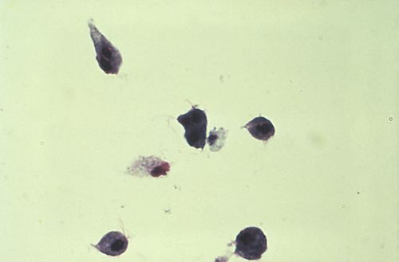
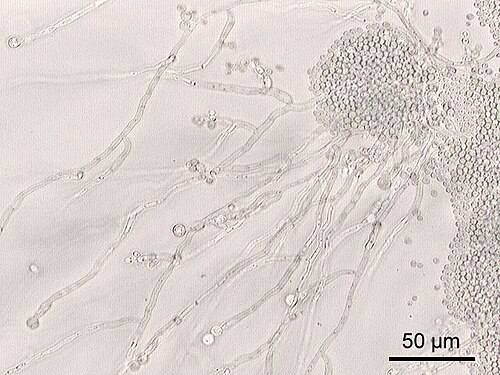

# VAGINOSE BACTERIANA E TRICOMONÍASE

Para entender as infecções vaginais, você precisa primeiro dominar o que é o "normal". A vagina não é um ambiente estéril. Em uma mulher em idade reprodutiva, o ecossistema é dominado pelos Bacilos de Doderlein (Lactobacillus). Esses heróis da saúde feminina metabolizam o glicogênio das células epiteliais (estimuladas pelo estrogênio) e produzem ácido lático.

O resultado? Um pH vaginal ácido, entre 3,8 e 4,5. Esse ambiente ácido é a principal barreira contra patógenos. Quando esse equilíbrio é quebrado, surgem as vulvovaginites e vaginoses. Nas provas de residência, o examinador quer saber se você consegue diferenciar o "corrimento" que é fisiológico daquele que exige tratamento.

A secreção vaginal fisiológica é clara ou esbranquiçada, sem odor, com pH ácido e sem sinais inflamatórios na mucosa. Se a paciente chega com queixa de corrimento, seu primeiro passo é o exame físico e a medição do pH.

## Vaginose Bacteriana (VB)

A Vaginose Bacteriana não é uma infecção por um agente externo "invasor", mas sim uma disbiose. Imagine que a flora vaginal é uma balança. De um lado, temos os Lactobacilos. Do outro, bactérias anaeróbias (Gardnerella vaginalis, Mobiluncus spp, Prevotella, Mycoplasma hominis). Na VB, os Lactobacilos diminuem drasticamente e os anaeróbios proliferam.

Um erro comum em provas é classificar a VB como uma Infecção Sexualmente Transmissível (IST). Atenção: a VB NÃO é considerada uma IST. Ela pode ocorrer em mulheres virgens, embora a atividade sexual seja um fator de risco por alterar o pH vaginal (o sêmen é alcalino). Como não é IST, a regra de ouro que você não pode esquecer: não se trata o parceiro sexual na VB.

### Fisiopatologia e o "Porquê" dos Sintomas

Por que a VB tem aquele odor característico de "peixe podre"? Quando os anaeróbios proliferam, eles produzem enzimas (carboxilases) que degradam aminoácidos, liberando aminas voláteis, principalmente a cadaverina e a putrescina.

Essas aminas são liberadas no ar quando o pH se torna mais alcalino. É por isso que a paciente relata que o odor piora muito após o coito (sêmen é alcalino) ou durante a menstruação (sangue é alcalino). Se você entender isso, nunca mais esquece o teste das aminas.

### Diagnóstico: Os Critérios de Amsel

As bancas amam os Critérios de Amsel. Para fechar o diagnóstico clínico, você precisa de 3 dos 4 critérios abaixo:

- Corrimento branco-acinzentado, homogêneo e fluido, que reveste as paredes vaginais.

- pH vaginal > 4,5 (Lembre-se: a falta de lactobacilos eleva o pH).

- Teste das aminas (Whiff test) positivo: ao pingar uma gota de KOH (hidróxido de potássio) a 10% na secreção, sente-se o odor fétido.

- Presença de Clue Cells (Células-guia) na microscopia a fresco.

O que são as Clue Cells? São células do epitélio vaginal recobertas por tantos bacilos (Gardnerella) que suas bordas ficam borradas, com aspecto pontilhado. É o achado mais específico da VB.

Existe também o Escore de Nugent, que é o padrão-ouro laboratorial baseado na coloração de Gram. Ele pontua a presença de diferentes morfótipos bacterianos. Um escore de 7 a 10 confirma VB. Na prática de prova, foque em Amsel.

### Tratamento da Vaginose Bacteriana

O tratamento de escolha, segundo o Ministério da Saúde e a FEBRASGO, é o Metronidazol.

- Primeira escolha: Metronidazol 500mg, via oral, de 12/12h por 7 dias.

- Opção tópica: Metronidazol gel 0,75%, uma aplicação vaginal à noite por 5 dias.

Cuidado com a eficácia: as terapias tópicas e orais têm eficácia semelhante para a cura dos sintomas, mas a via oral é frequentemente preferida em casos de recorrência. Se a paciente apresentar VB recorrente (3 ou mais episódios em um ano), o esquema pode ser estendido. Uma estratégia comum é o uso de Metronidazol gel 2x por semana por 4 a 6 meses após o tratamento agudo.

### VB na Gestação e Situações Especiais

A VB na gestação é um tema quente. Ela está associada a desfechos obstétricos negativos, como ruptura prematura de membranas, corioamnionite e parto prematuro.

Segundo a diretriz brasileira, devemos tratar todas as gestantes sintomáticas. E quanto às assintomáticas? O rastreamento universal não é recomendado, mas deve ser considerado em gestantes com antecedente de parto prematuro.

O tratamento na gestante é preferencialmente por via oral. O Metronidazol é seguro em qualquer trimestre da gestação. Não há evidências de teratogenicidade em humanos.

## Tricomoníase

Diferente da VB, a Tricomoníase é uma IST clássica, causada pelo protozoário flagelado Trichomonas vaginalis. Aqui, o agente é um invasor externo que causa uma resposta inflamatória intensa na mucosa vaginal e cervical.

Como é uma IST, o tratamento do parceiro é OBRIGATÓRIO, mesmo que ele esteja assintomático. Se você tratar apenas a mulher, ela será reinfectada na próxima relação sexual. No MedEvo, sempre reforçamos: viu Tricomoníase? Trate o casal e rastreie outras ISTs (HIV, Sífilis, Hepatites, Gonococo e Clamídia).

### Quadro Clínico: A "Colpite em Framboesa"

A paciente com tricomoníase geralmente está muito mais incomodada do que a paciente com VB. Os sintomas incluem:

- Corrimento amarelo-esverdeado, bolhoso (o protozoário produz gás) e fétido.

- Prurido vulvar e ardor.

- Dispareunia (dor na relação) e disúria.

- Exame físico: Hiperemia da mucosa vaginal e o clássico "colo em framboesa" ou "colo em morango" (colpite macular).

A colpite macular ocorre devido a micro-hemorragias no colo uterino causadas pela inflamação. Ao teste de Schiller (uso de Lugol), o colo pode apresentar um aspecto "tigroide" ou "salpicado", pois as áreas inflamadas não fixam o iodo.

### Diagnóstico da Tricomoníase

O diagnóstico de escolha na prática clínica é a microscopia a fresco. Você coleta a secreção, coloca em uma lâmina com soro fisiológico e observa imediatamente.

O que você procura? Protozoários móveis, flagelados, piriformes, um pouco maiores que um leucócito. Além disso, haverá um aumento significativo de polimorfonucleares (piócitos), refletindo a inflamação. O pH na tricomoníase costuma ser bem elevado, geralmente > 5,0.

Embora a cultura (meio de Diamond) seja mais sensível, ela raramente é usada na rotina. ==Testes de amplificação de ácidos nucleicos (NAAT) são excelentes, mas caros.== Para a prova, o "padrão" é o exame a fresco.

### Tratamento da Tricomoníase

O tratamento é sistêmico, pois o protozoário pode colonizar glândulas de Skene e Bartholin, onde o creme vaginal não chega.

- Primeira escolha (MS): Metronidazol 2g, via oral, em dose única.

- Alternativa: Metronidazol 500mg, VO, 12/12h por 7 dias.

Lembre-se do efeito antabuse (dissulfiram-like): a paciente não deve ingerir álcool durante o tratamento com Metronidazol e até 24-48 horas após o término, sob risco de náuseas, vômitos, rubor facial e taquicardia.

Na gestação, o tratamento também é Metronidazol 2g VO em dose única. É seguro e previne complicações como a ruptura prematura de membranas.

## Diagnóstico Diferencial de Corrimento Vaginal

Para não errar em prova, você precisa comparar as três principais causas de corrimento. Vamos incluir a Candidíase aqui para o seu mapa mental ficar completo.

| Característica | Vaginose Bacteriana | Tricomoníase | Candidíase |
| --- | --- | --- | --- |
| **Agente** | Polimicrobiana (anaeróbios) | Trichomonas vaginalis | Candida albicans (80-90%) |
| **Aspecto** | Branco-acinzentado, fluido | Amarelo-esverdeado, bolhoso | Branco, grumoso (leite coalhado) |
| **Odor** | Fétido (peixe podre) | Fétido | Ausente |
| **Inflamação** | Ausente | Presente (Colpite) | Intensa (Vulvovaginite) |
| **pH Vaginal** | > 4,5 | > 5,0 | < 4,5 (ácido) |
| **Whiff Test** | Positivo | Pode ser positivo | Negativo |
| **Microscopia** | Clue Cells | Protozoários móveis | Hifas e esporos |
| **Tratar Parceiro** | Não | Sim (Obrigatório) | Apenas se sintomático |

## Situações Especiais e Pegadinhas de Prova

### 1. Vaginose Citolítica

Muitas vezes confundida com candidíase. A paciente tem prurido e corrimento branco, mas o pH é MUITO ácido (< 3,5) e a microscopia mostra excesso de Lactobacilos e citólise (restos celulares). O tratamento aqui não é antifúngico, mas sim alcalinizar a vagina com banhos de assento com bicarbonato de sódio. Dr. Will sempre lembra: se o antifúngico não funcionou e o pH é baixo, pense em vaginose citolítica.

### 2. Streptococcus agalactiae (GBS)

É comum encontrar o GBS em culturas de secreção vaginal. Se a paciente for uma mulher não gestante e assintomática, a conduta é: NÃO TRATAR. O GBS faz parte da colonização transitória e não causa vaginite. O tratamento só é indicado no contexto do rastreio neonatal em gestantes (35-37 semanas) para profilaxia do RN.

### 3. Autonomia do Adolescente

Se uma adolescente maior de 12 anos procura atendimento por corrimento, ela tem direito ao sigilo e à privacidade, desde que tenha capacidade de compreensão. Você deve atendê-la, diagnosticar e tratar (inclusive ISTs) sem obrigatoriamente comunicar aos pais, a menos que haja risco de vida ou suspeita de violência sexual que exija notificação.

### 4. DIU e Vaginose

Usuárias de DIU de cobre têm um risco discretamente aumentado de VB. No entanto, se uma paciente com DIU desenvolve VB, você trata a infecção e NÃO precisa retirar o DIU. A mesma lógica vale para Doença Inflamatória Pélvica (DIP) leve/moderada: inicia o antibiótico e mantém o dispositivo.

### 5. O Papel do Glicogênio

Por que crianças e mulheres na pós-menopausa têm menos VB e Candidíase? Porque elas têm pouco estrogênio. Sem estrogênio, o epitélio vaginal é fino e pobre em glicogênio. Sem glicogênio, não há produção de ácido lático pelos lactobacilos. O pH dessas pacientes é naturalmente mais alto (neutro ou alcalino). Por isso, qualquer corrimento nessas faixas etárias exige investigação de corpo estranho (crianças) ou atrofia/neoplasia (idosas).

## Fisiopatologia Avançada: Biofilmes

Um conceito que tem caído em provas de títulos de especialista é o biofilme da Gardnerella. A Gardnerella vaginalis tem a capacidade de aderir ao epitélio e formar uma rede protegida por uma matriz extracelular. Isso explica por que a VB tem taxas de recorrência tão altas: o antibiótico mata as bactérias "soltas", mas tem dificuldade de penetrar no biofilme.

## Resumo de Condutas Farmacológicas

Para memorizar as doses que caem na prova:

-

**Vaginose Bacteriana:**

- Metronidazol 500mg VO 12/12h por 7 dias (Preferencial).

- Metronidazol gel 0,75% 1 aplic. vaginal por 5 noites.

- Clindamicina creme 2% por 7 noites (Opção se alergia ao Metronidazol).

-

**Tricomoníase:**

- Metronidazol 2g VO dose única (Preferencial para paciente e parceiro).

- Metronidazol 500mg VO 12/12h por 7 dias (Alternativa).

- *Nota:* O tratamento tópico NÃO é eficaz para cura da tricomoníase.

-

**Gestantes:**

- VB: Metronidazol 500mg VO 12/12h por 7 dias.

- Tricomoníase: Metronidazol 2g VO dose única.

- *Evitar:* O uso de Tinidazol na gestação (menos estudos de segurança que o Metronidazol).

## Pontos-Chave para Prova

- **Critérios de Amsel (VB):** Precisa de 3 de 4. O pH > 4,5 e as Clue Cells são os favoritos das bancas.

- **Tratamento de Parceiro:** Na VB NÃO trata. Na Tricomoníase SEMPRE trata.

- **Colpite Macular:** Patognomônico de Tricomoníase (colo em framboesa).

- **Teste das Aminas (Whiff Test):** Positivo na VB e pode ser positivo na Tricomoníase. É causado pela liberação de putrescina e cadaverina.

- **Microscopia a Fresco:** Exame de escolha para Tricomoníase (visualiza o protozoário móvel).

- **pH Vaginal:** É a chave do diagnóstico diferencial. Candidíase é a única com pH < 4,5 (ácido). VB e Tricomoníase têm pH elevado.

- **Metronidazol e Álcool:** Efeito antabuse. Orientação obrigatória ao prescrever.

- **VB e Gestação:** Risco de parto prematuro. Tratar sempre as sintomáticas. Metronidazol é seguro.

- **Células-Guia (Clue Cells):** São células epiteliais com bordas obscurecidas por bactérias.

- **Vaginose Citolítica:** Diagnóstico diferencial importante; excesso de lactobacilos e pH muito baixo.

- **IST:** Apenas a Tricomoníase é considerada IST entre as vulvovaginites clássicas.

- **Contraindicação Absoluta:** Não há contraindicação absoluta ao Metronidazol na gestação se houver indicação clínica, mas deve-se evitar o consumo de álcool (absoluto durante o uso).

- **Escore de Nugent:** Padrão-ouro para VB (Gram), mas Amsel é o mais cobrado para prática clínica.

- **Cuidado:** A presença de Gardnerella na citologia oncótica (Papanicolau) em paciente assintomática NÃO é indicação de tratamento.

- **Pegadinha:** A alternativa dirá que o pH da VB é < 4,5. Errado! O pH é > 4,5. 💡

Ao revisar este material, foque na tabela comparativa e nos critérios de Amsel. As questões de residência costumam apresentar um caso clínico com o aspecto do corrimento e o valor do pH, pedindo o diagnóstico ou a conduta (tratar ou não o parceiro). Se você dominar esses pilares, garantirá todos os pontos desse tema.

 Cópia offline para consulta pessoal.
 Fonte original:
 [https://www.medevo.com.br/material-apoio/ler/9c8b4510-a89f-4168-a405-7167e1bb4d91](https://www.medevo.com.br/material-apoio/ler/9c8b4510-a89f-4168-a405-7167e1bb4d91)
