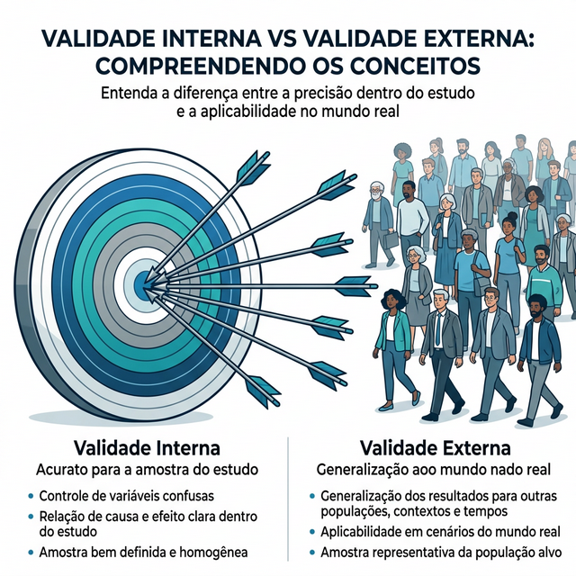
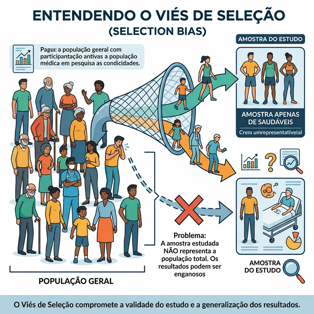
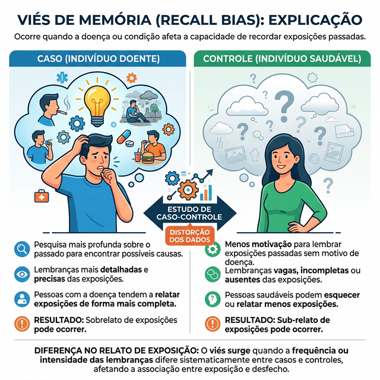
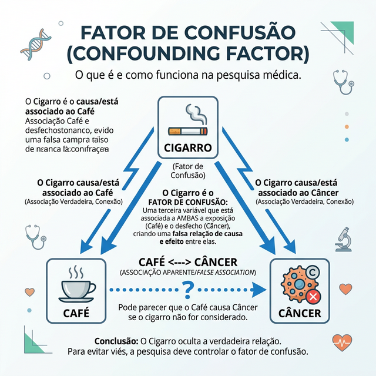
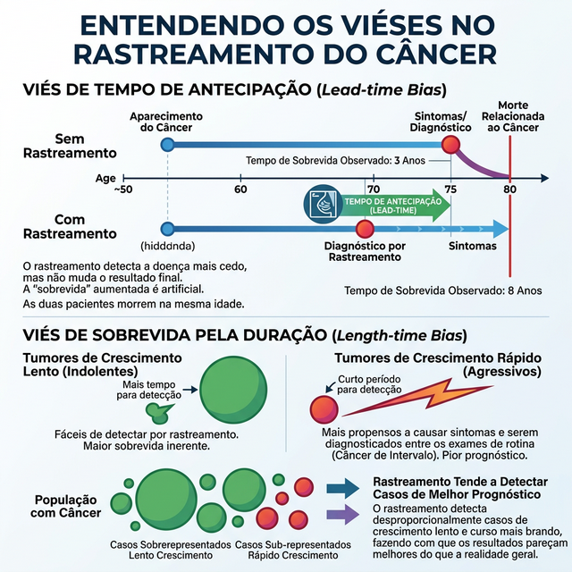
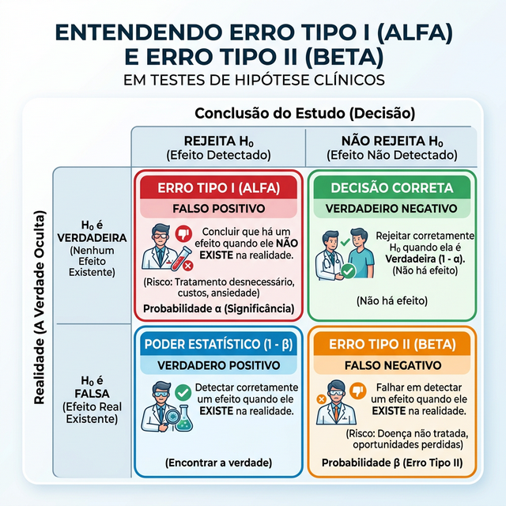

# VALIDADE E VIESES EM ESTUDOS

Para começar nossa conversa, imagine que você está lendo um artigo que afirma que tomar café previne infarto. Antes de sair prescrevendo doses de cafeína para seus pacientes, você precisa se perguntar: esse resultado é "verdadeiro" ou foi apenas um erro de percurso? Na epidemiologia, buscamos a verdade, mas o caminho é cheio de armadilhas. Essas armadilhas são o que chamamos de erros, e entender a diferença entre eles é o que separa o aluno que decora do médico que realmente entende a ciência.

Em qualquer estudo, podemos encontrar dois tipos de erros. O primeiro é o erro aleatório, que depende do acaso. Se você jogar uma moeda dez vezes, pode ser que dê cara em sete. Isso significa que a moeda é viciada? Provavelmente não, foi apenas o acaso. O segundo, e mais perigoso para as provas de residência, é o erro sistemático, também conhecido como viés ou vício.

O erro sistemático não se resolve aumentando o tamanho da amostra. Se sua balança está descalibrada e marca sempre 2 kg a mais, não adianta pesar mil pessoas, a média continuará errada. É aqui que entra o conceito de validade. Um estudo tem validade quando ele consegue medir o que se propôs a medir, sem que esses erros sistemáticos distorçam a realidade.

## Validade Interna e Validade Externa

Este é um ponto que as bancas adoram. Quando falamos que um estudo tem validade interna, estamos dizendo que, para aquele grupo de pessoas que participou da pesquisa, o resultado é confiável. Ou seja, o pesquisador controlou bem os vieses de seleção, aferição e confusão. Se o estudo diz que a droga A funcionou para aqueles 100 pacientes e não há vieses, a validade interna está garantida.

*Figura 1: Validade Interna (ausência de vieses na amostra) versus Validade Externa (capacidade de generalizar o resultado para a população).*

Por outro lado, a validade externa, também chamada de generalização ou aplicabilidade, é a capacidade de pegar esse resultado e aplicar na "vida real", em populações diferentes. Por exemplo, um estudo feito apenas com homens jovens e saudáveis na Suécia pode ter uma validade interna impecável, mas será que ele tem validade externa para uma idosa diabética no interior do Brasil? Provavelmente não.

Cuidado com a pegadinha: para um estudo ter validade externa, ele PRECISA obrigatoriamente ter validade interna. Não faz sentido tentar generalizar um resultado que já nasceu errado ou viciado dentro da própria amostra.

## O Erro Sistemático: Os Três Grandes Vieses

Para facilitar sua vida, vamos dividir os vieses em três grandes grupos. Se você aprender a identificar qual deles está agindo em uma questão, você já acertou metade do caminho.

### Viés de Seleção

O viés de seleção ocorre quando a forma como os participantes foram escolhidos para o estudo faz com que os grupos comparados sejam diferentes entre si em algo além da exposição que estamos estudando.

Imagine que queremos estudar se o exercício físico previne depressão. Se recrutarmos os participantes em uma academia, já estamos selecionando pessoas que, por natureza, podem ser mais ativas e ter menos comorbidades. Se compararmos esse grupo com pessoas internadas em um hospital, a diferença no desfecho (depressão) pode não ser pelo exercício, mas pelo fato de os grupos serem incomparáveis desde o início.

*Figura 2: Viés de Seleção ocorre quando a escolha da amostra cria grupos não comparáveis, distorcendo o resultado. A randomização é a melhor forma de evitá-lo.*

Um exemplo clássico de prova é o Viés de Berkson, que ocorre em estudos realizados dentro de hospitais. Pacientes hospitalizados têm maior probabilidade de ter múltiplas doenças simultâneas, o que distorce a associação entre elas quando comparadas com a população geral. Outro exemplo é o Efeito do Trabalhador Saudável: pessoas que estão trabalhando são, em geral, mais saudáveis do que as que estão afastadas ou desempregadas. Se você comparar a mortalidade de operários de uma fábrica com a população geral, os operários parecerão "super-homens", mas é apenas um viés de seleção.

Como o Dr. Will sempre reforça em suas discussões no MedEvo, a melhor forma de combater o viés de seleção em ensaios clínicos é a randomização. Ao sortear quem vai para cada grupo, garantimos que as características (conhecidas e desconhecidas) se distribuam de forma equilibrada.

### Viés de Aferição ou Informação

Aqui o problema não é quem entrou no estudo, mas como os dados foram coletados. O erro acontece na hora de medir a exposição ou o desfecho.

O rei desse grupo nas provas é o Viés de Memória (ou recordação). Ele é o pesadelo dos estudos de caso-controle. Imagine que você está investigando se o uso de determinado cosmético na gestação causou malformação fetal. Uma mãe que teve um bebê com malformação (caso) provavelmente passou noites tentando lembrar de cada detalhe do que usou. Já a mãe de um bebê saudável (controle) pode ter usado o mesmo produto e simplesmente esquecido. Essa diferença na capacidade de lembrar distorce o resultado.

*Figura 3: Viés de Memória (Recordação). É o principal viés dos estudos Caso-Controle, onde os doentes se lembram das exposições com muito mais clareza do que os saudáveis.*

Outro ponto importante é o Viés do Observador. Se o médico sabe que o paciente está tomando o remédio novo (e ele quer que o remédio funcione), ele pode, inconscientemente, interpretar os sintomas de forma mais favorável. Por isso usamos o mascaramento (cegamento). O estudo duplo-cego, onde nem o paciente nem o médico sabem o que está sendo administrado, é a ferramenta de ouro para evitar esse viés.

### Viés de Confundimento (ou Confusão)

Este é, sem dúvida, o conceito mais cobrado e o que mais gera confusão (com o perdão do trocadilho). O fator de confusão é uma variável "intrusa" que está associada tanto à exposição quanto ao desfecho, mas não faz parte da cadeia causal entre eles.

Exemplo clássico: um estudo mostra que pessoas que carregam isqueiros no bolso têm mais câncer de pulmão. O isqueiro causa câncer? Não. O fator de confusão aqui é o tabagismo. Quem fuma (exposição) carrega isqueiro e quem fuma tem mais câncer (desfecho). O isqueiro é apenas um "inocente útil" que parece estar causando o problema.

*Figura 4: Fator de Confusão. O cigarro (confundidor) está ligado tanto ao hábito de tomar café (exposição) quanto ao câncer (desfecho), criando a falsa ilusão de que café causa câncer.*

Para ser um confundidor, a variável deve preencher três critérios:

- Estar associada à exposição.

- Ser um fator de risco para o desfecho (independente da exposição).

- Não ser um passo intermediário na via causal.

Como identificar isso na prova? Se a questão disser que, após um "ajuste estatístico" ou "análise multivariada", a associação que existia antes desapareceu ou o Risco Relativo (RR) virou 1,0, você está diante de um fator de confusão. O ajuste "limpa" o efeito da variável intrusa.

| Tipo de Viés | Onde ocorre o erro? | Exemplo de Prova | Como controlar? |
| --- | --- | --- | --- |
| **Seleção** | No recrutamento / alocação | Grupos não comparáveis (ex: voluntários) | Randomização |
| **Aferição** | Na coleta de dados / medida | Viés de memória em caso-controle | Mascaramento (Cegamento) |
| **Confusão** | Na análise da associação | Café e Câncer (confundidor: cigarro) | Pareamento, Estratificação, Análise Multivariada |

## Vieses Específicos em Programas de Rastreamento

Quando falamos de Medicina Preventiva e rastreamento (screening) de câncer, as bancas adoram cobrar três vieses específicos que fazem um exame parecer melhor do que ele realmente é.

### Viés de Tempo de Antecipação (Lead-time Bias)

Este viés dá a falsa impressão de que o paciente viveu mais porque o diagnóstico foi feito mais cedo. Imagine dois pacientes com o mesmo câncer que vai matá-los aos 60 anos. O Paciente A não faz rastreamento e descobre o tumor aos 58 anos, quando sente dor. Ele vive 2 anos após o diagnóstico. O Paciente B faz um check-up e descobre o tumor aos 50 anos, ainda assintomático. Ele vive 10 anos após o diagnóstico.

Ambos morreram aos 60 anos! O rastreamento não mudou o desfecho final, apenas fez o Paciente B carregar o rótulo de "doente" por mais tempo. Isso é o que chamamos de sobrevida aparente. Na prova, se o texto falar em "diagnóstico precoce que aumenta o tempo de sobrevida, mas não muda a mortalidade", marque Lead-time bias.

*Figura 5: Vieses de Rastreamento. O Lead-time Bias (Tempo de Antecipação) cria uma falsa sensação de maior sobrevida sem mudar a data da morte. O Length-time Bias seleciona doenças indolentes de progressão lenta.*

### Viés de Tempo de Duração ou Seleção de Prognóstico (Length-time Bias)

O rastreamento tende a detectar doenças que progridem lentamente. Pense bem: um câncer agressivo cresce tão rápido que aparece entre um exame de rotina e outro (câncer de intervalo). Já um câncer indolente, que cresce devagar, fica "disponível" para ser detectado pelo rastreamento por muito mais tempo.

O resultado? O rastreamento seleciona os casos de melhor prognóstico por natureza. Isso faz parecer que o rastreamento é o responsável pela cura, quando na verdade ele só encontrou os casos que já iriam bem de qualquer forma.

### Viés de Sobrediagnóstico (Overdiagnosis)

Este é o extremo do viés anterior. O rastreamento identifica "doenças" que nunca causariam sintomas ou morte se não tivessem sido detectadas. É o caso de alguns cânceres de próstata em idosos ou carcinomas ductais in situ na mama que nunca evoluiriam. O paciente é tratado, sofre efeitos colaterais, mas nunca se beneficiaria do diagnóstico porque a doença não era uma ameaça real.

## Erro Aleatório e Teste de Hipóteses

Diferente do viés, o erro aleatório é uma questão de precisão. Se você quer saber a altura média dos brasileiros e mede apenas 3 pessoas, sua precisão será baixa. Se medir 10.000, a chance de chegar perto da média real aumenta.

Nas provas, isso aparece na forma do Valor de P e do Intervalo de Confiança (IC).

### Erro Tipo I (Alfa) e Erro Tipo II (Beta)

Imagine que estamos testando um novo remédio.

- **Erro Tipo I (Falso Positivo):** Você diz que o remédio funciona, mas na verdade ele não faz nada. É o erro de rejeitar a hipótese nula (H0) quando ela é verdadeira. O limite aceitável para esse erro é geralmente 5% (p < 0,05).

- **Erro Tipo II (Falso Negativo):** O remédio funciona, mas seu estudo foi pequeno demais ou mal desenhado e você concluiu que ele não funciona. É o erro de aceitar a H0 quando ela é falsa.

A "Poder do Estudo" é a capacidade de detectar uma diferença quando ela realmente existe (1 - Beta). Estudos com amostras pequenas costumam ter baixo poder e alto risco de erro tipo II.

*Figura 6: Matriz de Teste de Hipóteses. Erro Tipo I (Alpha) = afirmar que existe diferença quando não existe (falso positivo). Erro Tipo II (Beta) = não enxergar a diferença que realmente existe (falso negativo).*

### O Pulo do Gato do Intervalo de Confiança

Se você aprender isso, não erra mais nenhuma questão de interpretação de resultados. O Intervalo de Confiança (IC) nos dá a precisão do resultado e também a significância estatística.

Para medidas de associação que são razões (Risco Relativo, Odds Ratio):

- Se o IC **inclui o valor 1,0** (ex: IC 95% 0,8 a 1,5), o resultado **NÃO tem significância estatística**. Por que? Porque o 1,0 significa "risco igual", ou seja, a hipótese nula.

- Se o IC **NÃO inclui o valor 1,0** (ex: IC 95% 1,2 a 1,8), o resultado **É estatisticamente significativo**.

Para medidas que são diferenças (ex: diferença de médias de pressão arterial):

- Se o IC **inclui o valor 0**, não há diferença significativa.

| Conceito | O que avalia? | Valor ideal |
| --- | --- | --- |
| **Valor de P** | Probabilidade do resultado ser ao acaso | < 0,05 (5%) |
| **IC 95%** | Faixa onde a verdade deve estar | Estreito (indica precisão) |
| **Poder (1-Beta)** | Capacidade de achar diferença real | > 0,80 (80%) |

## Causalidade: Os Critérios de Hill

Nem toda associação é causal. Lembra do isqueiro e do câncer? Há uma associação, mas não há causalidade. Para ajudar a decidir se algo causa outra coisa, Austin Bradford Hill propôs critérios que são figurinhas carimbadas em provas.

O critério mais importante, o único considerado **obrigatório**, é a **Temporalidade**. Para que X cause Y, X deve vir antes de Y no tempo. Parece óbvio, mas em estudos transversais, onde medimos exposição e desfecho ao mesmo tempo, muitas vezes não conseguimos estabelecer a temporalidade (viés de causalidade reversa).

Outros critérios importantes:

- **Gradiente Biológico (Dose-Resposta):** Quanto mais exposição, mais doença. Se eu fumo 2 maços/dia, meu risco deve ser maior do que quem fuma 1 maço/dia.

- **Força de Associação:** Um Risco Relativo de 10,0 é um argumento muito mais forte para causalidade do que um RR de 1,1.

- **Plausibilidade Biológica:** O mecanismo proposto faz sentido de acordo com o conhecimento científico atual?

- **Consistência:** Outros estudos, em populações diferentes, acharam a mesma coisa?

## Vieses em Diferentes Desenhos de Estudo

Cada desenho de estudo tem seu "calcanhar de Aquiles". O examinador vai te dar um cenário clínico e perguntar qual o viés mais provável ali.

### Estudos Transversais

São rápidos e baratos, ótimos para medir prevalência. Porém, sofrem muito com o **Viés de Prevalência (ou Viés de Neyman)**. Doenças de curta duração (que curam rápido ou matam rápido) são menos capturadas em um estudo transversal do que doenças crônicas. Além disso, sofrem com a **Causalidade Reversa**: não sabemos se o ovo ou a galinha veio primeiro.

### Estudos de Caso-Controle

Como partem do desfecho para a exposição (olham para trás), o grande vilão é o **Viés de Memória**. Além disso, a escolha do grupo controle é um desafio constante, sendo solo fértil para o **Viés de Seleção**.

### Estudos de Coorte

São melhores para estabelecer causalidade, mas como acompanham as pessoas por muito tempo, o principal problema são as **Perdas de Seguimento**. Se as pessoas que saem do estudo forem diferentes das que ficam (ex: os mais doentes morrem ou desistem), o resultado final estará viciado.

### Ensaios Clínicos Randomizados (ECR)

São o topo da evidência para intervenções. A randomização protege contra o confundimento. O mascaramento protege contra o viés de aferição. Mas cuidado: se o ECR tiver uma amostra muito pequena, ele pode sofrer com o erro aleatório (falta de poder).

## O Efeito Hawthorne e o Efeito Placebo

Estes são vieses relacionados ao comportamento humano durante a pesquisa.

O **Efeito Hawthorne** ocorre quando os participantes de um estudo mudam seu comportamento simplesmente por saberem que estão sendo observados. Imagine um estudo sobre lavagem de mãos em um hospital. Se os profissionais sabem que tem alguém com uma prancheta anotando, eles vão lavar as mãos muito mais do que no dia a dia. Isso distorce a realidade da prática clínica.

O **Efeito Placebo** é a melhora clínica decorrente da expectativa do paciente em relação ao tratamento, e não do efeito farmacológico em si. Por isso, o grupo controle em um ECR deve receber algo que pareça idêntico ao tratamento real.

## Viés Ecológico (Falácia Ecológica)

Este cai muito em questões de saúde pública. Ocorre quando tentamos aplicar uma associação observada em nível populacional para indivíduos.

Exemplo: Um estudo mostra que cidades com maior venda de antidepressivos têm menores taxas de suicídio. Eu posso afirmar que, se o meu paciente João tomar antidepressivo, o risco dele se suicidar diminui? Com base apenas nesse estudo ecológico, não. A associação no grupo não garante a associação no indivíduo. O "vendedor de antidepressivos" pode ser uma variável que indica melhor acesso à saúde na cidade, e não o efeito direto da droga no João.

## Como as Bancas Cobram: Exemplos Práticos

**Cenário 1:** Um estudo avaliou a associação entre o uso de beta2-agonistas e morte por asma. O resultado mostrou que quem usava mais a medicação morria mais. Conclusão: a droga é perigosa.

- **Onde está o erro?** Viés de Confusão pela gravidade. Pacientes com asma mais grave (que têm maior risco de morte) naturalmente usam mais medicação de resgate. A gravidade da doença é o fator de confusão que explica tanto o uso da droga quanto o desfecho morte.

**Cenário 2:** Um pesquisador quer estudar o efeito de uma nova dieta na perda de peso. Ele deixa os participantes escolherem se querem entrar no grupo da dieta ou no grupo controle.

- **Onde está o erro?** Viés de Seleção. Quem escolhe fazer a dieta provavelmente está mais motivado, faz mais exercícios e tem hábitos de vida mais saudáveis do que quem não quis mudar a alimentação. Os grupos não são comparáveis.

**Cenário 3:** Em um estudo de caso-controle sobre câncer de pâncreas e café, os casos foram recrutados em hospitais e os controles na vizinhança.

- **Onde está o erro?** Viés de Seleção (Berkson). Além disso, se os entrevistadores soubessem quem era o caso, poderiam insistir mais na pergunta sobre o café (Viés do Entrevistador).

## Estratégias para Controle de Vieses

Como médicos e pesquisadores, temos ferramentas para "limpar" esses erros.

-

**Na fase de desenho (projeto):**

- **Randomização:** Controla confundidores conhecidos e desconhecidos (exclusivo de estudos experimentais).

- **Pareamento (Matching):** Selecionar controles que sejam parecidos com os casos (mesma idade, mesmo sexo). Muito usado em caso-controle.

- **Restrição:** Só incluir pessoas com certas características (ex: apenas não fumantes) para eliminar o fumo como confundidor.

-

**Na fase de análise de dados:**

- **Estratificação:** Analisar os dados em subgrupos (ex: analisar fumantes separado de não fumantes).

- **Ajuste Estatístico (Análise Multivariada):** Uso de modelos matemáticos (como regressão logística) para isolar o efeito da variável de interesse, mantendo as outras constantes.

## Reprodutibilidade e Confiabilidade

Um conceito final importante é a diferença entre ser preciso e ser acurado.

- **Acurácia (Validade):** É acertar o centro do alvo. O resultado do estudo reflete a realidade.

- **Precisão (Confiabilidade/Reprodutibilidade):** É quando você atira várias vezes e os tiros caem todos no mesmo lugar, mesmo que seja longe do centro. Significa que o método é consistente.

Um instrumento pode ser confiável (dá sempre o mesmo resultado), mas não ser válido (o resultado está sempre errado). O ideal é que o estudo seja as duas coisas.

## Pontos-Chave para Prova

- **Validade Interna:** O resultado é verdadeiro para a amostra estudada. É o mínimo exigido para qualquer conclusão.

- **Validade Externa:** Capacidade de generalizar os resultados para outras populações.

- **Viés de Seleção:** Grupos comparados são diferentes desde o início. Resolvido com randomização em ECR.

- **Viés de Memória:** Clássico de estudos caso-controle. O doente lembra mais da exposição que o saudável.

- **Viés de Confundimento:** Uma terceira variável distorce a relação exposição-desfecho. Identificado quando o ajuste estatístico muda o resultado.

- **Lead-time Bias:** Diagnóstico precoce aumenta a sobrevida aparente, mas não adia a morte.

- **Length-time Bias:** Rastreamento detecta preferencialmente casos de progressão lenta e melhor prognóstico.

- **Efeito Hawthorne:** Mudança de comportamento por estar sendo observado.

- **Temporalidade:** Único critério de Hill obrigatório para causalidade. A exposição deve preceder o desfecho.

- **Erro Tipo I (Alfa):** Falso positivo. Rejeitar a hipótese nula quando ela é verdadeira.

- **Erro Tipo II (Beta):** Falso negativo. Não detectar uma diferença que realmente existe (geralmente por amostra pequena).

- **Intervalo de Confiança:** Se incluir o valor 1,0 (em razões) ou 0 (em diferenças), o resultado não tem significância estatística.

- **Análise Multivariada:** Ferramenta estatística usada para controlar múltiplos fatores de confusão simultaneamente.

- **Viés Ecológico:** Erro de inferir que uma associação observada em grupos vale para indivíduos.

- **Mascaramento (Cegamento):** Principal forma de evitar o viés de aferição/observação.

- **O que NÃO fazer:** Nunca assuma causalidade apenas por uma associação estatística (p < 0,05) sem avaliar os critérios de Hill e a presença de vieses. 🎯

 Cópia offline para consulta pessoal.
 Fonte original:
 [https://www.medevo.com.br/material-apoio/ler/c3ba16dc-5406-42a0-897c-f4c11e96d348](https://www.medevo.com.br/material-apoio/ler/c3ba16dc-5406-42a0-897c-f4c11e96d348)
