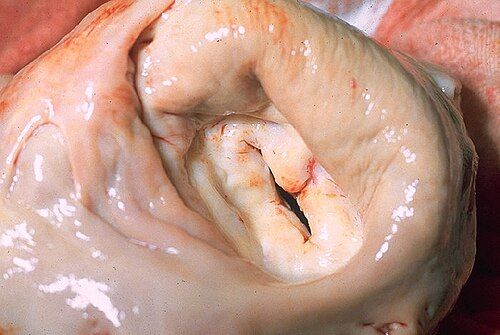
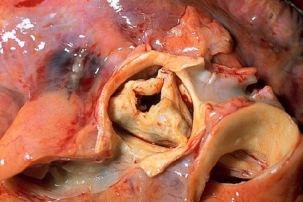

# VALVOPATIAS

Para dominar as valvopatias em provas de residência, você precisa parar de tentar decorar sopros isolados e começar a entender a **fisiopatologia do fluxo**. O examinador não quer apenas que você saiba que a Estenose Mitral (EM) tem um ruflar; ele quer que você entenda por que o paciente com EM faz hemoptise ou por que a síncope na Estenose Aórtica (EAo) é um sinal de mau prognóstico.

Neste material, vamos dissecar as quatro principais valvopatias sob a ótica da **Diretriz Brasileira de Valvopatias (SBC, 2020)** e das atualizações mais recentes, focando no que realmente cai.

## Estenose Mitral (EM)

A Estenose Mitral é a "valvopatia da Febre Reumática". No Brasil, se a questão fala de uma mulher jovem com dispneia progressiva, pense em EM reumática até que se prove o contrário.

### Fisiopatologia: O Gargalo Diastólico

Na EM, a valva não abre direito durante a diástole. Isso cria um gradiente de pressão entre o Átrio Esquerdo (AE) e o Ventrículo Esquerdo (VE). O AE precisa trabalhar sob alta pressão para empurrar o sangue, o que leva à sua dilatação e hipertrofia.

**Por que isso importa?**

- **Congestão Pulmonar:** A pressão alta no AE é transmitida retrogradamente para as veias e capilares pulmonares. Resultado: dispneia, ortopneia e, em casos graves, edema agudo.

- **Fibrilação Atrial (FA):** O AE dilatado é o terreno perfeito para arritmias. Se o paciente tem EM e FA, o risco de embolia sistêmica é altíssimo.

- **Hipertensão Pulmonar (HP):** Com o tempo, a congestão crônica causa remodelamento da vasculatura pulmonar.

### O Exame Físico "Cabeludo" da EM

A ausculta da EM é a favorita das bancas. Ela é composta por quatro elementos clássicos:

- **B1 Hiperfonética:** A valva está endurecida, mas ainda "bate" com força ao fechar (se estiver muito calcificada, a B1 fica hipofonética — sinal de gravidade).

- **Estalido de Abertura:** Ocorre logo após B2. Quanto mais próximo da B2, mais grave é a estenose (maior a pressão no AE).

- **Ruflar Diastólico:** O som do sangue passando pelo "gargalo". É melhor ouvido no foco mitral, com a campânula, em decúbito lateral esquerdo (manobra de Pachon).

- **Reforço Pré-sistólico:** Ocorre no final da diástole devido à contração atrial. **Cuidado:** Se o paciente entrar em FA, ele perde o reforço pré-sistólico (não há contração atrial efetiva).

### Diagnóstico e Gravidade

O Ecocardiograma é o padrão-ouro. Segundo a SBC, definimos a EM como importante quando:

- **Área Valvar Mitral (AVM):** ≤ 1,5 cm² (Muito grave se < 1,0 cm²).

- **Gradiente Médio:** > 10 mmHg.

- **PSAP (Pressão Sistólica da Artéria Pulmonar):** > 50 mmHg em repouso.

### Tratamento: Quando Intervir?

Não operamos números, operamos pacientes. A indicação de intervenção surge na **EM importante + sintomas** (Classe Funcional II a IV) ou na presença de complicadores (FA recente ou HP).

A primeira escolha na EM reumática com anatomia favorável é a **Valvoplastia Mitral por Cateter-Balão (VMCB)**. Para saber se a anatomia é boa, usamos o **Escore de Wilkins-Block** (avalia mobilidade, espessamento, calcificação e aparato subvalvar).

- **Wilkins ≤ 8:** Ótimo candidato à VMCB.

- **Wilkins > 8:** Geralmente vai para troca valvar cirúrgica.

**Contraindicações absolutas à VMCB:** Trombo no AE (risco de embolia) ou Insuficiência Mitral (IM) moderada/grave associada.

## Insuficiência Mitral (IM)

Aqui o problema é o refluxo. Durante a sístole, o sangue volta do VE para o AE.

### Primária vs. Secundária

- **Primária (Orgânica):** O defeito é na valva (ex: Prolapso de Valva Mitral, Febre Reumática, Endocardite). A degeneração mixomatosa é a causa principal do prolapso.

- **Secundária (Funcional):** A valva é normal, mas o VE está dilatado ou disfuncional (ex: Miocardiopatia Dilatada ou Isquêmica), "puxando" as cordoalhas e impedindo o fechamento.

### Fisiopatologia e Quadro Clínico

Na IM crônica, o VE e o AE se dilatam para acomodar o volume extra (sobrecarga de volume). O paciente pode ficar assintomático por anos. Quando o VE "cansa" (disfunção sistólica), surgem os sintomas de IC.

**Ausculta:** Sopro holossistólico em foco mitral, que irradia para a axila. Frequentemente associado a uma B3 (pelo enchimento ventricular rápido).

### Indicações Cirúrgicas (O "Pulo do Gato")

Na IM primária importante, a cirurgia deve ser feita **antes** do VE falhar. A diretriz é clara:

- Sintomáticos (CF II-IV).

- Assintomáticos com queda da Fração de Ejeção (FEVE ≤ 60%) ou dilatação do VE (Diâmetro Sistólico Final - DSVE ≥ 40 mm).

**Dica MedEvo:** Note que o corte da FEVE é 60%, não 50%. Um VE que ejeta contra uma câmara de baixa pressão (AE) deveria ter uma FEVE muito alta. Se está em 55%, ele já está falhando!

| Característica | Estenose Mitral | Insuficiência Mitral |
| --- | --- | --- |
| **Sopro** | Diastólico (Ruflar) | Sistólico (Holossistólico) |
| **Irradiação** | Não irradia | Axila |
| **B1** | Hiperfonética | Hipofonética |
| **Sobrecarga** | Pressão (AE) | Volume (AE e VE) |
| **Etiologia Comum** | Reumática | Prolapso / Funcional |

## Estenose Aórtica (EAo)

A EAo é a valvopatia mais comum do idoso nos países desenvolvidos (degenerativa/calcífica). No Brasil, ainda vemos muito a etiologia reumática e a valva aórtica bicúspide (comum em jovens).

### A Tríade Clássica

Apareceu na prova, é EAo grave:

- **Angina:** O VE hipertrofiado precisa de mais oxigênio, mas a oferta é limitada.

- **Síncope:** Ocorre tipicamente no esforço (o débito cardíaco é fixo, não sobe para suprir a demanda cerebral).

- **Dispneia (IC):** Sinal de falência ventricular. Pior prognóstico (sobrevida média de 2 anos se não tratar).

### Ausculta e Exame Físico

- **Sopro Sistólico Ejetivo:** Em "diamante" (crescendo-decrescendo), foco aórtico, irradia para as carótidas.

- **Fenômeno de Gallavardin:** Em idosos, o componente de alta frequência do sopro pode ser ouvido no ápice, parecendo uma insuficiência mitral. Cuidado para não errar o diagnóstico!

- **Pulso Parvus et Tardus:** Pulso de pequena amplitude e ascensão lenta.

- **B4:** Comum devido à contração atrial contra um VE rígido (hipertrofia concêntrica).

### Critérios de Gravidade (Ecocardiograma)

- **Área Valvar Aórtica (AVA):** < 1,0 cm².

- **Gradiente Médio:** ≥ 40 mmHg.

- **Velocidade de Jato Máxima:** ≥ 4,0 m/s.

### Tratamento: TAVI ou Cirurgia?

Todo paciente com EAo importante sintomática tem indicação de intervenção.

- **Cirurgia de Troca Valvar:** Padrão para pacientes de baixo risco ou jovens (< 70 anos).

- **TAVI (Implante Transcateter):** Preferencial para pacientes > 70 anos ou com alto risco cirúrgico (STS > 8%).

## Insuficiência Aórtica (IAo)

Na IAo, o sangue volta da aorta para o VE durante a diástole. Isso gera uma sobrecarga de volume e pressão absurda no VE.

### Sinais Periféricos (A "Festa" da Semiologia)

A IAo importante aumenta a pressão de pulso (divergente: ex. 160/40 mmHg). Isso gera sinais que as bancas amam:

- **Sinal de Musset:** Cabeça balançando com o batimento.

- **Sinal de Corrigan (Pulso em Martelo d'Água):** Pulso que sobe e desce rapidamente.

- **Sinal de Quincke:** Pulsação no leito ungueal.

- **Sinal de Müller:** Pulsação da úvula.

- **Sopro de Austin Flint:** Um ruflar diastólico mitral funcional (o jato da IAo impede a abertura total da mitral).

### Ausculta

Sopro diastólico aspirativo, decrescente, melhor ouvido no foco aórtico acessório, com o paciente sentado e inclinado para frente.

### Conduta

Cirurgia se:

- Sintomáticos.

- Assintomáticos com FEVE < 50% ou dilatação importante (DDVE > 70 mm ou DSVE > 50 mm).

## Valvopatias Direitas e Manobras Dinâmicas

As valvopatias tricúspide e pulmonar são menos frequentes em provas, mas há um conceito matador: a **Manobra de Rivero-Carvalho**.

- Ao inspirar, aumenta o retorno venoso para o lado direito.

- Consequentemente, os sopros do lado direito (Insuficiência Tricúspide, Estenose Tricúspide) **aumentam** de intensidade.

- Os do lado esquerdo diminuem ou não mudam.

**Insuficiência Tricúspide (IT):** Geralmente secundária à dilatação do VD por hipertensão pulmonar. O sinal clássico é o **fígado pulsátil** e ondas 'v' gigantes no pulso venoso jugular.

## Situações Especiais e Complicações

### Próteses Valvares

- **Biológica:** Não precisa de anticoagulação vitalícia (apenas nos primeiros 3 meses), mas dura menos (10-15 anos). Ideal para idosos ou mulheres que querem engravidar.

- **Mecânica:** Dura "para sempre", mas exige **Varfarina** vitalícia com INR alvo entre 2,5 e 3,5 (mitral) ou 2,0 e 3,0 (aórtica). **Nunca use DOACs (Rivaroxabana, Apixabana) em prótese mecânica!**

### Profilaxia de Endocardite Infecciosa

Segundo a SBC e o Dr. Will, não fazemos profilaxia para todo mundo.

- **Quem recebe?** Apenas pacientes de alto risco (prótese valvar, endocardite prévia, cardiopatia congênita cianótica não corrigida).

- **Qual procedimento?** Apenas dentários que manipulem gengiva ou região periapical.

- **Como?** Amoxicilina 2g VO, 30-60 minutos antes do procedimento.

### Febre Reumática: Profilaxia Secundária

Para evitar novas lesões valvares, usamos Penicilina G Benzatina 1,2M UI a cada 21 dias.

- Sem cardite prévia: Até 21 anos ou 5 anos após o último surto.

- Com cardite, mas sem sequela valvar: Até 25 anos ou 10 anos após o último surto.

- Com lesão valvar residual moderada/grave ou pós-cirurgia: Até os 40 anos ou por toda a vida.

### Valvopatias na Gestação

A Estenose Mitral é a que mais complica, pois a taquicardia fisiológica da gestação encurta a diástole, aumentando a pressão no AE e causando edema agudo de pulmão. O tratamento de escolha para EM grave sintomática na gestante que não responde a betabloqueador é a VMCB (com proteção abdominal).

## Diagnóstico Diferencial e Pérolas Clínicas

Muitas vezes, a questão de valvopatia vem "disfarçada" ou associada a outros temas:

- **Mixoma Atrial:** Tumor benigno que pode obstruir a valva mitral, simulando uma EM (sopro que muda com a posição do corpo).

- **Comunicação Interatrial (CIA):** Apresenta-se com **desdobramento fixo de B2** e sopro ejetivo pulmonar (por hiperfluxo). Pode causar embolia paradoxal (trombo venoso que passa para o lado arterial pelo shunt).

- **Coarctação de Aorta:** Hipertensão em membros superiores com pulsos femorais reduzidos.

- **Vascular:** Paciente com trauma prévio e varizes pode ter insuficiência venosa secundária. Se a úlcera venosa está cicatrizada (CEAP 5) mas apresenta calor e rubor, suspeite de erisipela associada.

## Pontos-Chave para Prova 🩺

- **Estenose Mitral:** Ruflar diastólico + Estalido de abertura. VMCB é a escolha se Wilkins ≤ 8 e sem trombo no AE.

- **Estenose Aórtica:** Tríade (Angina, Síncope, Dispneia). Sopro sistólico que irradia para carótidas. TAVI se > 70 anos ou alto risco.

- **Insuficiência Mitral:** Sopro holossistólico que irradia para axila. Cirurgia se FEVE ≤ 60% ou DSVE ≥ 40 mm (mesmo assintomático).

- **Insuficiência Aórtica:** Pressão de pulso alargada + Sinais periféricos (Musset, Corrigan, Quincke).

- **Manobra de Valsalva:** Diminui o retorno venoso. **Diminui** quase todos os sopros, EXCETO Cardiomiopatia Hipertrófica e Prolapso de Mitral (que aumentam).

- **Anticoagulação:** Prótese mecânica ou EM + FA = Varfarina (INR alvo 2,0-3,5). DOACs são proibidos aqui.

- **Profilaxia Endocardite:** Amoxicilina 2g dose única para pacientes de alto risco em procedimentos dentários invasivos.

- **Febre Reumática:** Principal causa de valvopatia no Brasil. Profilaxia secundária com Penicilina Benzatina é mandatória.

- **Sopro de Austin Flint:** IAo grave simulando EM (estenose mitral funcional).

- **Sopro de Graham-Steell:** Insuficiência pulmonar funcional por hipertensão pulmonar secundária à EM.

- **Contraindicação Absoluta à VMCB:** Trombo em átrio esquerdo ou insuficiência mitral moderada/grave associada.

- **Sinal de Rivero-Carvalho:** Inspiração profunda aumenta sopros de câmaras direitas (IT, ET).

- **Tríade de EAo Grave:** Angina (5 anos de sobrevida), Síncope (3 anos), IC (2 anos). Memorize essa ordem de gravidade!

- **B4:** Presente na EAo (sobrecarga de pressão), ausente na FA.

- **B3:** Presente na IM (sobrecarga de volume).

 Cópia offline para consulta pessoal.
 Fonte original:
 [https://www.medevo.com.br/material-apoio/ler/c6eb724d-f206-4cec-b66b-830ce47c622e](https://www.medevo.com.br/material-apoio/ler/c6eb724d-f206-4cec-b66b-830ce47c622e)
