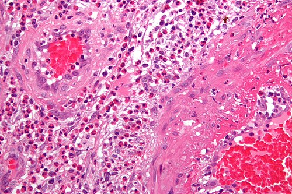
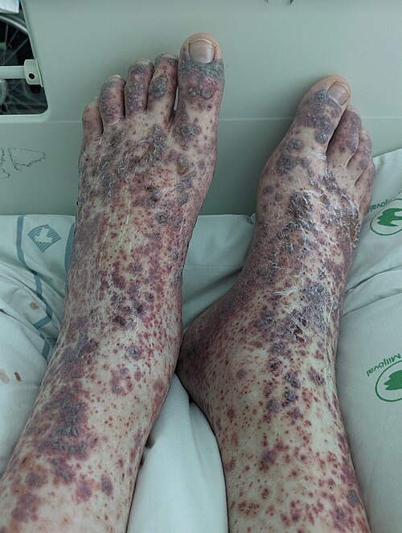

# VASCULITES

Para entender vasculites, você precisa parar de tentar decorar uma lista de nomes e começar a visualizar a árvore vascular. O segredo que eu sempre digo aos meus alunos é: o calibre do vaso dita o sintoma. Se o vaso é grande (aorta e seus ramos), o problema é falta de fluxo (isquemia, claudicação). Se o vaso é pequeno (capilares e vênulas), o problema é o extravasamento (púrpura, hematúria, hemoptise).

As vasculites são processos inflamatórios que destroem a parede do vaso, levando a dois desfechos principais: ou o vaso fecha (estenose/trombose) ou ele enfraquece e dilata (aneurisma).

## Classificação de Chapel Hill (2012)

Esta é a "bíblia" das vasculites. As bancas amam cobrar a divisão por calibre. Se você souber onde cada doença se encaixa aqui, já resolve 40% das questões.

| Calibre do Vaso | Principais Doenças | Manifestações Típicas |
| --- | --- | --- |
| **Grandes Vasos** | Arterite de Células Gigantes (ACG), Arterite de Takayasu | Claudicação de membros, assimetria de pulsos, ausência de pulsos, sopros, cefaleia temporal. |
| **Médios Vasos** | Poliarterite Nodosa (PAN), Doença de Kawasaki | Livedo reticular, nódulos subcutâneos, microaneurismas, mononeurite múltipla, angina mesentérica. |
| **Pequenos Vasos** | GPA (Wegener), MPA, EGPA (Churg-Strauss), Vasculite por IgA, Crioglobulinemia | Púrpura palpável, glomerulonefrite, hemorragia alveolar, uveíte, episclerite. |
| **Variável** | Doença de Behçet, Síndrome de Cogan | Acomete qualquer calibre; úlceras orais/genitais, trombose venosa. |

## Vasculites de Grandes Vasos

Aqui o alvo é a Aorta e seus ramos principais. Pense em "encanamento principal".

### Arterite de Células Gigantes (ACG)

É a vasculite sistêmica mais comum em adultos. O perfil clássico de prova: mulher, > 50 anos (raríssima antes disso), com uma cefaleia nova, unilateral, e sensibilidade no couro cabeludo (dói ao pentear o cabelo).

O sintoma mais específico é a **claudicação de mandíbula** (o paciente começa a mastigar e a mandíbula "cansa" ou dói). Por que isso acontece? Isquemia das artérias massetéricas.

**O perigo real:** Amaurose fugaz ou cegueira súbita. Se a inflamação atingir a artéria ciliar posterior (ramo da oftálmica), o nervo óptico sofre isquemia.

- **Dica de Prova:** Se o caso clínico descreve idosa com cefaleia e alteração visual, a conduta é iniciar Corticoide (Prednisona 40-60mg/dia) IMEDIATAMENTE, antes mesmo da biópsia. Não se espera biópsia para salvar o olho do paciente.

**Diagnóstico:** VHS muito elevado (geralmente > 100 mm/h). O padrão-ouro é a biópsia da artéria temporal, mas como a doença é "saltatória" (skip lesions), uma biópsia negativa não exclui o diagnóstico se a suspeita for alta.

### Arterite de Takayasu

É a "versão jovem" da ACG. O perfil: mulher, < 40 anos. Enquanto a ACG foca na cabeça, a Takayasu foca no arco aórtico e seus ramos (subclávias, carótidas, renais).

- **Quadro Clínico:** Claudicação de membros superiores, assimetria de pressão arterial (> 10 mmHg entre os braços) e ausência de pulsos ("doença sem pulso").

- **Diagnóstico:** Angiotomografia ou Angiorressonância mostrando estenoses, dilatações ou espessamento da parede da aorta.

- **Tratamento:** Corticoides são a base. Se refratário, usamos Metotrexato ou biológicos como o Tocilizumabe (anti-IL6).

## Vasculites de Médios Vasos

Aqui o alvo são as artérias viscerais e musculares. Elas não causam glomerulonefrite (porque não atingem os capilares glomerulares), mas causam isquemia de órgãos.

### Poliarterite Nodosa (PAN)

A PAN clássica está fortemente associada ao **Vírus da Hepatite B (HBV)**.

- **Manifestações:** Dor abdominal pós-prandial (angina mesentérica), mononeurite múltipla (ex: pé caído súbito), livedo reticular e dor testicular.

- **O "Pulo do Gato":** A PAN causa microaneurismas nas artérias renais e mesentéricas. O diagnóstico muitas vezes é feito por arteriografia abdominal mostrando o aspecto de "contas de rosário".

- **Cuidado:** A PAN **não** cursa com ANCA positivo e **não** faz glomerulonefrite. Se tiver hematúria dismórfica ou ANCA+, pense em Poliangeíte Microscópica (MPA).

### Doença de Buerger (Tromboangeíte Obliterante)

Não é uma vasculite inflamatória clássica, mas sim uma vasculite oclusiva.

- **Perfil:** Homem jovem, tabagista pesado.

- **Clínica:** Isquemia distal (dedos negros), fenômeno de Raynaud e tromboflebite migratória.

- **Tratamento:** A única medida que funciona é a **cessação absoluta do tabagismo**. Se não parar de fumar, vai amputar.

- **Dica de Prova:** Angiografia com aspecto de "saca-rolhas" ou "contas de rosário" em vasos distais.

## Vasculites de Pequenos Vasos (ANCA-Associadas)

Aqui entramos no terreno das "Síndromes Pulmão-Rim". O ANCA (Anticorpo Anticitoplasma de Neutrófilos) é o marcador chave. Como o Dr. Will sempre enfatiza nas discussões do MedEvo, o ANCA não é apenas um exame, é a bússola do diagnóstico aqui.

### Granulomatose com Poliangeíte (GPA - Antiga Wegener)

Pense na tríade: Vias Aéreas Superiores (VAS) + Pulmão + Rim.

- **VAS:** Sinusite crônica que não melhora, rinorreia purulenta, crostas nasais e a clássica **deformidade em nariz de sela** (destruição da cartilagem).

- **Pulmão:** Nódulos pulmonares que cavitam (parece TB, mas o ANCA ajuda).

- **Rim:** Glomerulonefrite rapidamente progressiva (GNRP).

- **Marcador:** c-ANCA (anti-PR3) é positivo em > 90% dos casos sistêmicos.

### Poliangeíte Microscópica (MPA)

É a "irmã mais simples" da GPA. Ela faz pulmão e rim, mas **não faz granulomas** e raramente atinge as vias aéreas superiores de forma destrutiva.

- **Clínica:** Hemorragia alveolar + Glomerulonefrite.

- **Marcador:** p-ANCA (anti-MPO).

## Granulomatose Eosinofílica com Poliangeíte (EGPA - Antiga Churg-Strauss)

O diagnóstico aqui é clínico. O paciente "grita" o diagnóstico se você souber ouvir.

- **Perfil:** Paciente com asma grave de início tardio, pólipos nasais e eosinofilia periférica importante (> 1.000 ou > 10%).

- **Clínica:** Além da asma, pode fazer mononeurite múltipla e acometimento cardíaco (miocardite é causa comum de óbito).

- **Marcador:** p-ANCA (positivo em apenas 40-50% dos casos, geralmente naqueles com vasculite predominante).

## Vasculites por Imunocomplexos

Diferente das ANCA-associadas (que são "pauci-imunes", ou seja, não têm depósitos na biópsia), estas aqui brilham na imunofluorescência.

## Vasculite por IgA (Antiga Púrpura de Henoch-Schönlein)

A vasculite mais comum da infância. Geralmente após uma IVAS.

- **Tétrada Clássica:**

- Púrpura palpável (obrigatório, geralmente em nádegas e MMII).

- Artralgia/Artrite.

- Dor abdominal (pode evoluir com intussuscepção).

- Doença renal (hematúria, idêntica à Nefropatia por IgA/Berger).

- **Tratamento:** Geralmente suporte. Corticoides se houver dor abdominal grave ou nefrite importante.

### Vasculite Crioglobulinêmica

Fortemente associada ao **Vírus da Hepatite C (HCV)**.

- **Clínica:** Púrpura palpável, artralgia e neuropatia periférica.

- **Laboratório:** Consumo de complemento (C4 muito baixo) e Fator Reumatoide positivo (sim, uma vasculite que positiva o FR!).

## Doença de Behçet

Uma vasculite de vasos de calibre variável. Muito comum em descendentes da "Rota da Seda" (Turquia, Japão).

- **Critério obrigatório:** Úlceras orais recorrentes (pelo menos 3 vezes em 1 ano).

- **Outros achados:** Úlceras genitais (cicatrizam, diferente das orais), uveíte posterior (pode cegar) e o **Teste da Patergia** (formação de pápula/pústula após trauma com agulha).

- **Diferencial importante:** Behçet é uma das poucas vasculites que causa **trombose venosa profunda (TVP)** e aneurismas de artéria pulmonar.

## Diagnóstico Diferencial e Mimetizadores

Muitas vezes o que parece vasculite não é. As bancas adoram colocar "pegadinhas" com mimetizadores:

- **Endocardite Infecciosa:** Pode fazer púrpura, glomerulonefrite e até ANCA positivo. Sempre peça ecocardiograma e hemoculturas.

- **Mixoma Atrial:** Embolia de fragmentos do tumor mimetiza vasculite de médios vasos.

- **Cocaína/Levamisol:** Causa vasculite necrosante de pavilhão auricular e c-ANCA positivo.

- **Síndrome Antifosfolípide (SAF):** Causa tromboses, mas sem os marcadores inflamatórios (VHS/PCR) tão elevados quanto nas vasculites.

## Tabelas Comparativas para Revisão Rápida

### Tabela 1: Padrões de ANCA e Doenças Associadas

| Padrão de Imunofluorescência | Antígeno Alvo | Doença Principal |
| --- | --- | --- |
| **c-ANCA (Citoplasmático)** | Proteinase 3 (PR3) | Granulomatose com Poliangeíte (GPA) |
| **p-ANCA (Perinuclear)** | Mieloperoxidase (MPO) | Poliangeíte Microscópica (MPA) e EGPA |

### Tabela 2: Diagnóstico Diferencial das Síndromes Pulmão-Rim

| Doença | Achado Pulmonar | Achado Renal | Marcador Chave |
| --- | --- | --- | --- |
| **GPA (Wegener)** | Nódulos cavitados, hemoptise | GNRP | c-ANCA / PR3 |
| **MPA** | Hemorragia alveolar | GNRP | p-ANCA / MPO |
| **Goodpasture** | Hemorragia alveolar | GNRP | Anti-MBG |
| **LES** | Pneumonite, hemorragia | Nefrite Lúpica | Anti-dsDNA, C3/C4 baixos |

## Tratamento Geral das Vasculites Sistêmicas

O tratamento é dividido em duas fases. Por que? Porque as drogas que "apagam o incêndio" são muito tóxicas para serem usadas a longo prazo.

-

**Indução de Remissão (3-6 meses):**

- Objetivo: Parar a inflamação aguda.

- Drogas: Corticoides em doses altas (Prednisona 1mg/kg ou Pulsoterapia com Metilprednisolona) + Imunossupressor forte (Ciclofosfamida ou Rituximabe).

- *Exceção:* Na ACG e Takayasu, muitas vezes o corticoide isolado resolve a indução.

-

**Manutenção de Remissão (18-24 meses):**

- Objetivo: Evitar recidivas com drogas menos tóxicas.

- Drogas: Azatioprina ou Metotrexato.

**Emergência Terapêutica:** Na Síndrome Pulmão-Rim com hipoxemia grave ou creatinina subindo rápido, a **Plasmaférese** deve ser considerada para remover os anticorpos circulantes imediatamente.

## Pontos-Chave para Prova 💡

- **Arterite Temporal:** Idoso + Cefaleia + VHS alto. Inicie corticoide ANTES da biópsia para evitar cegueira.

- **Polimialgia Reumática (PMR):** Frequentemente associada à ACG. Dor e rigidez em cinturas (ombros e quadril). Resposta dramática a doses baixas de corticoide (15mg de prednisona).

- **Takayasu:** Mulher jovem + claudicação de MMSS + sopros em subclávia.

- **PAN:** Hepatite B + dor abdominal + mononeurite múltipla. NÃO faz glomerulonefrite.

- **GPA (Wegener):** c-ANCA + Sinusite + Nódulo pulmonar cavitado + Rim.

- **EGPA (Churg-Strauss):** Asma grave + Eosinofilia (> 1.000) + p-ANCA.

- **Púrpura de Henoch-Schönlein:** Criança + Púrpura palpável em pernas + Dor abdominal + Hematúria.

- **Crioglobulinemia:** Hepatite C + Púrpura + Fator Reumatoide positivo + Complemento C4 baixo.

- **Doença de Buerger:** Homem jovem + Tabagista + Isquemia de extremidades. Tratamento é parar de fumar.

- **Behçet:** Úlceras orais recorrentes + Úlceras genitais + Patergia + Tromboses.

- **Síndrome Pulmão-Rim:** Hemoptise + Hematúria. Principais causas: MPA, GPA e Goodpasture.

- **Doença Relacionada ao IgG4:** "Pâncreas em salsicha", linfadenopatia, fibrose retroperitoneal e níveis elevados de IgG4 sérica.

- **Vasculite por Cocaína:** Necrose de pavilhão auricular e p-ANCA ou c-ANCA positivo (frequentemente falso-positivo para PR3/MPO).

- **Contraindicação Absoluta:** Não use Ciclofosfamida em gestantes (teratogênica). Use Azatioprina se necessário.

- **Erro Comum:** Achar que ANCA negativo exclui vasculite. A biópsia ou angiografia são soberanas.

- **Pegadinha de Prova:** A alternativa dirá que a PAN causa glomerulonefrite. Falso! Ela causa isquemia renal por atingir a artéria renal, não o glomérulo.

- **Valor de Corte:** Na ACG, o VHS costuma estar acima de 50 mm/h, frequentemente > 100 mm/h.

- **Tratamento de Manutenção:** Nunca use Ciclofosfamida por mais de 6 meses devido ao risco de câncer de bexiga e infertilidade. Transicione para Azatioprina.

 Cópia offline para consulta pessoal.
 Fonte original:
 [https://www.medevo.com.br/material-apoio/ler/a889e687-8403-405a-bf10-70470969335e](https://www.medevo.com.br/material-apoio/ler/a889e687-8403-405a-bf10-70470969335e)
