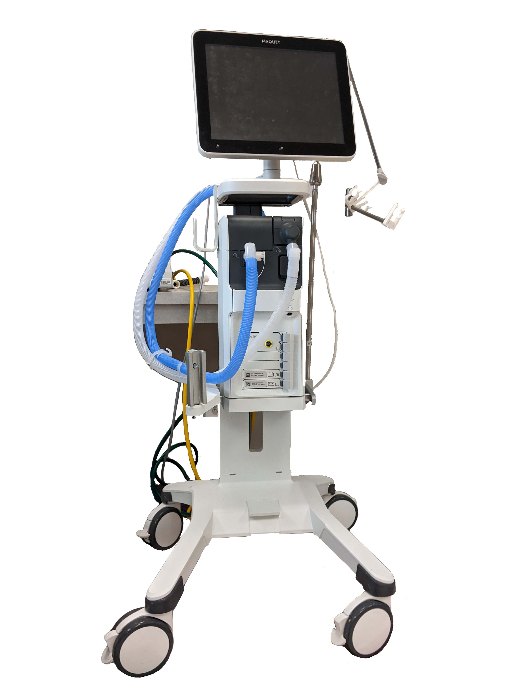
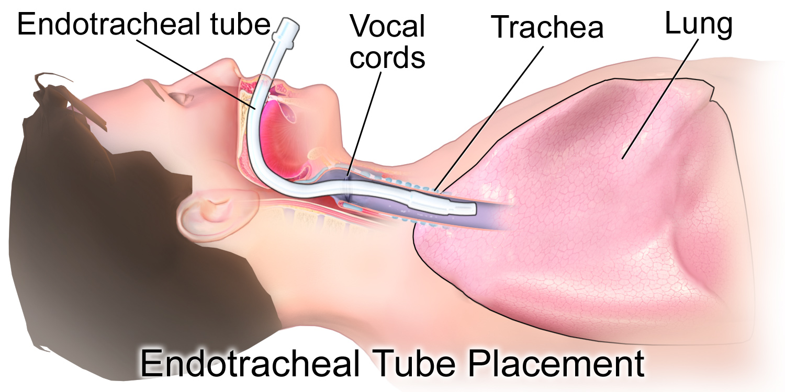

# VENTILAÇÃO MECÂNICA

Para entender ventilação mecânica (VM), você precisa primeiro esquecer como você respira agora. Na respiração espontânea, criamos uma pressão negativa no tórax, o ar é "puxado". Na VM, nós empurramos o ar para dentro através de pressão positiva. Essa inversão da fisiologia é o que gera tanto os benefícios terapêuticos quanto as complicações hemodinâmicas que as bancas de residência adoram cobrar.

## Fisiologia e Impacto Hemodinâmico

Quando iniciamos a ventilação com pressão positiva, aumentamos a pressão intratorácica. Isso tem um efeito direto no sistema cardiovascular que você deve memorizar: a redução do retorno venoso. Ao "apertar" as veias cavas e o átrio direito com a pressão do ventilador, o sangue tem mais dificuldade de chegar ao coração.

Em um paciente hipovolêmico, o aumento da PEEP (Pressão Expiratória Final Positiva) ou do Volume Corrente (VC) pode levar a uma queda súbita do débito cardíaco, resultando em hipotensão e taquicardia compensatória. Se a PEEP for excessiva, podemos causar até um quadro de choque obstrutivo funcional.

Por outro lado, no Edema Agudo de Pulmão (EAP) cardiogênico, essa pressão positiva é nossa aliada. Ela reduz a pré-carga (que está excessiva) e a pós-carga do ventrículo esquerdo, melhorando a performance cardíaca. É por isso que a VNI é padrão-ouro no EAP.

## Insuficiência Respiratória: Onde Tudo Começa

Antes de ligar o aparelho, você precisa identificar o tipo de falência do seu paciente. As provas dividem a insuficiência respiratória em dois grandes grupos:

- **Tipo 1 (Hipoxêmica):** O problema é a troca gasosa (Shunt ou Espaço Morto). Ocorre em pneumonias, SDRA e EAP. O marcador é a PaO2 baixa com PaCO2 normal ou baixa (pela taquipneia).

- **Tipo 2 (Hipercápnica):** O problema é a bomba ventilatória (fadiga ou obstrução). Ocorre no DPOC, asma grave e doenças neuromusculares. O marcador é a PaCO2 elevada (acidose respiratória).

Cuidado com a pegadinha: a hipercapnia progressiva em um paciente com insuficiência respiratória grave é um sinal iminente de estafa muscular. Se o paciente estava taquipneico e "normaliza" a frequência mantendo esforço, ele está entrando em falência.

## Ventilação Não Invasiva (VNI)

A VNI é o uso de suporte ventilatório sem via aérea artificial (tubo ou traqueostomia). Ela utiliza interfaces como máscaras faciais, nasais ou o capacete (helmet).

### Indicações de Primeira Escolha

As duas indicações clássicas que garantem pontos em prova são:

- **DPOC Exacerbado:** Com acidose respiratória (pH < 7,35 e PaCO2 > 45 mmHg). A VNI reduz a necessidade de intubação e a mortalidade.

- **Edema Agudo de Pulmão Cardiogênico:** Melhora a oxigenação e reduz o trabalho cardíaco.

### Contraindicações: Onde o Aluno Erra

Muitas questões colocam um paciente com rebaixamento de consciência (Glasgow < 10) e perguntam se pode fazer VNI. A resposta é: geralmente não. Para fazer VNI, o paciente precisa ser cooperativo e proteger a via aérea.

**Contraindicações Absolutas:**

- Necessidade de intubação imediata (parada respiratória ou cardíaca).

- Instabilidade hemodinâmica grave (choque refratário, arritmias instáveis).

- Trauma ou cirurgia facial recente (impede o acoplamento da máscara).

- Obstrução de via aérea superior.

- Vômitos incoercíveis ou sangramento digestivo alto ativo (risco de aspiração).

**Contraindicações Relativas:**

- Secreção excessiva e tosse ineficaz.

- Rebaixamento do nível de consciência (exceto se for acidose hipercápnica pelo DPOC, onde a VNI pode despertar o paciente ao lavar o CO2).

### Tabela 1: Ajustes Básicos na VNI (BIPAP)

| Parâmetro | Função Principal | Impacto na Gasometria |
| --- | --- | --- |
| **IPAP** (Pressão Inspiratória) | Ventilação / Volume Corrente | Reduz PaCO2 (Lava CO2) |
| **EPAP** (Pressão Expiratória) | Recrutamento Alveolar / PEEP | Aumenta PaO2 (Oxigenação) |
| **Delta de Pressão** (IPAP - EPAP) | Suporte de Pressão | Determina o volume de ar trocado |

## Cateter Nasal de Alto Fluxo (CNAF)

O CNAF tornou-se muito popular recentemente. Ele entrega oxigênio aquecido e umidificado com fluxos de até 60 L/min. Diferente do cateter comum, ele consegue fornecer uma FiO2 de até 100% e gera uma pequena PEEP (cerca de 3 a 5 cmH2O). É excelente para insuficiência respiratória hipoxêmica pura (como na bronquiolite ou pneumonia precoce) e oferece mais conforto que a VNI.

## Ventilação Mecânica Invasiva: Modos Básicos

Quando a VNI falha ou é contraindicada, partimos para a Intubação Orotraqueal (IOT). Uma vez intubado, você precisa escolher como o ventilador vai trabalhar.

### 1. Ventilação Controlada a Volume (VCV)

Aqui, você define o Volume Corrente (ex: 400 mL). O ventilador vai empurrar esse volume não importa a pressão que precise fazer (dentro de limites de segurança).

- **Vantagem:** Garante o volume minuto e o controle do CO2.

- **Risco:** Se o pulmão estiver "duro" (baixa complacência), a pressão nas vias aéreas pode subir demais e causar barotrauma.

### 2. Ventilação Controlada a Pressão (PCV)

Aqui, você define a Pressão Inspiratória (ex: 15 cmH2O acima da PEEP). O volume que vai entrar depende da "elasticidade" do pulmão.

- **Vantagem:** Limita a pressão máxima, protegendo contra barotrauma.

- **Risco:** Se a complacência do paciente piorar (ex: broncoespasmo ou secreção), o volume corrente cai drasticamente, podendo gerar hipoventilação.

### 3. Pressão de Suporte (PSV)

Este é um modo disparado exclusivamente pelo paciente. O ventilador apenas ajuda a inspiração que o paciente iniciou. É o modo principal para o desmame ventilatório. Se o paciente parar de respirar em PSV, ele entra em apneia (a menos que haja um modo de backup).

## Monitorização e Mecânica Respiratória

Para ser aprovado, você precisa saber interpretar as pressões que o ventilador mostra. Imagine o ar entrando no pulmão: ele enfrenta a resistência dos tubos e a elasticidade do alvéolo.

- **Pressão de Pico (Ppico):** É a pressão máxima atingida durante a inspiração. Reflete a resistência das vias aéreas + a complacência do pulmão. Se o tubo dobrar ou o paciente tiver secreção, a Ppico sobe.

- **Pressão de Platô (Pplatô):** É a pressão de equilíbrio nos alvéolos ao final de uma pausa inspiratória. Reflete apenas a complacência (elasticidade) do pulmão. **Meta: < 30 cmH2O.**

- **Driving Pressure (Pressão de Distensão):** É a diferença entre a Pplatô e a PEEP (Pplatô - PEEP). É o parâmetro que melhor se correlaciona com a sobrevida na SDRA. **Meta: < 15 cmH2O.**

### Tabela 2: Diferenciando Problemas de Pressão

| Cenário | Pressão de Pico | Pressão de Platô | Causa Provável |
| --- | --- | --- | --- |
| **Aumento de Resistência** | Elevada | Normal | Secreção, Broncoespasmo, Tubo dobrado |
| **Queda de Complacência** | Elevada | Elevada | SDRA, Pneumonia, Edema Pulmonar, Pneumotórax |

## Ventilação Protetora na SDRA

A Síndrome do Desconforto Respiratório Agudo (SDRA) é o tema favorito das bancas. A diretriz brasileira (AMIB/SBPT) é clara: o objetivo é evitar a VILI (Lesão Pulmonar Induzida pela Ventilação).

Como ventilar um paciente com SDRA?

- **Volume Corrente Baixo:** 4 a 6 mL/kg de **peso predito** (calculado pela altura, não o peso real do paciente). Lembre-se: o pulmão não engorda.

- **Pressão de Platô:** Manter abaixo de 30 cmH2O.

- **Driving Pressure:** Manter abaixo de 15 cmH2O.

- **PEEP Otimizada:** Usar PEEP mais alta para recrutar alvéolos e evitar o colapso cíclico (atelectrauma).

- **FiO2:** Ajustar para manter SpO2 entre 92-96%. Evite a hiperóxia.

Se o paciente mantiver uma relação PaO2/FiO2 < 150 mesmo com ajustes otimizados, a próxima conduta é a **Posição Prona**. O paciente deve ficar de barriga para baixo por pelo menos 16 horas. Isso melhora a distribuição da ventilação e reduz a mortalidade.

## O Desafio das Doenças Obstrutivas (Asma e DPOC)

Aqui o problema não é a entrada do ar, mas a saída. Se você ventilar um asmático com uma frequência respiratória (FR) alta, ele não terá tempo de soltar todo o ar antes da próxima respiração. Isso gera o **Aprisionamento Aéreo** ou **Auto-PEEP**.

A Auto-PEEP aumenta a pressão intratorácica, reduz o retorno venoso e pode causar pneumotórax. No ventilador, você suspeita de Auto-PEEP quando o fluxo expiratório não chega ao zero antes de começar a próxima inspiração.

**Ajustes na Asma/DPOC:**

- Baixa Frequência Respiratória (10-12 ipm) para dar tempo de expirar.

- Aumentar o Fluxo Inspiratório (para o ar entrar rápido e sobrar mais tempo para sair).

- Aceitar a **Hipercapnia Permissiva**: o pH pode ficar baixo (até 7,20) para evitar pressões altas no pulmão.

*Dica do Dr. Will:* Se um paciente asmático em VM chocar subitamente, a primeira conduta é desconectar o ventilador do tubo. Se ele melhorar, era Auto-PEEP excessiva. Se não melhorar, pense em pneumotórax.

## Pneumonia Associada à Ventilação (PAV)

A PAV é a infecção que surge após 48h de intubação. O diagnóstico envolve febre, secreção purulenta e novo infiltrado no Raio-X. Para a prova, foque no **Bundle de Prevenção**:

- Cabeceira elevada (30-45 graus).

- Higiene oral com clorexidina.

- Avaliação diária de despertar e desmame.

- Pressão do cuff entre 20-30 cmH2O.

- Aspiração subglótica (se disponível).

Cuidado: o sistema de sucção fechado é ótimo para evitar contaminação ambiental, mas seu uso isolado não reduz a incidência de PAV em comparação ao sistema aberto, embora seja preferido para manter a PEEP durante a aspiração.

## Desmame da Ventilação Mecânica

O desmame começa quando a causa que levou à intubação foi resolvida. O paciente deve estar estável hemodinamicamente, com drive respiratório e boa oxigenação (PaO2 > 60 com FiO2 < 40% e PEEP < 8).

O principal preditor de sucesso é o **Índice de Respiração Rápida e Superficial (IRRS)**, também conhecido como Índice de Tobin.

- **Fórmula:** FR / Volume Corrente (em litros).

- **Valor de corte:** Se < 105, o paciente tem alta chance de sucesso no Teste de Respiração Espontânea (TRE).

O TRE consiste em deixar o paciente em Tubo T ou PSV baixa (7 cmH2O) por 30 a 120 minutos. Se ele mantiver estabilidade, pode extubar.

### Tabela 3: Critérios de Falha no TRE (Interromper o teste)

| Parâmetro | Critério de Falha |
| --- | --- |
| **Frequência Respiratória** | > 35 ipm |
| **Saturação (SpO2)** | < 90% |
| **Frequência Cardíaca** | > 140 bpm ou aumento > 20% da base |
| **Pressão Arterial** | PAS > 180 mmHg ou < 90 mmHg |
| **Estado Mental** | Agitação, sudorese ou rebaixamento |

## Situações Especiais e Pegadinhas

**1. Pós-Parada Cardiorrespiratória (PCR):**
A meta de PaO2 é 90-100 mmHg. Evite a hiperóxia (FiO2 100% constante), pois o excesso de oxigênio gera radicais livres que pioram a lesão de reperfusão cerebral. A PaCO2 deve ser mantida na faixa normal (35-45 mmHg). A hiperventilação pós-PCR causa hipocapnia, que gera vasoconstrição cerebral e reduz o fluxo sanguíneo para o cérebro.

**2. Doação de Órgãos:**
O paciente em morte encefálica deve ser mantido em ventilação protetora. O objetivo é manter os pulmões viáveis para transplante. Não se "abandona" a ventilação só porque o cérebro parou.

**3. Capnografia:**
A curva em "barbatana de tubarão" (shark fin) é patognomônica de obstrução ao fluxo aéreo (asma ou DPOC). Ela reflete o esvaziamento alveolar lento e dificultado.

**4. Clostridioides difficile:**
Em pacientes de UTI em uso de antibióticos de amplo espectro que desenvolvem diarreia, sempre considere a colite pseudomembranosa. O manejo inclui precaução de contato (luvas e avental) e tratamento com Vancomicina oral ou Metronidazol.

## Pontos-Chave para Prova

- **Indicação clássica de VNI:** DPOC exacerbado com acidose e Edema Agudo de Pulmão.

- **Contraindicação absoluta de VNI:** Parada cardiorrespiratória e necessidade de via aérea definitiva imediata.

- **Volume Corrente na SDRA:** 4 a 6 mL/kg de peso predito (nunca o peso real).

- **Pressão de Platô alvo:** < 30 cmH2O (reflete a complacência alveolar).

- **Driving Pressure alvo:** < 15 cmH2O (Pplatô - PEEP).

- **Posição Prona:** Indicada se PaO2/FiO2 < 150 após otimização da VM. Manter por > 16h.

- **Auto-PEEP:** Comum em asmáticos. Tratamento é aumentar o tempo expiratório (reduzir FR e aumentar fluxo).

- **Efeito Hemodinâmico da PEEP:** Aumenta a pressão intratorácica, reduz o retorno venoso e pode causar hipotensão.

- **Índice de Tobin (IRRS):** FR/VC (L). Valor < 105 prediz sucesso no desmame.

- **Acidose Respiratória em VM:** O ajuste inicial é aumentar a Frequência Respiratória para "lavar" o CO2.

- **Pneumonia Associada à Ventilação:** Prevenção inclui cabeceira elevada e higiene oral com clorexidina.

- **Gasometria em VM:** PaCO2 é controlada pelo Volume Minuto (FR x VC). PaO2 é controlada pela FiO2 e PEEP.

- **Máscara Laríngea:** Dispositivo supraglótico útil em vias aéreas difíceis ou por profissionais não treinados em IOT, mas não protege contra aspiração como o tubo.

- **CNAF:** Excelente para hipoxemia sem hipercapnia, oferecendo O2 aquecido e umidificado.

- **Shark Fin na Capnografia:** Indica broncoespasmo (Asma/DPOC).

- **Glasgow < 8:** Indicação clássica de intubação para proteção de via aérea, independentemente da troca gasosa. 💡

 Cópia offline para consulta pessoal.
 Fonte original:
 [https://www.medevo.com.br/material-apoio/ler/3be3d25b-7ab8-4c4a-8b82-b36f131cd3fc](https://www.medevo.com.br/material-apoio/ler/3be3d25b-7ab8-4c4a-8b82-b36f131cd3fc)
