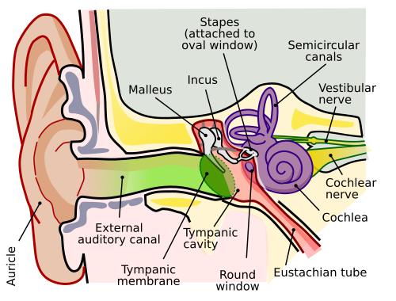

# VERTIGEM E DOENÇAS DO LABIRINTO

Para começar nossa conversa, precisamos alinhar um conceito que derruba muito candidato em prova: tontura não é sinônimo de vertigem. Tontura é um termo guarda-chuva que abriga a pré-síncope, o desequilíbrio, a oscilopsia e, finalmente, a vertigem. A vertigem é, especificamente, a ilusão de movimento, geralmente rotatória. Se o paciente diz que "tudo gira", estamos no campo da vertigem. Se ele diz que "a vista escurece", o problema costuma ser cardiovascular.

Nas provas de residência, o examinador quer saber se você consegue diferenciar uma vertigem periférica (do labirinto ou do nervo) de uma vertigem central (do tronco encefálico ou cerebelo). Essa é a divisão que salva vidas e garante a sua vaga.

## Fisiopatologia: Por que sentimos que o mundo gira?

O sistema vestibular funciona como um nível de pedreiro em ambos os lados da cabeça. Temos os canais semicirculares, que detectam aceleração angular, e os órgãos otolíticos (utrículo e sáculo), que detectam aceleração linear e gravidade. Dentro desses órgãos, existem pequenos cristais de carbonato de cálcio chamados otocônias ou otólitos.

A vertigem acontece quando há um conflito de informações. Se o seu labirinto direito diz que você está girando, mas o esquerdo e os seus olhos dizem que você está parado, o cérebro entra em curto-circuito. Esse conflito gera o nistagmo, que é o reflexo vestíbulo-ocular tentando compensar um movimento que não existe.

Um conceito que o Dr. Will sempre reforça nas discussões do MedEvo é: o nistagmo é a chave do diagnóstico. Ele não é um inimigo, é o labirinto "falando" com você. Se você entender a direção do nistagmo, você localiza a lesão.

## A Grande Divisão: Periférico vs. Central

Esta é a tabela que você precisa ter tatuada na mente. As bancas adoram trocar essas características.

| Característica | Vertigem Periférica | Vertigem Central |
| --- | --- | --- |
| **Início** | Súbito, muito intenso | Gradual ou súbito (se vascular) |
| **Nistagmo** | Unidirecional (horizontal-rotatório), nunca vertical | Multidirecional ou Vertical puro |
| **Latência** | Presente (demora uns segundos para começar) | Ausente (começa na hora) |
| **Fatigabilidade** | Sim (diminui se repetir a manobra) | Não (continua igual) |
| **Sintomas Auditivos** | Comuns (zumbido, hipoacusia) | Raros |
| **Sintomas Neurológicos** | Ausentes | Presentes (ataxia, diplopia, dismetria) |
| **Compensação** | Rápida | Lenta |

Cuidado: o nistagmo vertical puro é SEMPRE sinal de alerta para lesão central (tronco ou cerebelo). Se aparecer na sua prova um nistagmo que bate para cima ou para baixo sem componente rotatório, pare tudo e peça uma Ressonância Magnética (RM).

## O Protocolo HINTS: O Estetoscópio do Otorrino

Muitos alunos acham que, para diagnosticar um AVC de fossa posterior, precisam de uma Tomografia (TC). Errado. A TC de crânio tem uma sensibilidade péssima (cerca de 10 a 20%) para AVC isquêmico agudo em fossa posterior nas primeiras 24 horas. O exame físico, através do protocolo HINTS, é superior à RM nas primeiras horas.

O HINTS é um acrônimo para três testes:

- **HI (Head Impulse Test):** Você vira a cabeça do paciente rapidamente para um lado enquanto ele foca no seu nariz.

- Se houver uma "sacada" corretiva (o olho perde o alvo e volta), o teste é **alterado**, o que sugere lesão **periférica**.

- Se o olho ficar fixo no alvo (teste normal), em um paciente com vertigem aguda, isso é um sinal de alerta para lesão **central**.

- **N (Nystagmus):** Observamos a direção.

- Unidirecional que obedece à Lei de Alexander (bate mais forte quando olha para o lado da fase rápida) sugere periférico.

- Nistagmo que muda de direção conforme o olhar ou vertical sugere central.

- **TS (Test of Skew):** Oclusão alternada dos olhos. Se, ao desobstruir um olho, ele fizer um movimento vertical para se realinhar (desvio vertical do eixo visual), temos um Skew Deviation positivo, indicando lesão central.

Resumo de ouro: Um HINTS "periférico" tem Head Impulse alterado. Um HINTS "central" (INFARCT) tem Head Impulse normal, Nistagmo que muda de direção ou Skew Deviation presente.

## Vertigem Posicional Paroxística Benigna (VPPB)

A VPPB é a causa mais comum de vertigem na prática clínica e em provas. O "porquê" aqui é simples: as otocônias se soltam do utrículo e caem nos canais semicirculares (geralmente o posterior, por gravidade). Quando o paciente move a cabeça, esses cristais se deslocam, empurram a endolinfa e geram uma falsa sensação de rotação.

**Quadro Clínico Clássico:**
Paciente que diz: "Doutor, quando eu viro na cama ou olho para cima para pegar algo no armário, tudo gira por uns 30 segundos e depois passa". Não há perda auditiva. Não há zumbido.

**Diagnóstico:**
Manobra de Dix-Hallpike. Você vira a cabeça do paciente 45 graus para o lado testado e o deita rapidamente com a cabeça pendente em 20 graus de extensão.

- O que você espera ver? Um nistagmo latente (demora uns 2 a 5 segundos), rotatório e geotrópico (bate em direção ao chão), que dura menos de um minuto e cansa (fatiga) se você repetir.

**Tratamento:**
Não gaste tempo com remédios aqui. O tratamento da VPPB é mecânico. Se o problema é um cristal fora do lugar, vamos colocá-lo de volta. Para o canal posterior (90% dos casos), usamos a **Manobra de Epley**.

- Erro comum: prescrever cinarizina para VPPB. Isso só mascara o sintoma e retarda a compensação central. O correto é a manobra de reposicionamento.

## Doença de Ménière (Hidropsia Endolinfática)

Aqui o buraco é mais embaixo. O problema é o excesso de pressão da endolinfa dentro do labirinto membranoso. Imagine um balão que vai enchendo até quase estourar.

**A Tétrade Clássica (Decore isso!):**

- Vertigem episódica (dura de 20 minutos a horas, não segundos como na VPPB).

- Hipoacusia neurossensorial flutuante (especialmente para sons graves).

- Zumbido (tinnitus) constante ou pulsátil.

- Plenitude auricular (sensação de ouvido cheio ou pressão).

A banca vai descrever um paciente que já teve várias crises e que, a cada crise, a audição piora um pouco e depois melhora parcialmente. Com o tempo, a perda auditiva deixa de ser flutuante e se torna permanente.

**Tratamento:**

- **Crise aguda:** Supressores vestibulares (benzodiazepínicos ou anti-histamínicos).

- **Manutenção (Prevenção):** O objetivo é diminuir a pressão da endolinfa.

- Dieta hipossódica (máximo 2g de sódio por dia).

- Evitar cafeína, álcool e tabaco.

- Diuréticos (Hidroclorotiazida ou Clortalidona) são a primeira linha farmacológica.

- Betaistina (muito usada, embora as evidências variem, é figurinha carimbada em provas).

## Neurite Vestibular e Labirintite

Muita gente usa esses termos como sinônimos, mas para a sua prova, há uma diferença fundamental: a audição.

- **Neurite Vestibular:** Inflamação apenas do ramo vestibular do VIII par (frequentemente pós-viral). O paciente tem uma vertigem súbita, violenta, com náuseas e vômitos, que dura dias. Mas — e aqui está o segredo — a audição está NORMAL.

- **Labirintite:** A inflamação atinge o labirinto como um todo. O quadro é igual ao da neurite, mas COM perda auditiva e zumbido.

O tratamento de ambas envolve corticoides (prednisona 1mg/kg/dia) para reduzir a inflamação e antieméticos na fase aguda. Importante: os supressores vestibulares (como o dimenidrinato) devem ser usados por no máximo 3 a 5 dias. Se usar por mais tempo, o cérebro "fica preguiçoso" e não faz a compensação central necessária para a cura.

## Neuroma do Acústico (Schwannoma Vestibular)

Este é o diagnóstico que você não pode comer bola quando o sintoma é unilateral. É um tumor benigno das células de Schwann do oitavo par craniano.

**Apresentação:**
Perda auditiva neurossensorial unilateral progressiva + zumbido unilateral. A vertigem não costuma ser o sintoma principal, mas sim um desequilíbrio leve, pois o crescimento é lento e o cérebro vai compensando.

**Dica de Prova:**
Toda perda auditiva neurossensorial unilateral é um Neuroma do Acústico até que se prove o contrário com uma Ressonância Magnética de conduto auditivo interno com gadolínio. Se a questão mencionar acometimento do nervo facial (paralisia) ou do trigêmeo (perda de reflexo corneano), o tumor já está grande, comprimindo o ângulo pontocerebelar.

## Farmacologia e Efeitos Colaterais

As bancas de Clínica Médica adoram cobrar os efeitos colaterais dos "remédios para labirintite".

- **Cinarizina e Flunarizina:** São bloqueadores de canais de cálcio com ação dopaminérgica.

- **Perigo:** Em idosos, podem causar Parkinsonismo Farmacológico (síndrome extrapiramidal). Se o paciente começou a tremer ou ficou rígido após usar "remédio para tontura", a culpa é deles.

- **Clorpromazina:** Um antipsicótico típico que às vezes é usado para náuseas refratárias.

- **Efeitos:** Fortes efeitos anticolinérgicos (boca seca, visão borrada, retenção urinária) e extrapiramidais.

- **Betaistina:** Atua como um agonista H1 e antagonista H3, melhorando a microcirculação do labirinto. É a droga de escolha para manutenção no Ménière.

## Tabela Comparativa de Duração da Vertigem

Esta tabela ajuda a matar questões apenas pelo tempo de sintoma descrito no enunciado.

| Duração | Diagnóstico Provável |
| --- | --- |
| Segundos (geralmente < 60s) | VPPB |
| Minutos a Horas (20min - 12h) | Doença de Ménière ou Enxaqueca Vestibular |
| Dias (2 - 3 dias de pico) | Neurite Vestibular ou Labirintite |
| Constante / Progressiva | Neuroma do Acústico ou Causa Central |

## Vertigem na Saúde Ocupacional

Não podemos esquecer da PAIR (Perda Auditiva Induzida por Ruído). Embora cause mais zumbido e perda auditiva do que vertigem, ela aparece no contexto de diagnóstico diferencial.

- **Características da PAIR:** Neurossensorial, bilateral, simétrica, irreversível e com "gota acústica" (entalhe) na frequência de 4.000 Hz na audiometria.

- **Prevenção:** Uso de EPI auditivo e rodízio de funções.

## Diagnóstico Diferencial: O Idoso com Tontura

No idoso, a tontura é multifatorial. Temos a presbiastasia (envelhecimento do sistema de equilíbrio), mas também a polifarmácia.
Sempre verifique:

- Hipotensão ortostática (comum com anti-hipertensivos).

- Hipoglicemia (insulina/sulfonilureias).

- Deficiência de Vitamina B12 (causa ataxia e perda de sensibilidade vibratória, que o idoso relata como tontura).

Se um idoso com fatores de risco cardiovascular (HAS, DM, Tabagismo) chega com uma vertigem súbita e contínua, mesmo que a TC seja normal, você deve internar e investigar AVC de circulação posterior. Não caia na pegadinha de dar alta com "diagnóstico de labirintite" para um paciente com risco de infarto cerebelar.

## Manobras Passo a Passo para sua Prova Prática

### Manobra de Dix-Hallpike (Diagnóstica para Canal Posterior)

- Paciente sentado na maca.

- Gire a cabeça 45° para o lado a ser testado.

- Deite o paciente rapidamente, mantendo a cabeça girada e em extensão de 20° para fora da maca.

- Observe os olhos por pelo menos 30 segundos.

- **Resultado Positivo:** Nistagmo vertical para cima e rotatório (torcional) para a orelha de baixo.

### Manobra de Epley (Terapêutica para Canal Posterior)

- Comece na posição final da Dix-Hallpike (cabeça 45° para o lado afetado, pendente).

- Gire a cabeça 90° para o lado oposto (saudável). Aguarde 30-60s.

- Peça para o paciente virar o corpo de lado (decúbito lateral), olhando para o ombro, de modo que a cabeça gire mais 90° (ficando quase voltada para o chão). Aguarde 30-60s.

- Traga o paciente de volta à posição sentada, mantendo o queixo próximo ao ombro.

## Pontos-Chave para Prova

- **VPPB:** Causa mais comum. Vertigem de segundos ao mudar de posição. Diagnóstico: Dix-Hallpike. Tratamento: Epley. Sem sintomas auditivos.

- **Doença de Ménière:** Hidropsia endolinfática. Tríade: Vertigem (horas) + Zumbido + Hipoacusia flutuante. Tratamento: Dieta hipossódica e diuréticos.

- **Neurite Vestibular:** Vertigem súbita e intensa por dias, sem perda auditiva. HIT (Head Impulse Test) alterado para o lado da lesão.

- **Sinal de Alarme (Central):** Nistagmo vertical puro, nistagmo que muda de direção, Skew deviation ou Head Impulse NORMAL em paciente vertiginoso.

- **HINTS:** Superior à Ressonância nas primeiras 24h para AVC de fossa posterior.

- **Neuroma do Acústico:** Perda auditiva neurossensorial unilateral progressiva. Exame de escolha: RM de conduto auditivo interno.

- **Parkinsonismo Farmacológico:** Cinarizina e Flunarizina em idosos. Erro clássico de prescrição.

- **Labirintite:** Vertigem + Perda auditiva súbita. Se for apenas vertigem, é Neurite.

- **Nistagmo Periférico:** Tem latência, é fatigável, unidirecional e suprimido pela fixação ocular.

- **Nistagmo Central:** Início imediato, não fatiga, pode ser vertical puro e NÃO é suprimido pela fixação ocular.

- **Tratamento da Crise:** Supressores vestibulares (Dimenidrinato, Diazepam) por no máximo 5 dias para não impedir a compensação central.

- **Dica de Ouro:** Se a questão fala em "nistagmo rotatório batendo para a orelha de baixo" na manobra de Dix-Hallpike, marque VPPB sem medo.

- **Contraindicação Absoluta:** Não realize manobras de cabeceira (Dix-Hallpike/Epley) se houver suspeita de instabilidade de coluna cervical ou dissecção de artéria vertebral.

- **Lembre-se:** O nistagmo da VPPB de canal posterior é vertical para cima e rotatório. Se for vertical para baixo, suspeite de canal superior (raro) ou causa central. 🧠

 Cópia offline para consulta pessoal.
 Fonte original:
 [https://www.medevo.com.br/material-apoio/ler/ebfc1020-811b-4c6c-b70d-e7a99ce4396e](https://www.medevo.com.br/material-apoio/ler/ebfc1020-811b-4c6c-b70d-e7a99ce4396e)
