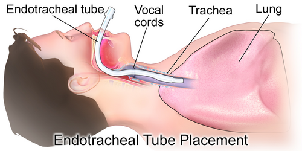

# VIA AÉREA DIFÍCIL

Manejar uma via aérea não é apenas "passar um tubo". Se fosse fácil assim, não teríamos uma especialidade inteira dedicada a isso. Na prova de residência e na vida real, o que separa o médico preparado do desesperado é a capacidade de **prever** a dificuldade e ter um **plano B** (e C, e D) antes mesmo de encostar no paciente.

A Sociedade Brasileira de Anestesiologia (SBA) define via aérea difícil (VAD) como a situação clínica em que um médico treinado experimenta dificuldade com a ventilação sob máscara facial, dificuldade com a intubação traqueal, ou ambas. Guarde isso: ventilar é mais importante que intubar. O paciente morre por falta de oxigenação, não por falta de um tubo na traqueia.

## Entendendo os Preditores: Onde a Prova Mora

Muitos alunos erram questões por não saberem diferenciar o que prediz dificuldade de **ventilação** do que prediz dificuldade de **intubação**.

### Preditores de Ventilação Difícil (Máscara Facial)

Para ventilar bem, você precisa de acoplamento da máscara e patência da via aérea superior. O mnemônico que as bancas amam é o **ROMAN**:

- **R**estrição (pulmões "duros", como na fibrose ou obesidade mórbida).

- **O**bstrução/Obesidade (IMC > 26 kg/m² ou SAOS).

- **M**ask seal (barba é o exemplo clássico de má vedação).

- **A**ge (idade > 55 anos).

- **N**o teeth (edentulismo).

**Dica de Ouro do Dr. Will:** O edentulismo total é um fator preditor independente de ventilação difícil com máscara facial, pois as bochechas "murcham" e o ar escapa. Porém, curiosamente, o edentulismo costuma **facilitar** a laringoscopia, pois sobra espaço para a lâmina. Não confunda os dois na hora da prova!

### Preditores de Intubação Difícil

Aqui usamos o famoso **LEMON**:

- **L**ook externally (trauma facial, macroglossia, pescoço curto).

- **E**valuate (Regra 3-3-2):

- 3 dedos de abertura de boca (distância interincisivos).

- 3 dedos entre o hioide e o mento.

- 2 dedos entre a incisura tireoidea e o hioide.

- **M**allampati (o queridinho das questões).

- **O**bstruction (epiglotite, tumores, estridor).

- **N**eck mobility (espondilite anquilosante, colar cervical no trauma).

### A Classificação de Mallampati

Você precisa decorar isso. Não há escapatória. O paciente deve estar sentado, boca aberta ao máximo, língua para fora, **sem fonar**.

- **Classe I:** Palato mole, fauce, úvula e pilares amigdalianos visíveis.

- **Classe II:** Palato mole, fauce e úvula visíveis.

- **Classe III:** Palato mole e **apenas a base da úvula** visíveis.

- **Classe IV:** Apenas o palato duro é visível.

**Pegadinha de prova:** As bancas adoram dizer que no Mallampati III se vê a úvula inteira. Mentira. Vê-se apenas a **base**. Mallampati III e IV são preditores clássicos de via aérea difícil. Se o examinador te der um paciente com Mallampati IV e obesidade mórbida, o plano A deve ser, preferencialmente, a intubação com broncofibroscópio com o paciente acordado.

| Classificação | Estruturas Visíveis | Significado Clínico |
| --- | --- | --- |
| Mallampati I | Palato mole, úvula, pilares, fauce | Provável intubação fácil |
| Mallampati II | Palato mole, úvula parcial | Baixo risco de dificuldade |
| Mallampati III | Palato mole, base da úvula | Via aérea potencialmente difícil |
| Mallampati IV | Apenas palato duro | Via aérea muito difícil |

## Laringoscopia e a Escala de Cormack-Lehane

Enquanto o Mallampati é feito com o paciente acordado (pré-operatório), o Cormack-Lehane é o que você vê **durante** a laringoscopia.

- **Grau 1:** Visualização total da glote (cordas vocais expostas).

- **Grau 2:** Visualização parcial da glote ou apenas a comissura posterior.

- **Grau 3:** Apenas a epiglote é visível (nada de cordas vocais).

- **Grau 4:** Nem a epiglote é visível (apenas palato mole).

**Conduta no Cormack III:** Se você laringoscopou e viu apenas a epiglote (Cormack III), mas a saturação está estável, o próximo passo lógico é usar um **Bougie**. Ele é um guia longo e flexível que você passa "no escuro" por baixo da epiglote; ao sentir os cliques nos anéis traqueais, você desliza o tubo sobre ele. Isso cai muito!

## Equipamentos: Lâminas e Dispositivos

### Macintosh vs. Miller

- **Lâmina Curva (Macintosh):** É a padrão para adultos. A ponta deve ser posicionada na **valécula** (espaço entre a base da língua e a epiglote). Ao tracionar, você levanta a epiglote indiretamente através do ligamento hioepiglótico.

- **Lâmina Reta (Miller):** Preferencial em neonatos e lactentes (< 2 anos). Por que? Porque a epiglote da criança é longa, em forma de "U" ou "Omega", e muito flexível. A lâmina reta deve ser posicionada **sobre a epiglote**, elevando-a diretamente.

### Dispositivos Supraglóticos (DSG)

O grande representante é a **Máscara Laríngea (ML)**.

- **Vantagem:** Fácil inserção, não precisa de laringoscopia, salva vidas no cenário "não consigo intubar, não consigo ventilar".

- **Desvantagem:** NÃO é via aérea definitiva. Não protege 100% contra aspiração pulmonar (embora os modelos de 2ª geração tenham canal de sucção gástrica).

**O Combitube (Tubo de Duplo Lúmen):** É um dispositivo supraglótico de inserção às cegas, muito usado no pré-hospitalar. Possui dois cuffs (um faríngeo grande e um distal menor). Se cair na prova: ele é uma via aérea avançada, mas **não é definitiva**.

## Sequência Rápida de Intubação (SRI)

A SRI é indicada para pacientes com risco de aspiração (estômago cheio, trauma, urgência, gestantes). O objetivo é minimizar o tempo entre a perda dos reflexos protetores e a passagem do tubo.

### Os 7 Ps da SRI

- **Preparação:** Material, drogas, plano B.

- **Pré-oxigenação:** O2 a 100% por 3-5 min (denitrogenação).

- **Pré-tratamento:** (Opcional) Fentanil em doses baixas no TCE para evitar pico hipertensivo.

- **Paralisia com Indução:** Sedativo e bloqueador neuromuscular (BNM) simultâneos.

- **Posicionamento:** Coxim occipital (posição de "sniffing" ou olfação).

- **Passagem do tubo:** Laringoscopia e confirmação.

- **Pós-intubação:** Sedação contínua e RX de tórax.

**Drogas de Escolha:**

- **Indução:**

- **Etomidato:** Estabilidade hemodinâmica (bom para o choque). Cuidado: pode causar supressão adrenal transitória.

- **Cetamina:** Excelente para asmáticos (broncodilatador) e pacientes chocados (mantém PA por liberação de catecolaminas).

- **Propofol:** Causa hipotensão. Evite no choque.

- **Bloqueio Neuromuscular:**

- **Succinilcolina:** Início de ação ultra-rápido (45-60s). **Contraindicações Absolutas:** Risco de hipercalemia (queimados após 24h, lesões por esmagamento, doenças neuromusculares, insuficiência renal crônica com K+ alto).

- **Rocurônio:** Alternativa à succinilcolina. Se usar dose de 1,2 mg/kg, o tempo de ação se aproxima da succinilcolina.

**Pressão Cricoide (Manobra de Sellick):** Antigamente era obrigatória na SRI. Hoje, a recomendação é: não deve ser feita rotineiramente na PCR e, se dificultar a visualização da glote, deve ser aliviada ou removida.

| Droga | Dose (mg/kg) | Principal Indicação | Observação |
| --- | --- | --- | --- |
| Etomidato | 0,3 | Estabilidade Hemodinâmica | Supressão adrenal |
| Cetamina | 1,5 - 2,0 | Choque, Asma, Agitação | Mantém drive respiratório |
| Succinilcolina | 1,0 - 1,5 | Paralisia Rápida | Risco de Hipercalemia |
| Rocurônio | 0,6 - 1,2 | Alternativa à Succinil | Reversor: Sugamadex |

## O Algoritmo de Via Aérea Difícil

Imagine o cenário: você tentou intubar e falhou. E agora?

- **Mantenha a calma e ventile:** Se você consegue ventilar com máscara facial ou máscara laríngea, você tem tempo.

- **Chame ajuda:** Nunca tente resolver uma VAD sozinho por muito tempo.

- **Limite as tentativas:** No máximo 3 tentativas de laringoscopia por um operador experiente (uma 4ª pode ser tentada por um expert). Mais que isso causa edema e transforma uma "intubação difícil" em uma "ventilação impossível".

- **Dispositivo Supraglótico:** Se a ventilação por máscara está difícil, insira uma Máscara Laríngea. Ela serve como ponte para oxigenação ou até para guiar a intubação por fibra ótica.

- **Cenário "Não Intubo, Não Ventilo" (NINV):** Aqui o bicho pega. Se você não consegue intubar e a saturação está caindo apesar da máscara facial e da máscara laríngea, a conduta é **Via Aérea Cirúrgica Imediata**.

### Via Aérea Cirúrgica: Crico vs. Traqueo

- **Cricotireoidostomia:** É o acesso de emergência. A membrana cricotireoidea é superficial e pouco vascularizada.

- **Contraindicação:** Crianças < 12 anos (risco de estenose subglótica). Nelas, faz-se a cricotireoidostomia por punção com cateter ou traqueostomia de urgência.

- **Traqueostomia:** É um procedimento eletivo ou para via aérea prolongada. **Não é a primeira escolha na emergência respiratória à beira-leito**, pois é mais demorada e sangra mais.

## Situações Especiais e Pegadinhas de Prova

### Obesidade e Via Aérea

O obeso desatura muito rápido porque tem menor Capacidade Residual Funcional (CRF) e maior consumo de O2. O posicionamento é a chave: use o "coxim em rampa" (ramped position), alinhando o conduto auditivo externo com o manúbrio do esterno. Isso melhora a mecânica ventilatória e a visualização laringoscópica.

### Asma Grave e Intubação

Intubar um asmático é o último recurso. O risco de broncoespasmo grave e parada cardíaca na indução é altíssimo.

- **Dica MedEvo:** Se precisar intubar, use Cetamina. No ventilador, use volumes correntes baixos (6 mL/kg) e frequência respiratória baixa para permitir um tempo expiratório longo, evitando a **auto-PEEP** (hiperinsuflação dinâmica).

### Trauma Maxilofacial

Se houver trauma de face grave com muito sangue e distorção anatômica, a laringoscopia direta será impossível. Se o paciente não ventila, não perca tempo: cricotireoidostomia. Lembre-se: intubação nasotraqueal é contraindicada em suspeita de fratura de base de crânio (sinal do guaxinim, sinal de Battle).

### Confirmação da Intubação

Você passou o tubo. Como saber se está no lugar?

- **Padrão-ouro imediato:** Capnografia (presença de onda de CO2 por pelo menos 5 ciclos).

- **Exame físico:** Ausculta epigástrica (deve ser silenciosa), seguida de ausculta pulmonar bilateral (bases e ápices).

- **Radiografia de tórax:** Serve para ver a **posição** (o tubo deve estar 3-5 cm acima da carina), mas não confirma se está na traqueia ou esôfago de forma tão imediata quanto a capnografia.

## Ventilação Mecânica Protetora

Uma vez intubado, o objetivo é não causar lesão induzida pelo ventilador (VILI).

- **Volume Corrente (VC):** 6 mL/kg de peso **predito** (não é o peso real!).

- **Pressão de Platô:** Manter < 30 cmH2O.

- **Driving Pressure (Platô - PEEP):** Manter < 15 cmH2O.

## Pontos-Chave para Prova 💡

- **Mallampati III:** Visualiza-se apenas o palato mole e a base da úvula. É preditor de VAD.

- **Mallampati IV:** Apenas o palato duro é visível.

- **Cormack-Lehane III:** Visualiza-se apenas a epiglote. Conduta: usar Bougie.

- **Distância Tireomentoniana:** < 6 cm (ou 3 dedos) sugere intubação difícil.

- **Distância Esternomentoniana:** < 12 cm é preditor de VAD.

- **Edentulismo:** Dificulta a ventilação com máscara, mas pode facilitar a laringoscopia.

- **Lâmina Reta (Miller):** Usada em menores de 2 anos; levanta a epiglote diretamente.

- **Succinilcolina:** BNM de escolha na SRI, mas proibida em grandes queimados (>24h), esmagamentos e hipercalemia.

- **Cetamina:** Droga de escolha na indução do paciente em choque ou com asma.

- **Máscara Laríngea:** Dispositivo de resgate que permite ventilação, mas não é via aérea definitiva (não protege contra aspiração).

- **Cricotireoidostomia:** Acesso cirúrgico de escolha na emergência "não intubo, não ventilo". Contraindicada em < 12 anos.

- **Capnografia:** Melhor método para confirmação imediata da posição do tubo.

- **Acromegalia:** Padrão-ouro para intubação é a fibroscopia com paciente acordado.

- **Hérnia Diafragmática Congênita:** Contraindicação absoluta para ventilação com máscara/VPP em RN; deve-se intubar imediatamente para não distender o intestino no tórax.

- **RCP com Via Aérea Avançada:** 10 ventilações por minuto (1 a cada 6 segundos) com compressões torácicas contínuas.

- **VNI pós-extubação:** Indicada para reduzir falha em pacientes de alto risco (idosos, DPOC, ICC).

- **Traqueostomia em VM prolongada:** Reduz espaço morto e facilita higiene, mas não aumenta o volume corrente por si só.

 Cópia offline para consulta pessoal.
 Fonte original:
 [https://www.medevo.com.br/material-apoio/ler/25fd52d2-cdd0-4da2-b7db-7a6c86436086](https://www.medevo.com.br/material-apoio/ler/25fd52d2-cdd0-4da2-b7db-7a6c86436086)
