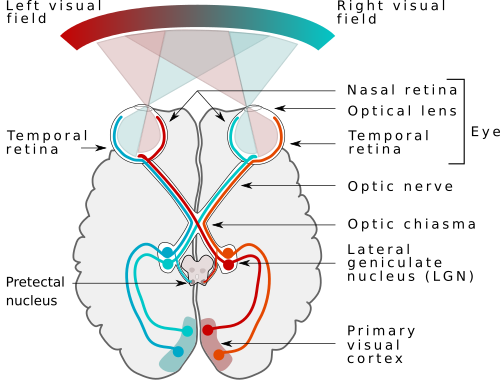
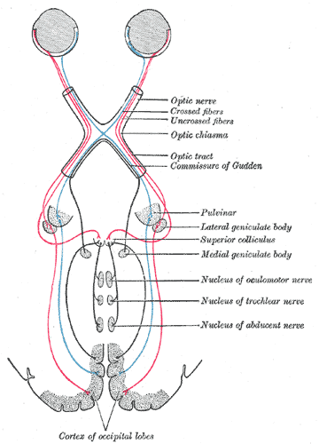

# VIAS ÓPTICAS SENSORIAIS

Para entender a neuroftalmologia, você precisa parar de tentar decorar desenhos e começar a visualizar o trajeto da informação. O aluno que apenas decora que "lesão no quiasma dá hemianopsia bitemporal" erra a questão quando a banca pergunta sobre a vascularização ou sobre a fibra exata que cruzou.

Nas provas de residência e do CBO (Conselho Brasileiro de Oftalmologia), o examinador quer saber se você entende a lógica da anatomia. Vamos percorrer esse caminho desde o fotorreceptor até o córtex occipital, parando em cada "estação" para entender o que acontece ali e o que acontece quando algo dá errado.

## A Retina: Onde Tudo Começa

A via óptica sensorial não começa no nervo óptico, ela começa nos fotorreceptores. Mas, para fins de condução nervosa, o que nos importa são as células ganglionares. Seus axônios formam a camada de fibras nervosas da retina (CFNR) e convergem para o disco óptico.

Aqui está o primeiro conceito fundamental: a inversão da imagem. A retina temporal enxerga o campo visual nasal. A retina nasal enxerga o campo visual temporal. A retina superior enxerga o campo inferior.

Por que isso importa? Porque se um paciente tem um descolamento de retina superior, o defeito no campo visual será inferior. Se ele tem uma coroidite no setor nasal, o escotoma será temporal. No MedEvo, sempre reforçamos: o defeito de campo é sempre oposto à localização da lesão retiniana.

### A Organização das Fibras na Retina

As fibras não correm de qualquer jeito para o nervo. Elas seguem um padrão:

- Fibras da retina nasal: Seguem um trajeto direto para o disco óptico.

- Fibras da retina temporal: Precisam contornar a mácula. Elas formam os arcos arqueados (superior e inferior).

- Feixe papilomacular: São as fibras que saem da mácula e vão direto para a porção temporal do disco óptico.

Cuidado: lesões que respeitam o meridiano horizontal (como no glaucoma ou em oclusões de ramos da artéria central da retina) geralmente ocorrem na retina ou no disco óptico, devido a essa organização arqueada. Lesões que respeitam o meridiano vertical são, quase invariavelmente, quiasmáticas ou retroquiasmáticas.

## O Nervo Óptico: A Primeira Grande Extensão

O nervo óptico não é um nervo craniano comum. Ele é, morfologicamente, uma extensão do Sistema Nervoso Central (SNC). Por isso, ele é revestido por meninges e mielinizado por oligodendrócitos, não por células de Schwann.

Isso explica por que a Esclerose Múltipla causa neurite óptica, mas não causa neuropatias em nervos periféricos da mesma forma. O nervo óptico tem cerca de 50 mm de comprimento e é dividido em quatro segmentos que você precisa conhecer:

- Intraocular (1 mm): É a cabeça do nervo óptico ou disco óptico. Não possui mielina (para não obstruir a luz).

- Intraorbital (25 a 30 mm): Tem um formato em "S" para permitir a movimentação do globo ocular sem esticar o nervo. É aqui que a bainha de mielina começa.

- Intracanalicular (6 a 9 mm): Passa pelo canal óptico no osso esfenoide. É a parte mais suscetível a traumas por cisalhamento.

- Intracraniano (10 a 15 mm): Vai do canal óptico até o quiasma.

### Vascularização do Nervo Óptico

Este é um tema quente em provas. A cabeça do nervo óptico é suprida principalmente pelas artérias ciliares posteriores curtas, através do círculo de Zinn-Haller. A artéria central da retina supre as camadas internas da retina, mas contribui pouco para a nutrição profunda do disco.

Por que isso cai? Para você diferenciar a Neuropatia Óptica Isquêmica Anterior (NOIA) Arterítica da Não-Arterítica. A interrupção do fluxo nas ciliares posteriores curtas é o mecanismo central aqui.

## O Quiasma Óptico: O Ponto de Cruzamento

O quiasma é onde a "mágica" da visão binocular começa a ser processada anatomicamente. Ele está localizado acima da sela túrcica e do corpo do esfenoide.

A regra de ouro do quiasma:
As fibras da retina nasal (campo temporal) cruzam para o lado oposto.
As fibras da retina temporal (campo nasal) permanecem do mesmo lado (ipsilaterais).

### O Joelho de Wilbrand

Muitos livros antigos e algumas bancas tradicionais ainda cobram o Joelho de Wilbrand. Seriam fibras da retina nasal inferior que, ao cruzarem no quiasma, "mergulhariam" cerca de 4 mm no nervo óptico contralateral antes de voltarem para o trato óptico.

Embora estudos anatômicos modernos sugiram que isso possa ser um artefato de técnica, para a prova, você deve saber que uma lesão na transição entre o nervo óptico e o quiasma causa o Escotoma Juncional.

O que é o Escotoma Juncional? É a perda de visão total de um olho (lesão do nervo óptico ipsilateral) associada a uma perda de campo temporal superior no olho contralateral (lesão das fibras do joelho de Wilbrand). Se vir isso em uma questão, marque "lesão na junção do nervo óptico com o quiasma".

### Compressões Quiasmáticas

O quiasma está intimamente relacionado à hipófise.

- Tumores de hipófise (adenomas): Comprimem o quiasma por baixo. As primeiras fibras afetadas são as nasais inferiores (que enxergam o campo temporal superior). Resultado: Hemianopsia bitemporal que começa nos quadrantes superiores.

- Craniofaringiomas: Comprimem o quiasma por cima. Resultado: Hemianopsia bitemporal que começa nos quadrantes inferiores.

Como o Dr. Will sempre enfatiza nas discussões do MedEvo, a neuroftalmologia é pura anatomia aplicada. Se você sabe quem está em cima e quem está embaixo, você deduz o defeito de campo.

## Trato Óptico e Corpo Geniculado Lateral

Após o quiasma, as fibras agora são chamadas de trato óptico. Cada trato óptico contém fibras da retina temporal ipsilateral e da retina nasal contralateral. Ou seja, o trato óptico direito carrega a informação do campo visual esquerdo.

Aqui começam as Hemianopsias Homônimas.

### O Trato Óptico

As lesões no trato óptico são raras isoladamente, mas têm uma característica única: a Incongruência. Como as fibras dos dois olhos ainda não se "alinharam" perfeitamente, o defeito de campo no olho direito é ligeiramente diferente do defeito no olho esquerdo.

Outro sinal clássico de lesão de trato óptico é o Defeito Pupilar Aferente Relativo (DPAR) ou Pupila de Marcus Gunn no olho contralateral à lesão (onde há mais fibras cruzadas afetadas). Além disso, pode ocorrer a atrofia óptica "em banda" ou "em gravata borboleta" após alguns meses.

### O Corpo Geniculado Lateral (CGL)

O CGL é a estação de retransmissão no tálamo. É aqui que os axônios das células ganglionares fazem sinapse. O CGL possui 6 camadas:

- Camadas 1 e 2: Magnocelulares (detectam movimento e contraste).

- Camadas 3 a 6: Parvocelulares (detectam cor e detalhes finos).

Uma curiosidade que cai em provas de subespecialidade: as fibras ipsilaterais vão para as camadas 2, 3 e 5. As fibras contralaterais vão para as camadas 1, 4 e 6.

## Radiações Ópticas: O Caminho pelo Cérebro

Do CGL, a informação segue para o córtex visual através das radiações ópticas. Elas se dividem em dois feixes principais, e aqui as bancas adoram fazer pegadinhas.

### Alça de Meyer (Lobo Temporal)

As fibras que carregam a informação do campo visual superior passam pelo lobo temporal, contornando o corno inferior do ventrículo lateral. Isso é a Alça de Meyer.
Lesão no lobo temporal = Quadrantanopsia homônima superior ("Pie in the sky" ou torta no céu).

### Fibras do Lobo Parietal

As fibras que carregam a informação do campo visual inferior passam pelo lobo parietal.
Lesão no lobo parietal = Quadrantanopsia homônima inferior ("Pie on the floor" ou torta no chão).

Dica de prova: Se o paciente tem uma hemianopsia homônima, mas ela é muito mais pronunciada no quadrante superior, pense em lobo temporal. Se for no inferior, lobo parietal.

## Córtex Visual Primário (V1)

Chegamos à área 17 de Brodmann, nas margens da fissura calcarina, no lobo occipital.

A organização aqui é altamente especializada:

- A parte superior da fissura calcarina recebe informações do campo inferior.

- A parte inferior recebe informações do campo superior.

- A parte posterior (polo occipital) é dedicada à mácula (visão central).

- A parte anterior é dedicada à periferia.

### Preservação Macular (Macular Sparing)

Este é um dos conceitos mais cobrados. Imagine um paciente com um AVC da artéria cerebral posterior (ACP). Ele terá uma hemianopsia homônima completa, EXCETO pela visão central, que permanece intacta.

Por que isso acontece?

- Dupla vascularização: O polo occipital (mácula) é suprido tanto pela artéria cerebral posterior quanto pela artéria cerebral média (ACM). Se a ACP entope, a ACM mantém a mácula viva.

- Grande representação cortical: A mácula ocupa uma área desproporcionalmente grande no córtex visual.

Se a hemianopsia homônima for congruente (idêntica em ambos os olhos) e tiver preservação macular, a lesão é quase certamente no córtex occipital.

## Tabelas Comparativas para Fixação

Para facilitar o seu estudo, organizei as principais diferenças que as bancas de residência costumam explorar.

### Tabela 1: Localização da Lesão e Defeito de Campo

| Localização da Lesão | Defeito de Campo Visual | Característica Adicional |
| --- | --- | --- |
| Nervo Óptico | Escotoma central, cecocentral ou perda total | DPAR ipsilateral presente |
| Junção Nervo/Quiasma | Escotoma Juncional | Perda total ipsilateral + Temporal superior contralateral |
| Quiasma (Central) | Hemianopsia Bitemporal | Comum em adenomas de hipófise |
| Quiasma (Lateral) | Hemianopsia Binasal (rara) | Comum em calcificação de carótidas |
| Trato Óptico | Hemianopsia Homônima Incongruente | Pode ter DPAR e atrofia em banda |
| Radiação Temporal | Quadrantanopsia Homônima Superior | "Pie in the sky" |
| Radiação Parietal | Quadrantanopsia Homônima Inferior | "Pie on the floor" |
| Córtex Occipital | Hemianopsia Homônima Congruente | Frequentemente com preservação macular |

### Tabela 2: Diagnóstico Diferencial das Neuropatias Ópticas

| Condição | Perfil do Paciente | Achado no Exame | Conduta Principal |
| --- | --- | --- | --- |
| Neurite Óptica | Jovem, feminino, dor à movimentação | Edema de disco (1/3) ou disco normal (2/3) | Pulsoterapia com Metilprednisolona |
| NOIA Não-Arterítica | > 50 anos, fatores de risco CV | Edema de disco setorial, hemorragias | Controle de fatores de risco |
| NOIA Arterítica | > 70 anos, claudicação de mandíbula | Disco pálido ("chalky white"), VHS/PCR elevados | Corticoide sistêmico imediato (prevenir cegueira contralateral) |
| Neuropatia Tóxica | Etilista, desnutrido, uso de Etambutol | Escotoma cecocentral bilateral e simétrico | Suspender agente, repor vitaminas B12/Folato |

## O Exame Clínico das Vias Ópticas

Não adianta saber a anatomia se você não souber o que procurar no paciente. O exame neuroftalmológico baseia-se em quatro pilares:

### 1. Acuidade Visual e Visão de Cores

A visão de cores (Teste de Ishihara) é frequentemente afetada precocemente em lesões do nervo óptico, mesmo quando a acuidade visual ainda está 20/20. Se o paciente reclama de "visão lavada" ou "cores sem brilho", suspeite de neuropatia óptica.

### 2. Reflexos Pupilares

O Defeito Pupilar Aferente Relativo (DPAR) é o sinal mais importante da neuroftalmologia. Ele indica uma lesão assimétrica na via aferente (retina ou nervo óptico).

Cuidado: Lesões retroquiasmáticas (como no córtex occipital) NÃO causam DPAR, pois as fibras do reflexo pupilar já se separaram da via visual antes do CGL e foram para o mesencéfalo. A única exceção retroquiasmática que pode dar DPAR é a lesão do trato óptico, devido à assimetria de fibras cruzadas e não cruzadas.

### 3. Fundoscopia

O disco óptico nos conta a história da lesão:

- Edema: Sugere processo agudo (inflamatório, isquêmico ou aumento da pressão intracraniana).

- Palidez: Sugere processo crônico (atrofia óptica).

- Escavação aumentada: Sugere glaucoma, mas cuidado: se a palidez for maior que a escavação, pense em causas neurológicas.

### 4. Campo Visual

O campo visual de Goldmann (cinético) é excelente para lesões neurológicas, pois mapeia a periferia. O campo visual de Humphrey (estático) é o padrão-ouro para acompanhar a sensibilidade central.

## Casos Clínicos para Fixação

### Caso 1: O Campo "Cortado"

Paciente masculino, 68 anos, hipertenso e tabagista, acorda com a sensação de uma "cortina" na parte inferior da visão do olho direito. Ao exame: Acuidade 20/40 OD, 20/20 OE. DPAR presente em OD. Fundoscopia mostra edema de disco superior em OD com algumas hemorragias em chama de vela.

Análise: O defeito é altitudinal inferior, respeita o meridiano horizontal. O edema é setorial. O paciente tem fatores de risco vasculares. Diagnóstico: NOIA Não-Arterítica.
Por que não é neurite? Pela idade e ausência de dor. Por que não é descolamento de retina? Porque o DPAR e o edema de disco apontam para o nervo óptico.

### Caso 2: A Cefaleia e a Visão Lateral

Paciente feminina, 32 anos, queixa-se de cefaleia constante e de que "anda esbarrando nas coisas" lateralmente. Acuidade visual 20/20 em ambos os olhos. Campo visual mostra hemianopsia bitemporal.

Análise: Hemianopsia bitemporal é o sinal patognomônico de lesão quiasmática. A causa mais comum é o adenoma de hipófise. Ela esbarra nas coisas porque perdeu o campo temporal (periférico) de ambos os olhos.

## Diagnóstico Diferencial e Armadilhas

Um erro comum é achar que todo edema de papila bilateral é papiledema.
Papiledema é, por definição, o edema de disco decorrente de Hipertensão Intracraniana (HIC).

Se o paciente tem edema bilateral, mas a visão está muito baixa e há DPAR, pode ser uma neurite óptica bilateral ou uma NOIA arterítica. O papiledema verdadeiro costuma preservar a acuidade visual nas fases iniciais, aumentando apenas a mancha cega.

Outra pegadinha: a Hemianopsia Binasal. Ela raramente é causada por lesão intracraniana. Geralmente é causada por processos oculares bilaterais, como glaucoma avançado ou drusas de nervo óptico, ou por calcificação das artérias carótidas internas que comprimem as fibras temporais (não cruzadas) do quiasma lateralmente.

## Tratamento e Condutas

Na via óptica sensorial, o tratamento é quase sempre o da causa base.

- Neurite Óptica: Segundo o estudo ONTT (Optic Neuritis Treatment Trial), o uso de corticoide oral isolado em doses baixas aumenta a taxa de recorrência. A conduta padrão é Metilprednisolona IV (1g/dia por 3 dias) seguida de prednisona oral, especialmente se houver lesões na RM sugerindo risco de Esclerose Múltipla.

- NOIA Arterítica (Arterite de Células Gigantes): É uma emergência médica. Se houver suspeita clínica (idoso, VHS elevado, cefaleia temporal), inicie corticoide sistêmico IMEDIATAMENTE. Não espere a biópsia da artéria temporal. O objetivo é salvar o outro olho.

- Compressões Tumorais: Encaminhamento para neurocirurgia. O prognóstico visual depende do tempo de compressão e da presença de palidez de disco prévia.

## Pontos-Chave para Prova

- A via óptica é mielinizada por oligodendrócitos (SNC), o que explica o acometimento na Esclerose Múltipla.

- O segmento intraorbital do nervo óptico é o mais longo (25-30 mm) e tem formato em "S".

- O círculo de Zinn-Haller (artérias ciliares posteriores curtas) é o principal suprimento da cabeça do nervo óptico.

- Escotoma Juncional: Lesão na junção nervo óptico/quiasma. Causa cegueira ipsilateral + defeito temporal superior contralateral.

- Hemianopsia Bitemporal: Lesão no corpo do quiasma (ex: adenoma de hipófise).

- Hemianopsia Homônima Incongruente: Lesão no trato óptico.

- Quadrantanopsia Homônima Superior ("Pie in the sky"): Lesão no lobo temporal (Alça de Meyer).

- Quadrantanopsia Homônima Inferior ("Pie on the floor"): Lesão no lobo parietal.

- Hemianopsia Homônima Congruente com Preservação Macular: Lesão no córtex occipital (fissura calcarina).

- A preservação macular ocorre pela dupla vascularização (ACM e ACP) e pela grande representação cortical da mácula.

- DPAR (Pupila de Marcus Gunn) indica lesão pré-quiasmática ou de trato óptico, mas NUNCA de radiações ou córtex.

- Neurite Óptica: Dor à movimentação ocular é o sintoma chave (90% dos casos).

- NOIA Arterítica: Emergência. VHS e PCR elevados. Risco iminente de cegueira bilateral.

- O Joelho de Wilbrand refere-se a fibras nasais inferiores que cruzam e entram no nervo óptico contralateral.

- As camadas 1, 4 e 6 do CGL recebem fibras do olho contralateral.

- As camadas 2, 3 e 5 do CGL recebem fibras do olho ipsilateral.

- As camadas 1 e 2 (Magnocelulares) detectam movimento; 3 a 6 (Parvocelulares) detectam cores e detalhes. 🧠

 Cópia offline para consulta pessoal.
 Fonte original:
 [https://www.medevo.com.br/material-apoio/ler/0d8cc0bb-0ec8-4210-8c93-dc24c2392e99](https://www.medevo.com.br/material-apoio/ler/0d8cc0bb-0ec8-4210-8c93-dc24c2392e99)
