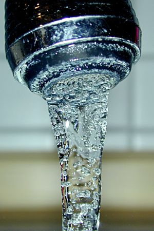
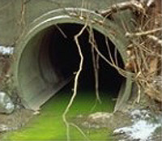

# VIGILÂNCIA AMBIENTAL: QUALIDADE DA ÁGUA, VIGIAGUA E CONTROLE DE RISCOS

Para entender Vigilância Ambiental em Saúde (VAS), você precisa primeiro separar o que é "saúde" do que é "engenharia". Muita gente erra questões de prova porque acha que a Vigilância Ambiental deve consertar o cano estourado ou projetar o aterro sanitário. Não é isso. A Vigilância Ambiental monitora os fatores determinantes e condicionantes do ambiente que interferem na saúde humana.

O foco aqui é a relação entre a exposição ambiental e o desfecho clínico. Se existe um poluente no ar, a Vigilância Ambiental avalia o risco de doenças respiratórias naquela população. Se a água está contaminada, ela monitora o risco de surtos de diarreia. É uma área estratégica que une a epidemiologia clássica com a avaliação de risco.

## Fundamentos da Vigilância Ambiental em Saúde (VAS)

A Vigilância Ambiental em Saúde é um conjunto de ações que proporciona o conhecimento e a detecção de qualquer mudança nos fatores determinantes e condicionantes do meio ambiente que interferem na saúde humana. O objetivo final é recomendar e adotar medidas de prevenção e controle dos fatores de risco.

Um erro clássico de prova é confundir a VAS com a Vigilância Sanitária (VISA). Guarde esta diferença: a VISA foca em produtos, serviços e estabelecimentos (o restaurante, o hospital, o salão de beleza). A VAS foca nos fatores ambientais "brutos": água, ar, solo, desastres naturais, contaminantes químicos e riscos biológicos (vetores e hospedeiros).

Segundo a Política Nacional de Vigilância em Saúde (PNVS), a vigilância ambiental deve estar integrada à Rede de Atenção à Saúde, com foco especial na Atenção Primária à Saúde (APS). É na ponta, lá na UBS, que o médico percebe o aumento de casos de diarreia e aciona a vigilância para investigar a fonte de água.

### O Princípio da Precaução

Este é um conceito que as bancas adoram, especialmente em cenários de desastres ambientais. Imagine que uma fábrica despejou um produto químico novo em um rio. Não existem estudos definitivos provando que aquele produto causa câncer em humanos, mas a estrutura química dele sugere risco. O que fazer?

Pelo Princípio da Precaução, a incerteza científica não deve ser usada como motivo para adiar medidas de proteção à saúde. Se há ameaça de danos sérios ou irreversíveis, agimos preventivamente. Em provas, se a questão descrever um desastre com "incerteza sobre os riscos", a resposta correta quase sempre envolverá a aplicação deste princípio para proteger a população.

## VIGIAGUA: Vigilância da Qualidade da Água para Consumo Humano

O VIGIAGUA é o programa nacional que monitora se a água que o brasileiro bebe é potável. Ele não substitui a responsabilidade das empresas de saneamento (que fazem o controle), mas sim atua como uma fiscalização do Estado (a vigilância).

A base legal aqui é a Portaria de Consolidação nº 5/2017 do Ministério da Saúde. O programa monitora três pilares principais:

- Acesso à água (quantidade e continuidade).

- Qualidade da água (parâmetros físico-químicos e biológicos).

- Vigilância de doenças de veiculação hídrica.

### Parâmetros de Potabilidade e Monitoramento

Para a prova, você precisa conhecer os indicadores que a vigilância utiliza para dizer se a água é segura ou não.

**1. Coliformes Totais e Escherichia coli:**
A presença de *E. coli* na água é o indicador padrão de contaminação fecal recente. Se deu positivo para *E. coli*, a água é imprópria para consumo imediato. Coliformes totais são usados como indicadores de eficiência do tratamento e integridade do sistema de distribuição.

**2. Turbidez:**
A água turva não é apenas feia; ela protege os microrganismos da ação do cloro. Por isso, o controle da turbidez é essencial para garantir que a desinfecção funcione.

**3. Cloro Residual Livre (CRL):**
O cloro é o principal agente desinfetante no Brasil. A legislação exige que a água na torneira do consumidor tenha um mínimo de 0,2 mg/L de CRL. Isso garante que, se houver uma pequena contaminação no caminho entre a estação de tratamento e a casa, o cloro ainda consiga neutralizar os patógenos.

**4. Fluoretação:**
A adição de flúor na água é uma das medidas de saúde pública mais custo-efetivas para a prevenção de cáries dentárias. No entanto, o excesso de flúor pode causar fluorose (manchas nos dentes e fragilidade óssea). As bancas costumam cobrar a fluoretação como uma estratégia de Saúde Pública Odontológica e Prevenção Primária.

### Tabela 1: Parâmetros Críticos na Vigilância da Água

| Parâmetro | Significado para a Saúde | Padrão de Potabilidade (Saída do Tratamento) |
| --- | --- | --- |
| **Escherichia coli** | Contaminação fecal (risco de DDA) | Ausência em 100 mL |
| **Cloro Residual Livre** | Garantia de desinfecção contínua | Mínimo 0,2 mg/L (na rede) |
| **Turbidez** | Interfere na desinfecção | Máximo 5,0 uT (na rede) |
| **Fluoretação** | Prevenção de cárie | Variável conforme temperatura local (média 0,7 mg/L) |

## Doenças de Veiculação Hídrica e Saneamento

Aqui entramos na clínica. O médico precisa saber que a falta de saneamento básico é o principal motor da mortalidade infantil em regiões subdesenvolvidas. As doenças de transmissão fecal-oral são o foco principal.

### Doença Diarreica Aguda (DDA)

Em situações de surtos de diarreia em massa, especialmente após desastres, a prioridade absoluta é o controle da fonte. Isso significa saneamento e cloração da água.

**Dica de Prova:** Se a questão perguntar a medida imediata para uma família em local sem água tratada, a resposta é: **ferver a água** ou usar **hipoclorito de sódio**.
A recomendação oficial do Ministério da Saúde para desinfecção domiciliar é:

- Adicionar 2 gotas de hipoclorito de sódio a 2,5% para cada 1 litro de água.

- Aguardar 30 minutos antes de consumir.

No manejo clínico da diarreia, lembre-se da recomendação da OMS: o uso de **Zinco** reduz a duração e a recorrência dos episódios de diarreia aguda em crianças.

### Parasitoses Intestinais

As parasitoses são marcadores clássicos de precariedade ambiental.

- **Esquistossomose:** Doença de veiculação hídrica por contato com água contendo cercárias. O saneamento ambiental aqui foca em impedir que as fezes cheguem aos corpos d'água, reduzindo a proliferação dos hospedeiros intermediários (caramujos *Biomphalaria*).

- **Trichuris trichiura:** Parasita o ceco e cólon ascendente. O tratamento de escolha é o mebendazol (100mg, 2x/dia por 3 dias). Em provas, o saneamento e a educação em saúde para evitar essas parasitoses são classificados como **Prevenção Primária**.

### Febre Tifoide

Causada pela *Salmonella typhi*, é uma doença de notificação compulsória. A transmissão ocorre pela ingestão de água ou alimentos contaminados com fezes ou urina de doentes ou portadores. É o exemplo perfeito de como a falha na vigilância da água pode gerar uma epidemia grave.

## Desastres Ambientais e Eventos Extremos

O Brasil tem enfrentado um aumento na frequência de inundações e secas extremas. Como o Dr. Will sempre reforça em suas discussões no MedEvo, o médico deve estar preparado para o "pós-desastre".

### Enchentes e Alagamentos

Quando ocorre uma inundação, há uma mistura da água da chuva com esgoto doméstico, resíduos industriais e urina de animais. Isso gera um risco de **Epidemia Maciça** de doenças infecciosas.

As principais doenças monitoradas após enchentes são:

- **Leptospirose:** Ocorre pelo contato da pele (especialmente se houver lesões) ou mucosas com água/lama contaminada pela urina de roedores infectados. A Vigilância Ambiental deve informar os serviços de saúde sobre o risco para que os médicos fiquem alertas a quadros febris agudos com mialgia (principalmente em panturrilhas).

- **Hantavirose:** Associada a roedores. Embora mais comum em áreas rurais/armazenamento de grãos, o desalojamento de roedores em enchentes pode aumentar o risco.

- **Hepatite A e DDA:** Devido à contaminação fecal generalizada da água.

### Tabela 2: Riscos à Saúde em Desastres por Inundações

| Agravo | Mecanismo de Exposição | Medida de Vigilância/Prevenção |
| --- | --- | --- |
| **Leptospirose** | Contato com água/lama (urina de rato) | Monitoramento de áreas alagadas e quimioprofilaxia (se indicado) |
| **DDA / Cólera** | Ingestão de água contaminada | Distribuição de hipoclorito e monitoramento sentinela |
| **Acidentes Peçonhentos** | Desalojamento de escorpiões/cobras | Alerta à população e estoque de soros |
| **Hantavirose** | Inalação de aerossóis de excretas de roedores | Controle de reservatórios e manejo de entulhos |

## Riscos Químicos e Contaminantes Ambientais

A Vigilância em Saúde Ambiental (VSA) também monitora populações expostas a contaminantes químicos. Isso inclui metais pesados, agrotóxicos e poluentes atmosféricos.

### Metais Pesados e Amianto

- **Chumbo:** A exposição pode ser ocupacional ou ambiental. Um ponto importante em provas é a contaminação domiciliar: o trabalhador leva o chumbo na roupa de trabalho, expondo crianças em casa. O chumbo afeta o neurodesenvolvimento e o sistema hematopoiético.

- **Amianto (Asbesto):** Relacionado a mesotelioma e câncer de pulmão. A contaminação da água por amianto pode ocorrer por erosão natural de depósitos minerais ou pelo uso de tubulações e caixas d'água de amianto antigas.

- **Mercúrio:** Grande preocupação em áreas de garimpo (contaminação de peixes e água).

### Agrotóxicos

O Brasil é um dos maiores consumidores de agrotóxicos do mundo. A vigilância foca no **Período de Carência**, que é o tempo que se deve esperar entre a aplicação do agrotóxico e a colheita para garantir que os resíduos estejam em níveis "seguros". O médico rural tem um papel crucial aqui, pois deve investigar o nexo causal entre sintomas (muitas vezes inespecíficos) e a exposição ambiental/ocupacional.

### Classificação IARC (Carcinogênese)

As bancas de Medicina Preventiva adoram cobrar a classificação da Agência Internacional de Pesquisa sobre o Câncer (IARC):

- **Grupo 1:** Carcinogênico para humanos (ex: amianto, benzeno, poluição do ar).

- **Grupo 2A:** Provavelmente carcinogênico (evidência limitada em humanos, mas suficiente em animais).

- **Grupo 2B:** Possivelmente carcinogênico.

- **Grupo 3:** Não classificável.

## Poluição do Ar e Saúde Respiratória

A poluição atmosférica é um dos principais determinantes ambientais de doenças crônicas não transmissíveis (DCNT). Ela aumenta a incidência de doenças cardiovasculares (IAM, AVC) e respiratórias (DPOC, Câncer de Pulmão, Asma).

**Cuidado com a pegadinha:** A poluição do ar NÃO causa gastrite diretamente. As provas costumam colocar "gastrite" ou "doenças digestivas" como opções incorretas para confundir o aluno.

### Ar Condicionado vs. Ventilação

Este é um tema quente em provas de biossegurança e vigilância. O ar-condicionado comum apenas recircula o ar e resfria; ele **não** promove a exaustão adequada. Em ambientes de saúde, a ventilação (natural ou mecânica com troca de ar) é o que realmente controla a carga de patógenos no ar.

Um patógeno clássico associado a sistemas de água e ar-condicionado mal conservados é a ***Legionella pneumophila***. Ela causa uma pneumonia atípica grave (Doença dos Legionários) e deve ser suspeitada em surtos hospitalares ou em hotéis com sistemas de climatização central deficientes.

## Saneamento Básico e Gestão de Resíduos

O saneamento básico é composto por quatro pilares: abastecimento de água, esgotamento sanitário, limpeza urbana/manejo de resíduos sólidos e drenagem de águas pluviais.

### Resíduos Sólidos (Lixo)

A gestão de resíduos é um problema multifacetado. O lixo jogado inadequadamente obstrui bueiros (causando enchentes) e serve de criadouro para vetores (Aedes aegypti, ratos).

**Aterro Sanitário vs. Lixão:**
O lixão é apenas o descarte a céu aberto (proibido por lei). O aterro sanitário é uma obra de engenharia. Nele, ocorre a decomposição anaeróbica da matéria orgânica, gerando dois subprodutos perigosos que precisam de manejo:

- **Chorume:** Líquido escuro e altamente poluente que deve ser drenado e tratado para não contaminar o lençol freático.

- **Biogás (Metano):** Deve ser captado para queima ou geração de energia, pois é um potente gás de efeito estufa.

**Fossas Sépticas:**
Em áreas sem rede de esgoto, usa-se a fossa séptica seguida de sumidouro. Regra de ouro para a prova: o sumidouro deve estar a, no mínimo, **20 metros** de distância de qualquer poço ou fonte de água para evitar a contaminação por microrganismos.

## Vigilância de Fatores de Risco: O VIGITEL

Embora o VIGITEL (Vigilância de Fatores de Risco e Proteção para Doenças Crônicas por Inquérito Telefônico) pareça mais ligado à Vigilância Epidemiológica, ele é frequentemente cobrado junto com a Saúde Ambiental por tratar de determinantes de saúde.

O VIGITEL é um inquérito telefônico anual realizado pelo Ministério da Saúde nas capitais brasileiras. Ele monitora hábitos como tabagismo, consumo de álcool, alimentação e atividade física. Lembre-se: o contato telefônico é o procedimento correto e oficial deste sistema.

## Saúde Única (One Health) e Mudanças Climáticas

O conceito de **Saúde Única** integra a saúde humana, animal e ambiental. Em um mundo globalizado, a saúde de uma população depende da saúde dos ecossistemas ao seu redor. O desmatamento da Amazônia (causado principalmente pela pecuária e soja) é o maior responsável pela emissão de Gases de Efeito Estufa (GEE) no Brasil, contribuindo para as mudanças climáticas que, por sua vez, alteram o padrão de doenças transmitidas por vetores (como Dengue e Malária).

### Tabela 3: Comparativo de Vigilâncias

| Tipo de Vigilância | Objeto de Atuação | Exemplo de Ação |
| --- | --- | --- |
| **Ambiental (VAS)** | Fatores físicos, químicos e biológicos do ambiente | Monitorar mercúrio em peixes; cloração da água |
| **Sanitária (VISA)** | Produtos, serviços e estabelecimentos | Fiscalizar validade de alimentos em mercados |
| **Epidemiológica (VE)** | Doenças e agravos na população | Investigar surto de sarampo; vacinação |
| **Saúde do Trabalhador** | Processos de trabalho e riscos ocupacionais | Investigar nexo causal de LER/DORT |

## Investigação de Surtos e Nexo Causal

Quando você, como médico, atende um paciente com sintomas que sugerem contaminação ambiental (ex: náuseas, vômitos e dor abdominal em vários vizinhos simultaneamente), o seu passo a passo deve ser:

- **Investigar o nexo causal:** Existe uma fonte comum de exposição?

- **Notificar as autoridades:** Acionar a Vigilância Epidemiológica e Ambiental.

- **Controlar os poluentes:** Interromper a exposição (ex: fechar o poço contaminado).

- **Proteger a saúde pública:** Alerta à comunidade e tratamento dos afetados.

Em desastres químicos, a responsabilidade da prefeitura (gestão municipal) é dupla: investigar a causa do desastre e providenciar assistência imediata às vítimas.

## Pontos-Chave para Prova

- **VIGIAGUA:** O parâmetro de potabilidade mais crítico para risco imediato de surto é a presença de *Escherichia coli* (deve ser ausente).

- **Cloração Domiciliar:** 2 gotas de hipoclorito de sódio (2,5%) por litro de água, esperar 30 minutos.

- **Fossas e Poços:** Distância mínima de segurança é de 20 metros.

- **Princípio da Precaução:** Aplicado quando há incerteza científica, mas risco de dano grave à saúde.

- **Leptospirose:** Principal agravo pós-enchente; suspeitar em caso de febre e mialgia de panturrilhas após contato com água de inundação.

- **Legionella:** Pneumonia atípica associada a sistemas de ar-condicionado e água contaminados.

- **IARC Grupo 2A:** Significa que a substância é "provavelmente carcinogênica" para humanos.

- **Zinco:** Recomendação da OMS para reduzir duração e gravidade da diarreia aguda.

- **Vigitel:** Inquérito telefônico para monitorar fatores de risco de DCNT (tabagismo, dieta, sedentarismo).

- **Saúde Única:** Integração entre saúde humana, animal e ambiental.

- **Amianto:** Causa mesotelioma; pode estar presente em tubulações de água antigas.

- **Fluoretação:** Medida de prevenção primária para cárie; o excesso causa fluorose.

- **Aterro Sanitário:** Gera chorume (líquido poluente) e biogás (metano), ambos exigem tratamento.

- **Vigilância Ambiental vs. Sanitária:** A ambiental foca no meio ambiente (água, ar, solo); a sanitária foca em serviços e produtos.

- **Mudanças Climáticas:** No Brasil, o principal fator é o desmatamento para agropecuária.

- **Prevenção Primária:** Saneamento básico, vacinação e educação em saúde. 🩺

 Cópia offline para consulta pessoal.
 Fonte original:
 [https://www.medevo.com.br/material-apoio/ler/047ba7bf-4773-401e-af87-e98e2eed74a6](https://www.medevo.com.br/material-apoio/ler/047ba7bf-4773-401e-af87-e98e2eed74a6)
