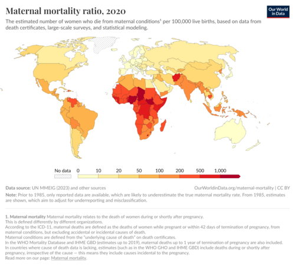

# VIGILÂNCIA DO ÓBITO MATERNO, INFANTIL E FETAL: COMITÊS E EVITABILIDADE

Para entender vigilância em saúde, você precisa parar de enxergar números e começar a enxergar falhas de processo. Quando um óbito materno ou infantil ocorre, o sistema de saúde está nos dizendo que algo falhou, seja no pré-natal, no parto ou nas condições de vida daquela família. Nas provas de residência, o examinador não quer apenas que você saiba a fórmula do coeficiente, ele quer saber se você entende qual engrenagem do SUS parou de girar.

## Os Pilares da Informação: SIM e SINASC

Antes de falarmos de mortes, precisamos falar de onde vêm os dados. No Brasil, trabalhamos com dois sistemas principais que conversam o tempo todo.

O **SIM (Sistema de Informação sobre Mortalidade)** é alimentado pela **Declaração de Óbito (DO)**. Ele é o sistema mais antigo e robusto. Se alguém morre no território nacional, essa morte precisa ser documentada ali. O SIM aceita causas naturais e causas externas (acidentes e violências).

O **SINASC (Sistema de Informação sobre Nascidos Vivos)** é alimentado pela **DNV (Declaração de Nascido Vivo)**. Ele é o nosso denominador para quase todos os indicadores que vamos estudar hoje.

Por que isso importa? Porque para calcular qualquer taxa de mortalidade infantil ou materna, você vai precisar do número de Nascidos Vivos (NV) do SINASC. Se o SINASC da sua região é ruim e subnotifica nascimentos, sua taxa de mortalidade vai parecer artificialmente alta. Como dizemos aqui no MedEvo, o dado só é bom se a coleta for fidedigna.

## Mortalidade Materna: O Indicador da Desigualdade

A mortalidade materna é, talvez, o indicador que mais escancara a qualidade da assistência à saúde de uma mulher. Segundo o Ministério da Saúde, o óbito materno é a morte de uma mulher durante a gestação ou dentro de um período de **42 dias** após o término da gestação.

Mas atenção ao detalhe que as bancas amam: a causa da morte deve estar relacionada ou ser agravada pela gravidez ou por medidas tomadas em relação a ela. Se uma gestante morre atropelada, isso é uma morte acidental ou incidental, e **não entra** no cálculo da Razão de Mortalidade Materna (RMM).

### Classificação dos Óbitos Maternos

Aqui é onde o aluno costuma se confundir. Precisamos dividir as causas em dois grandes grupos:

- **Causas Obstétricas Diretas:** São aquelas que resultam de complicações obstétricas do estado gravídico, parto ou puerpério. São falhas na assistência direta. Exemplos clássicos: Eclâmpsia, hemorragia pós-parto (atonia uterina), infecção puerperal, complicações de aborto inseguro.

- **Causas Obstétricas Indiretas:** São aquelas resultantes de doenças preexistentes ou que se desenvolveram durante a gestação, mas que foram agravadas pelos efeitos fisiológicos da gravidez. Exemplo: Uma gestante com cardiopatia que descompensa, ou um óbito por COVID-19 ou H1N1 durante a gestação.

**Dica de Prova:** Se a questão trouxer um óbito por SRAG (Síndrome Respiratória Aguda Grave) em uma gestante, isso é classificado como morte obstétrica indireta.

## O Cálculo da Razão de Mortalidade Materna (RMM)

Diferente da mortalidade infantil, onde usamos a base 1.000, na mortalidade materna usamos a base **100.000**.

- **Fórmula:** (Número de óbitos maternos diretos + indiretos / Número de nascidos vivos) x 100.000.

Por que usamos 100.000? Porque, felizmente, o óbito materno é um evento mais raro que o infantil. Se usássemos 1.000, teríamos números decimais muito pequenos, dificultando a análise epidemiológica.

### Óbito Materno Tardio

Se a mulher morrer entre **43 dias e 1 ano (365 dias)** após o parto por causas ligadas à gestação, chamamos de Óbito Materno Tardio. Ele deve ser investigado e notificado, mas, por regra da CID-10, ele não entra no cálculo da RMM padrão, a menos que o indicador especificado seja a RMM ampliada.

## Mortalidade Infantil: Onde o Brasil Avançou e Onde Estagnou

A Mortalidade Infantil compreende os óbitos em menores de 1 ano de idade. O coeficiente é calculado por 1.000 nascidos vivos.

O grande "pulo do gato" para as provas é entender a divisão cronológica dessa mortalidade, pois cada período reflete um problema diferente no sistema de saúde.

### Divisões da Mortalidade Infantil

| Componente | Período | O que reflete? |
| --- | --- | --- |
| **Neonatal Precoce** | 0 a 6 dias de vida | Qualidade da assistência ao parto e pré-natal imediato. |
| **Neonatal Tardia** | 7 a 27 dias de vida | Cuidados na UTI neonatal e acompanhamento da primeira semana. |
| **Pós-Neonatal** | 28 dias a < 1 ano | Condições de vida, saneamento, vacinação e nutrição. |

Historicamente, o Brasil reduziu drasticamente a mortalidade **pós-neonatal**. Por quê? Porque melhoramos o saneamento básico, implementamos o soro caseiro (combate à desidratação por diarreia) e expandimos o Programa Nacional de Imunizações (PNI).

Hoje, o nosso "gargalo" é a mortalidade **neonatal precoce**. Ela é muito mais difícil de reduzir porque exige tecnologia dura, UTIs neonatais equipadas e assistência ao parto de altíssima qualidade. Se a questão de prova perguntar qual componente da mortalidade infantil é predominante no Brasil hoje, a resposta é: **Neonatal (especialmente a precoce)**.

### Mortalidade Perinatal

Este é um conceito que mistura óbitos fetais e neonatais. Ele compreende o período que vai de **22 semanas de gestação** (ou 500g) até os **7 dias completos** de vida do recém-nascido. É o melhor indicador para avaliar a qualidade do cuidado obstétrico e pediátrico de forma integrada.

## Óbito Fetal: Quando emitir a Declaração de Óbito?

Este é um tema burocrático que cai muito. Nem todo feto que "sai sem vida" precisa de uma Declaração de Óbito (DO), mas a regra é abrangente para não perdermos dados.

Você deve emitir a DO para óbito fetal se o feto apresentar **QUALQUER** um dos seguintes critérios:

- Idade gestacional de **20 semanas** ou mais.

- Peso corporal de **500 gramas** ou mais.

- Estatura (comprimento cabeça-calcanhar) de **25 centímetros** ou mais.

Se o feto tiver menos que isso (ex: 18 semanas e 300g), é considerado abortamento e a documentação é apenas hospitalar (prontuário), sem necessidade de DO para o sistema de informações de mortalidade, a menos que a família deseje o sepultamento.

**Erro clássico de prova:** A banca diz que um bebê nasceu, respirou uma vez e morreu, pesando 400g com 19 semanas. O aluno pensa "é aborto, não precisa de DO". Errado! Se houve **nascimento vivo** (qualquer sinal de vida: respiração, batimento cardíaco, pulsação do cordão ou movimento muscular voluntário), você DEVE emitir a **DNV e a DO**, independentemente do peso ou idade gestacional.

## A Declaração de Óbito (DO): O Instrumento da Vigilância

Como professor, eu vejo muitos alunos negligenciarem o preenchimento da DO, achando que é "burocracia". Para a Vigilância, a DO é a ferramenta de trabalho.

### Quem deve preencher?

- **Morte por Causa Natural com Assistência Médica:** O médico assistente que vinha acompanhando o paciente.

- **Morte por Causa Natural sem Assistência Médica:**

- Em cidades com **SVO (Serviço de Verificação de Óbito)**: O médico do SVO.

- Em cidades sem SVO: O médico do serviço público de saúde mais próximo (geralmente o da unidade básica ou plantonista do hospital público).

- **Morte por Causa Externa (Violenta ou Acidental):** Independentemente se houve assistência médica ou não, a DO deve ser feita pelo **IML (Instituto Médico Legal)**.

**Cenário Clínico:** Imagine que um paciente internado há 10 dias após um acidente de carro morre de pneumonia hospitalar. Quem faz a DO? O médico do hospital ou o IML?
Resposta: **IML**. A causa básica foi o acidente (causa externa). Se a morte tem origem em um evento externo, o corpo é do IML. O médico assistente nunca assina óbito por causa externa, sob risco de responder eticamente.

### A Cadeia de Eventos na DO

A DO tem um campo específico para a causa da morte, dividido em linhas (a, b, c, d).

- **Linha (a) - Causa Terminal:** É a doença ou estado mórbido que causou a morte diretamente. Ex: Insuficiência respiratória.

- **Linha (d) - Causa Básica:** É a doença ou lesão que iniciou a cadeia de eventos patológicos que conduziram diretamente à morte. É esta causa que vai para as estatísticas do DATASUS.

Se um paciente morre de choque séptico (a) devido a uma peritonite (b) causada por uma apendicite perfurada (c), a **causa básica** para a vigilância é a apendicite.

## Comitês de Vigilância do Óbito

Os Comitês de Mortalidade Materna, Infantil e Fetal são instâncias interinstitucionais, multiprofissionais e confidenciais. Eles não têm caráter punitivo (isso é importante!), mas sim educativo e de vigilância.

O objetivo do comitê é analisar cada óbito para identificar:

- A **evitabilidade** do óbito.

- As falhas na rede de atenção (falta de vaga, demora no transporte, erro de diagnóstico).

- Propor medidas de correção.

### O Fluxo da Investigação

Quando ocorre um óbito materno, a notificação deve ser feita em até **48 horas**. A equipe de vigilância então inicia a investigação, que inclui:

- Análise do prontuário hospitalar.

- Análise da ficha de pré-natal.

- Entrevista com a família (autópsia verbal).

Dr. Will sempre reforça: a investigação do óbito materno é obrigatória em todo o território nacional. É um evento sentinela.

## Evitabilidade: O Conceito de Gessner e Malta

Um óbito é considerado evitável quando poderia ter sido impedido por ações eficazes dos serviços de saúde. No Brasil, usamos muito a classificação de causas de morte evitáveis por intervenções do SUS.

### Exemplos de Óbitos Evitáveis

- **Sífilis Congênita:** É o maior exemplo de **evento sentinela**. Se um bebê morre por sífilis congênita, o sistema falhou miseravelmente. Houve falha na captação da gestante, ou falha no tratamento dela, ou falha no tratamento do parceiro. Não existe desculpa técnica para um óbito por sífilis hoje.

- **Asfixia Perinatal:** Reflete má qualidade na assistência ao parto (demora na indicação de cesárea ou má condução do parto vaginal).

- **Doenças Imunopreveníveis:** Óbito por sarampo ou coqueluche em crianças reflete baixa cobertura vacinal.

### Causas de Morte e sua Evitabilidade (Resumo)

| Causa de Óbito | Classificação de Evitabilidade | Ação Necessária |
| --- | --- | --- |
| Diarreia / Pneumonia | Evitável | Atenção Primária / Saneamento |
| Eclâmpsia | Evitável | Pré-natal de qualidade / Magnésio |
| Malformação Congênita Grave | Não evitável (em sua maioria) | Cuidados paliativos / Suporte |
| Prematuridade Extrema | Reduzível | Corticoide antenatal / UTI Neo |

## Indicadores de Saúde e DATASUS

Para as provas, você precisa saber calcular e interpretar os principais indicadores. O DATASUS é o portal onde esses dados (SIM e SINASC) são disponibilizados.

- **Coeficiente de Mortalidade Infantil (CMI):** (Óbitos < 1 ano / NV) x 1.000.

- **Razão de Mortalidade Materna (RMM):** (Óbitos Maternos / NV) x 100.000.

- **Taxa de Letalidade:** (Óbitos por determinada doença / Total de doentes) x 100. Reflete a gravidade da doença e a eficácia do tratamento hospitalar.

**Pegadinha de Prova:** A banca pergunta qual o melhor indicador para comparar o nível de desenvolvimento de duas nações. Embora a RMM seja excelente, o **Coeficiente de Mortalidade Infantil** ainda é o padrão-ouro internacional para medir desenvolvimento socioeconômico e qualidade de vida.

## Situações Especiais e Pegadinhas de Prova

### O Caso da Microcefalia e Zika

Durante a epidemia de Zika, a vigilância do óbito fetal e infantil foi crucial. RN com perímetro cefálico (PC) menor que **32 cm** (para idade gestacional de 37 a 42 semanas) deve ser notificado e investigado. O exame inicial de triagem é a ultrassonografia transfontanela, mas a confirmação de danos estruturais muitas vezes exige Tomografia ou Ressonância.

### Óbito por Causas Externas na Gestação

Se uma gestante morre em um acidente de carro, você preenche a DO como causa externa (IML). No campo de "morte em mulher em idade fértil", você assinala que ela estava gestante. Isso ajuda a vigilância a entender o perfil das gestantes, mas, repito, **não soma** na Razão de Mortalidade Materna oficial.

### O "Óbito Hospitalar"

Muitas bancas cobram a definição de óbito hospitalar para fins de indicadores de qualidade. Geralmente, considera-se óbito hospitalar aquele que ocorre após **24 ou 48 horas** da internação. Óbitos que ocorrem antes disso costumam refletir a gravidade com que o paciente chegou, e não necessariamente a qualidade do cuidado interno.

## Preenchimento Prático da DO: O que não pode faltar

Ao preencher uma DO, o médico deve ser preciso. Evite termos vagos como "parada cardiorrespiratória" ou "falência de múltiplos órgãos". Isso não é causa de morte, é a consequência final de qualquer morte.

Se o paciente morreu de câncer de pulmão com metástase hepática:

- Linha (a): Insuficiência hepática (causa terminal).

- Linha (b): Metástase hepática.

- Linha (c): Neoplasia maligna de brônquios e pulmões (causa básica).

Se você colocar apenas "parada cardiorrespiratória", o comitê de óbito vai ter que investigar seu prontuário porque você não deu a informação necessária para a estatística de saúde pública.

## Pontos-Chave para Prova

- **Mortalidade Materna:** Período de até 42 dias pós-parto. Base de cálculo: 100.000 nascidos vivos.

- **Causas Diretas vs. Indiretas:** Diretas são complicações obstétricas (ex: hemorragia). Indiretas são doenças preexistentes agravadas pela gravidez (ex: cardiopatia, COVID-19).

- **Mortalidade Infantil:** Menores de 1 ano. Base de cálculo: 1.000 nascidos vivos.

- **Componente Neonatal Precoce:** 0 a 6 dias. É o componente que menos cai no Brasil atualmente, refletindo falhas no parto.

- **Componente Pós-Neonatal:** 28 dias a 1 ano. Reflete meio ambiente e saneamento. Foi o que mais caiu nas últimas décadas.

- **Óbito Fetal (DO obrigatória):** Idade ≥ 20 semanas OU peso ≥ 500g OU estatura ≥ 25cm.

- **Nascido Vivo que morre em seguida:** Sempre exige dois documentos: DNV (SINASC) e DO (SIM), independentemente do peso ou idade gestacional.

- **Causas Externas (Acidentes/Violência):** A Declaração de Óbito é competência EXCLUSIVA do IML, mesmo que o paciente tenha ficado internado por meses.

- **SVO vs. IML:** SVO para morte natural sem assistência. IML para morte não natural (suspeita ou confirmada).

- **Evento Sentinela:** Óbito por sífilis congênita ou tétano neonatal. Indica falha grave na Atenção Primária.

- **Razão de Mortalidade Materna:** Exclui causas acidentais ou incidentais (ex: queda, homicídio).

- **Investigação de Óbito Materno:** É obrigatória e deve ser iniciada em 48 horas. Tem caráter educativo, não punitivo.

- **SIM e SINASC:** O SIM é alimentado pela DO. O SINASC pela DNV. A união dos dois permite calcular os coeficientes de mortalidade.

- **Mortalidade Perinatal:** De 22 semanas de gestação até 7 dias de vida.

- **Erro Comum:** Achar que morte por aborto não é morte materna. É sim, e é uma causa obstétrica direta.

- **O que NÃO fazer:** Nunca atestar óbito de causa externa se você for o médico assistente. Encaminhe ao IML.

Este material foi estruturado para que você tenha a visão crítica necessária para as provas de Medicina Preventiva. Lembre-se: a vigilância não quer apenas o dado, ela quer a transformação da realidade assistencial. Como sempre pontuamos no MedEvo, entender o sistema é o primeiro passo para mudá-lo.

 Cópia offline para consulta pessoal.
 Fonte original:
 [https://www.medevo.com.br/material-apoio/ler/26c29828-6482-4545-9457-3990e1721320](https://www.medevo.com.br/material-apoio/ler/26c29828-6482-4545-9457-3990e1721320)
