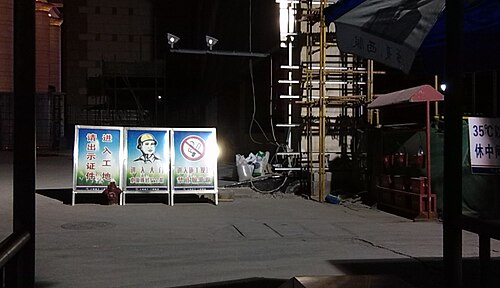

# VIGILÂNCIA EM SAÚDE DO TRABALHADOR

Para entender a Vigilância em Saúde do Trabalhador (VISAT), você precisa primeiro mudar a sua "chave" mental. Esqueça aquela visão antiga da Medicina do Trabalho, onde o médico era apenas um funcionário da empresa focado em produtividade. No SUS, a Saúde do Trabalhador é um campo de saúde pública. Aqui, o trabalho é visto como um determinante social fundamental do processo saúde-doença.

Por que isso cai tanto em prova? Porque o examinador quer saber se você entende que o SUS tem a responsabilidade de intervir nos ambientes de trabalho, sejam eles públicos ou privados. Se você acha que o SUS só cuida de quem não tem plano de saúde, você vai errar questões de Vigilância.

## O Arcabouço Legal e a PNSTT

A base de tudo é a Lei Orgânica da Saúde (Lei 8.080/90). Ela define que a saúde do trabalhador é um conjunto de ações que visa, através da vigilância epidemiológica e sanitária, a promoção, proteção, recuperação e reabilitação da saúde dos trabalhadores submetidos aos riscos e agravos advindos das condições de trabalho.

Um ponto que as bancas adoram: o SUS tem competência para fiscalizar as condições de saúde e segurança nos ambientes de trabalho de empresas públicas e privadas. Muitos alunos marcam que isso é exclusividade do Ministério do Trabalho, mas a Lei 8.080/90 é clara ao dar esse poder ao SUS também.

A Política Nacional de Saúde do Trabalhador e da Trabalhadora (PNSTT), consolidada pela Portaria 1.823/2012, organiza essas ações em três eixos principais: assistência, promoção e vigilância. O objetivo não é apenas tratar a LER/DORT, mas vigiar o processo de trabalho para que a doença não ocorra.

### Quem é o "Trabalhador" para o SUS?

Este é um conceito de inclusão total. Para a PNSTT, trabalhador é todo homem ou mulher que exerce atividade de trabalho, independentemente de:

- Vínculo empregatício (formal, informal, autônomo).

- Local (urbano ou rural).

- Situação no mercado (empregado, desempregado ou aposentado).

Se um paciente chega na sua Unidade Básica de Saúde (UBS) com uma dermatite de contato e ele é um vendedor ambulante sem carteira assinada, ele é, para todos os efeitos do SUS, um trabalhador que precisa de ações de vigilância. Como Dr. Will costuma enfatizar nas discussões do MedEvo, a invisibilidade do trabalhador informal é um dos maiores gargalos da nossa epidemiologia.

## Vigilância em Saúde do Trabalhador (VISAT)

A VISAT não é uma ação isolada, ela é um processo contínuo. Ela se divide basicamente em duas frentes: a vigilância epidemiológica (olhar para o agravo, para a doença que já aconteceu) e a vigilância dos ambientes e processos de trabalho (olhar para o risco antes da doença).

Por que fazemos isso? Para conhecer a realidade, detectar mudanças, recomendar medidas de controle e avaliar se essas medidas estão funcionando. Um erro clássico de prova é dizer que a VISAT tem como função o "remanejamento direto" do trabalhador dentro da empresa. Cuidado: a VISAT atua no coletivo, no ambiente. O remanejamento individual é uma conduta clínica ou administrativa da empresa/perícia.

### A Unidade de Análise

Diferente da clínica tradicional, onde focamos no indivíduo, na vigilância a unidade de análise pode ser o processo de trabalho ou a categoria profissional. No entanto, para fins de diagnóstico e nexo causal, a anamnese ocupacional foca na relação individual do paciente com seu trabalho. Você precisa entender o que *aquele* paciente faz, não o que a estatística da empresa diz.

## Anamnese Ocupacional: A Ferramenta de Ouro

Se você quer acertar questões de nexo causal, aprenda a fazer uma história ocupacional. Ela é a melhor forma de estabelecer a relação entre doença e trabalho. Não basta perguntar "Qual sua profissão?". Você deve perguntar:

- O que você faz exatamente? (Descrição das tarefas).

- Como você faz? (Postura, ferramentas, ritmo).

- Com que você trabalha? (Produtos químicos, ruído, poeira).

- Há quanto tempo faz isso?

- Existem outros colegas com sintomas parecidos? (O famoso "evento sentinela").

- Os sintomas melhoram no final de semana ou nas férias?

Imagine um paciente de 45 anos com asma persistente. Se você não perguntar se ele trabalha em uma fábrica de tintas ou com panificação (exposição a farinha), você vai tratar o sintoma e devolver o paciente para o agente causador. Isso fere o princípio da integralidade do SUS.

## Nexo Causal e Classificação de Schilling

Para a prova de residência, você precisa decorar a Classificação de Schilling. Ela divide as doenças de acordo com o papel que o trabalho desempenha na sua gênese.

| Categoria | Papel do Trabalho | Exemplos Clássicos |
| --- | --- | --- |
| **Schilling I** | Trabalho como causa necessária (direta). | Silicose, Asbestose, Intoxicação por Chumbo. |
| **Schilling II** | Trabalho como fator contributivo (fator de risco). | Hipertensão Arterial, Doença Coronariana, LER/DORT, Câncer. |
| **Schilling III** | Trabalho como provocador ou agravante de doença preexistente. | Asma, Dermatite de contato, Transtornos Mentais. |

Por que isso é importante? Porque nas doenças de Schilling I, o nexo é quase automático. Nas de Schilling II e III, você precisa de uma investigação muito mais robusta para provar que o trabalho foi o culpado ou o agravante.

### Nexo Técnico Epidemiológico Previdenciário (NTEP)

O NTEP é uma ferramenta do INSS. Ele cruza o diagnóstico (CID) com a atividade econômica da empresa (CNAE). Se houver uma associação estatística significativa entre aquele CID e aquele setor, o nexo é presumido. Isso inverte o ônus da prova: a empresa é que tem que provar que a doença *não* foi causada pelo trabalho.

## Notificação Compulsória: O SINAN e a CAT

Aqui mora a maior confusão dos alunos. Existem dois sistemas principais, com objetivos diferentes.

- **SINAN (Sistema de Informação de Agravos de Notificação):** É o sistema do Ministério da Saúde. O objetivo é epidemiológico. Todo profissional de saúde (público ou privado) deve notificar agravos relacionados ao trabalho no SINAN.

- **CAT (Comunicação de Acidente de Trabalho):** É um documento previdenciário. O objetivo é garantir direitos ao trabalhador segurado pelo INSS (celetistas).

**Atenção para a pegadinha:** Se um trabalhador autônomo sofre um acidente de trabalho grave, você notifica no SINAN? Sim! Você emite CAT? Não, pois ele não é segurado do regime geral da previdência social (a menos que contribua por conta própria, mas a obrigatoriedade da empresa não existe aqui).

### O que notificar obrigatoriamente no SINAN?

A lista de agravos relacionados ao trabalho de notificação compulsória inclui:

- Acidente de trabalho grave (morte, mutilação ou em menores de 18 anos).

- Acidente com exposição a material biológico.

- Acidentes de trabalho com crianças e adolescentes (trabalho infantil é evento sentinela!).

- Dermatoses ocupacionais.

- LER/DORT.

- Pneumoconioses.

- Transtornos mentais relacionados ao trabalho.

- Câncer relacionado ao trabalho.

- Surdez (PAIR).

Lembre-se: a notificação deve ser feita mesmo na suspeita diagnóstica. Não espere o resultado final de todos os exames para notificar, pois a vigilância precisa agir rápido no ambiente.

## Acidentes de Trabalho: Conceitos e Cálculos

O acidente de trabalho é aquele que ocorre pelo exercício do trabalho, provocando lesão corporal ou perturbação funcional que cause a morte ou a perda/redução da capacidade para o trabalho.

Existem três tipos principais para a Previdência:

- **Típico:** Ocorre no local e horário de trabalho.

- **Trajeto:** Ocorre no percurso residência-trabalho ou vice-versa (não importa o meio de transporte).

- **Doença Profissional/do Trabalho:** Equiparadas a acidente de trabalho.

### Indicadores de Saúde do Trabalhador

As bancas amam fórmulas. Duas são essenciais:

- **Coeficiente de Letalidade:** (Número de óbitos por acidente de trabalho / Total de acidentes de trabalho) x 100. Ele mede a gravidade dos acidentes.

- **Coeficiente de Mortalidade:** (Número de óbitos por acidente de trabalho / População trabalhadora exposta) x 10^n. Ele mede o risco de morrer por trabalho naquela população.

Se uma questão diz que o número de acidentes diminuiu, mas a letalidade aumentou, isso significa que os acidentes que estão ocorrendo são mais graves ou que o sistema de saúde não está conseguindo salvar esses trabalhadores.

## Patologias Específicas em Foco

### LER/DORT (Lesões por Esforços Repetitivos)

Não é uma doença única, mas um síndrome. O diagnóstico é clínico e a história ocupacional é soberana. O tratamento envolve repouso, analgesia e, fundamentalmente, a modificação das condições de trabalho. Não adianta dar anti-inflamatório e mandar o digitador voltar a digitar 10 horas por dia sem pausa.

### Intoxicação por Agrotóxicos

Um tema muito quente devido à força do agronegócio no Brasil. A intoxicação pode ser aguda (quadro colinérgico clássico: miose, sialorreia, bradicardia) ou crônica (cânceres, neuropatias, desfechos reprodutivos).
O critério para diagnóstico muitas vezes é clínico-epidemiológico: quadro clínico compatível + história de exposição + melhora com o afastamento. A notificação no SINAN é obrigatória para todos os casos suspeitos.

### Pneumoconioses (Silicose e Asbestose)

São doenças de Schilling I.

- **Silicose:** Exposição à sílica (mineração, jateamento de areia, marmorarias). No RX, vemos nódulos em campos superiores e o clássico linfonodo em "casca de ovo" (egg-shell calcification).

- **Asbestose:** Exposição ao amianto (caixas d'água, telhas, freios). O amianto é um potente carcinógeno, fortemente associado ao Mesotelioma de pleura e ao câncer de pulmão.

### Câncer Relacionado ao Trabalho

O câncer ocupacional muitas vezes é indistinguível do câncer não ocupacional. A diferença está na história de exposição.

- **Benzeno:** Leucemias (especialmente LMA). O benzeno está na gasolina e na indústria siderúrgica.

- **Radiações Ionizantes:** Leucemias e câncer de tireoide.

- **Agrotóxicos:** Linfomas e leucemias.

## O Papel da Atenção Primária (APS)

A APS é a porta de entrada e o centro de coordenação do cuidado. O Médico de Família deve estar atento ao território. Se em uma determinada microárea começam a surgir muitos casos de dermatite, ele deve suspeitar de uma oficina ou pequena fábrica local.

O matriciamento é feito pelo CEREST (Centro de Referência em Saúde do Trabalhador). O CEREST não é uma unidade de pronto-atendimento; ele é um centro de suporte técnico especializado que auxilia a rede de saúde no diagnóstico do nexo causal e no planejamento de ações de vigilância.

### Reabilitação Profissional

Quando o trabalhador sofre um agravo, o objetivo final é a reintegração ocupacional. Isso exige uma equipe multidisciplinar e um plano de reabilitação individualizado. O médico assistente tem o dever ético de fornecer todos os subsídios (atestados, relatórios) para que o trabalhador acesse seus direitos previdenciários.

Cuidado com o sigilo: no atestado para a empresa, você não deve colocar o CID, a menos que o paciente autorize por escrito. Já para fins periciais (INSS), o relatório deve ser completo para garantir o benefício.

## Ética e Responsabilidade Médica

Todo médico, seja ele cirurgião, pediatra ou clínico, tem o dever ético de investigar o nexo causal. Se você suspeita que a doença do seu paciente tem relação com o trabalho, você deve:

- Registrar no prontuário.

- Informar ao paciente.

- Notificar no SINAN.

- Orientar o afastamento, se necessário.

Um erro comum é achar que apenas o "Médico do Trabalho" pode emitir laudos sobre nexo. Isso é falso. O médico assistente é quem melhor conhece a evolução clínica do paciente.

## Tabelas Comparativas para Fixação

### Tabela 1: Diferenças entre Saúde Ocupacional e Saúde do Trabalhador

| Característica | Saúde Ocupacional (Tradicional) | Saúde do Trabalhador (SUS) |
| --- | --- | --- |
| **Foco** | Indivíduo e produtividade. | Coletivo e saúde integral. |
| **Sujeito** | Empregado formal. | Todos os trabalhadores (formais/informais). |
| **Relação** | Hierárquica (médico da empresa). | Participativa (controle social). |
| **Ambiente** | Higiene industrial (limites de tolerância). | Vigilância dos processos de trabalho. |
| **Objetivo** | Prevenção de doenças específicas. | Promoção da saúde e transformação do trabalho. |

### Tabela 2: Sistemas de Informação em Saúde do Trabalhador

| Sistema | Sigla | O que registra na Saúde do Trabalhador |
| --- | --- | --- |
| **Informação de Agravos** | SINAN | Doenças e acidentes (foco epidemiológico). |
| **Mortalidade** | SIM | Óbitos com causa relacionada ao trabalho. |
| **Informação Hospitalar** | SIH | Internações por agravos ocupacionais. |
| **Comunicação de Acidente** | CAT | Documento para fins previdenciários (INSS). |

### Tabela 3: Agentes e Patologias Ocupacionais Comuns

| Agente | Patologia Associada | Exemplo de Atividade |
| --- | --- | --- |
| **Ruído elevado** | PAIR (Surdez sensorineural) | Operadores de máquinas, aeroportos. |
| **Benzeno** | Leucemia Mieloide Aguda | Frentistas, siderurgia. |
| **Chumbo (Saturnismo)** | Anemia, cólica abdominal, linha de Burton | Fabricação de baterias, tintas antigas. |
| **Mercúrio (Hidrargirismo)** | Tremores, alterações psiquiátricas | Garimpo, fabricação de termômetros. |
| **Cromo** | Ulceras de septo nasal, dermatite | Galvanoplastia, curtumes. |

## Gestão de Riscos e Equipamentos de Proteção

Na Vigilância, existe uma hierarquia de controle de riscos que você deve conhecer para a prova. O EPI (Equipamento de Proteção Individual) é sempre a **última** medida a ser adotada.

- **Eliminação do risco:** Substituir uma substância tóxica por uma inócua.

- **Controle de Engenharia:** Instalar exaustores, isolamento acústico da máquina.

- **Controle Administrativo:** Rodízio de funcionários, pausas obrigatórias.

- **EPI:** Luvas, máscaras, protetores auriculares.

Se uma questão de prova pergunta qual a melhor medida para proteger trabalhadores expostos ao ruído e coloca "fornecer protetor auricular" na letra A e "enclausuramento da máquina" na letra B, a resposta correta é a B. O EPI protege apenas o indivíduo e depende da adesão dele; a medida de engenharia protege a todos.

## Impacto da COVID-19 na Saúde do Trabalhador

A pandemia trouxe questões novas para as bancas. A COVID-19 pode ser considerada doença relacionada ao trabalho? Sim, especialmente para profissionais de saúde ou quando a exposição ocupacional é comprovada.

- **Notificação:** Deve ser feita no SINAN como doença relacionada ao trabalho se houver nexo.

- **Isolamento:** Contatos de casos confirmados devem ser isolados por 14 dias (ou conforme protocolo vigente da época da prova). Testagem em assintomáticos geralmente não é indicada para retorno, foca-se no tempo de isolamento.

## Pontos-Chave para Prova

- **PNSTT:** Abrange todos os trabalhadores, independentemente do vínculo (formal, informal, desempregado, aposentado).

- **Lei 8.080/90:** O SUS tem o dever de fiscalizar ambientes de trabalho, inclusive empresas privadas.

- **Schilling I:** Trabalho é causa necessária (ex: Silicose).

- **Schilling II:** Trabalho é fator de risco (ex: Infarto, LER/DORT).

- **Schilling III:** Trabalho é agravante (ex: Asma, Dermatite).

- **Notificação SINAN:** Obrigatória para acidentes graves, material biológico, PAIR, LER/DORT, pneumoconioses, câncer e transtornos mentais. Deve ser feita na suspeita.

- **CAT:** Documento previdenciário para segurados do INSS. Pode ser emitida pela empresa, pelo próprio trabalhador, pelo sindicato ou pelo médico.

- **NTEP:** Nexo presumido pelo cruzamento de CID e CNAE. Inverte o ônus da prova para a empresa.

- **Anamnese Ocupacional:** É a ferramenta mais importante para estabelecer o nexo causal individual.

- **CEREST:** Unidade de retaguarda técnica especializada do SUS, não é porta de entrada.

- **EPI:** É sempre a última escolha na hierarquia de proteção. Priorize medidas coletivas e de engenharia.

- **Trabalho Infantil:** Menores de 16 anos trabalhando (exceto aprendiz a partir de 14) é considerado evento sentinela e deve ser registrado pela Equipe de Saúde da Família.

- **Câncer de Pulmão e Amianto:** O risco é multiplicado se o trabalhador também for fumante (efeito sinérgico).

- **Sigilo Médico:** Não colocar CID em atestados para a empresa, exceto com autorização expressa do paciente.

- **Letalidade por Acidente:** (Óbitos / Total de acidentes) x 100. Mede a gravidade.

- **O que NÃO fazer:** Não ache que o SUS não tem poder de polícia sanitária em empresas. Ele tem e deve exercer através da VISAT.

- **Dica de Ouro:** Se a questão fala em "remanejamento de função", isso é competência da empresa/perícia, não da Vigilância Epidemiológica.

 Cópia offline para consulta pessoal.
 Fonte original:
 [https://www.medevo.com.br/material-apoio/ler/f0c0f42d-002a-4fb0-8921-ae6f4f18e2b8](https://www.medevo.com.br/material-apoio/ler/f0c0f42d-002a-4fb0-8921-ae6f4f18e2b8)
