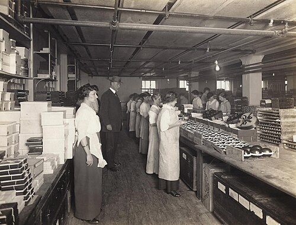
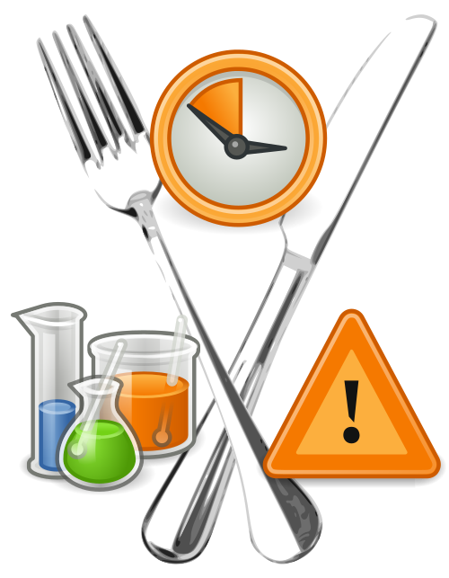

# VIGILÂNCIA SANITÁRIA

Para entender a Vigilância Sanitária (VISA), você precisa primeiro esquecer a ideia de que ela serve apenas para fechar restaurantes com comida estragada. Na prova de residência, a VISA é tratada como um dos pilares fundamentais da Proteção da Saúde. Enquanto a Vigilância Epidemiológica foca no doente e no agravo (o "depois" ou o "durante"), a Vigilância Sanitária foca no risco (o "antes").

A definição clássica, que você deve ter na ponta da língua porque cai literalmente conforme o texto da Lei 8.080/1990, é: um conjunto de ações capaz de eliminar, diminuir ou prevenir riscos à saúde e de intervir nos problemas sanitários decorrentes do meio ambiente, da produção e circulação de bens e da prestação de serviços de interesse da saúde.

Perceba a abrangência: ela controla desde a qualidade da água que você bebe até a radiação do aparelho de raio-x que você opera, passando pelo registro do medicamento que você prescreve.

## O Sistema Nacional de Vigilância Sanitária (SNVS)

O SNVS não é um órgão único, mas uma rede. No topo, temos a ANVISA (Agência Nacional de Vigilância Sanitária), uma autarquia sob regime especial, vinculada ao Ministério da Saúde, mas com independência administrativa.

A divisão de competências é um tema recorrente. A ANVISA cuida do que é estratégico e nacional: portos, aeroportos, fronteiras, registro de novos medicamentos e agrotóxicos. Os estados e municípios dividem a execução da fiscalização direta.

Um erro comum em provas é achar que o município pode tudo. Na verdade, a Vigilância Sanitária Municipal foca em serviços de baixa e média complexidade local, mas sempre seguindo as normas federais. Se um fiscal municipal interdita um estabelecimento por risco iminente, ele está exercendo o chamado Poder de Polícia Administrativa. Isso significa que a administração pública pode restringir direitos individuais (como o de comercializar algo) em prol do interesse coletivo.

## Vigilância Sanitária vs. Vigilância Epidemiológica

Esta é a confusão favorita das bancas. Vamos traçar uma linha clara.

Imagine um surto de Doença Transmitida por Alimentos (DTA) em uma escola.
A Vigilância Epidemiológica (VE) vai contar os casos, definir o período de incubação, identificar os sintomas e isolar os doentes. Ela olha para a doença.
A Vigilância Sanitária (VISA) vai até a cozinha da escola, checa a temperatura do freezer, a validade dos produtos, a higiene dos manipuladores e coleta amostras do alimento suspeito. Ela olha para a causa e o risco ambiental.

| Característica | Vigilância Epidemiológica | Vigilância Sanitária |
| --- | --- | --- |
| Foco principal | Doenças e agravos (notificação) | Riscos (produtos, serviços, ambiente) |
| Objeto | Indivíduos e populações doentes | Bens de consumo e prestação de serviços |
| Ação típica | Investigação de surtos e vacinação | Fiscalização, registro e interdição |
| Exemplo | Notificar um caso de Dengue | Licenciar um novo repelente para Zika |

Lembre-se: elas se intersecionam na vigilância de fatores ambientais. Se a qualidade da água está ruim, a VISA atua no controle da potabilidade, enquanto a VE monitora o aumento de casos de diarreia.

## Controle de Infecção Hospitalar (IRAS)

Aqui entramos no campo onde o médico mais interage com a VISA. As Infecções Relacionadas à Assistência à Saúde (IRAS) são alvos prioritários. Toda instituição de saúde deve ter uma CCIH (Comissão de Controle de Infecção Hospitalar) e um PCIH (Programa de Controle de Infecção Hospitalar).

A CCIH é o "cérebro" do hospital para infecções. Ela faz a vigilância epidemiológica das infecções nosocomiais, mas as medidas que ela impõe (como protocolos de limpeza e esterilização) são normas de vigilância sanitária.

### A Medida Mais Eficaz: Higienização das Mãos

Se você tiver que chutar uma única medida para prevenir infecção hospitalar, chute lavagem das mãos. É a medida isolada mais eficaz e barata.
A lavagem com água e sabonete é obrigatória quando as mãos estão visivelmente sujas ou após contato com fluidos corporais. O álcool gel pode substituir a lavagem em situações de rotina onde não há sujidade visível, sendo mais rápido e garantindo melhor adesão.

### Precauções e Isolamentos

As bancas amam cobrar qual máscara usar em cada situação. No MedEvo, sempre reforçamos: entenda o tamanho da partícula.

- Precaução Padrão: Para TODOS os pacientes. Luvas e avental se houver risco de contato com sangue/fluidos.

- Precaução de Contato: Para germes multirresistentes (KPC, ESBL) ou infecções como escabiose. Exige luvas e avental para qualquer entrada no quarto. O isolamento deve ser mantido mesmo que o paciente esteja usando antibiótico, até que a colonização seja descartada por culturas.

- Precaução de Gotículas: Partículas > 5 micra (pesadas, caem rápido). Exemplo: Meningite bacteriana, Coqueluche, Influenza. Uso de máscara cirúrgica pelo profissional.

- Precaução de Aerossóis: Partículas < 5 micra (leves, flutuam). Exemplo: Tuberculose, Sarampo, Varicela, COVID-19 (em procedimentos específicos). Uso de máscara N95 ou PFF2. O quarto deve ter, idealmente, pressão negativa e filtro HEPA.

Cuidado com a pegadinha da COVID-19: A transmissão principal é por gotículas, mas em Procedimentos Geradores de Aerossóis (PGA) como intubação, VNI, RCP e broncoscopia, a precaução DEVE ser para aerossóis (N95).

## Farmacovigilância e o Sistema NOTIVISA

A VISA não para quando o remédio chega na farmácia. Ela continua monitorando através da Farmacovigilância.
O NOTIVISA é o sistema informatizado para notificar eventos adversos (EA) e queixas técnicas (QT) de produtos sob vigilância.

O que notificar?

- Reações adversas a medicamentos (RAM).

- Inefetividade terapêutica (o remédio não fez efeito).

- Erros de medicação que causaram dano.

- Eventos adversos com equipamentos médicos (Tecnovigilância).

Pérola de prova: O NOTIVISA aceita notificações de quase tudo sob a alçada da ANVISA, EXCETO alimentos. Surto por alimento é notificado via sistemas específicos da Vigilância Epidemiológica e Sanitária local, não pelo NOTIVISA.

Outro ponto importante: Automedicação não é um evento adverso a ser notificado como falha do produto. É um problema de educação em saúde. Já um Evento Adverso Grave é aquele que leva ao óbito, risco de vida, hospitalização prolongada ou anomalia congênita.

## Vigilância Sanitária e Saúde do Trabalhador

A VISA também atua no ambiente de trabalho para prevenir doenças ocupacionais. Ela fiscaliza as condições ergonômicas e a exposição a agentes químicos e biológicos.

### Patologias Ocupacionais Clássicas em Provas

- Saturnismo (Chumbo): Comum em trabalhadores de fábricas de baterias ou tintas. Quadro clínico: dor abdominal (cólica saturnina), linha de Burton na gengiva, anemia e neuropatia motora (queda do punho).

- Asbestose/Amianto: A exposição ao amianto (proibido no Brasil, mas com passivo ambiental) está diretamente ligada ao Mesotelioma de pleura e ao câncer de pulmão.

- Paraquat: Um herbicida extremamente tóxico. A ingestão ou exposição severa causa fibrose pulmonar progressiva e fulminante por lesão dos pneumócitos tipo II e redução do surfactante.

- Agrotóxicos: A VISA regula o dossiê toxicológico. A exposição crônica está associada a distúrbios endócrinos e neoplasias hepáticas (como as aflatoxinas, que embora sejam toxinas de fungos em grãos, são monitoradas pela VISA pelo risco de carcinoma hepatocelular).

## Segurança do Paciente

A RDC 36/2013 da ANVISA instituiu as ações para a segurança do paciente. Todo hospital deve ter um Núcleo de Segurança do Paciente (NSP).
As metas internacionais de segurança do paciente são temas frequentes:

- Identificação correta do paciente (nome completo e data de nascimento, nunca o número do leito).

- Comunicação efetiva.

- Melhora na segurança dos medicamentos de alta vigilância.

- Cirurgia segura (local correto, procedimento correto, paciente correto).

- Redução do risco de infecções (higienização das mãos).

- Redução do risco de quedas e lesões por pressão.

## Doenças Transmitidas por Alimentos (DTA)

A investigação de um surto de DTA é um trabalho de detetive. A VISA busca o "alimento veículo".
Para identificar o culpado, usamos a Taxa de Ataque. O alimento suspeito é aquele que apresenta a maior diferença entre a taxa de ataque de quem comeu e a taxa de ataque de quem não comeu.

Exemplo clínico: Em um casamento, 50 pessoas comeram maionese e 40 passaram mal (80%). 50 pessoas não comeram maionese e 5 passaram mal (10%). A diferença é de 70%. Esse é o seu principal suspeito.

### Agentes Comuns

- Bacillus cereus: Clássico do arroz mal conservado. Tem duas formas: emética (1-6h após comer) e diarreica (6-16h).

- Staphylococcus aureus: Início muito rápido (2-6h), com muito vômito, geralmente por manipulação inadequada (o cozinheiro com ferimento na mão).

- Salmonella: Início mais tardio (12-36h), com febre e diarreia inflamatória.

## Vigilância Sentinela

Diferente da vigilância universal (onde todos os casos devem ser notificados), a Vigilância Sentinela utiliza unidades de saúde selecionadas (unidades sentinelas) para monitorar a ocorrência de determinados eventos.
Por que fazemos isso? Porque é mais barato e eficiente para monitorar tendências. Por exemplo, não notificamos todo caso de gripe no Brasil, mas as unidades sentinelas de síndrome gripal coletam amostras para saber qual vírus está circulando (H1N1, H3N2, etc.) e orientar a vacina do ano seguinte.

## Gerenciamento de Resíduos de Serviços de Saúde (RSS)

A VISA também dita como o médico deve jogar o lixo fora. A classificação dos resíduos é essencial:

- Grupo A (Biológico): Sangue, secreções, peças anatômicas. Saco branco leitoso.

- Grupo B (Químico): Medicamentos quimioterápicos, reagentes de laboratório.

- Grupo C (Rejeitos Radioativos).

- Grupo D (Comum): Lixo de banheiro, papel de escritório. Saco preto ou cinza.

- Grupo E (Perfurocortantes): Agulhas, ampolas, bisturis. Caixa rígida (Descarpack). Nunca reencape agulhas! Isso é a causa número um de acidentes biológicos ocupacionais.

## Acidentes com Material Biológico

Se você se furar com uma agulha de um paciente com HIV ou Hepatite, a conduta deve ser imediata.

- Lavar o local com água e sabão (não usar antissépticos abrasivos).

- Notificar o acidente (CAT para o INSS se for celetista, e SINAN para o Ministério da Saúde).

- Avaliar o paciente fonte (se conhecido) e o acidentado.

- Profilaxia Pós-Exposição (PEP): Deve ser iniciada idealmente nas primeiras 2 horas, no máximo até 72 horas.

Para Hepatite C, não existe vacina nem profilaxia medicamentosa eficaz pós-exposição. O acompanhamento é feito com sorologia e, se houver viragem (Anti-HCV reagente), solicita-se o HCV-RNA para confirmar infecção ativa e tratar.

## Tabelas Comparativas para Fixação

### Tabela 1: Níveis de Desinfecção e Esterilização

| Nível | O que elimina | Onde usar |
| --- | --- | --- |
| Esterilização | Todos os microrganismos + Esporos | Artigos Críticos (entram em tecidos estéreis ou vasos: bisturi, agulhas) |
| Desinfecção de Alto Nível | Maioria dos microrganismos + alguns esporos | Artigos Semicríticos (contato com mucosa íntegra: endoscópios, espéculos) |
| Desinfecção de Médio Nível | M. tuberculosis, vírus e fungos (NÃO esporos) | Superfícies e artigos não críticos com risco de contaminação |
| Desinfecção de Baixo Nível | Bactérias vegetativas e alguns vírus | Artigos Não Críticos (contato com pele íntegra: estetoscópio, manguito) |

### Tabela 2: Diferenciação de Precauções Hospitalares

| Tipo de Isolamento | Equipamento (EPI) | Exemplos de Doenças |
| --- | --- | --- |
| Padrão | Luvas/Avental (se risco de fluido) | Todos os pacientes |
| Contato | Luvas + Avental obrigatórios | KPC, Escabiose, Clostridium difficile |
| Gotículas | Máscara Cirúrgica | Meningite, Influenza, Coqueluche |
| Aerossóis | Máscara N95 / PFF2 | Tuberculose, Sarampo, Varicela |

### Tabela 3: Vigilância de Produtos (ANVISA)

| Categoria | Papel da Vigilância Sanitária |
| --- | --- |
| Medicamentos | Registro, controle de propaganda, farmacovigilância |
| Sangue/Hemoderivados | Hemovigilância, inspeção de hemocentros |
| Agrotóxicos | Avaliação do dossiê toxicológico e resíduos em alimentos |
| Tabaco | Proibição de aditivos, regulação de cigarros eletrônicos (EVALI) |
| Saneantes | Registro de produtos de limpeza hospitalar e domiciliar |

## Situações Especiais e Pegadinhas de Prova

### Cigarros Eletrônicos (Vapes)

A ANVISA mantém a proibição da comercialização no Brasil. O termo EVALI (E-cigarette or Vaping product use-Associated Lung Injury) refere-se à lesão pulmonar aguda causada por esses dispositivos. Na prova, se perguntarem quem regula ou proíbe: Vigilância Sanitária.

### Portos e Aeroportos

A ANVISA é a autoridade sanitária nesses locais. Se um navio chega com suspeita de uma doença de importância internacional (como Ebola ou uma nova variante de COVID), é a ANVISA quem decide sobre a "Livre Prática" (autorização para o navio operar).

### SISVAN (Sistema de Vigilância Alimentar e Nutricional)

Muitos alunos acham que o SISVAN é só para crianças. Errado! Ele monitora o estado nutricional de toda a população atendida na Atenção Primária. Os marcadores incluem peso, estatura e consumo alimentar (geralmente questionando o que foi comido no dia anterior). É uma ferramenta de vigilância que ajuda a VISA e a VE a planejarem ações contra a obesidade e DCNT (Doenças Crônicas Não Transmissíveis).

### O Caso do Paraquat

Dr. Will costuma lembrar em suas aulas que o Paraquat é o "veneno do pulmão". Em provas de Medicina do Trabalho ou Preventiva, se aparecer um trabalhador rural com dispneia progressiva e imagem de fibrose após exposição a herbicida, não pense duas vezes. A Vigilância Sanitária atua aqui na restrição e regulação desse uso.

## Investigação de Surtos: O Passo a Passo

Quando a VISA e a VE trabalham juntas em um surto, seguem uma lógica:

- Confirmar o diagnóstico (é um surto mesmo ou casos isolados?).

- Confirmar a existência do surto (o número de casos está acima do limite endêmico?).

- Caracterizar o surto (tempo, lugar e pessoa).

- Formular hipóteses (qual o alimento? qual a fonte?).

- Medidas de controle (interditar a cozinha, recolher produtos).

Lembre-se: Mesmo que o alimento suspeito já tenha acabado ou sido jogado fora, a Vigilância Sanitária DEVE investigar a fonte. Ela vai olhar o processo de produção para evitar que novos lotes saiam contaminados.

## Ética e Sigilo na Vigilância

A notificação compulsória de doenças (VE) ou de eventos adversos (VISA) não viola o sigilo médico. É um dever legal do profissional de saúde. O sigilo é mantido para o público externo, mas as autoridades sanitárias têm acesso aos dados para proteger a coletividade.

## Pontos-Chave para Prova 💡

- Vigilância Sanitária (VISA) foca no RISCO (produtos, serviços, ambiente). Vigilância Epidemiológica (VE) foca no AGRAVO (doença).

- A medida mais eficaz para prevenir infecção hospitalar é a higienização das mãos.

- Máscara N95/PFF2 é para aerossóis (TB, Sarampo, Varicela e procedimentos de via aérea na COVID-19).

- Máscara Cirúrgica é para gotículas (Meningite, Influenza).

- O NOTIVISA é o sistema para eventos adversos e queixas técnicas, mas NÃO para alimentos.

- O Poder de Polícia permite que a VISA interdite estabelecimentos e apreenda produtos sem ordem judicial prévia em caso de risco à saúde.

- Saturnismo (Chumbo) causa anemia e neuropatia motora (punho caído).

- Mesotelioma de pleura é patognomônico de exposição ao Amianto (Asbesto).

- Taxa de Ataque é o cálculo chave para identificar o alimento veículo em surtos de DTA.

- Resíduos perfurocortantes (Grupo E) devem ser descartados em caixas rígidas e NUNCA reencapados.

- A ANVISA é responsável pela vigilância em portos, aeroportos e fronteiras.

- Evento Adverso Grave inclui óbito, risco de vida ou hospitalização prolongada.

- A desinfecção de alto nível não elimina necessariamente todos os esporos bacterianos (isso é papel da esterilização).

- O isolamento de contato para germes multirresistentes deve ser mantido independentemente do uso de antibióticos.

- Erro clássico: Achar que a VISA só cuida de comida. Ela cuida de TUDO que envolve risco à saúde, inclusive sangue, radiação e propaganda de remédios.

- Em acidentes perfurocortantes, a PEP deve ser iniciada o mais rápido possível (ideal < 2h, limite 72h).

- O SISVAN monitora o consumo alimentar e o estado nutricional na APS, sendo um marcador importante para políticas de saúde.

Este material, focado no que o MedEvo e o Dr. Will identificaram como as maiores recorrências em provas, cobre a base necessária para você dominar qualquer questão de Vigilância Sanitária. O segredo é sempre perguntar: "Isso é um risco ambiental/do produto ou é a doença em si?". Se for o risco, a resposta é Vigilância Sanitária.

 Cópia offline para consulta pessoal.
 Fonte original:
 [https://www.medevo.com.br/material-apoio/ler/7881f718-4a86-452f-8635-40ee5f0ee630](https://www.medevo.com.br/material-apoio/ler/7881f718-4a86-452f-8635-40ee5f0ee630)
